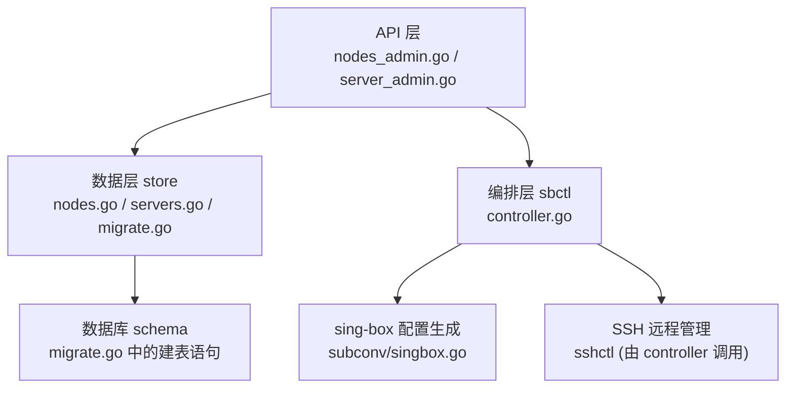
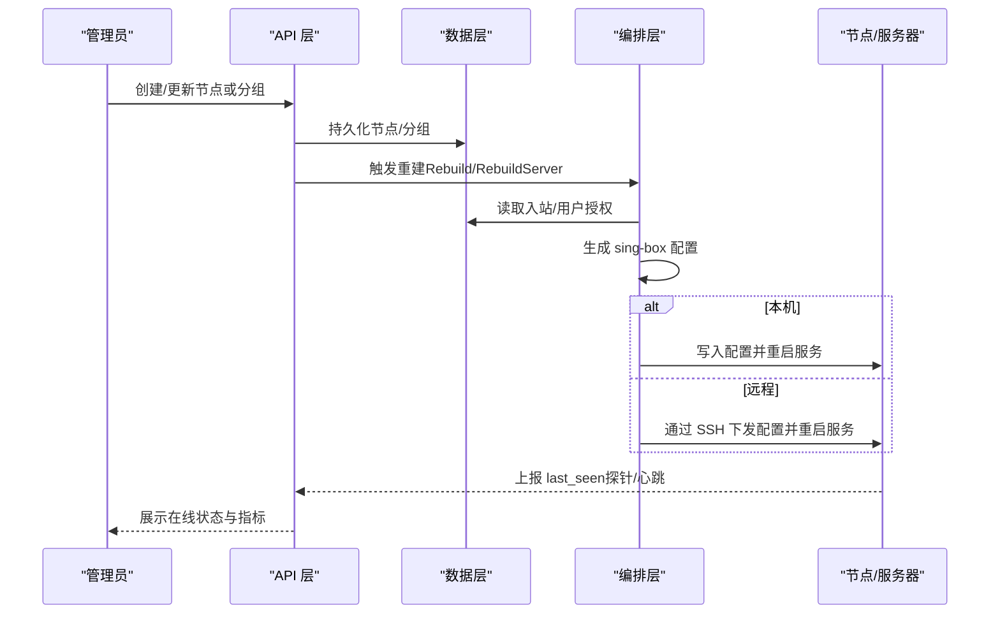
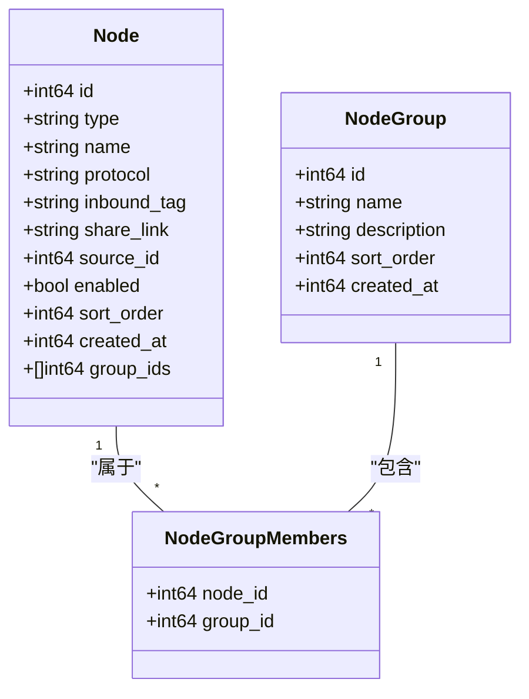
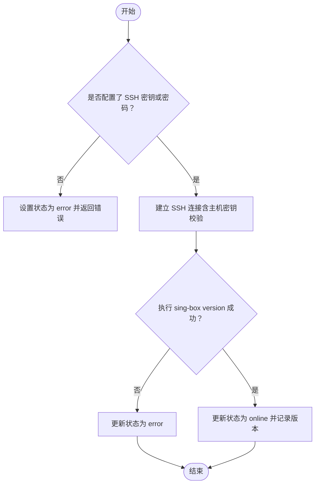
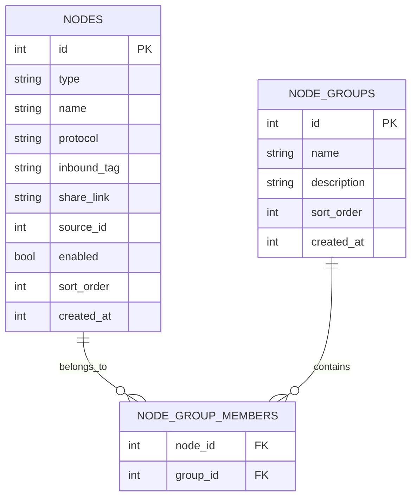
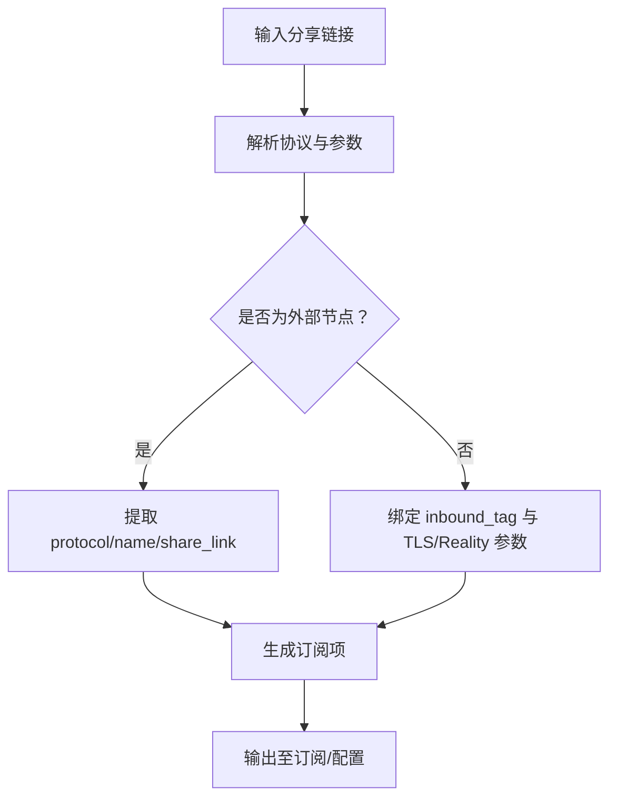
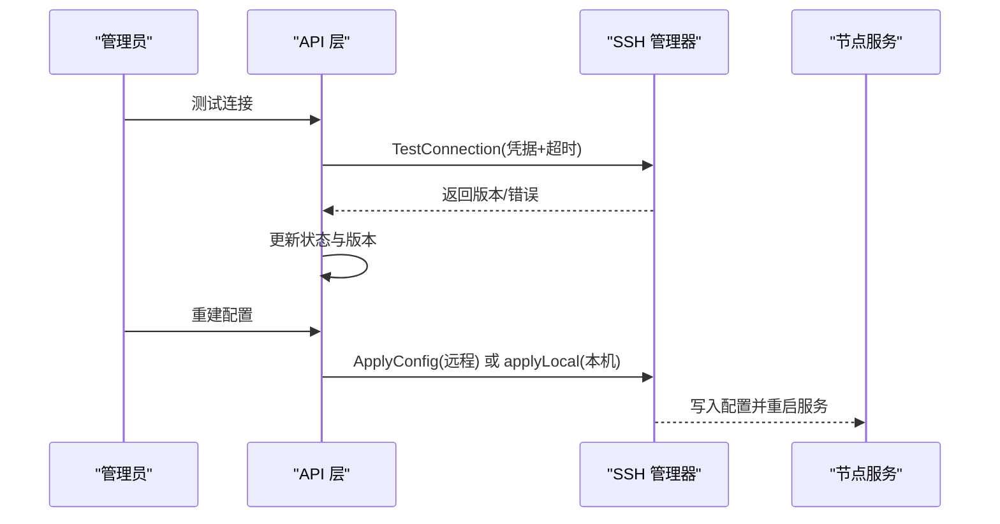
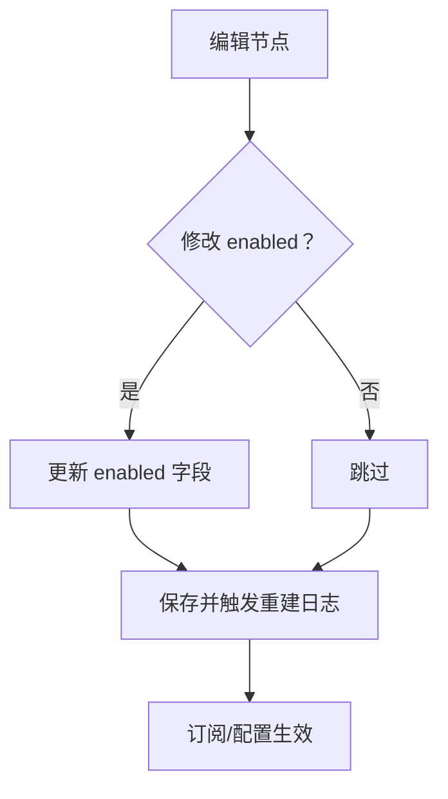
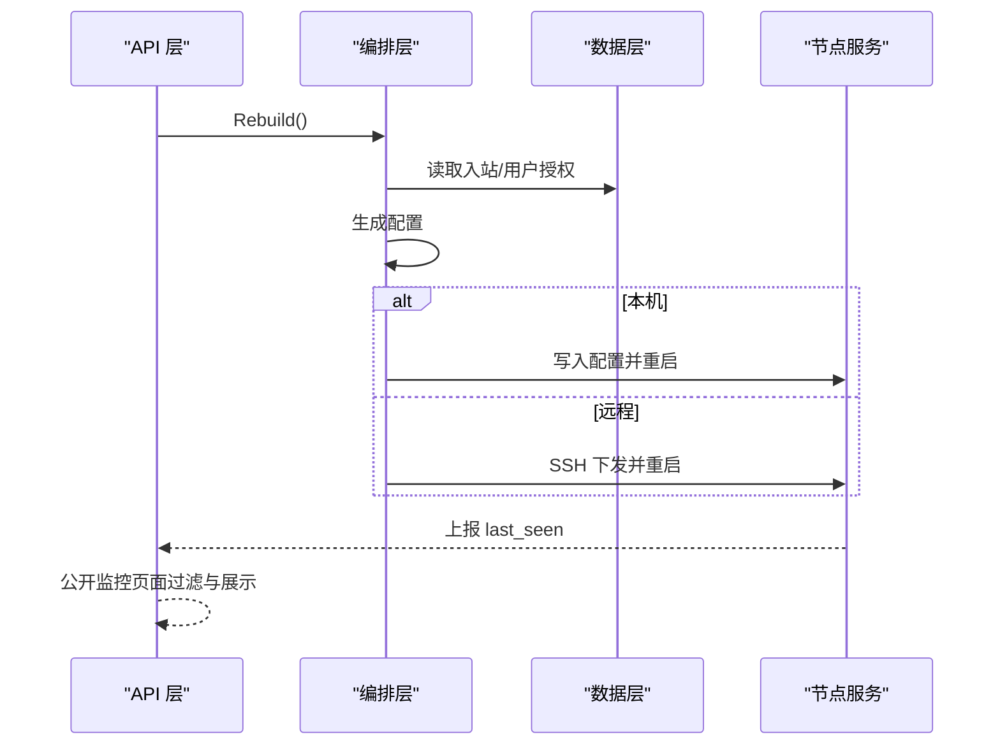
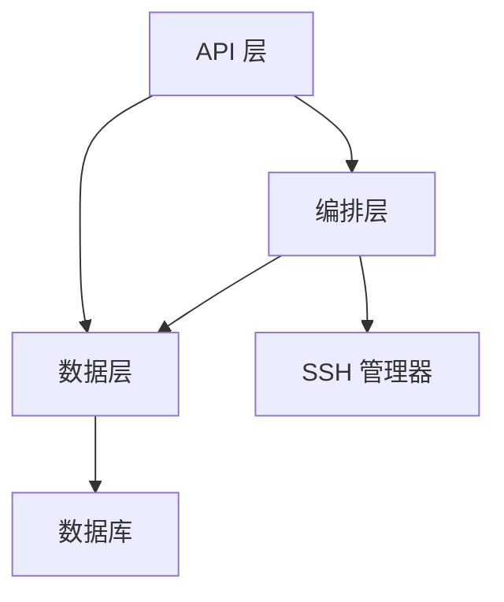

# 节点管理实体

<cite>
**本文引用的文件**
- [nodes.go](file://internal/store/nodes.go)
- [servers.go](file://internal/store/servers.go)
- [migrate.go](file://internal/store/migrate.go)
- [nodes_admin.go](file://internal/api/nodes_admin.go)
- [server_admin.go](file://internal/api/server_admin.go)
- [controller.go](file://internal/sbctl/controller.go)
- [link.go](file://internal/singbox/link.go)
- [singbox.go](file://internal/subconv/singbox.go)
</cite>

## 目录
1. [简介](#简介)
2. [项目结构](#项目结构)
3. [核心组件](#核心组件)
4. [架构总览](#架构总览)
5. [详细组件分析](#详细组件分析)
6. [依赖关系分析](#依赖关系分析)
7. [性能考量](#性能考量)
8. [故障排查指南](#故障排查指南)
9. [结论](#结论)
10. [附录](#附录)

## 简介
本文件围绕“节点管理”相关的数据模型与业务流程，系统化说明以下主题：
- 核心表结构与字段含义：nodes（代理节点）、servers（服务器管理）、node_groups（节点分组）及 node_group_members（成员关系）。
- 节点类型、协议支持、入站标签与分享链接的配置与管理。
- 服务器的 SSH 连接配置与服务管理、状态监控。
- 节点分组的层级与成员关系、权限与可见性控制。
- 节点的启用/禁用、排序与创建时间管理。
- 节点部署、配置下发与状态监控的完整流程。

## 项目结构
与节点管理相关的代码主要分布在以下模块：
- 数据层（store）：定义 nodes、servers、node_groups 等表结构及 CRUD 操作。
- API 层（api）：提供节点、分组、订阅源、服务器管理的 HTTP 接口。
- 编排层（sbctl）：负责 sing-box 配置的生成、校验与下发，以及多机并发应用。
- 协议与链接（singbox/subconv）：负责分享链接构建与订阅格式转换。

图表来源
- [nodes.go:107-135](file://internal/store/migrate.go#L107-L135)
- [servers.go:447-464](file://internal/store/migrate.go#L447-L464)
- [nodes_admin.go:19-109](file://internal/api/nodes_admin.go#L19-L109)
- [server_admin.go:39-165](file://internal/api/server_admin.go#L39-L165)
- [controller.go:357-455](file://internal/sbctl/controller.go#L357-L455)

章节来源
- [nodes.go:107-135](file://internal/store/migrate.go#L107-L135)
- [servers.go:447-464](file://internal/store/migrate.go#L447-L464)
- [nodes_admin.go:19-109](file://internal/api/nodes_admin.go#L19-L109)
- [server_admin.go:39-165](file://internal/api/server_admin.go#L39-L165)
- [controller.go:357-455](file://internal/sbctl/controller.go#L357-L455)

## 核心组件
- 节点（Node）：表示一个代理节点，包含类型、名称、协议、入站标签、分享链接、来源、启用状态、排序与创建时间等。
- 服务器（Server）：表示一台可被面板通过 SSH 管理的机器，包含主机、端口、SSH 认证信息、服务路径、状态与最后在线时间等。
- 节点分组（NodeGroup）与成员（NodeGroupMembers）：用于将多个节点组织为逻辑组，便于权限与订阅输出控制。
- 订阅源（NodeSource）：用于从外部订阅地址批量导入外部节点，并自动关联到分组。

章节来源
- [nodes.go:11-23](file://internal/store/nodes.go#L11-L23)
- [servers.go:22-56](file://internal/store/servers.go#L22-L56)
- [nodes.go:164-170](file://internal/store/nodes.go#L164-L170)
- [nodes.go:239-258](file://internal/store/nodes.go#L239-L258)
- [nodes.go:405-416](file://internal/store/nodes.go#L405-L416)

## 架构总览
节点管理涉及“配置生成—下发—监控”的闭环：
- 管理员在 API 层创建/更新节点与分组，持久化到数据库。
- 编排层根据当前授权与入站配置生成 sing-box 配置，并通过本地或 SSH 下发到目标机器。
- 探针或服务上报 last_seen，API 层暴露公开监控页面。

图表来源
- [nodes_admin.go:48-109](file://internal/api/nodes_admin.go#L48-L109)
- [server_admin.go:186-224](file://internal/api/server_admin.go#L186-L224)
- [controller.go:357-455](file://internal/sbctl/controller.go#L357-L455)
- [monitor.go:781-887](file://internal/api/monitor.go#L781-L887)

## 详细组件分析

### 节点（nodes）表与实体
- 字段与含义
  - id：自增主键
  - type：节点类型，self_built（自建）或 external（外部）
  - name：节点名称
  - protocol：协议（如 vless/tuic/hysteria2/vmess 等），外部节点可从分享链接解析
  - inbound_tag：自建节点对应的 sing-box 入站标签，用于订阅 remark 映射
  - share_link：外部节点的原始分享 URI
  - source_id：来源 ID（来自订阅源）
  - enabled：是否启用
  - sort_order：全局排序，影响节点页与订阅输出顺序
  - created_at：创建时间戳
- 关键能力
  - 列表与排序：按 sort_order、id 排序；删除时级联清理成员关系
  - 分组关联：SetNodeGroups/NodeGroupIDs 维护多对多关系
  - 自建节点名称映射：SelfBuiltNodeNames 将 inbound_tag 映射到显示名
  - 订阅源导入：ReplaceSourceNodes 批量替换外部节点并记录抓取结果

图表来源
- [nodes.go:11-23](file://internal/store/nodes.go#L11-L23)
- [nodes.go:164-170](file://internal/store/nodes.go#L164-L170)
- [migrate.go:107-135](file://internal/store/migrate.go#L107-L135)

章节来源
- [nodes.go:11-23](file://internal/store/nodes.go#L11-L23)
- [nodes.go:40-127](file://internal/store/nodes.go#L40-L127)
- [nodes.go:129-160](file://internal/store/nodes.go#L129-L160)
- [nodes.go:239-258](file://internal/store/nodes.go#L239-L258)
- [nodes.go:405-416](file://internal/store/nodes.go#L405-L416)
- [migrate.go:107-135](file://internal/store/migrate.go#L107-L135)

### 服务器（servers）表与实体
- 字段与含义
  - id：自增主键
  - name：服务器名称
  - host/port：SSH 连接地址与端口
  - ssh_user/ssh_key/ssh_key_pass/ssh_password：SSH 认证方式
  - config_path/systemd_unit/sing_box_bin/v2ray_listen：服务路径、systemd 单元、二进制位置、统计监听地址
  - enabled/status/last_seen：启用状态、运行状态、最后在线时间
  - created_at/updated_at：创建与更新时间
  - probe_enabled/probe_token/expiry_date/provider/location/spec/price/notes：探针开关、令牌、到期日、云厂商、位置、规格、价格、备注
  - public_visible：是否在公开监控页面可见
  - host_key：首次成功连接后固定的 SSH 主机密钥（TOFU）
- 关键能力
  - 安全存储：敏感字段加密存储，返回前脱敏
  - 连接测试：TestConnection 验证 SSH 连通并记录版本
  - 主机密钥固定：SetServerHostKey 支持 TOFU 与重置
  - 状态更新：UpdateServerStatus/TouchProbeSeen 维护 online/offline 状态

图表来源
- [server_admin.go:186-224](file://internal/api/server_admin.go#L186-L224)
- [servers.go:152-182](file://internal/store/servers.go#L152-L182)
- [migrate.go:447-464](file://internal/store/migrate.go#L447-L464)

章节来源
- [servers.go:22-56](file://internal/store/servers.go#L22-L56)
- [servers.go:86-132](file://internal/store/servers.go#L86-L132)
- [servers.go:152-182](file://internal/store/servers.go#L152-L182)
- [server_admin.go:186-224](file://internal/api/server_admin.go#L186-L224)
- [migrate.go:447-464](file://internal/store/migrate.go#L447-L464)

### 节点分组（node_groups）与成员（node_group_members）
- 分组表
  - id/name/description/sort_order/created_at：分组基本信息与排序
- 成员表
  - node_id/group_id：多对多关系，支持一个节点属于多个分组
- 权限与可见性
  - AccessibleGroupIDs：计算用户可访问的分组集合（免费分组 + 有效套餐绑定分组）
  - NodesInGroups/NodesInGroupsTagged：查询指定分组内的启用节点，并按最小匹配分组标注

图表来源
- [migrate.go:107-135](file://internal/store/migrate.go#L107-L135)
- [nodes.go:239-258](file://internal/store/nodes.go#L239-L258)
- [nodes.go:294-326](file://internal/store/nodes.go#L294-L326)

章节来源
- [nodes.go:164-210](file://internal/store/nodes.go#L164-L210)
- [nodes.go:239-258](file://internal/store/nodes.go#L239-L258)
- [nodes.go:294-326](file://internal/store/nodes.go#L294-L326)
- [migrate.go:107-135](file://internal/store/migrate.go#L107-L135)

### 节点类型、协议、入站标签与分享链接
- 节点类型
  - self_built：自建节点，需绑定 sing-box 入站标签（inbound_tag），用于订阅 remark 映射与权限控制
  - external：外部节点，使用 share_link 原始分享 URI，protocol 可由解析器推断
- 协议支持
  - 通过 subconv/singbox 解析与渲染，支持 vless/tuic/hysteria2/vmess/ss/anytls 等
  - 分享链接参数包含 TLS、SNI、Reality、ALPN、Mux、Brutal、NoUDP 等
- 入站标签
  - SelfBuiltNodeNames 将 inbound_tag 映射到节点名称，提升订阅可读性
  - SelfBuiltNodeGroupIDs 根据 inbound_tag 查找对应分组，用于权限判定

图表来源
- [link.go:12-113](file://internal/singbox/link.go#L12-L113)
- [link.go:206-418](file://internal/singbox/link.go#L206-L418)
- [nodes.go:72-96](file://internal/store/nodes.go#L72-L96)
- [nodes.go:260-267](file://internal/store/nodes.go#L260-L267)

章节来源
- [nodes.go:72-96](file://internal/store/nodes.go#L72-L96)
- [nodes.go:260-267](file://internal/store/nodes.go#L260-L267)
- [link.go:12-113](file://internal/singbox/link.go#L12-L113)
- [link.go:206-418](file://internal/singbox/link.go#L206-L418)

### 服务器 SSH 连接配置与服务管理
- SSH 配置
  - host/port/ssh_user/ssh_key/ssh_key_pass/ssh_password：支持密钥与密码两种认证
  - config_path/systemd_unit/sing_box_bin：服务配置文件路径、systemd 单元名、二进制路径
  - v2ray_listen：v2ray_api 统计监听地址，用于流量采集
- 服务管理
  - TestConnection：测试 SSH 连通并记录版本
  - Rebuild/RebuildServer：生成并下发 sing-box 配置，支持本机直接应用或远程 SSH 下发
  - Clear Host Key：清除固定主机密钥并重新 TOFU，避免 MITM 风险

图表来源
- [server_admin.go:186-224](file://internal/api/server_admin.go#L186-L224)
- [server_admin.go:241-282](file://internal/api/server_admin.go#L241-L282)
- [controller.go:204-280](file://internal/sbctl/controller.go#L204-L280)
- [controller.go:457-522](file://internal/sbctl/controller.go#L457-L522)

章节来源
- [servers.go:86-132](file://internal/store/servers.go#L86-L132)
- [server_admin.go:186-224](file://internal/api/server_admin.go#L186-L224)
- [server_admin.go:241-282](file://internal/api/server_admin.go#L241-L282)
- [controller.go:204-280](file://internal/sbctl/controller.go#L204-L280)
- [controller.go:457-522](file://internal/sbctl/controller.go#L457-L522)

### 节点启用/禁用、排序与创建时间管理
- 启用/禁用
  - enabled 字段控制节点是否参与订阅与配置生成
  - 删除节点时级联清理成员关系
- 排序
  - sort_order 全局排序，ReorderNodes 批量更新顺序，影响节点页与订阅输出
- 创建时间
  - created_at 在创建时写入，用于审计与排序辅助

图表来源
- [nodes.go:98-127](file://internal/store/nodes.go#L98-L127)
- [nodes.go:129-145](file://internal/store/nodes.go#L129-L145)
- [nodes.go:147-160](file://internal/store/nodes.go#L147-L160)
- [nodes_admin.go:48-109](file://internal/api/nodes_admin.go#L48-L109)

章节来源
- [nodes.go:98-145](file://internal/store/nodes.go#L98-L145)
- [nodes.go:147-160](file://internal/store/nodes.go#L147-L160)
- [nodes_admin.go:48-109](file://internal/api/nodes_admin.go#L48-L109)

### 节点部署、配置下发与状态监控流程
- 配置生成
  - BuildSingboxConfig/BuildSingboxConfigForServer 组装入站、TLS、用户授权与路由规则
- 下发策略
  - 本机：直接写入配置并 systemctl 重启
  - 远程：通过 SSH 下发并重启服务，支持并发与超时控制
- 状态监控
  - 探针上报 last_seen，公开监控页面过滤 ProbeEnabled/PublicVisible
  - 版本探测：SupportsStatsAPI 判断节点是否具备 v2ray_api 插件

图表来源
- [controller.go:357-455](file://internal/sbctl/controller.go#L357-L455)
- [controller.go:548-649](file://internal/sbctl/controller.go#L548-L649)
- [monitor.go:781-887](file://internal/api/monitor.go#L781-L887)

章节来源
- [controller.go:357-455](file://internal/sbctl/controller.go#L357-L455)
- [controller.go:548-649](file://internal/sbctl/controller.go#L548-L649)
- [monitor.go:781-887](file://internal/api/monitor.go#L781-L887)

## 依赖关系分析
- API 层依赖数据层进行持久化，并触发编排层进行配置重建。
- 编排层依赖数据层获取入站与授权信息，依赖 SSH 管理器进行远程操作。
- 数据层通过迁移脚本维护数据库 schema，确保向后兼容。

图表来源
- [nodes_admin.go:19-109](file://internal/api/nodes_admin.go#L19-L109)
- [server_admin.go:39-165](file://internal/api/server_admin.go#L39-L165)
- [controller.go:357-455](file://internal/sbctl/controller.go#L357-L455)
- [migrate.go:107-135](file://internal/store/migrate.go#L107-L135)

章节来源
- [nodes_admin.go:19-109](file://internal/api/nodes_admin.go#L19-L109)
- [server_admin.go:39-165](file://internal/api/server_admin.go#L39-L165)
- [controller.go:357-455](file://internal/sbctl/controller.go#L357-L455)
- [migrate.go:107-135](file://internal/store/migrate.go#L107-L135)

## 性能考量
- 并发下发：远程节点配置下发采用 goroutine 并发，避免单点阻塞。
- 超时控制：每个远程操作设置超时，防止不可达节点导致整体卡顿。
- 缓存能力：v2ray_api 能力探测结果缓存，减少重复探测开销。
- 批量更新：ReorderNodes 使用事务批量更新排序，保证一致性。

[本节为通用指导，不直接分析具体文件]

## 故障排查指南
- SSH 连接失败
  - 检查 SSH 凭据是否正确，确认主机密钥是否已固定或需要重置
  - 使用测试连接接口验证连通性与版本
- 配置下发失败
  - 查看编排层日志，确认配置生成与校验是否通过
  - 检查本机或远程服务的 systemd 单元是否正常
- 状态异常
  - 确认探针是否启用且 token 正确
  - 检查 last_seen 是否更新，公开监控页面是否过滤

章节来源
- [server_admin.go:186-224](file://internal/api/server_admin.go#L186-L224)
- [server_admin.go:241-282](file://internal/api/server_admin.go#L241-L282)
- [controller.go:357-455](file://internal/sbctl/controller.go#L357-L455)
- [monitor.go:781-887](file://internal/api/monitor.go#L781-L887)

## 结论
本系统通过清晰的数据模型与分层架构，实现了节点与服务器的高效管理。节点类型、协议、入站标签与分享链接的组合提供了灵活的接入方式；服务器 SSH 配置与服务管理确保了可靠的部署与运维；分组机制与权限控制使得资源分配更加精细。配合自动化配置下发与状态监控，形成了完整的节点生命周期管理能力。

[本节为总结性内容，不直接分析具体文件]

## 附录
- 数据库 schema 参考：migrate.go 中的建表语句
- 分享链接参数参考：link.go 中的 LinkParams 与 BuildShareLink
- 订阅格式转换参考：subconv/singbox.go 中的 Singbox 函数

章节来源
- [migrate.go:107-135](file://internal/store/migrate.go#L107-L135)
- [link.go:12-113](file://internal/singbox/link.go#L12-L113)
- [link.go:206-418](file://internal/singbox/link.go#L206-L418)
- [singbox.go:10-45](file://internal/subconv/singbox.go#L10-L45)
