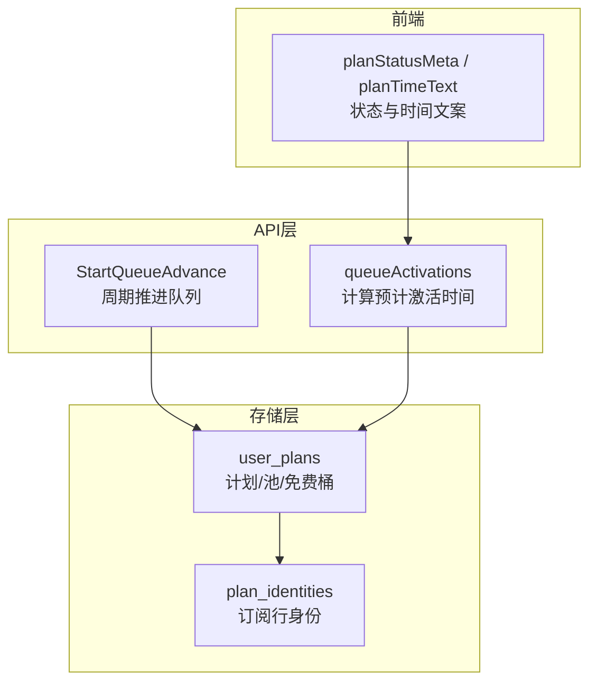
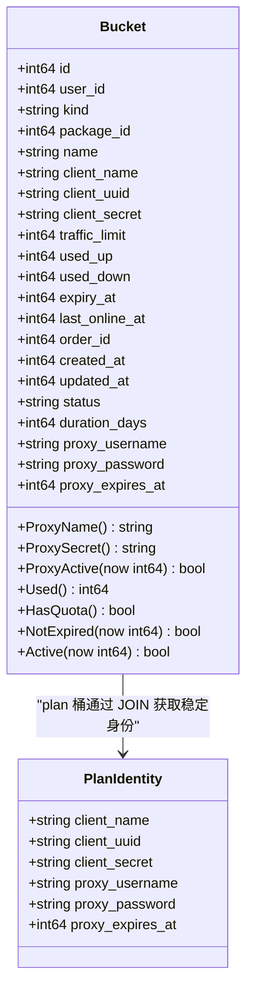
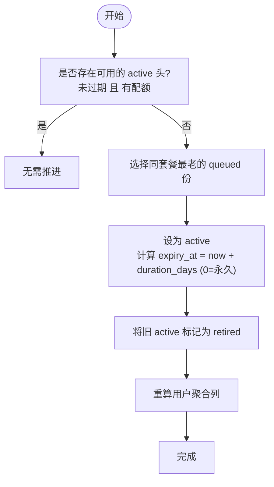
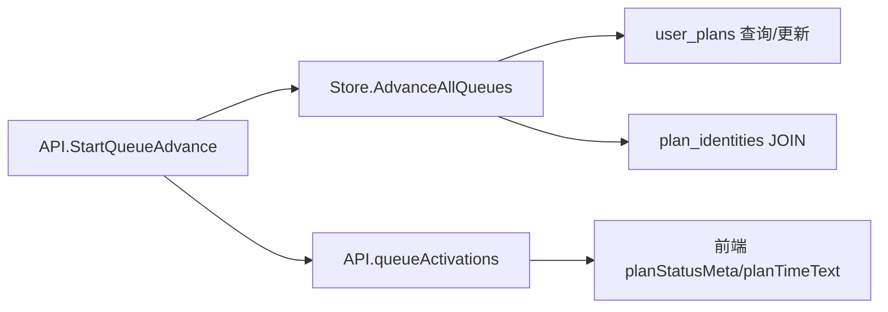

# 核心数据模型

<cite>
**本文引用的文件**
- [internal/store/userplans.go](file://internal/store/userplans.go)
- [internal/store/migrate.go](file://internal/store/migrate.go)
- [internal/api/queue_advance.go](file://internal/api/queue_advance.go)
- [internal/api/user.go](file://internal/api/user.go)
- [frontend/src/utils/plan.ts](file://frontend/src/utils/plan.ts)
</cite>

## 目录
1. [简介](#简介)
2. [项目结构](#项目结构)
3. [核心组件](#核心组件)
4. [架构总览](#架构总览)
5. [详细组件分析](#详细组件分析)
6. [依赖关系分析](#依赖关系分析)
7. [性能考量](#性能考量)
8. [故障排查指南](#故障排查指南)
9. [结论](#结论)

## 简介
本文聚焦用户套餐的核心数据模型，围绕 user_plans 表与 plan_identities 表的设计、Bucket 结构与业务含义、套餐队列（排队与激活）机制、免费流量桶与通用流量池的管理方式展开。目标是让读者在不深入代码的情况下也能理解“每份独立计量、身份稳定、队列推进”的整体设计。

## 项目结构
- 数据模型与存储逻辑集中在 internal/store 中，user_plans 的建表与迁移在 migrate.go；Bucket 类型、状态判定、队列推进等核心逻辑在 userplans.go。
- API 层提供队列推进的定时任务与激活时间估算：queue_advance.go 负责周期性扫描并推进到期/耗尽的队列；user.go 中的 queueActivations 用于前端展示“预计生效时间”。
- 前端使用 frontend/src/utils/plan.ts 对状态进行统一渲染（使用中/排队中/已过期/已用尽）。



图表来源
- [internal/store/migrate.go:344-401](file://internal/store/migrate.go#L344-L401)
- [internal/store/userplans.go:577-607](file://internal/store/userplans.go#L577-L607)
- [internal/api/queue_advance.go:32-68](file://internal/api/queue_advance.go#L32-L68)
- [internal/api/user.go:592-643](file://internal/api/user.go#L592-L643)
- [frontend/src/utils/plan.ts:10-28](file://frontend/src/utils/plan.ts#L10-L28)

章节来源
- [internal/store/migrate.go:344-401](file://internal/store/migrate.go#L344-L401)
- [internal/store/userplans.go:577-607](file://internal/store/userplans.go#L577-L607)
- [internal/api/queue_advance.go:32-68](file://internal/api/queue_advance.go#L32-L68)
- [internal/api/user.go:592-643](file://internal/api/user.go#L592-L643)
- [frontend/src/utils/plan.ts:10-28](file://frontend/src/utils/plan.ts#L10-L28)

## 核心组件
- user_plans：每个用户的“桶”（bucket），按 kind 区分 plan/pool/free。每个桶独立计量、独立配额、独立有效期，并拥有独立的 sing-box 身份标识。
- plan_identities：按（用户, 套餐）维度的“订阅行”，承载稳定的 client_name/client_uuid/client_secret 以及可选的代理凭据。一份套餐可有多份购买记录（多份桶），但只对应一条身份行，避免切换时客户端掉线。
- Bucket：Go 结构体，封装了桶的元数据、配额、用量、有效期、状态、时长、代理凭据及活跃性判断方法。
- 队列机制：同一套餐的多份购买形成 FIFO 队列，active 头可用则排队等待；当 active 头过期或耗尽，最老的 queued 份被提升为 active，原 active 标记为 retired。
- 免费桶与通用池：free 桶无配额且永不失效，专用于免计费节点组；pool 桶是共享流量包，按剩余量扣减，最后消耗。

章节来源
- [internal/store/migrate.go:344-401](file://internal/store/migrate.go#L344-L401)
- [internal/store/userplans.go:577-607](file://internal/store/userplans.go#L577-L607)
- [internal/store/userplans.go:102-139](file://internal/store/userplans.go#L102-L139)
- [internal/store/userplans.go:141-226](file://internal/store/userplans.go#L141-L226)
- [internal/store/userplans.go:394-434](file://internal/store/userplans.go#L394-L434)
- [internal/store/userplans.go:462-498](file://internal/store/userplans.go#L462-L498)

## 架构总览
下图展示了“购买→入队→推进→激活→配置重建”的主流程，以及身份与桶的关系。

```mermaid
sequenceDiagram
participant C as "客户端"
participant API as "API(队列推进)"
participant ST as "Store(userplans)"
participant DB as "数据库(user_plans, plan_identities)"
C->>ST : 购买套餐
ST->>DB : 创建 plan 桶(kind=plan, status=queued)
ST->>DB : 确保 plan_identities 存在(首次购买生成)
Note over ST,DB : 每份购买独立计量; 身份按(用户,套餐)稳定
API->>ST : 周期扫描/读前推进
ST->>DB : 检查是否有可用的 active 头
alt 无可用头
ST->>DB : 将最老 queued 份提升为 active
ST->>DB : 将旧 active 标记为 retired
ST-->>API : 返回变更用户列表
API-->>C : 触发配置重建/推送
else 有可用头
ST-->>API : 无需推进
end
```

图表来源
- [internal/store/userplans.go:28-53](file://internal/store/userplans.go#L28-L53)
- [internal/store/userplans.go:148-226](file://internal/store/userplans.go#L148-L226)
- [internal/api/queue_advance.go:32-68](file://internal/api/queue_advance.go#L32-L68)

章节来源
- [internal/store/userplans.go:28-53](file://internal/store/userplans.go#L28-L53)
- [internal/store/userplans.go:148-226](file://internal/store/userplans.go#L148-L226)
- [internal/api/queue_advance.go:32-68](file://internal/api/queue_advance.go#L32-L68)

## 详细组件分析

### user_plans 表结构设计
- 关键字段
  - kind：桶类型，plan（套餐份）、pool（通用流量池）、free（免费流量桶）
  - package_id：所属套餐ID；0 表示非套餐类（如 pool/free）
  - traffic_limit：配额上限（字节），0 表示无限
  - used_up / used_down：上行/下行累计用量
  - expiry_at：到期时间戳，0 表示永不过期
  - duration_days：套餐时长（天），仅 plan 有效，用于推进时计算新 expiry_at
  - status：plan 桶的状态 active/queued/retired；pool/free 始终视为 active
  - order_id：订单关联，便于退款时精准回滚单份
- 约束与索引
  - client_name 唯一索引，保证 sing-box 统计身份唯一
  - user_id 索引，加速按用户查询
- 设计要点
  - 每份购买独立计量，避免合并导致无法精确扣减与退订
  - 通过 status 控制可见性与是否参与配置生成
  - 通过 expiry_at 与 traffic_limit 共同决定可用性

章节来源
- [internal/store/migrate.go:344-371](file://internal/store/migrate.go#L344-L371)
- [internal/store/userplans.go:577-607](file://internal/store/userplans.go#L577-L607)

### plan_identities 表与身份机制
- 作用
  - 以（user_id, package_id）为键，维护订阅行的稳定身份：client_name、client_uuid、client_secret
  - 支持可选的混合代理凭据：proxy_username、proxy_password、proxy_expires_at
- 与套餐份分离的原因
  - 每次购买产生新的 user_plans 行（独立配额与用量），但身份必须保持不变，否则客户端会因凭据变化而掉线
  - 退款/撤销可删除任意份，但不影响该订阅行的身份
- 优先级规则（代理凭据）
  - 若订阅行设置了 proxy_username（非空），则优先使用该凭据作为混合代理的身份与密码
  - 否则回退到 bucket 自身的 client_name/client_secret
  - 若 proxy_expires_at 不为 0 且已过期，则该桶的代理凭据不可用



图表来源
- [internal/store/migrate.go:373-401](file://internal/store/migrate.go#L373-L401)
- [internal/store/userplans.go:102-139](file://internal/store/userplans.go#L102-L139)
- [internal/store/userplans.go:577-607](file://internal/store/userplans.go#L577-L607)
- [internal/store/userplans.go:612-636](file://internal/store/userplans.go#L612-L636)

章节来源
- [internal/store/migrate.go:373-401](file://internal/store/migrate.go#L373-L401)
- [internal/store/userplans.go:102-139](file://internal/store/userplans.go#L102-L139)
- [internal/store/userplans.go:612-636](file://internal/store/userplans.go#L612-L636)

### Bucket 结构体字段与业务含义
- 基础信息：id、user_id、kind、package_id、name
- 身份：client_name/client_uuid/client_secret（plan 桶实际由 plan_identities 提供）
- 配额与用量：traffic_limit、used_up、used_down
- 生命周期：expiry_at（0 表示永不过期）、duration_days（plan 推进时用于计算新到期时间）
- 状态：status（plan 可为 active/queued/retired；pool/free 始终视为 active）
- 代理凭据：proxy_username/proxy_password/proxy_expires_at（可选，优先级高于系统身份）
- 辅助方法
  - ProxyName()/ProxySecret()：优先使用自定义代理名/密码，否则回退到系统身份
  - ProxyActive(now)：代理凭据未过期且桶本身可用
  - Used()/HasQuota()/NotExpired()/Active(now)：综合判断桶是否可承载流量

章节来源
- [internal/store/userplans.go:577-607](file://internal/store/userplans.go#L577-L607)
- [internal/store/userplans.go:612-636](file://internal/store/userplans.go#L612-L636)

### 套餐队列机制：排队与激活
- 入队：购买套餐后插入一条 kind=plan、status=queued 的记录，不开始倒计时，也不进入配置
- 推进条件：同一套餐不存在“可用”的 active 头（未过期且有配额）
- 提升规则：选择同套餐中最老的 queued 份，将其状态改为 active，并设置新的 expiry_at（now + duration_days；duration_days=0 则永不过期）
- 退役处理：将旧的 active 头标记为 retired，释放 slot
- 聚合更新：推进成功后重新计算 users.* 聚合列，保持仪表盘一致
- 读前推进：读取用户信息前也会尝试推进，避免“已到期但下一份已购”的显示问题
- 周期推进：后台定时任务定期扫描所有用户，推进已到期的队列



图表来源
- [internal/store/userplans.go:141-226](file://internal/store/userplans.go#L141-L226)
- [internal/api/queue_advance.go:32-68](file://internal/api/queue_advance.go#L32-L68)

章节来源
- [internal/store/userplans.go:141-226](file://internal/store/userplans.go#L141-L226)
- [internal/api/queue_advance.go:32-68](file://internal/api/queue_advance.go#L32-L68)

### 免费流量桶（free bucket）与通用流量池（pool bucket）
- 免费桶（kind=free）
  - 无配额、永不过期，用于免计费节点组的独立计量与展示
  - 不参与用户配额聚合（recomputeUserAggregate 排除 free）
  - 确保每个用户至少有一个 free 桶，用于隔离免费流量与付费配额
- 通用流量池（kind=pool）
  - 共享流量包，按剩余量扣减，最后消耗
  - 余额为 0 时无效；新增充值增加 traffic_limit；退款减少并钳制不低于已用量
  - 与 free 桶配合，实现“先走免费节点组，再走付费池”的策略

章节来源
- [internal/store/userplans.go:394-434](file://internal/store/userplans.go#L394-L434)
- [internal/store/userplans.go:462-498](file://internal/store/userplans.go#L462-L498)
- [internal/store/userplans.go:436-460](file://internal/store/userplans.go#L436-L460)

### 前端状态与时间展示
- 状态标签：使用中/排队中/已过期/已用尽
- 时间文案：active 显示到期时间；queued 显示“预计生效时间”或“前一份用完后生效”
- 排序：使用中 > 排队中 > 已结束

章节来源
- [frontend/src/utils/plan.ts:10-28](file://frontend/src/utils/plan.ts#L10-L28)

## 依赖关系分析
- Store 层
  - user_plans 与 plan_identities 通过 LEFT JOIN 解析出最终身份与代理凭据
  - 队列推进依赖 user_id 与 package_id 索引，保证高效筛选
- API 层
  - StartQueueAdvance 定时调用 Store 推进；onQueuePromoted 触发配置重建
  - queueActivations 基于 ListBuckets 结果计算各 queued 份的“最晚激活时间”
- 前端
  - 根据后端返回的 status、expiry_at、activate_by 渲染状态与时间



图表来源
- [internal/api/queue_advance.go:32-68](file://internal/api/queue_advance.go#L32-L68)
- [internal/store/userplans.go:244-302](file://internal/store/userplans.go#L244-L302)
- [internal/api/user.go:592-643](file://internal/api/user.go#L592-L643)
- [frontend/src/utils/plan.ts:10-28](file://frontend/src/utils/plan.ts#L10-L28)

章节来源
- [internal/api/queue_advance.go:32-68](file://internal/api/queue_advance.go#L32-L68)
- [internal/store/userplans.go:244-302](file://internal/store/userplans.go#L244-L302)
- [internal/api/user.go:592-643](file://internal/api/user.go#L592-L643)
- [frontend/src/utils/plan.ts:10-28](file://frontend/src/utils/plan.ts#L10-L28)

## 性能考量
- 索引优化
  - user_plans.user_id 索引加速按用户查询
  - user_plans.client_name 唯一索引保障身份唯一
  - plan_identities 的 client_name 与 proxy_username 唯一索引避免冲突
- 事务与锁
  - 推进操作使用事务，失败回滚，避免部分推进导致的中间态
  - 批量推进时对失败用户收集错误，不中断整体扫描
- 读路径优化
  - 读前推进仅在确有 due 时才开启写事务，常见无变更场景下开销极低
- 聚合计算
  - recomputeUserAggregate 排除 free 桶，避免免费流量污染付费配额统计

[本节为通用性能建议，不直接分析具体文件]

## 故障排查指南
- 队列未推进
  - 检查是否存在可用的 active 头（未过期且有配额）
  - 查看周期任务是否运行，确认 AdvanceAllQueues 是否返回变更用户
- 身份不一致
  - 确认 plan_identities 是否存在且未被误删
  - 检查代理凭据是否设置且未过期（proxy_expires_at）
- 配额异常
  - 核对 traffic_limit、used_up、used_down 的一致性
  - 退款/撤销后是否触发了 reverseOrderBucket/reversePlanBucket 与 recomputeUserAggregate
- 免费流量被计入付费
  - 确认 free 桶存在且未被移除
  - 检查 recomputeUserAggregate 是否正确排除 free 桶

章节来源
- [internal/store/userplans.go:141-226](file://internal/store/userplans.go#L141-L226)
- [internal/store/userplans.go:330-392](file://internal/store/userplans.go#L330-L392)
- [internal/store/userplans.go:436-460](file://internal/store/userplans.go#L436-L460)
- [internal/store/migrate.go:373-401](file://internal/store/migrate.go#L373-L401)

## 结论
本系统通过“每份独立计量 + 身份稳定 + 队列推进”的设计，实现了套餐的灵活续订与无缝切换。user_plans 承担配额与生命周期管理，plan_identities 保障客户端凭据不变，free/pool 两类桶分别满足免计费与共享流量的需求。配合读前推进与周期推进，既保证了即时性，也提供了兜底能力。整体方案在可扩展性、一致性与可观测性方面均具备良好实践。
