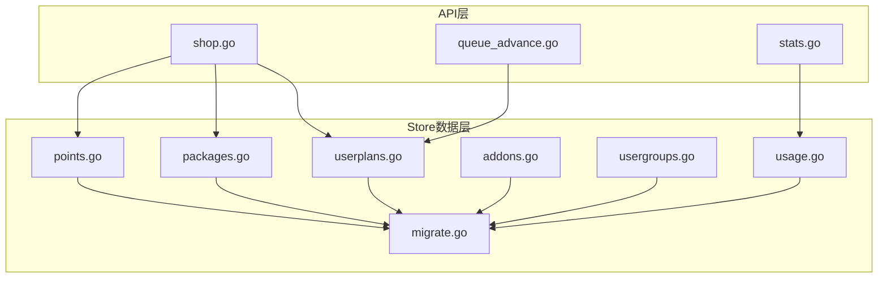
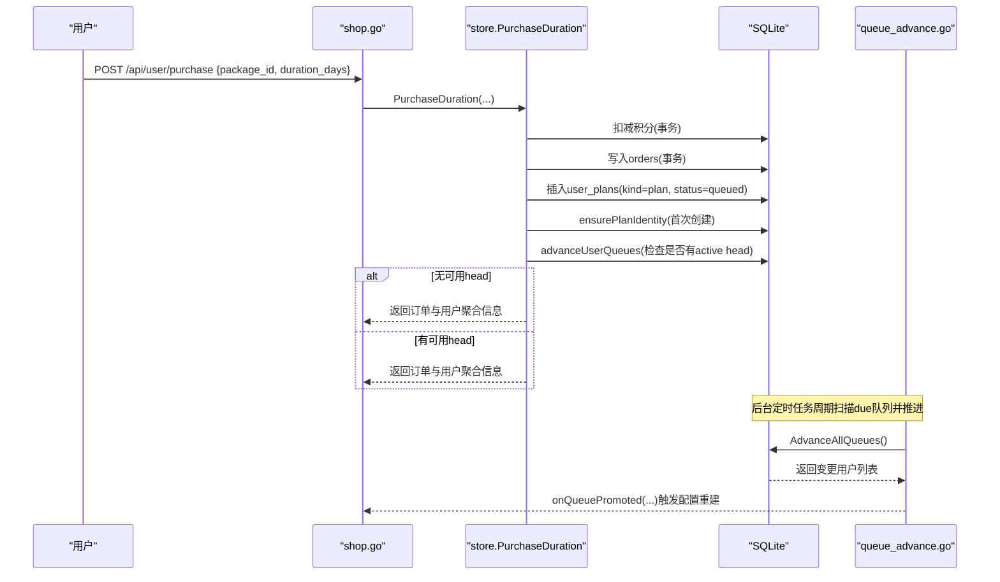
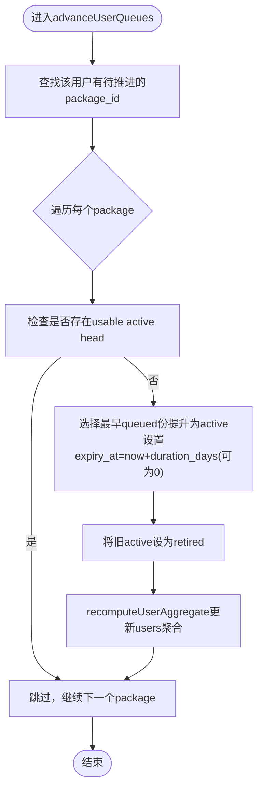
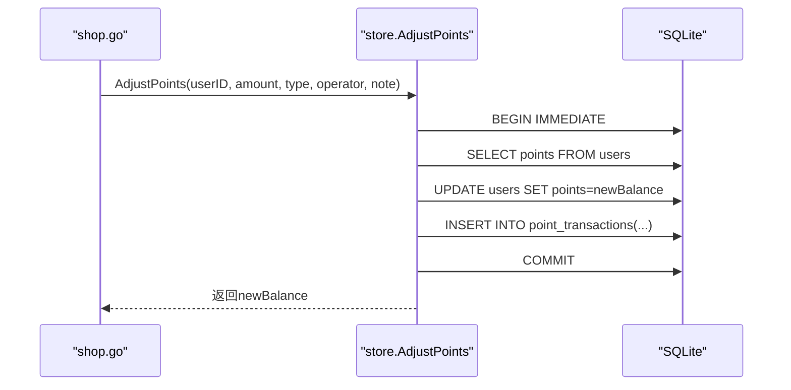
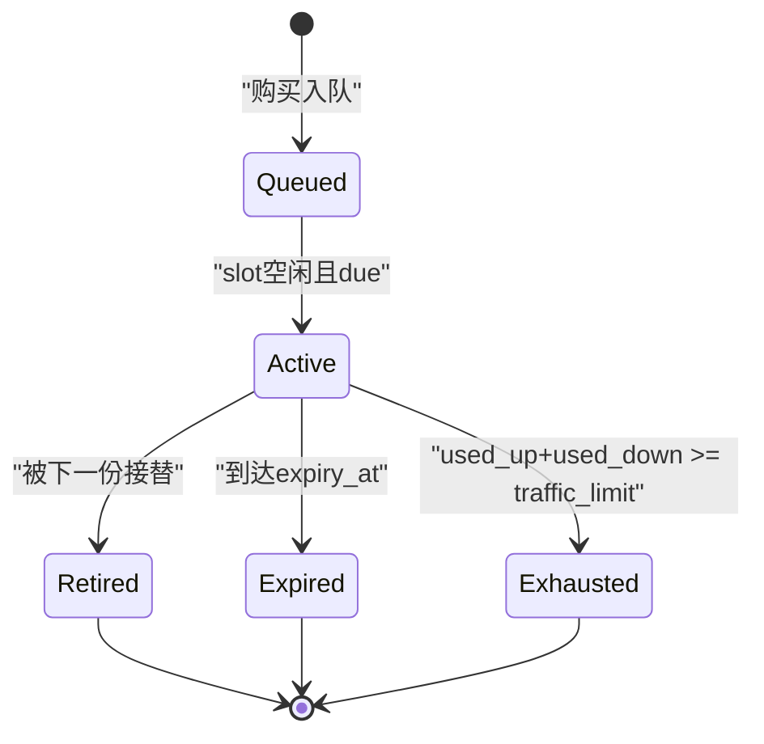
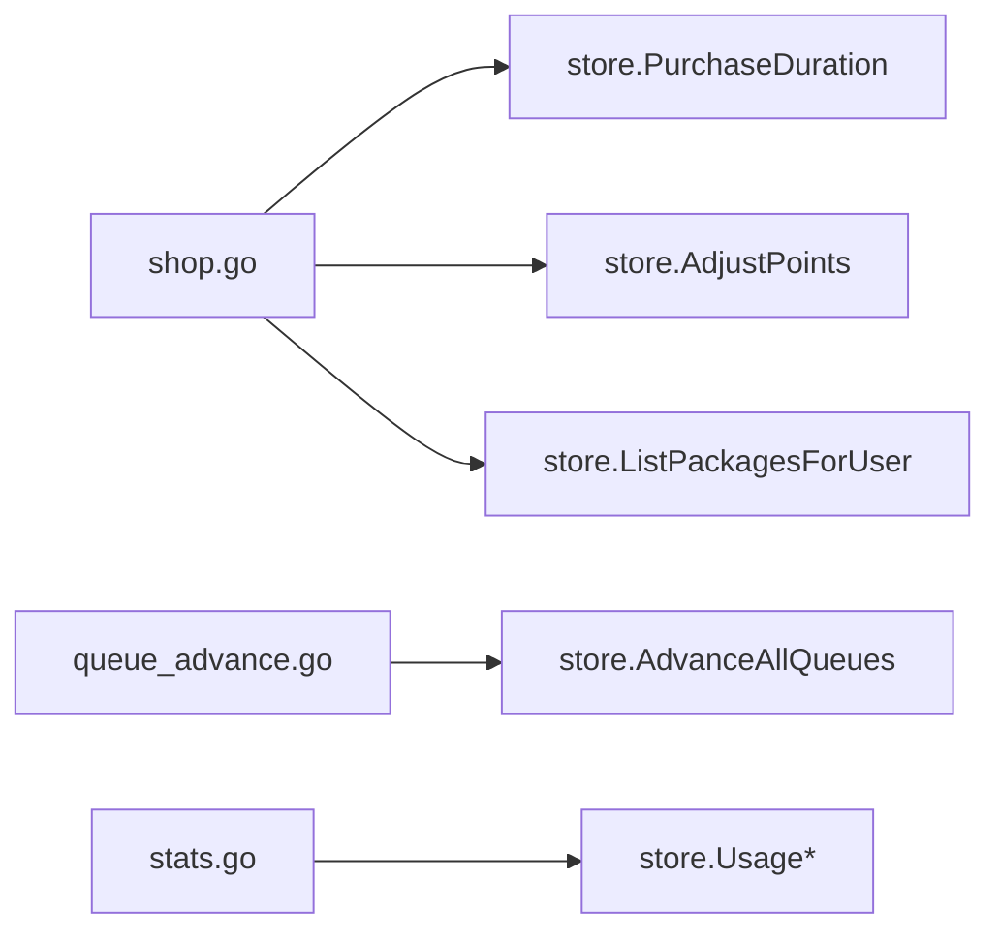

# 用户套餐与配额模型

<cite>
**本文引用的文件**
- [internal/store/migrate.go](file://internal/store/migrate.go)
- [internal/store/userplans.go](file://internal/store/userplans.go)
- [internal/store/packages.go](file://internal/store/packages.go)
- [internal/store/points.go](file://internal/store/points.go)
- [internal/store/addons.go](file://internal/store/addons.go)
- [internal/store/usergroups.go](file://internal/store/usergroups.go)
- [internal/store/usage.go](file://internal/store/usage.go)
- [internal/api/shop.go](file://internal/api/shop.go)
- [internal/api/queue_advance.go](file://internal/api/queue_advance.go)
- [internal/api/stats.go](file://internal/api/stats.go)
</cite>

## 目录
1. [简介](#简介)
2. [项目结构](#项目结构)
3. [核心组件](#核心组件)
4. [架构总览](#架构总览)
5. [详细组件分析](#详细组件分析)
6. [依赖关系分析](#依赖关系分析)
7. [性能考量](#性能考量)
8. [故障排查指南](#故障排查指南)
9. [结论](#结论)
10. [附录：数据模型与字段说明](#附录数据模型与字段说明)

## 简介
本文件面向“用户套餐与配额管理”的数据模型与业务逻辑，覆盖以下主题：
- 用户计划(user_plans)、身份标识(plan_identities)、积分交易(point_transactions)、设备附加(device_addons)等表的设计与职责
- 多套餐队列机制与配额分配策略（购买即入队、到期或耗尽后自动推进）
- 用户权限组(user_groups)与包访问控制(package_user_groups)的关系设计
- 积分商城的交易流程与余额管理机制
- 套餐有效期管理与自动续订逻辑
- 配额使用统计与用量报告的数据支持

## 项目结构
后端数据层位于 internal/store，API 层位于 internal/api。数据库为 SQLite，通过迁移脚本在启动时创建并维护表结构。关键文件分工如下：
- 数据模型与持久化：migrate.go（建表）、userplans.go（套餐/配额/队列）、packages.go（商品/选项）、points.go（积分流水）、addons.go（设备附加）、usergroups.go（用户组与包绑定）、usage.go（用量统计）
- API 入口：shop.go（购买/订单/积分查询）、queue_advance.go（定时推进队列）、stats.go（统计接口）

图表来源
- [internal/store/migrate.go:10-101](file://internal/store/migrate.go#L10-L101)
- [internal/store/userplans.go:574-607](file://internal/store/userplans.go#L574-L607)
- [internal/store/packages.go:23-41](file://internal/store/packages.go#L23-L41)
- [internal/store/points.go:14-24](file://internal/store/points.go#L14-L24)
- [internal/store/addons.go:5-9](file://internal/store/addons.go#L5-L9)
- [internal/store/usergroups.go:14-21](file://internal/store/usergroups.go#L14-L21)
- [internal/store/usage.go:28-44](file://internal/store/usage.go#L28-L44)

章节来源
- [internal/store/migrate.go:10-101](file://internal/store/migrate.go#L10-L101)
- [internal/store/userplans.go:574-607](file://internal/store/userplans.go#L574-L607)
- [internal/store/packages.go:23-41](file://internal/store/packages.go#L23-L41)
- [internal/store/points.go:14-24](file://internal/store/points.go#L14-L24)
- [internal/store/addons.go:5-9](file://internal/store/addons.go#L5-L9)
- [internal/store/usergroups.go:14-21](file://internal/store/usergroups.go#L14-L21)
- [internal/store/usage.go:28-44](file://internal/store/usage.go#L28-L44)

## 核心组件
- user_plans：按“份”计量与计费的单元，包含 plan/pool/free 三类；plan 份支持 active/queued/retired 状态，承载流量限额、已用上下行、过期时间、订单号、时长等
- plan_identities：订阅线级别的稳定身份（client_name/uuid/secret），与具体购买份解耦，避免切换份时客户端凭证失效
- packages：可售卖的套餐定义，支持多时长选项（PlanOption），以及库存、是否启用、排序等
- point_transactions：积分流水表，记录每次增减后的余额，用于审计与对账
- device_addons：设备槽位附加项，记录每个附加项的槽位数与过期时间
- user_groups / package_user_groups：用户组与包的绑定，实现“谁可以买哪个包”的权限控制
- usage：基于 traffic_daily 与 bucket 累计值的多维度用量统计

章节来源
- [internal/store/userplans.go:574-607](file://internal/store/userplans.go#L574-L607)
- [internal/store/migrate.go:373-401](file://internal/store/migrate.go#L373-L401)
- [internal/store/packages.go:11-41](file://internal/store/packages.go#L11-L41)
- [internal/store/points.go:14-24](file://internal/store/points.go#L14-L24)
- [internal/store/addons.go:5-9](file://internal/store/addons.go#L5-L9)
- [internal/store/usergroups.go:14-21](file://internal/store/usergroups.go#L14-L21)
- [internal/store/usage.go:28-44](file://internal/store/usage.go#L28-L44)

## 架构总览
下图展示从用户购买到生效的核心流程：购买下单 → 扣减积分 → 创建订单 → 生成 plan 份并置入队列 → 若当前无可用头则立即激活 → 后续由定时任务推进到期/耗尽的份。

图表来源
- [internal/api/shop.go:27-94](file://internal/api/shop.go#L27-L94)
- [internal/store/userplans.go:35-53](file://internal/store/userplans.go#L35-L53)
- [internal/store/userplans.go:148-226](file://internal/store/userplans.go#L148-L226)
- [internal/api/queue_advance.go:32-69](file://internal/api/queue_advance.go#L32-L69)

## 详细组件分析

### 用户计划与配额（user_plans）
- 设计要点
  - 每笔购买对应一个独立的“份”，拥有独立配额与计量，不再合并叠加
  - 同一用户的同包份形成队列：active 为当前生效份，queued 等待其 slot 释放，retired 表示已交棒
  - 通过 usableHeadPredicate 判定“可用头”：status=active、未过期、且未耗尽
  - 队列推进：当存在 due 的 queued 份且无可用头时，将最早的 queued 份提升为 active，并将原 active 标记为 retired
  - 聚合列 users.* 由 recomputeUserAggregate 从 buckets 重新计算，保证仪表盘与执行端一致
- 复杂度与性能
  - 推进操作按用户粒度开启事务，失败不中断整体扫描
  - 批量查询 due 用户并按 id 顺序处理，减少锁竞争
- 错误处理
  - 退款时 reverseOrderBucket 优先按 order_id 删除单份，否则回退到 legacy 模式
  - 删除 active 份会同步推进队列，避免用户处于“付费但不可见”的状态

图表来源
- [internal/store/userplans.go:148-226](file://internal/store/userplans.go#L148-L226)
- [internal/store/userplans.go:436-460](file://internal/store/userplans.go#L436-L460)

章节来源
- [internal/store/userplans.go:55-79](file://internal/store/userplans.go#L55-L79)
- [internal/store/userplans.go:148-226](file://internal/store/userplans.go#L148-L226)
- [internal/store/userplans.go:330-392](file://internal/store/userplans.go#L330-L392)
- [internal/store/userplans.go:436-460](file://internal/store/userplans.go#L436-L460)

### 身份标识（plan_identities）
- 设计要点
  - 每个 (user, package) 订阅线仅创建一次身份，跨份复用，确保客户端无需更换凭证
  - 与 user_plans 解耦：份负责配额与生命周期，身份负责认证与代理账号
  - 支持可选的混合代理账号（proxy_username/password/expires_at），优先级高于 bucket 自身
- 影响
  - 退款/撤销不会破坏身份稳定性
  - 配置生成与链接构建统一读取稳定 identity

章节来源
- [internal/store/userplans.go:102-139](file://internal/store/userplans.go#L102-L139)
- [internal/store/migrate.go:373-401](file://internal/store/migrate.go#L373-L401)

### 套餐与选项（packages）
- 设计要点
  - Package 支持多时长选项 PlanOption（days/price_points/traffic_bytes），购买时选择具体时长
  - 默认选项用于显示与快照一致性
  - 库存 stock=-1 表示无限，enabled 控制上架状态
- 购买校验
  - ListPackagesForUser 根据用户组过滤可见包
  - CanBuyPackage 在事务内再次校验购买权限

章节来源
- [internal/store/packages.go:11-41](file://internal/store/packages.go#L11-L41)
- [internal/store/packages.go:113-139](file://internal/store/packages.go#L113-L139)
- [internal/store/usergroups.go:300-323](file://internal/store/usergroups.go#L300-L323)

### 积分交易与余额管理（point_transactions）
- 设计要点
  - AdjustPoints 原子地更新 users.points 并写入 point_transactions 流水
  - 禁止余额为负，提供明确错误码
  - 交易类型 type 区分充值、购买、注册赠送、退款、调整等
- 前端接口
  - GET /api/user/points 返回余额与最近流水

图表来源
- [internal/store/points.go:26-65](file://internal/store/points.go#L26-L65)
- [internal/api/shop.go:111-124](file://internal/api/shop.go#L111-L124)

章节来源
- [internal/store/points.go:8-12](file://internal/store/points.go#L8-L12)
- [internal/store/points.go:26-65](file://internal/store/points.go#L26-L65)
- [internal/api/shop.go:111-124](file://internal/api/shop.go#L111-L124)

### 设备附加（device_addons）
- 设计要点
  - 记录每个附加项的 slots 与 expires_at，支持多段叠加
  - 查询仅返回当前有效的附加项（expires_at > now）
- 用途
  - 与套餐/流量包共同决定用户最大并发设备数

章节来源
- [internal/store/addons.go:5-29](file://internal/store/addons.go#L5-L29)
- [internal/store/migrate.go:86-94](file://internal/store/migrate.go#L86-L94)

### 用户组与包访问控制（user_groups / package_user_groups）
- 设计要点
  - user_groups 定义分组，user_group_members 维护成员关系
  - package_user_groups 将包限制到特定分组；无绑定即为公开
  - CanBuyPackage 在事务中校验用户是否在允许购买的分组集合中
- 影响
  - 前端 ListPackagesForUser 仅展示可见包，后端购买路径再次校验，双重保障

章节来源
- [internal/store/usergroups.go:10-21](file://internal/store/usergroups.go#L10-L21)
- [internal/store/usergroups.go:121-184](file://internal/store/usergroups.go#L121-L184)
- [internal/store/usergroups.go:244-266](file://internal/store/usergroups.go#L244-L266)
- [internal/store/usergroups.go:300-323](file://internal/store/usergroups.go#L300-L323)
- [internal/store/packages.go:218-245](file://internal/store/packages.go#L218-L245)

### 多套餐队列与自动续订
- 机制
  - 购买即入队（status=queued），若无可用头则立即激活；否则排队等待
  - 到期或耗尽后，队列推进器（AdvanceAllQueues）周期性扫描 due 用户并推进下一份
  - 推进时设置 expiry_at = now + duration_days（duration_days=0 表示永久）
- 幂等性与健壮性
  - 推进函数幂等：已有可用头则不做任何更改
  - 批量推进失败不中断其他用户，收集首个错误返回

图表来源
- [internal/store/userplans.go:148-226](file://internal/store/userplans.go#L148-L226)
- [internal/api/queue_advance.go:32-69](file://internal/api/queue_advance.go#L32-L69)

章节来源
- [internal/store/userplans.go:148-226](file://internal/store/userplans.go#L148-L226)
- [internal/api/queue_advance.go:32-69](file://internal/api/queue_advance.go#L32-L69)

### 配额使用统计与用量报告
- 数据来源
  - 窗口期统计：traffic_daily 表（按日汇总 up/down）
  - 全量统计：bucket 累计 used_up/used_down 与 users.used_* 标量
- 能力
  - 按用户/包/时间窗口的日曲线、总量、排名
  - 特殊包名映射：公共池、未归属（升级前）
- 前端接口
  - 用户侧：/api/user/stats/traffic?range=...
  - 管理侧：/api/admin/stats/* 多个统计端点

章节来源
- [internal/store/usage.go:9-24](file://internal/store/usage.go#L9-L24)
- [internal/store/usage.go:126-187](file://internal/store/usage.go#L126-L187)
- [internal/store/usage.go:189-249](file://internal/store/usage.go#L189-L249)
- [internal/store/usage.go:284-328](file://internal/store/usage.go#L284-L328)
- [internal/api/stats.go:79-118](file://internal/api/stats.go#L79-L118)
- [internal/api/stats.go:120-199](file://internal/api/stats.go#L120-L199)

## 依赖关系分析
- 模块耦合
  - shop.go 依赖 store 的购买、积分、套餐、队列推进回调
  - queue_advance.go 依赖 store 的批量推进能力
  - stats.go 依赖 usage 的多种统计查询
- 外部依赖
  - SQLite WAL 模式与 _txlock=immediate 提高并发写安全
  - sing-box 集成通过回调触发配置重建（不在本文件展开）

图表来源
- [internal/api/shop.go:27-94](file://internal/api/shop.go#L27-L94)
- [internal/api/queue_advance.go:32-69](file://internal/api/queue_advance.go#L32-L69)
- [internal/api/stats.go:79-199](file://internal/api/stats.go#L79-L199)

章节来源
- [internal/store/store.go:27-58](file://internal/store/store.go#L27-L58)
- [internal/api/shop.go:27-94](file://internal/api/shop.go#L27-L94)
- [internal/api/queue_advance.go:32-69](file://internal/api/queue_advance.go#L32-L69)
- [internal/api/stats.go:79-199](file://internal/api/stats.go#L79-L199)

## 性能考量
- 事务与锁
  - 使用 BEGIN IMMEDIATE 避免读→写升级导致的 SQLITE_BUSY_SNAPSHOT
  - 连接池大小与 WAL 模式平衡读写冲突
- 查询优化
  - 批量获取用户组/桶/统计，减少 N+1 查询
  - 使用索引（如 idx_orders_user、idx_ptx_user、idx_device_addons_user）加速常见查询
- 推进任务
  - 逐用户事务，失败不阻断整体扫描，降低长事务阻塞风险

[本节为通用指导，不直接分析具体文件]

## 故障排查指南
- 购买失败
  - 积分不足：ErrInsufficientFunds
  - 所选时长不可用：ErrOptionNotFound
  - 商品下架：ErrPackageDisabled
  - 仅限指定用户组：ErrPackageNotAllowed
  - 库存不足：ErrOutOfStock
- 队列推进异常
  - 查看 AdvanceAllQueues 返回的错误与变更用户数
  - 确认 due 条件与 usableHeadPredicate 是否符合预期
- 用量不一致
  - 核对 recomputeUserAggregate 是否被调用（购买/退款/推进后）
  - 对比 traffic_daily 与 bucket 累计值

章节来源
- [internal/api/shop.go:61-83](file://internal/api/shop.go#L61-L83)
- [internal/store/userplans.go:148-226](file://internal/store/userplans.go#L148-L226)
- [internal/store/userplans.go:436-460](file://internal/store/userplans.go#L436-L460)

## 结论
本系统以“份”为单位进行配额计量与生命周期管理，结合稳定的订阅身份与多套餐队列机制，实现了可靠的自动续订与平滑切换。权限体系通过用户组与包绑定实现细粒度访问控制，积分流水提供完整的审计支撑。用量统计兼顾窗口期与全量口径，满足运营与排障需求。

[本节为总结，不直接分析具体文件]

## 附录：数据模型与字段说明
- user_plans（用户计划/配额）
  - 关键字段：user_id、kind(plan/pool/free)、package_id、traffic_limit、used_up/used_down、expiry_at、status(active/queued/retired)、duration_days、order_id、created_at/updated_at
  - 行为：每份独立计量；plan 份受状态与过期/配额约束；pool/free 作为共享或免费额度
- plan_identities（身份标识）
  - 关键字段：user_id、package_id、client_name/uuid/secret、proxy_username/password/expires_at、created_at/updated_at
  - 行为：按订阅线唯一，跨份复用，避免客户端频繁换密
- packages（套餐）
  - 关键字段：type、name、description、highlights(JSON)、price_points、traffic_bytes、device_add、duration_days、duration_options(JSON)、stock、enabled、sort_order、created_at
  - 行为：支持多时长选项；stock=-1 表示无限；enabled 控制上架
- point_transactions（积分交易）
  - 关键字段：user_id、amount(+/-)、type、balance_after、ref_id(order_id)、note、operator_id、created_at
  - 行为：原子更新余额并落库流水，禁止负余额
- device_addons（设备附加）
  - 关键字段：user_id、slots、order_id、purchased_at、expires_at
  - 行为：叠加设备槽位，按过期时间筛选有效项
- user_groups / user_group_members / package_user_groups（用户组与包权限）
  - 关键字段：group_id、user_id、package_id
  - 行为：无绑定的包为公开；购买路径二次校验权限

章节来源
- [internal/store/migrate.go:45-101](file://internal/store/migrate.go#L45-L101)
- [internal/store/migrate.go:144-172](file://internal/store/migrate.go#L144-L172)
- [internal/store/migrate.go:373-401](file://internal/store/migrate.go#L373-L401)
- [internal/store/packages.go:23-41](file://internal/store/packages.go#L23-L41)
- [internal/store/points.go:14-24](file://internal/store/points.go#L14-L24)
- [internal/store/addons.go:5-9](file://internal/store/addons.go#L5-L9)
