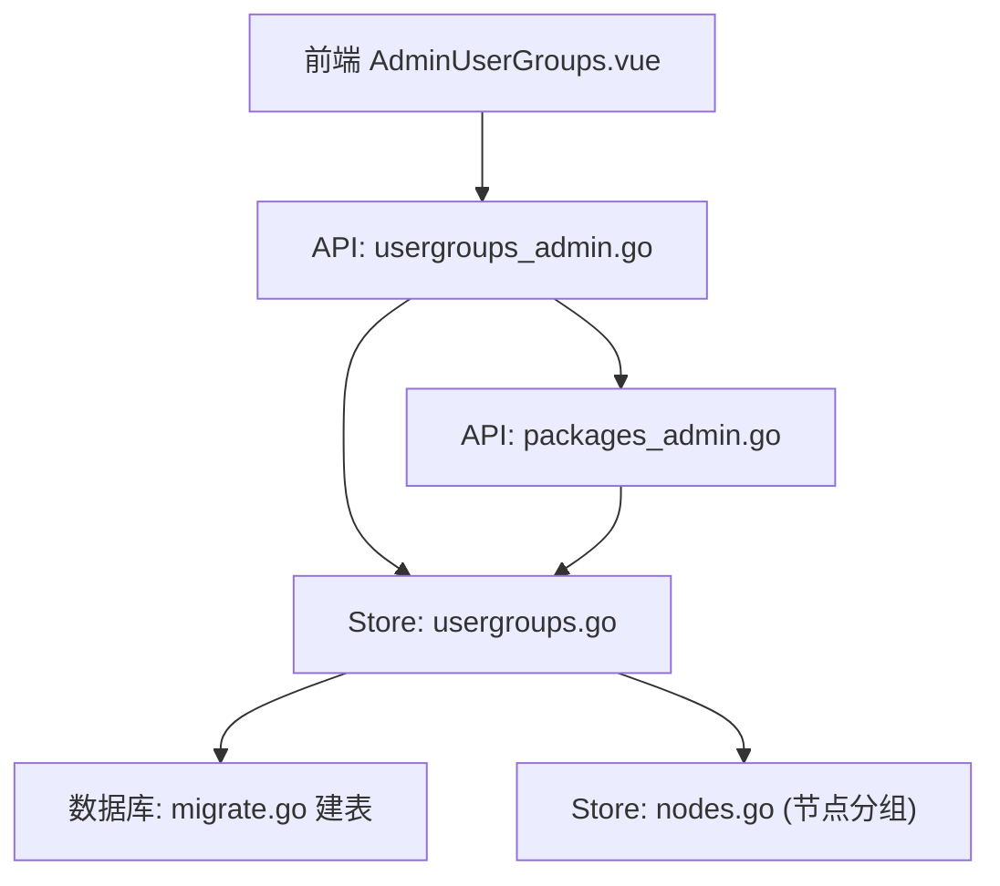
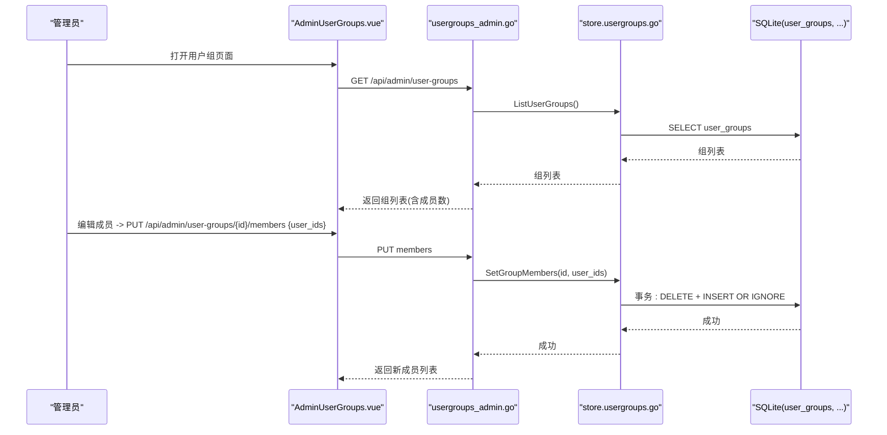
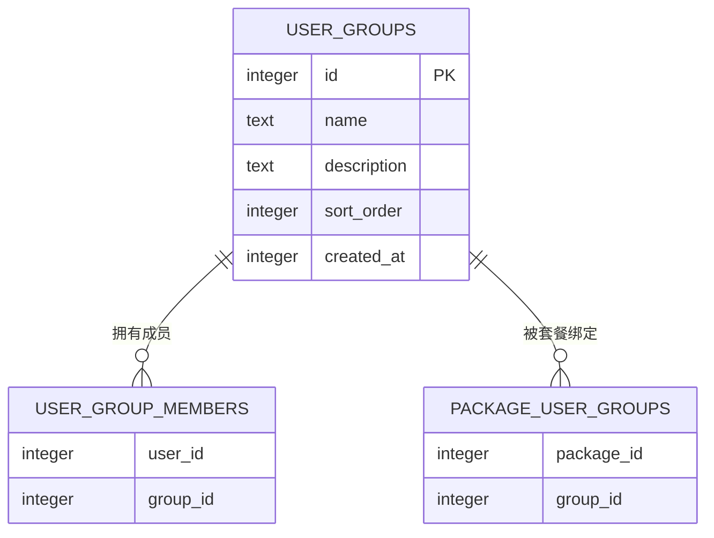
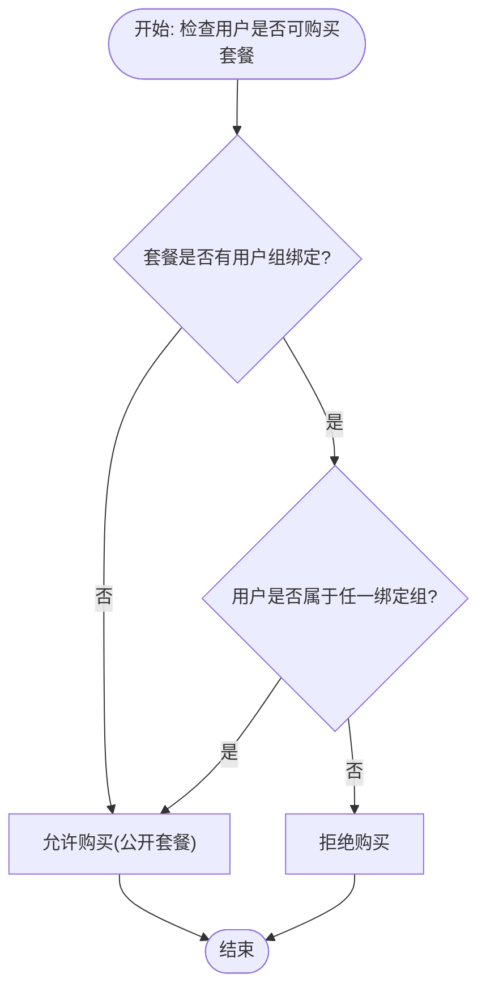
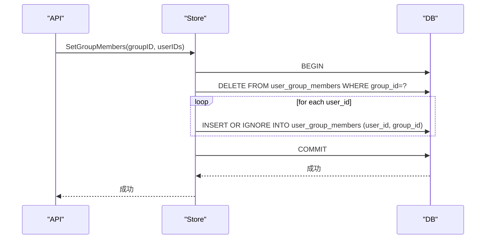
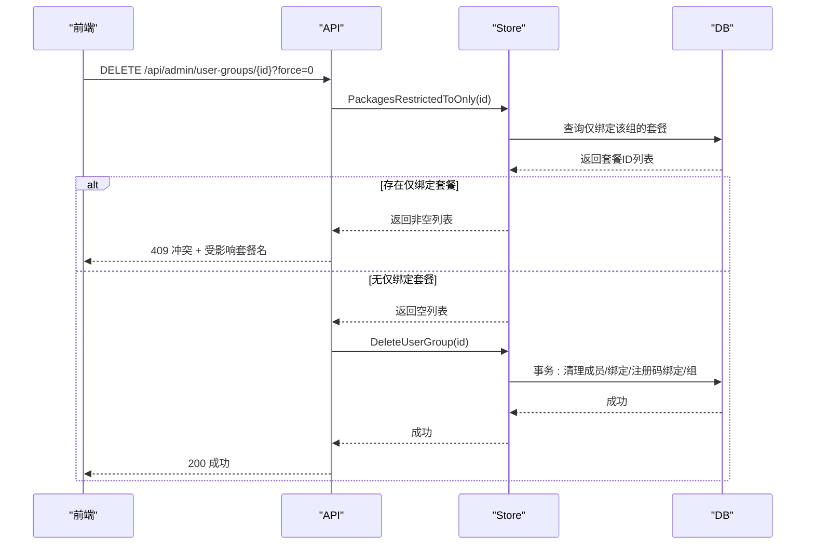
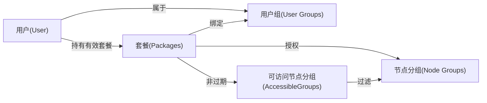
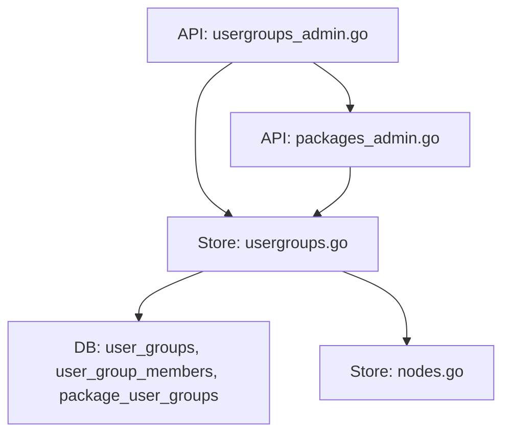

# 用户组与权限模型

<cite>
**本文引用的文件**
- [internal/store/migrate.go](file://internal/store/migrate.go)
- [internal/store/usergroups.go](file://internal/store/usergroups.go)
- [internal/api/usergroups_admin.go](file://internal/api/usergroups_admin.go)
- [internal/api/router.go](file://internal/api/router.go)
- [internal/store/packages.go](file://internal/store/packages.go)
- [internal/api/packages_admin.go](file://internal/api/packages_admin.go)
- [internal/store/nodes.go](file://internal/store/nodes.go)
- [internal/api/user.go](file://internal/api/user.go)
- [frontend/src/views/AdminUserGroups.vue](file://frontend/src/views/AdminUserGroups.vue)
</cite>

## 目录
1. [简介](#简介)
2. [项目结构](#项目结构)
3. [核心组件](#核心组件)
4. [架构总览](#架构总览)
5. [详细组件分析](#详细组件分析)
6. [依赖关系分析](#依赖关系分析)
7. [性能考虑](#性能考虑)
8. [故障排查指南](#故障排查指南)
9. [结论](#结论)

## 简介
本文件聚焦“用户组与权限控制”的数据模型与实现，围绕以下目标展开：
- user_groups、user_group_members、package_user_groups 等表的结构设计与职责边界
- 包访问控制机制：通过 package_user_groups 将“可购买者范围”限定到指定用户组
- 用户组成员管理：添加、移除、批量替换成员的事务性保证
- 权限继承与覆盖规则：未绑定任何组的套餐默认公开；仅当存在绑定时才限制为组内成员可购买
- 管理接口与前端交互：用户组的增删改查、成员批量编辑、删除保护（防止误开放）
- 资源绑定关系：用户组与套餐、节点、API 访问的解耦与协作方式

## 项目结构
与用户组与权限相关的代码主要分布在以下模块：
- 数据层（store）：定义表结构、CRUD、权限判定逻辑
- 接口层（api）：暴露管理员 API，负责参数校验、错误处理、事务调用
- 前端（frontend）：提供用户组管理界面，支持创建/编辑/删除、成员选择与保存
- 路由（router）：注册 /api/admin/user-groups/* 系列接口

图表来源
- [internal/api/router.go:347-353](file://internal/api/router.go#L347-L353)
- [internal/api/usergroups_admin.go:17-185](file://internal/api/usergroups_admin.go#L17-L185)
- [internal/store/usergroups.go:10-324](file://internal/store/usergroups.go#L10-L324)
- [internal/store/migrate.go:144-180](file://internal/store/migrate.go#L144-L180)
- [internal/api/packages_admin.go:82-98](file://internal/api/packages_admin.go#L82-L98)
- [internal/store/nodes.go:292-326](file://internal/store/nodes.go#L292-L326)

章节来源
- [internal/api/router.go:347-353](file://internal/api/router.go#L347-L353)
- [internal/store/migrate.go:144-180](file://internal/store/migrate.go#L144-L180)

## 核心组件
- 用户组实体与成员关系
  - user_groups：存储组名、描述、排序、创建时间
  - user_group_members：用户与组的关联（多对多），用于“谁属于哪个组”
- 包与用户组的绑定
  - package_user_groups：将“哪些组可以购买某套餐”进行声明式绑定
- 权限判定
  - CanBuyPackage：若套餐无绑定则公开；否则要求用户至少属于一个被绑定的组
- 成员管理
  - SetGroupMembers/SetUserGroups/AddUserGroups：原子替换或增量加入，忽略未知 ID，避免脏数据
- 管理接口
  - 列表、创建、更新、删除、成员查询与批量设置
  - 删除保护：若该组是某套餐的唯一购买限制，删除会使其变为公开，需 force=1 确认

章节来源
- [internal/store/usergroups.go:14-21](file://internal/store/usergroups.go#L14-L21)
- [internal/store/usergroups.go:121-184](file://internal/store/usergroups.go#L121-L184)
- [internal/store/usergroups.go:246-323](file://internal/store/usergroups.go#L246-L323)
- [internal/api/usergroups_admin.go:17-185](file://internal/api/usergroups_admin.go#L17-L185)

## 架构总览
下图展示了从前端到后端再到数据库的完整链路，以及关键权限判断点。

图表来源
- [internal/api/router.go:347-353](file://internal/api/router.go#L347-L353)
- [internal/api/usergroups_admin.go:121-176](file://internal/api/usergroups_admin.go#L121-L176)
- [internal/store/usergroups.go:144-160](file://internal/store/usergroups.go#L144-L160)
- [internal/store/migrate.go:155-161](file://internal/store/migrate.go#L155-L161)

## 详细组件分析

### 数据模型与表结构
- user_groups
  - 字段：id、name、description、sort_order、created_at
  - 作用：定义“购买资格组”，与“节点分组”相互独立
- user_group_members
  - 字段：user_id、group_id（复合主键）
  - 索引：按 group_id、user_id 建立索引以优化查询
  - 作用：维护用户与组的归属关系
- package_user_groups
  - 字段：package_id、group_id（复合主键）
  - 索引：按 package_id、group_id 建立索引
  - 作用：声明“哪些组可以购买某套餐”；若无行记录，表示该套餐对所有人公开

图表来源
- [internal/store/migrate.go:144-180](file://internal/store/migrate.go#L144-L180)

章节来源
- [internal/store/migrate.go:144-180](file://internal/store/migrate.go#L144-L180)

### 包访问控制机制
- 规则
  - 若 package_user_groups 中不存在该套餐的记录，则该套餐对所有用户开放
  - 若存在绑定，则只有属于任一绑定组的用户才能购买该套餐
- 判定流程
  - 先检查是否存在绑定；无绑定直接允许
  - 有绑定时，检查用户是否属于任一绑定组
- 影响
  - 删除某个组时，若它是某套餐的唯一购买限制，删除后该套餐将变为公开，因此需要强制确认

图表来源
- [internal/store/usergroups.go:300-323](file://internal/store/usergroups.go#L300-L323)

章节来源
- [internal/store/usergroups.go:300-323](file://internal/store/usergroups.go#L300-L323)
- [internal/api/usergroups_admin.go:84-119](file://internal/api/usergroups_admin.go#L84-L119)

### 用户组成员管理机制
- 批量替换成员（组视角）
  - SetGroupMembers：在一个事务中先清空再插入，确保原子性；忽略不存在的用户 ID
- 批量替换成员（用户视角）
  - SetUserGroups：在一个事务中先清空再插入，确保原子性；忽略不存在的组 ID
- 增量加入成员（如注册码发放）
  - AddUserGroups：只插入不删除，适合“授予”场景
- 查询能力
  - UserGroupIDs：获取用户所属组
  - ListUserGroupMembers：列出组成员（按用户 ID 倒序）
  - UserGroupIDsBulk：批量获取多个用户的组映射，减少 N+1 查询

图表来源
- [internal/store/usergroups.go:144-160](file://internal/store/usergroups.go#L144-L160)
- [internal/store/usergroups.go:121-137](file://internal/store/usergroups.go#L121-L137)
- [internal/store/usergroups.go:162-180](file://internal/store/usergroups.go#L162-L180)

章节来源
- [internal/store/usergroups.go:121-184](file://internal/store/usergroups.go#L121-L184)

### 权限继承与覆盖规则
- 继承
  - 用户可属于多个组；只要满足任一绑定组即可购买对应套餐
- 覆盖
  - 若套餐未绑定任何组，则覆盖所有组的限制，视为公开
- 优先级
  - “公开”优先于“组限制”：无绑定即公开
  - 有绑定时，“组匹配”生效；不属于任何绑定组则不可购买
- 安全设计
  - 绑定与成员赋值均忽略未知 ID，避免产生无法匹配的“死绑定”
  - 删除组前检测是否会导致套餐意外公开，必要时要求 force=1

章节来源
- [internal/store/usergroups.go:110-117](file://internal/store/usergroups.go#L110-L117)
- [internal/store/usergroups.go:300-323](file://internal/store/usergroups.go#L300-L323)
- [internal/api/usergroups_admin.go:84-119](file://internal/api/usergroups_admin.go#L84-L119)

### 管理接口与权限验证
- 路由注册
  - /api/admin/user-groups：列表、创建、更新、删除
  - /api/admin/user-groups/{id}/members：查询与批量设置成员
- 校验与错误处理
  - 名称非空且长度限制
  - 删除保护：若该组是唯一购买限制，返回冲突并提示受影响套餐；force=1 可强制删除
  - 成员操作在事务中执行，失败回滚
- 前端交互
  - 列表展示组成员数量、专属套餐
  - 成员选择支持搜索与多选，保存时一次性提交

图表来源
- [internal/api/usergroups_admin.go:84-119](file://internal/api/usergroups_admin.go#L84-L119)
- [internal/store/usergroups.go:70-90](file://internal/store/usergroups.go#L70-L90)
- [internal/store/usergroups.go:110-117](file://internal/store/usergroups.go#L110-L117)

章节来源
- [internal/api/usergroups_admin.go:17-185](file://internal/api/usergroups_admin.go#L17-L185)
- [internal/api/router.go:347-353](file://internal/api/router.go#L347-L353)
- [frontend/src/views/AdminUserGroups.vue:117-150](file://frontend/src/views/AdminUserGroups.vue#L117-L150)

### 与套餐、节点、API 访问的绑定关系
- 套餐维度
  - Package.UserGroupIDs：用于显示“哪些组可购买此套餐”；为空表示公开
  - 套餐管理接口会加载 UserGroupIDs 以便管理员配置
- 节点维度
  - 节点分组（node_groups）与用户组（user_groups）是两个独立轴：前者决定“购买的套餐能使用哪些节点”，后者决定“谁能购买套餐”
  - AccessibleGroupIDs：根据用户当前有效套餐计算可访问的节点分组集合（包含免费组）
- API 访问
  - 订阅生成与节点可见性由 AccessibleGroupIDs 与套餐状态共同决定
  - 用户是否有节点访问权取决于是否具备可访问分组或未配置分组时的全局开放策略

图表来源
- [internal/store/packages.go:23-41](file://internal/store/packages.go#L23-L41)
- [internal/api/packages_admin.go:82-98](file://internal/api/packages_admin.go#L82-L98)
- [internal/store/nodes.go:292-326](file://internal/store/nodes.go#L292-L326)
- [internal/api/user.go:869-913](file://internal/api/user.go#L869-L913)

章节来源
- [internal/store/packages.go:23-41](file://internal/store/packages.go#L23-L41)
- [internal/api/packages_admin.go:82-98](file://internal/api/packages_admin.go#L82-L98)
- [internal/store/nodes.go:292-326](file://internal/store/nodes.go#L292-L326)
- [internal/api/user.go:869-913](file://internal/api/user.go#L869-L913)

## 依赖关系分析
- 低耦合设计
  - 用户组与节点分组解耦：前者控制“购买资格”，后者控制“可用节点”
- 事务一致性
  - 成员与绑定操作均在事务中执行，失败回滚，避免部分应用
- 健壮性
  - 忽略未知 ID，避免“死绑定”导致套餐不可购买
  - 删除组前检测潜在风险，防止误开放

图表来源
- [internal/api/usergroups_admin.go:17-185](file://internal/api/usergroups_admin.go#L17-L185)
- [internal/store/usergroups.go:10-324](file://internal/store/usergroups.go#L10-L324)
- [internal/api/packages_admin.go:82-98](file://internal/api/packages_admin.go#L82-L98)
- [internal/store/nodes.go:292-326](file://internal/store/nodes.go#L292-L326)

章节来源
- [internal/store/usergroups.go:10-324](file://internal/store/usergroups.go#L10-L324)
- [internal/api/usergroups_admin.go:17-185](file://internal/api/usergroups_admin.go#L17-L185)

## 性能考虑
- 索引优化
  - user_group_members 对 group_id、user_id 建立索引，提升成员查询与绑定检查效率
  - package_user_groups 对 package_id、group_id 建立索引，加速购买权限判定
- 批量操作
  - SetGroupMembers/SetUserGroups 使用事务与批量插入，减少往返与锁竞争
- 缓存与聚合
  - 列表接口附带成员计数，避免多次查询
  - 批量获取用户组映射（UserGroupIDsBulk）减少 N+1 查询

[本节为通用性能建议，不直接分析具体文件]

## 故障排查指南
- 删除用户组失败（409 冲突）
  - 原因：该组是某套餐的唯一购买限制，删除会使套餐公开
  - 解决：先为该套餐重新绑定其他组，或使用 force=1 强制删除
- 套餐不可购买
  - 原因：套餐绑定了用户组，但用户不属于任何绑定组
  - 解决：将用户加入任一绑定组，或取消绑定使套餐公开
- 成员变更未生效
  - 原因：前端未正确提交 user_ids 或后端事务失败
  - 解决：检查请求体格式与后端日志，确认事务是否提交

章节来源
- [internal/api/usergroups_admin.go:84-119](file://internal/api/usergroups_admin.go#L84-L119)
- [internal/store/usergroups.go:300-323](file://internal/store/usergroups.go#L300-L323)

## 结论
本系统通过清晰的数据模型与严格的权限判定逻辑，实现了“用户组—套餐—节点”的解耦管理：
- user_groups 与 package_user_groups 明确“谁可以买什么”
- node_groups 明确“买了之后能用哪些节点”
- 事务化成员管理与删除保护保障数据一致性与安全性
- 管理接口与前端交互简洁直观，便于运维与运营

[本节为总结性内容，不直接分析具体文件]
