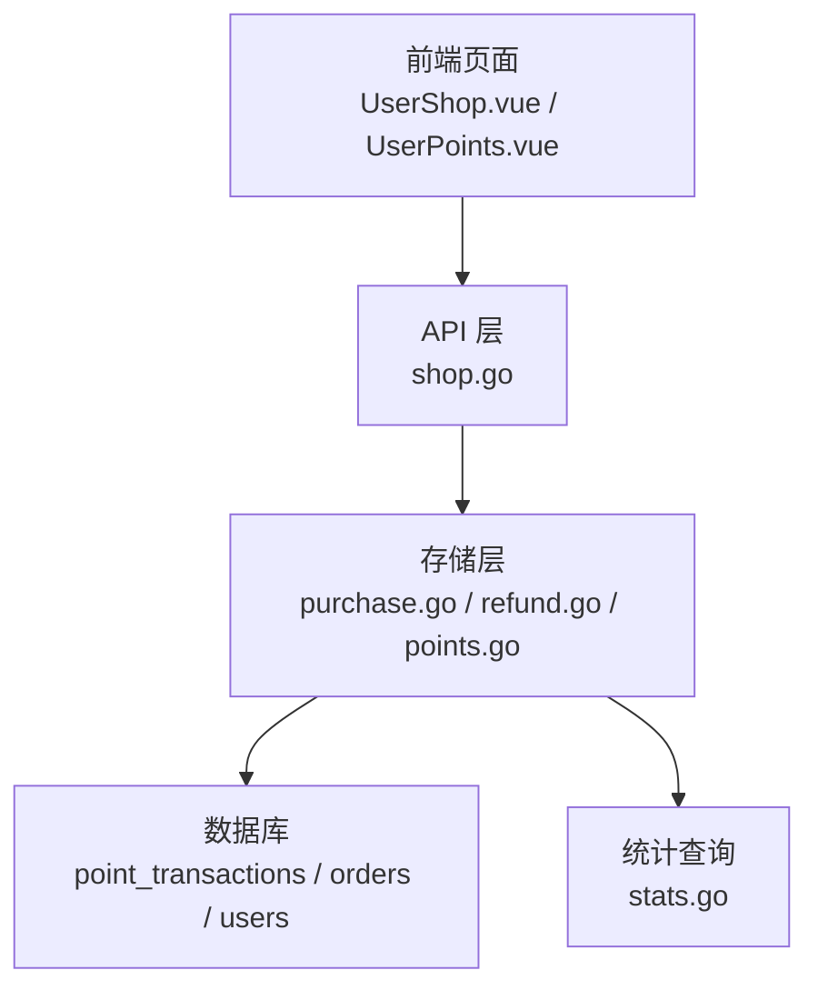
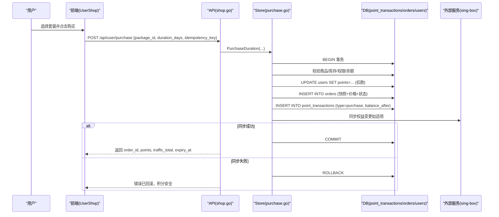
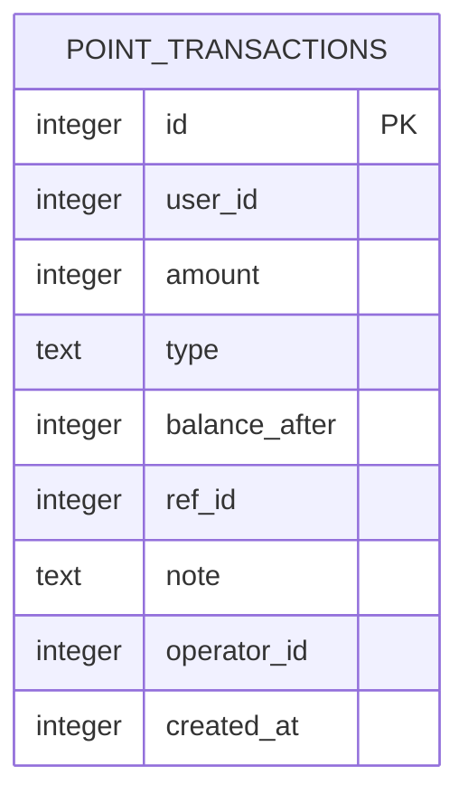
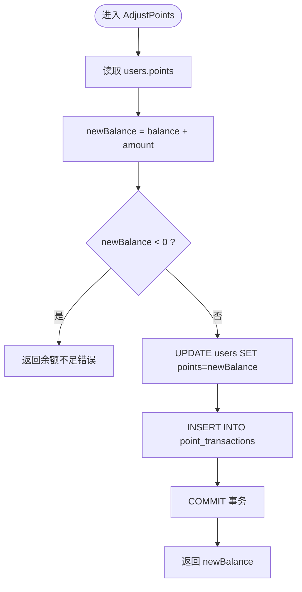
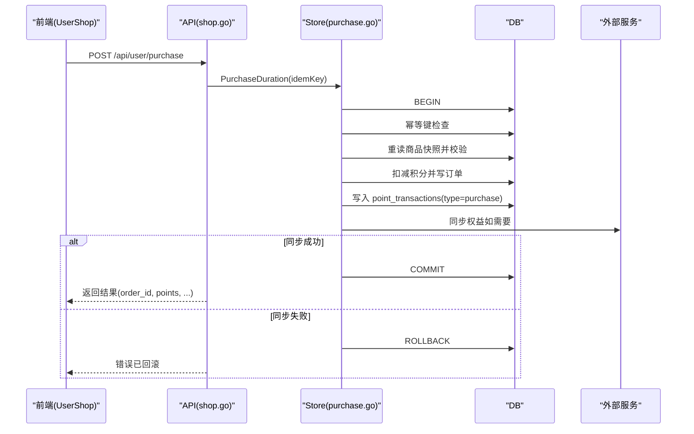
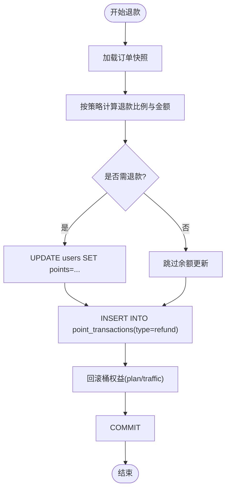
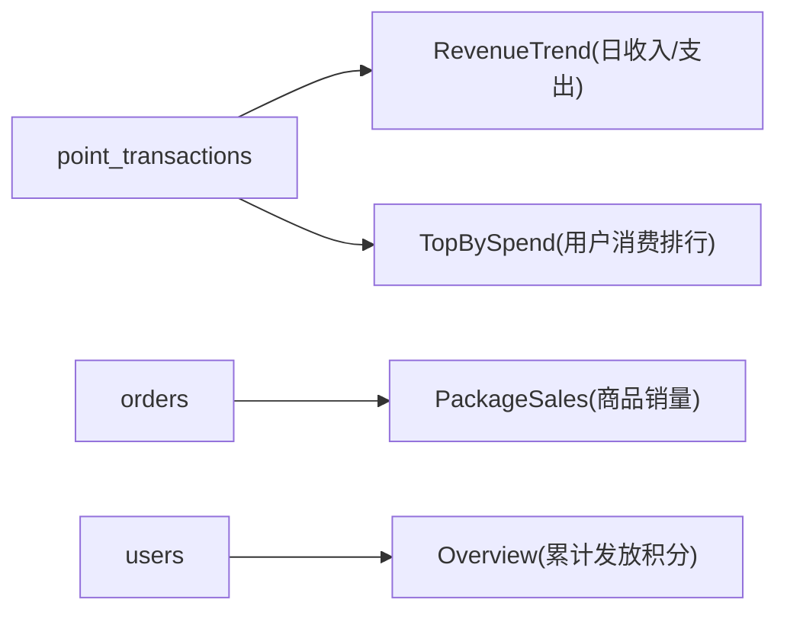
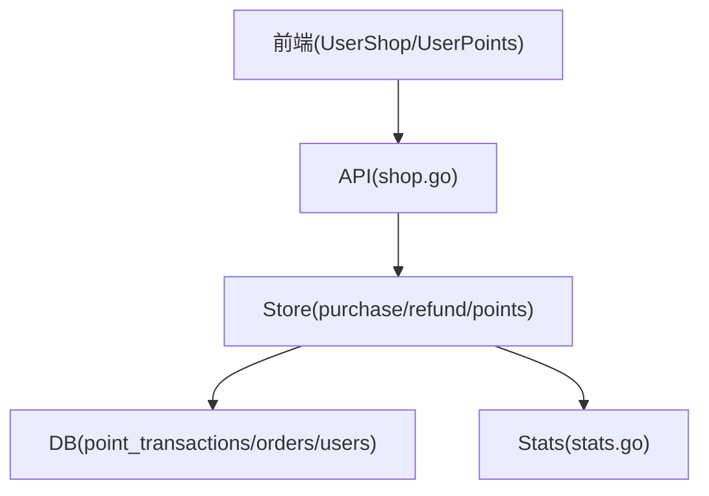

# 积分系统模型

<cite>
**本文引用的文件**
- [internal/store/points.go](file://internal/store/points.go)
- [internal/store/migrate.go](file://internal/store/migrate.go)
- [internal/store/purchase.go](file://internal/store/purchase.go)
- [internal/store/refund.go](file://internal/store/refund.go)
- [internal/api/shop.go](file://internal/api/shop.go)
- [frontend/src/views/UserShop.vue](file://frontend/src/views/UserShop.vue)
- [frontend/src/views/UserPoints.vue](file://frontend/src/views/UserPoints.vue)
- [internal/store/stats.go](file://internal/store/stats.go)
</cite>

## 目录
1. [简介](#简介)
2. [项目结构](#项目结构)
3. [核心组件](#核心组件)
4. [架构总览](#架构总览)
5. [详细组件分析](#详细组件分析)
6. [依赖关系分析](#依赖关系分析)
7. [性能与一致性](#性能与一致性)
8. [故障排查指南](#故障排查指南)
9. [结论](#结论)
10. [附录：数据模型与字段说明](#附录数据模型与字段说明)

## 简介
本文件聚焦于积分系统的数据模型与业务流程，围绕 point_transactions 表的设计、交易类型（purchase/refund/bonus 等）、积分余额计算机制、积分商城购买与退款流程、事务完整性保证、有效期管理与自动清理策略、统计查询与报表支持，以及积分系统与套餐购买的关联关系进行系统化说明。文档面向技术与非技术读者，提供从概念到代码级的完整视图。

## 项目结构
积分系统涉及后端存储层、API 层、前端展示层与数据库迁移脚本：
- 存储层：负责积分流水写入、购买与退款事务、统计查询等
- API 层：暴露用户购买、订单查询、积分明细等接口
- 前端：积分商城页面、积分明细页面、订单页面
- 迁移脚本：定义 point_transactions 表结构与索引

图表来源
- [internal/api/shop.go:27-124](file://internal/api/shop.go#L27-L124)
- [internal/store/purchase.go:43-200](file://internal/store/purchase.go#L43-L200)
- [internal/store/refund.go:12-76](file://internal/store/refund.go#L12-L76)
- [internal/store/points.go:26-87](file://internal/store/points.go#L26-L87)
- [internal/store/stats.go:212-232](file://internal/store/stats.go#L212-L232)

章节来源
- [internal/api/shop.go:27-124](file://internal/api/shop.go#L27-L124)
- [internal/store/purchase.go:43-200](file://internal/store/purchase.go#L43-L200)
- [internal/store/refund.go:12-76](file://internal/store/refund.go#L12-L76)
- [internal/store/points.go:26-87](file://internal/store/points.go#L26-L87)
- [internal/store/stats.go:212-232](file://internal/store/stats.go#L212-L232)

## 核心组件
- 积分流水表 point_transactions：记录每笔积分变动，包含 amount、type、balance_after、ref_id、note、operator_id、created_at 等字段，用于审计与对账
- 用户积分余额 users.points：当前可用积分，由事务内原子更新并落库
- 购买流程 PurchaseDuration：在事务中校验库存、权限、余额，扣减积分，创建订单，写入流水，应用权益（套餐或流量包），必要时同步外部服务；失败则整体回滚
- 退款流程 RefundOrder：按策略（按比例或全额）计算应退积分，更新余额并写入 refund 流水，同时处理桶（bucket）权益回滚
- 统计与报表：RevenueTrend、TopBySpend、PackageSales、Overview 等聚合查询，支撑运营报表

章节来源
- [internal/store/migrate.go:73-84](file://internal/store/migrate.go#L73-L84)
- [internal/store/points.go:26-87](file://internal/store/points.go#L26-L87)
- [internal/store/purchase.go:43-200](file://internal/store/purchase.go#L43-L200)
- [internal/store/refund.go:12-76](file://internal/store/refund.go#L12-L76)
- [internal/store/stats.go:113-125](file://internal/store/stats.go#L113-L125)
- [internal/store/stats.go:212-232](file://internal/store/stats.go#L212-L232)

## 架构总览
积分系统以“事务 + 流水”为核心设计，确保积分变动的可追溯性与一致性。购买与退款均通过数据库事务包裹，任何步骤失败都会回滚，避免积分丢失或权益不一致。

图表来源
- [internal/api/shop.go:27-94](file://internal/api/shop.go#L27-L94)
- [internal/store/purchase.go:61-200](file://internal/store/purchase.go#L61-L200)

章节来源
- [internal/api/shop.go:27-94](file://internal/api/shop.go#L27-L94)
- [internal/store/purchase.go:61-200](file://internal/store/purchase.go#L61-L200)

## 详细组件分析

### 积分流水表 point_transactions 设计
- 字段说明
  - id：自增主键
  - user_id：用户ID
  - amount：正数为入账，负数为扣减
  - type：交易类型，包括 purchase、refund、admin_recharge、signup_bonus、adjust 等
  - balance_after：该笔交易后的余额快照，便于对账与回溯
  - ref_id：业务参考ID（如订单ID）
  - note：备注信息（如“购买: xxx”、“退款: xxx”）
  - operator_id：操作者ID（管理员或系统）
  - created_at：时间戳
- 索引
  - idx_ptx_user：按 user_id 索引，提升用户流水查询性能

图表来源
- [internal/store/migrate.go:73-84](file://internal/store/migrate.go#L73-L84)

章节来源
- [internal/store/migrate.go:73-84](file://internal/store/migrate.go#L73-L84)

### 积分余额计算机制
- 余额存储在 users.points，所有增减通过事务原子更新，并在同一事务中写入 point_transactions 记录
- AdjustPoints 方法实现通用加减逻辑：读取当前余额，计算新余额，校验非负，更新 users.points，写入流水，提交事务
- 列表查询 ListTransactions 按用户拉取最近 N 条流水（默认限制 100，最大 500），供前端展示与统计

图表来源
- [internal/store/points.go:26-65](file://internal/store/points.go#L26-L65)

章节来源
- [internal/store/points.go:26-87](file://internal/store/points.go#L26-L87)

### 积分商城购买流程
- 前端 UserShop.vue 展示套餐卡片，支持多档时长选择，调用 /api/user/purchase
- API shop.go 接收请求，调用 Store.PurchaseDuration，在事务中完成：
  - 幂等键检查，防止重复扣款
  - 重新读取商品快照，校验启用、库存、用户组权限
  - 余额校验与扣减
  - 创建订单（含 package_snapshot）
  - 写入 point_transactions（type=purchase）
  - 应用权益（plan 入桶或 traffic 加池），必要时同步 sing-box
  - 失败回滚，成功提交

图表来源
- [internal/api/shop.go:27-94](file://internal/api/shop.go#L27-L94)
- [internal/store/purchase.go:61-200](file://internal/store/purchase.go#L61-L200)

章节来源
- [internal/api/shop.go:27-94](file://internal/api/shop.go#L27-L94)
- [internal/store/purchase.go:61-200](file://internal/store/purchase.go#L61-L200)
- [frontend/src/views/UserShop.vue:128-161](file://frontend/src/views/UserShop.vue#L128-L161)

### 退款处理与异常回滚
- 退款策略 RefundPolicy：mode（prorated/full）、basis（min/traffic/time）、fee_percent（手续费）
- RefundPreview 与 RefundOrder：
  - 读取订单快照与当前桶状态，计算退款比例与金额
  - 更新 users.points（如有退款），写入 point_transactions（type=refund）
  - 处理桶权益回滚（plan 桶撤销或 traffic 池回收）
  - 幂等保护：重复退款返回 AlreadyRefunded
- 异常回滚：若同步或其他步骤失败，事务回滚，积分与权益保持一致

图表来源
- [internal/store/refund.go:12-76](file://internal/store/refund.go#L12-L76)
- [internal/store/purchase.go:448-497](file://internal/store/purchase.go#L448-L497)

章节来源
- [internal/store/refund.go:12-76](file://internal/store/refund.go#L12-L76)
- [internal/store/purchase.go:448-497](file://internal/store/purchase.go#L448-L497)

### 积分有效期管理与自动清理策略
- 套餐维度有效期：plan 桶具备 expiry_at，到期后不再计费；traffic 池无固定过期，按用量累计
- 自动清理：
  - PruneTrafficSamples：清理历史流量样本，保留天数可配置
  - 桶生命周期：plan 桶到期或被清退时，相关权益失效；retire 流程会查找持有者并退款、清理桶
- 注意：point_transactions 本身不携带有效期字段，有效期由套餐与桶模型管理

章节来源
- [internal/store/stats.go:76-81](file://internal/store/stats.go#L76-L81)
- [internal/store/retire_test.go:24-46](file://internal/store/retire_test.go#L24-L46)

### 积分统计查询与报表生成
- RevenueTrend：按日汇总积分发放与消耗（amount>0 与 amount<0 的 SUM）
- TopBySpend：按用户统计消费最多的积分（type=purchase）
- PackageSales：按商品统计成功订单数
- Overview：站点级概览，包含 PointsIssued（累计发放积分）
- 这些查询为运营报表提供数据基础

图表来源
- [internal/store/stats.go:113-125](file://internal/store/stats.go#L113-L125)
- [internal/store/stats.go:212-232](file://internal/store/stats.go#L212-L232)

章节来源
- [internal/store/stats.go:113-125](file://internal/store/stats.go#L113-L125)
- [internal/store/stats.go:212-232](file://internal/store/stats.go#L212-L232)

### 积分系统与套餐购买的关联关系
- 购买成功后：
  - plan：创建独立桶（user_plans），具备独立计量与有效期；首次购买立即生效，重复购买排队等待当前份结束后启用
  - traffic：向共享流量池追加额度
- 用户维度：
  - users.points 反映当前可用积分
  - 桶模型决定实际配额与使用量，legacy 列（如 traffic_limit、expiry_at）由桶聚合重算，避免漂移
- 订单与流水：
  - orders 保存商品快照与价格
  - point_transactions 记录每次积分变动，ref_id 指向订单ID

章节来源
- [internal/store/purchase.go:144-200](file://internal/store/purchase.go#L144-L200)
- [internal/store/stats.go:277-348](file://internal/store/stats.go#L277-L348)

## 依赖关系分析
- API 层依赖 Store 层完成业务逻辑
- Store 层依赖数据库（SQLite/SQL），并通过事务保证一致性
- 前端通过 API 获取套餐、订单、积分明细，并进行本地筛选与可视化
- 统计模块直接查询 point_transactions、orders、users、traffic_samples 等表

图表来源
- [internal/api/shop.go:27-124](file://internal/api/shop.go#L27-L124)
- [internal/store/purchase.go:43-200](file://internal/store/purchase.go#L43-L200)
- [internal/store/stats.go:212-232](file://internal/store/stats.go#L212-L232)

章节来源
- [internal/api/shop.go:27-124](file://internal/api/shop.go#L27-L124)
- [internal/store/purchase.go:43-200](file://internal/store/purchase.go#L43-L200)
- [internal/store/stats.go:212-232](file://internal/store/stats.go#L212-L232)

## 性能与一致性
- 事务一致性：购买与退款均在事务中执行，任何步骤失败均回滚，确保积分与权益一致
- 幂等性：购买使用 idempotency_key 防止网络重试导致重复扣款；退款支持幂等保护
- 索引优化：point_transactions.user_id 索引加速用户流水查询；traffic_samples 索引支持按日聚合
- 限额控制：ListTransactions 限制返回条数，避免大结果集影响性能
- 外部同步：sing-box 同步失败会触发回滚，避免积分已扣但权益未生效的不一致

章节来源
- [internal/store/purchase.go:61-200](file://internal/store/purchase.go#L61-L200)
- [internal/store/points.go:67-87](file://internal/store/points.go#L67-L87)
- [internal/store/stats.go:76-81](file://internal/store/stats.go#L76-L81)

## 故障排查指南
- 购买失败且提示“已回滚”：检查外部同步是否失败；事务已回滚，积分安全
- 积分不足：检查 users.points 与商品价格；确认是否有未提交的流水
- 重复退款：检查订单状态与幂等保护；重复退款将返回 AlreadyRefunded
- 退款金额异常：核对退款策略（mode/basis/fee_percent）与桶剩余用量
- 统计偏差：确认 point_transactions 是否完整写入；检查 RevenueTrend 与 TopBySpend 的聚合条件

章节来源
- [internal/api/shop.go:64-81](file://internal/api/shop.go#L64-L81)
- [internal/store/refund.go:243-273](file://internal/store/refund.go#L243-L273)
- [internal/store/stats.go:212-232](file://internal/store/stats.go#L212-L232)

## 结论
本积分系统以 point_transactions 为核心流水表，结合事务与幂等机制，实现了安全的积分扣减与退款流程。通过桶模型管理套餐有效期与用量，配合统计查询与报表能力，为运营提供了完整的数据支撑。建议在后续迭代中继续强化自动化清理策略与监控告警，以提升系统的稳定性与可观测性。

## 附录：数据模型与字段说明
- point_transactions
  - id：自增主键
  - user_id：用户ID
  - amount：正数入账，负数扣减
  - type：交易类型（purchase/refund/admin_recharge/signup_bonus/adjust）
  - balance_after：交易后余额快照
  - ref_id：业务参考ID（如订单ID）
  - note：备注（如“购买: xxx”、“退款: xxx”）
  - operator_id：操作者ID
  - created_at：时间戳
- users
  - points：当前可用积分
- orders
  - package_snapshot：商品快照（名称、类型、流量、时长等）
  - price_points：成交价格
  - status：订单状态（success/refunded）
- user_plans（桶模型）
  - kind：计划类型（plan）
  - package_id：关联商品ID
  - expiry_at：到期时间（0 表示不限期）
  - traffic_limit：流量上限（0 表示不限）
  - used_up/used_down：累计上下行用量

章节来源
- [internal/store/migrate.go:73-84](file://internal/store/migrate.go#L73-L84)
- [internal/store/purchase.go:22-36](file://internal/store/purchase.go#L22-L36)
- [internal/store/stats.go:277-348](file://internal/store/stats.go#L277-L348)
