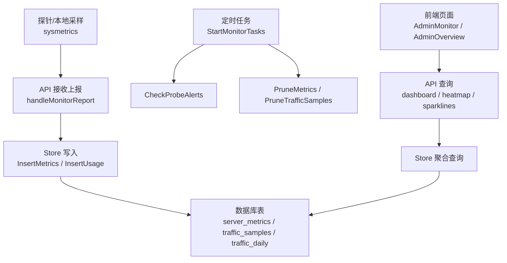
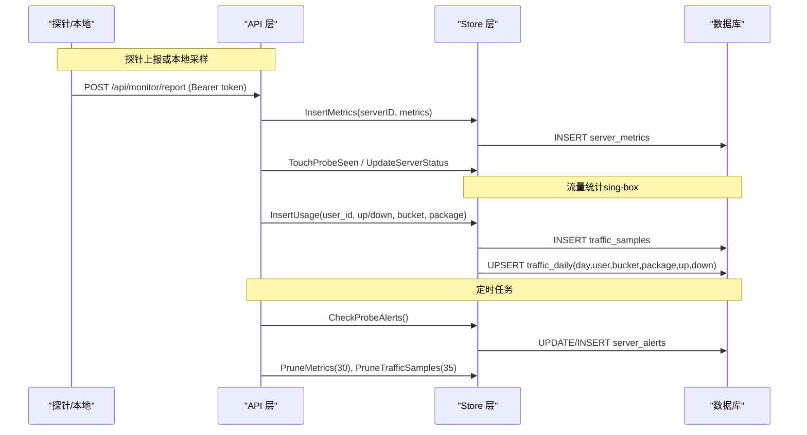
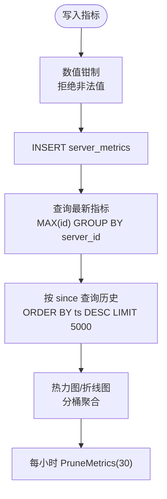
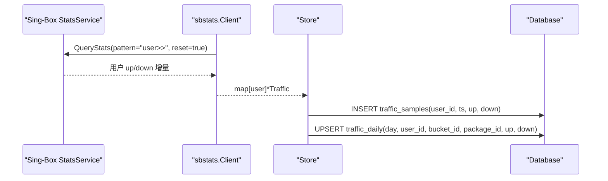
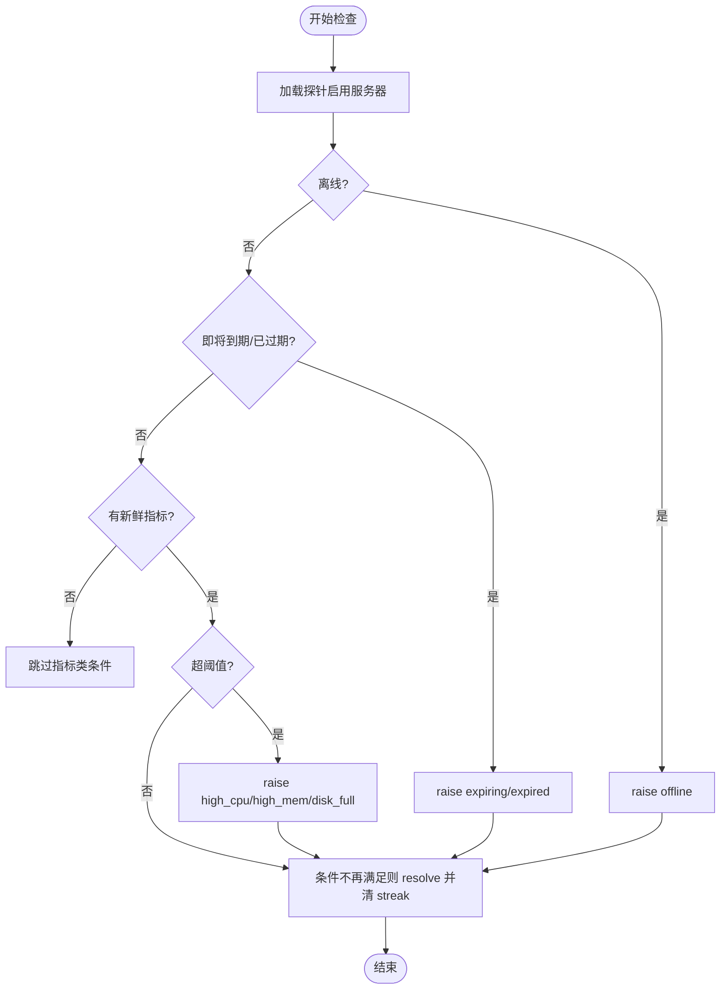
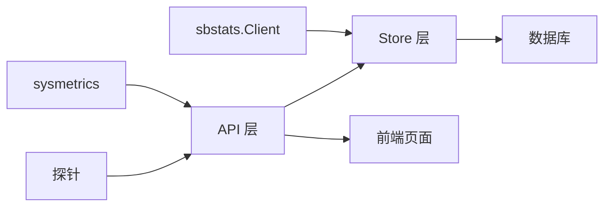

# 监控指标模型

<cite>
**本文引用的文件**
- [internal/store/metrics.go](file://internal/store/metrics.go)
- [internal/store/alerts.go](file://internal/store/alerts.go)
- [internal/store/stats.go](file://internal/store/stats.go)
- [internal/store/migrate.go](file://internal/store/migrate.go)
- [internal/api/monitor.go](file://internal/api/monitor.go)
- [internal/api/monitor_local.go](file://internal/api/monitor_local.go)
- [internal/sysmetrics/sysmetrics.go](file://internal/sysmetrics/sysmetrics.go)
- [internal/sbstats/client.go](file://internal/sbstats/client.go)
</cite>

## 目录
1. [简介](#简介)
2. [项目结构](#项目结构)
3. [核心组件](#核心组件)
4. [架构总览](#架构总览)
5. [详细组件分析](#详细组件分析)
6. [依赖关系分析](#依赖关系分析)
7. [性能与查询优化](#性能与查询优化)
8. [告警规则与触发机制](#告警规则与触发机制)
9. [数据清理与存储管理](#数据清理与存储管理)
10. [可视化与报表](#可视化与报表)
11. [故障排查指南](#故障排查指南)
12. [结论](#结论)

## 简介
本文件聚焦于轻舟面板的监控指标相关数据模型与实现，覆盖服务器指标（server_metrics）、流量样本（traffic_samples）、每日汇总（traffic_daily）以及告警记录（server_alerts）等关键表的设计、采集频率、保留策略、查询优化、告警规则与触发机制、数据清理策略和存储空间管理，并说明前端可视化与报表能力。

## 项目结构
监控子系统由“探针采集 → 指标入库 → 定时任务 → API 暴露 → 前端展示”构成：
- 探针采集：本地节点通过 sysmetrics 直接采样；远端节点通过探针二进制上报。
- 指标入库：store 层将指标写入 server_metrics、traffic_samples、traffic_daily 等表。
- 定时任务：每小时执行告警检查与数据清理。
- API 暴露：提供仪表盘、热力图、折线图、明细等接口。
- 前端展示：管理端与公开状态页使用 ECharts 等图表渲染。

**图示来源**
- [internal/api/monitor.go:22-55](file://internal/api/monitor.go#L22-L55)
- [internal/api/monitor.go:889-919](file://internal/api/monitor.go#L889-L919)
- [internal/store/metrics.go:88-165](file://internal/store/metrics.go#L88-L165)
- [internal/store/stats.go:76-81](file://internal/store/stats.go#L76-L81)
- [internal/store/migrate.go:406-499](file://internal/store/migrate.go#L406-L499)

**章节来源**
- [internal/api/monitor.go:22-55](file://internal/api/monitor.go#L22-L55)
- [internal/api/monitor.go:889-919](file://internal/api/monitor.go#L889-L919)
- [internal/store/migrate.go:406-499](file://internal/store/migrate.go#L406-L499)

## 核心组件
- 服务器指标（ServerMetrics）：系统级 CPU、内存、Swap、磁盘、网络、负载、进程数、运行时间、主机信息等时序快照。
- 流量样本（traffic_samples）：按用户维度的上行/下行增量统计，用于短期趋势与日粒度聚合。
- 每日汇总（traffic_daily）：按天、按桶（bucket）与套餐维度聚合的上行/下行累计，长期保留。
- 告警记录（server_alerts）：离线、高 CPU、高内存、磁盘满、即将到期、已过期等事件片段（episode）。

**章节来源**
- [internal/store/metrics.go:9-35](file://internal/store/metrics.go#L9-L35)
- [internal/store/stats.go:17-32](file://internal/store/stats.go#L17-L32)
- [internal/store/migrate.go:406-445](file://internal/store/migrate.go#L406-L445)
- [internal/store/alerts.go:10-31](file://internal/store/alerts.go#L10-L31)

## 架构总览
监控数据流从采集到展示的关键路径如下：
- 探针上报：认证通过后写入 server_metrics，并更新 last_seen 与在线状态。
- 本地采样：面板本机每 30 秒采样一次，写入同一指标表，保证分辨率一致。
- 流量统计：通过 sing-box gRPC 拉取用户流量增量，写入 traffic_samples，并原子合并到 traffic_daily。
- 定时任务：每小时执行告警检查与数据清理。
- 查询接口：仪表盘、热力图、折线图等聚合查询，限制返回行数避免大响应。

**图示来源**
- [internal/api/monitor.go:22-55](file://internal/api/monitor.go#L22-L55)
- [internal/api/monitor.go:889-919](file://internal/api/monitor.go#L889-L919)
- [internal/store/metrics.go:88-165](file://internal/store/metrics.go#L88-L165)
- [internal/store/stats.go:76-81](file://internal/store/stats.go#L76-L81)
- [internal/store/migrate.go:406-499](file://internal/store/migrate.go#L406-L499)

## 详细组件分析

### 服务器指标（server_metrics）
- 设计要点
  - 字段包含 CPU、内存、Swap、磁盘、网络、负载、TCP 连接数、进程数、运行时间、主机名、平台、内核、架构等。
  - 插入前进行数值钳制（clamp），拒绝负值或越界值，防止恶意探针污染仪表板聚合。
  - 支持单服务器最新指标、全服务器最新指标、按时间窗口列出历史指标、跨服务器批量查询等。
  - 列表查询限制最大行数（默认 5000），避免长时窗高频率探针导致响应过大。
  - 热力图与公共折线图使用统一的时间分桶聚合，并对无数据单元格做降级处理。
- 索引与查询优化
  - 复合索引 (server_id, ts) 与独立 ts 索引，分别服务按服务器查询与按时间过滤（如 PruneMetrics、ListAllMetricsSince）。
  - 获取所有服务器最新指标采用子查询 MAX(id) 分组，避免 N+1 查询。
- 采集频率与保留
  - 本地节点每 30 秒采样一次；远端探针默认同频（由安装脚本与面板约定）。
  - 保留策略：默认保留 30 天，每小时清理一次。

**图示来源**
- [internal/store/metrics.go:52-104](file://internal/store/metrics.go#L52-L104)
- [internal/store/metrics.go:106-165](file://internal/store/metrics.go#L106-L165)
- [internal/api/monitor.go:323-360](file://internal/api/monitor.go#L323-L360)
- [internal/api/monitor.go:375-428](file://internal/api/monitor.go#L375-L428)
- [internal/api/monitor.go:889-919](file://internal/api/monitor.go#L889-L919)

**章节来源**
- [internal/store/metrics.go:9-165](file://internal/store/metrics.go#L9-L165)
- [internal/store/migrate.go:469-499](file://internal/store/migrate.go#L469-L499)
- [internal/api/monitor.go:323-428](file://internal/api/monitor.go#L323-L428)
- [internal/api/monitor.go:889-919](file://internal/api/monitor.go#L889-L919)

### 流量样本（traffic_samples）
- 设计要点
  - 按用户维度记录每次统计轮次的上行/下行增量（delta），不累积。
  - 索引 (user_id, ts) 与 ts，支撑用户维度区间查询与全局清理。
  - 仅保留最近 35 天，定期清理，避免 WAL 膨胀与慢查询。
- 数据来源
  - 通过 sing-box v2ray_api gRPC 拉取用户流量计数器（reset=true），得到自上次轮询以来的增量。
  - 客户端封装了 h2c 传输、消息帧与最小 protobuf 编解码，避免引入重型依赖。
- 写入流程
  - 在事务中同时写入 traffic_samples 与 traffic_daily 的日粒度聚合，确保一致性。

**图示来源**
- [internal/sbstats/client.go:122-183](file://internal/sbstats/client.go#L122-L183)
- [internal/store/stats.go:24-40](file://internal/store/stats.go#L24-L40)
- [internal/store/migrate.go:406-445](file://internal/store/migrate.go#L406-L445)

**章节来源**
- [internal/sbstats/client.go:1-183](file://internal/sbstats/client.go#L1-L183)
- [internal/store/stats.go:24-81](file://internal/store/stats.go#L24-L81)
- [internal/store/migrate.go:406-445](file://internal/store/migrate.go#L406-L445)

### 每日汇总（traffic_daily）
- 设计要点
  - 按天、用户、桶（bucket）与套餐维度聚合 up/down，主键为 (day, user_id, bucket_id)。
  - 长期保留（无自动清理），便于对历史订单进行核对与审计。
  - 使用 strftime('localtime') 保证日期边界与查询一致。
- 用途
  - 用户用量报告、套餐维度统计、营收与订单关联分析。
  - 作为长期视图，弥补 traffic_samples 仅保留 35 天的限制。

**章节来源**
- [internal/store/stats.go:17-40](file://internal/store/stats.go#L17-L40)
- [internal/store/migrate.go:415-445](file://internal/store/migrate.go#L415-L445)

### 告警记录（server_alerts）
- 设计要点
  - 以“事件片段（episode）”为单位：同一条件持续存在会合并到一行（hits++），而非堆积新行。
  - 支持未读标记、自动解析（条件不再满足时关闭）、确认后的静默窗口（reAlertWindow=24h）。
  - 针对易抖动条件（offline、high_cpu、high_mem、disk_full）要求连续多次观测达到阈值才触发。
- 触发逻辑
  - 离线：last_seen 超过 2 分钟。
  - 即将到期：距离到期 ≤ 3 天。
  - 已过期：当前时间 ≥ 到期时间。
  - 指标类：CPU/内存/磁盘使用率超过配置阈值（可配置 alert_cpu_threshold、alert_mem_threshold、alert_disk_threshold）。
- 配置项
  - 连续次数阈值：alert_consecutive（默认 2，范围 1-10）。
  - 各指标阈值：alert_cpu_threshold、alert_mem_threshold、alert_disk_threshold（默认 90/90/85）。

**图示来源**
- [internal/store/alerts.go:26-50](file://internal/store/alerts.go#L26-L50)
- [internal/store/alerts.go:131-170](file://internal/store/alerts.go#L131-L170)
- [internal/store/alerts.go:218-357](file://internal/store/alerts.go#L218-L357)

**章节来源**
- [internal/store/alerts.go:10-357](file://internal/store/alerts.go#L10-L357)

## 依赖关系分析
- 采集侧
  - 本地节点：sysmetrics 读取 /proc 计算 CPU、网络速率、磁盘使用等。
  - 远端探针：通过 HTTP 上报 ServerMetrics，经 API 鉴权后入库。
  - 流量侧：sbstats 通过 gRPC-over-h2c 拉取 sing-box 用户流量增量。
- 存储侧
  - store 层负责写入与查询，包含指标、流量样本、每日汇总、告警等。
- 调度侧
  - api 层启动定时任务：每小时执行告警检查与数据清理。
- 展示侧
  - API 提供 dashboard、heatmap、sparklines、alerts 等接口，供前端渲染。

**图示来源**
- [internal/sysmetrics/sysmetrics.go:16-38](file://internal/sysmetrics/sysmetrics.go#L16-L38)
- [internal/sbstats/client.go:122-183](file://internal/sbstats/client.go#L122-L183)
- [internal/api/monitor.go:22-55](file://internal/api/monitor.go#L22-L55)
- [internal/api/monitor.go:889-919](file://internal/api/monitor.go#L889-L919)

**章节来源**
- [internal/sysmetrics/sysmetrics.go:1-110](file://internal/sysmetrics/sysmetrics.go#L1-L110)
- [internal/sbstats/client.go:1-183](file://internal/sbstats/client.go#L1-L183)
- [internal/api/monitor.go:22-55](file://internal/api/monitor.go#L22-L55)
- [internal/api/monitor.go:889-919](file://internal/api/monitor.go#L889-L919)

## 性能与查询优化
- 指标查询
  - 列表查询限制最大行数（5000），避免长时窗高频率探针导致响应过大。
  - 热力图与公共折线图使用固定列数（48 列）分桶聚合，降低前端渲染压力。
  - 跨服务器最新指标采用单次 SQL 聚合，避免 N+1。
- 索引设计
  - server_metrics: (server_id, ts) 与 ts 独立索引，兼顾按服务器查询与按时间过滤。
  - traffic_samples: (user_id, ts) 与 ts 索引，支撑用户维度区间查询与全局清理。
  - traffic_daily: (user_id, day) 与 day 索引，支撑日粒度聚合。
- 资源保护
  - 公共接口（heatmap/sparklines）对查询结果进行上限控制，防止匿名请求放大资源消耗。
  - sbstats 客户端对响应体大小限制（16MB），防止恶意监听导致 OOM。

**章节来源**
- [internal/store/metrics.go:136-193](file://internal/store/metrics.go#L136-L193)
- [internal/api/monitor.go:375-428](file://internal/api/monitor.go#L375-L428)
- [internal/api/monitor.go:541-647](file://internal/api/monitor.go#L541-L647)
- [internal/sbstats/client.go:142-153](file://internal/sbstats/client.go#L142-L153)
- [internal/store/migrate.go:412-445](file://internal/store/migrate.go#L412-L445)
- [internal/store/migrate.go:493-499](file://internal/store/migrate.go#L493-L499)

## 告警规则与触发机制
- 规则类型
  - offline：最后上报时间超过 2 分钟。
  - expiring：距离到期 ≤ 3 天。
  - expired：已过期。
  - high_cpu：CPU 使用率 > 阈值（默认 90%）。
  - high_mem：内存使用率 > 阈值（默认 90%）。
  - disk_full：磁盘使用率 > 阈值（默认 85%）。
- 防抖与静默
  - 易抖动条件需连续多次观测达到阈值才触发（alert_consecutive，默认 2）。
  - 已确认但未解决的告警在 24 小时内不会重复提醒（reAlertWindow）。
- 自动恢复
  - 当条件不再满足时，自动关闭当前事件片段（resolved=1），下次发生视为新事件。
- 配置入口
  - 通过设置项调整阈值与连续次数：alert_cpu_threshold、alert_mem_threshold、alert_disk_threshold、alert_consecutive。

**章节来源**
- [internal/store/alerts.go:26-50](file://internal/store/alerts.go#L26-L50)
- [internal/store/alerts.go:218-357](file://internal/store/alerts.go#L218-L357)

## 数据清理与存储管理
- 清理策略
  - server_metrics：保留 30 天，每小时清理一次。
  - traffic_samples：保留 35 天，每小时清理一次。
  - traffic_daily：永久保留，无自动清理。
- 清理实现
  - 基于 ts 字段删除旧数据，利用独立 ts 索引提升删除效率。
- 存储影响
  - 定期清理避免 WAL 膨胀与慢查询，保障日常运维稳定性。

**章节来源**
- [internal/api/monitor.go:889-919](file://internal/api/monitor.go#L889-L919)
- [internal/store/metrics.go:160-165](file://internal/store/metrics.go#L160-L165)
- [internal/store/stats.go:76-81](file://internal/store/stats.go#L76-L81)
- [internal/store/migrate.go:493-499](file://internal/store/migrate.go#L493-L499)

## 可视化与报表
- 管理端监控
  - 仪表盘：显示在线/离线/即将到期数量、总体 CPU/内存/磁盘汇总。
  - 服务器详情：支持 1h/6h/24h/7d/30d 多时窗折线图。
  - 热力图：服务器×时间分桶矩阵，颜色表示健康度（正常/高负载/离线/无数据）。
  - 告警列表：未读/全部标记，支持批量确认。
- 公开状态页
  - 仅展示公开可见的探针服务器名称与迷你折线（CPU/上下行）。
- 报表能力
  - 用户维度：近 N 天流量趋势、注册趋势、收入趋势。
  - 套餐维度：销量、收入、活跃桶、流量使用、即将到期等。
  - 周期对比：当前周期与上一周期的流量、新增用户、订单、收入对比。

**章节来源**
- [internal/api/monitor.go:183-241](file://internal/api/monitor.go#L183-L241)
- [internal/api/monitor.go:323-428](file://internal/api/monitor.go#L323-L428)
- [internal/api/monitor.go:541-647](file://internal/api/monitor.go#L541-L647)
- [internal/store/stats.go:24-40](file://internal/store/stats.go#L24-L40)
- [internal/store/stats.go:192-232](file://internal/store/stats.go#L192-L232)
- [internal/store/stats.go:250-275](file://internal/store/stats.go#L250-L275)
- [internal/store/stats.go:300-348](file://internal/store/stats.go#L300-L348)

## 故障排查指南
- 探针无法上报
  - 检查 Authorization 头是否携带有效 probe_token。
  - 确认服务器已启用探针且 token 匹配。
  - 查看 API 返回错误码（401/403/400/500）。
- 指标不更新
  - 确认探针服务正常运行，systemd 状态与日志。
  - 检查本地采样是否被禁用或平台不支持（非 Linux）。
- 告警不触发
  - 检查连续次数阈值（alert_consecutive）与指标阈值配置。
  - 确认服务器 last_seen 是否正常更新。
- 数据增长过快
  - 确认清理任务是否正常运行（每小时执行）。
  - 检查 traffic_samples 是否因统计异常产生过多增量。

**章节来源**
- [internal/api/monitor.go:22-55](file://internal/api/monitor.go#L22-L55)
- [internal/api/monitor_local.go:34-70](file://internal/api/monitor_local.go#L34-L70)
- [internal/store/alerts.go:218-357](file://internal/store/alerts.go#L218-L357)
- [internal/api/monitor.go:889-919](file://internal/api/monitor.go#L889-L919)

## 结论
本监控系统围绕 server_metrics、traffic_samples、traffic_daily 与 server_alerts 构建，实现了从采集、入库、聚合到可视化的完整闭环。通过合理的索引设计、查询限流与定期清理，保障了在高并发与大数据量场景下的稳定性与性能。告警机制结合防抖与静默窗口，有效减少误报与噪音。未来可考虑扩展更多指标维度与更细粒度的保留策略，以满足不同规模的运营需求。
