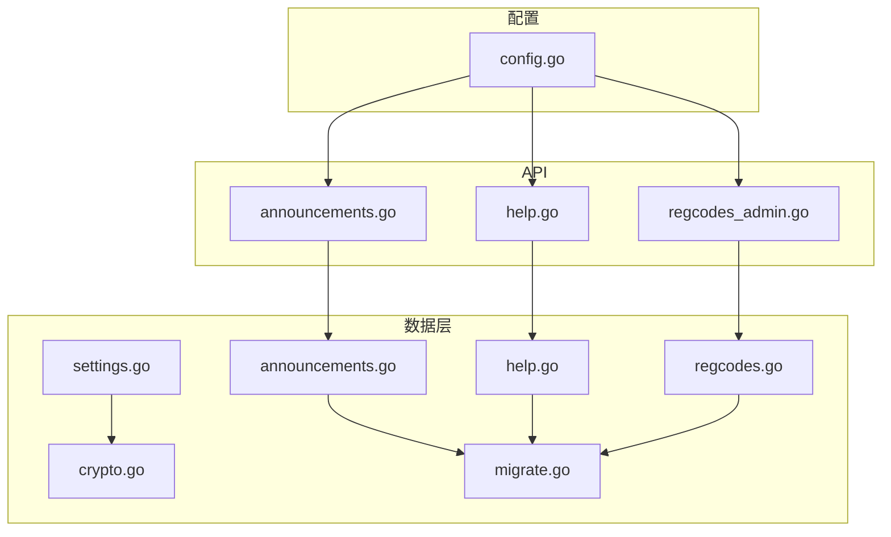
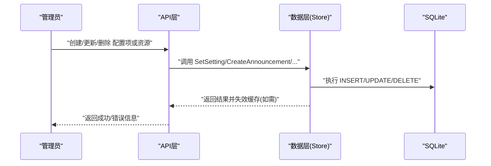
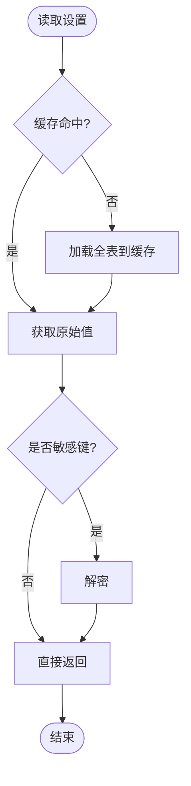
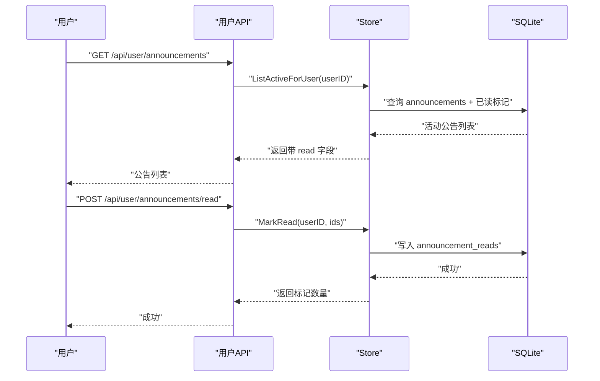
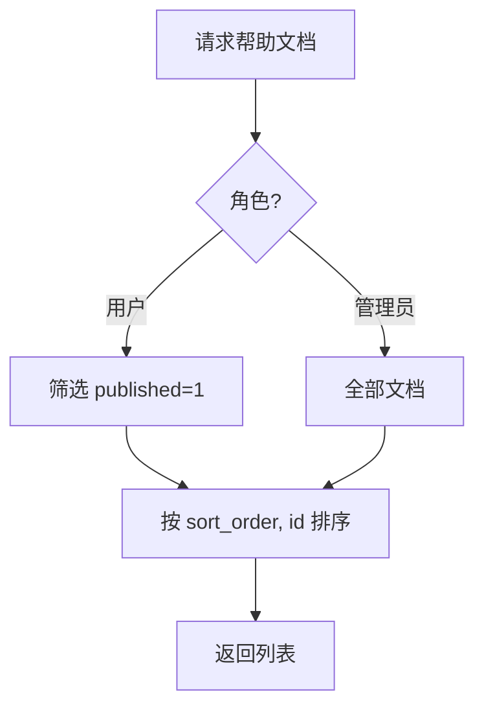
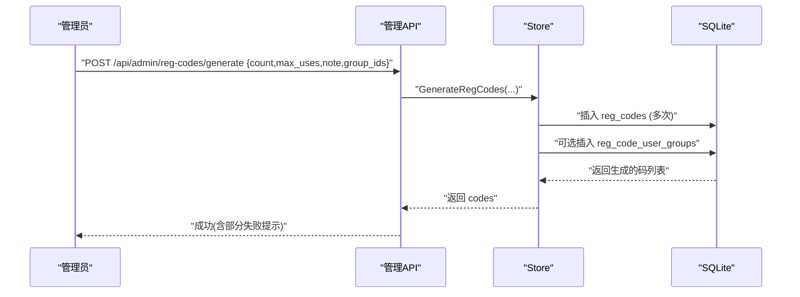
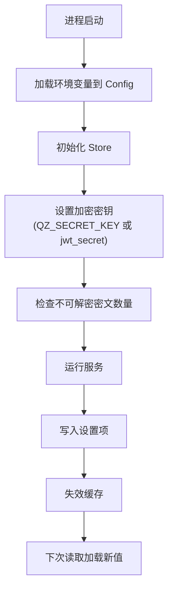
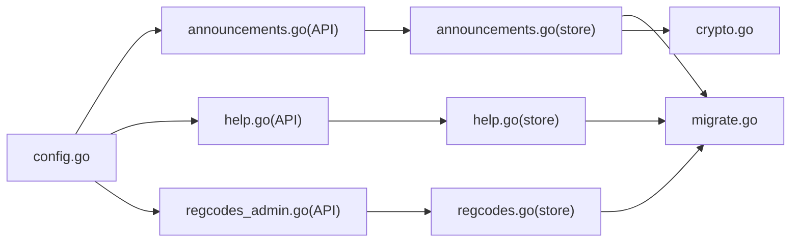

# 系统配置模型

<cite>
**本文引用的文件**
- [internal/store/settings.go](file://internal/store/settings.go)
- [internal/store/crypto.go](file://internal/store/crypto.go)
- [internal/store/store.go](file://internal/store/store.go)
- [internal/store/migrate.go](file://internal/store/migrate.go)
- [internal/config/config.go](file://internal/config/config.go)
- [internal/api/announcements.go](file://internal/api/announcements.go)
- [internal/api/help.go](file://internal/api/help.go)
- [internal/api/regcodes_admin.go](file://internal/api/regcodes_admin.go)
</cite>

## 目录
1. [简介](#简介)
2. [项目结构](#项目结构)
3. [核心组件](#核心组件)
4. [架构总览](#架构总览)
5. [详细组件分析](#详细组件分析)
6. [依赖关系分析](#依赖关系分析)
7. [性能考量](#性能考量)
8. [故障排查指南](#故障排查指南)
9. [结论](#结论)
10. [附录](#附录)

## 简介
本文件聚焦系统配置相关的数据模型与运行机制，覆盖以下主题：
- 设置项（settings）的存储、加密与缓存机制
- 公告（announcements）的发布策略与时间窗口控制
- 帮助文档（help_docs）的分类管理与版本化展示
- 注册码（reg_codes）的使用限制与批量管理
- 系统参数的动态加载与热更新机制

## 项目结构
围绕系统配置的核心代码分布在数据层（store）、配置加载（config）与API层（api）：
- 数据层：settings、announcements、help、regcodes、migrate（表结构定义与迁移）
- 配置加载：从环境变量读取运行时参数
- API层：提供管理员与用户侧的读写接口

图表来源
- [internal/store/settings.go:1-139](file://internal/store/settings.go#L1-L139)
- [internal/store/crypto.go:1-46](file://internal/store/crypto.go#L1-L46)
- [internal/store/migrate.go:11-14](file://internal/store/migrate.go#L11-L14)
- [internal/store/migrate.go:223-263](file://internal/store/migrate.go#L223-L263)
- [internal/config/config.go:1-37](file://internal/config/config.go#L1-L37)
- [internal/api/announcements.go:1-91](file://internal/api/announcements.go#L1-L91)
- [internal/api/help.go:1-83](file://internal/api/help.go#L1-L83)
- [internal/api/regcodes_admin.go:1-73](file://internal/api/regcodes_admin.go#L1-L73)

章节来源
- [internal/store/settings.go:1-139](file://internal/store/settings.go#L1-L139)
- [internal/store/migrate.go:11-14](file://internal/store/migrate.go#L11-L14)
- [internal/config/config.go:1-37](file://internal/config/config.go#L1-L37)

## 核心组件
- 设置项（settings）
  - 键值对存储，支持布尔与整型便捷读写
  - 敏感字段按白名单加密存储，读时自动解密
  - 全表内存缓存，写操作后失效，保证一致性
- 公告（announcements）
  - 支持置顶、启用/禁用、显示时间窗（start_at/end_at）
  - 用户维度已读标记，列表返回时附带 read 状态
- 帮助文档（help_docs）
  - 排序字段 sort_order 控制展示顺序
  - published 控制是否对用户可见
- 注册码（reg_codes）
  - 唯一码、最大使用次数、启用标志、备注
  - 使用记录 reg_code_uses 快照用户名/邮箱
  - 可绑定用户组，兑换时自动加入
- 运行时配置（config）
  - 通过 QZ_* 环境变量注入监听地址、数据库路径、管理员账号等

章节来源
- [internal/store/settings.go:7-139](file://internal/store/settings.go#L7-L139)
- [internal/store/crypto.go:12-46](file://internal/store/crypto.go#L12-L46)
- [internal/store/announcements.go:9-139](file://internal/store/announcements.go#L9-L139)
- [internal/store/help.go:5-68](file://internal/store/help.go#L5-L68)
- [internal/store/regcodes.go:9-200](file://internal/store/regcodes.go#L9-L200)
- [internal/config/config.go:5-37](file://internal/config/config.go#L5-L37)

## 架构总览
系统配置在“配置加载 → 数据持久化 → API 暴露”三层中协作：
- 启动时加载环境变量到运行时配置
- 数据层维护 settings 表及缓存，提供加解密能力
- API 层将业务规则（如公告时间窗、帮助文档发布态、注册码限额）转化为查询与写入

图表来源
- [internal/api/announcements.go:45-91](file://internal/api/announcements.go#L45-L91)
- [internal/api/help.go:21-83](file://internal/api/help.go#L21-L83)
- [internal/api/regcodes_admin.go:11-73](file://internal/api/regcodes_admin.go#L11-L73)
- [internal/store/settings.go:73-95](file://internal/store/settings.go#L73-L95)

## 详细组件分析

### 设置项（settings）与动态加载
- 设计要点
  - 键值对表，key 为主键；value 为字符串，提供 GetSettingBool/GetSettingInt64 便捷方法
  - 敏感 key 白名单（如 smtp_pass、cf_api_token）在落盘前加密，读取时透明解密
  - 全表内存缓存，首次访问时加载，写操作后失效，避免频繁查库
- 动态加载与热更新
  - 读路径走缓存，写路径立即失效缓存，后续读将重新加载最新值
  - 结合应用逻辑可在服务运行期间生效新配置（无需重启）
- 安全与密钥
  - 使用 AES-GCM 加密，密钥由外部环境变量 QZ_SECRET_KEY 派生，未设置时回退至 jwt_secret
  - 启动时会检测不可解密的密文数量，防止静默降级

图表来源
- [internal/store/settings.go:7-65](file://internal/store/settings.go#L7-L65)
- [internal/store/crypto.go:12-46](file://internal/store/crypto.go#L12-L46)

章节来源
- [internal/store/settings.go:7-139](file://internal/store/settings.go#L7-L139)
- [internal/store/crypto.go:12-46](file://internal/store/crypto.go#L12-L46)
- [main.go:51-71](file://main.go#L51-L71)

### 公告（announcements）发布策略与时间控制
- 数据结构
  - 包含标题、内容、置顶、启用、开始/结束时间、创建/更新时间
  - 用户视图附加 read 标记，表示当前用户是否已读
- 发布策略
  - 仅 enabled=1 且处于 start_at <= now < end_at 的公告对用户可见
  - 列表按 pinned 降序、id 降序排列，置顶优先
- 已读标记
  - 用户可批量标记当前活动公告为已读，写入 announcement_reads 表
- API 流程
  - 用户端：列出活动公告、批量标记已读
  - 管理端：增删改查公告

图表来源
- [internal/api/announcements.go:12-43](file://internal/api/announcements.go#L12-L43)
- [internal/store/announcements.go:59-103](file://internal/store/announcements.go#L59-L103)
- [internal/store/migrate.go:223-240](file://internal/store/migrate.go#L223-L240)

章节来源
- [internal/store/announcements.go:9-139](file://internal/store/announcements.go#L9-L139)
- [internal/api/announcements.go:12-91](file://internal/api/announcements.go#L12-L91)
- [internal/store/migrate.go:223-240](file://internal/store/migrate.go#L223-L240)

### 帮助文档（help_docs）分类管理与版本控制
- 数据结构
  - 标题、内容（Markdown）、排序 sort_order、发布状态 published、时间戳
- 分类与排序
  - 通过 sort_order 控制展示顺序；published 控制是否对用户可见
- 版本控制
  - 通过 updated_at 体现版本变更；新增/更新均刷新时间戳
- API 流程
  - 用户端：仅获取 published=true 的文档
  - 管理端：全量查看与增删改

图表来源
- [internal/store/help.go:15-37](file://internal/store/help.go#L15-L37)
- [internal/api/help.go:11-29](file://internal/api/help.go#L11-L29)
- [internal/store/migrate.go:255-263](file://internal/store/migrate.go#L255-L263)

章节来源
- [internal/store/help.go:5-68](file://internal/store/help.go#L5-L68)
- [internal/api/help.go:11-83](file://internal/api/help.go#L11-L83)
- [internal/store/migrate.go:255-263](file://internal/store/migrate.go#L255-L263)

### 注册码（reg_codes）使用限制与批量管理
- 数据结构
  - code 唯一、max_uses 限制使用次数（0 表示无限）、used 计数、enabled 开关、note 备注
  - reg_code_uses 记录每次使用的用户快照（user_id、username、email、used_at）
  - reg_code_user_groups 关联用户组，兑换时自动加入
- 使用限制
  - RegCodeRedeemable 快速预检是否可用（不扣减）
  - ConsumeRegCode 原子扣减并返回 code id，确保并发安全
- 批量管理
  - GenerateRegCodes 批量生成（最多200），可为每个码绑定相同用户组
  - 管理端支持启用/禁用、删除单个码

图表来源
- [internal/api/regcodes_admin.go:20-48](file://internal/api/regcodes_admin.go#L20-L48)
- [internal/store/regcodes.go:104-139](file://internal/store/regcodes.go#L104-L139)
- [internal/store/migrate.go:174-201](file://internal/store/migrate.go#L174-L201)

章节来源
- [internal/store/regcodes.go:9-200](file://internal/store/regcodes.go#L9-L200)
- [internal/api/regcodes_admin.go:11-73](file://internal/api/regcodes_admin.go#L11-L73)
- [internal/store/migrate.go:174-201](file://internal/store/migrate.go#L174-L201)

### 系统参数的动态加载与热更新机制
- 运行时配置
  - 通过 QZ_LISTEN、QZ_DB、QZ_ADMIN_USER、QZ_ADMIN_PASS 等环境变量注入
- 设置项热更新
  - 写 settings 后立即失效内存缓存，下次读取即拉取最新值
  - 敏感字段自动加密/解密，无需业务侧处理
- 启动自检
  - 检测不可解密的密文数量，避免静默降级导致节点异常

图表来源
- [internal/config/config.go:14-37](file://internal/config/config.go#L14-L37)
- [internal/store/settings.go:67-95](file://internal/store/settings.go#L67-L95)
- [main.go:51-71](file://main.go#L51-L71)

章节来源
- [internal/config/config.go:14-37](file://internal/config/config.go#L14-L37)
- [internal/store/settings.go:67-95](file://internal/store/settings.go#L67-L95)
- [main.go:51-71](file://main.go#L51-L71)

## 依赖关系分析
- 数据层内部依赖
  - settings 依赖 crypto 进行加解密
  - announcements/help/regcodes 依赖 migrate 定义的表结构
  - store 统一封装 SQLite 连接与并发参数
- 外部依赖
  - 环境变量驱动运行时行为
  - API 层依赖 store 提供的数据访问方法

图表来源
- [internal/config/config.go:14-37](file://internal/config/config.go#L14-L37)
- [internal/api/announcements.go:1-91](file://internal/api/announcements.go#L1-L91)
- [internal/api/help.go:1-83](file://internal/api/help.go#L1-L83)
- [internal/api/regcodes_admin.go:1-73](file://internal/api/regcodes_admin.go#L1-L73)
- [internal/store/announcements.go:1-139](file://internal/store/announcements.go#L1-L139)
- [internal/store/help.go:1-68](file://internal/store/help.go#L1-L68)
- [internal/store/regcodes.go:1-200](file://internal/store/regcodes.go#L1-L200)
- [internal/store/migrate.go:11-263](file://internal/store/migrate.go#L11-L263)
- [internal/store/crypto.go:1-46](file://internal/store/crypto.go#L1-L46)

章节来源
- [internal/store/store.go:10-71](file://internal/store/store.go#L10-L71)
- [internal/store/migrate.go:11-263](file://internal/store/migrate.go#L11-L263)

## 性能考量
- 设置项缓存
  - 全表缓存减少重复查询，写操作即时失效，兼顾一致性与性能
- 数据库参数
  - WAL 模式提升并发读性能；busy_timeout 降低冲突失败概率
- 索引优化
  - 公告、帮助、注册码等关键查询均有合适索引（如 user_id、code 等）
- 批量生成
  - 注册码批量生成上限为200，避免单次事务过大

章节来源
- [internal/store/settings.go:24-65](file://internal/store/settings.go#L24-L65)
- [internal/store/store.go:27-57](file://internal/store/store.go#L27-L57)
- [internal/store/regcodes.go:104-139](file://internal/store/regcodes.go#L104-L139)
- [internal/store/migrate.go:182-201](file://internal/store/migrate.go#L182-L201)

## 故障排查指南
- 无法解密设置项
  - 现象：服务启动时报不可解密密文数量警告
  - 原因：QZ_SECRET_KEY 被修改或不匹配
  - 处理：恢复正确的密钥或重新生成受影响配置
- 公告不显示
  - 检查 enabled 是否为真，start_at/end_at 是否包含当前时间
  - 确认用户是否已读（read 字段）
- 注册码无效
  - 检查 enabled 状态与 max_uses 剩余次数
  - 使用 RegCodeRedeemable 预检，再用 ConsumeRegCode 原子消费
- 帮助文档不出现
  - 确认 published 为真，sort_order 是否正确
- 设置项未生效
  - 确认写入成功后缓存已失效，再次读取应获得新值

章节来源
- [main.go:51-71](file://main.go#L51-L71)
- [internal/store/announcements.go:59-103](file://internal/store/announcements.go#L59-L103)
- [internal/store/regcodes.go:141-179](file://internal/store/regcodes.go#L141-L179)
- [internal/store/help.go:15-37](file://internal/store/help.go#L15-L37)
- [internal/store/settings.go:67-95](file://internal/store/settings.go#L67-L95)

## 结论
- 设置项采用“键值对+敏感加密+内存缓存”的设计，实现安全与高性能的动态配置
- 公告通过时间窗与置顶控制精准投放，用户维度已读提升体验
- 帮助文档以排序与发布状态实现灵活的内容管理
- 注册码具备严格的使用限制与批量管理能力，适合发放与审计
- 整体架构清晰，API 与数据层职责明确，便于扩展与维护

## 附录
- 表结构参考
  - settings：key/value 键值对
  - announcements：公告主表与已读表
  - help_docs：帮助文档表
  - reg_codes、reg_code_uses、reg_code_user_groups：注册码及其使用与分组关联

章节来源
- [internal/store/migrate.go:11-14](file://internal/store/migrate.go#L11-L14)
- [internal/store/migrate.go:223-263](file://internal/store/migrate.go#L223-L263)
- [internal/store/migrate.go:174-201](file://internal/store/migrate.go#L174-L201)
