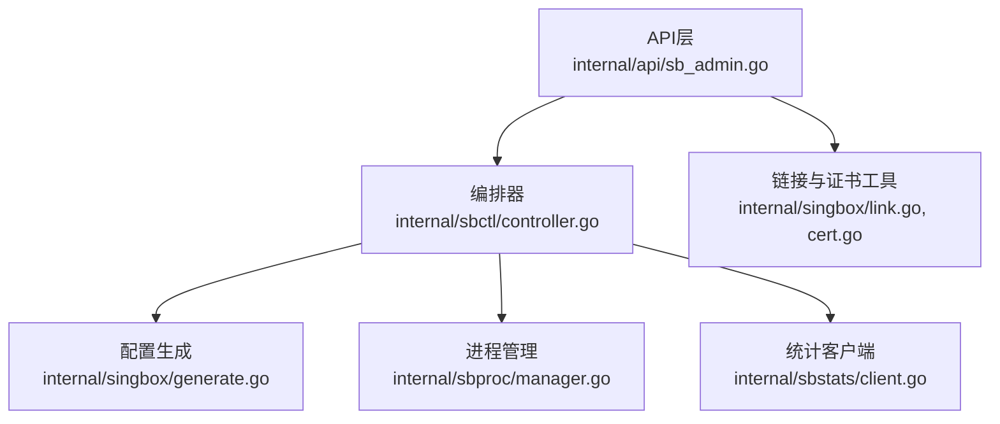
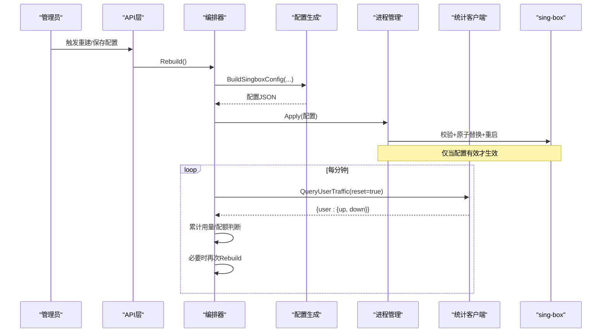
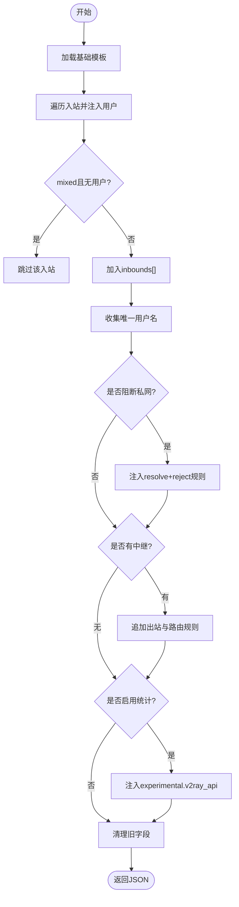
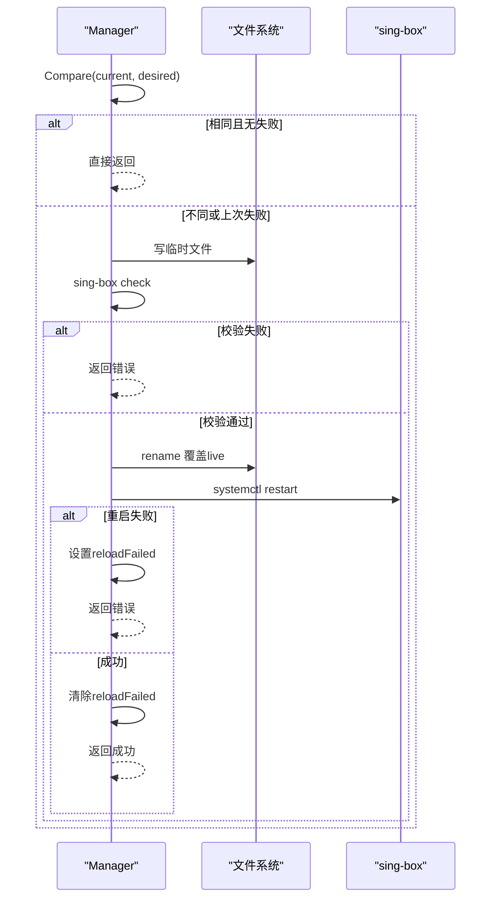
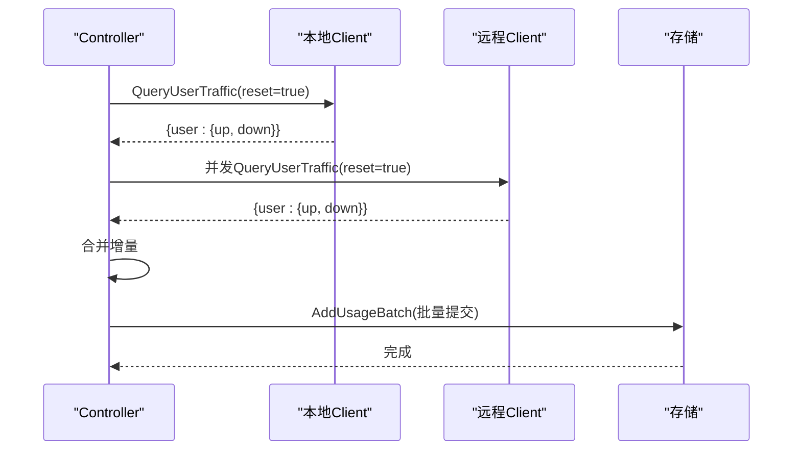
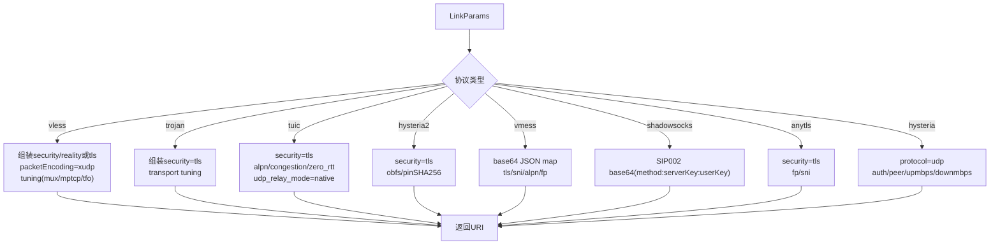
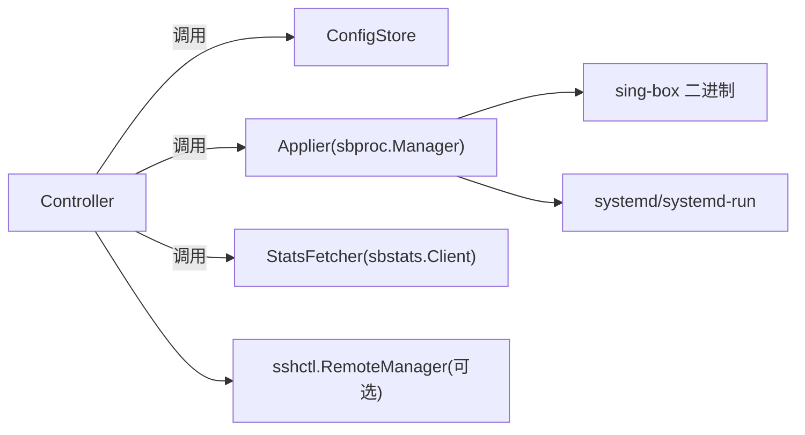

# Sing-box集成模块

<cite>
**本文引用的文件**
- [generate.go](file://internal/singbox/generate.go)
- [link.go](file://internal/singbox/link.go)
- [cert.go](file://internal/singbox/cert.go)
- [manager.go](file://internal/sbproc/manager.go)
- [controller.go](file://internal/sbctl/controller.go)
- [client.go](file://internal/sbstats/client.go)
- [sb_admin.go](file://internal/api/sb_admin.go)
</cite>

## 目录
1. [简介](#简介)
2. [项目结构](#项目结构)
3. [核心组件](#核心组件)
4. [架构总览](#架构总览)
5. [详细组件分析](#详细组件分析)
6. [依赖关系分析](#依赖关系分析)
7. [性能与资源限制](#性能与资源限制)
8. [故障排查指南](#故障排查指南)
9. [结论](#结论)
10. [附录：API接口说明](#附录api接口说明)

## 简介
本模块实现“轻舟”对 sing-box 的完整集成，覆盖以下关键能力：
- 进程管理：生成配置、校验、原子替换并重启服务，支持本地与远程节点。
- 配置动态生成：基于用户授权与入站模板拼装最终 JSON，注入 v2ray_api 统计开关。
- 流量统计采集：通过 gRPC-over-h2c 查询 per-user up/down 增量，累计到用户用量。
- 代理链接生成：为多种协议（vless/trojan/tuic/hysteria2/vmess/shadowsocks/anytls/hysteria）生成订阅链接。
- 证书与TLS：自签证书、ACME 申请、Reality 参数、ALPN/TLS版本控制等。
- API：提供管理员端点用于证书管理、Reality 配置、SNI 连通性测试、TLS 列表管理等。

## 项目结构
围绕 sing-box 的核心代码分布在如下包：
- internal/singbox：配置生成、链接渲染、证书工具。
- internal/sbproc：sing-box 进程生命周期管理（校验、写入、重载）。
- internal/sbstats：gRPC 客户端，读取 per-user 流量。
- internal/sbctl：编排层，串联数据、配置生成、进程管理与统计采集。
- internal/api：HTTP 接口，暴露证书、Reality、SNI 测试等管理能力。

图表来源
- [controller.go:1-120](file://internal/sbctl/controller.go#L1-L120)
- [generate.go:137-295](file://internal/singbox/generate.go#L137-L295)
- [manager.go:22-66](file://internal/sbproc/manager.go#L22-L66)
- [client.go:1-90](file://internal/sbstats/client.go#L1-L90)
- [sb_admin.go:33-221](file://internal/api/sb_admin.go#L33-L221)

章节来源
- [controller.go:1-120](file://internal/sbctl/controller.go#L1-L120)
- [generate.go:137-295](file://internal/singbox/generate.go#L137-L295)
- [manager.go:22-66](file://internal/sbproc/manager.go#L22-L66)
- [client.go:1-90](file://internal/sbstats/client.go#L1-L90)
- [sb_admin.go:33-221](file://internal/api/sb_admin.go#L33-L221)

## 核心组件
- 配置生成器（singbox.GenerateConfigWithOptions）：从基础模板、入站集合与选项拼装最终 JSON，注入 experimental.v2ray_api.stats.users，处理私有地址拦截、中继路由、DNS劫持保护、兼容旧字段清理。
- 进程管理器（sbproc.Manager）：Validate → 原子写入 → reload（systemctl restart），失败重试标记避免误判无变更。
- 统计客户端（sbstats.Client）：自定义 h2c + protobuf 编解码，QueryStats reset=true 获取增量并清零。
- 编排控制器（sbctl.Controller）：定时任务 CollectStats + Rebuild；支持本地与远程节点并发下发与采集；能力探测缓存 v2ray_api 插件可用性。
- 链接生成器（singbox.BuildShareLink）：按协议输出标准分享链接，携带 TLS/Reality/传输/拥塞/UDP 能力等参数。
- 证书工具（singbox.CertFingerprintSHA256 / GenerateSelfSignedCert）：计算指纹、生成自签证书。

章节来源
- [generate.go:137-295](file://internal/singbox/generate.go#L137-L295)
- [manager.go:22-66](file://internal/sbproc/manager.go#L22-L66)
- [client.go:122-183](file://internal/sbstats/client.go#L122-L183)
- [controller.go:353-455](file://internal/sbctl/controller.go#L353-L455)
- [link.go:206-418](file://internal/singbox/link.go#L206-L418)
- [cert.go:19-139](file://internal/singbox/cert.go#L19-L139)

## 架构总览
整体流程分为两条主线：
- 配置下发线：数据层构建用户→标签映射 → 生成 JSON → 校验 → 原子替换 → 重启服务。
- 统计采集线：定时轮询本地与远程节点的 v2ray_api → 解析增量 → 累计用量 → 触发配额检查与重建。

图表来源
- [controller.go:353-455](file://internal/sbctl/controller.go#L353-L455)
- [controller.go:537-649](file://internal/sbctl/controller.go#L537-L649)
- [manager.go:247-285](file://internal/sbproc/manager.go#L247-L285)
- [client.go:122-183](file://internal/sbstats/client.go#L122-L183)

## 详细组件分析

### 配置动态生成（singbox.GenerateConfigWithOptions）
- 输入：基础模板（log/dns/route/outbounds）、入站列表（协议、监听端口、TLS/传输/flow等）、选项（v2ray_listen、是否阻断私网、中继）。
- 处理要点：
  - 去重并排序用户，保证生成字节级确定性，避免无意义重载。
  - mixed 入站若无用户则不输出，防止开放代理。
  - 自动注入 experimental.v2ray_api.stats.enabled 与 users 列表，供统计使用。
  - 可选注入“拒绝私网访问”规则，并在直出入站上启用 resolve + ip_is_private reject。
  - 中继场景：追加出站与路由规则，必要时对 UDP 进行丢弃并劫持 DNS:53。
  - 清理旧版 domain_strategy 字段，确保新版 sing-box 校验通过。
- 复杂度：O(U+R)，U 为用户数，R 为规则数；主要开销在 JSON 序列化与规则拼接。

图表来源
- [generate.go:164-295](file://internal/singbox/generate.go#L164-L295)
- [generate.go:297-468](file://internal/singbox/generate.go#L297-L468)
- [generate.go:500-531](file://internal/singbox/generate.go#L500-L531)

章节来源
- [generate.go:164-295](file://internal/singbox/generate.go#L164-L295)
- [generate.go:297-468](file://internal/singbox/generate.go#L297-L468)
- [generate.go:500-531](file://internal/singbox/generate.go#L500-L531)

### 进程生命周期管理（sbproc.Manager）
- Validate：临时文件 + sing-box check，失败不触碰在线配置。
- Apply：比较当前磁盘配置字节，若相同且上次未失败则跳过；否则校验后原子写入（同目录 temp + rename），再调用 reload（systemctl restart）。
- 沙箱逃逸：当面板受 ProtectSystem=full 影响导致 /etc 只读时，通过 systemd-run 以特权上下文写入并回读校验一致性。
- 健壮性：reloadFailed 标记避免“已写入但未成功重启”被误判为无变更。

图表来源
- [manager.go:22-66](file://internal/sbproc/manager.go#L22-L66)
- [manager.go:102-146](file://internal/sbproc/manager.go#L102-L146)
- [manager.go:247-285](file://internal/sbproc/manager.go#L247-L285)

章节来源
- [manager.go:22-66](file://internal/sbproc/manager.go#L22-L66)
- [manager.go:102-146](file://internal/sbproc/manager.go#L102-L146)
- [manager.go:247-285](file://internal/sbproc/manager.go#L247-L285)

### 流量统计采集（sbstats.Client + sbctl.Controller）
- 协议：gRPC-over-h2c，手动编码/解码 QueryStatsRequest/Response，reset=true 每次拉取增量并清零。
- 连接管理：Client 记录所有拨号连接，Close 时强制关闭，避免 SSH 隧道泄漏 sshd 进程。
- 聚合：CollectStats 同时拉取本地与远程（经SSH隧道）节点，累加至用户用量，批量提交。
- 能力探测：Controller 缓存各节点是否支持 v2ray_api，避免无效请求。

图表来源
- [client.go:122-183](file://internal/sbstats/client.go#L122-L183)
- [client.go:92-120](file://internal/sbstats/client.go#L92-L120)
- [controller.go:537-649](file://internal/sbctl/controller.go#L537-L649)

章节来源
- [client.go:92-120](file://internal/sbstats/client.go#L92-L120)
- [client.go:122-183](file://internal/sbstats/client.go#L122-L183)
- [controller.go:537-649](file://internal/sbctl/controller.go#L537-L649)

### 代理链接生成（singbox.BuildShareLink）
- 支持协议：vless、trojan、tuic、hysteria2、vmess、shadowsocks、anytls、hysteria。
- 关键参数：TLS/Reality、SNI、ALPN、fingerprint、传输（ws/grpc/httpupgrade）、拥塞控制、0-RTT、NoUDP、mux/brutal、pinSHA256 等。
- 兼容性：IPv6 主机名正确加方括号；VMess 的 tls 字段由入站真实 TLS 决定而非 SNI；TUIC 显式声明 udp_relay_mode。

图表来源
- [link.go:206-418](file://internal/singbox/link.go#L206-L418)

章节来源
- [link.go:206-418](file://internal/singbox/link.go#L206-L418)

### 证书管理与TLS配置（API + singbox/cert）
- 自签证书：GenerateSelfSignedCert 生成 ECDSA P-256 证书与私钥，SAN 根据域名/IP 设置。
- Reality：API 支持创建/编辑 Reality 配置文件（handshake server/port、short_id、公钥/私钥、utls fingerprint）。
- ACME：通过 acme.sh 申请证书并保存到稳定路径，随后保存 TLS 条目并重启 sing-box。
- 校验：validateCertKeyPair 验证 PEM 配对；certInfoFromPEM 解析有效期用于前端展示。

章节来源
- [cert.go:19-139](file://internal/singbox/cert.go#L19-L139)
- [sb_admin.go:33-221](file://internal/api/sb_admin.go#L33-L221)
- [sb_admin.go:475-659](file://internal/api/sb_admin.go#L475-L659)
- [sb_admin.go:661-789](file://internal/api/sb_admin.go#L661-L789)

## 依赖关系分析
- 耦合度：
  - Controller 依赖 ConfigStore、Applier、StatsFetcher 三个小接口，便于测试与替换实现。
  - Manager 封装了二进制路径、配置路径、reload 回调，屏蔽系统差异。
  - Client 独立于 grpc-go，降低依赖与许可风险。
- 外部依赖：
  - sing-box 二进制（check/version）。
  - systemd/systemd-run（服务管理、沙箱逃逸）。
  - acme.sh（证书申请，通过 API 层调用）。
- 潜在循环：无直接循环依赖；Controller 作为协调者组织其他组件。

图表来源
- [controller.go:36-115](file://internal/sbctl/controller.go#L36-L115)
- [manager.go:22-66](file://internal/sbproc/manager.go#L22-L66)
- [client.go:41-90](file://internal/sbstats/client.go#L41-L90)

章节来源
- [controller.go:36-115](file://internal/sbctl/controller.go#L36-L115)
- [manager.go:22-66](file://internal/sbproc/manager.go#L22-L66)
- [client.go:41-90](file://internal/sbstats/client.go#L41-L90)

## 性能与资源限制
- 配置生成：
  - 用户排序与去重保证字节级确定性，减少不必要重载。
  - 规则注入采用预置策略，避免重复规则增长。
- 进程管理：
  - 原子写入避免半写状态；reloadFailed 避免误判。
  - systemd-run 超时 15s，避免阻塞 HTTP 请求。
- 统计采集：
  - 每节点独立 Client，Close 释放连接，防止 SSH 会话泄漏。
  - 批量提交用量，减少数据库锁竞争。
- 建议调优：
  - 调整统计采集间隔（默认 1 分钟），平衡实时性与负载。
  - 合理设置 sing-box 日志级别与采样，避免磁盘 IO 瓶颈。
  - 对高并发节点，考虑增加系统文件描述符上限与 TCP 队列长度。

章节来源
- [generate.go:192-223](file://internal/singbox/generate.go#L192-L223)
- [manager.go:203-226](file://internal/sbproc/manager.go#L203-L226)
- [client.go:92-120](file://internal/sbstats/client.go#L92-L120)
- [controller.go:661-699](file://internal/sbctl/controller.go#L661-L699)

## 故障排查指南
- 配置校验失败：
  - 查看 sing-box check 输出，定位具体字段问题；确认是否包含旧版 domain_strategy。
- 无法写入 /etc/sing-box/config.json：
  - 可能受 ProtectSystem=full 影响；系统会提示通过 ReadWritePaths 放行并重载面板服务。
- 重启失败：
  - 检查 systemctl restart 输出；关注 reloadFailed 标记，下次重建将重试。
- 统计为空：
  - 确认节点是否启用了 v2ray_api 插件；Controller 会缓存能力结果，必要时重新探测。
  - 检查 SSH 隧道是否正常，Client.Close 是否被调用。
- 链接不可用：
  - 核对协议参数（如 TUIC 的 udp_relay_mode、Hysteria2 的 obfs 与 pinSHA256）。
  - 检查 NoUDP 标志是否与入站 UDP 模式一致。

章节来源
- [manager.go:53-66](file://internal/sbproc/manager.go#L53-L66)
- [manager.go:68-88](file://internal/sbproc/manager.go#L68-L88)
- [manager.go:247-285](file://internal/sbproc/manager.go#L247-L285)
- [controller.go:282-343](file://internal/sbctl/controller.go#L282-L343)
- [client.go:92-120](file://internal/sbstats/client.go#L92-L120)
- [link.go:206-418](file://internal/singbox/link.go#L206-L418)

## 结论
本模块以“配置即产物、进程即服务、统计即度量”的思路，将 sing-box 纳入统一编排：
- 通过确定性生成与原子替换保障稳定性。
- 通过能力探测与并发下发提升多节点效率。
- 通过轻量 gRPC 客户端实现精准计量。
- 通过丰富的链接与证书工具链简化运维。

## 附录：API接口说明
以下为与 sing-box 集成相关的主要管理员接口（路径与方法）：
- POST /api/admin/sb/reality-keypair：生成 Reality 密钥对与 short_id。
- POST /api/admin/sb/tls/self-signed：生成自签证书与私钥（PEM）。
- POST /api/admin/sb/tls/acme：通过 acme.sh 申请证书并保存 TLS 条目。
- GET /api/admin/sb/sni-test：测试 SNI 目标 TCP 握手延迟与可达性。
- GET /api/admin/sb/tls：列出 TLS 条目（含证书有效期信息）。
- POST /api/admin/sb/tls：新增/更新 TLS 条目（支持引用托管证书或粘贴 PEM）。
- PUT /api/admin/sb/tls/reality/{id}：编辑 Reality 配置（保留密钥对）。
- POST /api/admin/sb/tls/cert 与 PUT /api/admin/sb/tls/cert/{id}：常规 TLS 条目管理。

章节来源
- [sb_admin.go:33-221](file://internal/api/sb_admin.go#L33-L221)
- [sb_admin.go:233-344](file://internal/api/sb_admin.go#L233-L344)
- [sb_admin.go:374-473](file://internal/api/sb_admin.go#L374-L473)
- [sb_admin.go:475-659](file://internal/api/sb_admin.go#L475-L659)
- [sb_admin.go:661-789](file://internal/api/sb_admin.go#L661-L789)
