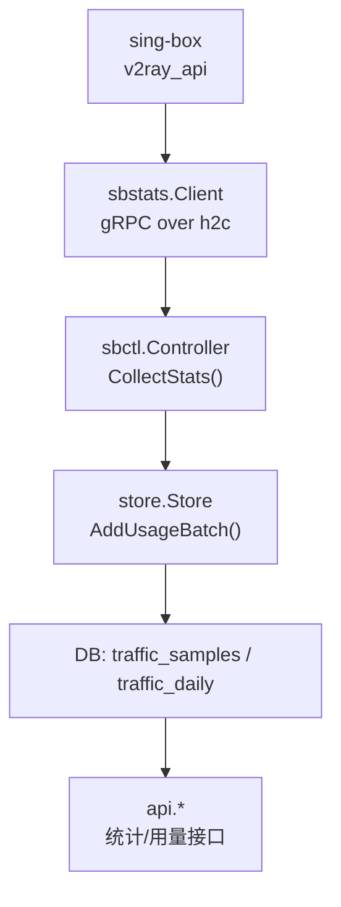
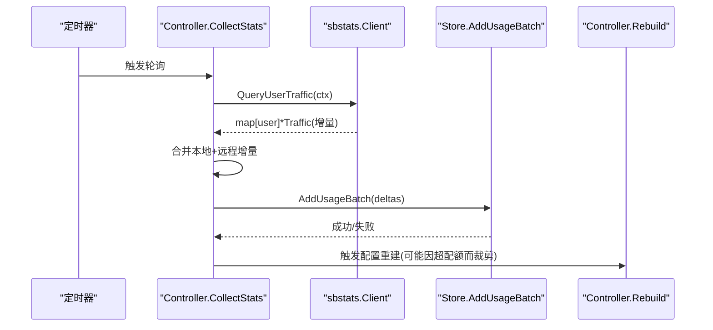
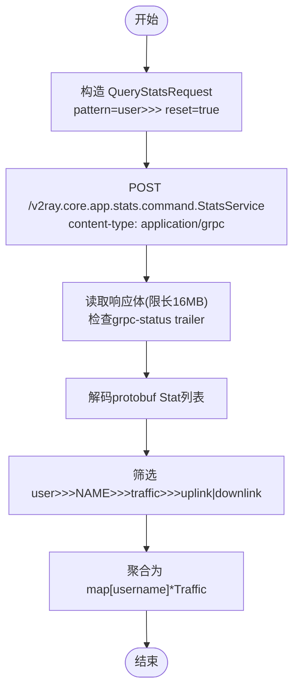
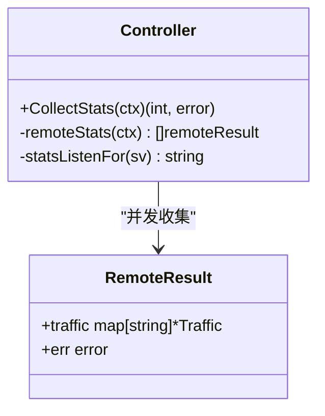
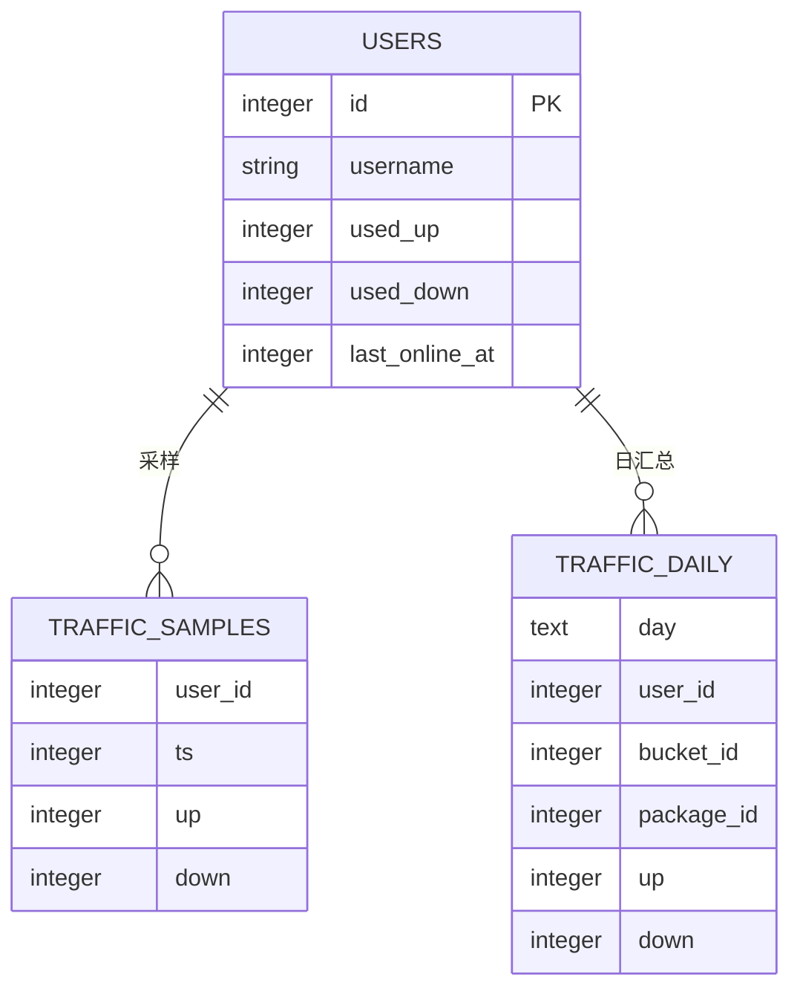
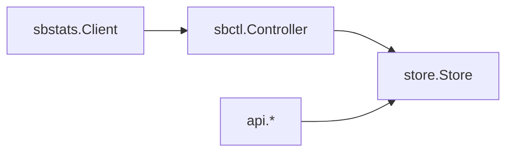

# 流量统计

<cite>
**本文引用的文件**
- [internal/sbstats/client.go](file://internal/sbstats/client.go)
- [internal/sbctl/controller.go](file://internal/sbctl/controller.go)
- [internal/store/migrate.go](file://internal/store/migrate.go)
- [internal/store/stats.go](file://internal/store/stats.go)
- [internal/store/usage.go](file://internal/store/usage.go)
- [internal/api/stats.go](file://internal/api/stats.go)
- [internal/api/usage.go](file://internal/api/usage.go)
- [internal/api/router.go](file://internal/api/router.go)
</cite>

## 目录
1. [简介](#简介)
2. [项目结构](#项目结构)
3. [核心组件](#核心组件)
4. [架构总览](#架构总览)
5. [详细组件分析](#详细组件分析)
6. [依赖关系分析](#依赖关系分析)
7. [性能与存储优化](#性能与存储优化)
8. [告警与配额控制](#告警与配额控制)
9. [API 接口说明](#api-接口说明)
10. [故障排查指南](#故障排查指南)
11. [扩展指南](#扩展指南)
12. [结论](#结论)

## 简介
本模块实现基于 sing-box v2ray_api gRPC 的流量采集、聚合、历史统计与用量查询能力。系统通过定时轮询各节点（本地与远程）的 per-user 流量增量，写入时间序列表并生成日级汇总；上层提供面向用户与管理员的统计与用量报表 API，支持多节点数据聚合与去重、阈值告警与配额控制的联动。

## 项目结构
- 数据采集层：sbstats 客户端通过明文 HTTP/2 调用 sing-box 的 StatsService，获取 per-user up/down 增量。
- 调度与聚合层：sbctl Controller 周期性执行 CollectStats，合并本地与各远程节点的增量，批量写入 store。
- 存储与报表层：store 维护 traffic_samples（采样）、traffic_daily（日级汇总）以及用户/套餐维度统计；api 暴露 REST 接口供前端展示。

图表来源
- [internal/sbstats/client.go:122-183](file://internal/sbstats/client.go#L122-L183)
- [internal/sbctl/controller.go:537-589](file://internal/sbctl/controller.go#L537-L589)
- [internal/store/migrate.go:406-445](file://internal/store/migrate.go#L406-L445)
- [internal/api/router.go:354-364](file://internal/api/router.go#L354-L364)

章节来源
- [internal/sbstats/client.go:1-183](file://internal/sbstats/client.go#L1-L183)
- [internal/sbctl/controller.go:1-141](file://internal/sbctl/controller.go#L1-L141)
- [internal/store/migrate.go:406-445](file://internal/store/migrate.go#L406-L445)
- [internal/api/router.go:354-364](file://internal/api/router.go#L354-L364)

## 核心组件
- sbstats.Client：以最小依赖实现 gRPC-over-h2c 的 QueryStats 请求与响应解码，按 user>>>NAME>>>traffic>>>uplink|downlink 模式解析 per-user 增量。
- sbctl.Controller：周期任务驱动 CollectStats，并发拉取本地与远程节点流量，合并为 UsageDelta 后批量入库；并在 Rebuild 时根据用量触发配置重建（用于配额控制）。
- store：定义并实现流量采样表、日级汇总表、用户/套餐统计、在线状态等查询；提供 UsageFilter 与窗口化查询。
- api：将 store 的能力封装为 REST 接口，包括用户流量趋势、管理员概览、用户分析、用量报表等。

章节来源
- [internal/sbstats/client.go:17-183](file://internal/sbstats/client.go#L17-L183)
- [internal/sbctl/controller.go:537-699](file://internal/sbctl/controller.go#L537-L699)
- [internal/store/stats.go:1-493](file://internal/store/stats.go#L1-L493)
- [internal/store/usage.go:1-484](file://internal/store/usage.go#L1-L484)
- [internal/api/stats.go:1-199](file://internal/api/stats.go#L1-L199)
- [internal/api/usage.go:1-284](file://internal/api/usage.go#L1-L284)

## 架构总览
- 采集：每约一分钟轮询一次，使用 reset=true 获取自上次轮询以来的增量，并将计数器清零。
- 聚合：同一 identity（bucket client_name）在多节点产生的流量会累加，避免重复或遗漏。
- 存储：traffic_samples 记录每次采样的 up/down 增量；traffic_daily 按天、按 bucket 汇总，保留长期历史。
- 报表：API 提供用户侧与管理员侧的多种视图，支持连续日期填充、窗口化与生命周期两种模式。

图表来源
- [internal/sbctl/controller.go:661-699](file://internal/sbctl/controller.go#L661-L699)
- [internal/sbstats/client.go:122-183](file://internal/sbstats/client.go#L122-L183)
- [internal/sbctl/controller.go:537-589](file://internal/sbctl/controller.go#L537-L589)

## 详细组件分析

### v2ray_api 插件集成与数据获取流程
- 协议与传输：使用 x/net/http2 直接发起 gRPC 请求至 experimental.v2ray_api.listen 地址（h2c 明文），无需 grpc-go 依赖。
- 请求构造：发送 QueryStatsRequest，pattern="user>>>"，reset=true，仅返回 per-user 计数器并清零。
- 响应解码：自定义轻量 protobuf 解码器，解析 Stat{name,value} 列表，过滤出 uplink/downlink 并映射到用户名。
- 连接管理：每个 Client 持有 http2.Transport，Close 时会关闭所有已拨号连接，防止 SSH 隧道泄漏进程。

图表来源
- [internal/sbstats/client.go:122-183](file://internal/sbstats/client.go#L122-L183)
- [internal/sbstats/client.go:188-258](file://internal/sbstats/client.go#L188-L258)

章节来源
- [internal/sbstats/client.go:1-364](file://internal/sbstats/client.go#L1-L364)

### 多节点流量聚合与去重机制
- 多节点采集：Controller.remoteStats 并发访问各远程节点的 stats API（通过 SSH 隧道），结果与本地结果合并。
- 去重策略：以 bucket client_name 作为唯一键进行累加，确保同一用户跨节点流量正确汇总。
- 容错处理：单个节点失败不影响其他节点结果；未重置的节点会在下次轮询继续累积。

图表来源
- [internal/sbctl/controller.go:596-649](file://internal/sbctl/controller.go#L596-L649)
- [internal/sbctl/controller.go:537-589](file://internal/sbctl/controller.go#L537-L589)

章节来源
- [internal/sbctl/controller.go:537-649](file://internal/sbctl/controller.go#L537-L649)

### 数据存储策略与历史统计
- traffic_samples：每次采样一行，包含 user_id、ts、up、down，用于短期趋势与在线判断；定期清理旧数据。
- traffic_daily：按天、按 bucket 汇总，保留长期历史，支撑“全生命周期”与“窗口期”两类报表。
- 索引优化：针对 user_id、ts、day 建立复合索引，提升范围查询与聚合效率。
- 迁移与回填：提供从 samples 回填 daily 的逻辑，保证历史连续性。

图表来源
- [internal/store/migrate.go:406-445](file://internal/store/migrate.go#L406-L445)

章节来源
- [internal/store/migrate.go:406-445](file://internal/store/migrate.go#L406-L445)
- [internal/store/stats.go:27-81](file://internal/store/stats.go#L27-L81)

### 用户用量计算与报表
- 生命周期模式：基于 users.used_* 与 user_plans.used_* 累计值，反映账户全生命周期用量。
- 窗口模式：基于 traffic_daily 在指定时间窗内的聚合，适合对近期用量进行分析。
- 连续日期填充：API 层将稀疏的日数据填充为连续窗口，便于前端绘图无断点。

章节来源
- [internal/store/usage.go:9-25](file://internal/store/usage.go#L9-L25)
- [internal/api/stats.go:20-60](file://internal/api/stats.go#L20-L60)
- [internal/api/usage.go:12-29](file://internal/api/usage.go#L12-L29)

## 依赖关系分析
- sbstats.Client 不依赖 grpc-go 与 sing-box 源码，仅依赖标准库与 x/net/http2，降低耦合。
- sbctl.Controller 依赖 store、sbproc、sshctl 等，形成编排层，协调配置下发与统计采集。
- api 层仅依赖 store 提供的查询能力，保持薄控制器风格。

图表来源
- [internal/sbstats/client.go:17-31](file://internal/sbstats/client.go#L17-L31)
- [internal/sbctl/controller.go:14-34](file://internal/sbctl/controller.go#L14-L34)
- [internal/api/router.go:21-39](file://internal/api/router.go#L21-L39)

章节来源
- [internal/sbstats/client.go:17-31](file://internal/sbstats/client.go#L17-L31)
- [internal/sbctl/controller.go:14-34](file://internal/sbctl/controller.go#L14-L34)
- [internal/api/router.go:21-39](file://internal/api/router.go#L21-L39)

## 性能与存储优化
- 连接复用与释放：Client 持有 http2.Transport，CloseIdleConnections 配合显式 Close 防止 SSH 隧道泄漏。
- 响应体限制：读取响应体上限 16MB，防止恶意或异常服务导致 OOM。
- 变量长度安全：自定义 varint 解码拒绝溢出，避免被不可信输入导致崩溃。
- 数据库索引：traffic_samples 与 traffic_daily 针对常用查询列建立索引，减少扫描成本。
- 批处理写入：AddUsageBatch 使用事务与 savepoint，提高吞吐并隔离错误。

章节来源
- [internal/sbstats/client.go:92-120](file://internal/sbstats/client.go#L92-L120)
- [internal/sbstats/client.go:143-153](file://internal/sbstats/client.go#L143-L153)
- [internal/sbstats/client.go:302-334](file://internal/sbstats/client.go#L302-L334)
- [internal/store/migrate.go:412-445](file://internal/store/migrate.go#L412-L445)
- [internal/sbctl/controller.go:577-589](file://internal/sbctl/controller.go#L577-L589)

## 告警与配额控制
- 配额控制：CollectStats 完成后触发 Rebuild，依据最新用量重新生成 sing-box 配置，可裁剪超配额用户。
- 节点能力探测：对远程节点探测是否支持 v2ray_api，不支持则跳过统计与配置注入，避免无效请求。
- 在线状态：根据 last_online_at 判定用户是否在线，用于管理员面板统计与展示。

章节来源
- [internal/sbctl/controller.go:303-343](file://internal/sbctl/controller.go#L303-L343)
- [internal/sbctl/controller.go:661-699](file://internal/sbctl/controller.go#L661-L699)
- [internal/store/stats.go:59-74](file://internal/store/stats.go#L59-L74)

## API 接口说明
以下接口均位于认证后的路由组中（管理员或用户权限由中间件控制）。

- 用户流量趋势
  - GET /api/user/stats/traffic?range=7d|14d|30d|90d
  - 返回最近 N 天的 up/down 总量，缺失日期填充为零。

- 管理员概览
  - GET /api/admin/stats/overview?range=...
  - 返回用户总数、活跃用户、今日新增、累计流量、积分发放、套餐数量、在线数与在线用户列表、周期对比。

- 管理员站点流量趋势
  - GET /api/admin/stats/traffic?range=...
  - 返回站点级每日 up/down 总量。

- 管理员用户分析
  - GET /api/admin/stats/users?q=&status=&package_id=&expiry=&online=&range=&sort=&desc=&limit=&offset=
  - 返回用户列表及区间内流量、消费、到期等字段，支持排序与分页。

- 管理员单用户流量趋势
  - GET /api/admin/stats/user/{id}/traffic?range=...
  - 返回该用户近 N 天每日流量。

- 管理员 Top 排行
  - GET /api/admin/stats/top
  - 返回按流量、消费、套餐销量排名的 Top 列表。

- 管理员分布与趋势
  - GET /api/admin/stats/distribution?range=...
  - 返回用户状态分布、注册趋势、收入趋势。

- 用量分析（多选用户 × 任意时间范围 × 套餐维度）
  - GET /api/admin/stats/usage?preset=total|7d|14d|30d|90d|custom&from=&to=&users=1,2&packages=0,-1
  - 返回 by_user、by_package、series、total_series 与 coverage.first/last，mode 指示 lifetime/window。

- 用量分析选择器
  - GET /api/admin/stats/usage/users?q=&limit=
  - GET /api/admin/stats/usage/packages
  - 返回可选用户与套餐列表。

章节来源
- [internal/api/router.go:177-364](file://internal/api/router.go#L177-L364)
- [internal/api/stats.go:79-199](file://internal/api/stats.go#L79-L199)
- [internal/api/usage.go:127-239](file://internal/api/usage.go#L127-L239)

## 故障排查指南
- 无法采集流量
  - 检查 sing-box 是否启用 experimental.v2ray_api 并监听对应地址。
  - 确认 Controller.statsSupported 探测结果，若为 false 需升级或修复节点二进制。
  - 查看 remoteStats 日志中的错误信息，定位具体节点问题。

- 连接泄漏或内存增长
  - 确保每次创建的 Client 都调用 Close，尤其是通过 SSH 隧道的远程节点。
  - 关注 CloseIdleConnections 与显式 Close 的配合。

- 数据不一致或丢失
  - 检查 traffic_samples 与 traffic_daily 的索引与清理策略。
  - 核对 AddUsageBatch 的事务与 savepoint 行为，确认部分失败不会丢弃全部数据。

- 前端图表断点
  - 确认 API 层 fillDays/fillPoints 是否正确填充缺失日期。
  - 检查 range 参数与默认窗口逻辑。

章节来源
- [internal/sbctl/controller.go:303-343](file://internal/sbctl/controller.go#L303-L343)
- [internal/sbctl/controller.go:596-649](file://internal/sbctl/controller.go#L596-L649)
- [internal/sbstats/client.go:92-120](file://internal/sbstats/client.go#L92-L120)
- [internal/api/stats.go:20-60](file://internal/api/stats.go#L20-L60)

## 扩展指南
- 自定义指标
  - 在 sbstats 解码阶段扩展 Stat 名称匹配规则，增加新的业务指标字段。
  - 在 store 层新增对应的 time-series 表或字段，并补充聚合查询。
  - 在 api 层暴露新接口，并在前端渲染。

- 多节点扩展
  - 通过 sshctl.RemoteManager 接入更多节点，确保每个节点具备 v2ray_api 能力。
  - 调整 remoteStats 并发度与超时，平衡吞吐与资源占用。

- 性能调优
  - 调整轮询间隔（Controller.Run 的 interval），权衡实时性与负载。
  - 优化 SQL 查询与索引，特别是大表 traffic_daily 的范围查询。
  - 考虑对高频查询引入缓存层（如内存缓存或 Redis）。

章节来源
- [internal/sbstats/client.go:122-183](file://internal/sbstats/client.go#L122-L183)
- [internal/sbctl/controller.go:661-699](file://internal/sbctl/controller.go#L661-L699)
- [internal/store/stats.go:27-81](file://internal/store/stats.go#L27-L81)

## 结论
本流量统计模块以最小依赖实现了高可靠的多节点 per-user 流量采集与聚合，结合日级汇总与生命周期/窗口化报表，满足运营与用户对用量可视化的需求。通过严格的连接管理、输入校验与数据库索引优化，系统在安全性与性能上具备良好表现。未来可按需扩展自定义指标与多节点规模，进一步提升监控与分析能力。
