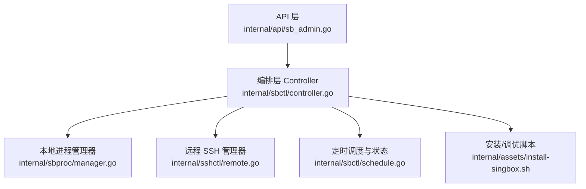
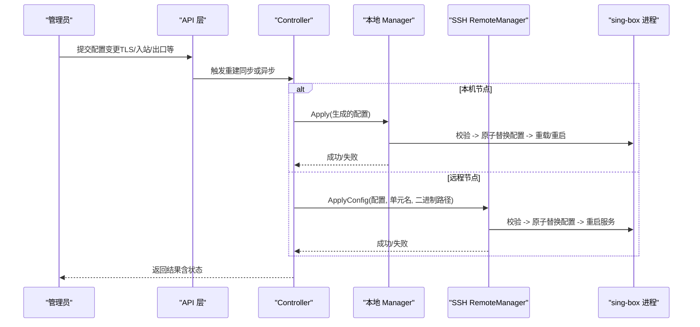
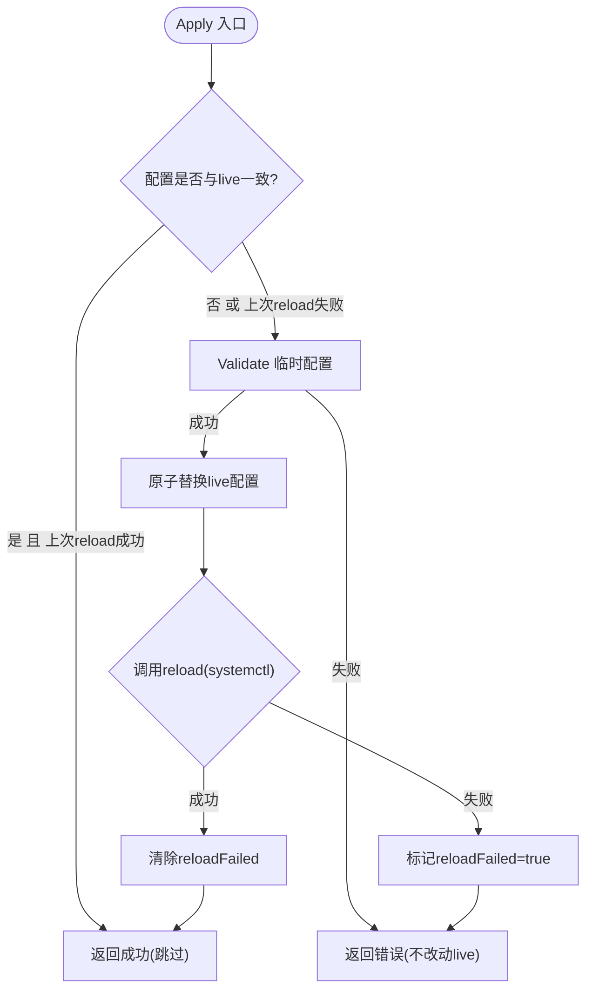
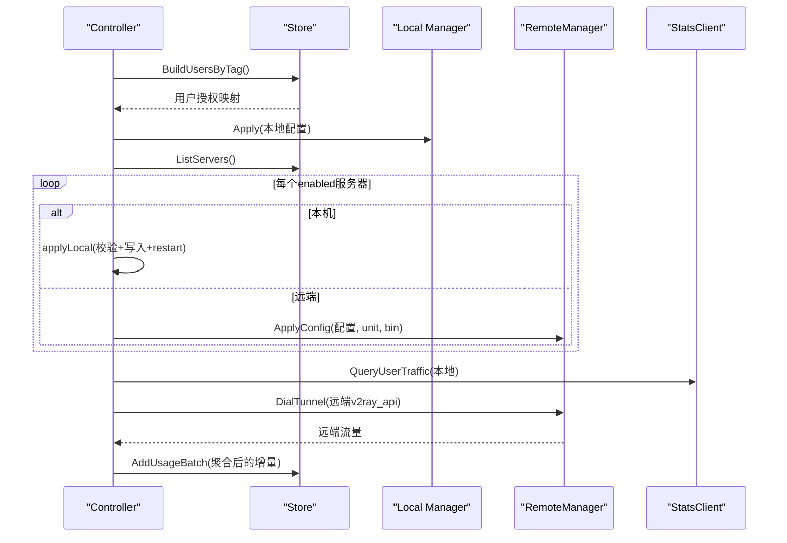
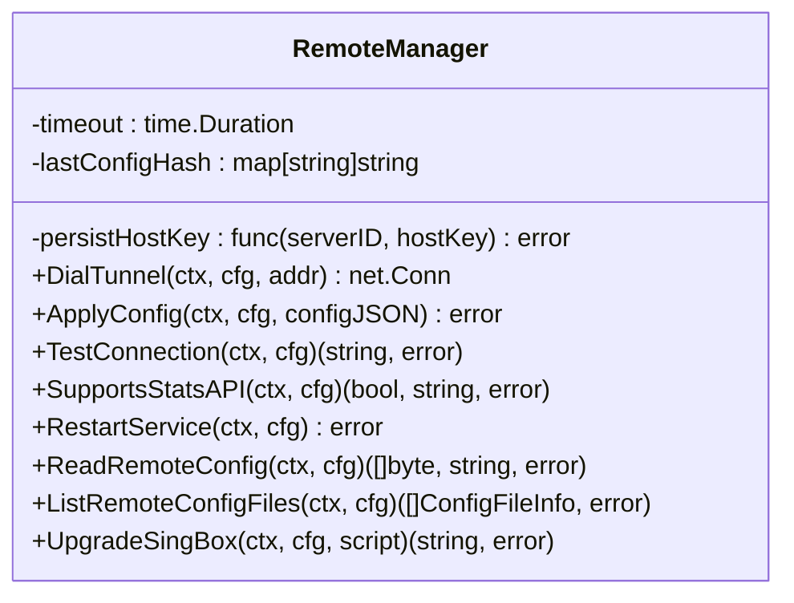
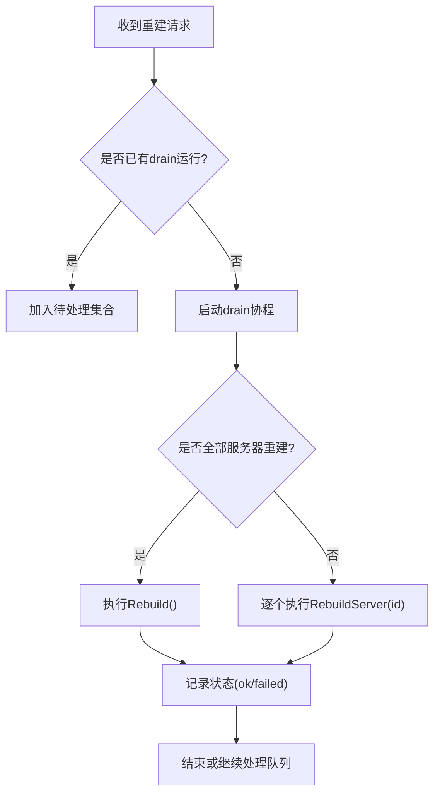
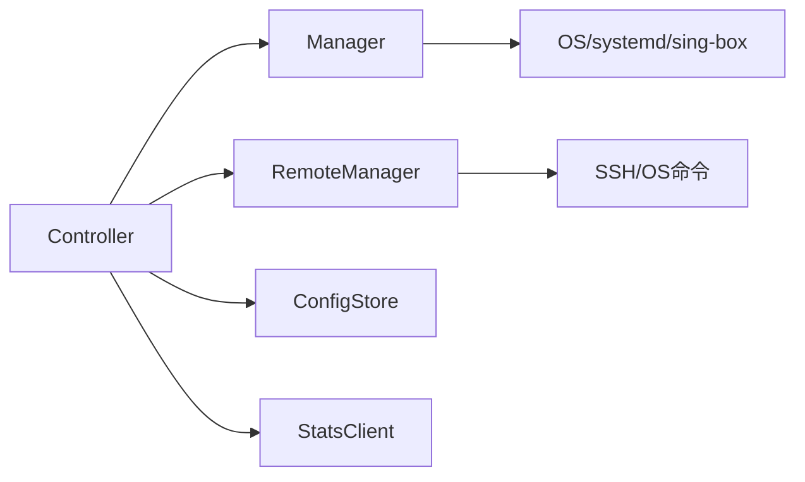

# 进程管理

<cite>
**本文引用的文件**
- [manager.go](file://internal/sbproc/manager.go)
- [controller.go](file://internal/sbctl/controller.go)
- [schedule.go](file://internal/sbctl/schedule.go)
- [remote.go](file://internal/sshctl/remote.go)
- [sb_admin.go](file://internal/api/sb_admin.go)
- [install-singbox.sh](file://internal/assets/install-singbox.sh)
</cite>

## 目录
1. [简介](#简介)
2. [项目结构](#项目结构)
3. [核心组件](#核心组件)
4. [架构总览](#架构总览)
5. [详细组件分析](#详细组件分析)
6. [依赖关系分析](#依赖关系分析)
7. [性能与资源限制](#性能与资源限制)
8. [故障排查指南](#故障排查指南)
9. [结论](#结论)
10. [附录：API 接口说明](#附录api-接口说明)

## 简介
本模块负责轻舟面板对 sing-box 进程的“本地 + 远程”全生命周期管理，包括配置生成、校验、原子写入、重载/重启、健康检查、流量统计采集、多服务器并发下发与状态追踪。其设计目标是：
- 保证任何时刻都不会将无效配置写入运行路径并触发重载，避免批量下线。
- 在面板自身被 systemd ProtectSystem=full 沙箱化的场景下，仍能安全地写入配置并重启服务。
- 支持多节点并发下发与统计采集，单个节点失败不影响其他节点。
- 提供可观测的异步重建调度与状态查询，便于前端展示与运维排障。

## 项目结构
- 进程管理核心：internal/sbproc（本地 Manager）
- 编排层：internal/sbctl（Controller，协调 store、Manager、SSH、Stats）
- 远程 SSH 控制：internal/sshctl（RemoteManager，远端写配置、校验、重启、隧道）
- 管理 API：internal/api（对外暴露证书、入站、出口等管理接口，并触发重建）
- 安装脚本：internal/assets/install-singbox.sh（节点侧安装与调优）

图表来源
- [controller.go:353-455](file://internal/sbctl/controller.go#L353-L455)
- [manager.go:22-50](file://internal/sbproc/manager.go#L22-L50)
- [remote.go:251-307](file://internal/sshctl/remote.go#L251-L307)
- [schedule.go:26-93](file://internal/sbctl/schedule.go#L26-L93)
- [install-singbox.sh:190-216](file://internal/assets/install-singbox.sh#L190-L216)

章节来源
- [controller.go:1-141](file://internal/sbctl/controller.go#L1-L141)
- [manager.go:1-50](file://internal/sbproc/manager.go#L1-L50)
- [remote.go:1-133](file://internal/sshctl/remote.go#L1-L133)
- [schedule.go:1-93](file://internal/sbctl/schedule.go#L1-L93)

## 核心组件
- 本地进程管理器（sbproc.Manager）
  - 职责：校验配置、原子替换 live 配置、触发重载；处理面板沙箱导致的只读目录问题；自动发现 sing-box 二进制；获取版本信息。
- 编排控制器（sbctl.Controller）
  - 职责：根据用户授权与入站/出站拓扑生成配置；串行化 Rebuild；本地直接应用或经 SSH 下发到远端；周期性收集各节点流量并汇总；维护异步重建队列与状态。
- 远程 SSH 管理器（sshctl.RemoteManager）
  - 职责：通过 SSH 连接远端节点；写临时配置、校验、原子移动、重启服务；建立 TCP 隧道访问远端 v2ray_api；探测是否支持 stats API；升级节点 sing-box。
- 调度器（sbctl.schedule）
  - 职责：合并多次重建请求，按目标（全部/单台）执行，记录 pending/running/ok/failed 状态及时间戳，供 UI 轮询。
- 管理 API（api.sb_admin）
  - 职责：提供 TLS/Reality 证书、入站/出口、ACME 申请、SNI 测试等管理接口；保存后触发重建；提供节点版本探测与升级入口。

章节来源
- [manager.go:22-344](file://internal/sbproc/manager.go#L22-L344)
- [controller.go:36-141](file://internal/sbctl/controller.go#L36-L141)
- [remote.go:80-133](file://internal/sshctl/remote.go#L80-L133)
- [schedule.go:10-156](file://internal/sbctl/schedule.go#L10-L156)
- [sb_admin.go:33-221](file://internal/api/sb_admin.go#L33-L221)

## 架构总览
下图展示了从管理员操作到 sing-box 生效的完整链路，涵盖本地与远程两种路径。

图表来源
- [controller.go:353-455](file://internal/sbctl/controller.go#L353-L455)
- [manager.go:247-285](file://internal/sbproc/manager.go#L247-L285)
- [remote.go:251-307](file://internal/sshctl/remote.go#L251-L307)

## 详细组件分析

### 本地进程管理器（sbproc.Manager）
- 关键流程
  - Validate：将配置写入临时文件，调用 sing-box check 验证，不触碰 live 配置。
  - Apply：先比较当前 live 配置字节是否一致（无变更则跳过），再 Validate，成功后原子替换 live 配置，最后调用 reload（systemctl restart）。
  - 失败恢复：若 reload 失败，设置标志位，下次 Apply 即使配置未变也会重试 reload，避免“文件已就位但进程未拉起”的假成功。
  - 沙箱绕过：当写入 /etc/sing-box 遇到 EROFS（面板 systemd ProtectSystem 导致），通过 systemd-run 以 PID1 命名空间执行写入，确保权限正确且原子落盘，并读回校验。
  - 二进制发现：优先环境变量，其次常见路径，最后 PATH。
  - 版本查询：执行 sing-box version 并返回原始输出。

图表来源
- [manager.go:247-285](file://internal/sbproc/manager.go#L247-L285)
- [manager.go:102-146](file://internal/sbproc/manager.go#L102-L146)
- [manager.go:148-171](file://internal/sbproc/manager.go#L148-L171)
- [manager.go:203-226](file://internal/sbproc/manager.go#L203-L226)

章节来源
- [manager.go:22-344](file://internal/sbproc/manager.go#L22-L344)

### 编排控制器（sbctl.Controller）
- 配置生成与应用
  - Rebuild：构建用户授权映射，生成本地配置并通过 Manager.Apply；遍历所有 enabled 服务器，本地直写，远端通过 SSH 并发下发。
  - RebuildServer：针对单台服务器（本地或远端）重新生成并应用。
  - 本地应用 applyLocal：解析 sing-box 二进制路径、config_path、systemd unit；临时文件校验；原子写入；systemctl restart；记录失败以便下次重试。
- 能力探测与缓存
  - statsSupported：通过 SSH 探测远端 sing-box 是否包含 v2ray_api 插件；结果缓存（负向 TTL 15 分钟），避免误配导致部署失败。
- 统计采集
  - CollectStats：拉取本地与各远端节点的 per-user 流量增量，聚合后批量入库；远端通过 SSH 隧道访问 127.0.0.1:v2ray_api。
- 周期任务
  - Run：每间隔执行 CollectStats 与 Rebuild，启动时立即执行一次；刷新本地版本信息。

图表来源
- [controller.go:353-455](file://internal/sbctl/controller.go#L353-L455)
- [controller.go:548-589](file://internal/sbctl/controller.go#L548-L589)
- [controller.go:599-649](file://internal/sbctl/controller.go#L599-L649)
- [remote.go:61-78](file://internal/sshctl/remote.go#L61-L78)

章节来源
- [controller.go:36-699](file://internal/sbctl/controller.go#L36-L699)

### 远程 SSH 管理器（sshctl.RemoteManager）
- 连接与安全
  - 支持私钥/密码认证；首次连接 TOFU 信任主机密钥并可持久化；超时控制；上下文取消保护。
- 配置下发
  - ApplyConfig：写临时文件 -> 远端 sing-box check -> 原子 mv -> systemctl restart；相同配置哈希跳过重复下发。
- 诊断与探测
  - TestConnection：执行 sing-box version 判断版本与特性。
  - SupportsStatsAPI：基于版本输出判断是否包含 with_v2ray_api。
  - ReadRemoteConfig/ListRemoteConfigFiles：自动探测实际配置文件路径并读取。
- 升级
  - UpgradeSingBox：推送面板内置安装脚本到远端并执行 --force，统一安装与调优。

图表来源
- [remote.go:98-133](file://internal/sshctl/remote.go#L98-L133)
- [remote.go:251-307](file://internal/sshctl/remote.go#L251-L307)
- [remote.go:323-363](file://internal/sshctl/remote.go#L323-L363)
- [remote.go:475-541](file://internal/sshctl/remote.go#L475-L541)
- [remote.go:666-707](file://internal/sshctl/remote.go#L666-L707)

章节来源
- [remote.go:1-708](file://internal/sshctl/remote.go#L1-L708)

### 调度与状态（sbctl.schedule）
- ScheduleRebuild/ScheduleRebuildServer：标记目标为 pending，确保仅一个 drain 协程运行，合并突发请求。
- drain：若存在 full rebuild，则覆盖所有单台目标；否则逐个执行单台重建；记录 running/ok/failed 状态与时间戳。
- SyncStatuses：供 API 查询各目标的最近一次下发结果。

图表来源
- [schedule.go:26-93](file://internal/sbctl/schedule.go#L26-L93)
- [schedule.go:95-156](file://internal/sbctl/schedule.go#L95-L156)

章节来源
- [schedule.go:1-194](file://internal/sbctl/schedule.go#L1-L194)

### 管理 API（api.sb_admin）
- 证书与 TLS
  - 生成 Reality 密钥对、自签证书、一键绑定证书、ACME 在线申请（仅本机）、列表/保存/删除/排序 TLS 条目。
- SNI 连通性测试
  - 对指定 host:port 进行三次 TCP 握手采样，返回 min/avg/max 延迟与可达状态。
- 触发重建
  - 保存配置后调用 sbScheduleServer/sbRebuildLog 触发异步重建，UI 可轮询状态。

章节来源
- [sb_admin.go:33-221](file://internal/api/sb_admin.go#L33-L221)
- [sb_admin.go:233-344](file://internal/api/sb_admin.go#L233-L344)
- [sb_admin.go:374-473](file://internal/api/sb_admin.go#L374-L473)
- [sb_admin.go:475-789](file://internal/api/sb_admin.go#L475-L789)

## 依赖关系分析
- Controller 依赖：
  - ConfigStore：生成配置、读写服务器/用户数据。
  - Applier（Manager）：本地配置应用。
  - StatsFetcher：本地流量采集。
  - sshctl.RemoteManager：远端配置下发、隧道、探测、升级。
- Manager 依赖：
  - 系统命令：sing-box check/version、systemctl restart、systemd-run（沙箱逃逸）。
- RemoteManager 依赖：
  - golang.org/x/crypto/ssh：SSH 客户端、会话、隧道。
  - 系统命令：sing-box check/version、systemctl restart/start、find/cat/mkdir/mv 等。

图表来源
- [controller.go:36-141](file://internal/sbctl/controller.go#L36-L141)
- [manager.go:22-50](file://internal/sbproc/manager.go#L22-L50)
- [remote.go:98-133](file://internal/sshctl/remote.go#L98-L133)

章节来源
- [controller.go:1-141](file://internal/sbctl/controller.go#L1-L141)
- [manager.go:1-50](file://internal/sbproc/manager.go#L1-L50)
- [remote.go:1-133](file://internal/sshctl/remote.go#L1-L133)

## 性能与资源限制
- 并发与限流
  - 多服务器并发下发：Rebuild 中对远端服务器 goroutine 并行 ApplyConfig，单个不可达节点不会阻塞其他节点。
  - 单次 Apply 超时：远端 ApplyConfig 默认 90 秒，避免长连接卡死；SSH dial 带上下文取消，防止泄漏。
  - 统计采集并发：remoteStats 并发查询各节点，每节点 30 秒超时。
- 幂等与去抖
  - 本地 Manager 的 no-op 快速路径：配置字节未变且上次 reload 成功则跳过，避免每分钟重启。
  - 远端 RemoteManager 的配置哈希缓存：相同配置跳过重复下发与重启。
  - 调度器合并：多次重建请求合并为一次 drain 执行。
- 资源限制建议
  - 合理设置 QZ_SINGBOX_STATS_INTERVAL（默认 1 分钟），避免频繁采集造成 CPU/IO 压力。
  - 控制并发节点数量（由服务器数量决定），必要时在上层限制并发度。
  - 使用最小必要权限：远端写配置使用 umask 077 与 chmod 600，保护敏感信息。
- 安装与调优
  - 安装脚本会检测现有 sing-box 是否包含 v2ray_api，提示是否需要重装；同时应用调优参数与 systemd unit。

章节来源
- [controller.go:391-455](file://internal/sbctl/controller.go#L391-L455)
- [controller.go:599-649](file://internal/sbctl/controller.go#L599-L649)
- [remote.go:251-307](file://internal/sshctl/remote.go#L251-L307)
- [remote.go:611-640](file://internal/sshctl/remote.go#L611-L640)
- [install-singbox.sh:190-216](file://internal/assets/install-singbox.sh#L190-L216)

## 故障排查指南
- 配置校验失败
  - 现象：Apply 报错，live 配置未被替换。
  - 定位：查看 sing-box check 输出；确认生成的配置片段是否符合当前 sing-box 版本语法。
  - 参考：[manager.go:228-245](file://internal/sbproc/manager.go#L228-L245)、[remote.go:577-593](file://internal/sshctl/remote.go#L577-L593)
- 重载/重启失败
  - 现象：配置已写入但进程未拉起；下一次 Apply 仍会重试。
  - 定位：检查 systemctl 日志；确认 unit 名称与路径；查看 Manager.reloadFailed 标志。
  - 参考：[manager.go:275-284](file://internal/sbproc/manager.go#L275-L284)
- 面板沙箱导致写入失败（EROFS）
  - 现象：/etc/sing-box/config.json 写入报只读。
  - 解决：通过 systemd-run 逃逸；或在面板服务中添加 ReadWritePaths 放行目录。
  - 参考：[manager.go:68-88](file://internal/sbproc/manager.go#L68-L88)、[manager.go:102-146](file://internal/sbproc/manager.go#L102-L146)
- 远端无法连接或配置下发失败
  - 现象：SSH 下发失败、隧道连接失败。
  - 定位：检查 SSH 凭据、主机密钥、端口；使用 TestConnection 探测版本；查看 SupportsStatsAPI 结果。
  - 参考：[remote.go:323-363](file://internal/sshctl/remote.go#L323-L363)、[remote.go:61-78](file://internal/sshctl/remote.go#L61-L78)
- 流量统计为 0
  - 现象：节点流量不更新。
  - 原因：远端 sing-box 未启用 v2ray_api 插件；或 statsListenFor 未注入监听地址。
  - 解决：升级节点至含 with_v2ray_api 的版本；确认 SupportsStatsAPI 返回 true。
  - 参考：[controller.go:282-343](file://internal/sbctl/controller.go#L282-L343)、[remote.go:345-363](file://internal/sshctl/remote.go#L345-L363)
- 版本不一致或不兼容
  - 现象：配置生成或校验失败。
  - 定位：通过 TestConnection 获取版本；必要时升级节点。
  - 参考：[remote.go:323-343](file://internal/sshctl/remote.go#L323-L343)、[install-singbox.sh:190-216](file://internal/assets/install-singbox.sh#L190-L216)

章节来源
- [manager.go:228-285](file://internal/sbproc/manager.go#L228-L285)
- [remote.go:323-363](file://internal/sshctl/remote.go#L323-L363)
- [controller.go:282-343](file://internal/sbctl/controller.go#L282-L343)
- [install-singbox.sh:190-216](file://internal/assets/install-singbox.sh#L190-L216)

## 结论
本模块通过“本地 Manager + 远程 SSH 管理器 + 编排 Controller + 调度器”的分层设计，实现了 sing-box 进程的安全、可靠、可扩展的生命周期管理。关键保障点包括：
- 配置校验前置与原子替换，杜绝无效配置影响生产。
- 面板沙箱下的安全写入与重载。
- 多节点并发下发与统计采集，具备容错与幂等。
- 完善的可观测性与可恢复性（状态、重试、探测）。
- 统一的安装与调优脚本，确保节点能力一致。

## 附录：API 接口说明
以下为与进程管理相关的常用 API（节选）：
- POST /api/admin/sb/reality-keypair
  - 功能：生成 Reality 密钥对与 short_id。
  - 用途：创建 Reality TLS 配置。
  - 参考：[sb_admin.go:35-44](file://internal/api/sb_admin.go#L35-L44)
- POST /api/admin/sb/tls/self-signed
  - 功能：生成自签证书与私钥（PEM）。
  - 参考：[sb_admin.go:46-68](file://internal/api/sb_admin.go#L46-L68)
- POST /api/admin/sb/tls/acme
  - 功能：在线申请 Let's Encrypt 证书（仅本机），自动安装并重启服务。
  - 参考：[sb_admin.go:146-221](file://internal/api/sb_admin.go#L146-L221)
- GET /api/admin/sb/sni-test
  - 功能：测试 SNI 目标 TCP 握手延迟与可达性。
  - 参考：[sb_admin.go:233-344](file://internal/api/sb_admin.go#L233-L344)
- 证书/入站/出口相关保存接口（如 /api/admin/sb/tls/cert、/api/admin/sb/tls/reality 等）
  - 功能：保存 TLS/Reality 配置，保存后触发重建。
  - 参考：[sb_admin.go:661-789](file://internal/api/sb_admin.go#L661-L789)

注意：上述接口保存配置后会触发异步重建，可通过调度状态接口查询下发结果（见 schedule.go 的状态定义与查询方法）。

章节来源
- [sb_admin.go:35-221](file://internal/api/sb_admin.go#L35-L221)
- [sb_admin.go:233-344](file://internal/api/sb_admin.go#L233-L344)
- [sb_admin.go:661-789](file://internal/api/sb_admin.go#L661-L789)
- [schedule.go:10-156](file://internal/sbctl/schedule.go#L10-L156)
