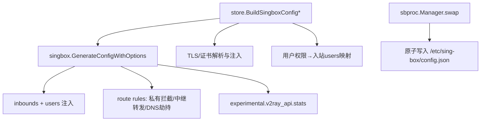
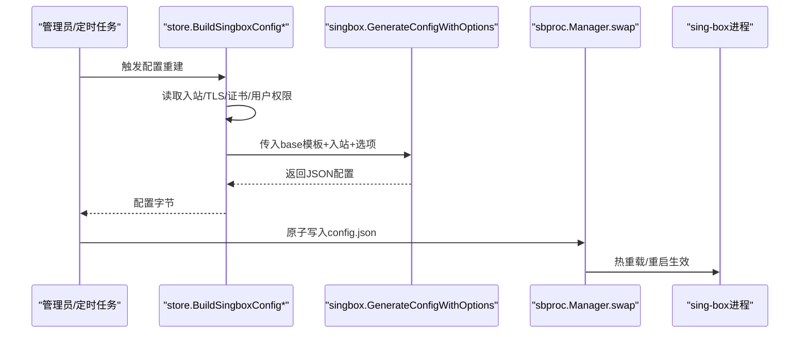
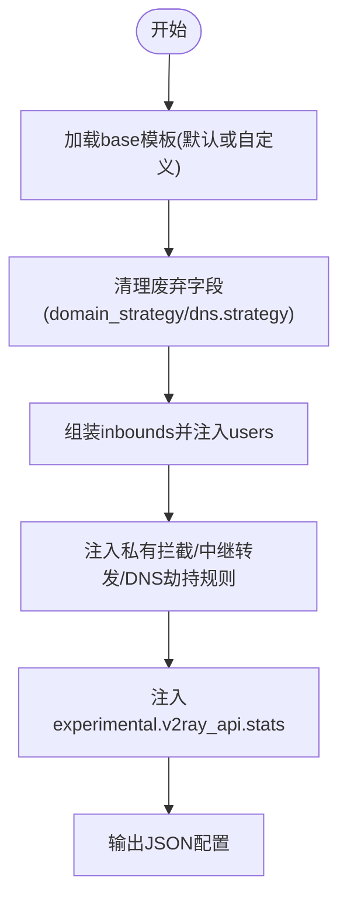
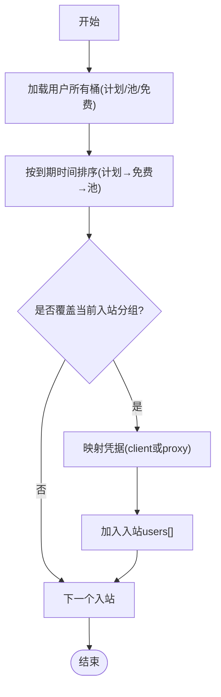
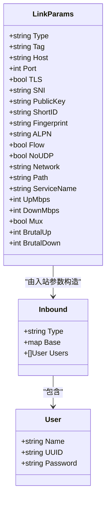
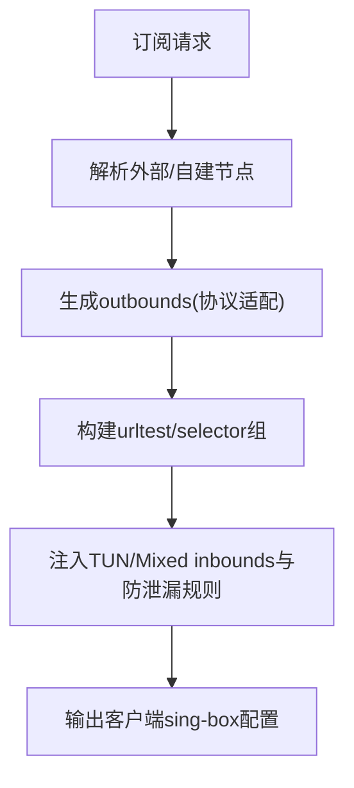
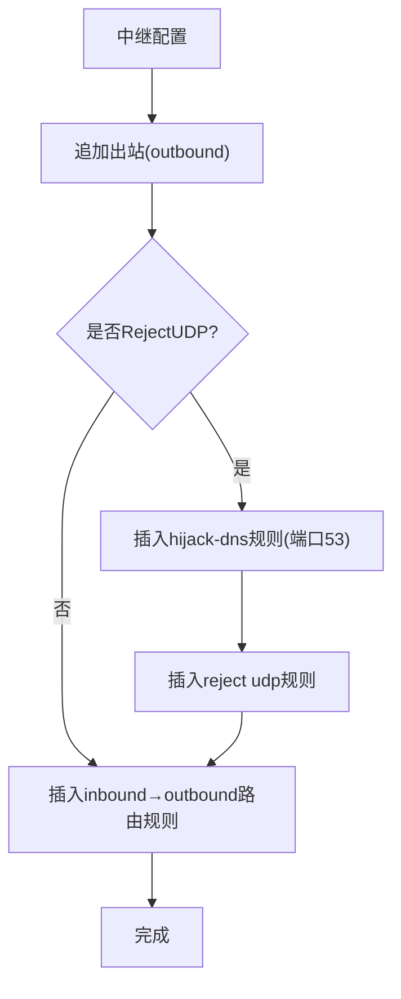
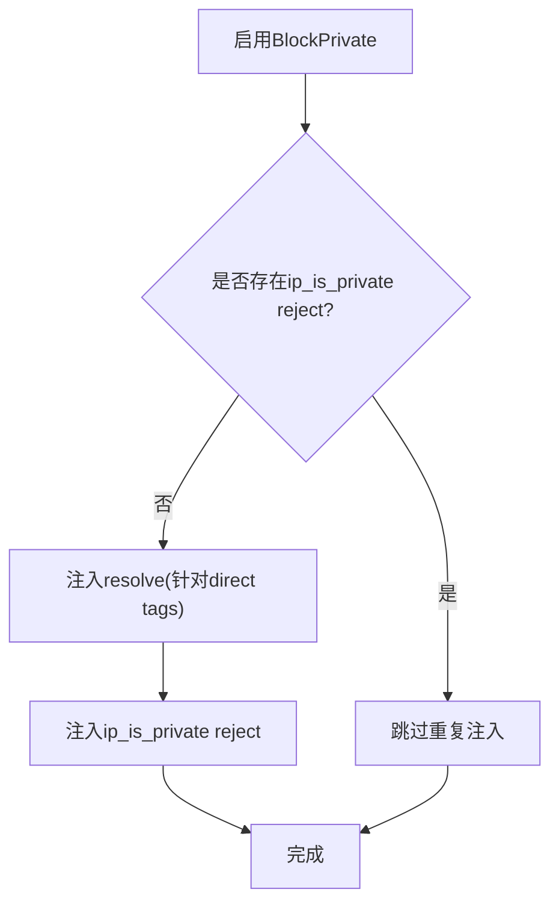
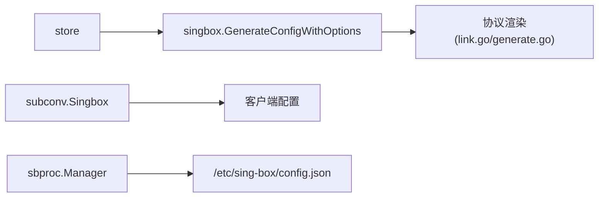

# 配置生成

<cite>
**本文引用的文件**
- [generate.go](file://internal/singbox/generate.go)
- [cert.go](file://internal/singbox/cert.go)
- [link.go](file://internal/singbox/link.go)
- [reality.go](file://internal/singbox/reality.go)
- [singbox.go（子转换）](file://internal/subconv/singbox.go)
- [nodesingbox.go](file://internal/store/nodesingbox.go)
- [singbox.go（存储/装配）](file://internal/store/singbox.go)
- [manager.go（进程管理）](file://internal/sbproc/manager.go)
</cite>

## 目录
1. [简介](#简介)
2. [项目结构](#项目结构)
3. [核心组件](#核心组件)
4. [架构总览](#架构总览)
5. [详细组件分析](#详细组件分析)
6. [依赖关系分析](#依赖关系分析)
7. [性能考量](#性能考量)
8. [故障排查指南](#故障排查指南)
9. [结论](#结论)
10. [附录：扩展与自定义协议支持](#附录：扩展与自定义协议支持)

## 简介
本模块负责“轻舟”平台为 sing-box 服务端动态生成配置文件，并将配置原子化下发到运行中的 sing-box 进程。其核心能力包括：
- 模板系统：以 JSON 为基础模板，注入日志、DNS、路由、出站等基础配置；支持管理员自定义基础模板并自动清理不兼容字段。
- 变量替换与条件渲染：根据入站类型、TLS/Reality 配置、传输层（ws/grpc/httpupgrade）、用户权限与分组，动态生成各协议的入站 users 列表及出站规则。
- 用户权限映射：将用户的套餐桶（bucket）与节点分组（group）映射到具体入站的认证凭据，实现按桶计量与访问控制。
- 多协议支持：VMess、VLESS、Trojan、Hysteria/Hysteria2、TUIC、AnyTLS、Shadowsocks 等协议的参数设置与链接生成。
- 高级特性：负载均衡（urltest/selector）、节点分组、流量统计（v2ray_api stats）、私有地址拦截、中继链路与 UDP 阻断策略。
- 配置验证与错误检测：在生成阶段剥离废弃字段、校验 TLS/证书、拒绝明文降级；在运行时通过 sing-box check 与进程管理器保障稳定性。
- 版本管理与回滚：记录节点 sing-box 版本与能力探测结果，配合更新与回滚流程保证可恢复性。

## 项目结构
围绕配置生成的关键代码分布在以下模块：
- internal/singbox：配置生成核心、证书工具、分享链接生成、Reality 密钥对生成。
- internal/subconv：订阅侧的 sing-box 客户端配置渲染（outbound 集合、TUN/Mixed inbounds、DNS/Route 防泄漏）。
- internal/store：从数据库读取入站/TLS/证书/用户权限，组装成 sing-box 配置对象，并调用 singbox 包生成最终 JSON。
- internal/sbproc：将生成的配置原子写入 sing-box 配置文件路径，处理系统沙箱限制。

图表来源
- [singbox.go（存储/装配）:562-679](file://internal/store/singbox.go#L562-L679)
- [generate.go:137-295](file://internal/singbox/generate.go#L137-L295)
- [manager.go:90-114](file://internal/sbproc/manager.go#L90-L114)

章节来源
- [singbox.go（存储/装配）:562-679](file://internal/store/singbox.go#L562-L679)
- [generate.go:137-295](file://internal/singbox/generate.go#L137-L295)
- [manager.go:90-114](file://internal/sbproc/manager.go#L90-L114)

## 核心组件
- 配置生成器（GenerateConfigWithOptions）：以 base 模板为起点，合并 inbounds 与 users，注入 v2ray_api stats、私有地址拦截、中继路由等规则，输出稳定可比较的 JSON。
- 用户渲染器（renderUser）：按协议类型生成 sing-box 期望的 user 对象（如 VLESS flow、VMess alterId、SS 派生密钥等），并处理条件字段（如 transport 存在时禁用 vision）。
- 模板与兼容性清理（stripLegacyDomainStrategy）：移除已弃用的 domain_strategy/dns.strategy，确保跨 sing-box 版本可用。
- 证书与 Reality：自签证书生成、指纹计算、Reality 公钥/短ID生成，用于 TLS/Reality 入站与客户端链接。
- 分享链接构建（BuildShareLink）：将入站参数转换为各协议的分享链接（含 ws/grpc/httpupgrade、Realit y、Brutal、NoUDP 等）。
- 订阅侧渲染（subconv.Singbox）：生成客户端 sing-box 配置（outbounds、TUN/Mixed inbounds、DNS/Route 防泄漏、urltest/selector 负载均衡）。

章节来源
- [generate.go:18-102,137-295,500-531:18-102](file://internal/singbox/generate.go#L18-L102)
- [generate.go:137-295](file://internal/singbox/generate.go#L137-L295)
- [cert.go:19-139](file://internal/singbox/cert.go#L19-L139)
- [reality.go:11-39](file://internal/singbox/reality.go#L11-L39)
- [link.go:12-418](file://internal/singbox/link.go#L12-L418)
- [singbox.go（子转换）:10-112,197-332:10-112](file://internal/subconv/singbox.go#L10-L112)

## 架构总览
配置生成与下发的端到端流程如下：

图表来源
- [singbox.go（存储/装配）:562-679](file://internal/store/singbox.go#L562-L679)
- [generate.go:137-295](file://internal/singbox/generate.go#L137-L295)
- [manager.go:90-114](file://internal/sbproc/manager.go#L90-L114)

## 详细组件分析

### 配置生成与模板系统
- 基础模板：默认包含 log、dns、outbounds、route；若管理员提供自定义 sb_base_config，会先反序列化为 map 再合并。
- 字段清理：自动删除 dns.strategy、inbounds/outbounds/route.rules 中的 domain_strategy，避免新版 sing-box 检查失败。
- 确定性输出：对 users 排序、emittedTags 排序，使相同逻辑下 JSON 字节级一致，便于跳过无变更的重载。

图表来源
- [generate.go:18-33,137-295,500-531:18-33](file://internal/singbox/generate.go#L18-L33)
- [generate.go:137-295](file://internal/singbox/generate.go#L137-L295)
- [generate.go:500-531](file://internal/singbox/generate.go#L500-L531)

章节来源
- [generate.go:18-33,137-295,500-531:18-33](file://internal/singbox/generate.go#L18-L33)

### 用户权限映射到代理配置
- 权限模型：用户拥有多个“套餐桶”（plan/pool/free），每个桶有独立身份（client_uuid/client_secret 或 proxy_username/proxy_password）和到期时间。
- 归属判定：按优先级选择最早到期的有效桶作为该入站的“拥有者”，并结合节点分组（group）决定哪些桶能访问哪些入站。
- 混合入站保护：mixed 入站若无用户则直接丢弃，防止暴露开放代理；若桶的代理凭据过期，同样丢弃该用户。
- 统计键绑定：每个入站的 users[] 中 name 即为 v2ray_api stats 的 key，实现按桶/用户维度计量。

图表来源
- [singbox.go（存储/装配）:1012-1119](file://internal/store/singbox.go#L1012-L1119)
- [singbox.go（存储/装配）:1127-1232](file://internal/store/singbox.go#L1127-L1232)

章节来源
- [singbox.go（存储/装配）:1012-1119](file://internal/store/singbox.go#L1012-L1119)
- [singbox.go（存储/装配）:1127-1232](file://internal/store/singbox.go#L1127-L1232)

### 多协议配置生成规则
- VMess：
  - 入站 users：name、uuid、alterId=0。
  - 分享链接：vmess:// base64(JSON)，携带 net/path/host、tls/sni/alpn/fp/allowInsecure、tfo/mptcp/mux/brutal、qz-udp=block 等。
- VLESS：
  - 入站 users：name、uuid，可选 flow（xtls-rprx-vision），仅在 raw-TLS（Reality）且无 transport 时启用。
  - 分享链接：vless:// UUID@host:port?security=tls|reality&...，强制 packetEncoding=xudp，vision 时禁用 mux。
- Trojan：
  - 入站 users：name、password。
  - 分享链接：trojan:// password@host:port?security=tls&...，支持 ws/grpc/httpupgrade。
- Hysteria/Hysteria2：
  - 入站 users：hysteria2 使用 password；hysteria 使用 auth_str。
  - 分享链接：hysteria2:// password@host:port?obfs=salamander&pinSHA256=...；hysteria:// host:port?protocol=udp&auth=...。
- TUIC：
  - 入站 users：name、uuid、password；支持 congestion_control、zero_rtt_handshake、udp_relay_mode。
  - 分享链接：tuic:// uuid:password@host:port?security=tls&...。
- AnyTLS：
  - 入站 users：name、password；客户端 outbound 要求 tls enabled。
- Shadowsocks（2022）：
  - 入站 users：基于 method 派生 per-user key（DeriveSSKey），支持多用户。
  - 分享链接：ss:// SIP002，携带 qz-udp=block。

图表来源
- [generate.go:35-102](file://internal/singbox/generate.go#L35-L102)
- [link.go:12-113](file://internal/singbox/link.go#L12-L113)

章节来源
- [generate.go:35-102](file://internal/singbox/generate.go#L35-L102)
- [link.go:206-418](file://internal/singbox/link.go#L206-L418)
- [singbox.go（子转换）:197-332](file://internal/subconv/singbox.go#L197-L332)

### 负载均衡、节点分组与流量统计
- 负载均衡（客户端订阅）：subconv.Singbox 生成 selector 与 urltest 组，自动聚合节点并按延迟选择最优。
- 节点分组：后端按 group 将入站与桶关联，仅允许拥有对应 group 的桶接入相应入站。
- 流量统计：通过 experimental.v2ray_api.stats.enabled=true 与 users 列表，结合 v2ray API 拉取增量计数，持久化到 usage 表。

图表来源
- [singbox.go（子转换）:10-112](file://internal/subconv/singbox.go#L10-L112)
- [singbox.go（子转换）:174-179](file://internal/subconv/singbox.go#L174-L179)

章节来源
- [singbox.go（子转换）:10-112](file://internal/subconv/singbox.go#L10-L112)
- [generate.go:280-295](file://internal/singbox/generate.go#L280-L295)

### 中继链路与UDP阻断
- 中继（Relay）：将特定入站流量转发至落地机出站，追加 route 规则优先于 final="direct"。
- UDP阻断：当 egress 不支持可靠 UDP 时，插入 reject udp 规则，并在必要时 hijack DNS（端口53）以避免客户端因无法解析而误判网络不可用。

图表来源
- [generate.go:231-278](file://internal/singbox/generate.go#L231-L278)
- [generate.go:297-328](file://internal/singbox/generate.go#L297-L328)

章节来源
- [generate.go:231-278](file://internal/singbox/generate.go#L231-L278)
- [generate.go:297-328](file://internal/singbox/generate.go#L297-L328)

### 私有地址拦截与安全加固
- 目的：阻止代理流量访问本机环回、云元数据（169.254.169.254）等私有地址。
- 机制：prepend resolve + ip_is_private reject 两条规则；仅对 direct-exit 入站生效，避免中继链路被改写目的地。
- 安全兜底：若无法找到可解析的 DNS，仅保留 reject 规则，保证最小防护。

图表来源
- [generate.go:374-468](file://internal/singbox/generate.go#L374-L468)

章节来源
- [generate.go:374-468](file://internal/singbox/generate.go#L374-L468)

### 证书与Reality
- 自签证书：生成 ECDSA P-256 证书与私钥，SAN 支持 IP 与域名（含通配符），有效期上限 3650 天。
- 指纹与自签识别：计算 leaf 证书 SHA-256 指纹，判断是否为自签（issuer==subject 且签名自验）。
- Reality：生成 x25519 私钥与公钥（URL-safe base64），随机 short_id，用于 VLESS Reality 的安全握手。

章节来源
- [cert.go:19-139](file://internal/singbox/cert.go#L19-L139)
- [reality.go:11-39](file://internal/singbox/reality.go#L11-L39)

## 依赖关系分析
- store → singbox：store 负责数据装配，调用 singbox 生成器产出 JSON。
- singbox → 协议渲染：link.go 与 generate.go 分别负责分享链接与服务器配置的用户对象渲染。
- subconv → 客户端配置：将外部/自建节点转为客户端 sing-box 配置，包含负载均衡与防泄漏。
- sbproc → OS：原子写入配置文件，处理 systemd 沙箱限制。

图表来源
- [singbox.go（存储/装配）:562-679](file://internal/store/singbox.go#L562-L679)
- [generate.go:137-295](file://internal/singbox/generate.go#L137-L295)
- [singbox.go（子转换）:10-112](file://internal/subconv/singbox.go#L10-L112)
- [manager.go:90-114](file://internal/sbproc/manager.go#L90-L114)

章节来源
- [singbox.go（存储/装配）:562-679](file://internal/store/singbox.go#L562-L679)
- [generate.go:137-295](file://internal/singbox/generate.go#L137-L295)
- [singbox.go（子转换）:10-112](file://internal/subconv/singbox.go#L10-L112)
- [manager.go:90-114](file://internal/sbproc/manager.go#L90-L114)

## 性能考量
- 确定性输出：对 users 与 emittedTags 排序，减少无效重载。
- 缓存优化：TLS/证书缓存、egress UDP 模式缓存，避免重复查询。
- 规则精简：避免重复注入私有拦截/DNS 劫持规则，减小配置体积。
- 协议兼容：移除废弃字段，降低 sing-box check 失败风险。

[本节为通用指导，无需引用具体文件]

## 故障排查指南
- 配置无法加载：
  - 检查是否残留 domain_strategy/dns.strategy；生成器会自动清理，但自定义模板需确认。
  - 查看 TLS 解密失败标志，避免明文降级。
- Mixed 入站未监听：
  - 确认至少有一个有效用户（未过期）；否则会被丢弃以防止开放代理。
- UDP 不通：
  - 检查 egress 是否 block UDP；必要时启用 hijack-dns 避免 DNS 丢失。
- 订阅链接无效：
  - 核对传输层（ws/grpc/httpupgrade）与 path/host/service_name；Reality 需 pbk/sid；VLESS 需 packetEncoding=xudp。
- 节点版本探测：
  - 查看 node_singbox 表的 version/v2ray_api/raw/checked_at/error，确认插件能力与可达性。

章节来源
- [generate.go:500-531](file://internal/singbox/generate.go#L500-L531)
- [generate.go:205-217](file://internal/singbox/generate.go#L205-L217)
- [generate.go:297-328](file://internal/singbox/generate.go#L297-L328)
- [link.go:206-418](file://internal/singbox/link.go#L206-L418)
- [nodesingbox.go:19-91](file://internal/store/nodesingbox.go#L19-L91)

## 结论
本模块通过模板化基础配置、严格的协议渲染、权限到凭据的精确映射以及健壮的错误处理，实现了高可用、可扩展的 sing-box 配置生成与下发体系。它同时兼顾了安全性（私有地址拦截、TLS/Reality）、可观测性（v2ray_api stats）与运维友好性（确定性输出、原子写入、版本探测）。

[本节为总结，无需引用具体文件]

## 附录：扩展与自定义协议支持
- 新增协议步骤：
  1) 在 renderUser 中添加协议分支，定义 users 字段映射。
  2) 在 BuildShareLink 中增加协议分支，生成分享链接参数。
  3) 在 subconv.singboxOutbound 中实现客户端 outbound 渲染。
  4) 如需传输层（ws/grpc/httpupgrade），在 transportQuery/sbTransport 中补充。
  5) 若涉及 Reality，使用 reality.go 生成公钥/短ID，并在 link.go 中拼接。
- 注意事项：
  - 保持字段白名单，避免未知字段导致 sing-box 拒绝整个配置。
  - 对于 multiplex 与 vision 互斥等约束，需在渲染时显式处理。
  - 对 UDP 支持进行明确标记（NoUDP/qz-udp=block），避免客户端超时黑盒。

章节来源
- [generate.go:51-102](file://internal/singbox/generate.go#L51-L102)
- [link.go:206-418](file://internal/singbox/link.go#L206-L418)
- [singbox.go（子转换）:197-332](file://internal/subconv/singbox.go#L197-L332)
- [reality.go:11-39](file://internal/singbox/reality.go#L11-L39)
