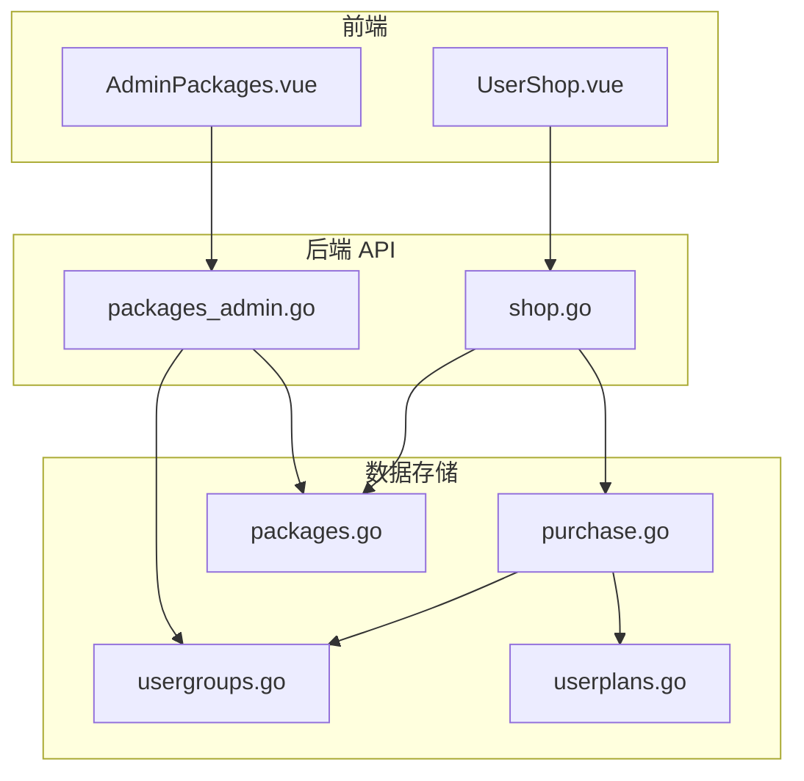
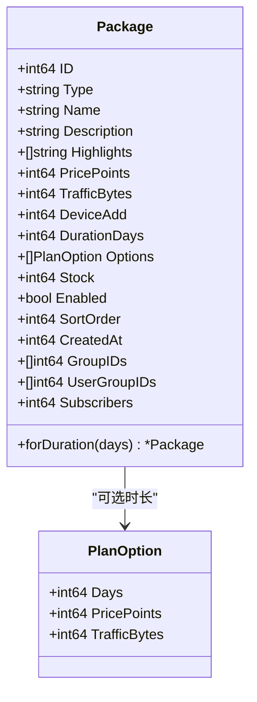
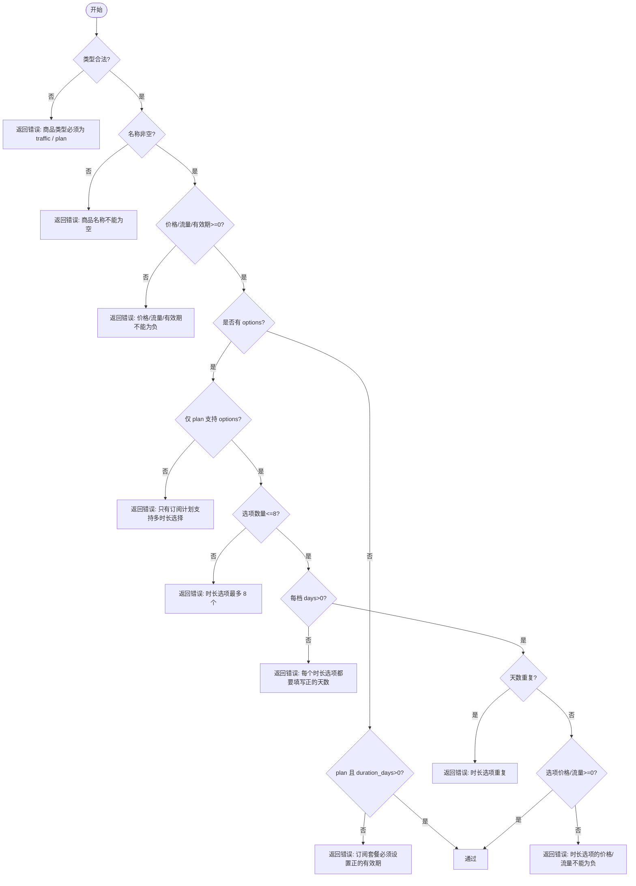
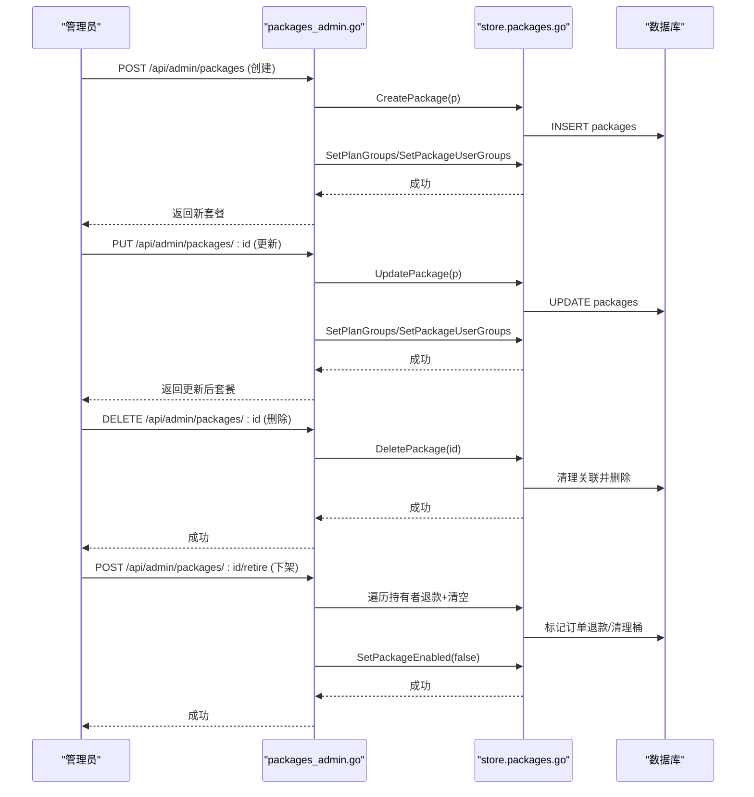
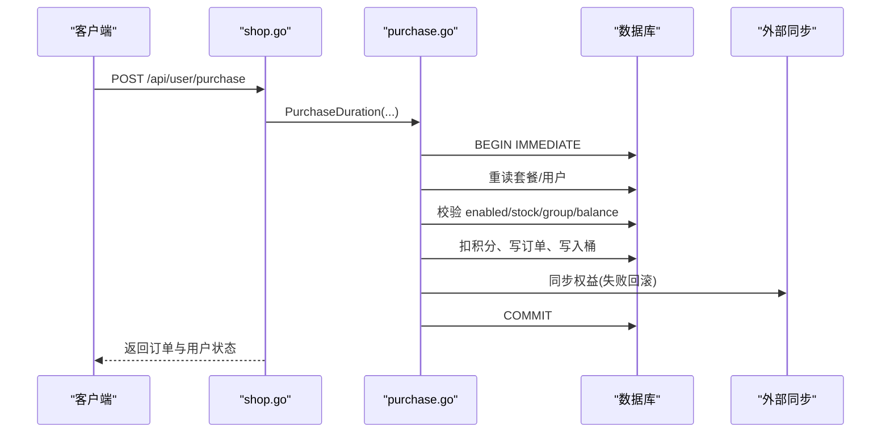
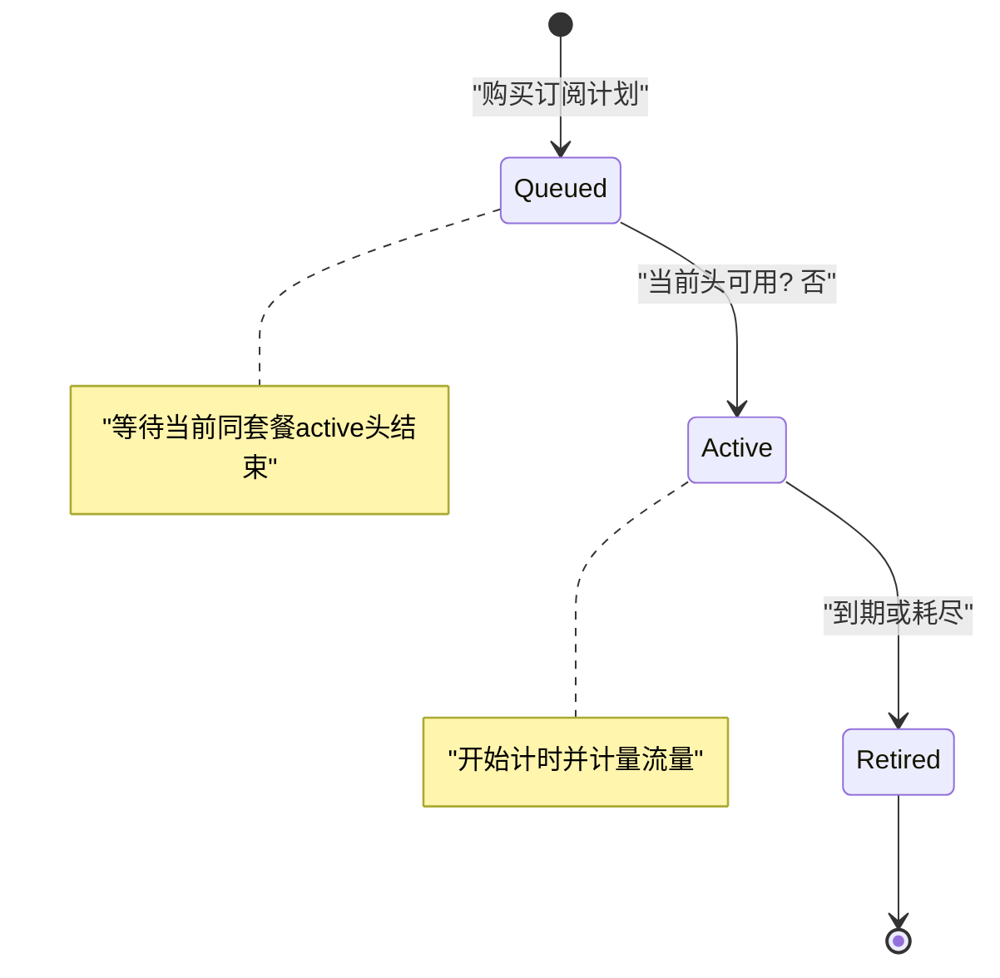
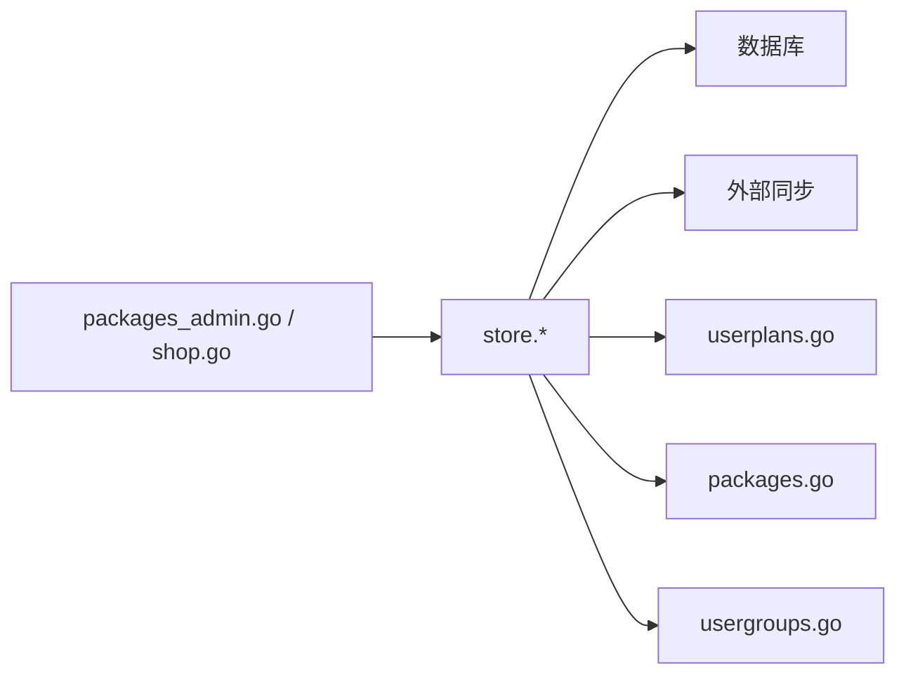

# 套餐管理

<cite>
**本文引用的文件**
- [packages.go](file://internal/store/packages.go)
- [packages_admin.go](file://internal/api/packages_admin.go)
- [shop.go](file://internal/api/shop.go)
- [purchase.go](file://internal/store/purchase.go)
- [userplans.go](file://internal/store/userplans.go)
- [usergroups.go](file://internal/store/usergroups.go)
- [AdminPackages.vue](file://frontend/src/views/AdminPackages.vue)
- [UserShop.vue](file://frontend/src/views/UserShop.vue)
</cite>

## 目录
1. [简介](#简介)
2. [项目结构](#项目结构)
3. [核心组件](#核心组件)
4. [架构总览](#架构总览)
5. [详细组件分析](#详细组件分析)
6. [依赖关系分析](#依赖关系分析)
7. [性能考量](#性能考量)
8. [故障排查指南](#故障排查指南)
9. [结论](#结论)
10. [附录：API 接口文档](#附录api-接口文档)

## 简介
本模块提供“套餐管理”的完整能力，涵盖两类商品：流量包与订阅计划（订阅套餐）。支持多时长选项、用户组购买权限控制、库存与上架下架、排序与统计、购买/退款/管理员分配套餐等。数据模型以“桶（bucket）”为核心，订阅计划采用队列化推进机制，确保重复购买排队生效；流量包通过共享池累计额度。前端提供管理员套餐管理与用户积分商城界面。

## 项目结构
后端围绕 store（数据访问）、api（HTTP 路由与校验）、以及前端视图组织。关键路径：
- 数据模型与持久化：internal/store/packages.go、purchase.go、userplans.go、usergroups.go
- API 层：internal/api/packages_admin.go（管理员）、internal/api/shop.go（用户侧购买）
- 前端：frontend/src/views/AdminPackages.vue（管理端）、frontend/src/views/UserShop.vue（用户商城）



图表来源
- [packages_admin.go:82-203](file://internal/api/packages_admin.go#L82-L203)
- [shop.go:11-94](file://internal/api/shop.go#L11-L94)
- [packages.go:171-312](file://internal/store/packages.go#L171-L312)
- [purchase.go:61-250](file://internal/store/purchase.go#L61-L250)
- [userplans.go:148-226](file://internal/store/userplans.go#L148-L226)
- [usergroups.go:244-323](file://internal/store/usergroups.go#L244-L323)

章节来源
- [packages.go:171-312](file://internal/store/packages.go#L171-L312)
- [packages_admin.go:82-203](file://internal/api/packages_admin.go#L82-L203)
- [shop.go:11-94](file://internal/api/shop.go#L11-L94)

## 核心组件
- 套餐数据模型：Package、PlanOption，支持类型 traffic/plan/device，字段包含名称、描述、亮点、价格、流量、设备数、有效期、选项、库存、是否上架、排序等。
- 购买与订单：Purchase/PurchaseDuration、Order、RefundOrder，事务内完成扣款、写单、权益发放、外部同步与回滚保障。
- 桶与队列：Bucket（plan/pool/free），订阅计划按购买生成独立桶并排队，到期或耗尽后自动推进下一份；流量包累计到共享池。
- 用户组权限：package_user_groups 绑定可购买用户组，空表示公开；CanBuyPackage 在事务内二次校验。
- 管理接口：创建/更新/删除/排序/上架下架/退款预览与执行/用户套餐查看与撤销。

章节来源
- [packages.go:11-41](file://internal/store/packages.go#L11-L41)
- [purchase.go:22-41](file://internal/store/purchase.go#L22-L41)
- [userplans.go:574-659](file://internal/store/userplans.go#L574-L659)
- [usergroups.go:244-323](file://internal/store/usergroups.go#L244-L323)

## 架构总览
套餐系统由“商品定义 + 购买交易 + 权益桶 + 权限控制 + 管理操作”构成。管理员在前端维护套餐列表与属性，用户在前端浏览可见套餐并下单，后端在事务中完成校验、扣款、写单、发放权益、同步配置，必要时触发队列推进。

```mermaid
sequenceDiagram
participant U as "用户"
participant UI as "UserShop.vue"
participant API as "shop.go"
participant ST as "store.purchase.go"
participant DB as "数据库"
participant SB as "外部同步"
U->>UI : 选择套餐与时长
UI->>API : POST /api/user/purchase
API->>ST : PurchaseDuration(userID, pkg, days, idemKey, sync)
ST->>DB : BEGIN IMMEDIATE; 读取最新套餐/用户
ST->>DB : 校验上架/库存/用户组/余额
ST->>DB : 扣积分、写订单、写入桶(计划入队/流量加池)
ST->>SB : 同步用户权益(失败则回滚)
ST->>DB : COMMIT
API-->>UI : 返回订单与用户状态
```

图表来源
- [shop.go:27-94](file://internal/api/shop.go#L27-L94)
- [purchase.go:61-250](file://internal/store/purchase.go#L61-L250)

章节来源
- [shop.go:27-94](file://internal/api/shop.go#L27-L94)
- [purchase.go:61-250](file://internal/store/purchase.go#L61-L250)

## 详细组件分析

### 数据模型与选项机制
- Package：type 可为 traffic/plan/device；traffic/plan 共用 price_points、traffic_bytes、duration_days；device_add 用于设备扩展。
- PlanOption：每个订阅计划可设置多个时长档位（days、price_points、traffic_bytes），最多 8 档，天数不可重复。
- applyDefaultOption：当存在 options 时，将第一条作为默认值回填到 package 的 duration_days/price_points/traffic_bytes，保证旧逻辑与展示一致。
- forDuration：根据所选天数解析出实际计费与配额组合；未找到对应天数返回错误。



图表来源
- [packages.go:11-41](file://internal/store/packages.go#L11-L41)
- [packages.go:93-139](file://internal/store/packages.go#L93-L139)

章节来源
- [packages.go:11-41](file://internal/store/packages.go#L11-L41)
- [packages.go:93-139](file://internal/store/packages.go#L93-L139)

### 验证规则
- 基础字段：类型必须为 traffic/plan；名称非空；价格、流量、有效期不得为负；订阅计划若无 options 且 duration_days<=0 则报错。
- 选项校验：仅 plan 支持 options；最多 8 档；每档 days>0；天数不重复；options 的价格与流量不得为负。
- 前端约束：AdminPackages.vue 限制最多 8 档，快捷添加基于第一档折算；UserShop.vue 显示节省比例提示。



图表来源
- [packages_admin.go:19-80](file://internal/api/packages_admin.go#L19-L80)

章节来源
- [packages_admin.go:19-80](file://internal/api/packages_admin.go#L19-L80)
- [AdminPackages.vue:55-126](file://frontend/src/views/AdminPackages.vue#L55-L126)
- [UserShop.vue:20-55](file://frontend/src/views/UserShop.vue#L20-L55)

### 生命周期管理（创建/更新/删除/上架下架）
- 创建：validatePackage 通过后，写入 packages，若类型为 plan 则写入节点分组；同时写入可购买用户组，失败则回滚创建。
- 更新：先读取现有行再合并请求体，避免覆盖 enabled/sort_order；再次校验；更新后同步节点分组与用户组。
- 删除：若仍有用户持有该套餐的桶，禁止硬删，需先下架；删除时级联清理 plan_groups 与 package_user_groups。
- 上架/下架：SetPackageEnabled 切换 enabled；retire 会遍历所有持有者，逐笔退款并清空其套餐，最后禁用套餐。



图表来源
- [packages_admin.go:100-281](file://internal/api/packages_admin.go#L100-L281)
- [packages.go:247-312](file://internal/store/packages.go#L247-L312)

章节来源
- [packages_admin.go:100-281](file://internal/api/packages_admin.go#L100-L281)
- [packages.go:247-312](file://internal/store/packages.go#L247-L312)

### 购买流程与权限控制
- 用户侧购买：POST /api/user/purchase，携带 package_id、duration_days、幂等键。后端在事务内重新读取套餐，应用所选时长，校验上架/库存/用户组/余额，扣款、写订单、发放权益（计划入队或流量加池），调用外部同步，提交事务。
- 权限控制：ListPackagesForUser 过滤可见套餐；CanBuyPackage 在事务内二次校验，确保即使列表隐藏，非法购买也会被拒绝。
- 幂等性：使用 idempotency_key 防止网络重试导致重复扣费。



图表来源
- [shop.go:27-94](file://internal/api/shop.go#L27-L94)
- [purchase.go:61-250](file://internal/store/purchase.go#L61-L250)
- [usergroups.go:300-323](file://internal/store/usergroups.go#L300-L323)

章节来源
- [shop.go:27-94](file://internal/api/shop.go#L27-L94)
- [purchase.go:61-250](file://internal/store/purchase.go#L61-L250)
- [usergroups.go:300-323](file://internal/store/usergroups.go#L300-L323)

### 订阅计划的队列与桶机制
- 每次购买订阅计划都会创建一个独立的 bucket（kind=plan），初始状态 queued，不消耗时间也不进入配置，直到当前同套餐的 active 头过期或耗尽，才会推进下一个 queued 成为 active。
- advanceUserQueues 检查是否存在可用的 active 头，若无则将最老的 queued 提升为 active，并设置 expiry_at = now + duration_days；同时将原 active 置为 retired。
- 流量包 addToPool/subFromPool 对共享池进行累加/扣减，受已用量保护，不会低于已用。



图表来源
- [userplans.go:148-226](file://internal/store/userplans.go#L148-L226)
- [userplans.go:330-392](file://internal/store/userplans.go#L330-L392)
- [userplans.go:394-434](file://internal/store/userplans.go#L394-L434)

章节来源
- [userplans.go:148-226](file://internal/store/userplans.go#L148-L226)
- [userplans.go:330-392](file://internal/store/userplans.go#L330-L392)
- [userplans.go:394-434](file://internal/store/userplans.go#L394-L434)

### 用户组绑定与购买权限
- package_user_groups：绑定可购买的用户组；空表示公开。
- ListPackagesForUser：仅展示 public 或用户所在组的套餐。
- CanBuyPackage：事务内校验用户是否在绑定组中，防止绕过前端过滤直接购买。

章节来源
- [packages.go:218-245](file://internal/store/packages.go#L218-L245)
- [usergroups.go:244-323](file://internal/store/usergroups.go#L244-L323)

### 排序与统计
- 排序：ReorderPackages 批量更新 sort_order；前端拖拽后提交完整 id 顺序。
- 统计：PlanSubscriberCounts 统计持有该套餐的用户数；PackageNames 用于展示套餐名；admin 列表还附带 group_ids、user_group_ids、subscribers。

章节来源
- [packages.go:270-342](file://internal/store/packages.go#L270-L342)
- [packages_admin.go:82-98](file://internal/api/packages_admin.go#L82-L98)
- [AdminPackages.vue:233-248](file://frontend/src/views/AdminPackages.vue#L233-L248)

## 依赖关系分析
- API 层依赖 store 的数据访问方法；store 内部通过 SQL 与事务保证一致性；外部同步（如 sing-box）在事务内回调，失败即回滚。
- 订阅计划与流量包的权益发放分别走 enqueuePlanBucket/addToPool，统一通过 recomputeUserAggregate 刷新用户聚合列，保持仪表盘与强制策略一致。
- 用户组与套餐的绑定通过 package_user_groups 表，删除用户组会影响套餐可见性与购买权限。



图表来源
- [packages_admin.go:82-203](file://internal/api/packages_admin.go#L82-L203)
- [shop.go:11-94](file://internal/api/shop.go#L11-L94)
- [purchase.go:61-250](file://internal/store/purchase.go#L61-L250)
- [userplans.go:148-226](file://internal/store/userplans.go#L148-L226)
- [packages.go:171-312](file://internal/store/packages.go#L171-L312)
- [usergroups.go:244-323](file://internal/store/usergroups.go#L244-L323)

章节来源
- [packages_admin.go:82-203](file://internal/api/packages_admin.go#L82-L203)
- [shop.go:11-94](file://internal/api/shop.go#L11-L94)
- [purchase.go:61-250](file://internal/store/purchase.go#L61-L250)

## 性能考量
- 事务隔离：购买使用 BEGIN IMMEDIATE 锁定并发竞争，避免超卖与重复扣费。
- 批量查询：管理员列表与用户组成员使用批量查询减少 N+1 问题。
- 队列推进：advanceAllQueues 仅对有 due 的用户开启事务，降低锁竞争。
- 聚合计算：recomputeUserAggregate 从权威桶重建用户聚合列，避免列漂移。

[本节为通用指导，不直接分析具体文件]

## 故障排查指南
- 常见错误码与处理：
  - 所选时长不可用：套餐选项被编辑或移除，请刷新后重新选择。
  - 积分不足：提示用户充值或更换套餐。
  - 商品已下架/库存不足：检查 enabled 与 stock。
  - 仅限指定用户组购买：确认用户所属组与 package_user_groups 绑定。
  - 退款冲突/不存在：检查订单状态与用户是否存在。
- 下架影响：retire 会对所有持有者逐笔退款并清空套餐，操作不可逆，需谨慎。
- 删除限制：若有用户仍持有该套餐的桶，必须先下架后再删除。

章节来源
- [shop.go:61-83](file://internal/api/shop.go#L61-L83)
- [packages_admin.go:206-281](file://internal/api/packages_admin.go#L206-L281)
- [purchase.go:412-567](file://internal/store/purchase.go#L412-L567)

## 结论
套餐管理系统通过清晰的数据模型、严格的验证规则、事务化的购买流程、队列化的订阅计划与共享池化的流量包，实现了灵活而稳健的商品售卖与权益发放。管理员可通过完善的 CRUD、排序、上架下架与退款工具进行运营；用户可在商城直观选择多时长套餐并完成购买。系统在设计上兼顾了可扩展性与一致性，适合持续演进与定制。

[本节为总结，不直接分析具体文件]

## 附录：API 接口文档

### 管理员接口
- 获取套餐列表
  - 方法：GET
  - 路径：/api/admin/packages
  - 说明：返回所有套餐，附带订阅人数、节点分组、可购买用户组。
  - 参考：packages_admin.go:82-98

- 创建套餐
  - 方法：POST
  - 路径：/api/admin/packages
  - 请求体：Package（含 type/name/description/highlights/price_points/traffic_bytes/device_add/duration_days/options/stock/enabled/sort_order/group_ids/user_group_ids）
  - 说明：创建后写入节点分组与用户组，失败回滚。
  - 参考：packages_admin.go:100-137

- 更新套餐
  - 方法：PUT
  - 路径：/api/admin/packages/:id
  - 请求体：同上（部分字段可选）
  - 说明：先读取现有行再合并，避免覆盖 enabled/sort_order。
  - 参考：packages_admin.go:157-203

- 删除套餐
  - 方法：DELETE
  - 路径：/api/admin/packages/:id
  - 说明：若有用户持有该套餐的桶，禁止删除，需先下架。
  - 参考：packages_admin.go:206-226

- 调整排序
  - 方法：POST
  - 路径：/api/admin/packages/reorder
  - 请求体：{ ids: [int64...] }
  - 说明：重写 sort_order 以匹配顺序。
  - 参考：packages_admin.go:139-155

- 下架套餐
  - 方法：POST
  - 路径：/api/admin/packages/:id/retire
  - 说明：对所有持有者逐笔退款并清空套餐，然后禁用套餐。
  - 参考：packages_admin.go:228-266

- 上架套餐
  - 方法：POST
  - 路径：/api/admin/packages/:id/enable
  - 说明：恢复可购买。
  - 参考：packages_admin.go:268-281

- 用户充值
  - 方法：POST
  - 路径：/api/admin/users/:id/points
  - 请求体：{ amount, note }
  - 说明：管理员为用户增减积分。
  - 参考：packages_admin.go:283-316

- 订单管理
  - 列出订单：GET /api/admin/orders?q=...
  - 用户订单：GET /api/admin/users/:id/orders
  - 退款预览：GET /api/admin/orders/:id/refund-preview?mode=|prorated|full
  - 执行退款：POST /api/admin/orders/:id/refund
  - 删除订单：DELETE /api/admin/orders/:id（仅孤儿订单）
  - 参考：packages_admin.go:318-468

### 用户接口
- 获取可购买套餐
  - 方法：GET
  - 路径：/api/user/packages
  - 说明：仅返回用户可见且可购买的套餐。
  - 参考：shop.go:11-25

- 购买套餐
  - 方法：POST
  - 路径：/api/user/purchase
  - 请求体：{ package_id, duration_days?, idempotency_key }
  - 说明：在事务内校验并扣款、写单、发放权益，支持幂等。
  - 参考：shop.go:27-94

- 查看订单
  - 方法：GET
  - 路径：/api/user/orders
  - 参考：shop.go:96-109

- 查看积分流水
  - 方法：GET
  - 路径：/api/user/points
  - 参考：shop.go:111-124

章节来源
- [packages_admin.go:82-468](file://internal/api/packages_admin.go#L82-L468)
- [shop.go:11-124](file://internal/api/shop.go#L11-L124)
