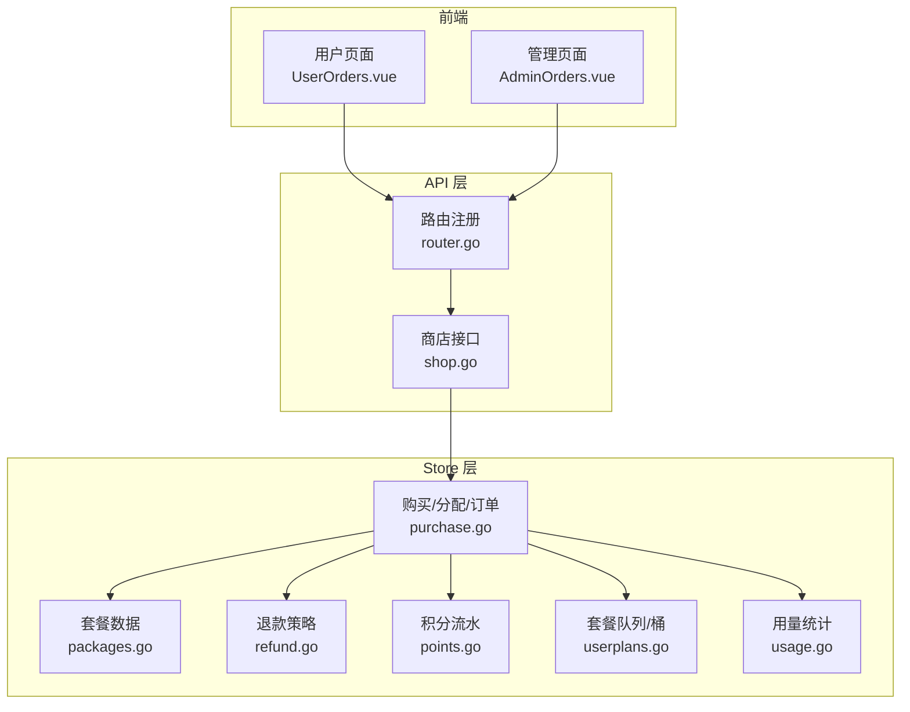
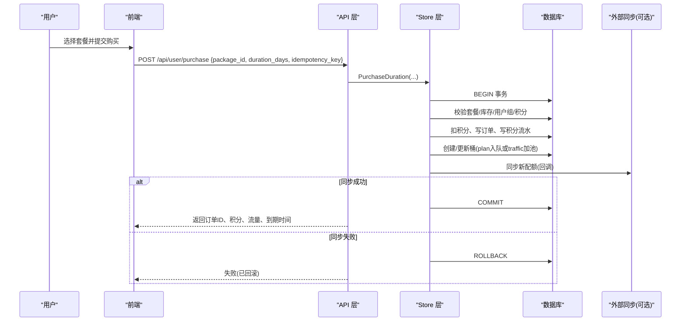
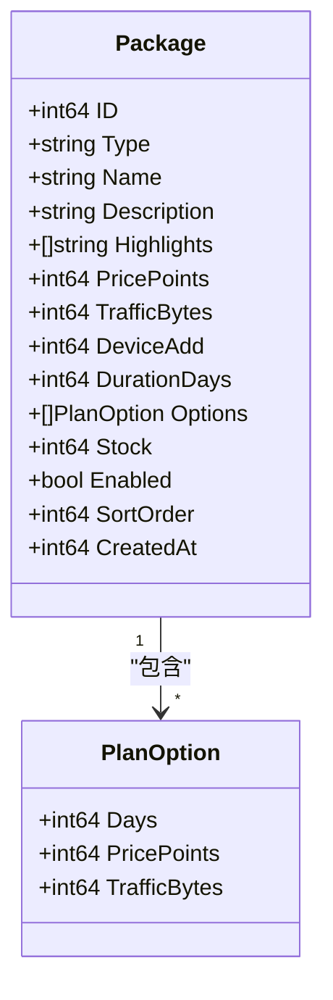
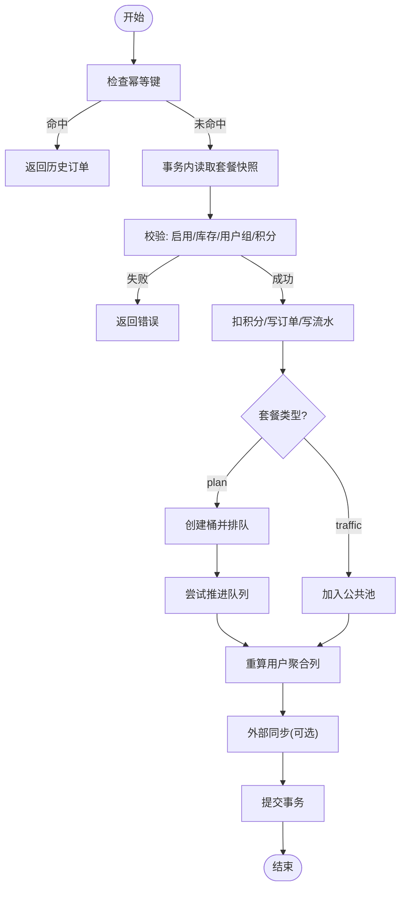
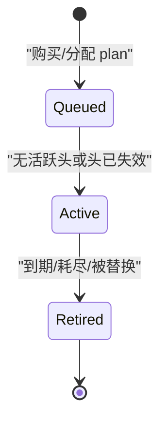
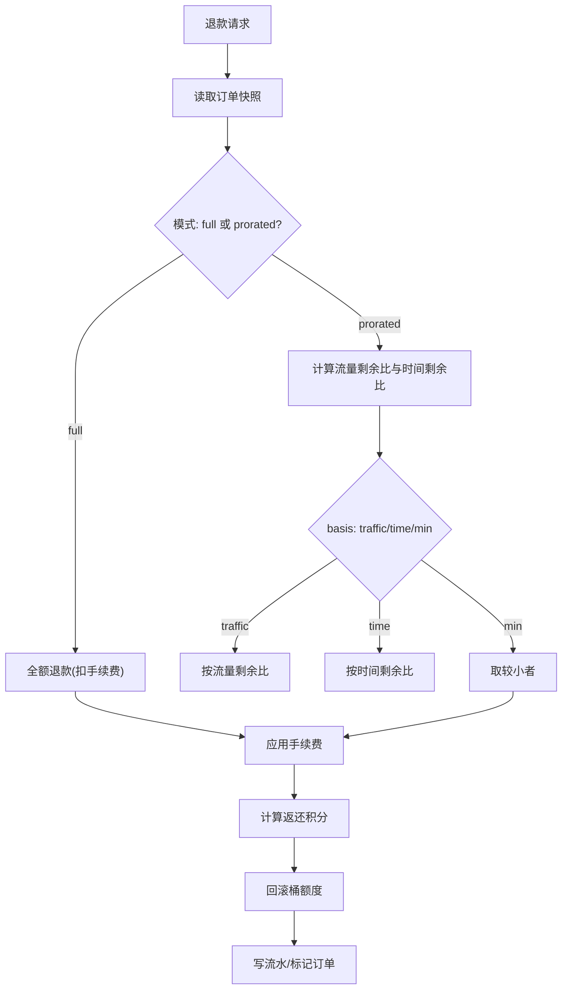
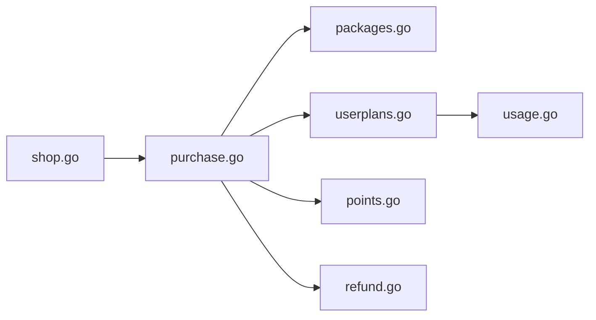

# 套餐订单系统

<cite>
**本文引用的文件**
- [packages.go](file://internal/store/packages.go)
- [purchase.go](file://internal/store/purchase.go)
- [refund.go](file://internal/store/refund.go)
- [points.go](file://internal/store/points.go)
- [userplans.go](file://internal/store/userplans.go)
- [usage.go](file://internal/store/usage.go)
- [shop.go](file://internal/api/shop.go)
- [router.go](file://internal/api/router.go)
- [config.go](file://internal/config/config.go)
- [UserOrders.vue](file://frontend/src/views/UserOrders.vue)
- [AdminOrders.vue](file://frontend/src/views/AdminOrders.vue)
</cite>

## 目录
1. [简介](#简介)
2. [项目结构](#项目结构)
3. [核心组件](#核心组件)
4. [架构总览](#架构总览)
5. [详细组件分析](#详细组件分析)
6. [依赖关系分析](#依赖关系分析)
7. [性能考量](#性能考量)
8. [故障排查指南](#故障排查指南)
9. [结论](#结论)
10. [附录：API 接口文档](#附录api-接口文档)

## 简介
本系统提供“套餐配置管理 + 订单处理流程 + 积分商城”的完整闭环，支持流量包、订阅计划与设备扩展三类商品；通过“桶（Bucket）模型”实现按套餐维度的独立计量与排队激活；内置可配置的退款策略（按比例或全额），并记录完整的积分流水。系统同时提供用户端与管理端的订单、套餐、用量统计等能力，并通过队列机制保障同一套餐的续费顺序与公平性。

## 项目结构
- 后端服务
  - API 层：路由注册、鉴权、请求校验、错误映射
  - Store 层：数据库访问、事务、业务规则（购买、退款、配额、队列、用量）
  - 配置：环境变量加载、默认值
- 前端界面
  - 用户侧：套餐购买、订单查看、积分明细、订阅状态
  - 管理侧：套餐管理、订单管理、退款预览与执行、用量统计

**图表来源**
- [router.go:132-386](file://internal/api/router.go#L132-L386)
- [shop.go:11-125](file://internal/api/shop.go#L11-L125)
- [packages.go:17-41](file://internal/store/packages.go#L17-L41)
- [purchase.go:22-41](file://internal/store/purchase.go#L22-L41)
- [userplans.go:574-607](file://internal/store/userplans.go#L574-L607)
- [refund.go:12-24](file://internal/store/refund.go#L12-L24)
- [points.go:14-24](file://internal/store/points.go#L14-L24)
- [usage.go:28-44](file://internal/store/usage.go#L28-L44)

**章节来源**
- [router.go:132-386](file://internal/api/router.go#L132-L386)
- [config.go:5-28](file://internal/config/config.go#L5-L28)

## 核心组件
- 套餐配置
  - 支持多时长选项（PlanOption）、库存、可见范围（用户组）、排序与启用开关
  - 默认时长自动对齐首个选项，保证展示与计费一致性
- 订单与购买
  - 幂等键防重放；事务内重新读取套餐快照，确保价格/库存/可用性与最终一致
  - 购买后写入订单、扣减积分、创建桶（plan 入队，traffic 加入公共池）、更新聚合列
- 退款
  - 支持按比例/全额退款，基于流量剩余与时间剩余的最小值作为防作弊基础
  - 退款时回滚对应桶额度，保持额度与积分一致
- 积分系统
  - 统一的积分调整与流水记录，禁止负余额
- 套餐队列与桶
  - 每个购买的 plan 生成独立桶，处于“排队/活跃/退休”状态
  - 同一套餐按序激活，不同套餐并行生效
- 用量统计
  - 生命周期与窗口化两种口径，支持按用户/套餐维度聚合

**章节来源**
- [packages.go:17-139](file://internal/store/packages.go#L17-L139)
- [purchase.go:43-250](file://internal/store/purchase.go#L43-L250)
- [refund.go:12-184](file://internal/store/refund.go#L12-L184)
- [points.go:26-65](file://internal/store/points.go#L26-L65)
- [userplans.go:28-53](file://internal/store/userplans.go#L28-L53)
- [usage.go:9-44](file://internal/store/usage.go#L9-L44)

## 架构总览
系统采用分层架构：前端通过 REST API 调用后端；API 层负责鉴权、参数校验与错误映射；Store 层封装所有持久化与业务逻辑，使用事务保证一致性；外部同步（如 sing-box 配置）在事务内回调，失败则整体回滚。

**图表来源**
- [shop.go:27-94](file://internal/api/shop.go#L27-L94)
- [purchase.go:53-250](file://internal/store/purchase.go#L53-L250)

## 详细组件分析

### 套餐数据结构与配置管理
- 套餐类型：traffic（流量包）、plan（订阅计划）、device（设备扩展）
- PlanOption：时长、价格（积分）、流量字节数
- 字段：名称、描述、亮点、价格、流量、设备增加数、默认时长、选项列表、库存、是否启用、排序、创建时间
- 可见性：公开或绑定用户组；仅允许组内成员购买
- 默认选项：当存在选项时，默认时长/价格/流量取首个选项，保证展示与计费一致

**图表来源**
- [packages.go:17-41](file://internal/store/packages.go#L17-L41)

**章节来源**
- [packages.go:17-139](file://internal/store/packages.go#L17-L139)
- [packages.go:171-245](file://internal/store/packages.go#L171-L245)

### 订单处理流程与状态机
- 订单状态：success（成功）、refunded（已退款）
- 购买流程要点：
  - 幂等键去重，防止重复扣款
  - 事务内重新读取套餐快照，避免并发导致的价格/库存不一致
  - 校验用户组权限、库存、积分余额
  - 写入订单、扣积分、写积分流水
  - plan 类型：创建桶并进入“queued”，尝试立即推进到“active”（若无活跃头）
  - traffic 类型：加入公共池
  - 更新用户聚合列（流量上限、已用上下行、到期时间）
  - 有限库存时原子扣减，防止超卖
- 退款流程要点：
  - 计算退款金额（比例或全额），考虑手续费
  - 回滚对应桶额度（plan 退时长+流量，traffic 退回池）
  - 标记订单为 refunded，记录退款比例与流量
  - 若当前套餐桶被移除且 current_plan_id 指向该套餐，则清空指针

**图表来源**
- [purchase.go:53-250](file://internal/store/purchase.go#L53-L250)

**章节来源**
- [purchase.go:22-41](file://internal/store/purchase.go#L22-L41)
- [purchase.go:53-250](file://internal/store/purchase.go#L53-L250)
- [purchase.go:412-567](file://internal/store/purchase.go#L412-L567)

### 套餐队列与桶模型
- 桶（Bucket）：用户持有的计量单元，分为 plan（订阅计划）与 pool（流量池）
- 状态：
  - queued：等待激活，不计费不生效
  - active：当前生效，开始计时与计量
  - retired：已过期或被替换，不再生效
- 队列推进：
  - 同一套餐按序激活，若有活跃头则排队；无活跃头则最早排队项立即激活
  - 周期任务扫描并推进到期/耗尽的队列
  - 读路径按需推进，确保用户看到最新状态
- 凭证与身份：
  - plan 订阅线拥有稳定身份（client_name/uuid/secret），多次续费共享同一身份
  - 代理账户（proxy_username/password）可选，独立于登录账号

**图表来源**
- [userplans.go:28-53](file://internal/store/userplans.go#L28-L53)
- [userplans.go:148-226](file://internal/store/userplans.go#L148-L226)
- [userplans.go:574-607](file://internal/store/userplans.go#L574-L607)

**章节来源**
- [userplans.go:28-53](file://internal/store/userplans.go#L28-L53)
- [userplans.go:148-226](file://internal/store/userplans.go#L148-L226)
- [userplans.go:330-392](file://internal/store/userplans.go#L330-L392)
- [userplans.go:394-434](file://internal/store/userplans.go#L394-L434)
- [userplans.go:436-460](file://internal/store/userplans.go#L436-L460)

### 积分系统与经济模型
- 积分调整：统一接口 AdjustPoints，原子更新余额并记录流水，禁止负余额
- 购买：扣减积分，记录 purchase 流水
- 退款：按比例或全额返还积分，记录 refund 流水
- 管理员充值：admin_grant 流水，用于赠送或补偿
- 经济模型：
  - 以积分为计价单位，套餐价格由配置决定
  - 退款策略可配置：mode（prorated/full）、basis（traffic/time/min）、fee_percent（手续费）
  - 防作弊：比例退款取流量剩余与时间剩余的最小值，避免只退时间不退流量的漏洞

**图表来源**
- [refund.go:12-24](file://internal/store/refund.go#L12-L24)
- [refund.go:85-184](file://internal/store/refund.go#L85-L184)
- [refund.go:219-241](file://internal/store/refund.go#L219-L241)

**章节来源**
- [points.go:26-65](file://internal/store/points.go#L26-L65)
- [refund.go:12-184](file://internal/store/refund.go#L12-L184)
- [refund.go:219-241](file://internal/store/refund.go#L219-L241)

### 用量统计与限制控制
- 生命周期总量：来自用户累计计数器（users.used_*）或桶累计（user_plans.used_*）
- 窗口化统计：来自每日汇总表（traffic_daily），支持任意日期范围
- 过滤维度：用户、套餐、时间窗口
- 限制控制：
  - 套餐流量上限与到期时间由桶维护
  - 公共池（pool）无到期，仅受流量上限限制
  - 免费桶（free）不计入付费配额，但单独计量

**章节来源**
- [usage.go:9-44](file://internal/store/usage.go#L9-L44)
- [usage.go:126-187](file://internal/store/usage.go#L126-L187)
- [usage.go:189-249](file://internal/store/usage.go#L189-L249)
- [usage.go:284-345](file://internal/store/usage.go#L284-L345)
- [userplans.go:436-460](file://internal/store/userplans.go#L436-L460)

### 用户套餐分配机制
- 管理员分配：AssignPackage/AssignPackageDuration，不扣积分，记录 admin_grant 流水
- 首次购买：若该套餐无活跃头，立即激活；否则排队
- 续费：新增一份排队，待当前头结束后自动激活
- 删除/撤销：DeleteBucket 移除指定桶，若移除的是活跃头，则推进下一份

**章节来源**
- [purchase.go:252-367](file://internal/store/purchase.go#L252-L367)
- [userplans.go:148-226](file://internal/store/userplans.go#L148-L226)
- [userplans.go:779-800](file://internal/store/userplans.go#L779-L800)

### 前端交互与可视化
- 用户订单页：展示累计消费、订单总数、已退款、近30天消费趋势；支持筛选与分组
- 管理订单页：总收入、已退款、订单数、退款率；支持按套餐/状态分组、搜索、排序
- 退款弹窗：预览退款金额与比例，确认后执行

**章节来源**
- [UserOrders.vue:1-200](file://frontend/src/views/UserOrders.vue#L1-L200)
- [AdminOrders.vue:1-200](file://frontend/src/views/AdminOrders.vue#L1-L200)

## 依赖关系分析
- API 层依赖 Store 层完成所有业务操作
- Store 层内部模块耦合：
  - purchase.go 依赖 packages.go（套餐快照）、userplans.go（桶与队列）、points.go（积分流水）、refund.go（退款策略）
  - userplans.go 提供队列推进、桶管理、聚合重算
  - usage.go 提供多维度用量查询
- 外部依赖：
  - sing-box 控制器（可选）：在事务内回调同步配置，失败则回滚
  - 邮件服务（可选）：用于通知
  - 自更新器（可选）：用于版本升级

**图表来源**
- [shop.go:11-125](file://internal/api/shop.go#L11-L125)
- [purchase.go:53-250](file://internal/store/purchase.go#L53-L250)
- [packages.go:17-139](file://internal/store/packages.go#L17-L139)
- [userplans.go:28-53](file://internal/store/userplans.go#L28-L53)
- [points.go:26-65](file://internal/store/points.go#L26-L65)
- [refund.go:12-184](file://internal/store/refund.go#L12-L184)
- [usage.go:9-44](file://internal/store/usage.go#L9-L44)

**章节来源**
- [router.go:132-386](file://internal/api/router.go#L132-L386)
- [purchase.go:53-250](file://internal/store/purchase.go#L53-L250)

## 性能考量
- 幂等键与唯一索引：防止重复购买与并发竞争
- 事务内重读套餐：避免缓存导致的价量不一致
- 原子扣库存：UPDATE ... WHERE stock>0，RowsAffected=1 才成功
- 批量查询：ListBucketsBulk 减少 N+1 查询
- 异步重建：sing-box 配置重建通过调度器合并与重试，避免阻塞响应
- 限流：认证、重发验证码、探针上报、订阅地址更换均有限流保护

**章节来源**
- [purchase.go:88-104](file://internal/store/purchase.go#L88-L104)
- [purchase.go:210-221](file://internal/store/purchase.go#L210-L221)
- [userplans.go:727-755](file://internal/store/userplans.go#L727-L755)
- [router.go:94-130](file://internal/api/router.go#L94-L130)

## 故障排查指南
- 购买失败
  - 常见原因：套餐下架、库存不足、用户组限制、积分不足、用户不存在
  - 处理：检查套餐状态、库存、用户组绑定、用户积分
- 退款异常
  - 常见原因：订单已退款、订单不存在、用户不存在
  - 处理：确认订单状态，使用退款预览接口核对金额
- 队列未激活
  - 可能原因：当前套餐仍有活跃头（未到期或未耗尽）
  - 处理：等待到期/耗尽，或手动推进队列（读路径会触发）
- 外部同步失败
  - 现象：购买成功但节点未更新
  - 处理：检查 sing-box 控制器连接，触发异步重建

**章节来源**
- [shop.go:61-83](file://internal/api/shop.go#L61-L83)
- [purchase.go:412-567](file://internal/store/purchase.go#L412-L567)
- [userplans.go:228-302](file://internal/store/userplans.go#L228-L302)

## 结论
本系统通过“桶+队列”的精细化设计，实现了套餐的独立计量与有序激活；结合幂等购买、事务内同步与可配置退款策略，确保了交易的一致性与公平性。前后端提供了完整的订单管理与用量统计能力，便于运营监控与用户自助服务。未来可扩展更多商品类型、支付渠道与风控策略。

## 附录：API 接口文档

### 用户端接口
- GET /api/user/packages
  - 功能：获取当前用户可见的可售套餐
  - 返回：套餐列表
- POST /api/user/purchase
  - 功能：购买套餐
  - 请求体：{ package_id, duration_days?, idempotency_key? }
  - 返回：{ order_id, points, traffic_total, expiry_at }
- GET /api/user/orders
  - 功能：查询用户订单
  - 返回：订单列表
- GET /api/user/points
  - 功能：查询积分余额与流水
  - 返回：{ balance, transactions }

**章节来源**
- [shop.go:11-125](file://internal/api/shop.go#L11-L125)
- [router.go:177-208](file://internal/api/router.go#L177-L208)

### 管理端接口
- GET /api/admin/orders
  - 功能：列出所有订单（支持搜索）
- GET /api/admin/users/{id}/orders
  - 功能：列出指定用户订单
- GET /api/admin/orders/{id}/refund-preview
  - 功能：退款预览（支持 modeOverride: prorated/full）
- POST /api/admin/orders/{id}/refund
  - 功能：执行退款
- DELETE /api/admin/orders/{id}
  - 功能：删除订单（清理孤儿记录）

**章节来源**
- [router.go:210-252](file://internal/api/router.go#L210-L252)
- [purchase.go:569-649](file://internal/store/purchase.go#L569-L649)
- [refund.go:243-274](file://internal/store/refund.go#L243-L274)

### 套餐管理接口
- GET /api/admin/packages
  - 功能：列出所有套餐
- POST /api/admin/packages
  - 功能：创建套餐
- PUT /api/admin/packages/{id}
  - 功能：更新套餐
- POST /api/admin/packages/reorder
  - 功能：调整排序
- POST /api/admin/packages/{id}/retire
  - 功能：退役套餐（回收权益）
- POST /api/admin/packages/{id}/enable
  - 功能：启用/禁用套餐
- DELETE /api/admin/packages/{id}
  - 功能：删除套餐

**章节来源**
- [router.go:239-245](file://internal/api/router.go#L239-L245)
- [packages.go:171-312](file://internal/store/packages.go#L171-L312)

### 配置与环境
- 环境变量
  - QZ_LISTEN：监听地址
  - QZ_DB：数据库路径
  - QZ_ADMIN_USER：管理员用户名
  - QZ_ADMIN_PASS：管理员密码（留空则首次运行生成随机密码）

**章节来源**
- [config.go:5-28](file://internal/config/config.go#L5-L28)
