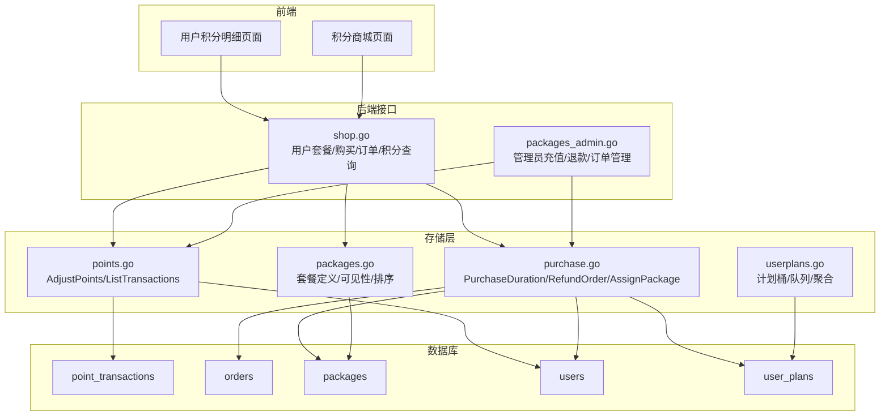
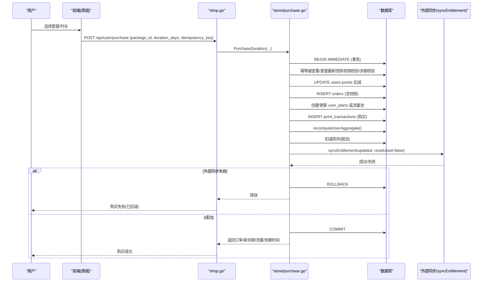
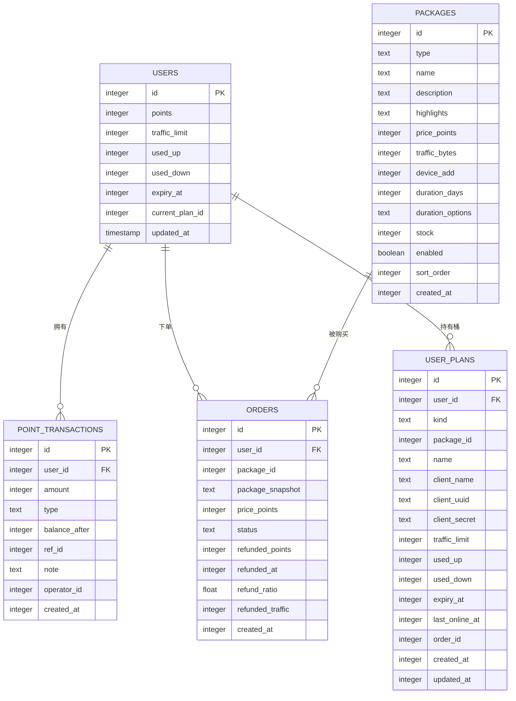
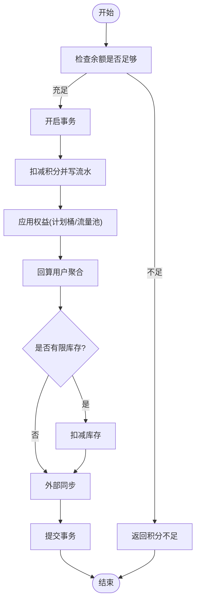
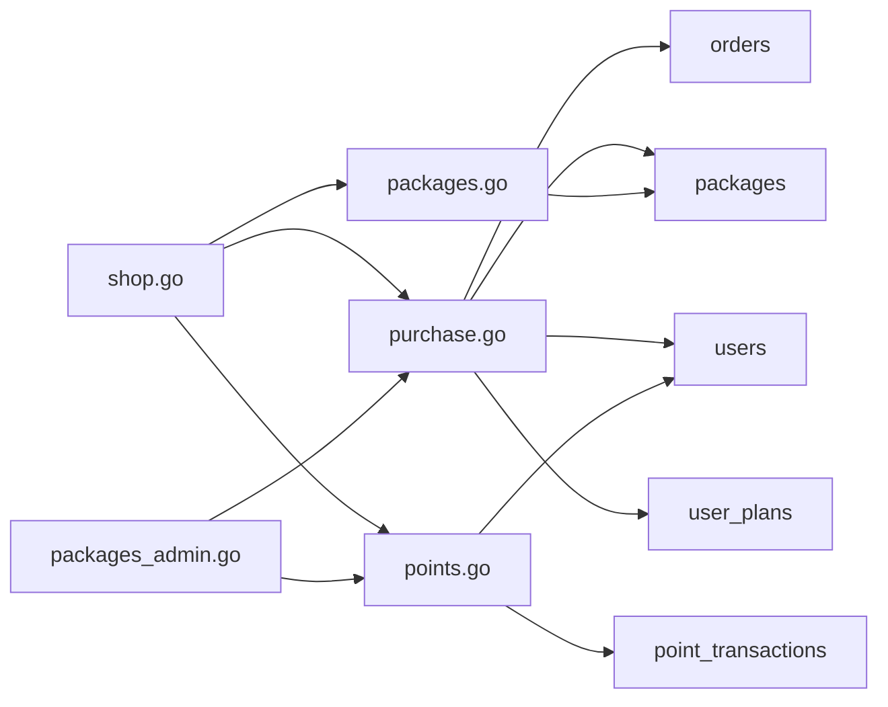

# 积分系统

<cite>
**本文引用的文件**
- [internal/store/points.go](file://internal/store/points.go)
- [internal/store/purchase.go](file://internal/store/purchase.go)
- [internal/store/packages.go](file://internal/store/packages.go)
- [internal/api/shop.go](file://internal/api/shop.go)
- [internal/api/packages_admin.go](file://internal/api/packages_admin.go)
- [frontend/src/views/UserPoints.vue](file://frontend/src/views/UserPoints.vue)
- [frontend/src/views/UserShop.vue](file://frontend/src/views/UserShop.vue)
- [internal/store/migrate.go](file://internal/store/migrate.go)
- [internal/store/userplans.go](file://internal/store/userplans.go)
</cite>

## 目录
1. [简介](#简介)
2. [项目结构](#项目结构)
3. [核心组件](#核心组件)
4. [架构总览](#架构总览)
5. [详细组件分析](#详细组件分析)
6. [依赖关系分析](#依赖关系分析)
7. [性能与一致性](#性能与一致性)
8. [故障排查指南](#故障排查指南)
9. [结论](#结论)
10. [附录：API 参考](#附录api-参考)

## 简介
本文件面向开发者与运营人员，系统化说明积分系统的模型设计、计算规则、交易流水机制、防作弊手段、积分商城与管理操作能力，并提供扩展点与自定义规则实现指导。系统以“账户余额 + 事务流水”为核心，结合“套餐/流量包购买”的权益模型，确保积分变动的可追溯性与强一致性。

## 项目结构
- 后端存储层（store）：定义积分流水、订单、套餐、用户计划桶等数据模型与持久化逻辑，提供原子化的购买、退款、管理员充值等方法。
- 后端接口层（api）：暴露用户侧与管理员侧 HTTP API，负责鉴权、参数校验、错误映射与副作用（如订阅重建）。
- 前端页面（frontend）：用户积分明细、积分商城等界面，调用后端 API 完成查询、购买等操作。
- 数据库迁移（migrate）：定义 point_transactions、orders、user_plans 等表结构与索引。

图表来源
- [internal/api/shop.go:11-124](file://internal/api/shop.go#L11-L124)
- [internal/api/packages_admin.go:283-469](file://internal/api/packages_admin.go#L283-L469)
- [internal/store/points.go:14-87](file://internal/store/points.go#L14-L87)
- [internal/store/purchase.go:43-250](file://internal/store/purchase.go#L43-L250)
- [internal/store/packages.go:23-41](file://internal/store/packages.go#L23-L41)
- [internal/store/userplans.go:574-607](file://internal/store/userplans.go#L574-L607)

章节来源
- [internal/store/migrate.go:73-84](file://internal/store/migrate.go#L73-L84)
- [internal/store/migrate.go:344-371](file://internal/store/migrate.go#L344-L371)

## 核心组件
- 积分余额与流水
  - 用户余额存储在 users.points；每次变动通过 AdjustPoints 在事务中更新余额并写入 point_transactions 流水，保证不可为负且可审计。
  - 流水字段包含 amount、type、balance_after、ref_id、note、operator_id、created_at，支持按类型筛选与溯源。
- 套餐与商城
  - packages 表描述商品（流量包/订阅计划/设备扩展），支持多时长选项、库存、可见性（用户组限制）、排序。
  - 用户侧通过 /api/user/packages 获取可见商品，/api/user/purchase 完成购买，/api/user/orders 查看订单。
- 购买与权益
  - PurchaseDuration 在事务内完成：幂等键去重、重新读取套餐最新价格/库存/可见性、扣减积分、写订单、创建/更新计划桶或流量池、写流水、回算用户聚合、扣库存、外部同步（如 sing-box 配置）。
  - 退款 RefundOrder 支持按比例或全额退款，撤销对应权益并记录流水，保持幂等。
- 管理员操作
  - 管理员充值/调整：POST /api/admin/users/{id}/points，内部调用 AdjustPoints，记录 admin_recharge 或 adjust 类型流水。
  - 订单退款预览与执行：/api/admin/orders/{id}/refund-preview 与 /api/admin/orders/{id}/refund。

章节来源
- [internal/store/points.go:14-87](file://internal/store/points.go#L14-L87)
- [internal/store/purchase.go:43-250](file://internal/store/purchase.go#L43-L250)
- [internal/store/purchase.go:412-567](file://internal/store/purchase.go#L412-L567)
- [internal/store/packages.go:23-41](file://internal/store/packages.go#L23-L41)
- [internal/api/shop.go:11-124](file://internal/api/shop.go#L11-L124)
- [internal/api/packages_admin.go:283-469](file://internal/api/packages_admin.go#L283-L469)

## 架构总览
积分系统采用“事务+流水+幂等键”的一致性保障方案，将资金（积分）与权益（计划桶/流量池）变更绑定在同一数据库事务中，任何外部副作用失败均整体回滚，避免积分丢失或权益不一致。

图表来源
- [internal/api/shop.go:27-94](file://internal/api/shop.go#L27-L94)
- [internal/store/purchase.go:61-250](file://internal/store/purchase.go#L61-L250)

## 详细组件分析

### 数据模型与关系
- 用户积分与流水
  - users.points：当前余额。
  - point_transactions：每笔积分变动记录，包含金额、类型、变更后余额、关联ID、备注、操作人、时间戳。
- 订单与套餐
  - orders：订单主表，包含 package_snapshot（购买时套餐快照）、price_points、status、idempotency_key、退款信息等。
  - packages：商品定义，支持多时长选项、库存、可见性、排序。
- 计划桶与流量池
  - user_plans：独立计量的“桶”，kind=plan 表示订阅计划，kind=pool 表示共享流量池；每个桶有独立的 sing-box 身份、配额、用量、过期时间、状态（active/queued）。

图表来源
- [internal/store/migrate.go:73-84](file://internal/store/migrate.go#L73-L84)
- [internal/store/migrate.go:344-371](file://internal/store/migrate.go#L344-L371)
- [internal/store/packages.go:23-41](file://internal/store/packages.go#L23-L41)

章节来源
- [internal/store/points.go:14-87](file://internal/store/points.go#L14-L87)
- [internal/store/purchase.go:22-41](file://internal/store/purchase.go#L22-L41)
- [internal/store/packages.go:23-41](file://internal/store/packages.go#L23-L41)
- [internal/store/userplans.go:574-607](file://internal/store/userplans.go#L574-L607)

### 积分计算规则
- 购买套餐获得权益并消费积分
  - 用户在商城选择套餐与时长，提交购买请求。后端在事务内重新读取套餐最新信息，校验库存、可见性与用户组权限，检查余额充足后扣减积分，写入订单与流水，创建/更新计划桶或流量池，并回算用户聚合字段。
  - 若为订阅计划，可能进入排队队列，待当前份结束后自动启用；若为流量包，则直接增加流量池。
- 管理员充值/调整
  - 管理员可通过接口对指定用户进行充值或扣减，类型为 admin_recharge（正数）或 adjust（负数），同样写入流水并保证余额非负。
- 退款
  - 支持按比例或全额退款，根据当前桶使用量与剩余时间计算应退积分，撤销相应权益，标记订单为 refunded，并写入流水。

章节来源
- [internal/store/purchase.go:61-250](file://internal/store/purchase.go#L61-L250)
- [internal/store/purchase.go:412-567](file://internal/store/purchase.go#L412-L567)
- [internal/api/packages_admin.go:283-316](file://internal/api/packages_admin.go#L283-L316)

### 交易流水机制
- 所有积分变动均通过事务写入 point_transactions，包含 amount、type、balance_after、ref_id、note、operator_id、created_at。
- 类型包括 purchase（购买消费）、admin_recharge（管理员充值）、adjust（管理员调整）、refund（退款）、admin_grant（管理员赠送）等。
- 列表查询支持按用户过滤与分页限制，默认上限保护。

图表来源
- [internal/store/purchase.go:61-250](file://internal/store/purchase.go#L61-L250)
- [internal/store/points.go:29-65](file://internal/store/points.go#L29-L65)

章节来源
- [internal/store/points.go:29-87](file://internal/store/points.go#L29-L87)
- [internal/store/purchase.go:155-195](file://internal/store/purchase.go#L155-L195)

### 防作弊机制
- 并发控制与幂等
  - 购买接口使用客户端提供的 idempotency_key 作为幂等键，在事务内基于唯一索引防止重复扣款与重复发放权益。
  - 使用 BEGIN IMMEDIATE 锁定竞争资源，避免超卖与重复处理。
- 事务一致性
  - 积分扣减、订单写入、权益变更、流水记录、库存扣减、外部同步均在同一事务中；任一环节失败整体回滚，保证积分与权益一致。
- 数据校验
  - 购买前重新读取套餐最新状态（enabled、stock、group 权限），避免前端缓存导致的不一致。
  - 管理员充值/调整时校验余额不会为负。
- 安全边界
  - 幂等键长度限制，防止滥用存储。
  - 管理员接口要求认证上下文中的 operatorID，便于审计。

章节来源
- [internal/store/purchase.go:88-104](file://internal/store/purchase.go#L88-L104)
- [internal/store/purchase.go:106-142](file://internal/store/purchase.go#L106-L142)
- [internal/store/purchase.go:210-221](file://internal/store/purchase.go#L210-L221)
- [internal/api/shop.go:27-50](file://internal/api/shop.go#L27-L50)
- [internal/store/points.go:29-65](file://internal/store/points.go#L29-L65)

### 积分商城功能
- 商品展示
  - 用户侧通过 /api/user/packages 获取可见商品，后端根据用户组与库存过滤，隐藏受限商品。
  - 前端 UserShop.vue 渲染卡片，支持多时长选项切换、规格对比、库存提示、购买按钮禁用态。
- 购买流程
  - 前端生成幂等键，调用 /api/user/purchase；后端在事务内完成校验、扣款、权益发放、流水记录与外部同步。
  - 若购买的是订阅计划且已有活跃份，会加入队列等待当前份结束后启用。
- 库存管理
  - packages.stock 支持无限量（-1）或有限数量；购买时原子扣减，并发下避免超卖。
- 订单查询
  - 用户侧 /api/user/orders 可查看历史订单；管理员侧可查看所有订单并按用户名/订单号搜索。

章节来源
- [internal/api/shop.go:11-124](file://internal/api/shop.go#L11-L124)
- [frontend/src/views/UserShop.vue:60-170](file://frontend/src/views/UserShop.vue#L60-L170)
- [internal/store/packages.go:218-245](file://internal/store/packages.go#L218-L245)
- [internal/store/purchase.go:170-221](file://internal/store/purchase.go#L170-L221)

### 管理员积分操作
- 手动充值/调整余额
  - POST /api/admin/users/{id}/points {amount, note}，内部调用 AdjustPoints，类型为 admin_recharge（正数）或 adjust（负数），写入流水并返回新余额。
- 订单退款
  - 先通过 /api/admin/orders/{id}/refund-preview 预览退款金额与比例，再执行 /api/admin/orders/{id}/refund 完成退款，撤销权益并记录流水。
- 其他管理
  - 删除用户计划份（非退款，仅撤销权益）、清理孤立订单等。

章节来源
- [internal/api/packages_admin.go:283-469](file://internal/api/packages_admin.go#L283-L469)
- [internal/store/points.go:29-65](file://internal/store/points.go#L29-L65)
- [internal/store/purchase.go:412-567](file://internal/store/purchase.go#L412-L567)

### 前端积分明细
- 用户可在积分明细页查看当前余额、累计收入/支出、近7天净增、收支构成饼图、近30天趋势柱状图，以及明细列表（支持按类型、备注筛选）。
- 数据来源为 /api/user/points，返回 balance 与 transactions 列表。

章节来源
- [frontend/src/views/UserPoints.vue:1-365](file://frontend/src/views/UserPoints.vue#L1-L365)
- [internal/api/shop.go:111-124](file://internal/api/shop.go#L111-L124)

## 依赖关系分析
- 接口层依赖存储层方法：
  - shop.go 依赖 store.PurchaseDuration、ListPackagesForUser、ListOrders、ListTransactions。
  - packages_admin.go 依赖 store.AdjustPoints、RefundOrder、ListOrdersAdmin、DeleteBucket 等。
- 存储层依赖数据库表：
  - points.go 依赖 users、point_transactions。
  - purchase.go 依赖 orders、packages、users、user_plans。
  - packages.go 依赖 packages、package_user_groups、user_group_members。
  - userplans.go 依赖 user_plans 及聚合函数。

图表来源
- [internal/api/shop.go:11-124](file://internal/api/shop.go#L11-L124)
- [internal/api/packages_admin.go:283-469](file://internal/api/packages_admin.go#L283-L469)
- [internal/store/purchase.go:61-250](file://internal/store/purchase.go#L61-L250)
- [internal/store/points.go:29-87](file://internal/store/points.go#L29-L87)
- [internal/store/packages.go:218-245](file://internal/store/packages.go#L218-L245)

章节来源
- [internal/api/shop.go:11-124](file://internal/api/shop.go#L11-L124)
- [internal/api/packages_admin.go:283-469](file://internal/api/packages_admin.go#L283-L469)
- [internal/store/purchase.go:61-250](file://internal/store/purchase.go#L61-L250)
- [internal/store/points.go:29-87](file://internal/store/points.go#L29-L87)
- [internal/store/packages.go:218-245](file://internal/store/packages.go#L218-L245)

## 性能与一致性
- 事务粒度
  - 购买与退款均在大事务中完成，减少锁竞争窗口；BEGIN IMMEDIATE 提前获取写锁，避免并发冲突。
- 幂等键
  - 客户端生成稳定幂等键，服务端基于唯一索引去重，防止网络重试导致的重复扣款。
- 库存原子扣减
  - 通过 UPDATE ... WHERE stock>0 并检查 RowsAffected，确保并发下不超卖。
- 外部同步容错
  - 外部同步失败时事务回滚，保证积分与权益一致；成功后才提交。
- 查询优化
  - 流水与订单查询设置合理 limit，避免大结果集拖慢响应。

[本节为通用性能建议，不直接分析具体文件]

## 故障排查指南
- 常见错误码与含义
  - 积分不足：余额不足以支付所选套餐。
  - 商品已下架/仅限指定用户组：套餐未启用或用户无购买权限。
  - 库存不足：并发购买导致库存耗尽。
  - 用户不存在：目标用户 ID 无效。
  - 购买失败（已回滚）：外部同步失败，事务回滚，积分未损失。
- 定位步骤
  - 查看 point_transactions 流水，确认是否扣款成功、类型是否正确。
  - 检查 orders 表，确认订单状态与快照内容。
  - 检查 user_plans 桶状态，确认权益是否发放或排队。
  - 核对 packages 表，确认套餐是否启用、库存是否充足、用户组绑定是否正确。
- 管理员操作注意事项
  - 充值/调整需确保余额不为负。
  - 退款前先预览，确认比例与金额；退款后权益撤销，注意用户订阅状态变化。

章节来源
- [internal/api/shop.go:61-94](file://internal/api/shop.go#L61-L94)
- [internal/api/packages_admin.go:283-316](file://internal/api/packages_admin.go#L283-L316)
- [internal/store/purchase.go:412-567](file://internal/store/purchase.go#L412-L567)

## 结论
本积分系统以事务+流水+幂等键为核心，实现了高一致性的积分扣减与权益发放。通过套餐模型与计划桶机制，支持灵活的订阅与流量包售卖；管理员具备完整的充值、退款与订单管理能力。系统在并发、库存、权限等方面提供了完善的防护，适合生产环境使用。

[本节为总结性内容，不直接分析具体文件]

## 附录：API 参考
- 用户侧
  - GET /api/user/packages：获取当前用户可见的商品列表。
  - POST /api/user/purchase：购买套餐，参数包含 package_id、duration_days、idempotency_key。
  - GET /api/user/orders：查询用户订单历史。
  - GET /api/user/points：查询用户积分余额与交易流水。
- 管理员侧
  - POST /api/admin/users/{id}/points：对用户进行积分充值或调整，参数 amount、note。
  - GET /api/admin/orders?q=：查询所有订单，支持用户名/订单号搜索。
  - GET /api/admin/users/{id}/orders：查询指定用户的订单。
  - GET /api/admin/users/{id}/plans：查询用户持有的计划桶。
  - DELETE /api/admin/users/{id}/plans/{planID}：撤销某份计划（非退款）。
  - DELETE /api/admin/orders/{id}：删除孤立订单（用户已删除）。
  - GET /api/admin/orders/{id}/refund-preview?mode=：退款预览。
  - POST /api/admin/orders/{id}/refund：执行退款，支持 prorated/full 模式。

章节来源
- [internal/api/shop.go:11-124](file://internal/api/shop.go#L11-L124)
- [internal/api/packages_admin.go:283-469](file://internal/api/packages_admin.go#L283-L469)
