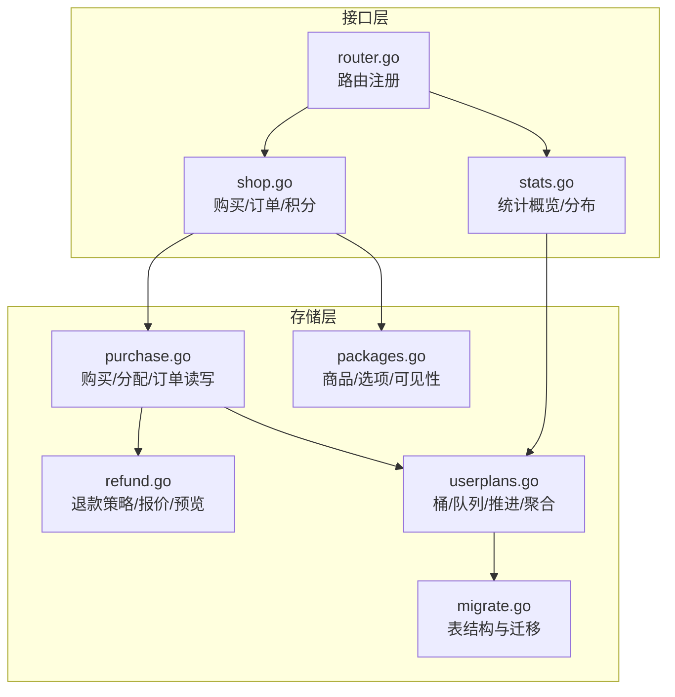
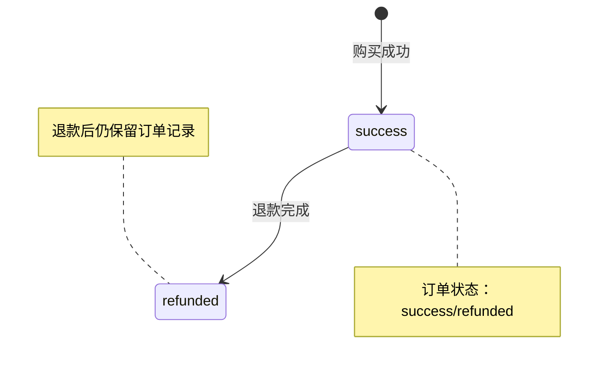
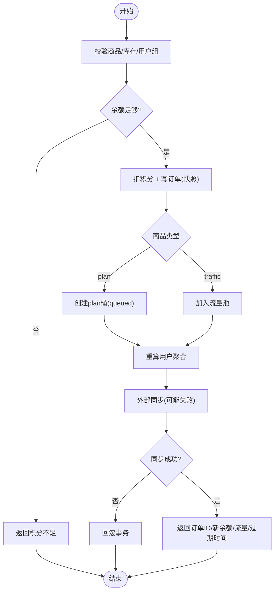
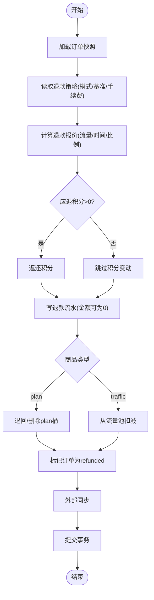
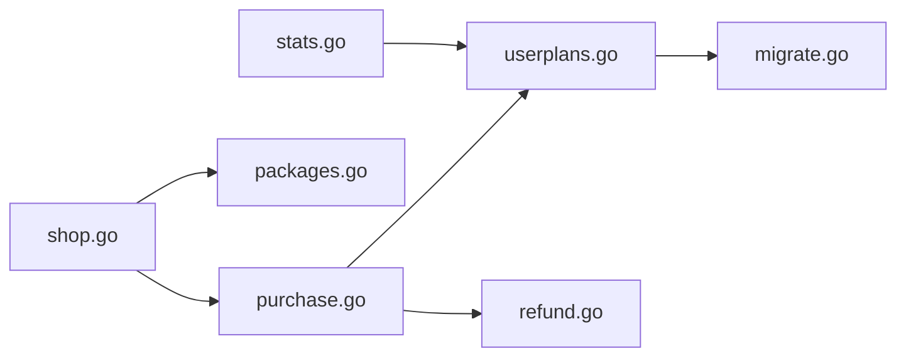

# 订单处理

<cite>
**本文引用的文件**
- [purchase.go](file://internal/store/purchase.go)
- [refund.go](file://internal/store/refund.go)
- [packages.go](file://internal/store/packages.go)
- [userplans.go](file://internal/store/userplans.go)
- [shop.go](file://internal/api/shop.go)
- [router.go](file://internal/api/router.go)
- [stats.go](file://internal/api/stats.go)
- [migrate.go](file://internal/store/migrate.go)
</cite>

## 目录
1. [简介](#简介)
2. [项目结构](#项目结构)
3. [核心组件](#核心组件)
4. [架构总览](#架构总览)
5. [详细组件分析](#详细组件分析)
6. [依赖关系分析](#依赖关系分析)
7. [性能考量](#性能考量)
8. [故障排查指南](#故障排查指南)
9. [结论](#结论)
10. [附录：API 接口文档](#附录api-接口文档)

## 简介
本系统提供完整的订单生命周期管理，覆盖从商品浏览、下单购买、权益发放到退款的全流程。订单以“积分”为支付媒介，支持流量包与订阅套餐两类商品；通过“桶（Bucket）+队列（Queue）”模型实现多份套餐的独立计量与顺序生效；退款策略支持按比例与全额两种模式，并内置手续费配置。系统提供用户侧与管理侧 API，支持多维度查询与统计，保障幂等、并发安全与数据一致性。

## 项目结构
订单相关代码主要分布在以下模块：
- 存储层（store）：订单、商品、权益桶、队列推进、退款计算、统计聚合等
- 接口层（api）：HTTP 路由、鉴权、请求校验、错误映射、异步重建通知
- 前端视图：订单列表、退款对话框、套餐展示与购买引导



**图表来源**
- [router.go:132-387](file://internal/api/router.go#L132-L387)
- [shop.go:11-124](file://internal/api/shop.go#L11-L124)
- [stats.go:79-199](file://internal/api/stats.go#L79-L199)
- [purchase.go:22-250](file://internal/store/purchase.go#L22-L250)
- [refund.go:12-184](file://internal/store/refund.go#L12-L184)
- [packages.go:23-139](file://internal/store/packages.go#L23-L139)
- [userplans.go:28-226](file://internal/store/userplans.go#L28-L226)
- [migrate.go:344-371](file://internal/store/migrate.go#L344-L371)

**章节来源**
- [router.go:132-387](file://internal/api/router.go#L132-L387)
- [shop.go:11-124](file://internal/api/shop.go#L11-L124)
- [stats.go:79-199](file://internal/api/stats.go#L79-L199)
- [purchase.go:22-250](file://internal/store/purchase.go#L22-L250)
- [refund.go:12-184](file://internal/store/refund.go#L12-L184)
- [packages.go:23-139](file://internal/store/packages.go#L23-L139)
- [userplans.go:28-226](file://internal/store/userplans.go#L28-L226)
- [migrate.go:344-371](file://internal/store/migrate.go#L344-L371)

## 核心组件
- 订单（Order）：记录购买意图、商品快照、价格、状态、退款信息
- 商品（Package）：流量包/订阅套餐，支持多时长选项、库存、可见性控制
- 权益桶（Bucket）：按用户维度独立计量的额度单元，分为计划桶（plan）与流量池（pool）
- 队列（Queue）：同一商品的多次购买形成排队，当前头可用时自动推进激活
- 退款策略（RefundPolicy）：按比例或全额退款，基于流量/时间/最小值基准，可配置手续费
- 统计（Stats）：用户/站点级流量、收入趋势、套餐销量、用户分布等

**章节来源**
- [purchase.go:22-36](file://internal/store/purchase.go#L22-L36)
- [packages.go:23-41](file://internal/store/packages.go#L23-L41)
- [userplans.go:574-607](file://internal/store/userplans.go#L574-L607)
- [refund.go:12-24](file://internal/store/refund.go#L12-L24)
- [stats.go:79-199](file://internal/api/stats.go#L79-L199)

## 架构总览
订单处理采用“事务内原子化 + 外部回调同步”的设计：购买与退款在数据库事务中完成积分扣减、订单写入、权益桶变更、历史聚合重算，并在事务内调用外部同步回调（如 sing-box 配置重建），失败则整体回滚，保证资金与权益一致。

```mermaid
sequenceDiagram
participant C as "客户端"
participant A as "API(shop.go)"
participant S as "Store(purchase.go)"
participant DB as "数据库"
participant EXT as "外部同步(syncEntitlement)"
C->>A : POST /api/user/purchase {package_id, duration_days, idempotency_key}
A->>S : PurchaseDuration(userID, pkg, days, idemKey, sync)
S->>DB : BEGIN IMMEDIATE
S->>DB : 校验商品/库存/用户组/余额
S->>DB : 扣积分 + 写订单(快照)
S->>DB : 创建/更新权益桶(plan→队列; traffic→池)
S->>DB : 重算用户聚合(traffic_limit/expiry_at)
S->>EXT : 同步权益(可能触发配置重建)
EXT-->>S : 成功/失败
alt 同步失败
S->>DB : ROLLBACK
S-->>A : 错误(已回滚)
else 同步成功
S->>DB : COMMIT
S-->>A : 返回订单ID/新余额/流量/过期时间
end
A-->>C : JSON 响应
```

**图表来源**
- [shop.go:27-94](file://internal/api/shop.go#L27-L94)
- [purchase.go:43-250](file://internal/store/purchase.go#L43-L250)
- [userplans.go:28-226](file://internal/store/userplans.go#L28-L226)

**章节来源**
- [shop.go:27-94](file://internal/api/shop.go#L27-L94)
- [purchase.go:43-250](file://internal/store/purchase.go#L43-L250)
- [userplans.go:28-226](file://internal/store/userplans.go#L28-L226)

## 详细组件分析

### 订单数据结构与字段设计
- 订单（Order）
  - 关键字段：id、user_id、package_id、name/type（来自快照）、price_points、status、created_at、refunded_points、refunded_at、refund_ratio、refunded_traffic
  - 设计考虑：快照保存购买时的商品名称与类型，避免商品下架/改名影响历史；退款比例与流量用于审计与报表
- 商品（Package）
  - 类型：traffic（流量包）、plan（订阅套餐）、device（设备类，不参与购买）
  - 多时长选项（PlanOption）：days、price_points、traffic_bytes；默认选项用于未指定时长场景
  - 库存与可见性：stock=-1 表示无限；用户组限制仅对购买路径生效（显示层过滤，交易层再次校验）
- 权益桶（Bucket）
  - kind=plan：有到期时间与流量限额，按队列推进激活
  - kind=pool：共享流量池，无到期，最后扣除
  - 每个桶拥有独立的 sing-box 身份，便于按桶统计与配额控制

**章节来源**
- [purchase.go:22-36](file://internal/store/purchase.go#L22-L36)
- [packages.go:11-41](file://internal/store/packages.go#L11-L41)
- [packages.go:113-139](file://internal/store/packages.go#L113-L139)
- [userplans.go:574-607](file://internal/store/userplans.go#L574-L607)
- [migrate.go:344-371](file://internal/store/migrate.go#L344-L371)

### 订单生命周期与状态机
- 状态流转
  - success：购买成功，权益已发放
  - refunded：退款完成，保留记录用于审计
- 关键约束
  - 幂等键（idemKey）防止重复扣款
  - 事务内锁定（BEGIN IMMEDIATE）与唯一索引（user_id, idempotency_key）双重保护
  - 并发下库存扣减使用 UPDATE ... WHERE stock>0 并检查受影响行数，防止超卖
- 队列推进
  - plan 购买生成 queued 桶，当当前 head 不可用（过期/耗尽）时自动推进为 active
  - 删除/退款会释放 slot，立即推进下一份



**图表来源**
- [purchase.go:155-221](file://internal/store/purchase.go#L155-L221)
- [purchase.go:531-544](file://internal/store/purchase.go#L531-L544)
- [userplans.go:148-226](file://internal/store/userplans.go#L148-L226)

**章节来源**
- [purchase.go:155-221](file://internal/store/purchase.go#L155-L221)
- [purchase.go:531-544](file://internal/store/purchase.go#L531-L544)
- [userplans.go:148-226](file://internal/store/userplans.go#L148-L226)

### 购买流程与权益分配
- 购买入口：POST /api/user/purchase
- 核心步骤
  - 校验商品启用/库存/用户组/余额
  - 解析时长选项（forDuration），确定最终价格与流量
  - 扣积分、写订单（含快照）、创建/更新权益桶
  - 重算用户聚合（traffic_limit/used_up/used_down/expiry_at）
  - 事务内同步外部系统（如 sing-box 配置重建）
  - 提交事务并返回结果
- 权益分配模型
  - plan：生成独立桶，进入队列；若无活跃头则立即激活
  - traffic：加入共享池，无到期



**图表来源**
- [shop.go:27-94](file://internal/api/shop.go#L27-L94)
- [purchase.go:61-250](file://internal/store/purchase.go#L61-L250)
- [packages.go:113-139](file://internal/store/packages.go#L113-L139)
- [userplans.go:28-226](file://internal/store/userplans.go#L28-L226)

**章节来源**
- [shop.go:27-94](file://internal/api/shop.go#L27-L94)
- [purchase.go:61-250](file://internal/store/purchase.go#L61-L250)
- [packages.go:113-139](file://internal/store/packages.go#L113-L139)
- [userplans.go:28-226](file://internal/store/userplans.go#L28-L226)

### 退款处理逻辑
- 退款策略
  - 模式：prorated（按比例）或 full（全额）
  - 基准：traffic/time/min（取较小者防滥用）
  - 手续费：fee_percent 可从退款额中扣除
- 退款流程
  - 读取订单快照与当前桶状态
  - 计算退款报价（RefundQuote）：流量剩余、时间剩余、综合比例、手续费
  - 返还积分（可为0，但始终写流水）
  - 撤销权益：plan 桶退回或删除；traffic 池扣减
  - 标记订单为 refunded，记录退款比例与流量
  - 事务内同步外部系统
- 幂等与并发
  - 使用 WHERE status='success' 更新，防止重复退款
  - 已退款订单直接返回错误



**图表来源**
- [refund.go:85-184](file://internal/store/refund.go#L85-L184)
- [refund.go:243-273](file://internal/store/refund.go#L243-L273)
- [purchase.go:423-567](file://internal/store/purchase.go#L423-L567)

**章节来源**
- [refund.go:85-184](file://internal/store/refund.go#L85-L184)
- [refund.go:243-273](file://internal/store/refund.go#L243-L273)
- [purchase.go:423-567](file://internal/store/purchase.go#L423-L567)

### 订单查询与统计
- 用户订单查询：GET /api/user/orders
- 管理员订单查询：GET /api/admin/orders
- 用户积分与流水：GET /api/user/points
- 统计接口
  - 用户流量趋势：GET /api/user/stats/traffic?range=7d|14d|30d|90d
  - 站点概览：GET /api/admin/stats/overview?range=...
  - 套餐销售与消耗：GET /api/admin/stats/packages
  - 用户分析（筛选 q/status/package_id/expiry/online/range/sort/desc/limit/offset）：GET /api/admin/stats/users
  - 单用户流量详情：GET /api/admin/stats/user/{id}/traffic?range=...
  - 站点流量趋势：GET /api/admin/stats/traffic?range=...
  - Top 排行（流量/消费/套餐销量）：GET /api/admin/stats/top
  - 分布与趋势（注册/收入）：GET /api/admin/stats/distribution?range=...

**章节来源**
- [shop.go:96-124](file://internal/api/shop.go#L96-L124)
- [router.go:177-252](file://internal/api/router.go#L177-L252)
- [stats.go:79-199](file://internal/api/stats.go#L79-L199)

### 异常处理机制
- 幂等防护：客户端提供 idempotency_key，服务端在事务内检查是否已有相同意图的订单，避免网络重试导致重复扣款
- 并发库存保护：UPDATE packages SET stock=stock-1 WHERE id=? AND stock>0，RowsAffected!=1 视为售罄
- 超时与外部同步失败：若外部同步失败，事务回滚，积分与权益不变，返回网关错误提示重试
- 重复购买防护：plan 购买若已有活跃头，则新购买进入队列等待；流量包叠加至池
- 退款幂等：WHERE status='success' 更新，已退款订单返回冲突错误

**章节来源**
- [purchase.go:88-104](file://internal/store/purchase.go#L88-L104)
- [purchase.go:210-221](file://internal/store/purchase.go#L210-L221)
- [purchase.go:531-544](file://internal/store/purchase.go#L531-L544)
- [userplans.go:148-226](file://internal/store/userplans.go#L148-L226)

### 扩展点与集成指导
- 外部同步回调：Purchase/Assign/Refund 均支持传入 sync(updated, resetUsed) 回调，用于推送权益变化到外部系统（如 sing-box 配置重建）
- 队列推进：AdvanceAllQueues/AdvanceQueueFor 可在后台任务或读前调用，确保用户权益及时生效
- 桶操作：addToPool/subFromPool/reversePlanBucket/reverseOrderBucket 提供细粒度权益调整能力
- 设置项：退款策略通过设置项（refund_mode/refund_basis/refund_fee_percent）动态配置

**章节来源**
- [purchase.go:53-61](file://internal/store/purchase.go#L53-L61)
- [purchase.go:259-367](file://internal/store/purchase.go#L259-L367)
- [userplans.go:228-328](file://internal/store/userplans.go#L228-L328)
- [userplans.go:330-434](file://internal/store/userplans.go#L330-L434)
- [refund.go:26-47](file://internal/store/refund.go#L26-L47)

## 依赖关系分析
- 接口层依赖存储层：shop.go 调用 store.PurchaseDuration/ListOrders 等；stats.go 调用 store 的统计方法
- 存储层内部依赖：purchase.go 依赖 packages.go（商品选项）、userplans.go（桶与队列）、refund.go（退款策略）
- 数据模型依赖：migrate.go 定义 user_plans 等表结构，支撑桶与队列模型



**图表来源**
- [shop.go:11-124](file://internal/api/shop.go#L11-L124)
- [stats.go:79-199](file://internal/api/stats.go#L79-L199)
- [purchase.go:43-250](file://internal/store/purchase.go#L43-L250)
- [packages.go:23-139](file://internal/store/packages.go#L23-L139)
- [userplans.go:28-226](file://internal/store/userplans.go#L28-L226)
- [refund.go:12-184](file://internal/store/refund.go#L12-L184)
- [migrate.go:344-371](file://internal/store/migrate.go#L344-L371)

**章节来源**
- [shop.go:11-124](file://internal/api/shop.go#L11-L124)
- [stats.go:79-199](file://internal/api/stats.go#L79-L199)
- [purchase.go:43-250](file://internal/store/purchase.go#L43-L250)
- [packages.go:23-139](file://internal/store/packages.go#L23-L139)
- [userplans.go:28-226](file://internal/store/userplans.go#L28-L226)
- [refund.go:12-184](file://internal/store/refund.go#L12-L184)
- [migrate.go:344-371](file://internal/store/migrate.go#L344-L371)

## 性能考量
- 事务隔离：BEGIN IMMEDIATE 减少竞争，结合唯一索引保证幂等
- 批量与分页：ListOrders/Admin 限制 limit，避免大结果集
- 异步重建：sbRebuildLog 非阻塞触发配置重建，避免长耗时阻塞 HTTP 响应
- 统计填充：fillDays/fillPoints 将稀疏数据补齐为连续窗口，提升前端图表体验
- 桶聚合：recomputeUserAggregate 从权威桶重算用户聚合，避免列漂移

[本节为通用性能建议，不直接分析具体文件]

## 故障排查指南
- 购买失败且已回滚：检查外部同步是否失败；确认库存与余额；查看日志中的网关错误
- 重复扣款：确认客户端是否正确传递 idempotency_key；检查幂等键长度限制
- 库存超卖：检查 stock 扣减 SQL 与 RowsAffected 判断；确认并发场景下的锁机制
- 退款冲突：确认订单状态是否为 success；已退款订单将返回冲突错误
- 权益未生效：检查队列推进是否执行；必要时调用 AdvanceQueueFor 或等待后台任务

**章节来源**
- [shop.go:61-94](file://internal/api/shop.go#L61-L94)
- [purchase.go:88-104](file://internal/store/purchase.go#L88-L104)
- [purchase.go:210-221](file://internal/store/purchase.go#L210-L221)
- [purchase.go:531-544](file://internal/store/purchase.go#L531-L544)
- [userplans.go:304-328](file://internal/store/userplans.go#L304-L328)

## 结论
本订单系统通过“事务内原子化 + 外部回调同步”、“幂等键 + 唯一索引”、“桶+队列模型”以及“灵活的退款策略”，实现了高可靠、可扩展的订单生命周期管理。API 覆盖用户与管理侧常见场景，并提供丰富的统计与查询能力。开发者可通过回调与队列推进机制进行扩展与集成，满足复杂业务需求。

[本节为总结，不直接分析具体文件]

## 附录：API 接口文档

### 用户侧接口
- GET /api/user/packages
  - 描述：获取当前用户可见的商品列表（按用户组过滤）
  - 响应：商品数组
- POST /api/user/purchase
  - 描述：购买商品（支持多时长选项）
  - 请求体：{ package_id, duration_days?, idempotency_key }
  - 响应：{ order_id, points, traffic_total, expiry_at }
- GET /api/user/orders
  - 描述：获取用户订单列表
  - 响应：订单数组
- GET /api/user/points
  - 描述：获取用户积分与流水
  - 响应：{ balance, transactions }
- GET /api/user/stats/traffic?range=7d|14d|30d|90d
  - 描述：用户流量趋势

**章节来源**
- [shop.go:11-124](file://internal/api/shop.go#L11-L124)
- [router.go:177-208](file://internal/api/router.go#L177-L208)

### 管理侧接口
- GET /api/admin/orders
  - 描述：管理员订单列表（支持搜索）
- GET /api/admin/users/{id}/orders
  - 描述：指定用户订单列表
- GET /api/admin/orders/{id}/refund-preview?mode=prorated|full
  - 描述：退款预览（只读）
  - 响应：退款报价（包含比例、手续费、应退积分等）
- POST /api/admin/orders/{id}/refund
  - 描述：执行退款（支持 mode 参数或 JSON 体）
  - 响应：{ order_id, user_id, points, refund_points, refund_ratio, traffic_total, expiry_at }
- DELETE /api/admin/orders/{id}
  - 描述：删除孤立订单（用户已删除）

**章节来源**
- [router.go:246-252](file://internal/api/router.go#L246-L252)
- [packages_admin.go:426-468](file://internal/api/packages_admin.go#L426-L468)

### 统计接口
- GET /api/admin/stats/overview?range=7d|14d|30d|90d
  - 描述：站点概览（用户数、在线数、累计流量、积分发行量、套餐数量等）
- GET /api/admin/stats/packages
  - 描述：套餐销售与消耗统计
- GET /api/admin/stats/users?q=&status=&package_id=&expiry=&online=&range=&sort=&desc=&limit=&offset=
  - 描述：用户分析（多维筛选与排序）
- GET /api/admin/stats/user/{id}/traffic?range=...
  - 描述：单用户流量详情
- GET /api/admin/stats/traffic?range=...
  - 描述：站点流量趋势
- GET /api/admin/stats/top
  - 描述：Top 排行（流量/消费/套餐销量）
- GET /api/admin/stats/distribution?range=...
  - 描述：分布与趋势（注册/收入）

**章节来源**
- [stats.go:79-199](file://internal/api/stats.go#L79-L199)
- [router.go:354-364](file://internal/api/router.go#L354-L364)
