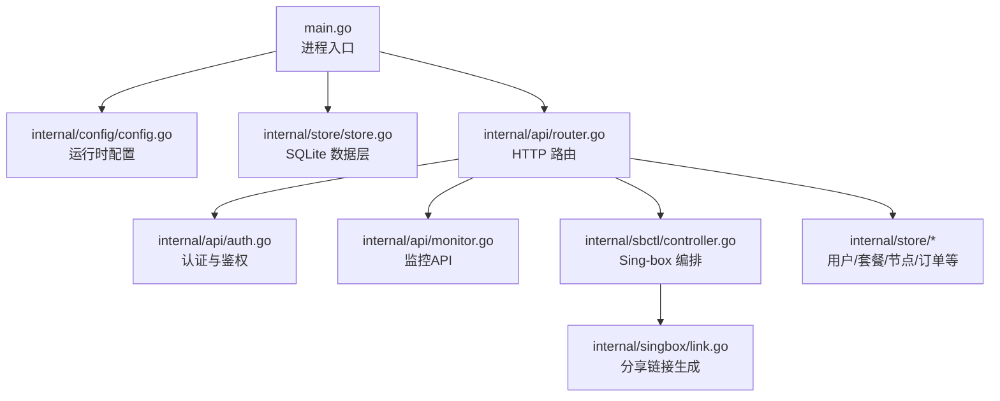
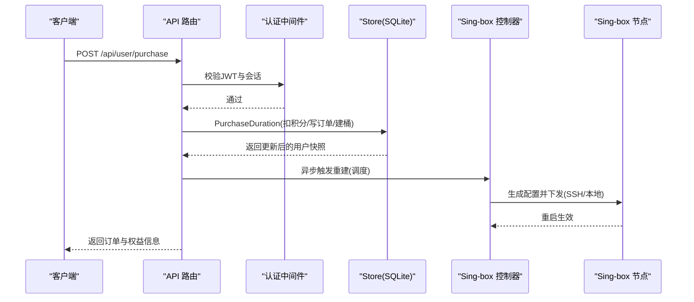
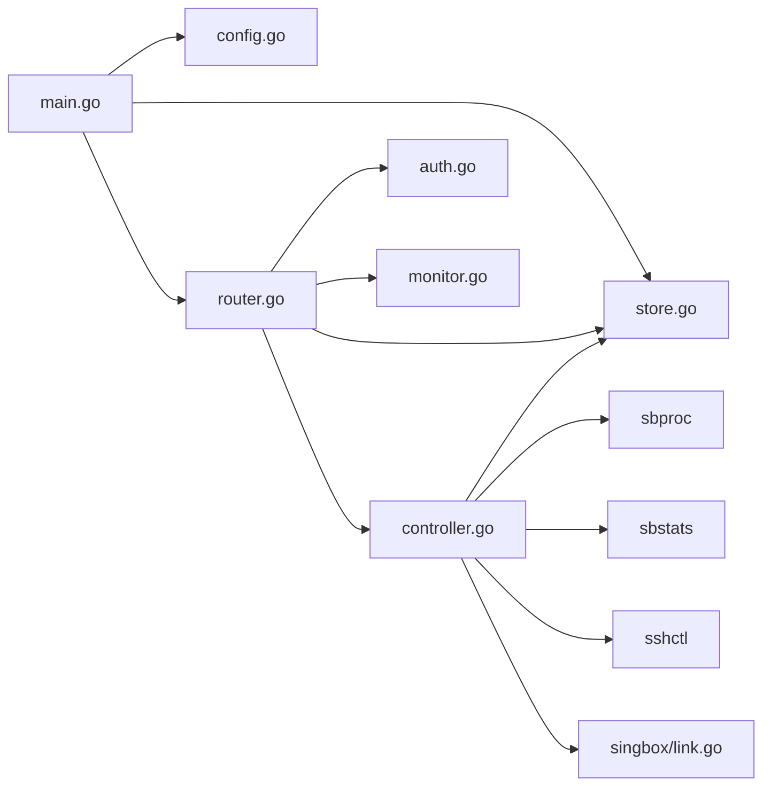

# 核心模块

<cite>
**本文引用的文件**
- [main.go](file://main.go)
- [config.go](file://internal/config/config.go)
- [router.go](file://internal/api/router.go)
- [store.go](file://internal/store/store.go)
- [users.go](file://internal/store/users.go)
- [packages.go](file://internal/store/packages.go)
- [nodes.go](file://internal/store/nodes.go)
- [purchase.go](file://internal/store/purchase.go)
- [auth.go](file://internal/api/auth.go)
- [monitor.go](file://internal/api/monitor.go)
- [controller.go](file://internal/sbctl/controller.go)
- [link.go](file://internal/singbox/link.go)
</cite>

## 目录
1. [简介](#简介)
2. [项目结构](#项目结构)
3. [核心组件](#核心组件)
4. [架构总览](#架构总览)
5. [详细组件分析](#详细组件分析)
6. [依赖关系分析](#依赖关系分析)
7. [性能考量](#性能考量)
8. [故障排查指南](#故障排查指南)
9. [结论](#结论)
10. [附录](#附录)

## 简介
本文件面向轻舟面板的核心模块，系统性梳理用户管理、套餐订单、节点集群管理、监控系统、Sing-box 集成等模块的职责边界、接口定义、数据模型与业务逻辑；解释模块间依赖与通信机制；提供配置选项、使用示例、错误处理策略与性能优化建议；并为扩展与定制提供指导。内容兼顾初学者理解与高级开发者深入细节的需求。

## 项目结构
轻舟面板采用“入口 + API路由 + 存储层 + 领域模块”的分层组织：
- 入口 main.go：加载配置、打开数据库、初始化邮件与 sing-box 控制器、启动后台任务与 HTTP 服务。
- API 路由 router.go：集中注册公开、认证、管理员三类接口，挂载中间件（请求ID、恢复、压缩、超时、限流）。
- 存储层 store：基于 SQLite 的数据访问封装，包含用户、套餐、节点、订单、指标等持久化能力。
- 领域模块：
  - 认证鉴权 auth.go：JWT 签发与校验、会话管理、权限中间件。
  - 监控 monitor.go：探针上报、指标聚合、告警、热力图。
  - Sing-box 集成 sbctl/controller.go：配置生成、下发、统计采集、多服务器并发应用。
  - 订阅链接生成 singbox/link.go：多种协议分享链接渲染。

图表来源
- [main.go:25-142](file://main.go#L25-L142)
- [router.go:132-387](file://internal/api/router.go#L132-L387)
- [store.go:27-57](file://internal/store/store.go#L27-L57)

章节来源
- [main.go:25-142](file://main.go#L25-L142)
- [router.go:132-387](file://internal/api/router.go#L132-L387)
- [store.go:27-57](file://internal/store/store.go#L27-L57)

## 核心组件
- 配置与启动：通过环境变量覆盖监听地址、数据库路径、管理员账号等；启动后自动执行数据库迁移与种子数据，设置加密密钥，构建邮件与 sing-box 控制器，启动定时任务与 HTTP 服务。
- API 路由：按公开、认证、管理员分组注册接口；内置请求大小限制、压缩、超时与重试友好的限流器。
- 存储层：WAL 模式、连接池、设置缓存、事务一致性保障；提供用户、套餐、节点、订单、指标等 CRUD 与聚合查询。
- 认证鉴权：JWT 令牌+会话表，支持按 IP 的登录限流；管理员角色校验。
- 监控：探针上报、指标写入、在线状态判定、告警、热力图与公共仪表盘。
- Sing-box 集成：周期采集流量、生成配置、校验并下发到本地或远程服务器；支持多服务器并发应用与失败记录。
- 订阅链接：根据入站参数生成 vless/trojan/tuic/hysteria2/vmess/shadowsocks/anytls/hysteria 等分享链接，携带传输、TLS、Reality、Mux/TFO/MPTCP、UDP 限制等参数。

章节来源
- [main.go:25-142](file://main.go#L25-L142)
- [router.go:132-387](file://internal/api/router.go#L132-L387)
- [store.go:27-57](file://internal/store/store.go#L27-L57)
- [auth.go:179-213](file://internal/api/auth.go#L179-L213)
- [monitor.go:22-55](file://internal/api/monitor.go#L22-L55)
- [controller.go:357-455](file://internal/sbctl/controller.go#L357-L455)
- [link.go:206-418](file://internal/singbox/link.go#L206-L418)

## 架构总览
系统以 HTTP API 为对外入口，内部通过 Store 访问 SQLite；Sing-box 控制器负责将用户授权映射为 sing-box 配置并下发到本机或远程节点；监控系统通过探针上报指标，API 暴露管理与公共视图；认证模块保护受保护接口。

图表来源
- [router.go:177-208](file://internal/api/router.go#L177-L208)
- [auth.go:179-213](file://internal/api/auth.go#L179-L213)
- [purchase.go:61-250](file://internal/store/purchase.go#L61-L250)
- [controller.go:357-455](file://internal/sbctl/controller.go#L357-L455)

## 详细组件分析

### 用户管理模块
职责边界
- 用户生命周期：创建、查询、更新、删除；邮箱绑定与验证；凭据重置冷却；订阅令牌轮换；节点凭据轮换。
- 权限与额度：管理员手动额度授予；用量累计与过期控制；设备数与流量上限。

关键数据模型
- User：包含身份、角色、状态、积分、流量限额、已用上下行、到期时间、最近在线、凭据重置时间等。
- NewUser：用于创建用户的输入字段集合。

主要接口与流程
- 创建用户：插入 users 表，默认角色 user，状态 active，填充子令牌与限额。
- 设置订阅令牌：首次为空时赋予；轮换仅改地址不吊销节点链接。
- 轮换节点凭据：在事务中更新用户与计划桶的 uuid/secret，并固定代理密码，避免旧链接继续工作；带冷却期防止频繁重启导致全量断连。
- 删除用户：级联清理会话、邮箱令牌、禁用节点、设备附加、公告阅读、计划桶、流量样本、日汇总等。

错误处理
- 凭据重置冷却：返回特定错误，避免并发绕过。
- 用户不存在：明确区分未找到与冷却中。

性能与一致性
- 使用事务保证批量更新原子性；冷读设置缓存减少热点读取压力。

章节来源
- [users.go:22-51](file://internal/store/users.go#L22-L51)
- [users.go:105-121](file://internal/store/users.go#L105-L121)
- [users.go:132-165](file://internal/store/users.go#L132-L165)
- [users.go:167-296](file://internal/store/users.go#L167-L296)
- [users.go:347-380](file://internal/store/users.go#L347-L380)

### 套餐订单模块
职责边界
- 商品管理：类型（流量/计划/设备）、价格、流量、库存、排序、启用状态、可选时长。
- 购买流程：幂等键防重、库存扣减、积分扣除、订单写入、桶模型授予、同步 sing-box。
- 退款：按比例或全额退款，撤销桶贡献，保持审计流水。

关键数据模型
- Package：含名称、描述、亮点、价格、流量、设备增量、时长、选项、库存、排序、启用、创建时间等。
- Order：订单快照、价格、状态、退款信息与比例。

主要接口与流程
- 购买：校验商品可用性与用户组权限，检查积分与库存，写入订单与流水，授予桶或流量池，重新计算用户聚合，调用外部同步回调。
- 管理员分配：零积分发放，同样走桶模型与聚合重算。
- 退款：计算退款金额与流量回退，标记订单为 refunded，撤销桶贡献，重新计算聚合。

错误处理
- 商品下架、库存不足、用户组限制、积分不足、订单不存在、重复退款等错误均有明确语义。

性能与一致性
- 事务内完成所有财务与权益变更；BEGIN IMMEDIATE 降低快照冲突；幂等键避免重复计费。

章节来源
- [packages.go:17-41](file://internal/store/packages.go#L17-L41)
- [packages.go:171-193](file://internal/store/packages.go#L171-L193)
- [packages.go:247-286](file://internal/store/packages.go#L247-L286)
- [purchase.go:61-250](file://internal/store/purchase.go#L61-L250)
- [purchase.go:423-567](file://internal/store/purchase.go#L423-L567)
- [shop.go:11-94](file://internal/api/shop.go#L11-L94)

### 节点集群管理模块
职责边界
- 节点管理：自建与外部节点、协议、入站标签、分享链接、来源、启用状态、排序。
- 节点分组：节点与分组关联、计划与分组绑定、用户可访问分组计算。
- 来源同步：拉取外部节点列表，替换并记录结果。

关键数据模型
- Node：节点基本信息与分组。
- NodeGroup：分组元数据。
- NodeSource：来源 URL、类型、启用、抓取结果与错误。

主要接口与流程
- 增删改查节点与分组；设置节点分组；获取可访问分组；按分组查询节点；来源抓取与替换。
- 订阅备注：自建节点的入站标签映射到显示名称，便于客户端识别。

错误处理
- 删除分组时清理成员与计划绑定，避免孤儿数据；来源删除时清理节点组成员。

性能与一致性
- 分组与节点查询使用聚合与去重；来源替换在事务中清空再插入，避免无限增长。

章节来源
- [nodes.go:11-23](file://internal/store/nodes.go#L11-L23)
- [nodes.go:40-70](file://internal/store/nodes.go#L40-L70)
- [nodes.go:162-235](file://internal/store/nodes.go#L162-L235)
- [nodes.go:237-286](file://internal/store/nodes.go#L237-L286)
- [nodes.go:292-326](file://internal/store/nodes.go#L292-L326)
- [nodes.go:403-547](file://internal/store/nodes.go#L403-L547)

### 监控系统模块
职责边界
- 探针上报：接收探针指标，更新在线状态。
- 指标聚合：最新指标查询、历史范围查询、热力图矩阵、公共迷你图。
- 告警：未读计数、标记已读。

关键数据模型
- ServerMetrics：CPU、内存、磁盘、网络等指标。
- ServerAlert：告警条目。

主要接口与流程
- 上报：鉴权 token 校验，写入指标，更新最后可见时间与在线状态。
- 管理端：仪表盘统计、服务器列表、指标曲线、热力图、告警列表。
- 公共端：无需认证的服务器状态与迷你图。

错误处理
- 无效 token、格式错误、写入失败、查询失败均返回明确错误码与信息。

性能与一致性
- 批量查询最新指标；热力图按时间桶聚合，减少前端渲染压力。

章节来源
- [monitor.go:22-55](file://internal/api/monitor.go#L22-L55)
- [monitor.go:183-241](file://internal/api/monitor.go#L183-L241)
- [monitor.go:323-360](file://internal/api/monitor.go#L323-L360)
- [monitor.go:375-428](file://internal/api/monitor.go#L375-L428)
- [monitor.go:430-526](file://internal/api/monitor.go#L430-L526)
- [monitor.go:541-647](file://internal/api/monitor.go#L541-L647)

### Sing-box 集成模块
职责边界
- 配置生成：根据用户授权与入站配置生成 sing-box JSON。
- 配置下发：本地直接写入并重启 systemd；远程通过 SSH 下发。
- 统计采集：从本地与远程节点采集用户流量，累积到用户用量。
- 版本探测：探测节点 sing-box 版本与 v2ray_api 插件支持。

关键数据模型
- Controller：协调 Store、Applier、StatsFetcher、RemoteManager。
- Applier：Apply(config) 接口。
- StatsFetcher：QueryUserTraffic(ctx) 接口。

主要接口与流程
- Rebuild：串行化执行，生成配置并应用到本地与远程节点；记录每台机器状态。
- CollectStats：并发采集各节点流量，合并后批量写入。
- Run：周期循环，先采集统计再重建，确保超配额用户及时下线。
- 本地应用：校验配置、写入临时文件、systemctl 重启，跟踪失败重试。

错误处理
- 配置校验失败、SSH 下发失败、远程不可达等错误被记录并影响后续 UI 展示；能力探测失败缓存以避免持续打扰。

性能与一致性
- 并发应用远程节点；单次重建持有锁但远程操作并行；统计采集一次性批量提交；能力探测缓存 TTL。

章节来源
- [controller.go:60-141](file://internal/sbctl/controller.go#L60-L141)
- [controller.go:204-280](file://internal/sbctl/controller.go#L204-L280)
- [controller.go:357-455](file://internal/sbctl/controller.go#L357-L455)
- [controller.go:548-649](file://internal/sbctl/controller.go#L548-L649)
- [controller.go:661-699](file://internal/sbctl/controller.go#L661-L699)

### 订阅链接生成
职责边界
- 根据入站参数生成多种协议的分享链接，包括 TLS、Reality、传输方式、Mux/TFO/MPTCP、UDP 限制等。

关键数据模型
- LinkParams：协议类型、主机端口、UUID/密码、TLS/SNI/Reality、传输、调优、UDP 限制等。

主要接口与流程
- BuildShareLink：根据协议分支拼接 URI，附带安全与调优参数；对 vmess 使用 JSON 编码；对 shadowsocks 使用 SIP002 格式。

错误处理
- 缺少主机或端口时返回空链接；IPv6 地址正确括起；未知协议返回空。

章节来源
- [link.go:12-113](file://internal/singbox/link.go#L12-L113)
- [link.go:206-418](file://internal/singbox/link.go#L206-L418)

## 依赖关系分析
- main.go 依赖 config、store、api、sbctl、sbproc、sbstats、singbox、sshctl、mailer。
- api/router.go 依赖 chi 路由、中间件、frontend、assets、mail、sbctl、updater、store。
- store 模块被 api 与 sbctl 共同依赖，作为唯一数据源。
- sbctl 依赖 store、sbproc、sbstats、sshctl、singbox、sbver。
- 认证模块依赖 idgen、auth、store。
- 监控模块依赖 idgen、store。

图表来源
- [main.go:14-23](file://main.go#L14-L23)
- [router.go:1-19](file://internal/api/router.go#L1-L19)
- [controller.go:14-34](file://internal/sbctl/controller.go#L14-L34)

章节来源
- [main.go:14-23](file://main.go#L14-L23)
- [router.go:1-19](file://internal/api/router.go#L1-L19)
- [controller.go:14-34](file://internal/sbctl/controller.go#L14-L34)

## 性能考量
- 数据库：WAL 模式、连接池、设置缓存、批量写入；购买与退款在事务中完成，避免竞态。
- API：请求体大小限制、gzip 压缩、超时与恢复中间件；登录与探针上报限流。
- 监控：指标按时间桶聚合，减少前端渲染；公共接口无认证开销。
- Sing-box：并发下发远程节点；能力探测缓存；周期采集与重建分离。
- 链接生成：字符串拼接与参数过滤，避免多余字段；IPv6 正确处理。

[本节为通用性能建议，不直接分析具体文件]

## 故障排查指南
- 登录失败：检查 JWT 与会话有效性；确认未被封禁；查看登录限流是否触发。
- 购买失败：核对商品状态、库存、用户组权限、积分余额；关注幂等键与并发重试。
- 节点配置下发失败：查看本地/远程应用日志；确认 sing-box 二进制与 systemd unit；检查 SSH 连接与 host key。
- 监控离线：确认探针安装与环境变量；检查上报 token 与服务状态；查看指标写入与最后可见时间。
- 订阅链接异常：检查入站 TLS/Reality/传输参数；确认 IPv6 地址格式；核对 UDP 限制标志。

章节来源
- [auth.go:112-149](file://internal/api/auth.go#L112-L149)
- [shop.go:31-94](file://internal/api/shop.go#L31-L94)
- [controller.go:204-280](file://internal/sbctl/controller.go#L204-L280)
- [monitor.go:22-55](file://internal/api/monitor.go#L22-L55)
- [link.go:182-204](file://internal/singbox/link.go#L182-L204)

## 结论
轻舟面板通过清晰的分层与模块化设计，实现了用户管理、套餐订单、节点集群、监控与 Sing-box 集成的完整闭环。Store 作为单一数据源保证一致性；API 路由提供统一入口；Sing-box 控制器实现配置生成与下发；监控系统提供可视化与告警。整体具备高可用性、可扩展性与易维护性，适合中小规模部署与快速迭代。

[本节为总结性内容，不直接分析具体文件]

## 附录

### 配置选项与环境变量
- QZ_LISTEN：监听地址，默认 0.0.0.0:8081。
- QZ_DB：数据库路径，默认 qingzhou.db。
- QZ_ADMIN_USER/QZ_ADMIN_PASS：初始管理员账号与密码（留空则首次运行生成随机密码）。
- QZ_SECRET_KEY：敏感设置加密密钥，建议独立于 DB 设置。
- QZ_SINGBOX_CONFIG/QZ_SINGBOX_V2RAY/QZ_SINGBOX_UNIT：sing-box 配置路径、v2ray_api 监听、systemd unit。
- QZ_SINGBOX_STATS_INTERVAL：统计采集间隔，默认 1 分钟。
- QZ_PROBE_DIR：探针二进制目录，默认 cmd/probe/dist。
- QZ_UPDATE_REPO/QZ_UPDATE_GITHUB_TOKEN：自更新源与 GitHub Token。

章节来源
- [config.go:14-29](file://internal/config/config.go#L14-L29)
- [main.go:174-217](file://main.go#L174-L217)
- [monitor.go:65-73](file://internal/api/monitor.go#L65-L73)

### 使用示例
- 购买套餐：POST /api/user/purchase，body 包含 package_id、duration_days、idempotency_key。
- 查看套餐：GET /api/user/packages。
- 查看订单：GET /api/user/orders。
- 查看积分：GET /api/user/points。
- 探针上报：POST /api/monitor/report，Authorization: Bearer <token>。
- 下载探针：GET /api/monitor/agent/{arch}。
- 安装脚本：GET /api/monitor/install.sh。

章节来源
- [shop.go:11-94](file://internal/api/shop.go#L11-L94)
- [monitor.go:22-73](file://internal/api/monitor.go#L22-L73)

### 扩展与定制指导
- 新增 API：在 router.go 中添加路由与处理器，遵循现有分组与中间件。
- 新增存储实体：在 store 下新建文件，定义模型与 CRUD，必要时加入事务与索引。
- 扩展 Sing-box 协议：在 link.go 中增加协议分支与参数处理；在 controller.go 中确保配置生成与校验兼容。
- 监控扩展：在 monitor.go 中增加新的指标维度与可视化；在 store 中持久化新字段。
- 安全加固：严格校验输入、限制请求体大小、启用 HTTPS、最小权限原则。

[本节为通用扩展建议，不直接分析具体文件]
