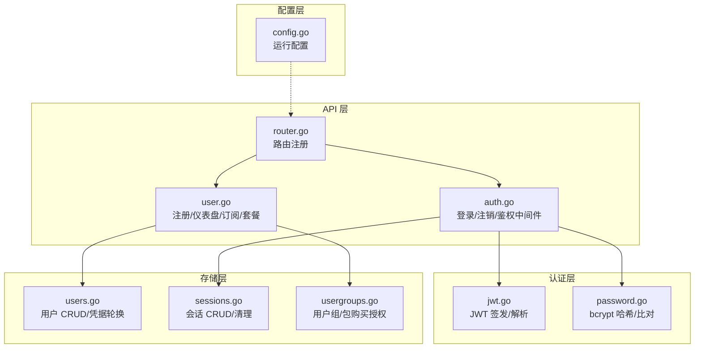
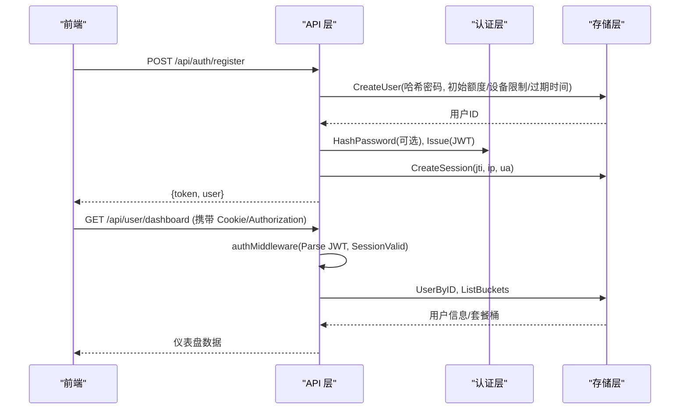
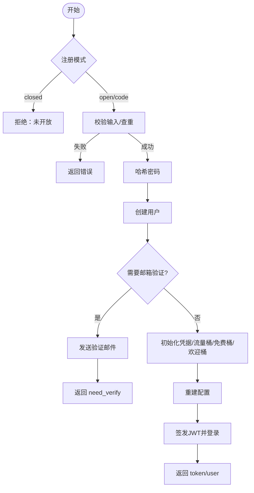
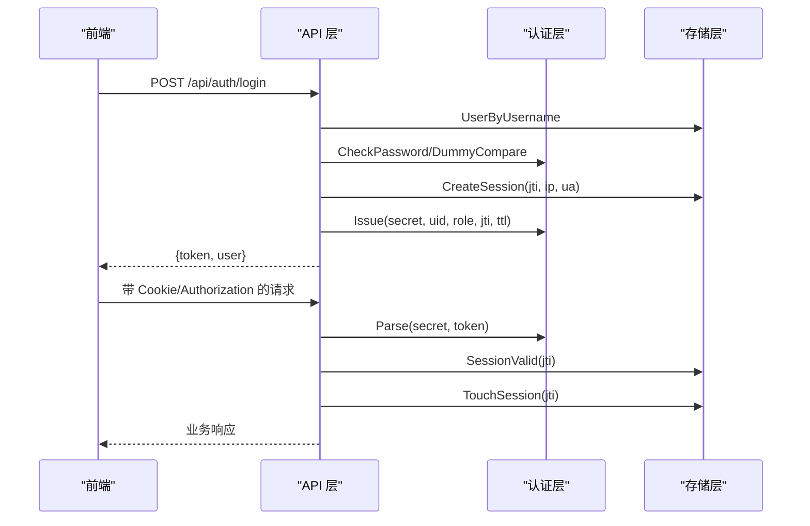
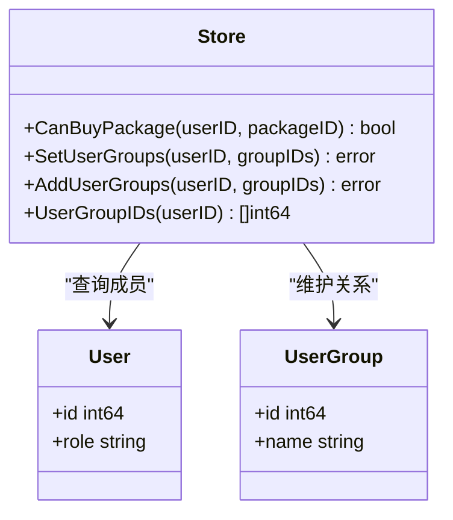
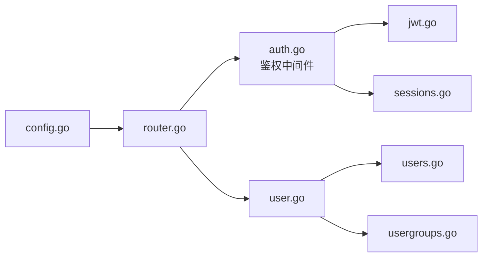

# 用户管理模块

<cite>
**本文引用的文件**
- [internal/api/auth.go](file://internal/api/auth.go)
- [internal/api/user.go](file://internal/api/user.go)
- [internal/api/router.go](file://internal/api/router.go)
- [internal/auth/jwt.go](file://internal/auth/jwt.go)
- [internal/auth/password.go](file://internal/auth/password.go)
- [internal/store/users.go](file://internal/store/users.go)
- [internal/store/sessions.go](file://internal/store/sessions.go)
- [internal/store/usergroups.go](file://internal/store/usergroups.go)
- [internal/config/config.go](file://internal/config/config.go)
</cite>

## 目录
1. [简介](#简介)
2. [项目结构](#项目结构)
3. [核心组件](#核心组件)
4. [架构总览](#架构总览)
5. [详细组件分析](#详细组件分析)
6. [依赖关系分析](#依赖关系分析)
7. [性能考量](#性能考量)
8. [故障排查指南](#故障排查指南)
9. [结论](#结论)
10. [附录：API 接口说明](#附录api-接口说明)

## 简介
本模块提供完整的用户管理能力，覆盖注册、登录认证、会话管理与权限控制。重点包括：
- JWT 令牌签发与校验机制（含会话绑定与撤销）
- 密码的 bcrypt 加密存储与防枚举时序攻击
- 用户会话生命周期管理（创建、续期、登出、批量撤销）
- 基于角色与用户组的权限体系（管理员/普通用户、购买套餐的组授权）
- 用户数据模型设计、字段定义与业务规则
- 面向开发者的扩展建议与最佳实践

## 项目结构
用户管理相关代码主要分布在以下层次：
- API 层：路由注册、请求处理、鉴权中间件、响应封装
- 认证层：JWT 签发/解析、密码哈希/比对
- 存储层：用户、会话、用户组等持久化操作
- 配置层：运行时配置加载

图表来源
- [internal/api/router.go:132-386](file://internal/api/router.go#L132-L386)
- [internal/api/auth.go:179-213](file://internal/api/auth.go#L179-L213)
- [internal/api/user.go:25-173](file://internal/api/user.go#L25-L173)
- [internal/auth/jwt.go:16-42](file://internal/auth/jwt.go#L16-L42)
- [internal/auth/password.go:5-23](file://internal/auth/password.go#L5-L23)
- [internal/store/users.go:22-51](file://internal/store/users.go#L22-L51)
- [internal/store/sessions.go:15-36](file://internal/store/sessions.go#L15-L36)
- [internal/store/usergroups.go:300-323](file://internal/store/usergroups.go#L300-L323)
- [internal/config/config.go:14-28](file://internal/config/config.go#L14-L28)

章节来源
- [internal/api/router.go:132-386](file://internal/api/router.go#L132-L386)
- [internal/config/config.go:14-28](file://internal/config/config.go#L14-L28)

## 核心组件
- 认证中间件：从 Cookie 或 Authorization 头提取 JWT，校验签名与有效期，并检查会话是否仍有效；将用户 ID、角色、JTI 注入上下文，供后续处理器使用。
- 登录/注册：注册支持开放/邀请码/关闭三种模式，可选邮箱验证；登录采用用户名+密码校验，封禁状态拦截；成功后签发 JWT 并写入 Cookie。
- 会话管理：每次登录生成唯一 JTI，记录设备指纹（IP + UA），支持按 JTI 删除、按设备去重、过期清理、活跃时间戳更新。
- 权限控制：基于角色的访问控制（RBAC），仅 admin 可访问管理端点；基于用户组的购买授权控制（CanBuyPackage）。
- 密码安全：bcrypt 默认强度哈希；登录失败时对不存在用户也进行等价耗时比较，防止枚举。
- JWT 机制：HS256 签名，包含用户 ID、角色、签发时间、过期时间与 JTI；通过会话存在性实现“远程登出/撤销”。

章节来源
- [internal/api/auth.go:179-213](file://internal/api/auth.go#L179-L213)
- [internal/api/auth.go:112-149](file://internal/api/auth.go#L112-L149)
- [internal/api/user.go:25-173](file://internal/api/user.go#L25-L173)
- [internal/store/sessions.go:15-36](file://internal/store/sessions.go#L15-L36)
- [internal/store/usergroups.go:300-323](file://internal/store/usergroups.go#L300-L323)
- [internal/auth/password.go:5-23](file://internal/auth/password.go#L5-L23)
- [internal/auth/jwt.go:16-42](file://internal/auth/jwt.go#L16-L42)

## 架构总览
下图展示了用户管理的端到端流程：从前端发起注册/登录到后端鉴权、会话建立、权限判断与资源返回。

图表来源
- [internal/api/user.go:25-173](file://internal/api/user.go#L25-L173)
- [internal/api/auth.go:112-149](file://internal/api/auth.go#L112-L149)
- [internal/api/auth.go:179-213](file://internal/api/auth.go#L179-L213)
- [internal/store/users.go:105-121](file://internal/store/users.go#L105-L121)
- [internal/store/sessions.go:15-36](file://internal/store/sessions.go#L15-L36)
- [internal/auth/jwt.go:16-42](file://internal/auth/jwt.go#L16-L42)

## 详细组件分析

### 用户数据模型与业务规则
- 用户模型关键字段
  - 身份：ID、Username、Email、EmailVerified
  - 安全：PasswordHash、Role、Status、CredsResetAt
  - 配额：TrafficLimit、DeviceLimit、UsedUp/UsedDown、ExpiryAt
  - 订阅：SubToken、ClientID/Name/UUID/Secret（节点客户端凭据）
  - 审计：CreatedAt/UpdatedAt、LastOnlineAt
- 业务规则要点
  - 新用户默认 role=user，status=active，Points 由配置决定，SubToken 用于订阅地址
  - 注册时可设置流量上限、设备数上限、到期时间；支持“免费桶”和“欢迎桶”自动初始化
  - 节点凭据轮换受冷却时间保护，避免频繁重启导致连接抖动
  - 邮箱变更会失效旧验证令牌，防止地址劫持

章节来源
- [internal/store/users.go:22-51](file://internal/store/users.go#L22-L51)
- [internal/store/users.go:105-121](file://internal/store/users.go#L105-L121)
- [internal/store/users.go:167-296](file://internal/store/users.go#L167-L296)
- [internal/store/users.go:298-328](file://internal/store/users.go#L298-L328)

### 注册流程
- 注册模式：open/code/closed，受配置控制；code 模式需预检注册码可用性，实际扣减在账户创建后原子执行
- 输入校验：用户名格式、密码长度、邮箱必填策略、重复用户名/邮箱检查
- 安全：密码 bcrypt 哈希；必要时发送验证邮件，延迟开通直到邮箱验证完成
- 资源初始化：创建用户后分配客户端凭据、流量池桶、免费桶、欢迎桶，并重建 sing-box 配置

图表来源
- [internal/api/user.go:25-173](file://internal/api/user.go#L25-L173)
- [internal/auth/password.go:5-12](file://internal/auth/password.go#L5-L12)

章节来源
- [internal/api/user.go:25-173](file://internal/api/user.go#L25-L173)
- [internal/auth/password.go:5-12](file://internal/auth/password.go#L5-L12)

### 登录认证与会话管理
- 登录流程
  - 校验用户名是否存在（防枚举：对不存在用户也执行等价耗时比较）
  - 校验密码、封禁状态
  - 创建会话（去重同一设备的多次登录）、签发 JWT（绑定 jti）、写入 Cookie
- 鉴权中间件
  - 从 Cookie 或 Authorization 头读取 Token
  - 解析并校验签名、过期时间
  - 校验会话仍存在（支持远程登出/撤销）
  - 更新 last_seen（节流至每分钟一次）
  - 将用户 ID、角色、jti 注入上下文
- 会话生命周期
  - 创建：登录时插入，按 IP+UA 合并
  - 续期：TouchSession 每请求最多每分钟更新一次
  - 登出：删除当前 jti 对应会话，清空 Cookie
  - 清理：定期删除过期与会话长时间不活跃的记录

图表来源
- [internal/api/auth.go:112-149](file://internal/api/auth.go#L112-L149)
- [internal/api/auth.go:179-213](file://internal/api/auth.go#L179-L213)
- [internal/store/sessions.go:15-36](file://internal/store/sessions.go#L15-L36)
- [internal/auth/jwt.go:16-42](file://internal/auth/jwt.go#L16-L42)
- [internal/auth/password.go:10-23](file://internal/auth/password.go#L10-L23)

章节来源
- [internal/api/auth.go:112-149](file://internal/api/auth.go#L112-L149)
- [internal/api/auth.go:179-213](file://internal/api/auth.go#L179-L213)
- [internal/store/sessions.go:15-36](file://internal/store/sessions.go#L15-L36)
- [internal/auth/jwt.go:16-42](file://internal/auth/jwt.go#L16-L42)
- [internal/auth/password.go:10-23](file://internal/auth/password.go#L10-L23)

### 权限控制与用户组
- 角色控制：admin 中间件确保只有管理员可访问管理端点
- 购买授权：通过用户组与包的绑定关系控制哪些用户可以购买某套餐；无绑定的包为公开可买
- 注册码授权：注册码可授予用户组，从而解锁特定套餐购买资格

图表来源
- [internal/store/usergroups.go:300-323](file://internal/store/usergroups.go#L300-L323)
- [internal/store/usergroups.go:121-180](file://internal/store/usergroups.go#L121-L180)
- [internal/api/auth.go:204-213](file://internal/api/auth.go#L204-L213)

章节来源
- [internal/store/usergroups.go:300-323](file://internal/store/usergroups.go#L300-L323)
- [internal/api/auth.go:204-213](file://internal/api/auth.go#L204-L213)

### JWT 令牌生成与验证
- 签发：包含用户 ID、角色、签发时间、过期时间、jti；HS256 签名
- 验证：强制 HMAC 算法、校验签名与有效期；结合会话存在性实现“即时撤销”
- 会话绑定：每个登录生成唯一 jti，登出即删除该 jti 对应会话，使令牌立即失效

章节来源
- [internal/auth/jwt.go:16-42](file://internal/auth/jwt.go#L16-L42)
- [internal/api/auth.go:179-213](file://internal/api/auth.go#L179-L213)
- [internal/store/sessions.go:25-36](file://internal/store/sessions.go#L25-L36)

### 密码加密存储策略
- 使用 bcrypt 默认成本因子进行哈希存储
- 登录失败路径对不存在用户执行 dummy 比较，避免侧信道泄露用户名存在性

章节来源
- [internal/auth/password.go:5-23](file://internal/auth/password.go#L5-L23)

### 用户会话的生命周期管理
- 创建：登录时插入，同设备（IP+UA）合并
- 续期：TouchSession 限频更新 last_seen
- 登出：按 jti 删除；支持批量撤销（保留当前会话）
- 清理：定期删除过期与会话长时间不活跃的记录

章节来源
- [internal/store/sessions.go:15-36](file://internal/store/sessions.go#L15-L36)
- [internal/store/sessions.go:56-133](file://internal/store/sessions.go#L56-L133)

## 依赖关系分析
- API 层依赖认证层进行 JWT 与密码处理，依赖存储层进行用户与会话读写
- 路由层集中注册所有接口，并通过中间件统一鉴权与限流
- 配置层提供监听地址、数据库路径、管理员初始凭据等运行参数

图表来源
- [internal/api/router.go:132-386](file://internal/api/router.go#L132-L386)
- [internal/api/auth.go:179-213](file://internal/api/auth.go#L179-L213)
- [internal/api/user.go:25-173](file://internal/api/user.go#L25-L173)
- [internal/store/users.go:22-51](file://internal/store/users.go#L22-L51)
- [internal/store/usergroups.go:300-323](file://internal/store/usergroups.go#L300-L323)
- [internal/config/config.go:14-28](file://internal/config/config.go#L14-L28)

章节来源
- [internal/api/router.go:132-386](file://internal/api/router.go#L132-L386)
- [internal/config/config.go:14-28](file://internal/config/config.go#L14-L28)

## 性能考量
- 登录防枚举：对不存在用户执行 dummy 比较，保持响应时间一致
- 会话续期节流：TouchSession 每分钟最多更新一次，降低写放大
- 订阅链接缓存：用户订阅链接短期缓存，减少重复计算
- 配置重建异步：sing-box 配置重建走调度队列，避免阻塞 HTTP 响应
- 速率限制：认证、重发验证、订阅地址更换等关键路径均有限流保护

[本节为通用性能讨论，不直接分析具体文件]

## 故障排查指南
- 登录失败
  - 检查用户名/密码是否正确；被封禁账号会被拒绝
  - 若提示“服务器错误”，检查数据库与哈希生成逻辑
- 令牌无效/过期
  - 检查 JWT 签名密钥与过期时间；确认会话未被撤销
  - 检查 Cookie 或 Authorization 头是否正确传递
- 会话异常
  - 检查 sessions 表是否有重复条目；确认 IP/UA 收集正确
  - 清理过期与会话长时间不活跃的记录
- 权限不足
  - 非 admin 访问管理端点将被拒绝；确认角色字段正确
- 注册码问题
  - code 模式下，预检可用但实际扣减失败会导致注册回滚；重试即可

章节来源
- [internal/api/auth.go:112-149](file://internal/api/auth.go#L112-L149)
- [internal/api/auth.go:179-213](file://internal/api/auth.go#L179-L213)
- [internal/store/sessions.go:56-133](file://internal/store/sessions.go#L56-L133)
- [internal/api/user.go:25-173](file://internal/api/user.go#L25-L173)

## 结论
本模块以 JWT + 会话绑定为核心，实现了安全的登录认证与细粒度的权限控制。通过 bcrypt 密码哈希、防枚举时序保护、会话去重与清理、以及用户组驱动的购买授权，构建了稳健的用户管理体系。配合异步配置重建与多路径限流，兼顾了安全性与可用性。开发者可在现有基础上扩展更多认证方式、细化权限粒度或增强审计能力。

[本节为总结性内容，不直接分析具体文件]

## 附录：API 接口说明

### 公共接口
- GET /api/health
  - 描述：健康检查
  - 响应：{ status, time, version }
- GET /api/config
  - 描述：站点配置（注册模式、是否需要邮箱验证、积分汇率、站点名称/描述、首页模式/URL、应用版本）
  - 响应：{ register_mode, registration_open, email_verify_required, points_per_cny, site_name, site_description, homepage_mode, homepage_url, app_version }
- GET /api/auth/verify?token=...
  - 描述：邮箱验证回调
  - 响应：根据实现返回验证结果
- GET /sub/{token}
  - 描述：订阅下载（base64/clash/singbox/surge）
  - 响应：订阅内容或空列表（根据用户状态与配额）

章节来源
- [internal/api/router.go:149-175](file://internal/api/router.go#L149-L175)
- [internal/api/auth.go:67-110](file://internal/api/auth.go#L67-L110)
- [internal/api/user.go:772-800](file://internal/api/user.go#L772-L800)

### 认证接口
- POST /api/auth/login
  - 请求体：{ username, password }
  - 响应：{ token, user }
  - 错误：请求格式错误、服务器错误、用户名或密码错误、账号已被封禁
- POST /api/auth/register
  - 请求体：{ username, email, password, code }
  - 行为：根据注册模式校验；可选邮箱验证；成功后初始化凭据与流量桶；返回 token/user 或 need_verify
  - 错误：注册未开放、请求格式错误、用户名/邮箱占用、密码过短、注册码无效、服务器错误
- POST /api/auth/forgot
  - 描述：忘记密码（发送邮件）
- POST /api/auth/reset
  - 描述：重置密码

章节来源
- [internal/api/router.go:155-162](file://internal/api/router.go#L155-L162)
- [internal/api/auth.go:112-149](file://internal/api/auth.go#L112-L149)
- [internal/api/user.go:25-173](file://internal/api/user.go#L25-L173)

### 用户接口（需登录）
- GET /api/auth/me
  - 响应：当前用户信息视图
- POST /api/auth/logout
  - 行为：删除当前会话，清空 Cookie
- GET /api/user/dashboard
  - 响应：用户名、邮箱、积分、状态、流量统计、套餐列表、到期时间
- GET /api/user/plans
  - 响应：用户套餐列表（含用量、剩余、状态、激活预估时间）
- GET /api/user/subscription
  - 响应：订阅 URL、可用格式、是否允许重置节点凭据
- PUT /api/user/proxies/{bucket}
  - 描述：设置自定义代理凭据（username/password/expires_at）
- POST /api/user/reset-sub
  - 描述：更换订阅地址（限流）
- POST /api/user/reset-node-creds
  - 描述：重置节点凭据（受冷却时间限制）
- GET /api/user/packages
  - 描述：获取可购套餐列表
- POST /api/user/purchase
  - 描述：购买套餐（受用户组授权控制）
- GET /api/user/orders
  - 描述：订单列表
- GET /api/user/points
  - 描述：积分信息
- GET /api/user/stats/traffic
  - 描述：流量统计
- POST /api/user/password
  - 描述：修改密码
- POST /api/user/resend-verify
  - 描述：重发验证邮件（限流）
- POST /api/user/email
  - 描述：绑定/更改邮箱（失效旧验证令牌）
- GET /api/user/announcements
  - 描述：公告列表
- POST /api/user/announcements/read
  - 描述：标记已读
- GET /api/user/sessions
  - 描述：列出当前用户会话
- POST /api/user/sessions/{id}/revoke
  - 描述：撤销指定会话
- GET /api/user/nodes
  - 描述：节点列表
- GET /api/user/nodes/ping
  - 描述：节点连通性测试
- POST /api/user/nodes/toggle
  - 描述：启用/禁用节点
- POST /api/user/nodes/bulk
  - 描述：批量操作节点
- POST /api/user/nodes/disable-all
  - 描述：禁用全部节点
- POST /api/user/nodes/enable-all
  - 描述：启用全部节点

章节来源
- [internal/api/router.go:177-208](file://internal/api/router.go#L177-L208)
- [internal/api/auth.go:151-177](file://internal/api/auth.go#L151-L177)
- [internal/api/user.go:285-555](file://internal/api/user.go#L285-L555)

### 管理接口（需管理员）
- 用户管理
  - GET /api/admin/users
  - POST /api/admin/users
  - PUT /api/admin/users/{id}
  - DELETE /api/admin/users/{id}
  - POST /api/admin/users/{id}/points
  - POST /api/admin/users/{id}/assign-plan
  - POST /api/admin/users/{id}/reset-node-creds
- 套餐管理
  - GET /api/admin/packages
  - POST /api/admin/packages
  - PUT /api/admin/packages/{id}
  - POST /api/admin/packages/reorder
  - POST /api/admin/packages/{id}/retire
  - POST /api/admin/packages/{id}/enable
  - DELETE /api/admin/packages/{id}
- 订单管理
  - GET /api/admin/orders
  - GET /api/admin/orders/{id}/refund-preview
  - POST /api/admin/orders/{id}/refund
  - DELETE /api/admin/orders/{id}
- 用户组管理
  - GET /api/admin/user-groups
  - POST /api/admin/user-groups
  - PUT /api/admin/user-groups/{id}
  - DELETE /api/admin/user-groups/{id}
  - GET /api/admin/user-groups/{id}/members
  - PUT /api/admin/user-groups/{id}/members
- 其他管理接口（设置、备份、节点、证书、监控等）见路由注册

章节来源
- [internal/api/router.go:210-375](file://internal/api/router.go#L210-L375)

## 扩展与定制建议
- 扩展认证方式：在鉴权中间件中增加第三方登录（如 OAuth）的解析与映射，同时保持会话绑定机制
- 细化权限：引入更细粒度的资源级权限（如按节点/套餐维度），在中间件或处理器中校验
- 审计增强：在关键操作（注册、登录、凭据轮换、套餐购买）追加审计日志，便于追踪
- 安全加固：考虑增加双因素认证、设备白名单、IP 白名单等策略
- 性能优化：对高频查询（如套餐列表、订阅生成）增加缓存层；合理调整会话清理频率

[本节为通用建议，不直接分析具体文件]
