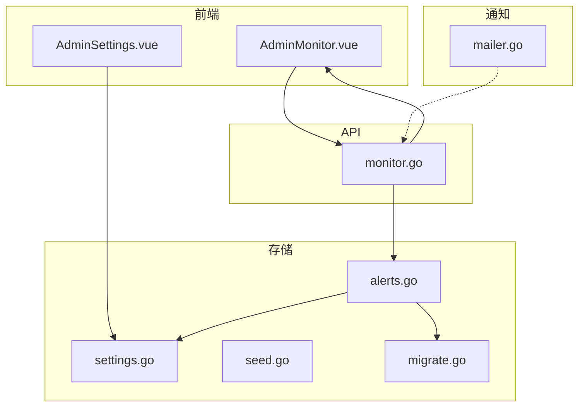
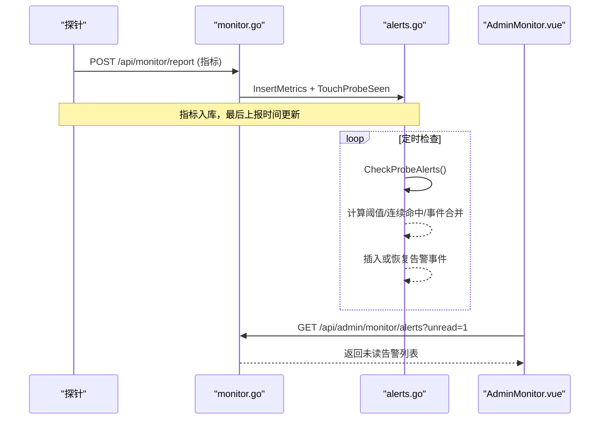
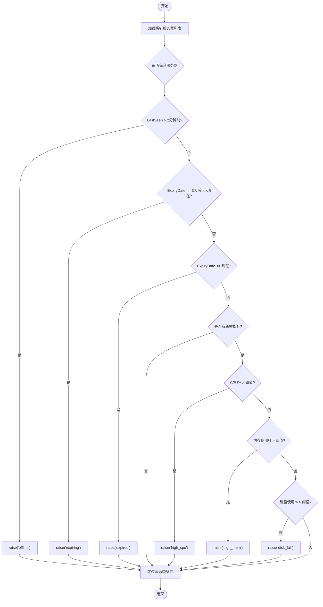
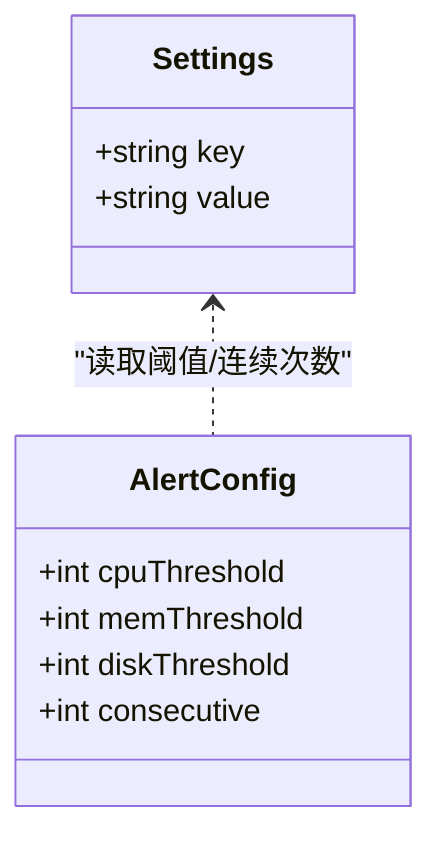
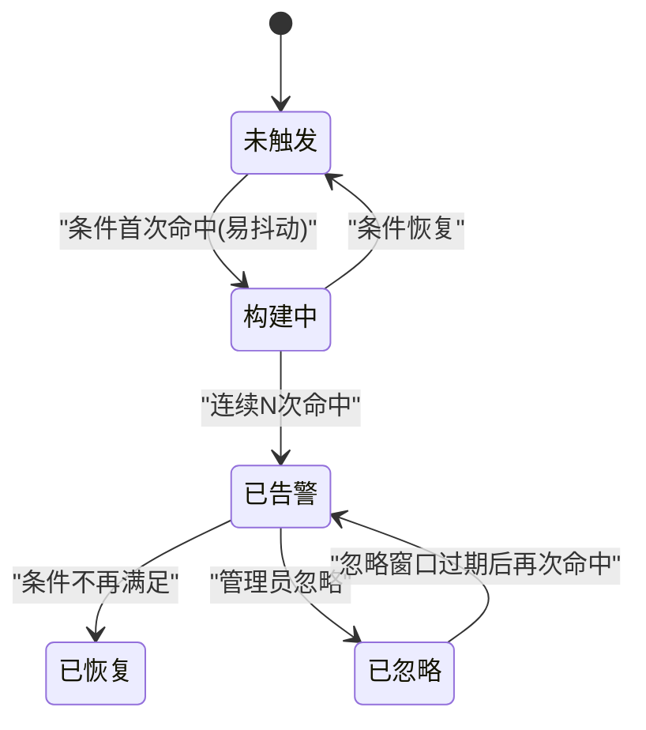
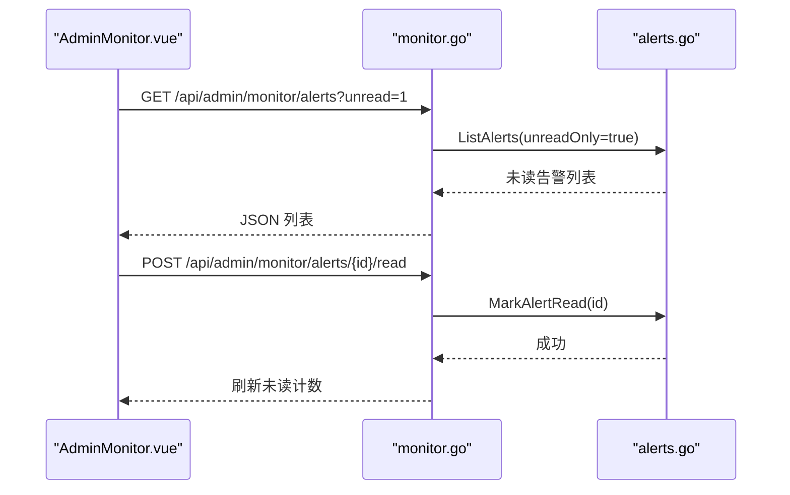
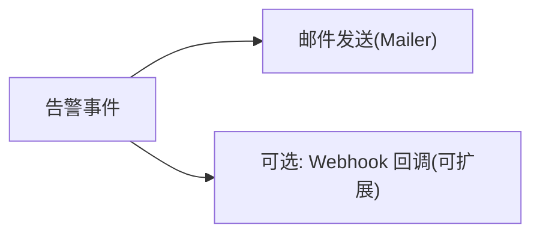
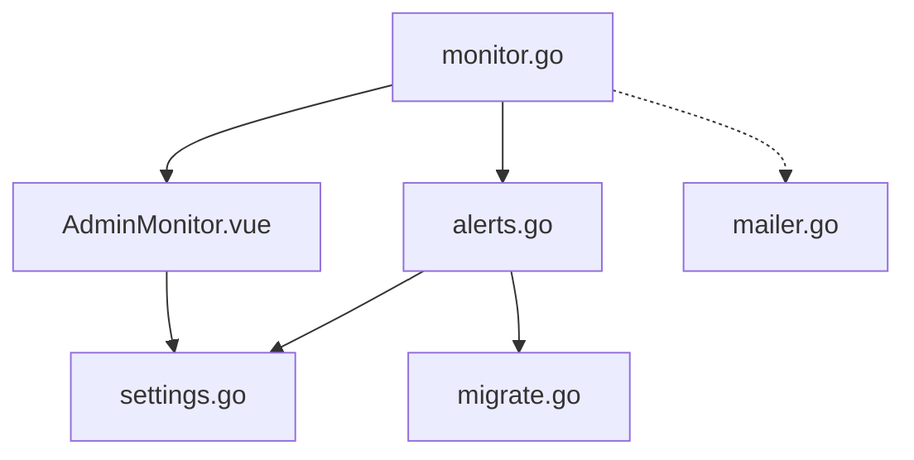

# 告警规则

<cite>
**本文引用的文件**
- [internal/store/alerts.go](file://internal/store/alerts.go)
- [internal/api/monitor.go](file://internal/api/monitor.go)
- [internal/config/config.go](file://internal/config/config.go)
- [internal/mailer/mailer.go](file://internal/mailer/mailer.go)
- [frontend/src/views/AdminMonitor.vue](file://frontend/src/views/AdminMonitor.vue)
- [frontend/src/views/AdminSettings.vue](file://frontend/src/views/AdminSettings.vue)
- [internal/store/settings.go](file://internal/store/settings.go)
- [internal/store/seed.go](file://internal/store/seed.go)
- [internal/store/migrate.go](file://internal/store/migrate.go)
</cite>

## 目录
1. [简介](#简介)
2. [项目结构](#项目结构)
3. [核心组件](#核心组件)
4. [架构总览](#架构总览)
5. [详细组件分析](#详细组件分析)
6. [依赖关系分析](#依赖关系分析)
7. [性能考量](#性能考量)
8. [故障排查指南](#故障排查指南)
9. [结论](#结论)
10. [附录](#附录)

## 简介
本系统提供服务器监控与告警能力，支持对离线、CPU/内存/磁盘高负载、即将到期与已过期等条件进行自动检测与告警。告警具备“事件化”聚合（同一问题合并为一条记录）、去重与抑制（避免告警风暴）、可配置的阈值与连续命中次数，以及历史查询与管理操作。通知渠道方面，系统内置 SMTP 邮件发送能力；Webhook 等外部集成可通过扩展实现。

## 项目结构
与告警相关的代码主要分布在以下模块：
- 存储层：负责告警数据模型、插入、查询、状态流转与阈值读取
- API 层：暴露监控面板的查询、标记已读、仪表盘汇总等接口
- 前端：展示未读告警、热力图、指标趋势，并提供阈值配置入口
- 配置与设置：通过 settings 表管理告警阈值与连续命中次数
- 邮件：提供 SMTP 邮件发送能力，可用于告警通知

图表来源
- [internal/api/monitor.go:182-402](file://internal/api/monitor.go#L182-L402)
- [internal/store/alerts.go:131-216](file://internal/store/alerts.go#L131-L216)
- [frontend/src/views/AdminMonitor.vue:60-87](file://frontend/src/views/AdminMonitor.vue#L60-L87)
- [frontend/src/views/AdminSettings.vue:217-234](file://frontend/src/views/AdminSettings.vue#L217-L234)

章节来源
- [internal/api/monitor.go:182-402](file://internal/api/monitor.go#L182-L402)
- [internal/store/alerts.go:131-216](file://internal/store/alerts.go#L131-L216)
- [frontend/src/views/AdminMonitor.vue:60-87](file://frontend/src/views/AdminMonitor.vue#L60-L87)
- [frontend/src/views/AdminSettings.vue:217-234](file://frontend/src/views/AdminSettings.vue#L217-L234)

## 核心组件
- 告警数据模型与生命周期：ServerAlert 表示一次“告警事件”，包含首次时间、最近时间、触发次数、是否已读、是否已恢复
- 检查器：CheckProbeAlerts 周期性评估所有探针开启的服务器，判断离线、到期、资源使用率等条件，并写入或关闭告警事件
- 去重与抑制：
  - 事件聚合：同一 server_id + type 的未读事件会合并更新 hits 与 ts，避免重复条目
  - 忽略窗口：管理员忽略后，在 reAlertWindow（24小时）内不再重复提醒
  - 抖动抑制：对于易抖动的采样型条件（offline/high_cpu/high_mem/disk_full），需要连续多次检查命中才真正告警
- 阈值与连续命中次数：
  - 阈值：alert_cpu_threshold、alert_mem_threshold、alert_disk_threshold
  - 连续命中：alert_consecutive（默认 2，范围 1-10）
- 历史查询与管理：ListAlerts、MarkAlertRead、MarkAllAlertsRead、UnreadAlertCount
- 通知渠道：SMTP 邮件发送（Mailer），可作为告警通知通道

章节来源
- [internal/store/alerts.go:10-43](file://internal/store/alerts.go#L10-L43)
- [internal/store/alerts.go:131-169](file://internal/store/alerts.go#L131-L169)
- [internal/store/alerts.go:218-357](file://internal/store/alerts.go#L218-L357)
- [internal/store/settings.go:110-120](file://internal/store/settings.go#L110-L120)
- [internal/mailer/mailer.go:22-58](file://internal/mailer/mailer.go#L22-L58)

## 架构总览
告警系统由“采集—评估—存储—展示—通知”构成闭环：
- 采集：探针上报指标到 /api/monitor/report
- 评估：后台定时任务调用 CheckProbeAlerts 计算当前是否满足告警条件
- 存储：将告警事件持久化到数据库，支持合并与恢复
- 展示：前端通过 /api/admin/monitor/alerts 获取未读/全部告警，并在监控页面展示
- 通知：可扩展通过 SMTP 发送邮件（当前代码提供邮件能力）

图表来源
- [internal/api/monitor.go:20-55](file://internal/api/monitor.go#L20-L55)
- [internal/store/alerts.go:247-357](file://internal/store/alerts.go#L247-L357)
- [internal/api/monitor.go:362-373](file://internal/api/monitor.go#L362-L373)
- [frontend/src/views/AdminMonitor.vue:60-87](file://frontend/src/views/AdminMonitor.vue#L60-L87)

## 详细组件分析

### 告警类型与触发条件
- 离线：LastSeen 超过 2 分钟未上报
- 即将到期：ExpiryDate 在未来 3 天内
- 已过期：ExpiryDate 小于等于当前时间
- CPU/内存/磁盘高负载：分别比较最新指标与阈值（百分比）
- 注意：仅当有“新鲜”指标（2分钟内）时，才会对 CPU/内存/磁盘进行判定；否则视为未知，不触发也不恢复这些条件（离线告警仍生效）

图表来源
- [internal/store/alerts.go:247-357](file://internal/store/alerts.go#L247-L357)

章节来源
- [internal/store/alerts.go:247-357](file://internal/store/alerts.go#L247-L357)

### 阈值与连续命中次数
- 阈值设置项：
  - alert_cpu_threshold：CPU 使用率阈值（默认 90）
  - alert_mem_threshold：内存使用率阈值（默认 90）
  - alert_disk_threshold：磁盘使用率阈值（默认 85）
- 连续命中次数：
  - alert_consecutive：对 offline/high_cpu/high_mem/disk_full 四类“易抖动”条件，需连续 N 次检查命中才真正告警（默认 2，范围 1-10）
  - 到期类告警不受连续命中影响（日期不会抖动）
- 前端设置界面提供输入框，后端通过 settings 表持久化

图表来源
- [internal/store/alerts.go:263-277](file://internal/store/alerts.go#L263-L277)
- [internal/store/settings.go:110-120](file://internal/store/settings.go#L110-L120)
- [frontend/src/views/AdminSettings.vue:217-234](file://frontend/src/views/AdminSettings.vue#L217-L234)

章节来源
- [internal/store/alerts.go:263-277](file://internal/store/alerts.go#L263-L277)
- [internal/store/settings.go:110-120](file://internal/store/settings.go#L110-L120)
- [frontend/src/views/AdminSettings.vue:217-234](file://frontend/src/views/AdminSettings.vue#L217-L234)

### 告警事件聚合、去重与抑制
- 事件聚合：同一 server_id + type 的未读事件会合并更新 hits 与 ts，保持面板中一条问题一行
- 忽略窗口：管理员忽略后，若条件持续存在，将在 24 小时内不再重复提醒
- 抖动抑制：易抖动条件需连续命中 N 次才告警；一旦条件恢复，计数器清零，下次再出现需重新计数
- 恢复机制：当条件不再满足时，ResolveAlert 关闭当前事件，后续再次出现视为新事件

图表来源
- [internal/store/alerts.go:26-43](file://internal/store/alerts.go#L26-L43)
- [internal/store/alerts.go:131-169](file://internal/store/alerts.go#L131-L169)
- [internal/store/alerts.go:294-357](file://internal/store/alerts.go#L294-L357)

章节来源
- [internal/store/alerts.go:26-43](file://internal/store/alerts.go#L26-L43)
- [internal/store/alerts.go:131-169](file://internal/store/alerts.go#L131-L169)
- [internal/store/alerts.go:294-357](file://internal/store/alerts.go#L294-L357)

### 告警历史查询与管理
- 查询未读/全部告警：GET /api/admin/monitor/alerts?unread=1
- 标记单条已读：POST /api/admin/monitor/alerts/{id}/read
- 全部忽略：POST /api/admin/monitor/alerts/read-all
- 未读数量：dashboard 中显示 alerts_unread

图表来源
- [internal/api/monitor.go:362-373](file://internal/api/monitor.go#L362-L373)
- [internal/api/monitor.go:649-665](file://internal/api/monitor.go#L649-L665)
- [internal/store/alerts.go:172-216](file://internal/store/alerts.go#L172-L216)
- [frontend/src/views/AdminMonitor.vue:386-401](file://frontend/src/views/AdminMonitor.vue#L386-L401)

章节来源
- [internal/api/monitor.go:362-373](file://internal/api/monitor.go#L362-L373)
- [internal/api/monitor.go:649-665](file://internal/api/monitor.go#L649-L665)
- [internal/store/alerts.go:172-216](file://internal/store/alerts.go#L172-L216)
- [frontend/src/views/AdminMonitor.vue:386-401](file://frontend/src/views/AdminMonitor.vue#L386-L401)

### 通知渠道集成
- 邮件：系统提供 SMTP 邮件发送能力（支持隐式 TLS 端口 465 与 STARTTLS 587/25），可用于告警通知
- Webhook：当前代码未直接实现 Webhook 告警通道，但可在 API 层扩展 HTTP 回调逻辑，复用现有告警事件数据

图表来源
- [internal/mailer/mailer.go:22-58](file://internal/mailer/mailer.go#L22-L58)

章节来源
- [internal/mailer/mailer.go:22-58](file://internal/mailer/mailer.go#L22-L58)

### 最佳实践与性能优化建议
- 合理设置阈值：根据业务基线调整 CPU/内存/磁盘阈值，避免过高导致漏报或过低导致误报
- 连续命中次数：生产环境建议设置为 2-3，平衡即时性与抗抖动
- 探针开关：关闭探针时应自动恢复相关告警，避免残留
- 定期清理：迁移脚本已将历史冗余行折叠为事件，减少面板噪音
- 指标新鲜度：确保探针稳定上报，避免长时间无数据导致无法判定资源类条件

章节来源
- [internal/store/alerts.go:284-293](file://internal/store/alerts.go#L284-L293)
- [internal/store/migrate.go:660-676](file://internal/store/migrate.go#L660-L676)

## 依赖关系分析
- API 依赖 store 层进行指标与告警数据的读写
- 告警检查器依赖 settings 表中的阈值与连续命中配置
- 前端通过 API 获取告警与指标，渲染监控面板
- 邮件模块独立，可被上层服务调用以发送告警通知

图表来源
- [internal/api/monitor.go:182-402](file://internal/api/monitor.go#L182-L402)
- [internal/store/alerts.go:247-357](file://internal/store/alerts.go#L247-L357)
- [internal/store/settings.go:110-120](file://internal/store/settings.go#L110-L120)
- [frontend/src/views/AdminMonitor.vue:60-87](file://frontend/src/views/AdminMonitor.vue#L60-L87)

章节来源
- [internal/api/monitor.go:182-402](file://internal/api/monitor.go#L182-L402)
- [internal/store/alerts.go:247-357](file://internal/store/alerts.go#L247-L357)
- [internal/store/settings.go:110-120](file://internal/store/settings.go#L110-L120)
- [frontend/src/views/AdminMonitor.vue:60-87](file://frontend/src/views/AdminMonitor.vue#L60-L87)

## 性能考量
- 指标聚合：heatmap/sparklines 采用按时间桶聚合与降采样，降低前端渲染压力
- 告警合并：同一问题合并为事件，减少数据库写入与前端展示开销
- 忽略窗口：24 小时内的重复条件不再重复提醒，减轻通知与 UI 压力
- 连续命中：避免瞬时峰值导致的频繁告警，提升稳定性
- 邮件发送：带超时保护，防止阻塞请求 goroutine

章节来源
- [internal/api/monitor.go:541-647](file://internal/api/monitor.go#L541-L647)
- [internal/store/alerts.go:131-169](file://internal/store/alerts.go#L131-L169)
- [internal/mailer/mailer.go:15-20](file://internal/mailer/mailer.go#L15-L20)

## 故障排查指南
- 探针未上报：
  - 检查探针安装与运行状态，确认 token 正确
  - 查看 /api/monitor/report 是否收到指标
- 告警未触发：
  - 检查阈值与连续命中次数设置是否合理
  - 确认指标是否“新鲜”（2分钟内）
- 告警过多：
  - 提高连续命中次数或阈值
  - 利用忽略功能暂时屏蔽噪声
- 邮件发送失败：
  - 检查 SMTP 主机、端口、认证与安全方式
  - 确认服务器网络可达且支持 STARTTLS/SSL

章节来源
- [internal/api/monitor.go:20-55](file://internal/api/monitor.go#L20-L55)
- [internal/store/alerts.go:263-277](file://internal/store/alerts.go#L263-L277)
- [internal/mailer/mailer.go:42-111](file://internal/mailer/mailer.go#L42-L111)

## 结论
本告警系统通过事件化聚合、阈值与连续命中控制、忽略窗口与抖动抑制，有效避免了告警风暴，同时提供了完善的历史查询与管理能力。结合 SMTP 邮件通知，可满足常见运维场景。未来可按需扩展 Webhook 等通知渠道，进一步提升灵活性。

## 附录

### 管理员操作说明
- 配置告警阈值与连续命中次数：
  - 进入系统设置页面，修改 CPU/内存/磁盘阈值与连续命中次数，保存后下次检查生效
- 查看与处理告警：
  - 监控页面展示未读告警，支持单条忽略与全部忽略
  - 点击详情可查看持续时间与触发次数
- 启用/禁用探针：
  - 在服务器卡片中切换探针开关；启用时自动生成 token 并生成一键安装命令
- 公开状态页：
  - 可控制服务器是否在公开状态页显示

章节来源
- [frontend/src/views/AdminSettings.vue:217-234](file://frontend/src/views/AdminSettings.vue#L217-L234)
- [frontend/src/views/AdminMonitor.vue:60-87](file://frontend/src/views/AdminMonitor.vue#L60-L87)
- [frontend/src/views/AdminMonitor.vue:415-419](file://frontend/src/views/AdminMonitor.vue#L415-L419)

### 关键配置项参考
- 阈值：alert_cpu_threshold、alert_mem_threshold、alert_disk_threshold
- 连续命中：alert_consecutive
- 默认值：CPU/内存 90%，磁盘 85%，连续命中 2

章节来源
- [internal/store/seed.go:35-38](file://internal/store/seed.go#L35-L38)
- [internal/store/alerts.go:263-277](file://internal/store/alerts.go#L263-L277)
