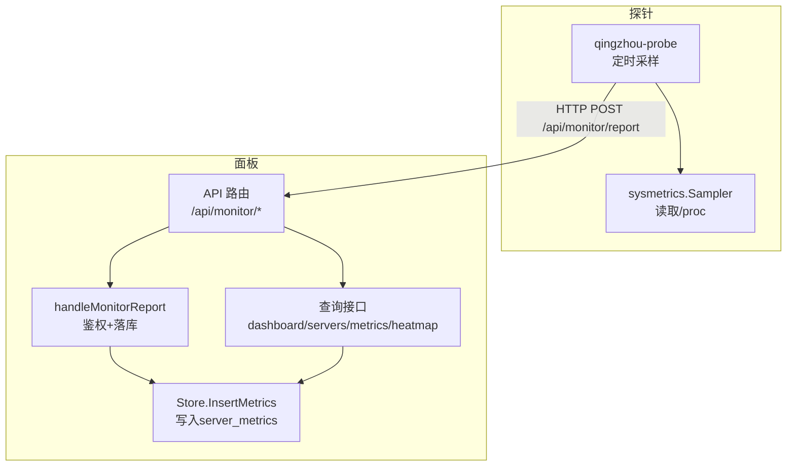
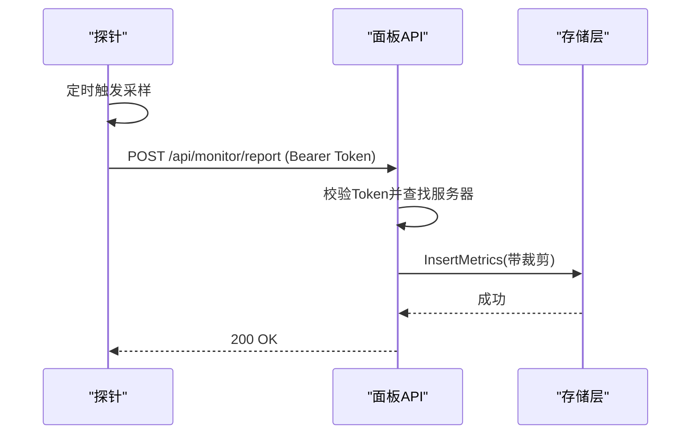
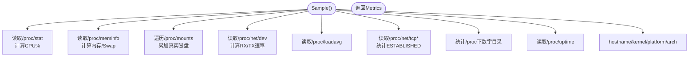
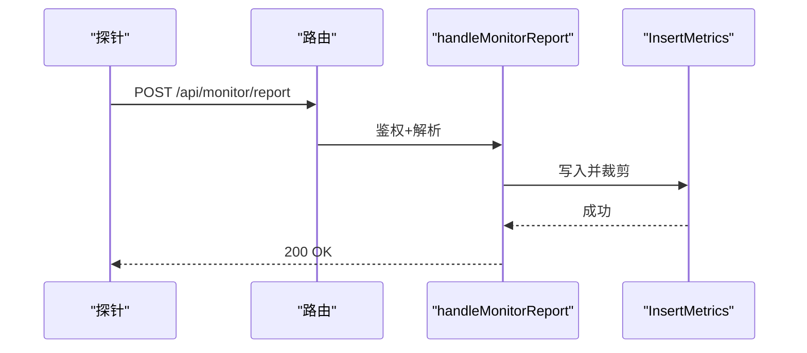
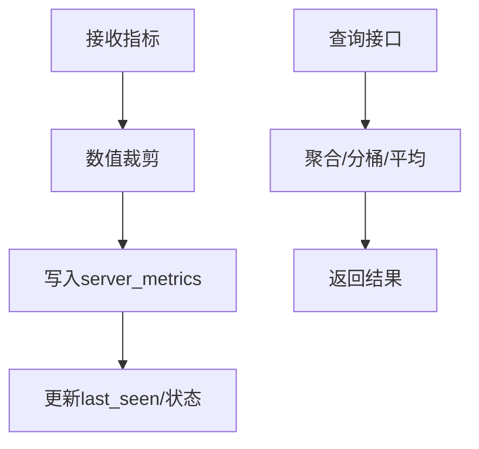
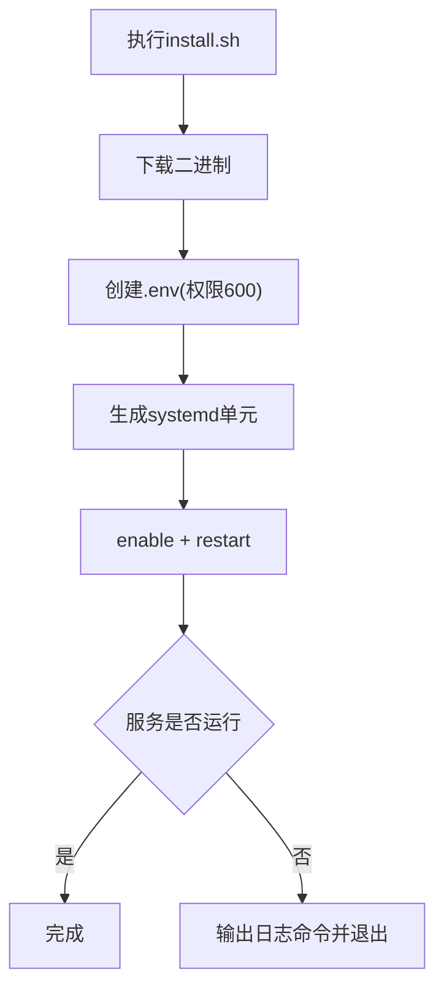
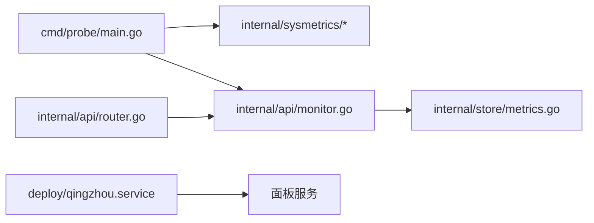

# 实时监控

<cite>
**本文引用的文件**
- [internal/sysmetrics/sysmetrics.go](file://internal/sysmetrics/sysmetrics.go)
- [internal/sysmetrics/sysmetrics_linux.go](file://internal/sysmetrics/sysmetrics_linux.go)
- [cmd/probe/main.go](file://cmd/probe/main.go)
- [cmd/probe/install.sh](file://cmd/probe/install.sh)
- [internal/api/monitor.go](file://internal/api/monitor.go)
- [internal/api/router.go](file://internal/api/router.go)
- [internal/store/metrics.go](file://internal/store/metrics.go)
- [deploy/qingzhou.service](file://deploy/qingzhou.service)
- [docs/部署与配置手册.md](file://docs/部署与配置手册.md)
</cite>

## 目录
1. [简介](#简介)
2. [项目结构](#项目结构)
3. [核心组件](#核心组件)
4. [架构总览](#架构总览)
5. [详细组件分析](#详细组件分析)
6. [依赖关系分析](#依赖关系分析)
7. [性能考虑](#性能考虑)
8. [故障排查指南](#故障排查指南)
9. [结论](#结论)
10. [附录：监控API接口文档](#附录监控api接口文档)

## 简介
本模块提供“轻舟”面板的实时监控能力，包含探针采集、指标上报、服务端存储与查询、可视化展示与告警。探针负责从宿主系统读取CPU、内存、磁盘、网络、负载、进程数、TCP连接等指标，按固定频率通过HTTP POST上报到面板；面板对数据进行校验、落库、聚合，并提供管理端与公开端的查询接口，用于仪表盘、热力图、趋势图与告警。

## 项目结构
- 探针侧（Linux）：位于 cmd/probe，负责采集与上报。
- 采集内核：internal/sysmetrics，封装跨平台逻辑与Linux实现，统一计算CPU使用率、网络速率、磁盘用量等。
- 服务端API：internal/api，提供探针上报、安装脚本、管理端与公开端监控接口。
- 数据存储：internal/store，负责指标写入、裁剪、查询与聚合。
- 部署：deploy 提供面板服务单元；探针一键安装脚本在 cmd/probe/install.sh 中。

图表来源
- [cmd/probe/main.go:34-91](file://cmd/probe/main.go#L34-L91)
- [internal/sysmetrics/sysmetrics_linux.go:20-65](file://internal/sysmetrics/sysmetrics_linux.go#L20-L65)
- [internal/api/monitor.go:20-55](file://internal/api/monitor.go#L20-L55)
- [internal/store/metrics.go:88-104](file://internal/store/metrics.go#L88-L104)
- [internal/api/router.go:164-175](file://internal/api/router.go#L164-L175)

章节来源
- [cmd/probe/main.go:1-119](file://cmd/probe/main.go#L1-L119)
- [internal/sysmetrics/sysmetrics.go:1-110](file://internal/sysmetrics/sysmetrics.go#L1-L110)
- [internal/sysmetrics/sysmetrics_linux.go:1-338](file://internal/sysmetrics/sysmetrics_linux.go#L1-L338)
- [internal/api/monitor.go:1-920](file://internal/api/monitor.go#L1-L920)
- [internal/api/router.go:132-387](file://internal/api/router.go#L132-L387)
- [internal/store/metrics.go:1-243](file://internal/store/metrics.go#L1-L243)
- [deploy/qingzhou.service:1-22](file://deploy/qingzhou.service#L1-L22)
- [docs/部署与配置手册.md:210-222](file://docs/部署与配置手册.md#L210-L222)

## 核心组件
- 探针主程序：定时触发采样，序列化并POST到面板上报接口，支持环境变量与命令行参数配置，最小间隔限制为5秒。
- 采集器：基于/proc与系统调用，计算CPU使用率、网络速率、磁盘用量、负载、进程数、TCP连接、系统信息等。
- 服务端接收：Bearer Token鉴权，解析JSON，写入数据库，更新探针在线状态。
- 存储层：数据裁剪（防恶意值）、单条插入、最近快照聚合、时间范围查询、全量历史聚合、定期清理。
- API层：管理端与公开端接口，包括仪表盘、服务器列表、指标曲线、热力图、告警等。

章节来源
- [cmd/probe/main.go:27-91](file://cmd/probe/main.go#L27-L91)
- [internal/sysmetrics/sysmetrics_linux.go:20-65](file://internal/sysmetrics/sysmetrics_linux.go#L20-L65)
- [internal/api/monitor.go:20-55](file://internal/api/monitor.go#L20-L55)
- [internal/store/metrics.go:52-104](file://internal/store/metrics.go#L52-L104)

## 架构总览
探针以固定周期采样系统指标，通过HTTP将JSON载荷POST至面板的公共上报接口；面板进行Token鉴权、数据裁剪后写入时序表，随后由管理端或公开端接口查询并聚合展示。

图表来源
- [cmd/probe/main.go:75-117](file://cmd/probe/main.go#L75-L117)
- [internal/api/monitor.go:20-55](file://internal/api/monitor.go#L20-L55)
- [internal/store/metrics.go:88-104](file://internal/store/metrics.go#L88-L104)

## 详细组件分析

### 探针数据采集机制
- 采样对象：CPU使用率、内存使用/总量、Swap使用/总量、磁盘已用/总量、网络RX/TX速率、1/5/15分钟负载、TCP连接数、进程数、系统运行时间、主机名、平台、内核、架构。
- 采样频率：默认30秒，可通过命令行参数调整，但最小限制为5秒。
- 数据来源：
  - CPU：/proc/stat 的cpu行，两次采样差值计算占用百分比。
  - 内存：/proc/meminfo 计算MemUsed=MemTotal-MemAvailable，Swap同理。
  - 磁盘：遍历/proc/mounts，过滤伪文件系统与loop设备，累加真实块设备的已用/总量。
  - 网络：/proc/net/dev，仅统计物理网卡前缀（如eth/ens/enp/wlan/em/eno），计算速率需两次采样差值除以间隔秒数。
  - 负载：/proc/loadavg。
  - TCP连接：/proc/net/tcp与tcp6，统计ESTABLISHED状态。
  - 进程数：/proc下数字目录数量。
  - 系统信息：hostname、GOARCH、/proc/version、/etc/os-release。
- 注意事项：
  - 首次采样不报告CPU和网络速率（需要上一轮作为基线）。
  - 单个子系统读取失败不影响其他指标返回。

图表来源
- [internal/sysmetrics/sysmetrics_linux.go:35-65](file://internal/sysmetrics/sysmetrics_linux.go#L35-L65)
- [internal/sysmetrics/sysmetrics_linux.go:67-338](file://internal/sysmetrics/sysmetrics_linux.go#L67-L338)
- [internal/sysmetrics/sysmetrics.go:54-109](file://internal/sysmetrics/sysmetrics.go#L54-L109)

章节来源
- [internal/sysmetrics/sysmetrics_linux.go:20-338](file://internal/sysmetrics/sysmetrics_linux.go#L20-L338)
- [internal/sysmetrics/sysmetrics.go:16-109](file://internal/sysmetrics/sysmetrics.go#L16-L109)

### 指标上报协议
- 端点：POST /api/monitor/report
- 认证：Authorization: Bearer <probe_token>
- 请求体：JSON，字段与 store.ServerMetrics 一致（含CPU、内存、磁盘、网络、负载、TCP、进程、Uptime、主机信息等）。
- 响应：成功返回 {ok: true}；失败返回错误码与消息（如缺少token、无效token、格式错误、写入失败）。
- 限流：该接口受全局探针上报限流保护（每分钟最多60次/IP）。

图表来源
- [internal/api/router.go:164-168](file://internal/api/router.go#L164-L168)
- [internal/api/monitor.go:20-55](file://internal/api/monitor.go#L20-L55)
- [internal/store/metrics.go:88-104](file://internal/store/metrics.go#L88-L104)

章节来源
- [internal/api/monitor.go:20-55](file://internal/api/monitor.go#L20-L55)
- [internal/api/router.go:164-168](file://internal/api/router.go#L164-L168)

### 实时数据处理流程
- 数据进入后先进行数值裁剪，防止恶意或异常探针导致仪表板失真。
- 写入 server_metrics 表，ts 若未设置则使用当前时间。
- 同时更新探针“最近可见时间”和服务器状态为 online。
- 管理端/公开端查询时，使用单次查询获取所有服务器最新指标，避免N+1问题。
- 历史查询支持时间范围与行数上限，防止大窗口产生超大响应。

图表来源
- [internal/store/metrics.go:52-104](file://internal/store/metrics.go#L52-L104)
- [internal/api/monitor.go:183-241](file://internal/api/monitor.go#L183-L241)
- [internal/api/monitor.go:323-360](file://internal/api/monitor.go#L323-L360)
- [internal/api/monitor.go:541-647](file://internal/api/monitor.go#L541-L647)

章节来源
- [internal/store/metrics.go:52-104](file://internal/store/metrics.go#L52-L104)
- [internal/api/monitor.go:183-241](file://internal/api/monitor.go#L183-L241)
- [internal/api/monitor.go:323-360](file://internal/api/monitor.go#L323-L360)
- [internal/api/monitor.go:541-647](file://internal/api/monitor.go#L541-L647)

### 系统指标采集方法与频率控制
- CPU：基于/proc/stat的两次采样差值计算占用百分比。
- 内存：MemTotal-MemAvailable得到MemUsed；Swap同理。
- 磁盘：过滤伪文件系统与loop设备，仅统计真实块设备，去重设备避免重复计数。
- 网络：仅统计物理网卡，两次采样差值除以间隔秒数得到速率。
- 频率控制：探针默认30秒，最小5秒；面板侧对上报接口限流（每分钟60次/IP）。

章节来源
- [internal/sysmetrics/sysmetrics_linux.go:67-338](file://internal/sysmetrics/sysmetrics_linux.go#L67-L338)
- [cmd/probe/main.go:52-55](file://cmd/probe/main.go#L52-L55)
- [internal/api/router.go:94-105](file://internal/api/router.go#L94-L105)

### 探针安装部署过程
- 一键安装脚本：下载对应架构的二进制，创建安全的环境配置文件（权限600），生成systemd服务单元并启动。
- 二进制来源：面板托管的 /api/monitor/agent/{arch}，默认目录来自环境变量 QZ_PROBE_DIR 或相对路径 cmd/probe/dist。
- systemd服务：启用开机自启，崩溃自动重启，最小权限与只读保护。
- 面板服务单元：deploy/qingzhou.service 定义面板服务的运行方式与安全加固。

图表来源
- [cmd/probe/install.sh:1-116](file://cmd/probe/install.sh#L1-L116)
- [internal/api/monitor.go:57-79](file://internal/api/monitor.go#L57-L79)
- [deploy/qingzhou.service:1-22](file://deploy/qingzhou.service#L1-L22)

章节来源
- [cmd/probe/install.sh:1-116](file://cmd/probe/install.sh#L1-L116)
- [internal/api/monitor.go:57-79](file://internal/api/monitor.go#L57-L79)
- [deploy/qingzhou.service:1-22](file://deploy/qingzhou.service#L1-L22)
- [docs/部署与配置手册.md:210-222](file://docs/部署与配置手册.md#L210-L222)

### 指标数据的存储策略与优化
- 数据模型：每条记录包含服务器ID、时间戳、各项指标及系统信息。
- 写入优化：插入前进行数值裁剪，确保Dashboard与热力图不受异常值影响。
- 查询优化：
  - 最新指标：使用GROUP BY取最大id的单次查询，避免N+1。
  - 历史查询：限制返回行数上限，防止长窗口高频率探针导致响应过大。
  - 全量历史：限制最大行数，供热力图与迷你图聚合使用。
- 数据保留：提供清理接口删除早于指定天数的指标，控制存储增长。

章节来源
- [internal/store/metrics.go:9-35](file://internal/store/metrics.go#L9-L35)
- [internal/store/metrics.go:52-104](file://internal/store/metrics.go#L52-L104)
- [internal/store/metrics.go:106-193](file://internal/store/metrics.go#L106-L193)
- [internal/store/metrics.go:160-165](file://internal/store/metrics.go#L160-L165)

### 监控API接口完整文档
- 探针上报
  - 方法/路径：POST /api/monitor/report
  - 认证：Authorization: Bearer <probe_token>
  - 请求体：ServerMetrics JSON
  - 响应：{ok: true} 或错误
- 探针下载
  - 方法/路径：GET /api/monitor/agent/{arch}
  - 参数：arch=linux-amd64|linux-arm64
  - 响应：二进制文件
- 一键安装脚本
  - 方法/路径：GET /api/monitor/install.sh
  - 响应：shell脚本内容
- 公开监控
  - 方法/路径：GET /api/monitor/public
  - 说明：返回公开可见的探针服务器列表与最新指标摘要（脱敏）
  - 方法/路径：GET /api/monitor/public/sparklines?range=1h|6h|24h
  - 说明：返回每个服务器的CPU/上下行迷你图数据（降采样）
  - 方法/路径：GET /api/monitor/heatmap?range=1h|6h|24h|7d
  - 说明：服务器×时间桶的状态矩阵（正常/高负载/离线）
- 管理端监控
  - 方法/路径：GET /api/admin/monitor/dashboard
  - 说明：汇总在线/离线/即将过期、告警数、总体资源摘要
  - 方法/路径：GET /api/admin/monitor/servers
  - 说明：服务器列表（含探针开关、令牌、状态、最新指标）
  - 方法/路径：GET /api/admin/monitor/servers/{id}/metrics?range=1h|6h|24h|7d|30d
  - 说明：某服务器的历史指标序列
  - 方法/路径：GET /api/admin/monitor/heatmap?range=...
  - 说明：管理端热力图
  - 方法/路径：GET /api/admin/monitor/alerts?unread=1
  - 说明：告警列表
  - 方法/路径：POST /api/admin/monitor/alerts/{id}/read
  - 说明：标记单条告警为已读
  - 方法/路径：POST /api/admin/monitor/alerts/read-all
  - 说明：全部标记为已读
- 服务器监控配置更新
  - 方法/路径：PUT /api/admin/servers/{id}/monitor
  - 说明：更新探针开关、公开可见、到期日、供应商、位置、规格、价格、备注等

章节来源
- [internal/api/router.go:164-175](file://internal/api/router.go#L164-L175)
- [internal/api/router.go:313-322](file://internal/api/router.go#L313-L322)
- [internal/api/monitor.go:20-55](file://internal/api/monitor.go#L20-L55)
- [internal/api/monitor.go:57-79](file://internal/api/monitor.go#L57-L79)
- [internal/api/monitor.go:183-241](file://internal/api/monitor.go#L183-L241)
- [internal/api/monitor.go:243-360](file://internal/api/monitor.go#L243-L360)
- [internal/api/monitor.go:362-428](file://internal/api/monitor.go#L362-L428)
- [internal/api/monitor.go:430-526](file://internal/api/monitor.go#L430-L526)
- [internal/api/monitor.go:541-647](file://internal/api/monitor.go#L541-L647)
- [internal/api/monitor.go:649-779](file://internal/api/monitor.go#L649-L779)

## 依赖关系分析
- 探针依赖 sysmetrics 采集系统指标，并通过HTTP上报。
- 面板API依赖 store 进行指标持久化与查询。
- 路由集中注册监控相关端点，并对探针上报接口实施限流。
- 部署层面，面板服务与探针服务均通过systemd管理，探针服务具备最小权限与只读保护。

图表来源
- [cmd/probe/main.go:12-25](file://cmd/probe/main.go#L12-L25)
- [internal/api/router.go:164-175](file://internal/api/router.go#L164-L175)
- [internal/api/monitor.go:20-55](file://internal/api/monitor.go#L20-L55)
- [internal/store/metrics.go:88-104](file://internal/store/metrics.go#L88-L104)
- [deploy/qingzhou.service:1-22](file://deploy/qingzhou.service#L1-L22)

章节来源
- [internal/api/router.go:132-387](file://internal/api/router.go#L132-L387)
- [internal/api/monitor.go:20-55](file://internal/api/monitor.go#L20-L55)
- [internal/store/metrics.go:88-104](file://internal/store/metrics.go#L88-L104)

## 性能考虑
- 探针侧
  - 采样间隔建议不低于5秒，避免频繁读取/proc造成额外开销。
  - 首次采样丢弃，避免空值误导。
- 面板侧
  - 上报接口限流：每分钟60次/IP，防止滥用。
  - 数据裁剪：拒绝负值与越界值，保证聚合正确性。
  - 查询限制：历史查询与全量历史均有行数上限，避免大响应拖垮服务。
  - 最新指标聚合：使用单次查询获取所有服务器最新指标，避免N+1。
- 存储侧
  - 定期清理旧指标，控制数据库体积。
  - 热力图与迷你图采用分桶与平均，降低前端渲染压力。

章节来源
- [internal/api/router.go:94-105](file://internal/api/router.go#L94-L105)
- [internal/store/metrics.go:52-104](file://internal/store/metrics.go#L52-L104)
- [internal/store/metrics.go:136-193](file://internal/store/metrics.go#L136-L193)
- [internal/api/monitor.go:541-647](file://internal/api/monitor.go#L541-L647)

## 故障排查指南
- 探针无法启动
  - 检查QZ_PROBE_SERVER与QZ_PROBE_TOKEN是否正确（优先使用EnvironmentFile而非命令行传参）。
  - 查看systemd日志：journalctl -u qingzhou-probe -n 20 --no-pager。
- 上报失败
  - 确认面板地址与端口可达，TLS证书有效（除非使用-insecure测试）。
  - 检查Authorization头是否携带正确的Bearer token。
  - 查看面板日志与探针日志，定位HTTP状态码与错误信息。
- 指标异常
  - 检查系统/proc可读性（无swap、无os-release等不会导致整体失败）。
  - 确认探针采样间隔合理，避免过短导致CPU/NIC计数器回绕。
- 面板服务问题
  - 检查deploy/qingzhou.service配置与环境变量。
  - 确认QZ_PROBE_DIR指向有效的探针二进制目录，否则安装脚本会报404。

章节来源
- [cmd/probe/main.go:37-73](file://cmd/probe/main.go#L37-L73)
- [cmd/probe/install.sh:68-116](file://cmd/probe/install.sh#L68-L116)
- [internal/api/monitor.go:20-55](file://internal/api/monitor.go#L20-L55)
- [docs/部署与配置手册.md:210-222](file://docs/部署与配置手册.md#L210-L222)

## 结论
本监控模块通过轻量探针与面板协同，实现了系统指标的持续采集、安全上报、可靠存储与高效查询。通过严格的数值裁剪、查询限制与分桶聚合，保障了在高频率上报场景下的稳定性与性能。配套的一键安装脚本与systemd服务简化了部署与维护。后续可结合告警阈值与自动化运维动作进一步提升可用性。

## 附录：监控API接口文档
- 探针上报
  - POST /api/monitor/report
  - 认证：Authorization: Bearer <probe_token>
  - 请求体：ServerMetrics JSON
  - 响应：{ok: true} 或错误
- 探针下载
  - GET /api/monitor/agent/{arch}
  - 参数：arch=linux-amd64|linux-arm64
  - 响应：二进制文件
- 一键安装脚本
  - GET /api/monitor/install.sh
  - 响应：shell脚本内容
- 公开监控
  - GET /api/monitor/public
  - GET /api/monitor/public/sparklines?range=1h|6h|24h
  - GET /api/monitor/heatmap?range=1h|6h|24h|7d
- 管理端监控
  - GET /api/admin/monitor/dashboard
  - GET /api/admin/monitor/servers
  - GET /api/admin/monitor/servers/{id}/metrics?range=1h|6h|24h|7d|30d
  - GET /api/admin/monitor/heatmap?range=...
  - GET /api/admin/monitor/alerts?unread=1
  - POST /api/admin/monitor/alerts/{id}/read
  - POST /api/admin/monitor/alerts/read-all
  - PUT /api/admin/servers/{id}/monitor

章节来源
- [internal/api/router.go:164-175](file://internal/api/router.go#L164-L175)
- [internal/api/router.go:313-322](file://internal/api/router.go#L313-L322)
- [internal/api/monitor.go:20-55](file://internal/api/monitor.go#L20-L55)
- [internal/api/monitor.go:57-79](file://internal/api/monitor.go#L57-L79)
- [internal/api/monitor.go:183-241](file://internal/api/monitor.go#L183-L241)
- [internal/api/monitor.go:243-360](file://internal/api/monitor.go#L243-L360)
- [internal/api/monitor.go:362-428](file://internal/api/monitor.go#L362-L428)
- [internal/api/monitor.go:430-526](file://internal/api/monitor.go#L430-L526)
- [internal/api/monitor.go:541-647](file://internal/api/monitor.go#L541-L647)
- [internal/api/monitor.go:649-779](file://internal/api/monitor.go#L649-L779)
