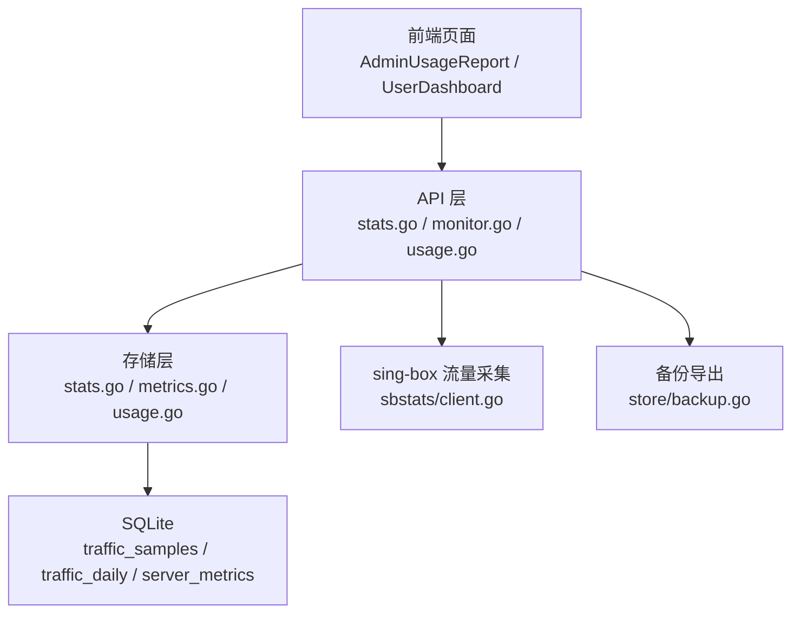
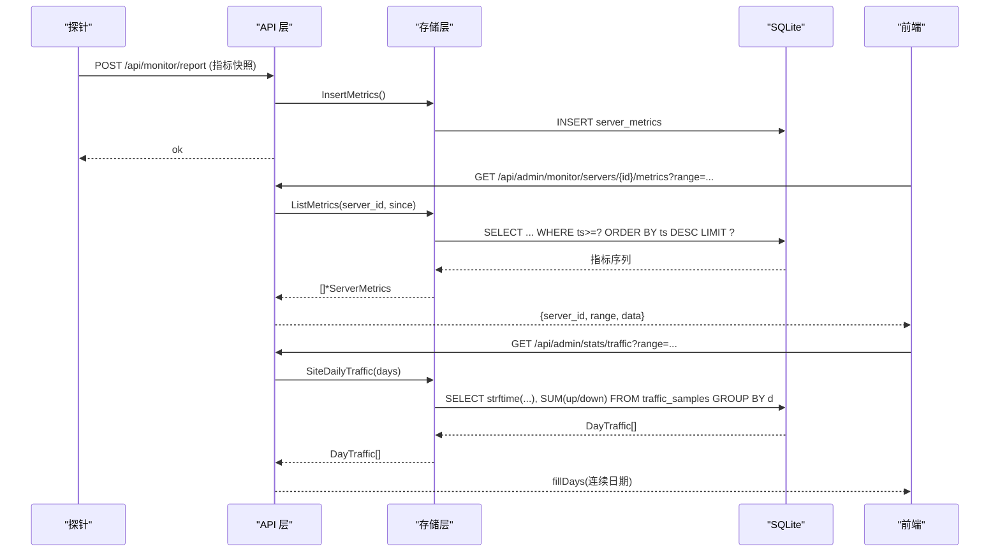
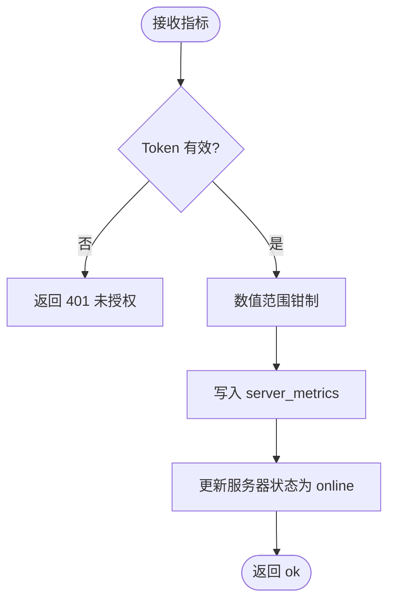
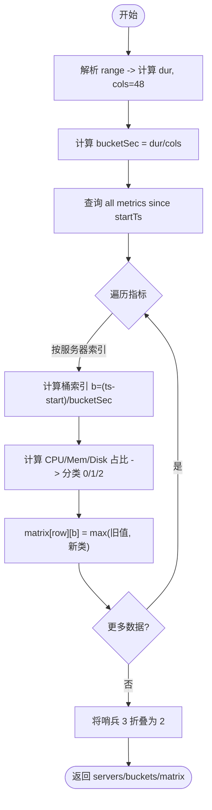
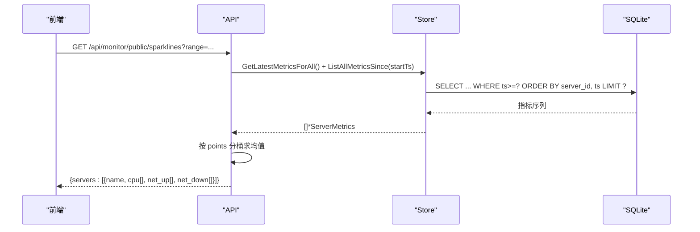
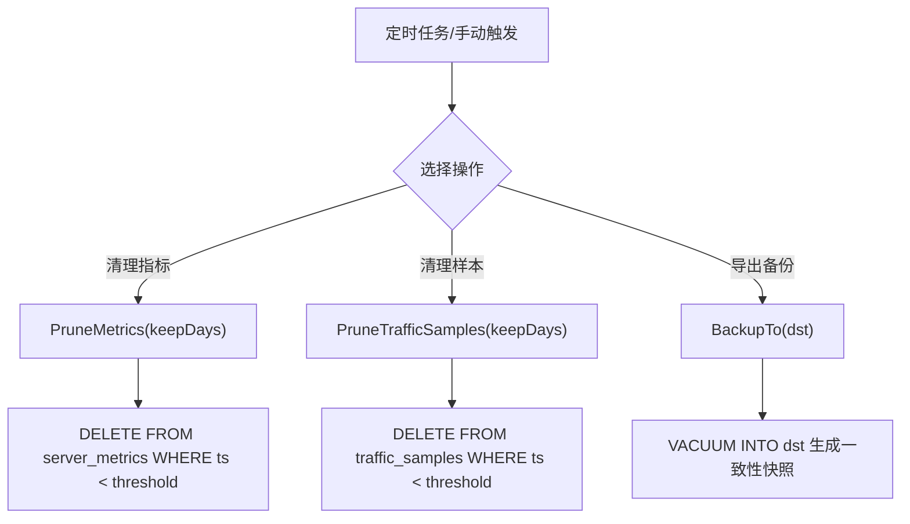
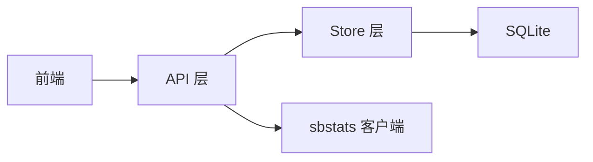

# 数据分析

<cite>
**本文引用的文件**
- [internal/api/stats.go](file://internal/api/stats.go)
- [internal/store/stats.go](file://internal/store/stats.go)
- [internal/api/monitor.go](file://internal/api/monitor.go)
- [internal/store/metrics.go](file://internal/store/metrics.go)
- [internal/sbstats/client.go](file://internal/sbstats/client.go)
- [internal/api/usage.go](file://internal/api/usage.go)
- [internal/store/usage.go](file://internal/store/usage.go)
- [internal/store/backup.go](file://internal/store/backup.go)
- [deploy/backup.sh](file://deploy/backup.sh)
- [frontend/src/views/AdminUsageReport.vue](file://frontend/src/views/AdminUsageReport.vue)
- [frontend/src/views/UserDashboard.vue](file://frontend/src/views/UserDashboard.vue)
</cite>

## 目录
1. [简介](#简介)
2. [项目结构](#项目结构)
3. [核心组件](#核心组件)
4. [架构总览](#架构总览)
5. [详细组件分析](#详细组件分析)
6. [依赖关系分析](#依赖关系分析)
7. [性能考量](#性能考量)
8. [故障排查指南](#故障排查指南)
9. [结论](#结论)
10. [附录](#附录)

## 简介
本文件面向“数据分析”能力，覆盖监控数据的聚合计算与统计分析方法、热力图生成算法（时间分桶、状态分类、可视化映射）、趋势分析实现（数据降采样、滑动窗口、异常检测思路）、统计数据查询接口文档（时间范围过滤、分组、聚合函数使用）、数据保留策略与归档机制、数据导出与第三方工具集成支持，以及为开发者提供的自定义分析维度与报表扩展指导。

## 项目结构
后端采用分层设计：API 层负责路由与请求处理；Store 层封装 SQL 与数据访问；sbstats 子包通过 gRPC-over-h2c 采集 sing-box 的 per-user 流量增量；前端提供图表与交互。关键路径如下：
- 用户/管理员统计：/api/user/stats/* 与 /api/admin/stats/*
- 监控指标采集与展示：探针上报 /api/monitor/report，查询 /api/admin/monitor/* 与公开 /api/monitor/public/*
- 用量报告：/api/admin/stats/usage
- 备份导出：/api/admin/backup（下载数据库快照）

**图示来源**
- [internal/api/stats.go:79-199](file://internal/api/stats.go#L79-L199)
- [internal/api/monitor.go:20-55](file://internal/api/monitor.go#L20-L55)
- [internal/api/usage.go:127-213](file://internal/api/usage.go#L127-L213)
- [internal/store/stats.go:27-40](file://internal/store/stats.go#L27-L40)
- [internal/store/metrics.go:88-104](file://internal/store/metrics.go#L88-L104)
- [internal/sbstats/client.go:122-183](file://internal/sbstats/client.go#L122-L183)
- [internal/store/backup.go:10-51](file://internal/store/backup.go#L10-L51)

**章节来源**
- [internal/api/stats.go:79-199](file://internal/api/stats.go#L79-L199)
- [internal/api/monitor.go:20-55](file://internal/api/monitor.go#L20-L55)
- [internal/api/usage.go:127-213](file://internal/api/usage.go#L127-L213)

## 核心组件
- 统计聚合与填充：按日聚合流量、注册趋势、收入趋势、套餐销售、用户分布等，并对稀疏数据进行连续时间窗填充，保证图表无断点。
- 监控指标采集与聚合：探针定时上报系统指标，服务端进行裁剪、限流、聚合与可视化（折线、迷你图、热力图）。
- 用量报告：支持“全生命周期”和“窗口期”两种模式，分别基于累计计数器与滚动汇总表，提供用户/套餐维度的总量与逐日曲线。
- 数据保留与归档：对高频指标表与流量样本表执行定期清理；提供一致的数据库快照导出。

**章节来源**
- [internal/store/stats.go:27-40](file://internal/store/stats.go#L27-L40)
- [internal/store/stats.go:144-232](file://internal/store/stats.go#L144-L232)
- [internal/store/metrics.go:88-104](file://internal/store/metrics.go#L88-L104)
- [internal/store/usage.go:9-24](file://internal/store/usage.go#L9-L24)
- [internal/store/backup.go:10-51](file://internal/store/backup.go#L10-L51)

## 架构总览
下图展示了从探针到可视化的完整链路，以及统计与用量报告的调用关系。

**图示来源**
- [internal/api/monitor.go:20-55](file://internal/api/monitor.go#L20-L55)
- [internal/store/metrics.go:88-104](file://internal/store/metrics.go#L88-L104)
- [internal/store/metrics.go:136-158](file://internal/store/metrics.go#L136-L158)
- [internal/api/stats.go:79-89](file://internal/api/stats.go#L79-L89)
- [internal/store/stats.go:27-40](file://internal/store/stats.go#L27-L40)

## 详细组件分析

### 监控指标采集与聚合
- 指标写入：探针以 Bearer token 认证上报，服务端校验后写入 server_metrics，并更新服务器在线状态。
- 指标裁剪：写入前对 CPU/内存/磁盘/网络等字段做合理范围钳制，防止恶意或错误探针污染聚合结果。
- 查询限制：单服务器历史查询限制返回行数，避免长时高频率探针导致响应过大。
- 全局聚合：仪表盘汇总所有探针服务器的最新指标，计算总 CPU/内存/磁盘使用量。

**图示来源**
- [internal/api/monitor.go:20-55](file://internal/api/monitor.go#L20-L55)
- [internal/store/metrics.go:52-86](file://internal/store/metrics.go#L52-L86)
- [internal/store/metrics.go:88-104](file://internal/store/metrics.go#L88-L104)

**章节来源**
- [internal/api/monitor.go:20-55](file://internal/api/monitor.go#L20-L55)
- [internal/store/metrics.go:52-104](file://internal/store/metrics.go#L52-L104)

### 热力图数据生成算法
- 时间分桶：根据 range（1h/6h/24h/7d）计算固定列数（48 列）的时间桶宽度 bucketSec，生成 buckets 起始时间戳数组。
- 状态分类：对每条指标计算 CPU/内存/磁盘占用百分比，按阈值分类：
  - 正常：均低于 70%
  - 高负载：任一 ≥70%
  - 离线级负载：任一 ≥90%
- 矩阵构建：按服务器行×时间列构建矩阵，同一桶内取最差状态（max class），无数据哨兵值最终折叠为“离线/无数据”。
- 公开与后台：公共端仅返回服务器名称，后台端返回 ID，便于管理。

**图示来源**
- [internal/api/monitor.go:541-647](file://internal/api/monitor.go#L541-L647)

**章节来源**
- [internal/api/monitor.go:375-428](file://internal/api/monitor.go#L375-L428)
- [internal/api/monitor.go:541-647](file://internal/api/monitor.go#L541-L647)

### 趋势分析与降采样
- 迷你图（Sparklines）：对每个探针服务器在指定范围内拉取指标，按固定点数（如 32 点）进行时间分桶平均，得到 CPU/上行/下行三条曲线。
- 站点流量趋势：按日聚合 traffic_samples，API 侧用 fillPoints/fillDays 补齐缺失日期，确保 X 轴连续。
- 注册与收入趋势：按日分组统计新增用户与积分发放/消耗，同样进行连续窗口填充。

**图示来源**
- [internal/api/monitor.go:430-526](file://internal/api/monitor.go#L430-L526)
- [internal/store/metrics.go:167-193](file://internal/store/metrics.go#L167-L193)

**章节来源**
- [internal/api/monitor.go:430-526](file://internal/api/monitor.go#L430-L526)
- [internal/store/metrics.go:167-193](file://internal/store/metrics.go#L167-L193)

### 异常检测与告警
- 阈值触发：热力图与迷你图已内置 70%/90% 两级阈值用于状态分类，可作为异常初筛。
- 告警列表：提供读取与标记已读接口，结合探针最近可见时间与到期预警，形成运维闭环。
- 建议扩展：可在此基础上增加滑动窗口异常检测（如 Z-Score、EWMA）与多指标联合判定。

**章节来源**
- [internal/api/monitor.go:362-373](file://internal/api/monitor.go#L362-L373)
- [internal/api/monitor.go:649-665](file://internal/api/monitor.go#L649-L665)

### 统计数据查询接口文档
以下接口均位于 /api 下，参数说明与返回值要点如下：

- 用户流量趋势
  - 路径：GET /api/user/stats/traffic?range=7d|14d|30d|90d
  - 功能：返回当前登录用户近 N 天的上下行流量，按日聚合，缺失日期自动填充。
  - 返回：[{date, up, down}, ...]

- 管理员概览
  - 路径：GET /api/admin/stats/overview?range=...
  - 功能：返回总用户、活跃用户、今日新增、累计流量、积分发放、套餐在线数、在线人数与名单、周期对比（当前 vs 上一周期）。
  - 返回：包含 total_users、active_users、new_today、total_traffic、points_issued、packages_on、online、online_users、range_days、period、period_prev。

- 套餐统计
  - 路径：GET /api/admin/stats/packages
  - 功能：按套餐维度统计销量、收入、持有者、活跃桶、流量使用、即将过期等。
  - 返回：[PackageStat, ...]

- 用户分析表
  - 路径：GET /api/admin/stats/users?q=&status=&package_id=&expiry=&online=&range=&sort=&desc=&limit=&offset=
  - 功能：支持用户名/邮箱模糊搜索、状态筛选、套餐筛选、到期区间筛选、在线筛选、排序与分页。
  - 返回：{rows, total, range_days}

- 单用户流量详情
  - 路径：GET /api/admin/stats/user/{id}/traffic?range=...
  - 功能：某用户的逐日流量，用于钻取图表。
  - 返回：[{date, up, down}, ...]

- 全站流量趋势
  - 路径：GET /api/admin/stats/traffic?range=...
  - 功能：全站逐日流量，缺失日期填充。
  - 返回：[{date, up, down}, ...]

- Top 排行
  - 路径：GET /api/admin/stats/top
  - 功能：按流量、消费、套餐销量取 TopN。
  - 返回：{traffic, spend, package_sales}

- 分布与趋势
  - 路径：GET /api/admin/stats/distribution?range=...
  - 功能：用户状态分布、注册趋势、收入趋势（积分发放/消耗），均按日连续填充。
  - 返回：{distribution, registration, revenue, range_days}

- 用量报告
  - 路径：GET /api/admin/stats/usage?preset=total|7d|14d|30d|90d|custom&from=&to=&users=...&packages=...
  - 功能：支持“全生命周期”与“窗口期”两种模式，返回用户/套餐总量、逐日曲线、覆盖率提示。
  - 返回：{mode, preset, from, to, users, packages, coverage:{first,last}, by_user, by_package, series, total_series, series_scope}

**章节来源**
- [internal/api/stats.go:79-199](file://internal/api/stats.go#L79-L199)
- [internal/api/usage.go:127-213](file://internal/api/usage.go#L127-L213)
- [internal/store/stats.go:27-40](file://internal/store/stats.go#L27-L40)
- [internal/store/stats.go:144-232](file://internal/store/stats.go#L144-L232)
- [internal/store/stats.go:250-275](file://internal/store/stats.go#L250-L275)
- [internal/store/stats.go:300-348](file://internal/store/stats.go#L300-L348)
- [internal/store/stats.go:398-488](file://internal/store/stats.go#L398-L488)
- [internal/store/usage.go:126-187](file://internal/store/usage.go#L126-L187)
- [internal/store/usage.go:189-249](file://internal/store/usage.go#L189-L249)
- [internal/store/usage.go:284-371](file://internal/store/usage.go#L284-L371)
- [internal/store/usage.go:373-484](file://internal/store/usage.go#L373-L484)

### 数据保留策略与归档机制
- 指标表清理：server_metrics 表按 keepDays 删除早于阈值的记录，避免无限增长。
- 流量样本清理：traffic_samples 表按 keepDays 清理历史样本，支撑按日聚合。
- 备份导出：通过 VACUUM INTO 生成一致性的 SQLite 快照，支持在线热备；配套 shell 脚本每日备份并保留 7 天。

**图示来源**
- [internal/store/metrics.go:160-165](file://internal/store/metrics.go#L160-L165)
- [internal/store/stats.go:76-81](file://internal/store/stats.go#L76-L81)
- [internal/store/backup.go:10-51](file://internal/store/backup.go#L10-L51)
- [deploy/backup.sh:1-14](file://deploy/backup.sh#L1-L14)

**章节来源**
- [internal/store/metrics.go:160-165](file://internal/store/metrics.go#L160-L165)
- [internal/store/stats.go:76-81](file://internal/store/stats.go#L76-L81)
- [internal/store/backup.go:10-51](file://internal/store/backup.go#L10-L51)
- [deploy/backup.sh:1-14](file://deploy/backup.sh#L1-L14)

### 数据导出与第三方工具集成
- 数据库导出：提供 HTTP 接口下载 SQLite 快照，设置 no-store 缓存控制，适合外部工具（如 Airflow、dbt、BI 工具）定时拉取与分析。
- 探针安装脚本：一键下载探针二进制、配置环境变量、创建 systemd 服务并启动，便于快速部署数据采集。
- 指标格式：标准 JSON 字段，易于被 Prometheus Exporter、Grafana、ELK 等生态接入。

**章节来源**
- [internal/api/backup_admin.go:33-76](file://internal/api/backup_admin.go#L33-L76)
- [internal/api/monitor.go:57-79](file://internal/api/monitor.go#L57-L79)

### 自定义分析维度与报表扩展指导
- 新增维度：可在 Store 层添加新的聚合查询（例如按地区、协议、域名等维度），并在 API 层暴露对应接口；注意使用参数化查询与白名单排序键，避免注入。
- 报表模板：复用 fillDays/fillPoints 模式对稀疏数据进行连续窗口填充，保证前端图表稳定渲染。
- 指标扩展：在 ServerMetrics 中增加字段，并在插入时进行钳制；同时更新热力图分类逻辑与前端展示。
- 用量报告扩展：如需新增“窗口期”维度，参考 UsageFilter/UsageWindow 的设计，统一在 usageWhere 中组合条件。

**章节来源**
- [internal/store/stats.go:398-488](file://internal/store/stats.go#L398-L488)
- [internal/store/usage.go:102-124](file://internal/store/usage.go#L102-L124)
- [internal/store/metrics.go:9-33](file://internal/store/metrics.go#L9-L33)
- [internal/store/metrics.go:52-86](file://internal/store/metrics.go#L52-L86)

## 依赖关系分析
- API 层依赖 Store 层的数据访问方法，不直接操作数据库。
- Store 层依赖 SQLite，并通过迁移脚本维护表结构与索引。
- sbstats 子包独立于主程序，通过轻量 gRPC-over-h2c 获取 sing-box 的 per-user 流量增量，减少对外部库依赖。
- 前端通过 API 获取数据，使用 ECharts 等库进行可视化。

**图示来源**
- [internal/api/stats.go:1-11](file://internal/api/stats.go#L1-L11)
- [internal/store/stats.go:1-6](file://internal/store/stats.go#L1-L6)
- [internal/sbstats/client.go:1-15](file://internal/sbstats/client.go#L1-L15)

**章节来源**
- [internal/api/stats.go:1-11](file://internal/api/stats.go#L1-L11)
- [internal/store/stats.go:1-6](file://internal/store/stats.go#L1-L6)
- [internal/sbstats/client.go:1-15](file://internal/sbstats/client.go#L1-L15)

## 性能考量
- 查询限制：ListMetrics 限制最大返回行数，避免大响应；ListAllMetricsSince 限制 heatmap 最大行数，保护匿名接口。
- 索引优化：server_metrics 建立复合索引 (server_id, ts) 与独立 ts 索引，加速按时间范围查询与清理任务。
- 数据裁剪：写入时对指标值进行钳制，防止异常值影响聚合与可视化。
- 前端降采样：迷你图固定点数平均，降低渲染压力。

**章节来源**
- [internal/store/metrics.go:136-158](file://internal/store/metrics.go#L136-L158)
- [internal/store/metrics.go:167-193](file://internal/store/metrics.go#L167-L193)
- [internal/store/migrate.go:466-498](file://internal/store/migrate.go#L466-L498)
- [internal/api/monitor.go:430-526](file://internal/api/monitor.go#L430-L526)

## 故障排查指南
- 指标为空或图表断点：检查探针是否启用、token 是否正确、last_seen 是否在在线窗口内；确认 PruneMetrics/PruneTrafficSamples 是否误删数据。
- 热力图全红：确认阈值设置与指标合理性；检查是否存在负值或溢出（已被钳制），核对 bucketSec 计算。
- 用量报告为零：确认 mode 是否为 window，且 coverage.first 之后才有数据；lifetime 模式下需关注是否有套餐过滤导致结果为空。
- 备份失败：检查目标路径权限与是否存在同名文件；查看 WAL 模式下的 VACUUM INTO 错误日志。

**章节来源**
- [internal/api/monitor.go:20-55](file://internal/api/monitor.go#L20-L55)
- [internal/api/monitor.go:323-360](file://internal/api/monitor.go#L323-L360)
- [internal/store/metrics.go:160-165](file://internal/store/metrics.go#L160-L165)
- [internal/store/stats.go:76-81](file://internal/store/stats.go#L76-L81)
- [internal/store/backup.go:10-51](file://internal/store/backup.go#L10-L51)

## 结论
本系统提供了完善的监控与数据分析能力：通过探针采集系统指标，结合按日/按桶的聚合与填充，输出稳定的趋势与热力图；通过用户/套餐/站点多维统计接口，满足运营与管理需求；通过保留策略与备份导出，保障长期数据可用性与可移植性。建议在现有基础上继续完善异常检测与自定义维度扩展，以满足更复杂的分析场景。

## 附录
- 前端图表示例：用量报告中的堆叠面积图与迷你图，体现连续时间窗与降采样效果。
- 用户侧趋势：用户仪表板加载近 7/30 天流量趋势，展示峰值日与日均值。

**章节来源**
- [frontend/src/views/AdminUsageReport.vue:327-361](file://frontend/src/views/AdminUsageReport.vue#L327-L361)
- [frontend/src/views/UserDashboard.vue:267-303](file://frontend/src/views/UserDashboard.vue#L267-L303)
