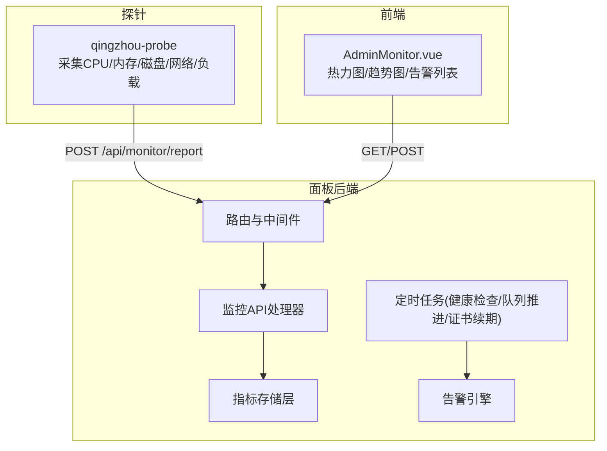
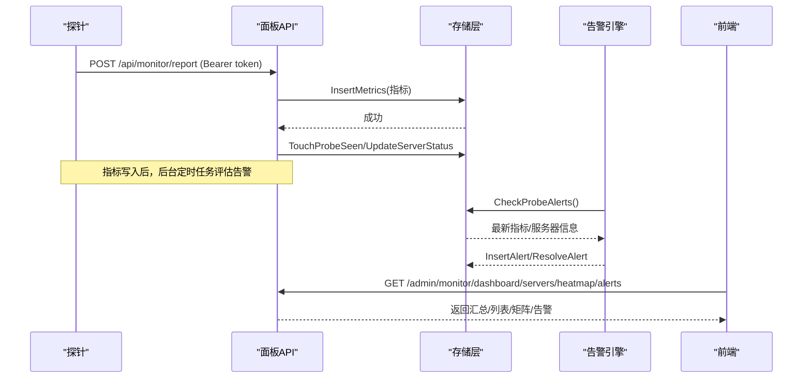
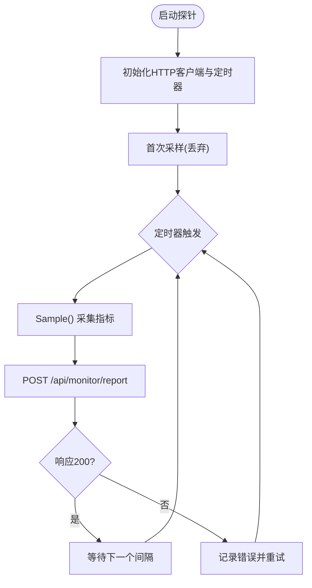
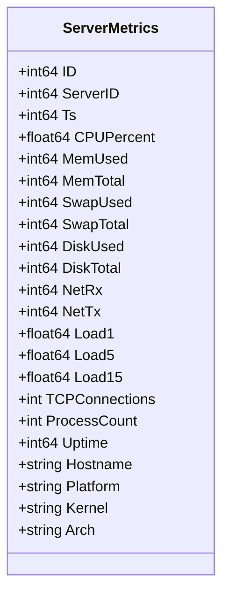
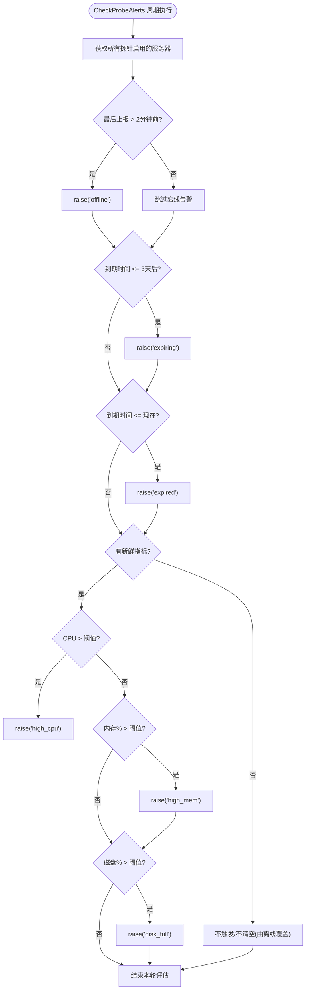
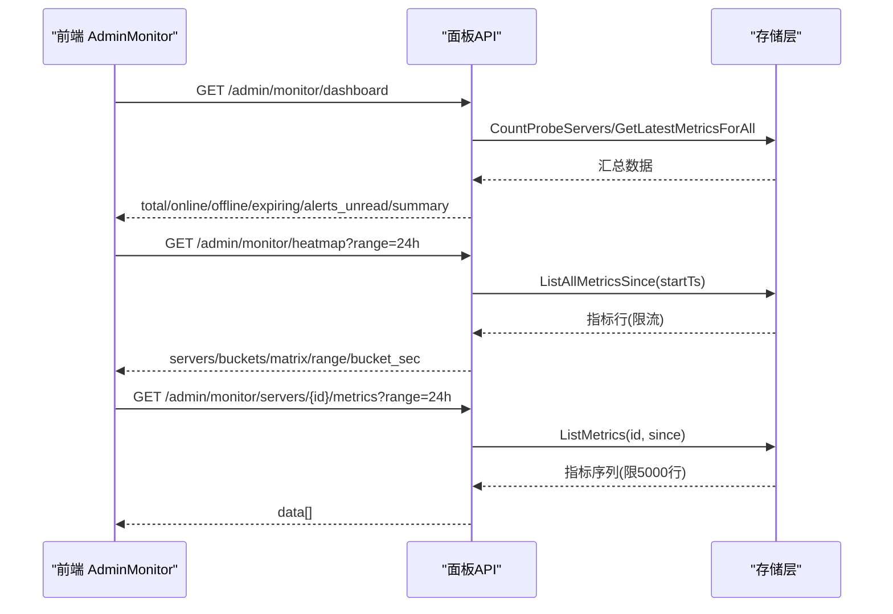
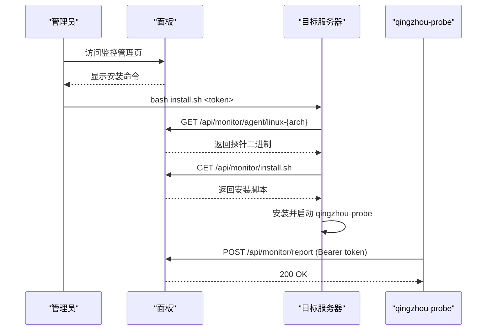
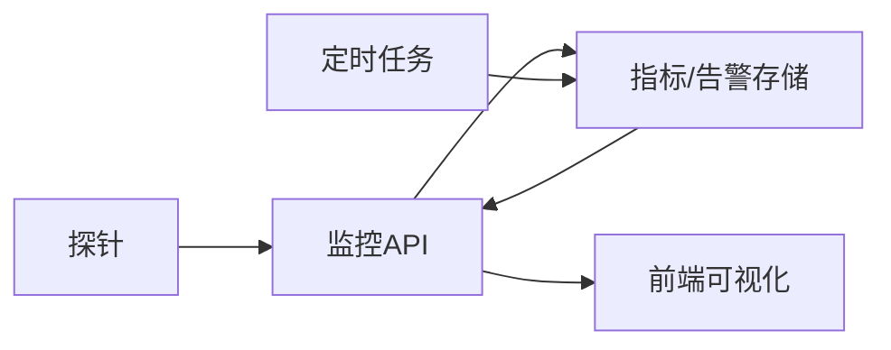

# 监控告警系统

<cite>
**本文引用的文件**
- [main.go](file://main.go)
- [cmd/probe/main.go](file://cmd/probe/main.go)
- [internal/api/monitor.go](file://internal/api/monitor.go)
- [internal/api/router.go](file://internal/api/router.go)
- [internal/store/metrics.go](file://internal/store/metrics.go)
- [internal/store/alerts.go](file://internal/store/alerts.go)
- [internal/sysmetrics/sysmetrics.go](file://internal/sysmetrics/sysmetrics.go)
- [frontend/src/views/AdminMonitor.vue](file://frontend/src/views/AdminMonitor.vue)
- [docs/部署与配置手册.md](file://docs/部署与配置手册.md)
</cite>

## 目录
1. [简介](#简介)
2. [项目结构](#项目结构)
3. [核心组件](#核心组件)
4. [架构总览](#架构总览)
5. [详细组件分析](#详细组件分析)
6. [依赖关系分析](#依赖关系分析)
7. [性能考虑](#性能考虑)
8. [故障排查指南](#故障排查指南)
9. [结论](#结论)
10. [附录：API 接口文档](#附录api-接口文档)

## 简介
本监控系统提供对多节点服务器的实时性能采集、可视化展示与自动告警能力。探针在目标机器上周期性采集 CPU、内存、磁盘、网络、负载等指标，通过 HTTP 上报到面板；面板负责存储、聚合、展示与告警判定，并提供公开与管理端的数据查询接口。同时内置可用性热力图、趋势折线图、未读告警列表等前端可视化能力。

## 项目结构
- 探针（Linux）：轻量二进制，读取 /proc 并定时 POST 指标到面板
- 面板后端：HTTP API、指标存储、告警引擎、定时任务、管理/公开接口
- 前端：Vue + ECharts，提供监控仪表盘、热力图、趋势图、告警列表
- 配置与部署：环境变量、一键安装脚本、systemd 服务

图表来源
- [internal/api/router.go:132-175](file://internal/api/router.go#L132-L175)
- [internal/api/monitor.go:18-55](file://internal/api/monitor.go#L18-L55)
- [internal/store/metrics.go:88-104](file://internal/store/metrics.go#L88-L104)
- [internal/store/alerts.go:247-356](file://internal/store/alerts.go#L247-L356)
- [frontend/src/views/AdminMonitor.vue:284-359](file://frontend/src/views/AdminMonitor.vue#L284-L359)

章节来源
- [main.go:25-142](file://main.go#L25-L142)
- [internal/api/router.go:132-175](file://internal/api/router.go#L132-L175)
- [docs/部署与配置手册.md:210-222](file://docs/部署与配置手册.md#L210-L222)

## 核心组件
- 指标采集器（sysmetrics）：跨平台计算 CPU 使用率、网络速率、过滤伪文件系统、物理网卡选择
- 探针（probe）：按固定间隔采样并上报 JSON 指标到面板
- 指标存储（store.metrics）：写入、裁剪、分页限制、最近快照、批量查询、清理策略
- 告警引擎（store.alerts）：离线、即将到期、已过期、高 CPU/内存/磁盘等条件，支持连续触发阈值与静默窗口
- 监控 API（api.monitor）：探针上报、管理端仪表盘/服务器列表/指标查询/热力图/告警操作、公开状态页
- 前端可视化（AdminMonitor.vue）：汇总卡片、热力图、趋势图、告警列表、筛选与编辑资产信息

章节来源
- [internal/sysmetrics/sysmetrics.go:1-110](file://internal/sysmetrics/sysmetrics.go#L1-L110)
- [cmd/probe/main.go:34-92](file://cmd/probe/main.go#L34-L92)
- [internal/store/metrics.go:9-35](file://internal/store/metrics.go#L9-L35)
- [internal/store/alerts.go:10-43](file://internal/store/alerts.go#L10-L43)
- [internal/api/monitor.go:18-800](file://internal/api/monitor.go#L18-L800)
- [frontend/src/views/AdminMonitor.vue:1-601](file://frontend/src/views/AdminMonitor.vue#L1-L601)

## 架构总览
探针每 N 秒采集一次系统指标并通过 Bearer Token 认证上报到面板。面板将指标落库并进行数据裁剪，防止恶意或异常探针污染仪表板。后台定时任务评估告警规则，生成“事件”并合并重复观测。前端通过管理端和公开端接口获取数据，渲染热力图和趋势图。

图表来源
- [cmd/probe/main.go:75-92](file://cmd/probe/main.go#L75-L92)
- [internal/api/monitor.go:22-55](file://internal/api/monitor.go#L22-L55)
- [internal/store/metrics.go:88-104](file://internal/store/metrics.go#L88-L104)
- [internal/store/alerts.go:247-356](file://internal/store/alerts.go#L247-L356)
- [internal/api/router.go:164-175](file://internal/api/router.go#L164-L175)

## 详细组件分析

### 指标采集机制
- 探针以固定间隔调用 sysmetrics.Sampler.Sample()，计算 CPU 百分比、网络速率、负载、进程数、TCP 连接数、主机名、内核、架构等
- 首次采样用于预热，避免首包误报为空闲
- 通过 HTTP POST 携带 Authorization: Bearer <token> 上报到 /api/monitor/report

图表来源
- [cmd/probe/main.go:64-92](file://cmd/probe/main.go#L64-L92)
- [internal/sysmetrics/sysmetrics.go:54-83](file://internal/sysmetrics/sysmetrics.go#L54-L83)

章节来源
- [cmd/probe/main.go:34-92](file://cmd/probe/main.go#L34-L92)
- [internal/sysmetrics/sysmetrics.go:1-110](file://internal/sysmetrics/sysmetrics.go#L1-L110)

### 数据存储策略与查询优化
- 指标表包含时间戳、CPU、内存、Swap、磁盘、网络、负载、TCP、进程数、Uptime、主机信息等
- 写入前进行 clamp 裁剪，拒绝负值或越界值，保障仪表板安全
- 最近快照采用单条聚合查询，避免 N+1 问题
- 历史查询限制最大行数，防止长时范围导致响应过大
- 全量历史查询用于热力图，设置上限保护匿名接口
- 定期清理旧指标，控制数据库体积

图表来源
- [internal/store/metrics.go:9-35](file://internal/store/metrics.go#L9-L35)

章节来源
- [internal/store/metrics.go:52-104](file://internal/store/metrics.go#L52-L104)
- [internal/store/metrics.go:106-193](file://internal/store/metrics.go#L106-L193)

### 告警规则引擎与触发机制
- 支持的告警类型：offline、expiring、expired、high_cpu、high_mem、disk_full
- 可配置连续触发次数（默认2），避免瞬时抖动触发告警
- 对于“易波动”的类型（如 offline、high_cpu/high_mem/disk_full）启用防抖逻辑
- 已忽略的告警在 24 小时静默窗口内不再重复提醒
- 当条件不再满足时自动关闭当前事件并清除连续计数

图表来源
- [internal/store/alerts.go:247-356](file://internal/store/alerts.go#L247-L356)

章节来源
- [internal/store/alerts.go:10-43](file://internal/store/alerts.go#L10-L43)
- [internal/store/alerts.go:131-170](file://internal/store/alerts.go#L131-L170)
- [internal/store/alerts.go:218-356](file://internal/store/alerts.go#L218-L356)

### 监控数据的可视化与趋势分析
- 管理端仪表盘：汇总卡片（总数、在线、离线、即将到期、未读告警）、内存/磁盘总量、CPU 总量
- 热力图：服务器×时间桶矩阵，分类为正常/高负载/离线无数据，支持 1h/6h/24h/7d
- 趋势图：每个服务器独立折线图，展示 CPU、内存使用率、上行/下行带宽
- 公开状态页：无需鉴权，仅展示公开可见的服务器名称与迷你趋势

图表来源
- [internal/api/monitor.go:183-241](file://internal/api/monitor.go#L183-L241)
- [internal/api/monitor.go:323-360](file://internal/api/monitor.go#L323-L360)
- [internal/api/monitor.go:375-428](file://internal/api/monitor.go#L375-L428)
- [internal/store/metrics.go:136-193](file://internal/store/metrics.go#L136-L193)
- [frontend/src/views/AdminMonitor.vue:284-359](file://frontend/src/views/AdminMonitor.vue#L284-L359)

章节来源
- [frontend/src/views/AdminMonitor.vue:1-601](file://frontend/src/views/AdminMonitor.vue#L1-L601)
- [internal/api/monitor.go:183-428](file://internal/api/monitor.go#L183-L428)

### 探针部署与数据上报协议
- 探针参数：server、token、interval、insecure
- 环境变量：QZ_PROBE_SERVER、QZ_PROBE_TOKEN
- 上报地址：/api/monitor/report
- 认证方式：Authorization: Bearer <token>
- 内容类型：application/json
- 安装脚本：/api/monitor/install.sh，自动下载对应架构的二进制并配置 systemd

图表来源
- [cmd/probe/main.go:34-92](file://cmd/probe/main.go#L34-L92)
- [internal/api/monitor.go:57-79](file://internal/api/monitor.go#L57-L79)
- [internal/api/monitor.go:75-179](file://internal/api/monitor.go#L75-L179)
- [internal/api/router.go:164-170](file://internal/api/router.go#L164-L170)

章节来源
- [cmd/probe/main.go:34-92](file://cmd/probe/main.go#L34-L92)
- [internal/api/monitor.go:57-179](file://internal/api/monitor.go#L57-L179)
- [docs/部署与配置手册.md:210-222](file://docs/部署与配置手册.md#L210-L222)

### 告警通知渠道集成与消息队列处理
- 当前告警以“事件”形式持久化，前端可查询未读告警并标记已读
- 邮件通知通过 SMTP 配置启用（非监控模块专属，全局可用）
- 未实现专用消息队列；告警写入数据库，由前端轮询或页面刷新呈现

章节来源
- [internal/store/alerts.go:131-170](file://internal/store/alerts.go#L131-L170)
- [internal/api/monitor.go:362-373](file://internal/api/monitor.go#L362-L373)
- [main.go:144-169](file://main.go#L144-L169)

### 扩展与自定义监控指标指导
- 新增指标字段需在 ServerMetrics 中定义，并在插入/扫描/查询路径同步更新
- 若需新的告警类型，需在 alertTypes 中添加，并在 CheckProbeAlerts 中实现判定逻辑
- 如需更细粒度的采集维度，可在探针侧扩展 sysmetrics 计算逻辑，并确保与面板一致
- 前端可视化需增加对应的图表系列与聚合逻辑

章节来源
- [internal/store/metrics.go:9-35](file://internal/store/metrics.go#L9-L35)
- [internal/store/alerts.go:30-43](file://internal/store/alerts.go#L30-L43)
- [internal/store/alerts.go:247-356](file://internal/store/alerts.go#L247-L356)
- [internal/sysmetrics/sysmetrics.go:16-38](file://internal/sysmetrics/sysmetrics.go#L16-L38)

## 依赖关系分析
- 探针依赖 sysmetrics 采集指标，通过 HTTP 上报到面板
- 面板路由注册监控相关接口，并对探针上报进行限流
- 存储层提供指标与告警的读写能力，并内置数据裁剪与限制
- 前端依赖管理端与公开端接口渲染可视化

图表来源
- [internal/api/router.go:164-175](file://internal/api/router.go#L164-L175)
- [internal/store/metrics.go:88-193](file://internal/store/metrics.go#L88-L193)
- [internal/store/alerts.go:247-356](file://internal/store/alerts.go#L247-L356)

章节来源
- [internal/api/router.go:132-175](file://internal/api/router.go#L132-L175)
- [internal/store/metrics.go:88-193](file://internal/store/metrics.go#L88-L193)
- [internal/store/alerts.go:247-356](file://internal/store/alerts.go#L247-L356)

## 性能考虑
- 指标写入前进行数值裁剪，防止异常数据影响聚合
- 最近快照使用分组聚合查询，避免 N+1
- 历史查询限制最大行数，防止大响应拖垮服务
- 热力图全量查询设置上限，保护匿名接口
- 探针上报接口限流，防止滥用
- 前端懒加载图表实例，按需渲染，减少资源占用

章节来源
- [internal/store/metrics.go:52-104](file://internal/store/metrics.go#L52-L104)
- [internal/store/metrics.go:136-193](file://internal/store/metrics.go#L136-L193)
- [internal/api/router.go:94-106](file://internal/api/router.go#L94-L106)
- [frontend/src/views/AdminMonitor.vue:421-485](file://frontend/src/views/AdminMonitor.vue#L421-L485)

## 故障排查指南
- 探针无法上报：检查 token 是否正确、服务端是否启用探针、网络连通性
- 指标异常：确认探针采集逻辑与面板裁剪一致，检查系统 /proc 权限
- 告警不触发：检查阈值配置、连续触发次数、是否有新鲜指标
- 热力图空白：确认探针启用且最近有数据，检查 range 与 bucket 计算
- 前端图表报错：检查容器是否仍挂载 DOM，必要时重建实例

章节来源
- [internal/api/monitor.go:22-55](file://internal/api/monitor.go#L22-L55)
- [internal/store/alerts.go:247-356](file://internal/store/alerts.go#L247-L356)
- [frontend/src/views/AdminMonitor.vue:421-485](file://frontend/src/views/AdminMonitor.vue#L421-L485)

## 结论
该监控系统以轻量探针为核心，结合面板的后端处理能力，实现了从数据采集、存储、可视化到告警的全链路闭环。通过严格的数值裁剪、查询限制与防抖策略，系统在安全性与稳定性方面具备良好表现。前端提供了丰富的可视化能力，便于运维人员快速定位问题与掌握整体健康状况。

## 附录：API 接口文档

### 探针上报
- 方法：POST
- 路径：/api/monitor/report
- 认证：Authorization: Bearer <token>
- 请求体：JSON，字段与 ServerMetrics 一致
- 响应：200 OK，包含 ok 字段

章节来源
- [internal/api/monitor.go:22-55](file://internal/api/monitor.go#L22-L55)
- [internal/store/metrics.go:9-35](file://internal/store/metrics.go#L9-L35)

### 管理端监控
- 仪表盘汇总
  - 方法：GET
  - 路径：/api/admin/monitor/dashboard
  - 响应：total_servers、online、offline、expiring_soon、alerts_unread、summary
- 服务器列表
  - 方法：GET
  - 路径：/api/admin/monitor/servers
  - 响应：服务器基本信息、状态、最新指标
- 服务器指标历史
  - 方法：GET
  - 路径：/api/admin/monitor/servers/{id}/metrics?range=1h|6h|24h|7d|30d
  - 响应：data[] 指标序列
- 可用性热力图
  - 方法：GET
  - 路径：/api/admin/monitor/heatmap?range=1h|6h|24h|7d
  - 响应：servers、buckets、matrix、range、bucket_sec
- 告警列表
  - 方法：GET
  - 路径：/api/admin/monitor/alerts?unread=1
  - 响应：告警数组
- 标记告警已读
  - 方法：POST
  - 路径：/api/admin/monitor/alerts/{id}/read
- 全部标记已读
  - 方法：POST
  - 路径：/api/admin/monitor/alerts/read-all

章节来源
- [internal/api/monitor.go:183-428](file://internal/api/monitor.go#L183-L428)
- [internal/api/router.go:315-323](file://internal/api/router.go#L315-L323)

### 公开监控
- 公开服务器列表
  - 方法：GET
  - 路径：/api/monitor/public
  - 响应：仅公开可见的服务器基本信息与最新指标
- 公开迷你趋势
  - 方法：GET
  - 路径：/api/monitor/public/sparklines?range=1h|6h|24h
  - 响应：servers[] 含 cpu/up/down 序列
- 公开热力图
  - 方法：GET
  - 路径：/api/monitor/heatmap?range=1h|6h|24h|7d
  - 响应：servers（仅名称）、buckets、matrix、range、bucket_sec

章节来源
- [internal/api/monitor.go:404-526](file://internal/api/monitor.go#L404-L526)
- [internal/api/router.go:172-175](file://internal/api/router.go#L172-L175)

### 探针下载与安装
- 下载探针二进制
  - 方法：GET
  - 路径：/api/monitor/agent/{arch}（arch: linux-amd64 | linux-arm64）
- 下载安装脚本
  - 方法：GET
  - 路径：/api/monitor/install.sh
  - 用法：bash <(curl -sL <panel>/api/monitor/install.sh) <probe_token>

章节来源
- [internal/api/monitor.go:57-179](file://internal/api/monitor.go#L57-L179)
- [internal/api/router.go:164-170](file://internal/api/router.go#L164-L170)
