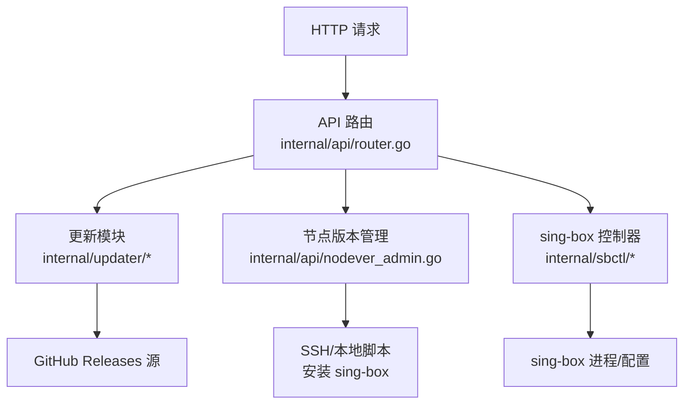
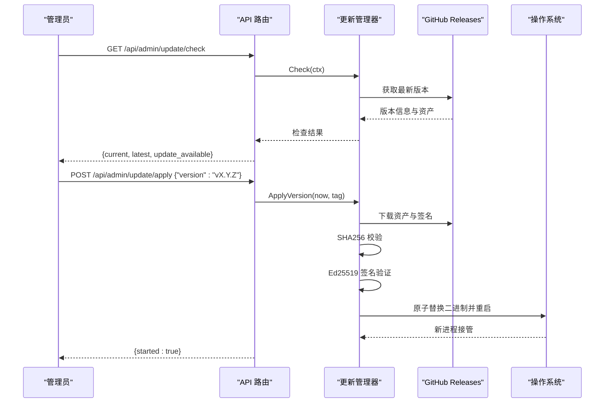
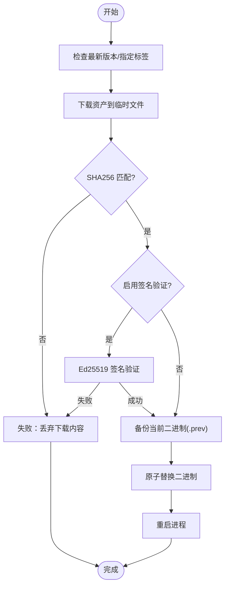
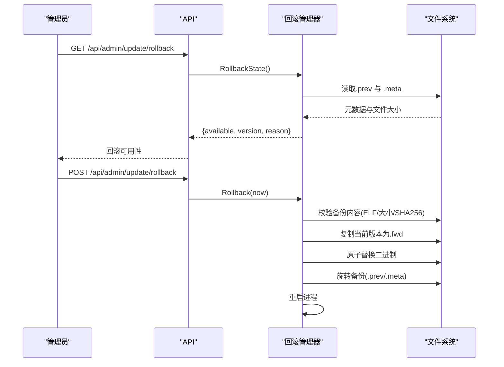
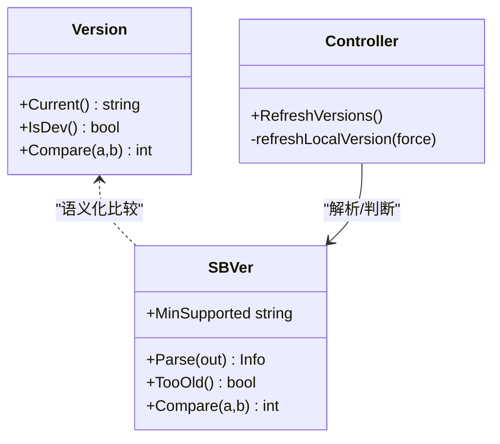
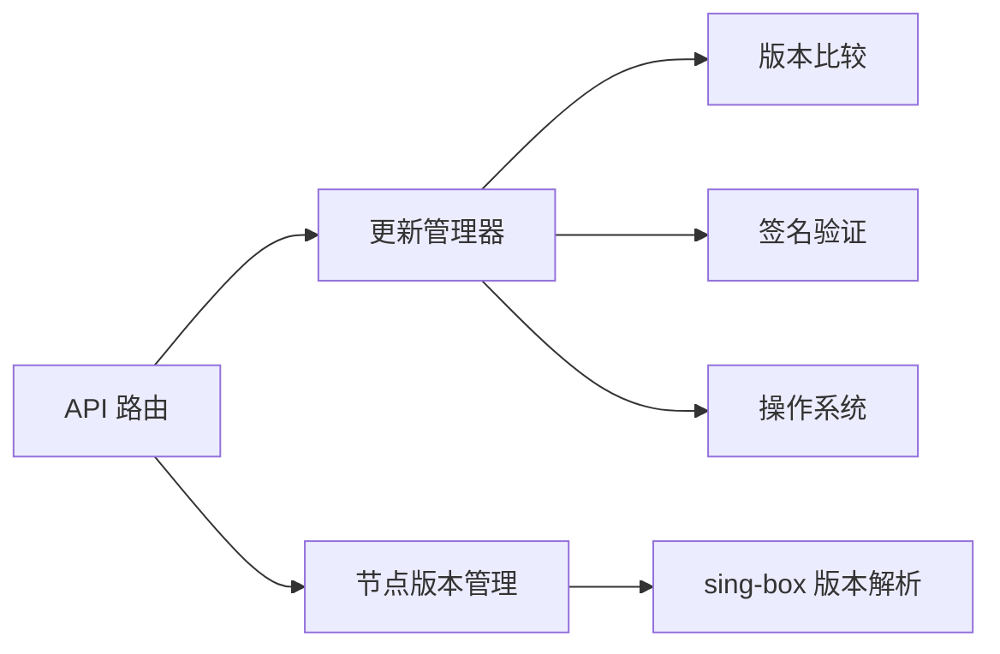

# 版本控制系统

<cite>
**本文引用的文件**
- [main.go](file://main.go)
- [router.go](file://internal/api/router.go)
- [update_admin.go](file://internal/api/update_admin.go)
- [nodever_admin.go](file://internal/api/nodever_admin.go)
- [updater.go](file://internal/updater/updater.go)
- [verify.go](file://internal/updater/verify.go)
- [rollback.go](file://internal/updater/rollback.go)
- [backupmeta.go](file://internal/updater/backupmeta.go)
- [version.go](file://internal/version/version.go)
- [sbver.go](file://internal/sbver/sbver.go)
- [version.go](file://internal/sbctl/version.go)
</cite>

## 目录
1. [简介](#简介)
2. [项目结构](#项目结构)
3. [核心组件](#核心组件)
4. [架构总览](#架构总览)
5. [详细组件分析](#详细组件分析)
6. [依赖关系分析](#依赖关系分析)
7. [性能与可靠性](#性能与可靠性)
8. [故障排查指南](#故障排查指南)
9. [结论](#结论)
10. [附录：API 接口说明](#附录api-接口说明)

## 简介
本系统提供面板自身的在线更新、回滚，以及节点（sing-box）版本的检测、升级能力。它围绕“发布—分发—安装—回滚”的完整生命周期构建，包含版本兼容性检查、签名校验、安全限制、自动更新流程与手动升级机制，并提供完整的监控与告警入口。灰度发布与 A/B 测试方面，当前代码库未实现按用户或节点的灰度分流策略；可通过外部网关或负载均衡器配合版本标签进行灰度控制。

## 项目结构
- 入口与启动：主进程负责加载配置、初始化存储、邮件服务、sing-box 控制器、后台任务与 HTTP 服务器。
- API 路由：集中注册管理端点，包括更新检查、列表、应用、状态、回滚，以及 sing-box 节点版本管理与一键升级。
- 更新器：从 GitHub Releases 拉取最新发行版，执行下载、完整性校验、可选签名验证、原子替换二进制并重启自身。
- 回滚器：基于本地备份的二进制进行一键回滚，支持可逆旋转与元数据记录。
- 版本工具：面板版本比较、sing-box 版本解析与最低兼容要求判断。
- 控制器：定时刷新 sing-box 版本信息，支持远程节点探测与本地缓存。

图表来源
- [router.go:132-230](file://internal/api/router.go#L132-L230)
- [updater.go:94-121](file://internal/updater/updater.go#L94-L121)
- [nodever_admin.go:172-223](file://internal/api/nodever_admin.go#L172-L223)
- [version.go:56-75](file://internal/sbctl/version.go#L56-L75)

章节来源
- [main.go:25-142](file://main.go#L25-L142)
- [router.go:132-230](file://internal/api/router.go#L132-L230)

## 核心组件
- 更新管理器（Updater Manager）：协调检查、下载、校验、安装、重启全流程，维护进度状态机。
- 签名与完整性校验：SHA256 摘要 + Ed25519 离线签名验证，确保二进制来源可信且传输完整。
- 回滚管理器：基于 .prev 备份与元数据侧车文件，提供一键回滚与可逆旋转。
- 版本比较与兼容性：面板版本比较、sing-box 最低版本要求与 TooOld 判定。
- 节点版本管理：查询各节点 sing-box 版本、触发重新检测、一键升级（本地或远程）。

章节来源
- [updater.go:94-121](file://internal/updater/updater.go#L94-L121)
- [verify.go:14-35](file://internal/updater/verify.go#L14-L35)
- [rollback.go:23-32](file://internal/updater/rollback.go#L23-L32)
- [version.go:18-26](file://internal/version/version.go#L18-L26)
- [sbver.go:16-22](file://internal/sbver/sbver.go#L16-L22)
- [nodever_admin.go:62-87](file://internal/api/nodever_admin.go#L62-L87)

## 架构总览
下图展示了管理员通过 Web UI 发起更新检查、选择版本、下载安装、回滚的端到端流程，以及与 GitHub Releases 和签名的交互。

图表来源
- [router.go:225-230](file://internal/api/router.go#L225-L230)
- [update_admin.go:15-90](file://internal/api/update_admin.go#L15-L90)
- [updater.go:314-409](file://internal/updater/updater.go#L314-L409)
- [verify.go:42-62](file://internal/updater/verify.go#L42-L62)

## 详细组件分析

### 更新管理器（在线自更新）
- 功能要点
  - 检查最新版本：对比运行版本与 GitHub 最新发布，返回是否可更新。
  - 列出可用版本：支持选择特定标签（pinned），避免“静默降级”。
  - 应用更新：下载、SHA256 校验、可选签名验证、原子替换、重启。
  - 状态查询：实时进度、目标版本、开始时间。
- 安全与健壮性
  - 仅 Linux 支持自更新与回滚；其他平台提示手动替换。
  - 资产大小上限保护磁盘空间。
  - 失败时自动恢复旧版本（重启失败路径）。
  - 严格版本号格式校验，防止注入。
- 关键流程
  - 下载 → 校验 → 签名 → 备份 → 替换 → 重启。

图表来源
- [updater.go:368-576](file://internal/updater/updater.go#L368-L576)
- [verify.go:134-146](file://internal/updater/verify.go#L134-L146)
- [backupmeta.go:49-67](file://internal/updater/backupmeta.go#L49-L67)

章节来源
- [updater.go:314-409](file://internal/updater/updater.go#L314-L409)
- [updater.go:418-576](file://internal/updater/updater.go#L418-L576)
- [verify.go:42-62](file://internal/updater/verify.go#L42-L62)
- [verify.go:134-146](file://internal/updater/verify.go#L134-L146)

### 回滚机制（本地一键回滚）
- 功能要点
  - 检测是否存在可用的上一个版本（.prev）及元数据。
  - 回滚前进行浅层与深度校验（ELF 头、大小、SHA256）。
  - 将当前版本保存为新的回滚目标，形成可逆旋转。
  - 原子替换并重启，失败时尽力恢复。
- 元数据侧车
  - 记录版本、SHA256、大小，用于一致性校验。
  - 缺失元数据时降级为浅层校验，保证向后兼容。

图表来源
- [rollback.go:47-104](file://internal/updater/rollback.go#L47-L104)
- [rollback.go:106-193](file://internal/updater/rollback.go#L106-L193)
- [backupmeta.go:89-154](file://internal/updater/backupmeta.go#L89-L154)

章节来源
- [rollback.go:47-104](file://internal/updater/rollback.go#L47-L104)
- [rollback.go:106-193](file://internal/updater/rollback.go#L106-L193)
- [backupmeta.go:89-154](file://internal/updater/backupmeta.go#L89-L154)

### 版本兼容性检查与依赖管理
- 面板版本比较
  - 忽略 v/V 前缀与预发布后缀，逐段数值比较。
  - 开发构建视为“未知”，允许升级到任意标签版本。
- sing-box 版本兼容
  - 解析 `sing-box version` 输出，提取版本与特性标记。
  - 定义最低支持版本，TooOld 表示无法部署配置。
  - 定期刷新本地与远程节点版本，支持强制刷新。

图表来源
- [version.go:18-26](file://internal/version/version.go#L18-L26)
- [version.go:28-54](file://internal/version/version.go#L28-L54)
- [sbver.go:16-22](file://internal/sbver/sbver.go#L16-L22)
- [sbver.go:40-56](file://internal/sbver/sbver.go#L40-L56)
- [sbver.go:82-90](file://internal/sbver/sbver.go#L82-L90)
- [version.go:56-75](file://internal/sbctl/version.go#L56-L75)

章节来源
- [version.go:18-26](file://internal/version/version.go#L18-L26)
- [version.go:28-54](file://internal/version/version.go#L28-L54)
- [sbver.go:16-22](file://internal/sbver/sbver.go#L16-L22)
- [sbver.go:40-56](file://internal/sbver/sbver.go#L40-L56)
- [sbver.go:82-90](file://internal/sbver/sbver.go#L82-L90)
- [version.go:56-75](file://internal/sbctl/version.go#L56-L75)

### 灰度发布与 A/B 测试支持
- 现状
  - 代码库未内置按用户/节点维度的灰度或 A/B 分流逻辑。
- 建议实践
  - 使用外部网关/负载均衡器，根据域名、Header、Cookie 或用户组将流量导向不同版本实例。
  - 结合 GitHub Releases 标签与容器镜像标签，在编排层实现灰度与回滚。
  - 通过监控系统观察新版本指标，逐步放量。

[本节为概念性说明，不直接分析具体文件]

### 版本签名验证与安全
- 完整性校验
  - 下载过程中计算 SHA256，与 GitHub 发布的 digest 比对。
  - 限制资产最大体积，防止资源耗尽攻击。
- 来源可信
  - 编译时注入 Ed25519 公钥，验证发布签名。
  - 无公钥时（源码构建）不强制签名，但官方发布二进制会强制。
- 安全边界
  - 版本号格式白名单校验，防止路径注入。
  - 仅 Linux 支持自更新与回滚，跨平台走手动流程。

章节来源
- [updater.go:451-516](file://internal/updater/updater.go#L451-L516)
- [verify.go:14-35](file://internal/updater/verify.go#L14-L35)
- [verify.go:42-62](file://internal/updater/verify.go#L42-L62)
- [verify.go:134-146](file://internal/updater/verify.go#L134-L146)

### 自动更新与手动升级
- 自动更新
  - 管理员触发后，后台异步执行，前端轮询状态。
  - 支持选择特定版本（pinned），避免静默降级。
- 手动升级
  - 非 Linux 环境提示手动替换二进制。
  - 提供 sing-box 一键安装脚本，支持本地与远程节点。

章节来源
- [update_admin.go:15-90](file://internal/api/update_admin.go#L15-L90)
- [nodever_admin.go:172-223](file://internal/api/nodever_admin.go#L172-L223)
- [nodever_admin.go:255-271](file://internal/api/nodever_admin.go#L255-L271)

### 版本监控与告警
- 版本探测
  - 定时刷新本地与远程节点 sing-box 版本，支持强制刷新。
  - 记录错误信息，便于界面展示诊断。
- 监控与告警
  - 提供监控仪表盘与告警接口，可用于观测更新/升级结果与异常。
  - 结合外部告警系统对失败事件进行通知。

章节来源
- [version.go:56-75](file://internal/sbctl/version.go#L56-L75)
- [router.go:316-322](file://internal/api/router.go#L316-L322)

## 依赖关系分析
- 组件耦合
  - API 路由依赖更新管理器与 sing-box 控制器。
  - 更新管理器依赖版本比较与签名验证模块。
  - 节点版本管理依赖 SSH/脚本执行与 sing-box 版本解析。
- 外部依赖
  - GitHub Releases API（带速率限制与 Token 支持）。
  - 操作系统文件操作（Linux 原子替换与重命名）。
- 潜在风险
  - 网络不可达导致更新失败（需重试与超时控制）。
  - 磁盘空间不足导致下载/备份失败（有大小限制与错误处理）。
  - 权限问题导致替换失败（需要可写路径与执行权限）。

图表来源
- [router.go:132-230](file://internal/api/router.go#L132-L230)
- [updater.go:94-121](file://internal/updater/updater.go#L94-L121)
- [nodever_admin.go:62-87](file://internal/api/nodever_admin.go#L62-L87)
- [version.go:18-26](file://internal/version/version.go#L18-L26)
- [verify.go:42-62](file://internal/updater/verify.go#L42-L62)
- [sbver.go:40-56](file://internal/sbver/sbver.go#L40-L56)

章节来源
- [router.go:132-230](file://internal/api/router.go#L132-L230)
- [updater.go:94-121](file://internal/updater/updater.go#L94-L121)
- [nodever_admin.go:62-87](file://internal/api/nodever_admin.go#L62-L87)

## 性能与可靠性
- 性能
  - 下载过程流式写入并计算哈希，避免全量内存占用。
  - 进度更新节流，减少频繁状态写入。
  - 版本探测使用 TTL 缓存，降低重复开销。
- 可靠性
  - 原子替换与备份机制，确保失败可恢复。
  - 严格的输入校验与资源限制，防止恶意或异常输入。
  - 后台任务超时与上下文取消，避免长时间阻塞。

[本节提供通用指导，不直接分析具体文件]

## 故障排查指南
- 更新失败
  - 检查网络连通性与 GitHub API 速率限制。
  - 查看状态接口返回的错误消息与进度。
  - 确认资产大小与签名是否匹配。
- 回滚不可用
  - 检查 .prev 与 .meta 是否存在且完整。
  - 确认 ELF 头与大小符合预期。
  - 若元数据缺失，尝试重新执行一次更新以生成备份。
- 节点升级失败
  - 确认 SSH 凭据配置正确。
  - 查看升级作业的输出与错误信息。
  - 对于只读文件系统，参考提示信息手动执行安装脚本。

章节来源
- [update_admin.go:15-90](file://internal/api/update_admin.go#L15-L90)
- [rollback.go:47-104](file://internal/updater/rollback.go#L47-L104)
- [nodever_admin.go:172-223](file://internal/api/nodever_admin.go#L172-L223)

## 结论
本版本控制系统提供了完善的在线更新、回滚与节点版本管理能力，具备严格的完整性与签名校验、安全的输入与资源限制、可靠的原子替换与备份机制。虽然未内置灰度与 A/B 测试，但可通过外部基础设施灵活实现。建议在生产环境中启用签名验证、合理设置超时与重试策略，并结合监控系统及时发现问题。

[本节为总结，不直接分析具体文件]

## 附录：API 接口说明
以下接口均位于管理端（需管理员权限），用于版本管理的核心操作。

- 更新检查
  - 方法：GET
  - 路径：/api/admin/update/check
  - 描述：查询最新版本并判断是否可更新。
  - 响应：包含当前版本、最新版本、是否可更新、资产信息等。
  - 章节来源
    - [router.go:225](file://internal/api/router.go#L225)
    - [update_admin.go:15-28](file://internal/api/update_admin.go#L15-L28)

- 更新状态
  - 方法：GET
  - 路径：/api/admin/update/status
  - 描述：轮询当前更新任务的进度与目标版本。
  - 响应：状态、消息、百分比、目标版本、开始时间、当前版本。
  - 章节来源
    - [router.go:226](file://internal/api/router.go#L226)
    - [update_admin.go:30-47](file://internal/api/update_admin.go#L30-L47)

- 版本列表
  - 方法：GET
  - 路径：/api/admin/update/releases
  - 描述：列出最近的可安装版本，支持选择特定标签。
  - 响应：当前版本与版本列表（含标签、发布时间、是否可下载等）。
  - 章节来源
    - [router.go:227](file://internal/api/router.go#L227)
    - [update_admin.go:49-65](file://internal/api/update_admin.go#L49-L65)

- 应用更新
  - 方法：POST
  - 路径：/api/admin/update/apply
  - 描述：触发下载、校验、安装与重启流程；可选传入版本标签。
  - 请求体：{ "version": "vX.Y.Z" }（为空表示最新）
  - 响应：{ "started": true, "version": "..." }
  - 章节来源
    - [router.go:230](file://internal/api/router.go#L230)
    - [update_admin.go:67-90](file://internal/api/update_admin.go#L67-L90)

- 回滚状态
  - 方法：GET
  - 路径：/api/admin/update/rollback
  - 描述：查询是否可回滚及上一个版本信息。
  - 响应：{ "available": bool, "version": "...", "reason": "..." }
  - 章节来源
    - [router.go:228](file://internal/api/router.go#L228)
    - [update_admin.go:92-100](file://internal/api/update_admin.go#L92-L100)

- 执行回滚
  - 方法：POST
  - 路径：/api/admin/update/rollback
  - 描述：将上一个版本替换为当前运行版本并重启。
  - 响应：{ "started": true }
  - 章节来源
    - [router.go:229](file://internal/api/router.go#L229)
    - [update_admin.go:102-115](file://internal/api/update_admin.go#L102-L115)

- 节点版本列表
  - 方法：GET
  - 路径：/api/admin/nodes/singbox
  - 描述：列出所有节点（含本机）的 sing-box 版本与兼容性。
  - 响应：节点列表、最小支持版本等。
  - 章节来源
    - [router.go:222](file://internal/api/router.go#L222)
    - [nodever_admin.go:62-87](file://internal/api/nodever_admin.go#L62-L87)

- 刷新节点版本
  - 方法：POST
  - 路径：/api/admin/nodes/singbox/refresh
  - 描述：立即重新探测所有节点的 sing-box 版本。
  - 响应：{ "started": true }
  - 章节来源
    - [router.go:223](file://internal/api/router.go#L223)
    - [nodever_admin.go:107-117](file://internal/api/nodever_admin.go#L107-L117)

- 节点升级
  - 方法：POST
  - 路径：/api/admin/nodes/{id}/singbox/upgrade
  - 描述：对指定节点（含本机）执行 sing-box 一键升级。
  - 响应：{ "started": true }
  - 章节来源
    - [router.go:224](file://internal/api/router.go#L224)
    - [nodever_admin.go:172-223](file://internal/api/nodever_admin.go#L172-L223)
