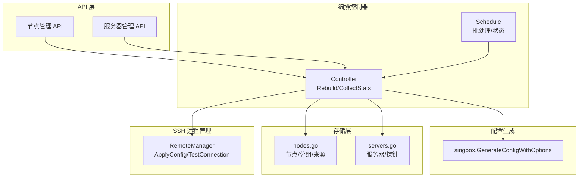
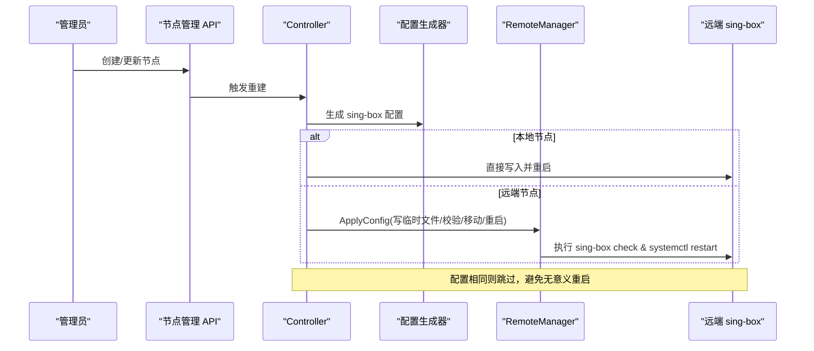
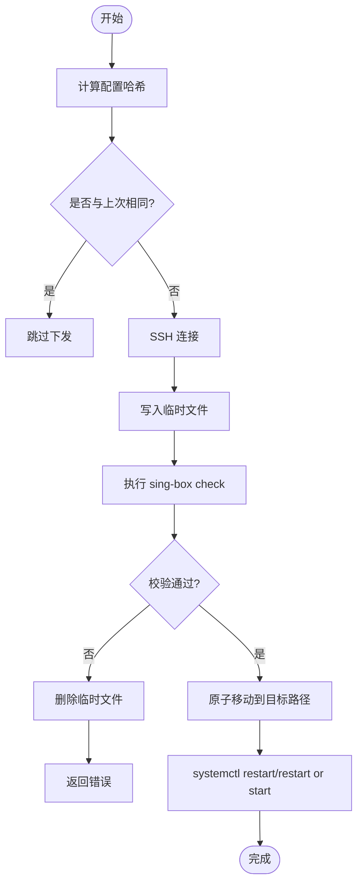
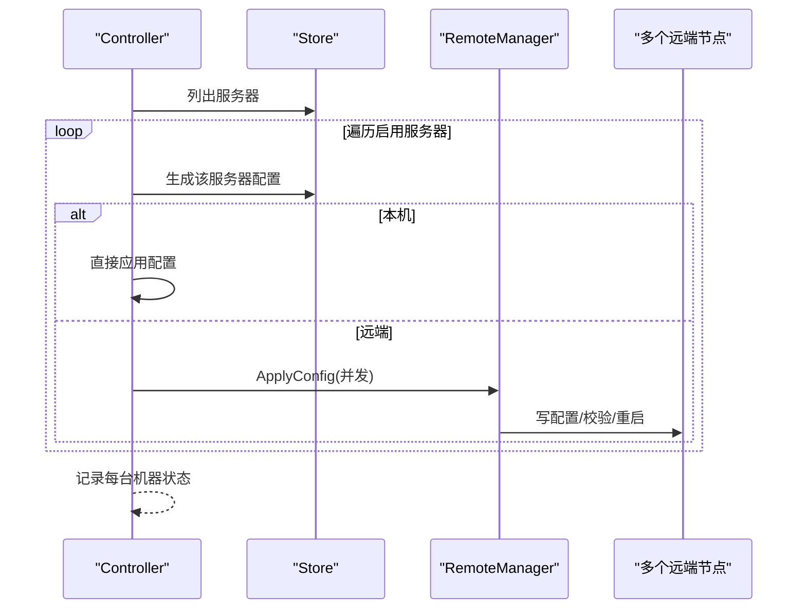
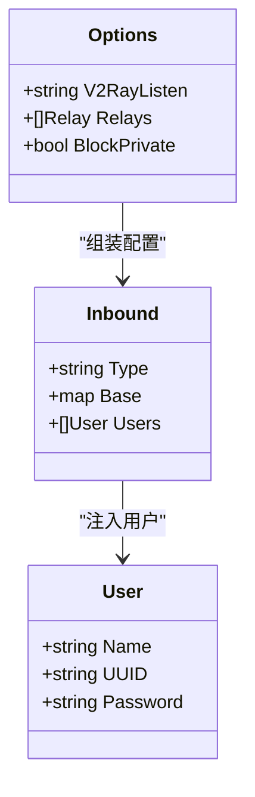
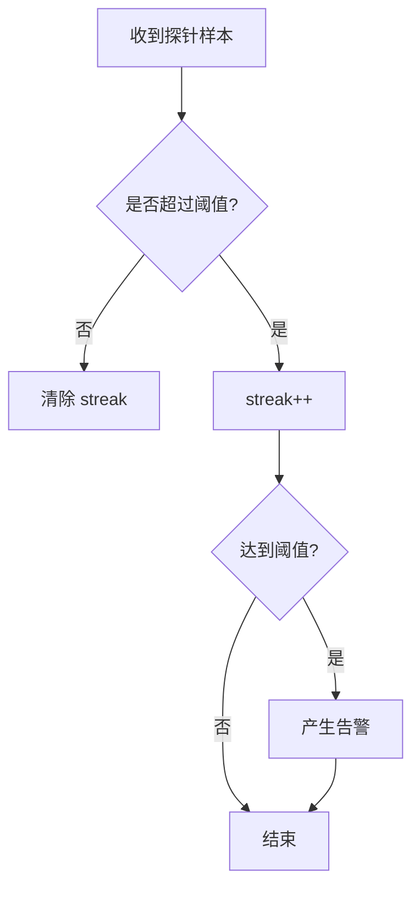
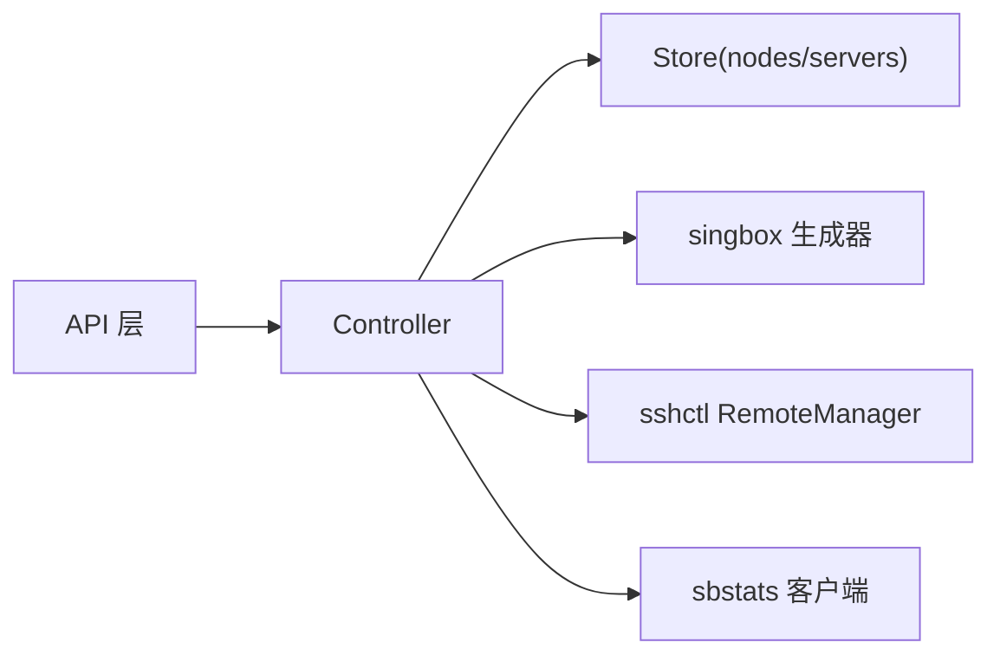

# 节点部署管理

<cite>
**本文引用的文件**
- [remote.go](file://internal/sshctl/remote.go)
- [controller.go](file://internal/sbctl/controller.go)
- [nodes.go](file://internal/store/nodes.go)
- [servers.go](file://internal/store/servers.go)
- [generate.go](file://internal/singbox/generate.go)
- [nodes_admin.go](file://internal/api/nodes_admin.go)
- [nodehost_admin.go](file://internal/api/nodehost_admin.go)
- [schedule.go](file://internal/sbctl/schedule.go)
- [alerts.go](file://internal/store/alerts.go)
</cite>

## 目录
1. [简介](#简介)
2. [项目结构](#项目结构)
3. [核心组件](#核心组件)
4. [架构总览](#架构总览)
5. [详细组件分析](#详细组件分析)
6. [依赖关系分析](#依赖关系分析)
7. [性能考虑](#性能考虑)
8. [故障排查指南](#故障排查指南)
9. [结论](#结论)
10. [附录：API 接口说明](#附录api-接口说明)

## 简介
本文件面向“轻舟”系统的节点部署管理能力，覆盖从节点注册、配置生成与校验、SSH 远程连接建立、配置文件下发到服务重启的全生命周期；解释 self_built（自建入站）与 external（外部订阅节点）两类节点的差异；阐述健康检查与告警机制；提供批量部署策略与并发控制说明；并给出节点管理的 API 接口清单与分组排序机制。目标是帮助开发者快速理解并扩展节点部署能力，同时提供可操作的优化建议。

## 项目结构
围绕节点部署的关键代码分布在以下模块：
- SSH 远程管理：通过 SSH 安全地连接远端 sing-box 节点，完成配置写入、校验与服务重启。
- 编排控制器：负责按用户授权生成 sing-box 配置，并在本地或远端应用配置。
- 存储层：持久化节点、服务器、分组等元数据，以及节点来源（self_built/external）。
- 配置生成器：将用户、入站、出站、路由等拼装为 sing-box 配置 JSON。
- API 层：提供节点、分组、订阅源的管理接口。
- 调度器：对全量重建进行批处理与状态上报。

图表来源
- [controller.go:353-455](file://internal/sbctl/controller.go#L353-L455)
- [generate.go:164-295](file://internal/singbox/generate.go#L164-L295)
- [nodes.go:98-160](file://internal/store/nodes.go#L98-L160)
- [servers.go:86-156](file://internal/store/servers.go#L86-L156)
- [remote.go:251-307](file://internal/sshctl/remote.go#L251-L307)

章节来源
- [controller.go:353-455](file://internal/sbctl/controller.go#L353-L455)
- [nodes.go:98-160](file://internal/store/nodes.go#L98-L160)
- [servers.go:86-156](file://internal/store/servers.go#L86-L156)
- [generate.go:164-295](file://internal/singbox/generate.go#L164-L295)
- [remote.go:251-307](file://internal/sshctl/remote.go#L251-L307)

## 核心组件
- RemoteManager：封装 SSH 连接、认证、主机密钥校验、远程命令执行、配置文件写入与验证、服务重启。
- Controller：协调配置生成与应用，支持本地直接应用与通过 SSH 应用到远端节点；周期性收集用量并触发重建。
- Store（nodes/servers）：持久化节点、服务器、分组、来源等数据，并提供查询与更新方法。
- singbox 配置生成：根据入站、用户、出站、路由等生成 sing-box 配置，支持 v2ray_api 统计开关、私有地址拦截、DNS 劫持保护等。
- Schedule：对全量重建进行批处理合并、并发执行与状态记录。

章节来源
- [remote.go:98-139](file://internal/sshctl/remote.go#L98-L139)
- [controller.go:60-141](file://internal/sbctl/controller.go#L60-L141)
- [nodes.go:11-23](file://internal/store/nodes.go#L11-L23)
- [servers.go:22-56](file://internal/store/servers.go#L22-L56)
- [generate.go:137-162](file://internal/singbox/generate.go#L137-L162)
- [schedule.go:10-27](file://internal/sbctl/schedule.go#L10-L27)

## 架构总览
节点部署的核心流程如下：
- 管理员通过 API 创建/更新节点（self_built 或 external），系统记录到数据库。
- 编排控制器在保存后触发重建：生成 sing-box 配置，本地直接应用或通过 SSH 下发到远端节点。
- 远端节点接收配置后，先校验再替换并重启服务，确保配置变更原子性与安全性。
- 周期性任务收集各节点用量并再次重建，以及时剔除超配额用户。
- 健康检查与告警基于探针数据与连续阈值判断，避免抖动误报。

图表来源
- [nodes_admin.go:48-109](file://internal/api/nodes_admin.go#L48-L109)
- [controller.go:353-455](file://internal/sbctl/controller.go#L353-L455)
- [remote.go:251-307](file://internal/sshctl/remote.go#L251-L307)

## 详细组件分析

### SSH 远程管理与配置下发
- 连接与安全：
  - 支持私钥与密码两种认证方式，首次连接采用 TOFU 信任并持久化主机密钥，后续连接严格比对，防止 MITM。
  - 连接超时与上下文取消，避免长时间阻塞。
- 配置下发流程：
  - 计算配置哈希，若与上次成功应用一致则跳过，减少不必要的重启。
  - 写入临时文件，执行 sing-box check 校验通过后原子移动至目标路径，最后重启 systemd 单元。
  - 失败时清理临时文件，保证运行中配置不被破坏。
- 诊断与探测：
  - TestConnection 获取远端 sing-box 版本，SupportsStatsAPI 检测是否包含 v2ray_api 插件，用于决定是否注入统计块。
  - ListRemoteConfigFiles/ReadRemoteConfigAtPath/ReadRemoteConfig 辅助定位与读取远端配置文件。

图表来源
- [remote.go:251-307](file://internal/sshctl/remote.go#L251-L307)
- [remote.go:577-608](file://internal/sshctl/remote.go#L577-L608)

章节来源
- [remote.go:145-207](file://internal/sshctl/remote.go#L145-L207)
- [remote.go:251-307](file://internal/sshctl/remote.go#L251-L307)
- [remote.go:323-363](file://internal/sshctl/remote.go#L323-L363)
- [remote.go:381-541](file://internal/sshctl/remote.go#L381-L541)

### 编排控制器与批量重建
- 重建逻辑：
  - 构建用户授权映射，生成本地与每个启用服务器的 sing-box 配置。
  - 本地服务器直接应用；远端服务器通过 SSH 并发下发，单个不可达节点不会阻塞其他节点。
  - 每次重建记录每台机器的结果，便于 UI 展示具体失败原因。
- 并发与超时：
  - 每个远端应用的上下文设置 90 秒超时，避免半开连接长期占用。
  - 使用 WaitGroup 等待所有远端任务完成。
- 用量采集：
  - 周期性地从本地与各远端节点通过 SSH 隧道拉取 per-user 用量，聚合后写入数据库，随后触发重建以执行配额限制。

图表来源
- [controller.go:353-455](file://internal/sbctl/controller.go#L353-L455)
- [controller.go:548-649](file://internal/sbctl/controller.go#L548-L649)

章节来源
- [controller.go:353-455](file://internal/sbctl/controller.go#L353-L455)
- [controller.go:548-649](file://internal/sbctl/controller.go#L548-L649)

### 配置生成与特性
- 基础模板与入站注入：
  - 默认日志、DNS、出站与路由模板，动态注入 inbounds 与 users。
  - 对 mixed 入站空用户列表进行保护，避免暴露未认证代理。
- 统计与插件：
  - 当远端 sing-box 具备 v2ray_api 插件时，注入 experimental.v2ray_api.stats 并开启 per-user 统计。
  - 控制器会探测远端能力并缓存结果，避免无效探测。
- 安全规则：
  - 注入私有地址拦截规则，防止代理流量访问本地回环与云元数据。
  - 在 UDP 阻断出口场景下自动注入 DNS 劫持规则，避免客户端因 UDP 阻断导致解析失败。

图表来源
- [generate.go:137-162](file://internal/singbox/generate.go#L137-L162)
- [generate.go:164-295](file://internal/singbox/generate.go#L164-L295)

章节来源
- [generate.go:137-162](file://internal/singbox/generate.go#L137-L162)
- [generate.go:164-295](file://internal/singbox/generate.go#L164-L295)
- [generate.go:225-328](file://internal/singbox/generate.go#L225-L328)
- [generate.go:407-468](file://internal/singbox/generate.go#L407-L468)

### 节点类型差异：self_built 与 external
- self_built（自建入站）：
  - 由系统在控制面板生成 sing-box 入站，绑定到特定 inbound_tag，用户授权后注入配置。
  - 共享名称映射用于订阅备注显示，排序影响订阅顺序。
- external（外部订阅节点）：
  - 来自外部订阅源（机场链接），仅作为 share_link 存在，不参与控制面板的入站生成。
  - 导入时解析协议与名称，并归入分组，供订阅渲染与用户选择。

章节来源
- [nodes.go:11-23](file://internal/store/nodes.go#L11-L23)
- [nodes.go:72-96](file://internal/store/nodes.go#L72-L96)
- [nodes.go:508-547](file://internal/store/nodes.go#L508-L547)

### 健康检查与告警机制
- 探针数据：
  - 服务器行包含探针开关、令牌、过期时间等字段，用于上报 CPU/内存/带宽等指标。
- 连续阈值与防抖：
  - 使用 streak 计数器累计连续异常样本，达到阈值才告警；条件恢复时清零，避免抖动累积。
  - 删除服务器时清理其 streak，防止残留计数。
- 本地节点监控：
  - 面板自身也作为本地节点被监控，避免面板所在机器磁盘爆满等风险。

图表来源
- [alerts.go:61-97](file://internal/store/alerts.go#L61-L97)
- [alerts.go:218-245](file://internal/store/alerts.go#L218-L245)

章节来源
- [servers.go:22-56](file://internal/store/servers.go#L22-L56)
- [alerts.go:61-97](file://internal/store/alerts.go#L61-L97)
- [alerts.go:218-245](file://internal/store/alerts.go#L218-L245)

### 批量部署策略与并发控制
- 全量重建：
  - ScheduleRebuild 触发一次全量重建，内部串行化并记录每机状态；支持合并突发请求，减少重复执行。
- 并发下发：
  - Rebuild 中对远端节点并发调用 ApplyConfig，单节点失败不影响其他节点。
- 超时与资源回收：
  - 远端应用设置 90 秒超时；SSH 会话与隧道在完成后关闭，避免进程泄漏。

章节来源
- [schedule.go:10-27](file://internal/sbctl/schedule.go#L10-L27)
- [schedule.go:73-115](file://internal/sbctl/schedule.go#L73-L115)
- [controller.go:391-455](file://internal/sbctl/controller.go#L391-L455)
- [controller.go:596-649](file://internal/sbctl/controller.go#L596-L649)

## 依赖关系分析
- 控制器依赖：
  - Store：读取服务器、节点、用户授权信息。
  - singbox：生成配置。
  - sshctl：远端应用配置。
  - sbstats：拉取用量（本地与远端）。
- 存储层依赖：
  - nodes.go：节点、分组、来源 CRUD 与排序。
  - servers.go：服务器元数据、探针、密钥与可见性。
- API 层依赖：
  - nodes_admin.go：节点与分组管理接口。
  - nodehost_admin.go：节点对外地址探测与建议。

图表来源
- [controller.go:60-141](file://internal/sbctl/controller.go#L60-L141)
- [nodes.go:98-160](file://internal/store/nodes.go#L98-L160)
- [servers.go:86-156](file://internal/store/servers.go#L86-L156)
- [nodes_admin.go:48-109](file://internal/api/nodes_admin.go#L48-L109)

章节来源
- [controller.go:60-141](file://internal/sbctl/controller.go#L60-L141)
- [nodes.go:98-160](file://internal/store/nodes.go#L98-L160)
- [servers.go:86-156](file://internal/store/servers.go#L86-L156)
- [nodes_admin.go:48-109](file://internal/api/nodes_admin.go#L48-L109)

## 性能考虑
- 配置去重：
  - 通过 SHA-256 哈希比较，避免重复写入与重启，降低节点抖动。
- 并发与超时：
  - 远端应用并发执行，单节点失败不阻塞整体；设置合理超时避免长连接堆积。
- 统计采样：
  - 仅对具备 v2ray_api 插件的节点注入统计块，减少无效探测与连接失败日志。
- DNS 与 UDP 阻断：
  - 自动注入 DNS 劫持规则，避免 UDP 阻断导致的解析失败，提升用户体验。
- 资源释放：
  - SSH 会话与隧道在完成后立即关闭，避免远端进程泄漏。

章节来源
- [remote.go:251-307](file://internal/sshctl/remote.go#L251-L307)
- [controller.go:391-455](file://internal/sbctl/controller.go#L391-L455)
- [controller.go:596-649](file://internal/sbctl/controller.go#L596-L649)
- [generate.go:225-328](file://internal/singbox/generate.go#L225-L328)

## 故障排查指南
- SSH 连接失败：
  - 检查主机密钥是否匹配（TOFU 后严格比对），确认私钥/密码配置正确。
  - 查看 TestConnection 输出，确认 sing-box 二进制是否存在且可执行。
- 配置校验失败：
  - 查看 sing-box check 输出，修正配置错误后再下发。
- 服务重启失败：
  - 检查 systemd 单元名与权限，确认重启命令输出。
- 统计不可用：
  - 确认远端 sing-box 是否包含 v2ray_api 插件；控制器会缓存探测结果，必要时重新编辑节点触发重探。
- 告警频繁：
  - 调整连续阈值（streak），避免抖动误报；检查探针是否正常上报。

章节来源
- [remote.go:145-207](file://internal/sshctl/remote.go#L145-L207)
- [remote.go:323-363](file://internal/sshctl/remote.go#L323-L363)
- [remote.go:577-608](file://internal/sshctl/remote.go#L577-L608)
- [alerts.go:61-97](file://internal/store/alerts.go#L61-L97)

## 结论
本系统通过 SSH 安全下发与原子替换实现节点配置的可靠部署；编排控制器统一协调配置生成与应用，支持本地与远端并发下发；健康检查与告警机制结合连续阈值与探针数据，有效避免误报；API 层提供完整的节点与分组管理能力。开发者可在此基础上扩展更多节点类型与部署策略，并通过合理的并发与超时控制保障系统稳定性。

## 附录：API 接口说明
以下为节点相关的主要 API 接口（管理员端）：
- 节点管理
  - 列表节点：GET /api/admin/nodes
  - 创建节点：POST /api/admin/nodes
  - 更新节点：PUT /api/admin/nodes/{id}
  - 删除节点：DELETE /api/admin/nodes/{id}
  - 导入节点：POST /api/admin/nodes/import
  - 重排序：POST /api/admin/nodes/reorder
- 分组管理
  - 列表分组：GET /api/admin/groups
  - 创建分组：POST /api/admin/groups
  - 更新分组：PUT /api/admin/groups/{id}
  - 删除分组：DELETE /api/admin/groups/{id}
- 订阅源管理
  - 列表源：GET /api/admin/node-sources
  - 创建源：POST /api/admin/node-sources
  - 更新源：PUT /api/admin/node-sources/{id}
  - 删除源：DELETE /api/admin/node-sources/{id}
  - 抓取源：POST /api/admin/node-sources/{id}/fetch
- 节点对外地址探测
  - 探测候选：GET /api/admin/settings/detect-node-host

章节来源
- [nodes_admin.go:19-109](file://internal/api/nodes_admin.go#L19-L109)
- [nodes_admin.go:137-200](file://internal/api/nodes_admin.go#L137-L200)
- [nodes_admin.go:215-354](file://internal/api/nodes_admin.go#L215-L354)
- [nodehost_admin.go:52-68](file://internal/api/nodehost_admin.go#L52-L68)
