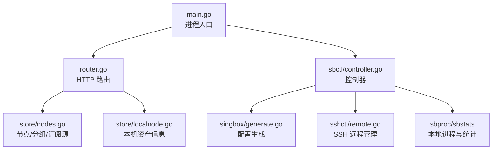
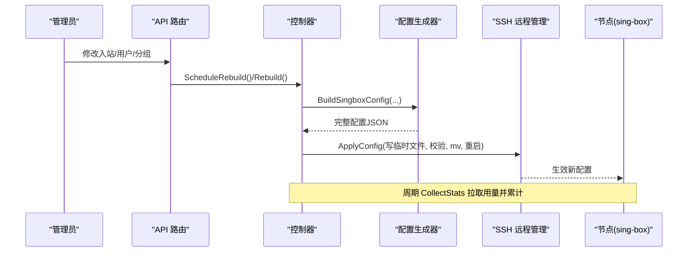
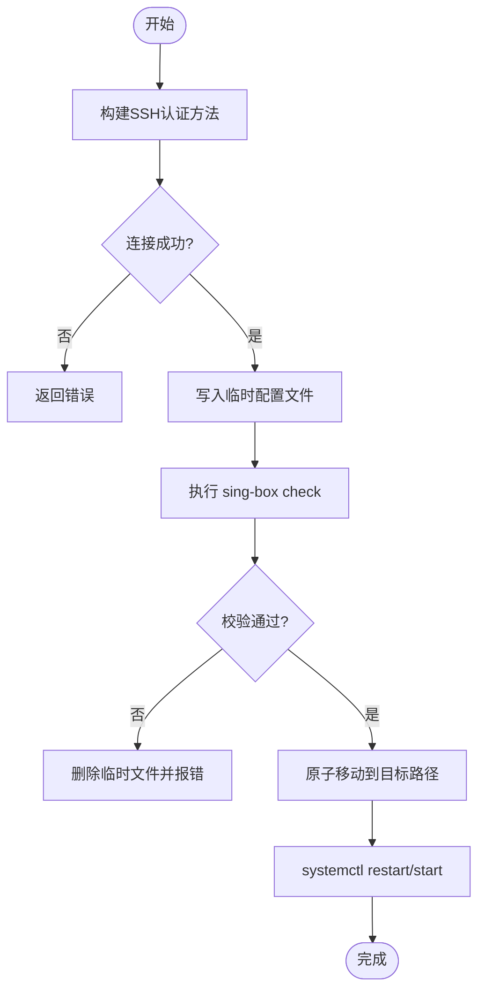
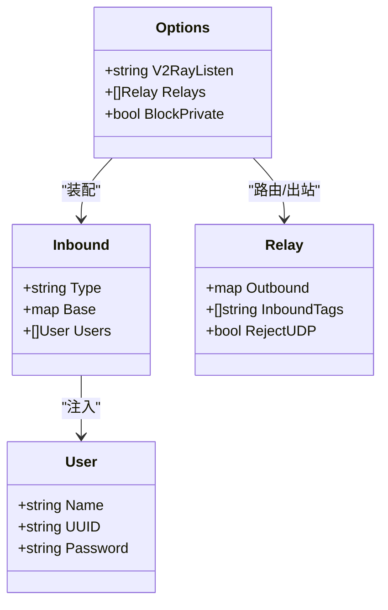
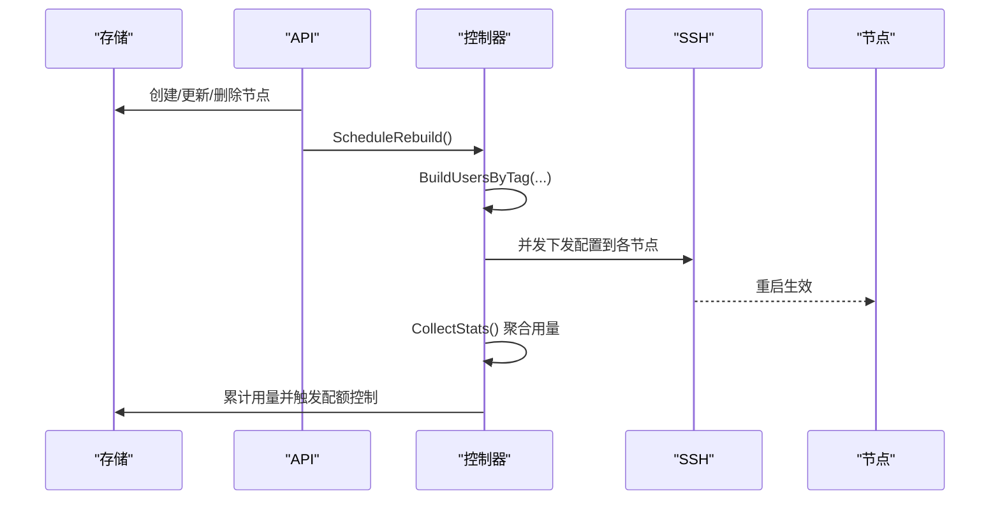
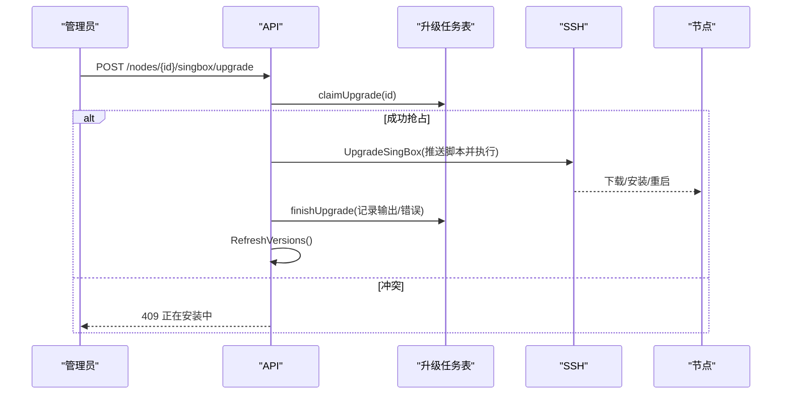
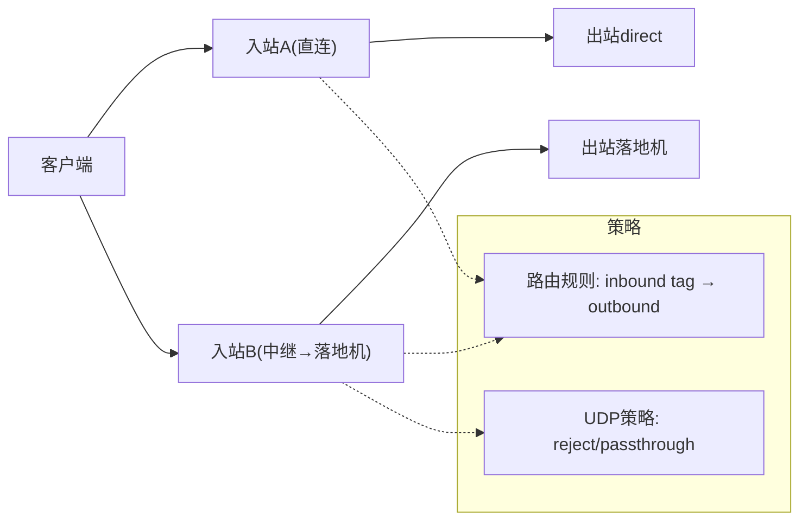
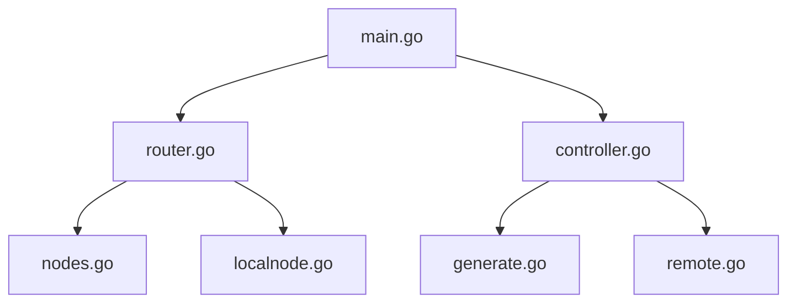

# 节点集群管理

<cite>
**本文引用的文件**
- [main.go](file://main.go)
- [router.go](file://internal/api/router.go)
- [config.go](file://internal/config/config.go)
- [remote.go](file://internal/sshctl/remote.go)
- [nodes_admin.go](file://internal/api/nodes_admin.go)
- [nodes.go](file://internal/store/nodes.go)
- [controller.go](file://internal/sbctl/controller.go)
- [generate.go](file://internal/singbox/generate.go)
- [nodever_admin.go](file://internal/api/nodever_admin.go)
- [localnode.go](file://internal/store/localnode.go)
</cite>

## 目录
1. [简介](#简介)
2. [项目结构](#项目结构)
3. [核心组件](#核心组件)
4. [架构总览](#架构总览)
5. [详细组件分析](#详细组件分析)
6. [依赖关系分析](#依赖关系分析)
7. [性能考量](#性能考量)
8. [故障排查指南](#故障排查指南)
9. [结论](#结论)
10. [附录：API 接口说明](#附录api-接口说明)

## 简介
本模块实现“轻舟”面板的节点集群管理能力，覆盖多节点部署、SSH 远程连接、配置下发与重建、节点生命周期（注册/启用/分组/订阅源同步）、版本管理与批量升级回滚、负载均衡与流量调度、监控与健康检查、以及安全认证机制。系统以 sing-box 为转发内核，通过控制器周期性采集用量并重建配置，借助 SSH 将配置下发到远端节点，保证多机环境下的统一治理与可观测性。

## 项目结构
- 入口与进程编排：主程序负责加载配置、初始化存储、启动邮件服务、构建 sing-box 控制器、启动后台任务（周期统计、证书续期、队列推进等）并启动 HTTP 服务。
- API 路由：集中注册公开、用户态与管理端接口，包含节点、服务器、sing-box 入站/出站、证书、监控、更新等。
- 存储层：节点、分组、订阅源、服务器、入站/出站、证书等数据模型与 CRUD。
- 控制器：sing-box 配置生成、校验、应用、远程分发、统计采集与周期循环。
- SSH 远程管理：连接、隧道、配置写入与验证、服务重启、版本探测与一键升级。
- 配置模板与生成：基于基础模板拼装 inbounds/users/route/outbounds，注入 v2ray_api 统计块，支持中继链路与私有地址保护。

**图示来源**
- [main.go:25-142](file://main.go#L25-L142)
- [router.go:132-386](file://internal/api/router.go#L132-L386)
- [controller.go:357-455](file://internal/sbctl/controller.go#L357-L455)
- [generate.go:165-295](file://internal/singbox/generate.go#L165-L295)
- [remote.go:251-307](file://internal/sshctl/remote.go#L251-L307)
- [nodes.go:40-70](file://internal/store/nodes.go#L40-L70)
- [localnode.go:27-47](file://internal/store/localnode.go#L27-L47)

**章节来源**
- [main.go:25-142](file://main.go#L25-L142)
- [router.go:132-386](file://internal/api/router.go#L132-L386)
- [config.go:5-29](file://internal/config/config.go#L5-L29)

## 核心组件
- 控制器（Controller）：串联数据层、配置生成器、进程管理器与统计客户端；负责 Rebuild（生成并应用配置）、CollectStats（采集用量）、Run（周期循环）。
- SSH 远程管理器（RemoteManager）：封装 SSH 连接、主机密钥固定（TOFU）、配置写入/校验/安装、服务重启、版本探测、统计隧道访问、一键升级。
- 配置生成器（singbox.GenerateConfigWithOptions）：从基础模板拼装 inbounds/users/route/outbounds，注入 v2ray_api 统计块，处理中继链路、私有地址保护、DNS 劫持与兼容字段清理。
- 存储层（Store）：节点、分组、订阅源、服务器、入站/出站、证书等持久化与聚合查询。
- API 层：提供节点增删改查、分组管理、订阅源抓取、服务器管理、sing-box 配置预览/检查、监控与更新等接口。

**章节来源**
- [controller.go:60-141](file://internal/sbctl/controller.go#L60-L141)
- [remote.go:98-139](file://internal/sshctl/remote.go#L98-L139)
- [generate.go:165-295](file://internal/singbox/generate.go#L165-L295)
- [nodes.go:11-23](file://internal/store/nodes.go#L11-L23)
- [router.go:149-386](file://internal/api/router.go#L149-L386)

## 架构总览
系统采用“面板 + 多节点”的分布式架构：
- 面板负责配置生成、策略控制、统计收集与运维操作。
- 节点运行 sing-box，暴露入站供客户端接入，按策略经中继或出站到达互联网。
- 控制器周期采集各节点 per-user 用量，超限则在下一次重建中剔除用户。
- SSH 用于安全地推送配置与执行诊断/升级。

**图示来源**
- [router.go:210-313](file://internal/api/router.go#L210-L313)
- [controller.go:357-455](file://internal/sbctl/controller.go#L357-L455)
- [generate.go:165-295](file://internal/singbox/generate.go#L165-L295)
- [remote.go:251-307](file://internal/sshctl/remote.go#L251-L307)

## 详细组件分析

### 多节点部署与 SSH 远程连接
- 连接与安全
  - 支持私钥/密码两种认证方式，首次连接 TOFU 固定主机密钥，后续严格比对，防止 MITM。
  - 超时与上下文取消保护，避免不可达节点阻塞整体流程。
- 配置下发
  - 先写临时文件，再执行 sing-box check 校验，通过后原子移动并重启服务。
  - 去重缓存：相同配置跳过重复写入与重启，避免中断活跃连接。
- 能力探测
  - 探测 sing-box 是否含 v2ray_api 插件，决定是否注入统计块与采集。
- 隧道访问
  - 通过 SSH 隧道访问节点本地 gRPC 统计端口，避免在公网暴露。

**图示来源**
- [remote.go:145-207](file://internal/sshctl/remote.go#L145-L207)
- [remote.go:251-307](file://internal/sshctl/remote.go#L251-L307)
- [remote.go:577-608](file://internal/sshctl/remote.go#L577-L608)

**章节来源**
- [remote.go:145-207](file://internal/sshctl/remote.go#L145-L207)
- [remote.go:251-307](file://internal/sshctl/remote.go#L251-L307)
- [remote.go:323-363](file://internal/sshctl/remote.go#L323-L363)
- [remote.go:577-608](file://internal/sshctl/remote.go#L577-L608)

### 配置模板系统与动态配置生成
- 基础模板：默认包含日志、DNS、出站与路由规则；支持管理员自定义 sb_base_config。
- Inbound 组装：每个入站携带协议类型、监听信息与可选 TLS/Reality/传输参数，注入对应用户凭据。
- 用户注入：按入站 tag 聚合授权用户，mixed 入站必须存在用户列表以防开放代理。
- 中继与出站：支持将特定入站流量转发至落地机出站，并可拒绝 UDP 或劫持 DNS。
- 统计注入：当节点支持 v2ray_api 时注入 experimental.v2ray_api.stats.users 列表。
- 兼容性：自动移除已废弃的 domain_strategy 字段，确保新版 sing-box 校验通过。

**图示来源**
- [generate.go:153-162](file://internal/singbox/generate.go#L153-L162)
- [generate.go:35-49](file://internal/singbox/generate.go#L35-L49)
- [generate.go:124-135](file://internal/singbox/generate.go#L124-L135)
- [generate.go:165-295](file://internal/singbox/generate.go#L165-L295)

**章节来源**
- [generate.go:18-33](file://internal/singbox/generate.go#L18-L33)
- [generate.go:165-295](file://internal/singbox/generate.go#L165-L295)
- [generate.go:297-328](file://internal/singbox/generate.go#L297-L328)
- [generate.go:407-468](file://internal/singbox/generate.go#L407-L468)
- [generate.go:500-530](file://internal/singbox/generate.go#L500-L530)

### 节点生命周期管理（注册/健康检查/故障转移）
- 节点注册与分组
  - 支持自建节点与外部节点导入，绑定分组，支持排序与批量导入。
  - 订阅源定时抓取，替换节点集合并记录结果。
- 健康检查与监控
  - 控制器周期采集各节点 per-user 用量，结合配额进行限流/剔除。
  - 支持探针上报、公共监控面板与告警读取。
- 故障转移
  - 通过中继与多入站组合实现链路冗余；当某段失效时，用户侧可通过切换节点/线路恢复。
  - 控制器失败重试与状态记录，便于 UI 展示与人工干预。

**图示来源**
- [nodes_admin.go:48-133](file://internal/api/nodes_admin.go#L48-L133)
- [nodes.go:98-160](file://internal/store/nodes.go#L98-L160)
- [controller.go:548-589](file://internal/sbctl/controller.go#L548-L589)
- [controller.go:357-455](file://internal/sbctl/controller.go#L357-L455)

**章节来源**
- [nodes_admin.go:48-133](file://internal/api/nodes_admin.go#L48-L133)
- [nodes.go:98-160](file://internal/store/nodes.go#L98-L160)
- [nodes.go:328-354](file://internal/store/nodes.go#L328-L354)
- [controller.go:548-589](file://internal/sbctl/controller.go#L548-L589)

### 版本管理、批量更新与回滚策略
- 版本探测
  - 控制器探测各节点 sing-box 版本与能力（v2ray_api），记录并用于配置生成决策。
- 一键升级
  - 支持本地与远端节点升级，远端通过 SSH 推送内置安装脚本执行，本地使用 systemd-run 绕过只读沙箱限制。
  - 并发保护：同一节点仅允许一个升级任务，冲突请求直接拒绝。
- 回滚
  - 面板自更新支持查看/回滚状态与应用；节点 sing-box 版本回滚需结合上游发布与安装脚本策略。

**图示来源**
- [nodever_admin.go:172-223](file://internal/api/nodever_admin.go#L172-L223)
- [nodever_admin.go:237-248](file://internal/api/nodever_admin.go#L237-L248)
- [nodever_admin.go:255-338](file://internal/api/nodever_admin.go#L255-L338)
- [remote.go:666-707](file://internal/sshctl/remote.go#L666-L707)

**章节来源**
- [nodever_admin.go:62-117](file://internal/api/nodever_admin.go#L62-L117)
- [nodever_admin.go:119-170](file://internal/api/nodever_admin.go#L119-L170)
- [nodever_admin.go:172-223](file://internal/api/nodever_admin.go#L172-L223)
- [nodever_admin.go:237-338](file://internal/api/nodever_admin.go#L237-L338)
- [remote.go:666-707](file://internal/sshctl/remote.go#L666-L707)

### 负载均衡算法与流量调度策略
- 入站级调度
  - 通过多个入站与中继链路组合，将不同用户/套餐映射到不同节点或出站，形成逻辑上的负载分担。
- 出站与中继
  - 支持将入站流量定向到指定出站（落地机/第三方代理），并可针对 UDP 做阻断或透传。
- 客户端侧选择
  - 订阅生成支持 url-test/selector 等客户端分组，由客户端根据延迟/可用性选择最优节点。

**图示来源**
- [generate.go:231-278](file://internal/singbox/generate.go#L231-L278)
- [generate.go:297-328](file://internal/singbox/generate.go#L297-L328)
- [generate.go:374-468](file://internal/singbox/generate.go#L374-L468)

**章节来源**
- [generate.go:231-278](file://internal/singbox/generate.go#L231-L278)
- [generate.go:297-328](file://internal/singbox/generate.go#L297-L328)
- [generate.go:374-468](file://internal/singbox/generate.go#L374-L468)

### 节点通信协议与安全认证机制
- SSH 安全
  - 主机密钥固定（TOFU），后续连接强制比对，防 MITM。
  - 私钥/密码双通道认证，支持加密私钥口令。
- 面板内部鉴权
  - JWT 会话与会话撤销；受保护路由使用中间件鉴权。
- 速率限制
  - 登录、验证码重发、探针上报、订阅地址更换等接口具备 IP/用户维度限速。
- 敏感信息保护
  - 设置项加密存储（QZ_SECRET_KEY），未解密时拒绝下发受影响入站，避免明文降级。

**章节来源**
- [remote.go:162-186](file://internal/sshctl/remote.go#L162-L186)
- [remote.go:188-207](file://internal/sshctl/remote.go#L188-L207)
- [router.go:132-148](file://internal/api/router.go#L132-L148)
- [main.go:51-71](file://main.go#L51-L71)

### 扩展指南与最佳实践
- 新增入站/出站
  - 在入站表中定义 tag、listen、协议与 TLS/Reality 选项；如需中继，配置出站与路由规则。
- 自定义基础模板
  - 通过 sb_base_config 注入全局 DNS/路由/出站；注意保留必要字段并确保兼容新版 sing-box。
- 远程节点接入
  - 配置 SSH 凭据与 sing-box 路径；首次连接会固定主机密钥；必要时调整 v2ray_listen 以便统计。
- 性能优化建议
  - 合理设置 QZ_SINGBOX_STATS_INTERVAL，平衡统计粒度与开销。
  - 利用配置哈希去重，减少不必要的重启。
  - 对不可达节点设置合理超时，避免拖慢整体重建。

**章节来源**
- [generate.go:18-33](file://internal/singbox/generate.go#L18-L33)
- [controller.go:661-699](file://internal/sbctl/controller.go#L661-L699)
- [remote.go:251-307](file://internal/sshctl/remote.go#L251-L307)

## 依赖关系分析
- main 启动后构建 API、控制器、SSH 远程管理器，并将控制器挂载到 API。
- API 路由将管理端与用户端接口映射到具体处理器，调用存储层与控制器。
- 控制器依赖存储层获取用户/入站/服务器信息，调用配置生成器产出 JSON，并通过本地进程管理或 SSH 远程管理应用到节点。
- SSH 远程管理负责连接、写入、校验、重启与升级。

**图示来源**
- [main.go:25-142](file://main.go#L25-L142)
- [router.go:132-386](file://internal/api/router.go#L132-L386)
- [controller.go:357-455](file://internal/sbctl/controller.go#L357-L455)
- [generate.go:165-295](file://internal/singbox/generate.go#L165-L295)
- [remote.go:251-307](file://internal/sshctl/remote.go#L251-L307)
- [localnode.go:27-47](file://internal/store/localnode.go#L27-L47)

**章节来源**
- [main.go:25-142](file://main.go#L25-L142)
- [router.go:132-386](file://internal/api/router.go#L132-L386)
- [controller.go:357-455](file://internal/sbctl/controller.go#L357-L455)

## 性能考量
- 并发与隔离
  - 控制器对每个远端节点并发下发配置，单个不可达节点不会阻塞其他节点。
  - 升级任务串行化，防止同一节点并行安装导致二进制/单元文件竞争。
- 超时与取消
  - SSH 连接与命令执行均支持上下文取消，避免长时间挂起。
- 去重与最小化变更
  - 配置哈希对比避免重复写入与重启；mixed 入站无用户时不发射，防止空监听。
- 统计采集
  - 仅对具备 v2ray_api 的节点注入统计块并采集，降低无效开销。

[本节为通用指导，无需引用具体文件]

## 故障排查指南
- SSH 连接失败
  - 检查主机密钥是否匹配；如节点重装/更换，需清除已固定密钥后重新建立信任。
- 配置下发失败
  - 查看 sing-box check 输出；确认二进制路径与 systemd unit 名称正确。
- 统计为空
  - 确认节点 sing-box 是否含 v2ray_api 插件；若缺失，需升级或重新安装带插件的二进制。
- 升级卡住
  - 查看升级任务快照与输出；确认网络可达与磁盘空间；必要时手动在节点执行安装脚本。

**章节来源**
- [remote.go:162-186](file://internal/sshctl/remote.go#L162-L186)
- [remote.go:577-608](file://internal/sshctl/remote.go#L577-L608)
- [nodever_admin.go:119-170](file://internal/api/nodever_admin.go#L119-L170)
- [nodever_admin.go:237-338](file://internal/api/nodever_admin.go#L237-L338)

## 结论
本模块以控制器为核心，结合 SSH 远程管理与 sing-box 配置生成，实现了多节点集群的统一治理：从节点注册、分组与订阅源同步，到配置下发、版本升级与回滚，再到用量采集与配额控制，形成闭环。通过安全认证、速率限制与健壮的错误处理，保障在生产环境中的稳定性与可维护性。开发者可基于现有接口与生成器扩展新的入站/出站与调度策略，满足多样化业务需求。

## 附录：API 接口说明
以下列出与节点管理相关的主要接口（管理端，需管理员权限）：
- 节点管理
  - GET /api/admin/nodes：列出节点
  - POST /api/admin/nodes：创建节点
  - PUT /api/admin/nodes/{id}：更新节点
  - DELETE /api/admin/nodes/{id}：删除节点
  - POST /api/admin/nodes/reorder：调整节点显示顺序
  - POST /api/admin/nodes/import：批量导入节点链接
- 分组管理
  - GET /api/admin/node-groups：列出分组
  - POST /api/admin/node-groups：创建分组
  - PUT /api/admin/node-groups/{id}：更新分组
  - DELETE /api/admin/node-groups/{id}：删除分组
- 订阅源管理
  - GET /api/admin/node-sources：列出订阅源
  - POST /api/admin/node-sources：创建订阅源
  - PUT /api/admin/node-sources/{id}：更新订阅源
  - POST /api/admin/node-sources/{id}/fetch：抓取并替换节点
  - DELETE /api/admin/node-sources/{id}：删除订阅源
- 服务器与 sing-box 版本
  - GET /api/admin/nodes/singbox：查看各节点 sing-box 版本与能力
  - POST /api/admin/nodes/singbox/refresh：刷新版本探测
  - POST /api/admin/nodes/{id}/singbox/upgrade：对节点执行一键升级
- 服务器管理
  - GET /api/admin/servers：列出服务器
  - POST /api/admin/servers：创建服务器
  - PUT /api/admin/servers/{id}：更新服务器
  - DELETE /api/admin/servers/{id}：删除服务器
  - POST /api/admin/servers/{id}/test：测试 SSH 连通
  - POST /api/admin/servers/{id}/rebuild：重建该服务器配置
  - POST /api/admin/servers/{id}/clear-host-key：清除已固定的主机密钥
- 监控与告警
  - GET /api/admin/monitor/dashboard：监控概览
  - GET /api/admin/monitor/servers：服务器列表
  - GET /api/admin/monitor/servers/{id}/metrics：服务器指标
  - GET /api/admin/monitor/alerts：告警列表
  - POST /api/admin/monitor/alerts/{id}/read：标记告警已读
  - POST /api/admin/monitor/alerts/read-all：全部标记已读

**章节来源**
- [router.go:210-386](file://internal/api/router.go#L210-L386)
