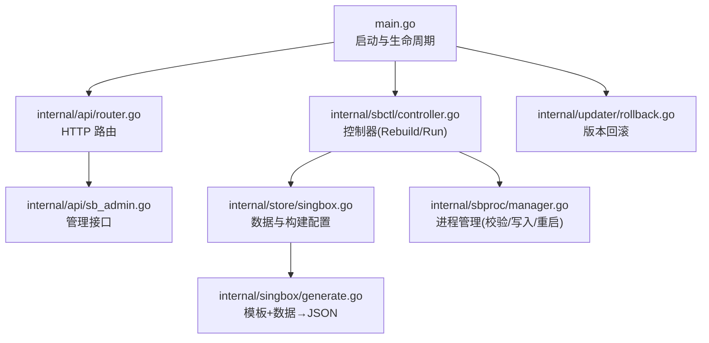
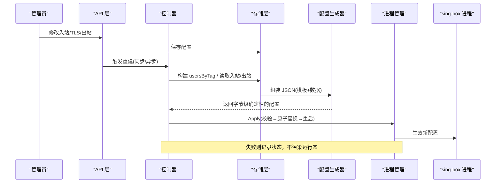
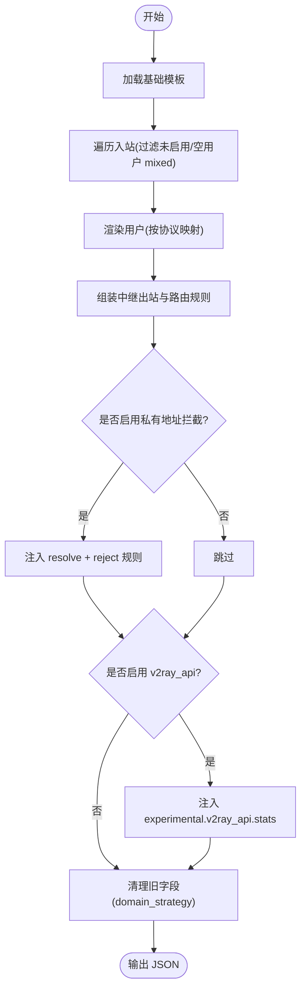
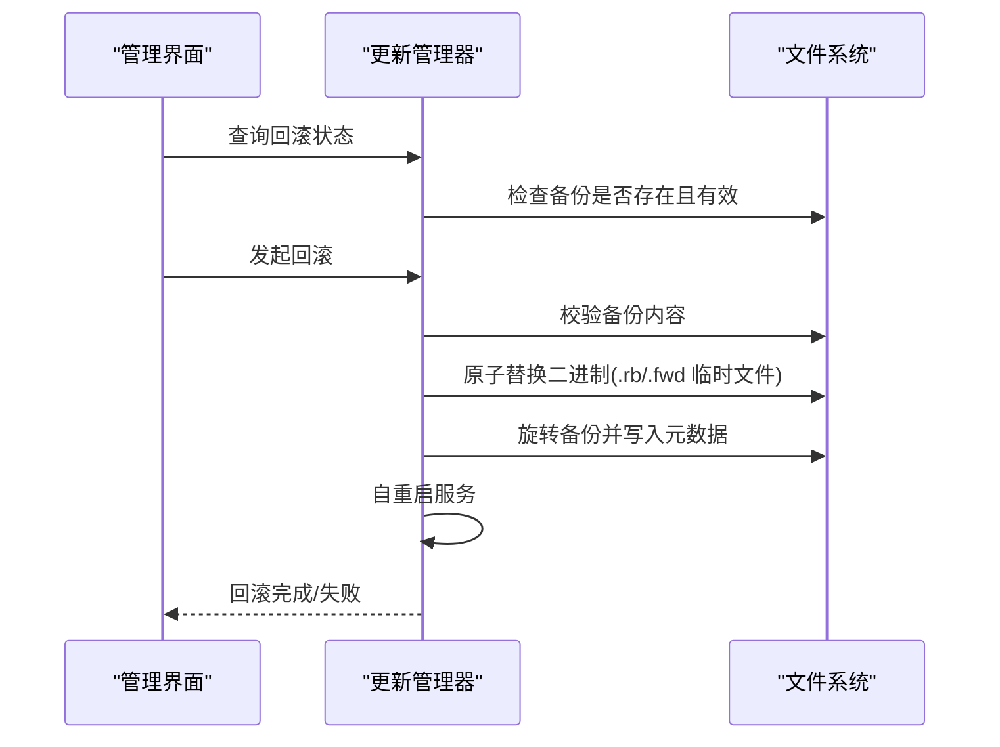
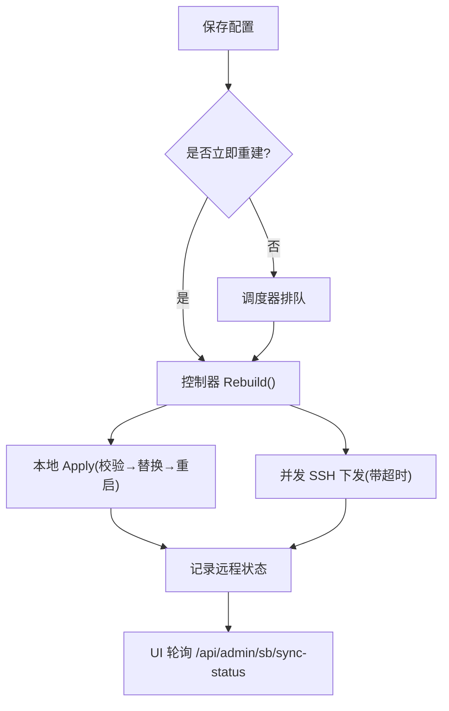
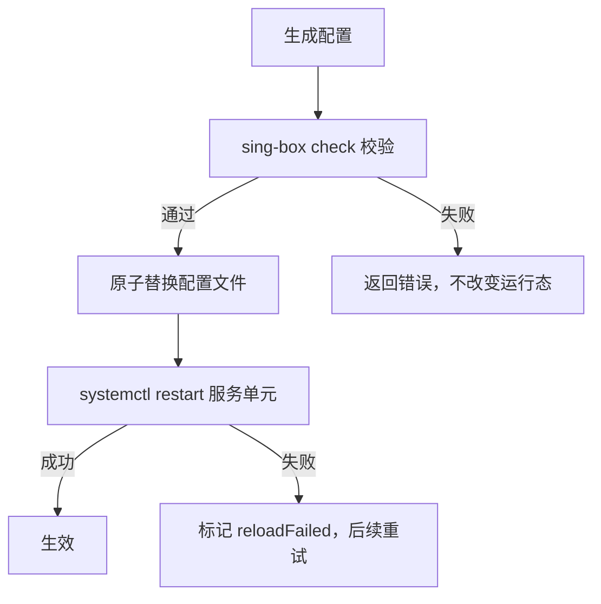
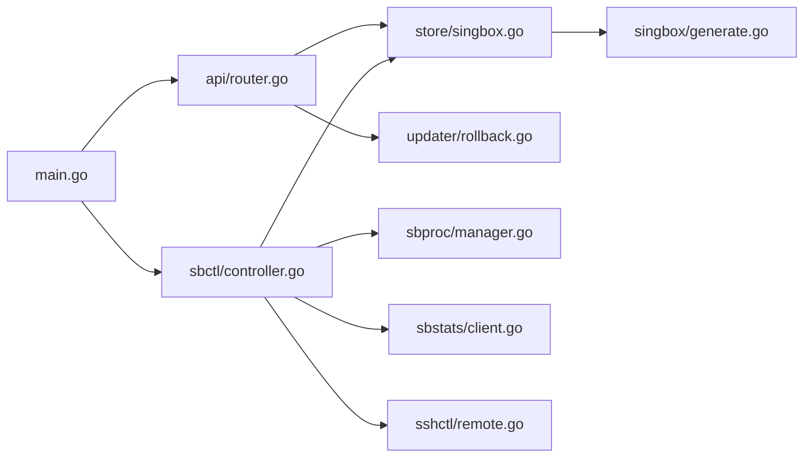

# 配置管理系统

<cite>
**本文引用的文件**
- [main.go](file://main.go)
- [config.go](file://internal/config/config.go)
- [router.go](file://internal/api/router.go)
- [sb_admin.go](file://internal/api/sb_admin.go)
- [controller.go](file://internal/sbctl/controller.go)
- [manager.go](file://internal/sbproc/manager.go)
- [generate.go](file://internal/singbox/generate.go)
- [singbox.go](file://internal/store/singbox.go)
- [rollback.go](file://internal/updater/rollback.go)
</cite>

## 目录
1. [简介](#简介)
2. [项目结构](#项目结构)
3. [核心组件](#核心组件)
4. [架构总览](#架构总览)
5. [详细组件分析](#详细组件分析)
6. [依赖关系分析](#依赖关系分析)
7. [性能与优化](#性能与优化)
8. [故障排查指南](#故障排查指南)
9. [结论](#结论)
10. [附录：API 参考](#附录api-参考)

## 简介
本系统提供基于 sing-box 的“模板 + 动态生成”的配置管理能力。管理员在面板中维护 TLS/Reality 证书、入站（inbound）、出站（egress）和链路拓扑，系统按策略自动生成 sing-box 配置，并通过本地或 SSH 远程下发到节点进程，同时周期性采集流量统计并回写用量。系统支持版本更新与回滚、配置校验与错误处理、多协议支持与转换、以及面向开发者的扩展点。

## 项目结构
- 入口与生命周期管理：启动时加载配置、初始化存储、邮件服务、sing-box 控制器、HTTP 路由与后台任务。
- API 层：暴露管理员与用户接口，注册 sing-box 相关管理端点。
- 控制器层：编排配置生成、校验、应用与统计收集。
- 进程管理层：原子写入配置、调用 sing-box check、重启服务单元。
- 配置生成层：从模板与数据组装最终 JSON，注入用户、路由、出站、v2ray_api 等。
- 存储层：持久化 TLS/Reality 配置、入站、出站、服务器信息、设置等。
- 更新与回滚：二进制版本管理与一键回滚。

**图表来源**
- [main.go:25-142](file://main.go#L25-L142)
- [router.go:132-387](file://internal/api/router.go#L132-L387)
- [controller.go:353-455](file://internal/sbctl/controller.go#L353-L455)
- [manager.go:247-285](file://internal/sbproc/manager.go#L247-L285)
- [generate.go:137-295](file://internal/singbox/generate.go#L137-L295)
- [singbox.go:562-679](file://internal/store/singbox.go#L562-L679)
- [rollback.go:47-104](file://internal/updater/rollback.go#L47-L104)

**章节来源**
- [main.go:25-142](file://main.go#L25-L142)
- [router.go:132-387](file://internal/api/router.go#L132-L387)

## 核心组件
- 配置模板与生成器：默认基础模板包含日志、DNS、出站与路由；生成器负责注入 inbounds、users、experimental.v2ray_api、relay 路由与私有地址拦截规则。
- 控制器：串行化 Rebuild，聚合各服务器配置并下发；周期循环采集统计并重建以执行配额控制。
- 进程管理器：先校验再原子替换配置文件，最后重启服务单元；对只读挂载进行逃逸写入。
- 存储层：TLS/Reality 配置加密存储、入站/出站 CRUD、端口冲突检测、配置构建所需的数据装配。
- 更新与回滚：二进制更新状态查询、安装、回滚与自重启。

**章节来源**
- [generate.go:18-33](file://internal/singbox/generate.go#L18-L33)
- [generate.go:137-295](file://internal/singbox/generate.go#L137-L295)
- [controller.go:60-115](file://internal/sbctl/controller.go#L60-L115)
- [manager.go:22-50](file://internal/sbproc/manager.go#L22-L50)
- [singbox.go:15-73](file://internal/store/singbox.go#L15-L73)
- [rollback.go:23-104](file://internal/updater/rollback.go#L23-L104)

## 架构总览
系统采用“模板 + 数据驱动”的生成式架构：
- 管理员通过 API 维护 TLS/Reality、入站、出站、服务器等信息。
- 控制器定期或触发式调用存储层构建配置，交由进程管理器校验并应用。
- 统计采集将 per-user 用量汇总，下次重建时根据配额剔除越界用户。
- 多服务器场景下，控制器并发通过 SSH 下发配置，记录每台机器的同步状态。

**图表来源**
- [controller.go:353-455](file://internal/sbctl/controller.go#L353-L455)
- [manager.go:247-285](file://internal/sbproc/manager.go#L247-L285)
- [generate.go:137-295](file://internal/singbox/generate.go#L137-L295)
- [singbox.go:562-679](file://internal/store/singbox.go#L562-L679)

## 详细组件分析

### 配置模板系统与动态生成机制
- 基础模板：默认包含日志级别、DNS、出站 direct、路由 final 为 direct。
- 入站装配：每个 inbound 携带类型、监听地址/端口、TLS/Reality 块、额外选项；用户列表按名称排序以保证输出确定性，避免无谓重载。
- 用户渲染：不同协议映射为对应 user 对象（如 vless/vmess/tuic/hysteria2/trojan/shadowsocks/anytls/hysteria/mixed），mixed 入站若为空用户将被丢弃以避免开放代理。
- 实验特性：当启用 v2ray_api 时，注入 experimental.v2ray_api.stats.users 用于 per-user 计量。
- 中继与出口：可追加出站与路由规则，将特定入站转发至落地机或第三方代理；支持 UDP 拒绝与 DNS 劫持保护。
- 安全规则：可选注入私有地址拦截规则，防止代理流量访问本机或云元数据；必要时插入 resolve 规则确保域名解析后再拒绝。
- 兼容性清理：自动移除旧版 domain_strategy 字段，保证新版 sing-box 检查通过。

**图表来源**
- [generate.go:137-295](file://internal/singbox/generate.go#L137-L295)
- [generate.go:297-328](file://internal/singbox/generate.go#L297-L328)
- [generate.go:407-468](file://internal/singbox/generate.go#L407-L468)
- [generate.go:500-531](file://internal/singbox/generate.go#L500-L531)

**章节来源**
- [generate.go:18-33](file://internal/singbox/generate.go#L18-L33)
- [generate.go:51-102](file://internal/singbox/generate.go#L51-L102)
- [generate.go:137-295](file://internal/singbox/generate.go#L137-L295)
- [generate.go:297-328](file://internal/singbox/generate.go#L297-L328)
- [generate.go:407-468](file://internal/singbox/generate.go#L407-L468)
- [generate.go:500-531](file://internal/singbox/generate.go#L500-L531)

### 配置版本控制与回滚策略
- 二进制更新：支持在线检查与安装新版本，安装前保留当前版本作为回滚目标。
- 回滚能力：仅 Linux 平台支持一键回滚；回滚流程会校验备份内容、原子替换二进制、旋转备份并自重启。
- 可逆性：回滚后原版本成为新的回滚目标，允许再次回退。
- 前端交互：提供回滚状态查询与确认安装/降级流程。

**图表来源**
- [rollback.go:47-104](file://internal/updater/rollback.go#L47-L104)
- [rollback.go:106-193](file://internal/updater/rollback.go#L106-L193)

**章节来源**
- [rollback.go:47-104](file://internal/updater/rollback.go#L47-L104)
- [rollback.go:106-193](file://internal/updater/rollback.go#L106-L193)

### 配置同步机制与冲突解决
- 同步触发：管理员保存配置后，API 层可选择立即重建或异步调度重建；控制器 Run 周期也会触发重建。
- 并发与去重：控制器串行化 Rebuild；对远端服务器并发下发，单个失败不影响其他机器；调度器合并突发请求，减少重复下发。
- 冲突检测：入站端口冲突检测考虑 L4 协议（TCP/UDP）与监听地址重叠；混合协议同端口合法（如 hysteria2 UDP + vless TCP）。
- 状态可见：提供同步状态查询接口，便于 UI 显示每台机器的下发结果。

**图表来源**
- [controller.go:353-455](file://internal/sbctl/controller.go#L353-L455)
- [controller.go:651-699](file://internal/sbctl/controller.go#L651-L699)
- [singbox.go:501-527](file://internal/store/singbox.go#L501-L527)
- [sb_admin.go:1380-1393](file://internal/api/sb_admin.go#L1380-L1393)

**章节来源**
- [controller.go:353-455](file://internal/sbctl/controller.go#L353-L455)
- [controller.go:651-699](file://internal/sbctl/controller.go#L651-L699)
- [singbox.go:501-527](file://internal/store/singbox.go#L501-L527)
- [sb_admin.go:1380-1393](file://internal/api/sb_admin.go#L1380-L1393)

### 配置验证规则与错误处理
- 生成期校验：生成器在注入规则与字段时遵循 sing-box 规范，移除不兼容字段，避免运行时失败。
- 应用期校验：进程管理器在替换前使用 sing-box check 校验配置；失败则不触碰运行态配置。
- 只读挂载逃逸：当面板受 systemd ProtectSystem 限制导致 /etc 只读时，通过 systemd-run 提升权限写入并校验落盘一致性。
- 错误反馈：控制器记录每台机器的失败原因；API 提供同步状态查询；管理员可重试或修复后重新下发。

**图表来源**
- [manager.go:247-285](file://internal/sbproc/manager.go#L247-L285)
- [manager.go:102-146](file://internal/sbproc/manager.go#L102-L146)
- [controller.go:204-280](file://internal/sbctl/controller.go#L204-L280)

**章节来源**
- [manager.go:247-285](file://internal/sbproc/manager.go#L247-L285)
- [manager.go:102-146](file://internal/sbproc/manager.go#L102-L146)
- [controller.go:204-280](file://internal/sbctl/controller.go#L204-L280)

### 多协议支持与配置转换逻辑
- 服务端侧：生成器支持多种协议的用户渲染（vless/vmess/tuic/hysteria2/trojan/shadowsocks/anytls/hysteria/mixed），并按协议特性注入必要字段（如 flow、password、auth_str 等）。
- 客户端订阅：子转换模块可将节点转换为 Clash/Surge/sing-box 等格式，内置防泄漏模板（fake-ip DNS、TUN、sniffer、规则），并根据节点属性调整网络模式（如 UDP 阻断时强制 TCP）。
- 协议兼容性：对不支持的协议或参数进行过滤或降级，避免整份配置失效；对 anytls 等特殊协议做白名单处理。

**章节来源**
- [generate.go:51-102](file://internal/singbox/generate.go#L51-L102)
- [singbox.go:299-332](file://internal/subconv/singbox.go#L299-L332)
- [clash.go:11-51](file://internal/subconv/clash.go#L11-L51)
- [parse.go:78-104](file://internal/subconv/parse.go#L78-L104)

### 配置优化建议与性能调优
- 生成确定性：用户列表排序与规则顺序稳定，避免无意义重载。
- 最小化变更：Apply 内部比较字节差异，相同配置跳过校验与重启。
- 并发下发：远端服务器并发下发，单点失败不阻塞整体。
- 统计采样间隔：可通过环境变量调整统计与重建周期，平衡实时性与负载。
- 资源限制：HTTP 中间件限制请求体大小与超时，防止内存压力。

**章节来源**
- [generate.go:192-204](file://internal/singbox/generate.go#L192-L204)
- [manager.go:254-265](file://internal/sbproc/manager.go#L254-L265)
- [controller.go:391-451](file://internal/sbctl/controller.go#L391-L451)
- [main.go:209-217](file://main.go#L209-L217)
- [router.go:143-147](file://internal/api/router.go#L143-L147)

### 开发者扩展接口与使用示例
- 控制器接口：ConfigStore/Applier/StatsFetcher 小接口便于单元测试与替换实现。
- 自定义基础模板：通过设置项或环境变量覆盖默认基础模板，但需保持兼容字段。
- 入站扩展：新增协议需在生成器中补充 renderUser 分支与选项处理。
- 出站扩展：新增 egress 类型需在存储层与生成器中增加路由与出站拼装逻辑。
- 订阅转换：在 subconv 中添加新协议的解析与渲染函数，并在默认模板中考虑安全与兼容性。

**章节来源**
- [controller.go:36-58](file://internal/sbctl/controller.go#L36-L58)
- [generate.go:137-295](file://internal/singbox/generate.go#L137-L295)
- [singbox.go:562-679](file://internal/store/singbox.go#L562-L679)
- [clash.go:11-51](file://internal/subconv/clash.go#L11-L51)

## 依赖关系分析
- main 启动依赖 config、store、api、sbctl、sbproc、sbstats、sshctl、updater。
- API 路由依赖 store、sbctl、updater、mailer。
- 控制器依赖 store、sbproc、sbstats、sshctl、singbox。
- 进程管理依赖操作系统命令（sing-box/systemd-run/systemctl）。
- 配置生成依赖 singbox 包与 store 提供的数据。

**图表来源**
- [main.go:14-23](file://main.go#L14-L23)
- [router.go:1-19](file://internal/api/router.go#L1-L19)
- [controller.go:14-34](file://internal/sbctl/controller.go#L14-L34)
- [manager.go:1-20](file://internal/sbproc/manager.go#L1-L20)
- [generate.go:1-16](file://internal/singbox/generate.go#L1-L16)

**章节来源**
- [main.go:14-23](file://main.go#L14-L23)
- [router.go:1-19](file://internal/api/router.go#L1-L19)
- [controller.go:14-34](file://internal/sbctl/controller.go#L14-L34)
- [manager.go:1-20](file://internal/sbproc/manager.go#L1-L20)
- [generate.go:1-16](file://internal/singbox/generate.go#L1-L16)

## 性能与优化
- 配置生成确定性：排序与去重减少无效重载。
- 应用幂等：字节对比跳过重复 Apply。
- 并发下发：远端节点并行处理，缩短总体下发时间。
- 统计批处理：批量累积用量，降低数据库写入频率。
- 资源限制：请求体大小与超时保护，避免极端情况拖垮服务。

[本节为通用指导，无需具体文件引用]

## 故障排查指南
- 配置无法下发：查看同步状态接口返回的错误信息；检查 sing-box check 输出定位语法问题。
- 只读挂载写入失败：关注 EROFS 提示与 systemd-run 逃逸路径；必要时放行 ReadWritePaths 并重载服务。
- 证书解密失败：确认 QZ_SECRET_KEY 一致；否则入站 TLS 配置会被拒绝生成，避免明文泄露。
- 端口冲突：检查入站监听地址与协议组合；同端口不同 L4 协议通常合法。
- 回滚不可用：确认 Linux 环境且存在有效备份；回滚过程会校验备份内容。

**章节来源**
- [manager.go:68-88](file://internal/sbproc/manager.go#L68-L88)
- [manager.go:102-146](file://internal/sbproc/manager.go#L102-L146)
- [singbox.go:184-239](file://internal/store/singbox.go#L184-L239)
- [singbox.go:501-527](file://internal/store/singbox.go#L501-L527)
- [rollback.go:47-104](file://internal/updater/rollback.go#L47-L104)

## 结论
本配置管理系统以模板与数据驱动的生成方式，结合严格的校验与原子化应用，实现了高可靠的多节点 sing-box 配置管理。通过控制器编排、统计采集与配额控制，系统在保障安全与稳定的前提下提供了灵活的扩展能力与完善的运维工具链。

[本节为总结，无需具体文件引用]

## 附录：API 参考
以下为与配置管理相关的管理员接口（部分）：
- 健康与配置获取
  - GET /api/health
  - GET /api/config
- 认证
  - POST /api/auth/login
  - POST /api/auth/register
  - POST /api/auth/forgot
  - POST /api/auth/reset
- 订阅
  - GET /sub/{token}
- 监控
  - POST /api/monitor/report
  - GET /api/monitor/public
  - GET /api/monitor/public/sparklines
  - GET /api/monitor/heatmap
- 管理员设置
  - GET /api/admin/settings
  - PUT /api/admin/settings
  - GET /api/admin/settings/default-templates
  - POST /api/admin/settings/test-smtp
  - GET /api/admin/settings/detect-node-host
- 重建与备份
  - POST /api/admin/rebuild
  - GET /api/admin/backup
- sing-box 管理
  - POST /api/admin/sb/reality-keypair
  - GET /api/admin/sb/sni-test
  - GET /api/admin/sb/tls
  - POST /api/admin/sb/tls
  - POST /api/admin/sb/tls/reality
  - PUT /api/admin/sb/tls/reality/{id}
  - POST /api/admin/sb/tls/self-signed
  - POST /api/admin/sb/tls/quick-selfsigned
  - POST /api/admin/sb/tls/acme
  - POST /api/admin/sb/tls/cert
  - POST /api/admin/sb/tls/reorder
  - PUT /api/admin/sb/tls/cert/{id}
  - PUT /api/admin/sb/tls/{id}
  - DELETE /api/admin/sb/tls/{id}
  - GET /api/admin/sb/egresses
  - POST /api/admin/sb/egresses
  - POST /api/admin/sb/egresses/parse
  - POST /api/admin/sb/egresses/{id}/clone
  - PUT /api/admin/sb/egresses/{id}
  - DELETE /api/admin/sb/egresses/{id}
  - POST /api/admin/sb/egresses/{id}/test
  - GET /api/admin/sb/sync-status
  - POST /api/admin/sb/resync
  - GET /api/admin/sb/inbounds
  - POST /api/admin/sb/inbounds
  - POST /api/admin/sb/inbounds/reorder
  - PUT /api/admin/sb/inbounds/{id}
  - DELETE /api/admin/sb/inbounds/{id}
  - POST /api/admin/sb/inbounds/{id}/ack-upstream
  - GET /api/admin/sb/preview
  - GET /api/admin/sb/check
  - GET /api/admin/sb/port-check
  - GET /api/admin/sb/import-remote/list-files
  - GET /api/admin/sb/import-remote/preview
- 服务器管理
  - GET /api/admin/servers
  - POST /api/admin/servers
  - PUT /api/admin/servers/{id}
  - DELETE /api/admin/servers/{id}
  - POST /api/admin/servers/{id}/test
  - POST /api/admin/servers/{id}/rebuild
  - POST /api/admin/servers/{id}/clear-host-key
  - PUT /api/admin/servers/{id}/monitor
- 更新与回滚
  - GET /api/admin/update/check
  - GET /api/admin/update/status
  - GET /api/admin/update/releases
  - GET /api/admin/update/rollback
  - POST /api/admin/update/rollback
  - POST /api/admin/update/apply

**章节来源**
- [router.go:149-387](file://internal/api/router.go#L149-L387)
