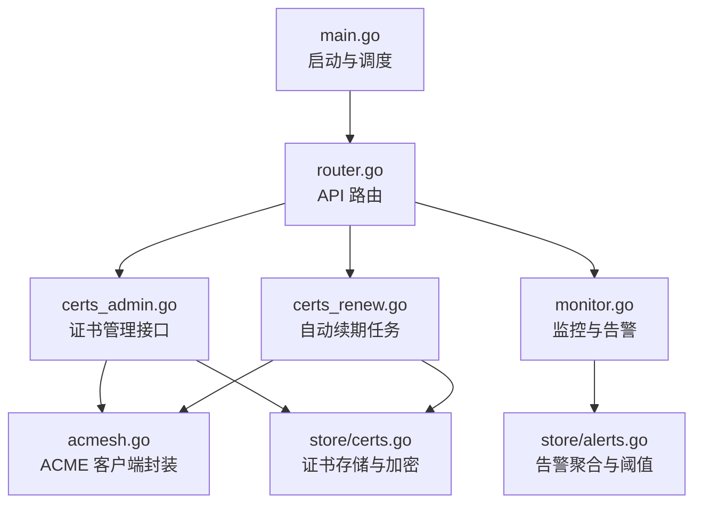
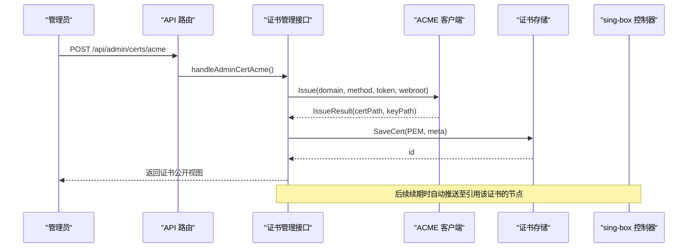
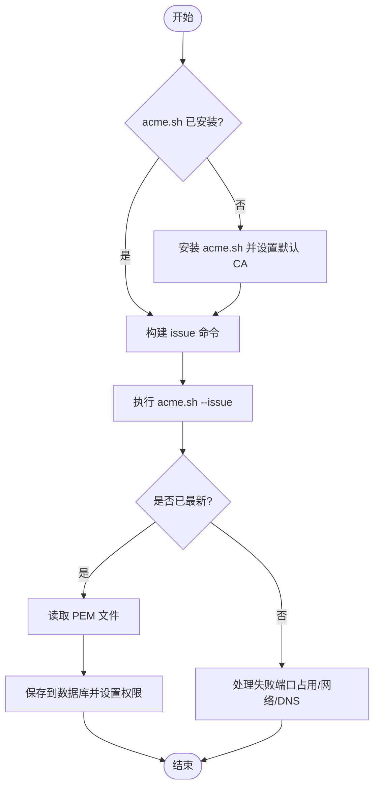
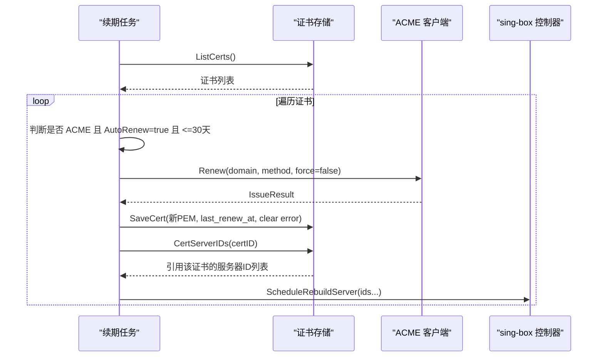
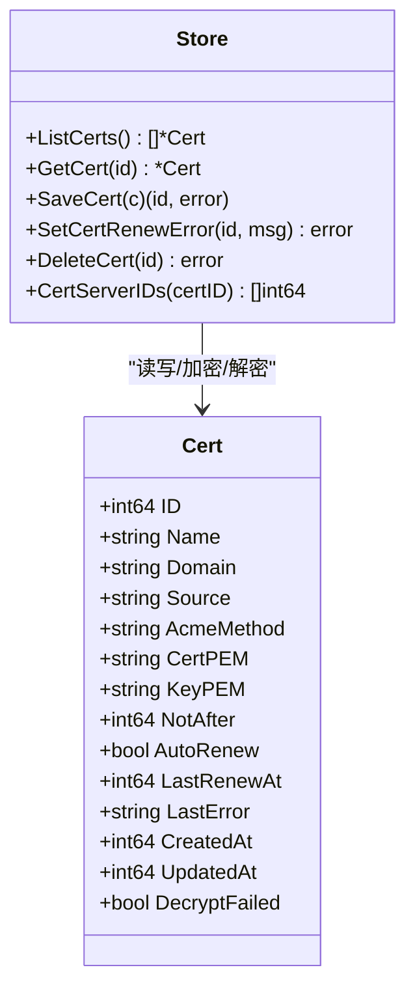
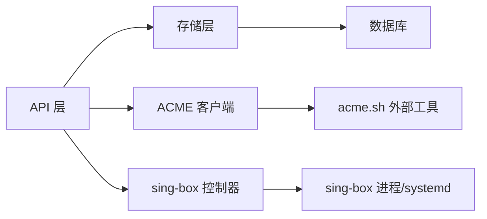

# 证书管理系统

<cite>
**本文引用的文件**
- [main.go](file://main.go)
- [router.go](file://internal/api/router.go)
- [certs_admin.go](file://internal/api/certs_admin.go)
- [certs_renew.go](file://internal/api/certs_renew.go)
- [acmesh.go](file://internal/acmesh/acmesh.go)
- [cert.go](file://internal/singbox/cert.go)
- [certs.go](file://internal/store/certs.go)
- [alerts.go](file://internal/store/alerts.go)
- [monitor.go](file://internal/api/monitor.go)
- [config.go](file://internal/config/config.go)
</cite>

## 目录
1. [简介](#简介)
2. [项目结构](#项目结构)
3. [核心组件](#核心组件)
4. [架构总览](#架构总览)
5. [详细组件分析](#详细组件分析)
6. [依赖关系分析](#依赖关系分析)
7. [性能与安全考量](#性能与安全考量)
8. [故障排查指南](#故障排查指南)
9. [结论](#结论)
10. [附录：API 参考](#附录api-参考)

## 简介
本系统提供完整的证书生命周期管理能力，包括基于 ACME 协议的证书自动申请与续期、证书存储与加密、密钥安全管理、自动化推送至节点、HTTPS 配置生成与优化、以及监控告警与过期提醒。通过统一的 API 暴露证书申请、续期、导出、删除等操作，并结合 sing-box 控制器实现配置的自动重建与下发。

## 项目结构
- 入口与启动流程：主进程加载配置、初始化数据库、构建邮件器、启动 sing-box 控制器、定时任务（含证书续期）、HTTP 服务。
- API 路由：统一注册管理员接口，包含证书中心、TLS 配置、入站管理、服务器管理等。
- ACME 集成：封装 acme.sh 客户端，支持 http-01、webroot、dns-cf 三种验证方式，固定安装路径并安全地写入证书与私钥。
- 证书存储：以加密形式持久化 PEM 内容，解析有效期，维护自动续期开关与错误记录。
- 监控告警：探针上报指标，周期性评估离线、资源高负载、磁盘满、到期等状态，形成可观测的告警体系。

**图表来源**
- [main.go:25-142](file://main.go#L25-L142)
- [router.go:132-386](file://internal/api/router.go#L132-L386)
- [certs_admin.go:70-329](file://internal/api/certs_admin.go#L70-L329)
- [certs_renew.go:19-123](file://internal/api/certs_renew.go#L19-L123)
- [acmesh.go:1-303](file://internal/acmesh/acmesh.go#L1-L303)
- [certs.go:14-217](file://internal/store/certs.go#L14-L217)
- [alerts.go:10-357](file://internal/store/alerts.go#L10-L357)
- [monitor.go:18-800](file://internal/api/monitor.go#L18-L800)

**章节来源**
- [main.go:25-142](file://main.go#L25-L142)
- [router.go:132-386](file://internal/api/router.go#L132-L386)

## 核心组件
- ACME 客户端封装：负责安装 acme.sh、选择验证方法、签发与续期、读取 PEM 并设置权限。
- 证书存储层：加密保存 PEM、解析有效期、维护元数据（来源、方法、自动续期、错误信息）。
- API 层：提供证书申请、粘贴导入、自签、更新、续期、导出、删除等接口；同时绑定 TLS 配置到入站。
- 自动续期任务：周期扫描即将过期的 ACME 证书，调用 acme.sh 续期，写回 DB 并推送到引用该证书的节点。
- 监控与告警：收集探针指标，评估离线、CPU/内存/磁盘阈值、到期等条件，生成可管理的告警事件。

**章节来源**
- [acmesh.go:1-303](file://internal/acmesh/acmesh.go#L1-L303)
- [certs.go:14-217](file://internal/store/certs.go#L14-L217)
- [certs_admin.go:70-329](file://internal/api/certs_admin.go#L70-L329)
- [certs_renew.go:19-123](file://internal/api/certs_renew.go#L19-L123)
- [alerts.go:10-357](file://internal/store/alerts.go#L10-L357)

## 架构总览
系统采用分层设计：
- 接入层：HTTP API（基于 chi），统一鉴权、限流、压缩、超时控制。
- 业务层：证书管理、TLS 配置、入站管理、服务器管理、监控告警。
- 基础设施层：acme.sh 外部工具、sing-box 控制器、数据库存储、邮件发送。

**图表来源**
- [router.go:270-279](file://internal/api/router.go#L270-L279)
- [certs_admin.go:90-161](file://internal/api/certs_admin.go#L90-L161)
- [acmesh.go:189-240](file://internal/acmesh/acmesh.go#L189-L240)
- [certs.go:98-122](file://internal/store/certs.go#L98-L122)

## 详细组件分析

### ACME 协议实现与证书申请
- 支持的验证方法：
  - http-01：在 :80 端口独立监听完成挑战。
  - webroot：将挑战文件放置到已有 Web 根目录，无需占用端口。
  - dns-cf：通过 Cloudflare DNS API 添加 TXT 记录完成挑战，支持通配符域名。
- 安装与 CA 固定：
  - 自动安装 acme.sh 并固定版本，设置默认 CA 为 Let's Encrypt。
  - 证书与私钥安装到稳定路径，目录权限收紧，私钥权限设置为仅所有者可读。
- 签发流程：
  - 构造 issue 命令，执行后若已存在且未到期则视为成功。
  - 安装证书到目标目录，必要时执行重载命令（面板侧不依赖本地 systemd，改为自身推送）。
  - 读取 PEM 并保存到数据库，标记来源与方法，开启自动续期。

**图表来源**
- [acmesh.go:91-124](file://internal/acmesh/acmesh.go#L91-L124)
- [acmesh.go:126-161](file://internal/acmesh/acmesh.go#L126-L161)
- [acmesh.go:189-240](file://internal/acmesh/acmesh.go#L189-L240)

**章节来源**
- [acmesh.go:1-303](file://internal/acmesh/acmesh.go#L1-L303)
- [certs_admin.go:90-161](file://internal/api/certs_admin.go#L90-L161)

### 证书自动续期机制
- 触发时机：启动后延迟两分钟，随后按固定间隔（默认 12 小时）扫描。
- 续期策略：
  - 仅对来源为 ACME 且开启自动续期的证书进行续期。
  - 当剩余天数小于等于 30 天时触发续期，与 acme.sh 行为对齐。
  - 续期成功后重新读取 PEM，更新数据库并清除错误记录。
  - 根据证书 ID 查找引用该证书的节点，异步调度重建配置并推送。
- 错误隔离：单个证书续期失败不影响其他证书，错误信息记录以便 UI 展示。

**图表来源**
- [certs_renew.go:19-123](file://internal/api/certs_renew.go#L19-L123)
- [certs.go:144-164](file://internal/store/certs.go#L144-L164)

**章节来源**
- [certs_renew.go:19-123](file://internal/api/certs_renew.go#L19-L123)
- [certs.go:98-164](file://internal/store/certs.go#L98-L164)

### 证书存储结构与密钥管理
- 存储模型：
  - 字段包括名称、域名、来源（acme/paste/selfsigned）、ACME 方法、PEM、有效期、自动续期开关、最近续期时间、错误信息、创建与更新时间。
  - 解密失败标志用于标识因密钥变更导致无法解密的条目，防止配置降级为明文。
- 加密与解密：
  - PEM 使用运行时密钥（优先环境变量 QZ_SECRET_KEY，否则回退到 JWT 密钥）进行加密存储。
  - 读取时尝试解密，失败则标记 DecryptFailed，并在配置构建阶段拒绝使用该证书。
- 迁移与回填：
  - 支持将内联 PEM 的 TLS 配置迁移为受管证书，并重新指向 cert_id，保持向后兼容。

**图表来源**
- [certs.go:14-217](file://internal/store/certs.go#L14-L217)

**章节来源**
- [certs.go:14-217](file://internal/store/certs.go#L14-L217)

### HTTPS 配置自动生成与 SSL/TLS 优化
- 自签证书：
  - 支持 ECDSA P-256 算法，SAN 支持 IP 与 DNS，通配符自动覆盖裸域。
  - 有效期限制在 1–3650 天，默认约 10 年。
  - 指纹计算用于客户端 pinSHA256 场景。
- 配置生成：
  - 通过 sing-box 控制器生成并应用配置，支持 Reality、TLS 等多种模式。
  - 自动检测 sing-box 二进制路径，支持 systemd 重载。
- 优化建议：
  - 使用 ACME 证书替代自签以提升信任度。
  - 合理设置 ALPN、最小/最大 TLS 版本。
  - 启用 TCP Fast Open、MPTCP 等传输优化（由前端表单配置）。

**章节来源**
- [cert.go:19-140](file://internal/singbox/cert.go#L19-L140)
- [router.go:254-268](file://internal/api/router.go#L254-L268)

### 监控与过期提醒
- 指标采集：
  - 探针通过 Token 认证上报 CPU、内存、磁盘、网络等指标。
  - 面板内置本地机器监控，确保面板自身健康可见。
- 告警规则：
  - 离线：最后上报超过 2 分钟。
  - 到期：未来 3 天内到期提示“即将到期”，已过期提示“已过期”。
  - 高负载：CPU/内存/磁盘超过阈值（可配置）。
  - 抖动抑制：采样型告警需连续多次触发才产生告警，避免误报。
- 可视化：
  - 仪表盘汇总在线数、即将到期数、未读告警数。
  - 热力图展示服务器×时间段的可用性矩阵。
  - 折线图展示 CPU/上行/下行趋势。

**章节来源**
- [monitor.go:18-800](file://internal/api/monitor.go#L18-L800)
- [alerts.go:10-357](file://internal/store/alerts.go#L10-L357)

## 依赖关系分析
- 模块耦合：
  - API 层依赖 store 层进行数据存取，依赖 acmesh 进行证书操作，依赖 sing-box 控制器进行配置下发。
  - 自动续期任务与监控任务均依赖 store 层查询与更新。
- 外部依赖：
  - acme.sh 作为外部工具，通过 Runner 抽象在本地或远程执行。
  - sing-box 通过进程管理与 systemd 重载实现配置热更新。
- 潜在循环依赖：
  - 当前结构清晰，未发现循环依赖；各层职责明确。

**图表来源**
- [router.go:21-92](file://internal/api/router.go#L21-L92)
- [certs_renew.go:74-123](file://internal/api/certs_renew.go#L74-L123)
- [acmesh.go:27-41](file://internal/acmesh/acmesh.go#L27-L41)

**章节来源**
- [router.go:21-92](file://internal/api/router.go#L21-L92)
- [certs_renew.go:74-123](file://internal/api/certs_renew.go#L74-L123)
- [acmesh.go:27-41](file://internal/acmesh/acmesh.go#L27-L41)

## 性能与安全考量
- 性能：
  - HTTP 层启用 gzip 压缩与请求体大小限制，避免大请求导致内存压力。
  - 续期任务与配置重建采用异步调度，避免阻塞响应。
  - 指标聚合与热力图计算采用批量查询与桶化统计，降低数据库压力。
- 安全：
  - 敏感设置（SMTP、sing-box 密码）与证书 PEM 均以运行时密钥加密存储。
  - 环境变量优先于数据库设置，便于在生产环境隔离密钥。
  - 证书目录与私钥权限收紧，避免泄露。
  - 登录与重置等接口具备速率限制，防止暴力破解与邮件轰炸。

[本节为通用指导，不直接分析具体文件]

## 故障排查指南
- 证书申请失败：
  - 检查 80 端口是否被占用（http-01 方法），建议使用 dns-cf 或 webroot。
  - 确认 Cloudflare Token 已正确配置且具有 DNS 编辑权限。
  - 查看 last_error 字段获取详细错误信息。
- 证书续期失败：
  - 检查 CF_Token 是否缺失或无效。
  - 确认 acme.sh 已安装并可执行。
  - 观察日志中“acme.sh renew failed”输出定位问题。
- 配置未生效：
  - 检查 sing-box 控制器是否成功调度重建。
  - 确认节点 SSH 可达，主机密钥已信任。
- 监控告警异常：
  - 检查探针是否正常运行并上报指标。
  - 调整阈值与连续次数配置，避免误报或漏报。

**章节来源**
- [certs_admin.go:90-161](file://internal/api/certs_admin.go#L90-L161)
- [certs_renew.go:74-123](file://internal/api/certs_renew.go#L74-L123)
- [alerts.go:247-357](file://internal/store/alerts.go#L247-L357)

## 结论
本证书管理系统通过 ACME 协议实现了证书的自动化申请与续期，结合加密存储与密钥管理保障了安全性。API 层提供了完整的证书生命周期管理能力，配合 sing-box 控制器实现配置的自动下发与热更新。监控与告警体系确保了系统的可观测性与稳定性。开发者可基于现有扩展点增加新的验证方法、存储后端或监控指标。

[本节为总结性内容，不直接分析具体文件]

## 附录：API 参考
以下列出与证书管理相关的主要接口（管理员端，需登录且具备管理员权限）：

- 列表证书
  - GET /api/admin/certs
  - 返回所有证书的公开视图（不含 PEM 内容）

- 申请 ACME 证书
  - POST /api/admin/certs/acme
  - 请求体：name, domain, method(dns-cf/http-01/webroot), webroot(可选)
  - 从系统设置读取 cf_api_token 与 acme_email

- 粘贴导入证书
  - POST /api/admin/certs/paste
  - 请求体：name, domain(可选), certificate, key

- 生成自签证书
  - POST /api/admin/certs/self-signed
  - 请求体：name, server_name, days(可选)

- 更新证书元数据
  - PUT /api/admin/certs/{id}
  - 请求体：name(可选), auto_renew(可选)

- 强制续期
  - POST /api/admin/certs/{id}/renew
  - 仅适用于 ACME 来源证书

- 导出证书
  - GET /api/admin/certs/{id}/export
  - 返回原始 PEM 内容（certificate, key）

- 删除证书
  - DELETE /api/admin/certs/{id}
  - 若有 TLS 配置引用则拒绝删除

**章节来源**
- [router.go:270-279](file://internal/api/router.go#L270-L279)
- [certs_admin.go:70-329](file://internal/api/certs_admin.go#L70-L329)
