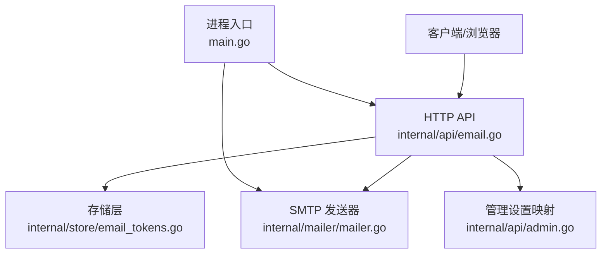
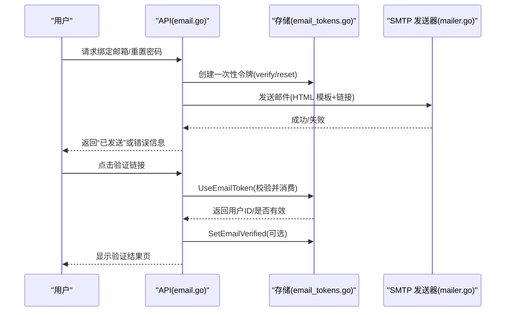
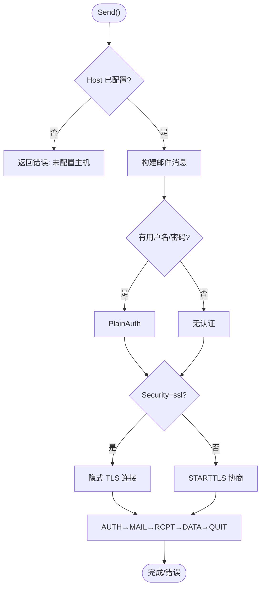
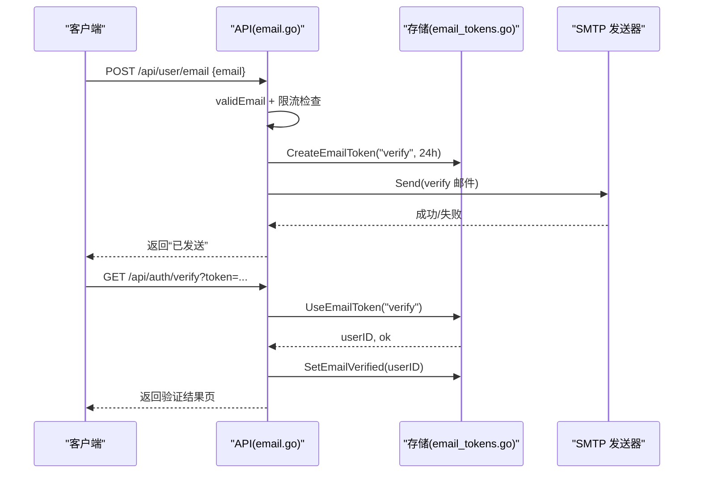
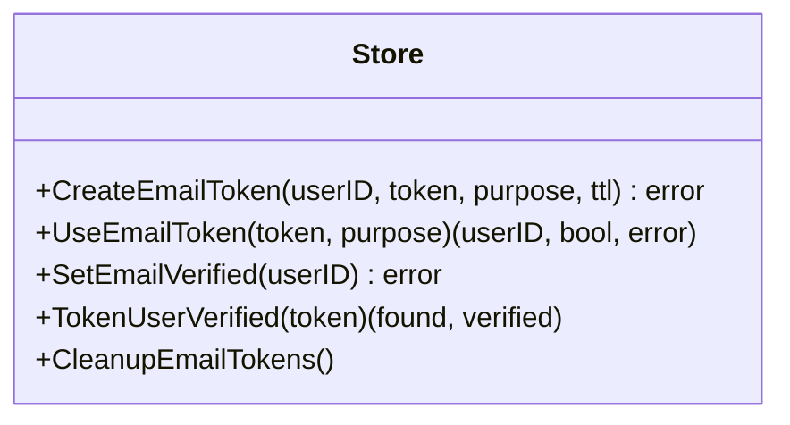
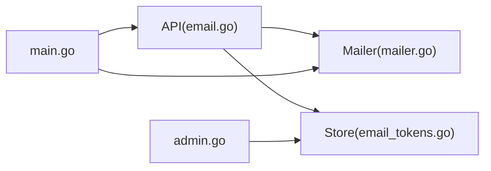

# 邮件通知系统

<cite>
**本文引用的文件**
- [main.go](file://main.go)
- [internal/mailer/mailer.go](file://internal/mailer/mailer.go)
- [internal/api/email.go](file://internal/api/email.go)
- [internal/store/email_tokens.go](file://internal/store/email_tokens.go)
- [internal/store/emailrebind_test.go](file://internal/store/emailrebind_test.go)
- [internal/api/admin.go](file://internal/api/admin.go)
- [deploy/qingzhou.env.example](file://deploy/qingzhou.env.example)
</cite>

## 目录
1. [简介](#简介)
2. [项目结构](#项目结构)
3. [核心组件](#核心组件)
4. [架构总览](#架构总览)
5. [详细组件分析](#详细组件分析)
6. [依赖关系分析](#依赖关系分析)
7. [性能与可靠性](#性能与可靠性)
8. [故障排查指南](#故障排查指南)
9. [结论](#结论)
10. [附录：API 参考](#附录api-参考)

## 简介
本系统提供基于 SMTP 的事务性邮件发送能力，覆盖邮箱绑定验证、密码重置等关键流程。系统支持隐式 TLS（端口 465）与 STARTTLS（默认 587），可配置发件人、安全策略与认证方式；在未配置 SMTP 时，系统会记录待发送邮件与链接，便于开发调试。验证码通过一次性令牌机制实现，具备过期与消费控制，保障安全性。邮件模板以 HTML 片段形式内嵌在代码中，便于快速渲染。

## 项目结构
邮件相关代码主要分布在以下模块：
- 邮件发送层：internal/mailer/mailer.go
- API 接口层：internal/api/email.go
- 令牌与持久化：internal/store/email_tokens.go
- 启动与配置注入：main.go
- 管理端设置映射：internal/api/admin.go
- 环境变量示例：deploy/qingzhou.env.example

图表来源
- [internal/api/email.go:17-58](file://internal/api/email.go#L17-L58)
- [internal/mailer/mailer.go:22-58](file://internal/mailer/mailer.go#L22-L58)
- [internal/store/email_tokens.go:7-46](file://internal/store/email_tokens.go#L7-L46)
- [main.go:144-169](file://main.go#L144-L169)

章节来源
- [internal/api/email.go:17-58](file://internal/api/email.go#L17-L58)
- [internal/mailer/mailer.go:22-58](file://internal/mailer/mailer.go#L22-L58)
- [internal/store/email_tokens.go:7-46](file://internal/store/email_tokens.go#L7-L46)
- [main.go:144-169](file://main.go#L144-L169)

## 核心组件
- SMTP 发送器：封装连接、认证、STARTTLS/隐式 TLS 选择、消息构建与投递，带超时保护。
- API 邮件处理：负责邮箱绑定、重发验证、密码重置、测试 SMTP 等流程，并调用发送器或记录日志。
- 令牌存储：创建、使用、清理一次性令牌，标记邮箱已验证，保证幂等与安全。
- 配置注入：从环境变量与数据库设置动态读取 SMTP 参数，支持热更新。
- 管理设置映射：将 SMTP 相关键与环境变量关联，并在管理界面展示有效值。

章节来源
- [internal/mailer/mailer.go:22-58](file://internal/mailer/mailer.go#L22-L58)
- [internal/api/email.go:17-58](file://internal/api/email.go#L17-L58)
- [internal/store/email_tokens.go:7-46](file://internal/store/email_tokens.go#L7-L46)
- [internal/api/admin.go:35-77](file://internal/api/admin.go#L35-L77)
- [main.go:144-169](file://main.go#L144-L169)

## 架构总览
下图展示了从用户触发到邮件发送的端到端流程，包括令牌生成、存储、邮件发送与结果反馈。

图表来源
- [internal/api/email.go:60-92](file://internal/api/email.go#L60-L92)
- [internal/api/email.go:94-153](file://internal/api/email.go#L94-L153)
- [internal/store/email_tokens.go:7-46](file://internal/store/email_tokens.go#L7-L46)
- [internal/mailer/mailer.go:42-58](file://internal/mailer/mailer.go#L42-L58)

## 详细组件分析

### SMTP 发送器（mailer.go）
- 支持隐式 TLS（465）与 STARTTLS（587/25），自动根据端口推断安全模式，也可显式配置。
- 连接建立与整个 SMTP 会话均受超时限制，避免阻塞请求 goroutine 与资源泄漏。
- 当未提供 STARTTLS 时拒绝明文传输，防止降级攻击面。
- 消息构建包含 From/To/Subject/MIME 与 HTML 正文。

图表来源
- [internal/mailer/mailer.go:42-111](file://internal/mailer/mailer.go#L42-L111)
- [internal/mailer/mailer.go:113-143](file://internal/mailer/mailer.go#L113-L143)
- [internal/mailer/mailer.go:145-160](file://internal/mailer/mailer.go#L145-L160)

章节来源
- [internal/mailer/mailer.go:15-20](file://internal/mailer/mailer.go#L15-L20)
- [internal/mailer/mailer.go:22-58](file://internal/mailer/mailer.go#L22-L58)
- [internal/mailer/mailer.go:60-111](file://internal/mailer/mailer.go#L60-L111)
- [internal/mailer/mailer.go:113-160](file://internal/mailer/mailer.go#L113-L160)

### API 邮件处理（email.go）
- currentMailer：按优先级读取环境变量与数据库设置，动态构造 SMTP 配置，无需重启生效。
- deliver：若 SMTP 未配置则记录日志与链接，便于开发调试；发送失败仅记录日志，不阻塞请求。
- handleBindEmail：校验邮箱格式、去重、限流、保存邮箱、生成 verify 令牌、发送邮件。
- handleResendVerify：对未验证用户重发验证邮件，带频率限制。
- handleForgot/handleReset：生成 reset 令牌、发送邮件、重置密码并清除会话。
- handleVerify：消费 verify 令牌，标记邮箱已验证，必要时为用户开通节点。
- 模板：verifyEmailHTML、resetEmailHTML 为内嵌 HTML 片段，用于渲染邮件内容。

图表来源
- [internal/api/email.go:177-223](file://internal/api/email.go#L177-L223)
- [internal/api/email.go:225-260](file://internal/api/email.go#L225-L260)
- [internal/api/email.go:60-92](file://internal/api/email.go#L60-L92)
- [internal/store/email_tokens.go:7-46](file://internal/store/email_tokens.go#L7-L46)

章节来源
- [internal/api/email.go:17-58](file://internal/api/email.go#L17-L58)
- [internal/api/email.go:60-92](file://internal/api/email.go#L60-L92)
- [internal/api/email.go:94-153](file://internal/api/email.go#L94-L153)
- [internal/api/email.go:155-174](file://internal/api/email.go#L155-L174)
- [internal/api/email.go:177-260](file://internal/api/email.go#L177-L260)
- [internal/api/email.go:286-312](file://internal/api/email.go#L286-L312)

### 令牌与邮箱验证（email_tokens.go）
- CreateEmailToken：插入 email_tokens 表，设置用途（verify/reset）、过期时间。
- UseEmailToken：原子校验并消费令牌，确保一次性使用与过期控制。
- SetEmailVerified：标记用户邮箱已验证。
- TokenUserVerified：用于友好提示“已验证”页面，避免重复点击产生无效链接。
- CleanupEmailTokens：定时清理过期令牌。

图表来源
- [internal/store/email_tokens.go:7-83](file://internal/store/email_tokens.go#L7-L83)

章节来源
- [internal/store/email_tokens.go:7-83](file://internal/store/email_tokens.go#L7-L83)
- [internal/store/emailrebind_test.go:8-39](file://internal/store/emailrebind_test.go#L8-L39)
- [internal/store/emailrebind_test.go:41-58](file://internal/store/emailrebind_test.go#L41-L58)

### 配置与多提供商支持
- 环境变量优先于数据库设置，支持运行时热更新 SMTP 配置。
- 支持不同 SMTP 提供商：通过 Host/Port/User/Pass/Security 灵活适配。
- 管理端设置映射将 SMTP 键与环境变量关联，并在面板中展示有效值与掩码敏感字段。

章节来源
- [internal/api/email.go:17-46](file://internal/api/email.go#L17-L46)
- [internal/api/admin.go:35-77](file://internal/api/admin.go#L35-L77)
- [main.go:144-169](file://main.go#L144-L169)
- [deploy/qingzhou.env.example:35-43](file://deploy/qingzhou.env.example#L35-L43)

## 依赖关系分析
- API 层依赖 mailer 进行实际发送，依赖 store 进行令牌管理与用户状态更新。
- main.go 在启动时构建 mailer 并注入 API，使 SMTP 配置生效。
- admin.go 暴露设置读取/写入接口，并将 SMTP 相关键与环境变量映射，便于前端展示与编辑。

图表来源
- [internal/api/email.go:17-58](file://internal/api/email.go#L17-L58)
- [internal/mailer/mailer.go:22-58](file://internal/mailer/mailer.go#L22-L58)
- [internal/store/email_tokens.go:7-46](file://internal/store/email_tokens.go#L7-L46)
- [main.go:144-169](file://main.go#L144-L169)
- [internal/api/admin.go:35-77](file://internal/api/admin.go#L35-L77)

章节来源
- [internal/api/email.go:17-58](file://internal/api/email.go#L17-L58)
- [internal/mailer/mailer.go:22-58](file://internal/mailer/mailer.go#L22-L58)
- [internal/store/email_tokens.go:7-46](file://internal/store/email_tokens.go#L7-L46)
- [main.go:144-169](file://main.go#L144-L169)
- [internal/api/admin.go:35-77](file://internal/api/admin.go#L35-L77)

## 性能与可靠性
- 超时保护：每个 SMTP 网络阶段与对话均有绝对截止时间，避免阻塞与资源泄漏。
- 非阻塞发送：API 层发送失败仅记录日志，不影响主流程响应。
- 限流防护：重发验证邮件接口具备频率限制，防止滥用。
- 安全加固：
  - 邮箱地址输入严格校验，拒绝 CR/LF 等字符，防止头部注入。
  - 未提供 STARTTLS 时拒绝明文传输，避免降级攻击。
  - 令牌一次性使用且有过期时间，重置密码后清除所有会话。
- 可扩展性：通过环境变量与数据库设置组合，支持多 SMTP 提供商切换与热更新。

[本节为通用指导，不直接分析具体文件]

## 故障排查指南
- SMTP 未配置：系统将记录待发送邮件与链接到日志，便于开发调试。
- 发送失败：查看日志中的错误信息，确认主机、端口、认证与安全策略是否正确。
- 邮箱格式错误：检查输入是否包含非法字符或格式不正确。
- 令牌无效或过期：确认链接是否在有效期内，是否已被消费。
- 频繁发送被拒：检查是否触发了重发频率限制。

章节来源
- [internal/api/email.go:48-58](file://internal/api/email.go#L48-L58)
- [internal/api/email.go:155-174](file://internal/api/email.go#L155-L174)
- [internal/api/email.go:225-260](file://internal/api/email.go#L225-L260)

## 结论
该邮件通知系统以简洁可靠的 SMTP 发送为核心，结合一次性令牌与严格的输入校验，实现了安全的邮箱绑定与密码重置流程。通过环境变量与数据库设置的组合，系统具备良好的可配置性与扩展性。建议在部署时启用 STARTTLS 或隐式 TLS，并合理配置限流与超时，以提升安全性与稳定性。

[本节为总结，不直接分析具体文件]

## 附录：API 参考
- 邮箱绑定
  - 方法：POST
  - 路径：/api/user/email
  - 请求体：{ "email": "用户邮箱" }
  - 行为：校验邮箱、保存邮箱、创建 verify 令牌、发送验证邮件
  - 返回：成功消息或错误信息

- 重发验证邮件
  - 方法：POST
  - 路径：/api/user/resend-verify
  - 行为：对未验证用户重发验证邮件，带频率限制
  - 返回：成功消息或错误信息

- 邮箱验证（点击链接）
  - 方法：GET
  - 路径：/api/auth/verify?token=...
  - 行为：消费 verify 令牌，标记邮箱已验证，必要时开通节点
  - 返回：HTML 结果页

- 忘记密码
  - 方法：POST
  - 路径：/api/auth/forgot
  - 请求体：{ "email": "用户邮箱" }
  - 行为：创建 reset 令牌，发送重置邮件
  - 返回：成功消息（不泄露邮箱是否存在）

- 重置密码
  - 方法：POST
  - 路径：/api/auth/reset
  - 请求体：{ "token": "...", "new_password": "新密码" }
  - 行为：校验令牌、更新密码、清除会话
  - 返回：成功消息或错误信息

- 测试 SMTP
  - 方法：POST
  - 路径：/api/admin/settings/test-smtp
  - 请求体：{ "to": "收件邮箱" }
  - 行为：发送测试邮件，验证 SMTP 配置
  - 返回：成功消息或错误信息

章节来源
- [internal/api/email.go:177-223](file://internal/api/email.go#L177-L223)
- [internal/api/email.go:225-260](file://internal/api/email.go#L225-L260)
- [internal/api/email.go:60-92](file://internal/api/email.go#L60-L92)
- [internal/api/email.go:94-153](file://internal/api/email.go#L94-L153)
- [internal/api/email.go:262-282](file://internal/api/email.go#L262-L282)
