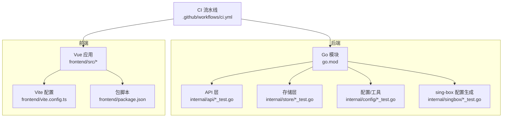
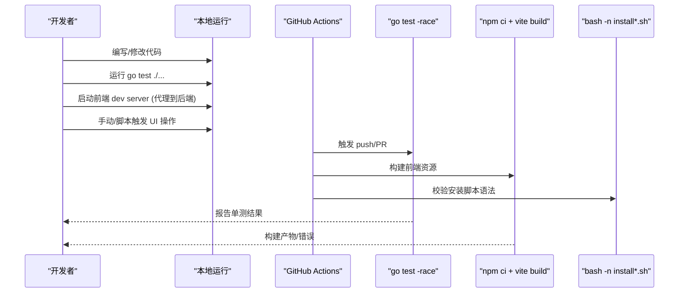
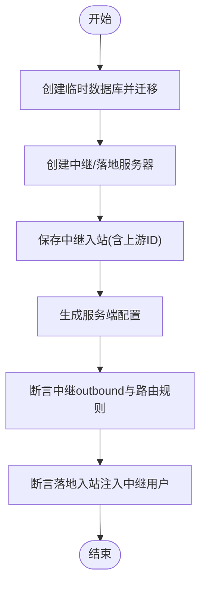
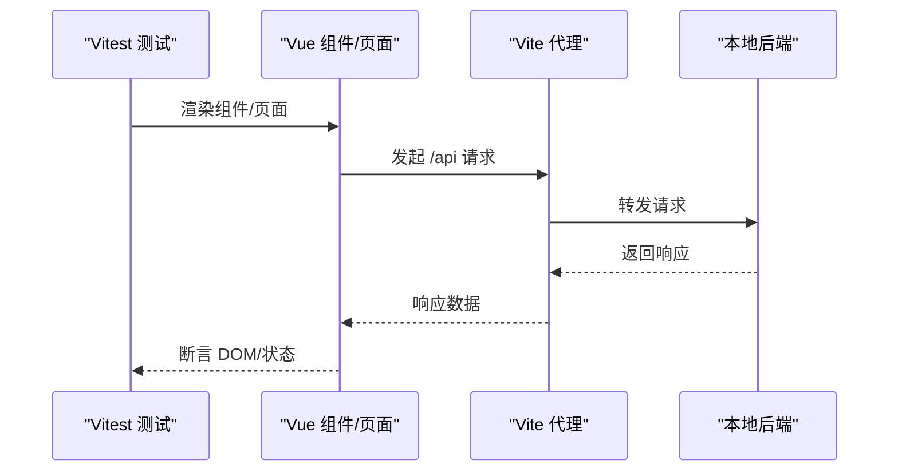
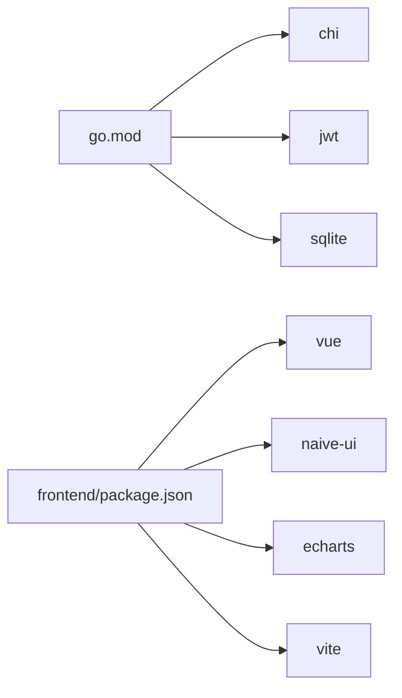

# 测试策略

<cite>
**本文引用的文件**
- [go.mod](file://go.mod)
- [ci.yml](file://.github/workflows/ci.yml)
- [package.json](file://frontend/package.json)
- [vite.config.ts](file://frontend/vite.config.ts)
- [config_test.go](file://internal/config/config_test.go)
- [dashboard_test.go](file://internal/api/dashboard_test.go)
- [mixed_test.go](file://internal/store/mixed_test.go)
- [relay_test.go](file://internal/store/relay_test.go)
- [egressopts_test.go](file://internal/store/egressopts_test.go)
- [userplans_queue_test.go](file://internal/store/userplans_queue_test.go)
- [queue_activations_test.go](file://internal/api/queue_activations_test.go)
- [dnsmodern_test.go](file://internal/subconv/dnsmodern_test.go)
- [generate.go](file://internal/singbox/generate.go)
- [AdminServers.vue](file://frontend/src/views/AdminServers.vue)
- [Monitor.vue](file://frontend/src/views/Monitor.vue)
</cite>

## 目录
1. [简介](#简介)
2. [项目结构](#项目结构)
3. [核心组件](#核心组件)
4. [架构总览](#架构总览)
5. [详细组件分析](#详细组件分析)
6. [依赖分析](#依赖分析)
7. [性能考虑](#性能考虑)
8. [故障排查指南](#故障排查指南)
9. [结论](#结论)
10. [附录](#附录)

## 简介
本文件为项目的测试策略与实施指南，覆盖测试金字塔、层次划分、单元测试规范、集成测试设计、前端测试策略（组件/页面/E2E）、测试数据与环境管理、性能与压力测试方法、自动化流程与持续集成配置、覆盖率统计与质量门禁。目标是帮助开发者在本地与 CI 中稳定、高效地验证后端 Go 服务与前端 Vue 应用的质量。

## 项目结构
本项目采用前后端分离：
- 后端：Go 模块，使用 chi 路由、SQLite 存储、sing-box 配置生成等能力；测试以 go test 为主，配合 race detector 检测并发问题。
- 前端：Vue 3 + Vite，开发时通过代理访问本地后端；构建产物被后端嵌入。

**图示来源**
- [go.mod:1-26](file://go.mod#L1-L26)
- [ci.yml:1-69](file://.github/workflows/ci.yml#L1-L69)
- [package.json:1-27](file://frontend/package.json#L1-L27)
- [vite.config.ts:1-32](file://frontend/vite.config.ts#L1-L32)

**章节来源**
- [go.mod:1-26](file://go.mod#L1-L26)
- [ci.yml:1-69](file://.github/workflows/ci.yml#L1-L69)
- [package.json:1-27](file://frontend/package.json#L1-L27)
- [vite.config.ts:1-32](file://frontend/vite.config.ts#L1-L32)

## 核心组件
- 后端测试
  - 单元测试：针对配置加载、API 计算逻辑、store 配置生成、subconv 渲染等，使用标准 testing 包，必要时构造临时数据库或内存状态。
  - 并发安全：CI 启用 race detector，确保 goroutine 竞争可被自动发现。
  - 集成测试：通过真实 SQLite 文件（t.TempDir）模拟持久化，验证跨层行为（如中继链路、混合入站、队列推进）。
- 前端测试
  - 当前仓库未包含前端测试框架与用例；建议引入 Vitest + Testing Library 进行组件与页面测试，并基于 Vite 的代理能力对接本地后端 API。
  - 构建阶段已作为质量门禁：CI 会执行前端构建，捕获编译错误。

**章节来源**
- [ci.yml:15-39](file://.github/workflows/ci.yml#L15-L39)
- [ci.yml:53-69](file://.github/workflows/ci.yml#L53-L69)
- [package.json:6-9](file://frontend/package.json#L6-L9)
- [vite.config.ts:12-25](file://frontend/vite.config.ts#L12-L25)

## 架构总览
测试金字塔在本项目中体现为：
- 底层：大量细粒度单元测试（配置、算法、渲染、队列推进等），快速且稳定。
- 中层：集成测试（Store + sing-box 配置生成、中继链路、用户计划队列推进），覆盖跨模块交互。
- 顶层：CI 中的构建与脚本语法检查，保证交付物可用；未来可扩展端到端测试。

**图示来源**
- [ci.yml:15-39](file://.github/workflows/ci.yml#L15-L39)
- [ci.yml:41-52](file://.github/workflows/ci.yml#L41-L52)
- [ci.yml:53-69](file://.github/workflows/ci.yml#L53-L69)

## 详细组件分析

### 后端单元测试规范与实践
- 命名与组织
  - 每个被测包提供同名 _test.go 文件，函数以 TestXxx(t *testing.T) 形式组织。
  - 复杂场景使用 t.Helper() 封装辅助函数，保持用例简洁。
- 数据与环境
  - 使用 t.TempDir() 创建临时数据库，避免污染文件系统。
  - 通过 t.Setenv() 设置环境变量，验证默认值与覆盖行为。
- 断言与可读性
  - 对关键业务常量（如监听地址默认值）进行“锁定式”断言，防止无意变更。
  - 对 JSON 配置输出进行反序列化后断言关键字段，确保结构正确。
- 并发与稳定性
  - CI 统一启用 race detector，提前暴露竞态条件。

示例参考路径
- 配置默认值与环境覆盖：[config_test.go:13-25](file://internal/config/config_test.go#L13-L25)
- Dashboard 流量比例边界用例：[dashboard_test.go:15-134](file://internal/api/dashboard_test.go#L15-L134)
- Store 中继链路与混合入站：[relay_test.go:12-52](file://internal/store/relay_test.go#L12-L52)、[mixed_test.go:14-49](file://internal/store/mixed_test.go#L14-L49)
- 出站选项与镜像规则：[egressopts_test.go:1-32](file://internal/store/egressopts_test.go#L1-L32)
- 队列推进与到期推进：[userplans_queue_test.go:83-123](file://internal/store/userplans_queue_test.go#L83-L123)、[queue_activations_test.go:9-39](file://internal/api/queue_activations_test.go#L9-L39)
- DNS 模板现代化渲染：[dnsmodern_test.go:195-237](file://internal/subconv/dnsmodern_test.go#L195-L237)

**章节来源**
- [config_test.go:13-25](file://internal/config/config_test.go#L13-L25)
- [dashboard_test.go:15-134](file://internal/api/dashboard_test.go#L15-L134)
- [relay_test.go:12-52](file://internal/store/relay_test.go#L12-L52)
- [mixed_test.go:14-49](file://internal/store/mixed_test.go#L14-L49)
- [egressopts_test.go:1-32](file://internal/store/egressopts_test.go#L1-L32)
- [userplans_queue_test.go:83-123](file://internal/store/userplans_queue_test.go#L83-L123)
- [queue_activations_test.go:9-39](file://internal/api/queue_activations_test.go#L9-L39)
- [dnsmodern_test.go:195-237](file://internal/subconv/dnsmodern_test.go#L195-L237)

### 集成测试设计与实现
- 目标
  - 验证跨层协作：Store 持久化 → sing-box 配置生成 → 节点侧行为（如中继转发、统计用户追踪）。
- 典型场景
  - 中继链路：在 Server 1 上创建 relay inbound，指向 Server 2 的 landing inbound，断言两端配置均正确注入 outbound/route/users。
  - 混合入站：确保 mixed inbound 的用户名出现在 v2ray_api.stats.users，以便按用户计量。
  - 队列推进：当活跃份耗尽或到期，自动推进下一个排队份，并校验有效期起始时间。
- 数据准备
  - 使用临时 SQLite 数据库，初始化迁移，写入最小必要数据。
  - 使用固定密钥或占位密码，避免泄露真实凭据。

**图示来源**
- [relay_test.go:12-52](file://internal/store/relay_test.go#L12-L52)
- [mixed_test.go:14-49](file://internal/store/mixed_test.go#L14-L49)

**章节来源**
- [relay_test.go:12-52](file://internal/store/relay_test.go#L12-L52)
- [mixed_test.go:14-49](file://internal/store/mixed_test.go#L14-L49)

### 前端测试策略
- 现状
  - 仓库未包含前端测试框架与用例；CI 仅执行构建，用于捕获编译错误。
  - 开发环境通过 Vite 代理将 /api、/sub 请求转发至本地后端（默认 127.0.0.1:8081）。
- 建议方案
  - 组件测试：使用 Vitest + @vue/test-utils，对关键组件（如 AdminServers、AdminSingbox、Monitor）进行渲染与交互断言。
  - 页面测试：基于路由组合页面，断言数据加载、筛选、图表渲染等。
  - 端到端测试：使用 Playwright/Cypress，结合本地后端与前端 dev server，模拟管理员/用户操作流程。
  - 网络与状态：利用 Mock/Stub 替代外部依赖（如 SSH、sing-box 进程），聚焦 UI 逻辑。
- 与现有工程集成
  - 在 package.json 中添加测试脚本，并在 CI 中新增前端测试任务。
  - 复用 vite.config.ts 的别名与代理配置，便于测试环境与开发一致。

**图示来源**
- [vite.config.ts:12-25](file://frontend/vite.config.ts#L12-L25)
- [package.json:6-9](file://frontend/package.json#L6-L9)

**章节来源**
- [vite.config.ts:12-25](file://frontend/vite.config.ts#L12-L25)
- [package.json:6-9](file://frontend/package.json#L6-L9)

### 性能测试与压力测试
- 后端
  - 使用 go test -bench 对热点路径（如配置生成、队列推进）建立基准；结合 pprof 定位瓶颈。
  - 使用 wrk/k6 对 API 接口进行压测，关注 QPS、延迟分布与错误率。
- 前端
  - 使用 Lighthouse/WebPageTest 评估首屏与交互性能；对大数据量图表页面进行渲染压力测试。
- 节点侧
  - 通过 AdminSingbox 页面的“并发探测”能力，模拟多连接访问出口，观察成功率与延迟分布，识别供应商并发上限。

**章节来源**
- [AdminServers.vue:110-131](file://frontend/src/views/AdminServers.vue#L110-L131)
- [Monitor.vue:204-350](file://frontend/src/views/Monitor.vue#L204-L350)

## 依赖分析
- 后端依赖
  - 主要依赖：chi、JWT、UUID、加密库、YAML、SQLite。
  - 测试依赖：标准库 testing，无需额外第三方测试框架。
- 前端依赖
  - 运行时：Vue、Pinia、Naive UI、ECharts、Router。
  - 开发时：Vite、TypeScript、vue-tsc。
- 测试相关依赖
  - 当前无前端测试依赖；建议在 package.json 中按需引入 Vitest、Testing Library、Playwright/Cypress。

**图示来源**
- [go.mod:5-13](file://go.mod#L5-L13)
- [package.json:11-24](file://frontend/package.json#L11-L24)

**章节来源**
- [go.mod:5-13](file://go.mod#L5-L13)
- [package.json:11-24](file://frontend/package.json#L11-L24)

## 性能考虑
- 并发安全
  - CI 始终启用 race detector，确保 goroutine 竞争在合并前被发现。
- 构建与缓存
  - 前端构建使用 npm ci 锁定依赖，提升可重复性与速度。
  - 后端构建前置一个最小化的 frontend/dist 占位，减少 CI 耗时。
- 脚本校验
  - 安装脚本在 CI 中进行语法检查，降低部署风险。

**章节来源**
- [ci.yml:15-39](file://.github/workflows/ci.yml#L15-L39)
- [ci.yml:41-52](file://.github/workflows/ci.yml#L41-L52)
- [ci.yml:53-69](file://.github/workflows/ci.yml#L53-L69)

## 故障排查指南
- 常见问题
  - 监听地址默认值被误改：通过配置默认值测试保障，若失败优先检查 Load().ListenAddr。
  - Dashboard 流量显示异常：核对不限量份额、池账户、过期/排队份额的过滤逻辑。
  - sing-box 配置缺失用户统计：确认 mixed 入站用户名是否写入 v2ray_api.stats.users。
  - 中继链路失效：检查中继入站的 upstream_inbound_id 与落地入站用户注入。
  - 队列推进不正确：验证 AdvanceAllQueues 与到期/耗尽触发条件。
- 调试建议
  - 使用 t.Logf 打印中间状态与生成的 JSON 配置片段。
  - 在本地复现时，开启更详细的日志，或使用 pprof 分析热点。
  - 前端问题优先检查代理配置与后端响应格式。

**章节来源**
- [config_test.go:13-25](file://internal/config/config_test.go#L13-L25)
- [dashboard_test.go:15-134](file://internal/api/dashboard_test.go#L15-L134)
- [mixed_test.go:14-49](file://internal/store/mixed_test.go#L14-L49)
- [relay_test.go:12-52](file://internal/store/relay_test.go#L12-L52)
- [userplans_queue_test.go:83-123](file://internal/store/userplans_queue_test.go#L83-L123)

## 结论
本项目已形成以 Go 单测为核心的质量保障体系，并通过 CI 的 race detector、构建与脚本校验形成基础门禁。前端尚未引入测试框架，但具备完善的开发与构建基础设施，建议尽快补齐组件/页面/E2E 测试，完善整体测试金字塔。对于性能与压力测试，建议在后端与前端分别建立基准与压测流程，并结合前端内置的并发探测能力，持续优化出口可用性。

## 附录

### 测试金字塔与层次结构
- 单元层：覆盖配置、算法、渲染、队列推进等核心逻辑。
- 集成层：覆盖 Store → sing-box 配置生成、中继链路、用户计划流转。
- 系统层：CI 构建与脚本校验；未来扩展端到端测试。

### 单元测试编写规范
- 使用 t.TempDir() 隔离数据，避免共享状态。
- 使用 t.Setenv() 控制环境变量，验证默认值与覆盖。
- 对 JSON 配置进行反序列化后断言关键字段，确保结构正确。
- 对关键业务常量进行“锁定式”断言，防止无意变更。

### 集成测试实现要点
- 使用临时 SQLite 数据库，执行迁移后写入最小数据集。
- 验证跨层行为：中继链路、混合入站、队列推进。
- 使用固定密钥或占位密码，避免泄露真实凭据。

### 前端测试策略建议
- 组件测试：Vitest + @vue/test-utils，断言渲染与交互。
- 页面测试：组合路由页面，断言数据流与图表渲染。
- 端到端测试：Playwright/Cypress，模拟管理员/用户流程。
- 与现有工程集成：复用 vite.config.ts 的别名与代理配置。

### 测试数据管理与环境搭建
- 后端：临时数据库、环境变量、固定密钥。
- 前端：本地后端默认监听 127.0.0.1:8081，Vite 代理 /api、/sub。

### 性能测试与压力测试
- 后端：go test -bench、pprof、wrk/k6。
- 前端：Lighthouse/WebPageTest，大数据量图表渲染压力测试。
- 节点侧：使用 AdminSingbox 并发探测能力，评估出口并发上限与延迟。

### 测试自动化与持续集成
- CI 任务：Go 构建、vet、race test；Shell 脚本语法检查；前端构建。
- 建议：增加前端测试任务，产出覆盖率报告。

### 覆盖率统计与质量门禁
- 后端：建议使用 go test -cover 收集覆盖率，并在 PR 中设置阈值。
- 前端：引入 Vitest 覆盖率插件，设定最低覆盖率要求。
- 门禁：构建失败、单测失败、脚本语法错误均应阻断合并。
