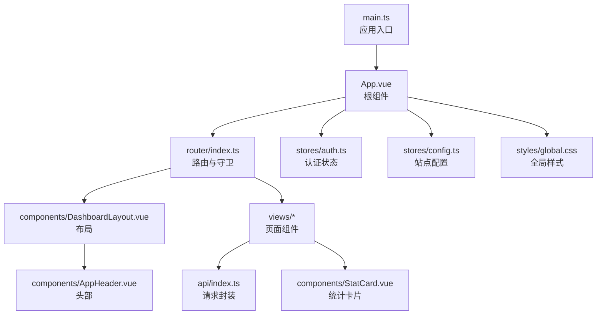
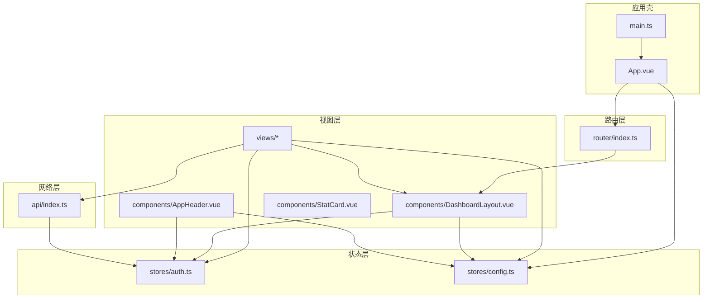
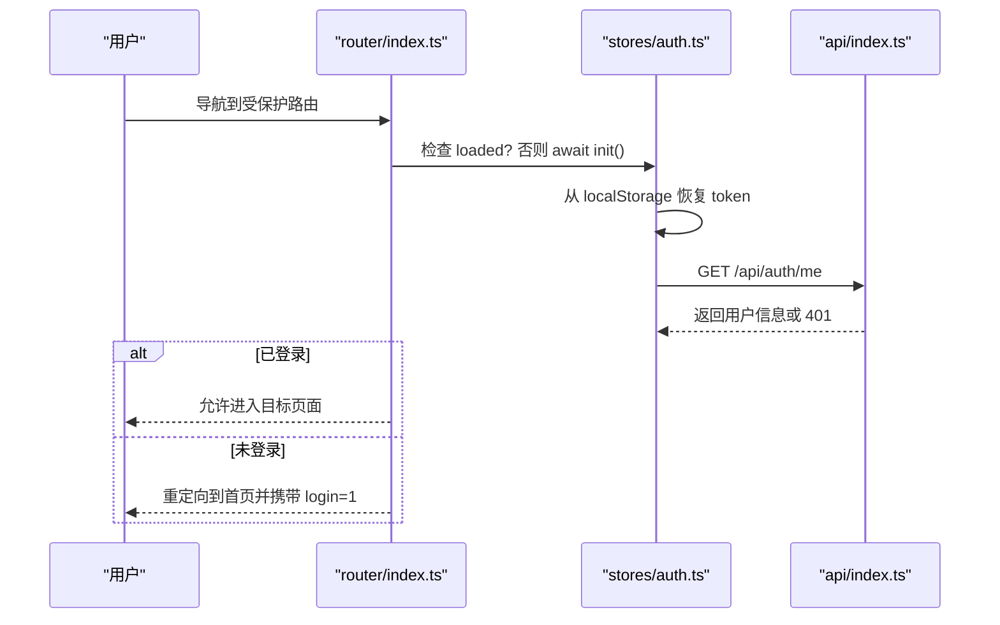
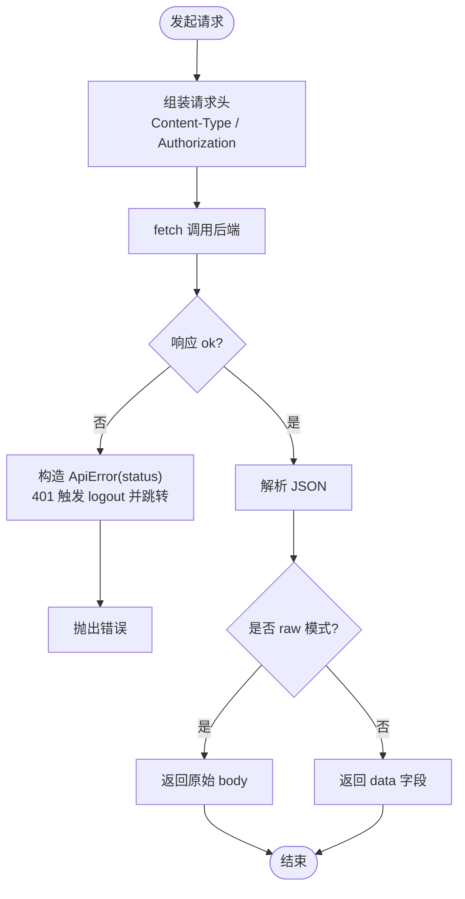
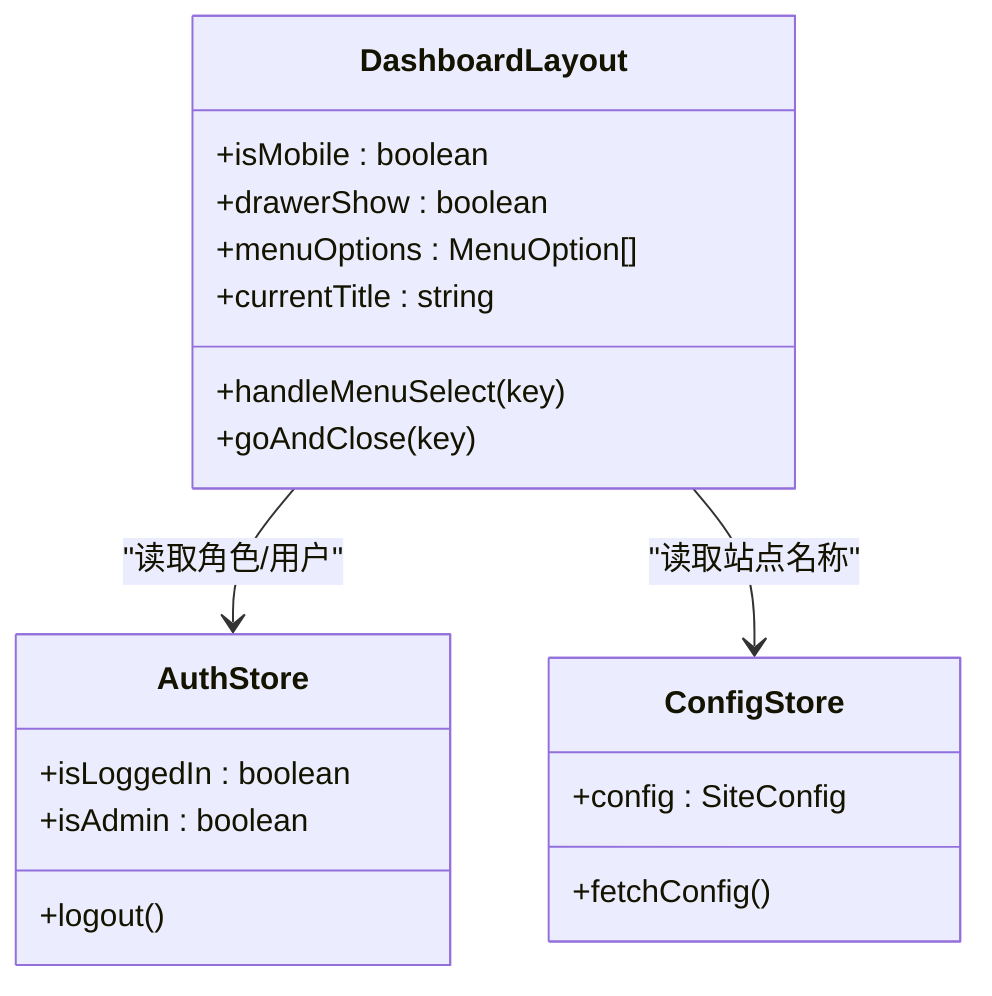
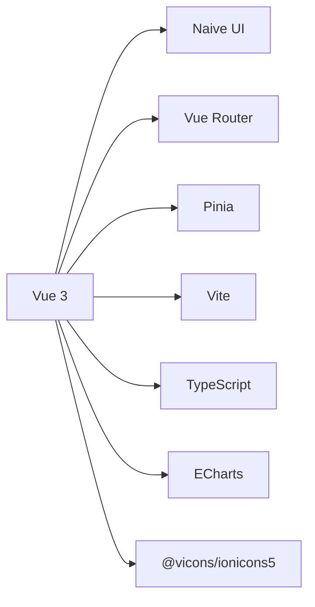

# 前端架构设计

<cite>
**本文引用的文件**
- [frontend/src/main.ts](file://frontend/src/main.ts)
- [frontend/src/App.vue](file://frontend/src/App.vue)
- [frontend/src/router/index.ts](file://frontend/src/router/index.ts)
- [frontend/src/api/index.ts](file://frontend/src/api/index.ts)
- [frontend/src/stores/auth.ts](file://frontend/src/stores/auth.ts)
- [frontend/src/stores/config.ts](file://frontend/src/stores/config.ts)
- [frontend/src/components/DashboardLayout.vue](file://frontend/src/components/DashboardLayout.vue)
- [frontend/src/components/AppHeader.vue](file://frontend/src/components/AppHeader.vue)
- [frontend/src/components/StatCard.vue](file://frontend/src/components/StatCard.vue)
- [frontend/src/views/UserDashboard.vue](file://frontend/src/views/UserDashboard.vue)
- [frontend/vite.config.ts](file://frontend/vite.config.ts)
- [frontend/package.json](file://frontend/package.json)
- [frontend/src/styles/global.css](file://frontend/src/styles/global.css)
</cite>

## 目录
1. [简介](#简介)
2. [项目结构](#项目结构)
3. [核心组件](#核心组件)
4. [架构总览](#架构总览)
5. [详细组件分析](#详细组件分析)
6. [依赖关系分析](#依赖关系分析)
7. [性能与构建优化](#性能与构建优化)
8. [故障排查指南](#故障排查指南)
9. [结论](#结论)
10. [附录](#附录)

## 简介
本文件面向轻舟面板的前端工程，系统性阐述基于 Vue 3 + TypeScript 的整体架构：组件化分层、状态管理（Pinia）、路由与鉴权、前后端通信封装、错误处理、响应式与主题、以及构建期优化策略。文档同时提供架构图表，帮助开发者快速理解模块职责与数据流转。

## 项目结构
前端采用典型的前后端分离结构，核心目录如下：
- src/main.ts：应用入口，挂载 Pinia 与 Router，引入全局样式
- src/App.vue：根组件，配置 Naive UI 主题与国际化，初始化站点配置
- src/router/index.ts：路由定义与守卫（登录/管理员权限）
- src/api/index.ts：统一请求封装（GET/POST/PUT/DELETE/下载），自动注入 Authorization，统一错误处理
- src/stores：Pinia 状态管理（auth、config）
- src/components：布局与通用组件（DashboardLayout、AppHeader、StatCard 等）
- src/views：页面级组件（用户控制台、订单、管理等）
- src/utils：工具函数（格式化、Markdown、计数动画等）
- src/styles/global.css：全局 CSS 变量、主题色、响应式网格、通用卡片样式
- vite.config.ts：Vite 开发服务器代理、别名、构建输出
- package.json：依赖与脚本

图表来源
- [frontend/src/main.ts:1-11](file://frontend/src/main.ts#L1-L11)
- [frontend/src/App.vue:1-30](file://frontend/src/App.vue#L1-L30)
- [frontend/src/router/index.ts:1-66](file://frontend/src/router/index.ts#L1-L66)
- [frontend/src/components/DashboardLayout.vue:1-249](file://frontend/src/components/DashboardLayout.vue#L1-L249)
- [frontend/src/components/AppHeader.vue:1-110](file://frontend/src/components/AppHeader.vue#L1-L110)
- [frontend/src/components/StatCard.vue:1-77](file://frontend/src/components/StatCard.vue#L1-L77)
- [frontend/src/api/index.ts:1-124](file://frontend/src/api/index.ts#L1-L124)
- [frontend/src/styles/global.css:1-131](file://frontend/src/styles/global.css#L1-L131)

章节来源
- [frontend/src/main.ts:1-11](file://frontend/src/main.ts#L1-L11)
- [frontend/src/App.vue:1-30](file://frontend/src/App.vue#L1-L30)
- [frontend/src/router/index.ts:1-66](file://frontend/src/router/index.ts#L1-L66)
- [frontend/src/api/index.ts:1-124](file://frontend/src/api/index.ts#L1-L124)
- [frontend/src/components/DashboardLayout.vue:1-249](file://frontend/src/components/DashboardLayout.vue#L1-L249)
- [frontend/src/components/AppHeader.vue:1-110](file://frontend/src/components/AppHeader.vue#L1-L110)
- [frontend/src/components/StatCard.vue:1-77](file://frontend/src/components/StatCard.vue#L1-L77)
- [frontend/src/styles/global.css:1-131](file://frontend/src/styles/global.css#L1-L131)

## 核心组件
- 应用入口与根组件
  - main.ts 创建 Vue 应用，注册 Pinia 与 Router，挂载到 #app
  - App.vue 使用 Naive UI 的 ConfigProvider 设置主题覆盖与中文本地化，并初始化站点配置
- 路由与鉴权
  - 使用 Hash 模式路由；受保护路由通过 meta.requiresAuth / requiresAdmin 控制
  - beforeEach 守卫在首次进入时等待 auth 初始化，未登录跳转至首页并携带 login=1 参数，非管理员访问管理页重定向
- 状态管理（Pinia）
  - auth store：维护 token、用户信息、登录/注册/登出、从 localStorage 恢复会话、防重复 init
  - config store：拉取站点配置，供品牌名、注册开关等使用
- API 封装
  - 统一 request 函数：自动附加 Authorization 头、credentials: include、解析 JSON、统一错误抛出（包含 status）
  - 提供 apiGet/apiPost/apiPut/apiDelete/apiList/apiDownload 等便捷方法
  - 对 401 自动登出并引导回登录页，避免死循环
- 布局与页面
  - DashboardLayout：桌面侧边栏 + 移动端抽屉菜单，动态生成菜单项，响应式切换，顶部标题与用户菜单
  - AppHeader：轻量头部，支持登录弹窗、用户下拉、管理员快捷入口
  - StatCard：可点击统计卡片，带入场动画与悬停反馈
  - UserDashboard：控制台页面，聚合流量环形图、趋势图、公告等，组合多个子组件

章节来源
- [frontend/src/main.ts:1-11](file://frontend/src/main.ts#L1-L11)
- [frontend/src/App.vue:1-30](file://frontend/src/App.vue#L1-L30)
- [frontend/src/router/index.ts:1-66](file://frontend/src/router/index.ts#L1-L66)
- [frontend/src/stores/auth.ts:1-75](file://frontend/src/stores/auth.ts#L1-L75)
- [frontend/src/stores/config.ts:1-37](file://frontend/src/stores/config.ts#L1-L37)
- [frontend/src/api/index.ts:1-124](file://frontend/src/api/index.ts#L1-L124)
- [frontend/src/components/DashboardLayout.vue:1-249](file://frontend/src/components/DashboardLayout.vue#L1-L249)
- [frontend/src/components/AppHeader.vue:1-110](file://frontend/src/components/AppHeader.vue#L1-L110)
- [frontend/src/components/StatCard.vue:1-77](file://frontend/src/components/StatCard.vue#L1-L77)
- [frontend/src/views/UserDashboard.vue:1-200](file://frontend/src/views/UserDashboard.vue#L1-L200)

## 架构总览
下图展示前端各层职责与交互关系：视图层调用 Store，Store 通过 API 封装与后端通信；路由守卫负责鉴权；布局组件组织页面骨架；全局样式与主题由根组件注入。

图表来源
- [frontend/src/main.ts:1-11](file://frontend/src/main.ts#L1-L11)
- [frontend/src/App.vue:1-30](file://frontend/src/App.vue#L1-L30)
- [frontend/src/router/index.ts:1-66](file://frontend/src/router/index.ts#L1-L66)
- [frontend/src/stores/auth.ts:1-75](file://frontend/src/stores/auth.ts#L1-L75)
- [frontend/src/stores/config.ts:1-37](file://frontend/src/stores/config.ts#L1-L37)
- [frontend/src/api/index.ts:1-124](file://frontend/src/api/index.ts#L1-L124)
- [frontend/src/components/DashboardLayout.vue:1-249](file://frontend/src/components/DashboardLayout.vue#L1-L249)
- [frontend/src/components/AppHeader.vue:1-110](file://frontend/src/components/AppHeader.vue#L1-L110)

## 详细组件分析

### 路由与鉴权流程
- 路由定义：公共页与受保护页（requiresAuth）与管理后台（requiresAdmin）
- 前置守卫：首次加载等待 auth.init，校验登录态与管理员权限，必要时重定向
- 登录后行为：token 写入 localStorage，后续请求自动携带 Authorization

图表来源
- [frontend/src/router/index.ts:1-66](file://frontend/src/router/index.ts#L1-L66)
- [frontend/src/stores/auth.ts:1-75](file://frontend/src/stores/auth.ts#L1-L75)
- [frontend/src/api/index.ts:1-124](file://frontend/src/api/index.ts#L1-L124)

章节来源
- [frontend/src/router/index.ts:1-66](file://frontend/src/router/index.ts#L1-L66)
- [frontend/src/stores/auth.ts:1-75](file://frontend/src/stores/auth.ts#L1-L75)

### API 封装与错误处理
- 统一请求：自动注入 Content-Type 与 Authorization，携带 credentials
- 错误处理：非 2xx 抛出自定义 ApiError（含 status），401 触发登出并跳转登录
- 响应解包：默认返回 {data}，raw 模式返回完整响应体（用于直接返回 JSON 的场景）
- 列表与下载：apiList 保证数组返回；apiDownload 以 Blob 方式下载并处理文件名

图表来源
- [frontend/src/api/index.ts:1-124](file://frontend/src/api/index.ts#L1-L124)
- [frontend/src/stores/auth.ts:1-75](file://frontend/src/stores/auth.ts#L1-L75)

章节来源
- [frontend/src/api/index.ts:1-124](file://frontend/src/api/index.ts#L1-L124)
- [frontend/src/stores/auth.ts:1-75](file://frontend/src/stores/auth.ts#L1-L75)

### 布局与响应式设计
- DashboardLayout：桌面端固定侧边栏，移动端使用 Drawer 抽屉；根据窗口宽度切换；顶部标题与用户菜单；动态菜单按角色渲染
- 响应式：使用 matchMedia 监听尺寸变化，CSS 媒体查询调整间距与栅格列数
- 主题与国际化：App.vue 中通过 Naive UI 的 theme-overrides 与 zhCN/dateZhCN 实现主题与语言

图表来源
- [frontend/src/components/DashboardLayout.vue:1-249](file://frontend/src/components/DashboardLayout.vue#L1-L249)
- [frontend/src/stores/auth.ts:1-75](file://frontend/src/stores/auth.ts#L1-L75)
- [frontend/src/stores/config.ts:1-37](file://frontend/src/stores/config.ts#L1-L37)

章节来源
- [frontend/src/components/DashboardLayout.vue:1-249](file://frontend/src/components/DashboardLayout.vue#L1-L249)
- [frontend/src/App.vue:1-30](file://frontend/src/App.vue#L1-L30)
- [frontend/src/styles/global.css:1-131](file://frontend/src/styles/global.css#L1-L131)

### 页面组件示例：控制台
- 聚合指标：剩余流量、生效套餐、积分、用量趋势
- 子组件复用：StatCard、TrafficTrendChart
- 数据获取：通过 apiGet/apiList 拉取仪表盘数据与公告
- 交互：刷新、跳转订阅/订单、公告弹窗

章节来源
- [frontend/src/views/UserDashboard.vue:1-200](file://frontend/src/views/UserDashboard.vue#L1-L200)
- [frontend/src/components/StatCard.vue:1-77](file://frontend/src/components/StatCard.vue#L1-L77)

### 通用组件：统计卡片
- 可点击/不可点击两种形态，支持标签、副标题、颜色、延迟入场动画
- 悬停高亮与箭头提示，提升可发现性

章节来源
- [frontend/src/components/StatCard.vue:1-77](file://frontend/src/components/StatCard.vue#L1-L77)

## 依赖关系分析
- 框架与UI库：Vue 3、Naive UI、ECharts（图表）、Ionicons（图标）
- 状态与路由：Pinia、Vue Router
- 构建工具：Vite、TypeScript
- 开发代理：vite.config.ts 将 /api 与 /sub 代理到本地后端端口，便于联调

图表来源
- [frontend/package.json:1-27](file://frontend/package.json#L1-L27)
- [frontend/vite.config.ts:1-32](file://frontend/vite.config.ts#L1-L32)

章节来源
- [frontend/package.json:1-27](file://frontend/package.json#L1-L27)
- [frontend/vite.config.ts:1-32](file://frontend/vite.config.ts#L1-L32)

## 性能与构建优化
- 代码分割与懒加载
  - 路由级懒加载：所有页面组件通过动态 import 按需加载，减少首屏体积
- 资源压缩与打包
  - Vite 构建输出到 dist，启用空目录清理
  - 生产环境可通过 Vite 插件进一步压缩（如 Terser、图片优化等）
- 开发体验
  - 开发服务器开启代理，解决跨域问题，简化联调
- 运行时优化建议
  - 大列表使用虚拟滚动（结合 Naive UI 的虚拟滚动能力）
  - 图表按需引入与销毁，避免内存泄漏
  - 图片与静态资源使用 CDN 或缓存策略

[本节为通用指导，不直接分析具体文件]

## 故障排查指南
- 401 未授权
  - 现象：请求失败并跳转到登录页
  - 原因：token 过期或无效，API 封装会触发 logout 并跳转
  - 处理：重新登录；检查后端会话与 JWT 配置
- 路由守卫导致无法进入页面
  - 现象：访问受保护路由被重定向
  - 原因：未登录或非管理员
  - 处理：确认登录态；检查路由 meta 配置
- 下载失败
  - 现象：二进制下载报错
  - 原因：未携带认证头或后端返回 JSON 错误信封
  - 处理：使用 apiDownload，确保 token 存在；查看后端返回 msg
- 移动端菜单异常
  - 现象：抽屉不关闭或菜单错位
  - 原因：窗口尺寸监听或 Drawer 状态不同步
  - 处理：检查 isMobile 与 drawerShow 的状态更新逻辑

章节来源
- [frontend/src/api/index.ts:1-124](file://frontend/src/api/index.ts#L1-L124)
- [frontend/src/router/index.ts:1-66](file://frontend/src/router/index.ts#L1-L66)
- [frontend/src/components/DashboardLayout.vue:1-249](file://frontend/src/components/DashboardLayout.vue#L1-L249)

## 结论
轻舟面板前端采用清晰的层次化架构：视图层聚焦业务呈现，状态层集中管理认证与配置，网络层统一封装请求与错误处理，路由层负责导航与鉴权。配合 Naive UI 的主题与国际化、Vite 的构建与代理能力，实现了良好的可维护性与扩展性。建议在后续迭代中继续强化代码分割、按需引入与性能监控，进一步提升用户体验。

## 附录
- 主题定制
  - 通过 App.vue 中的 theme-overrides 修改主色、圆角等
  - 全局 CSS 变量集中管理色彩与字体，便于统一风格
- 国际化支持
  - 使用 Naive UI 的 zhCN 与 dateZhCN 完成中文本地化
- 开发规范建议
  - 页面组件保持单一职责，复杂逻辑下沉到 Store 或 utils
  - API 调用统一通过 api/* 封装，禁止直接使用 fetch
  - 路由 meta 明确标注权限要求，便于统一守卫处理

[本节为概念性说明，不直接分析具体文件]
