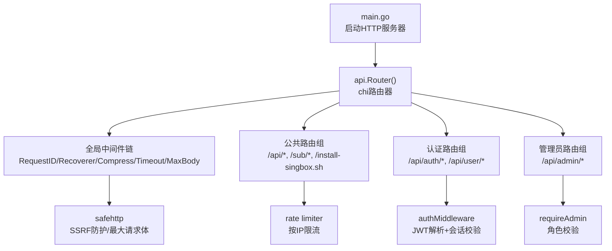
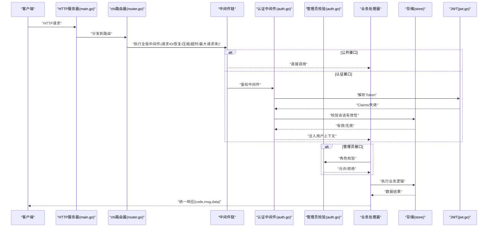
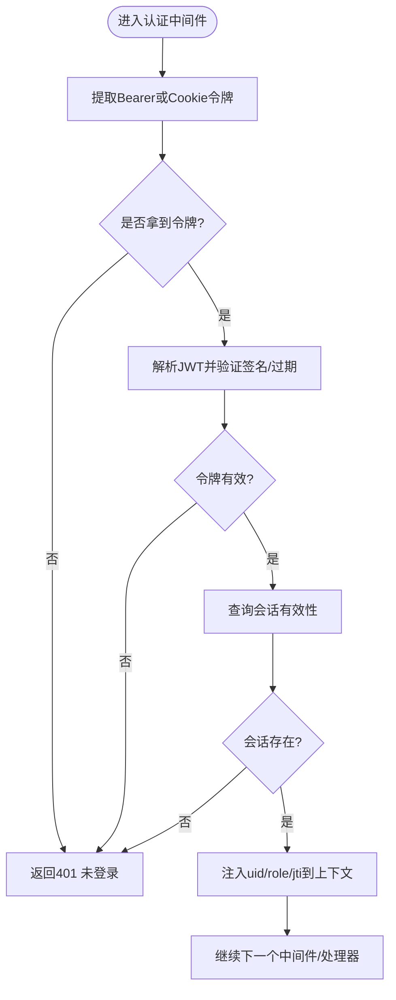
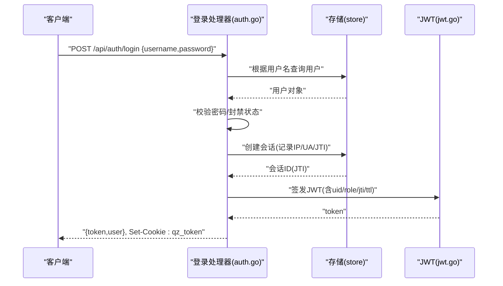
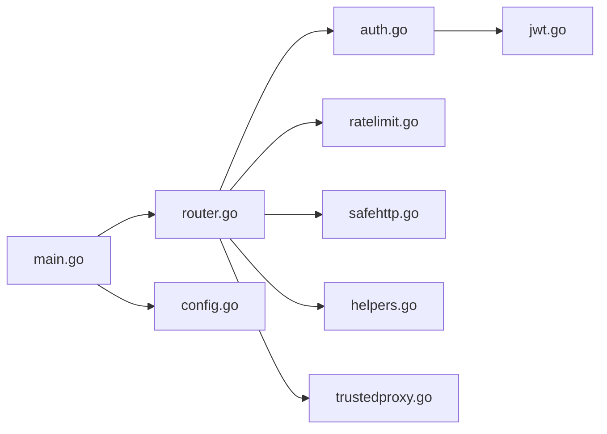

# API层设计

<cite>
**本文引用的文件**
- [main.go](file://main.go)
- [router.go](file://internal/api/router.go)
- [auth.go](file://internal/api/auth.go)
- [jwt.go](file://internal/auth/jwt.go)
- [respond.go](file://internal/api/respond.go)
- [safehttp.go](file://internal/api/safehttp.go)
- [ratelimit.go](file://internal/api/ratelimit.go)
- [helpers.go](file://internal/api/helpers.go)
- [trustedproxy.go](file://internal/api/trustedproxy.go)
- [config.go](file://internal/config/config.go)
</cite>

## 目录
1. [简介](#简介)
2. [项目结构](#项目结构)
3. [核心组件](#核心组件)
4. [架构总览](#架构总览)
5. [详细组件分析](#详细组件分析)
6. [依赖关系分析](#依赖关系分析)
7. [性能考量](#性能考量)
8. [故障排查指南](#故障排查指南)
9. [结论](#结论)
10. [附录：最佳实践与示例](#附录最佳实践与示例)

## 简介
本文件面向轻舟面板的API层设计与实现，基于 go-chi 框架构建RESTful服务。文档覆盖HTTP服务器启动流程、中间件链设计、路由注册机制、请求处理管道（认证、权限、限流、日志、错误处理）、统一响应格式、错误码与状态码规范、JWT认证机制（签发、校验、会话管理）、以及版本控制策略与向后兼容建议。文末提供添加新端点、自定义中间件、复杂业务处理的实践指引与性能优化建议。

## 项目结构
API层位于 internal/api 包，通过 chi.Router 组织路由与中间件；认证与令牌在 internal/auth；配置在 internal/config；安全相关能力（SSRF防护、最大请求体限制）在 safehttp.go；限流器在 ratelimit.go；通用工具与Cookie/URL构造在 helpers.go 与 trustedproxy.go。

图表来源
- [main.go:108-121](file://main.go#L108-L121)
- [router.go:132-148](file://internal/api/router.go#L132-L148)
- [router.go:149-384](file://internal/api/router.go#L149-L384)
- [auth.go:179-213](file://internal/api/auth.go#L179-L213)
- [ratelimit.go:53-64](file://internal/api/ratelimit.go#L53-L64)
- [safehttp.go:27-69](file://internal/api/safehttp.go#L27-L69)

章节来源
- [main.go:25-142](file://main.go#L25-L142)
- [router.go:132-384](file://internal/api/router.go#L132-L384)
- [config.go:14-29](file://internal/config/config.go#L14-L29)

## 核心组件
- HTTP服务器与生命周期管理：监听地址、超时、优雅关闭、后台任务（控制器、队列推进、证书续期等）。
- 路由与中间件：chi路由器，全局中间件链，分组路由（公共/认证/管理员），静态资源与SPA兜底。
- 认证与授权：JWT签发与解析、Cookie/Bearer双通道、会话持久化与撤销、管理员角色校验。
- 限流：固定窗口按IP限流，针对登录、注册、重置、探针上报、订阅地址切换等敏感操作。
- 安全：SSRF防护（仅允许http/https且拒绝内网IP）、最大请求体限制、可信代理头白名单。
- 响应标准化：统一JSON信封 {code,msg,data}，成功与失败封装函数。
- 工具与安全辅助：publicBase推导、Cookie设置、字符串/URL规范化、Shell参数转义等。

章节来源
- [main.go:108-142](file://main.go#L108-L142)
- [router.go:132-384](file://internal/api/router.go#L132-L384)
- [auth.go:179-213](file://internal/api/auth.go#L179-L213)
- [ratelimit.go:9-64](file://internal/api/ratelimit.go#L9-L64)
- [safehttp.go:12-85](file://internal/api/safehttp.go#L12-L85)
- [respond.go:8-25](file://internal/api/respond.go#L8-L25)
- [helpers.go:52-125](file://internal/api/helpers.go#L52-L125)
- [trustedproxy.go:10-64](file://internal/api/trustedproxy.go#L10-L64)

## 架构总览
下图展示从请求进入HTTP服务器到处理器执行的完整链路，包括中间件顺序与职责分离。

图表来源
- [main.go:108-121](file://main.go#L108-L121)
- [router.go:132-148](file://internal/api/router.go#L132-L148)
- [auth.go:179-213](file://internal/api/auth.go#L179-L213)
- [jwt.go:16-42](file://internal/auth/jwt.go#L16-L42)
- [respond.go:11-25](file://internal/api/respond.go#L11-L25)

## 详细组件分析

### HTTP服务器与启动流程
- 加载配置并打开数据库，执行迁移与种子数据。
- 初始化邮件发送器、API实例、原生sing-box控制器与后台任务。
- 创建http.Server，设置读写超时与空闲超时，启动监听。
- 优雅关闭：捕获信号，取消上下文，等待后台任务完成后再关闭DB。

章节来源
- [main.go:25-142](file://main.go#L25-L142)
- [config.go:14-29](file://internal/config/config.go#L14-L29)

### 路由与中间件链
- 全局中间件顺序：
  - RequestID：为每个请求生成唯一ID，便于追踪。
  - Recoverer：捕获panic并返回友好错误。
  - Compress：对JSON与前端静态资源进行gzip压缩。
  - Timeout：请求级超时保护（默认30秒）。
  - MaxBody：限制请求体大小（默认8MB），防止内存压力。
- 分组路由：
  - 公共：健康检查、站点配置、验证码、订阅地址、监控公开接口、探针上报与安装脚本。
  - 认证：登录、注册、忘记密码、重置密码、当前用户信息、登出、用户套餐/订单/节点/统计等。
  - 管理员：系统设置、备份、sing-box配置、证书中心、服务器管理、监控仪表盘、节点/分组/来源、用户与统计、公告、注册码等。
- SPA兜底：所有未匹配的路径由嵌入的前端静态资源处理。

章节来源
- [router.go:132-384](file://internal/api/router.go#L132-L384)

### 认证与授权中间件
- 认证中间件：
  - 支持Authorization: Bearer与Cookie两种方式获取令牌。
  - 使用JWT解析令牌，校验签名与有效期。
  - 校验会话是否存在且未过期，支持远程注销与撤销。
  - 将用户ID、角色、JTI写入请求上下文供后续处理器使用。
- 管理员校验：
  - 仅当上下文中的角色为admin时放行，否则返回403。

图表来源
- [auth.go:179-213](file://internal/api/auth.go#L179-L213)
- [jwt.go:16-42](file://internal/auth/jwt.go#L16-L42)

章节来源
- [auth.go:179-213](file://internal/api/auth.go#L179-L213)
- [jwt.go:16-42](file://internal/auth/jwt.go#L16-L42)

### 限流中间件
- 固定窗口限流器：按IP维度维护计数与窗口重置时间。
- 针对登录、注册、忘记密码、重置密码、探针上报、订阅地址切换等敏感路径启用限流。
- 超限返回429，提示“请求过于频繁”。

章节来源
- [ratelimit.go:9-64](file://internal/api/ratelimit.go#L9-L64)
- [router.go:155-168](file://internal/api/router.go#L155-L168)

### 安全与输入防护
- SSRF防护：
  - 对外发起HTTP请求时使用安全客户端，解析域名后拒绝连接内网/回环/CGNAT等地址。
  - 仅允许http/https协议，拒绝file/gopher等危险协议。
- 最大请求体限制：
  - 通过MaxBytesReader限制请求体大小，避免恶意大POST导致内存耗尽。
- 可信代理头：
  - 仅信任来自可信代理的X-Forwarded-*和X-Real-IP头，防止伪造源IP与Host。

章节来源
- [safehttp.go:12-85](file://internal/api/safehttp.go#L12-L85)
- [trustedproxy.go:10-64](file://internal/api/trustedproxy.go#L10-L64)

### 统一响应与错误码
- 成功响应：{code:0, msg:"", data:...}
- 错误响应：{code:HTTP状态码, msg:"人类可读错误", data:nil}
- 常用HTTP状态码：
  - 200：成功
  - 400：请求格式错误
  - 401：未登录/令牌无效/会话失效
  - 403：无管理员权限
  - 404：资源不存在
  - 429：请求过于频繁
  - 500：服务器内部错误

章节来源
- [respond.go:8-25](file://internal/api/respond.go#L8-L25)
- [auth.go:112-149](file://internal/api/auth.go#L112-L149)
- [ratelimit.go:53-64](file://internal/api/ratelimit.go#L53-L64)

### JWT认证机制
- 令牌签发：
  - 包含用户ID、角色、随机JTI、签发时间与过期时间。
  - 使用HS256对称签名，密钥来源于配置。
- 令牌校验：
  - 校验签名方法是否为HMAC，校验令牌有效性。
- 会话绑定：
  - 登录成功后记录会话（含设备指纹与IP），支持列出与撤销。
  - 登出时删除对应会话并清除Cookie。

图表来源
- [auth.go:49-65](file://internal/api/auth.go#L49-L65)
- [auth.go:112-149](file://internal/api/auth.go#L112-L149)
- [jwt.go:16-42](file://internal/auth/jwt.go#L16-L42)

章节来源
- [auth.go:49-65](file://internal/api/auth.go#L49-L65)
- [auth.go:112-149](file://internal/api/auth.go#L112-L149)
- [jwt.go:16-42](file://internal/auth/jwt.go#L16-L42)
- [sessions.go:10-42](file://internal/api/sessions.go#L10-L42)

### API版本控制与向后兼容
- 当前路由未显式引入版本前缀（如/v1），采用单一版本演进策略。
- 建议：
  - 通过请求头Accept-Version或URL前缀引入版本控制。
  - 新增字段保持可选，删除字段保留兼容占位。
  - 变更响应结构时提供迁移期双格式输出。
  - 通过配置开关渐进灰度新功能。

[本节为概念性说明，不直接分析具体代码文件]

## 依赖关系分析
- main.go依赖：
  - api.New()：构建API实例，注入store、secret、mailer，并初始化限流器与更新管理器。
  - sbctl.Controller：原生sing-box控制器，负责配置重建与推送。
  - http.Server：承载HTTP服务。
- router.go依赖：
  - chi/v5与middleware：路由与内置中间件。
  - store、mailer、sbctl、updater：业务与外部集成。
- auth.go依赖：
  - internal/auth：JWT签发与解析。
  - internal/store：用户与会话存取。
- safehttp.go依赖：
  - net/http与net：安全客户端与IP判断。
- ratelimit.go依赖：
  - sync.Mutex与time：并发安全的固定窗口限流。
- helpers.go与trustedproxy.go依赖：
  - os/net/http：环境变量、可信代理判定、Cookie与URL构造。

图表来源
- [main.go:73-101](file://main.go#L73-L101)
- [router.go:132-148](file://internal/api/router.go#L132-L148)
- [auth.go:179-213](file://internal/api/auth.go#L179-L213)
- [jwt.go:16-42](file://internal/auth/jwt.go#L16-L42)
- [ratelimit.go:9-64](file://internal/api/ratelimit.go#L9-L64)
- [safehttp.go:27-69](file://internal/api/safehttp.go#L27-L69)
- [helpers.go:52-125](file://internal/api/helpers.go#L52-L125)
- [trustedproxy.go:10-64](file://internal/api/trustedproxy.go#L10-L64)
- [config.go:14-29](file://internal/config/config.go#L14-L29)

章节来源
- [main.go:73-101](file://main.go#L73-L101)
- [router.go:132-148](file://internal/api/router.go#L132-L148)
- [auth.go:179-213](file://internal/api/auth.go#L179-L213)
- [jwt.go:16-42](file://internal/auth/jwt.go#L16-L42)
- [ratelimit.go:9-64](file://internal/api/ratelimit.go#L9-L64)
- [safehttp.go:27-69](file://internal/api/safehttp.go#L27-L69)
- [helpers.go:52-125](file://internal/api/helpers.go#L52-L125)
- [trustedproxy.go:10-64](file://internal/api/trustedproxy.go#L10-L64)
- [config.go:14-29](file://internal/config/config.go#L14-L29)

## 性能考量
- 请求体限制：防止恶意大POST导致内存压力，合理设置上限（默认8MB）。
- 压缩：对JSON与静态资源启用gzip，降低带宽占用。
- 超时：请求级超时保护，避免长尾请求拖垮服务。
- 限流：按IP固定窗口限流，保护敏感接口免受暴力破解与滥用。
- 安全客户端：对外请求拒绝内网与危险协议，减少攻击面。
- 后台任务：控制器与队列推进异步执行，避免阻塞HTTP响应。

[本节提供通用指导，不直接分析具体代码文件]

## 故障排查指南
- 登录失败：
  - 检查JWT密钥是否一致，确认会话是否存在与未过期。
  - 查看401响应消息，区分“未登录”“令牌无效”“会话失效”。
- 权限不足：
  - 管理员接口需角色为admin，否则返回403。
- 请求被限流：
  - 检查429响应，确认触发限流的IP与窗口。
- 外部请求失败：
  - 检查SSRF防护是否拦截了目标地址或协议。
- Cookie问题：
  - 确认Secure标志与HTTPS环境匹配，检查SameSite策略。

章节来源
- [auth.go:112-149](file://internal/api/auth.go#L112-L149)
- [auth.go:179-213](file://internal/api/auth.go#L179-L213)
- [ratelimit.go:53-64](file://internal/api/ratelimit.go#L53-L64)
- [safehttp.go:71-85](file://internal/api/safehttp.go#L71-L85)
- [helpers.go:104-125](file://internal/api/helpers.go#L104-L125)

## 结论
轻舟面板的API层以go-chi为核心，结合严格的中间件链与统一响应格式，实现了清晰的职责分离与健壮的安全防护。JWT与会话机制保障了身份认证与权限控制，限流与SSRF防护提升了抗攻击能力。通过模块化设计与可插拔中间件，系统具备良好的扩展性与可维护性。建议在后续演进中引入显式版本控制与更细粒度的审计日志，进一步提升可观测性与兼容性。

[本节为总结性内容，不直接分析具体代码文件]

## 附录：最佳实践与示例

### 如何添加新的API端点
- 在router.go中选择合适的分组（公共/认证/管理员）注册路由。
- 在对应文件中实现处理器函数，使用ok/fail统一响应。
- 如需认证或管理员权限，加入相应中间件组。

章节来源
- [router.go:149-384](file://internal/api/router.go#L149-L384)
- [respond.go:11-25](file://internal/api/respond.go#L11-L25)

### 如何实现自定义中间件
- 参考现有中间件模式（如限流、最大请求体），包装http.Handler。
- 在Router()中按需插入到中间件链的合适位置。
- 注意与全局中间件的顺序与职责边界。

章节来源
- [router.go:132-148](file://internal/api/router.go#L132-L148)
- [ratelimit.go:53-64](file://internal/api/ratelimit.go#L53-L64)
- [safehttp.go:58-69](file://internal/api/safehttp.go#L58-L69)

### 如何处理复杂业务逻辑
- 在处理器中先做输入校验与权限检查，再执行业务逻辑。
- 使用store进行数据存取，必要时调用外部服务（如邮件、sing-box控制器）。
- 对耗时操作采用异步或队列推进，避免阻塞HTTP响应。

章节来源
- [auth.go:112-149](file://internal/api/auth.go#L112-L149)
- [router.go:77-92](file://internal/api/router.go#L77-L92)
- [main.go:94-106](file://main.go#L94-L106)

### 性能优化建议
- 合理设置请求体大小与超时，避免资源耗尽。
- 启用压缩与缓存策略（静态资源）。
- 对热点接口增加缓存层（如Redis）与分页查询。
- 使用连接池与批量操作减少数据库往返。
- 监控关键指标（QPS、延迟、错误率）并设置告警。

[本节提供通用指导，不直接分析具体代码文件]
