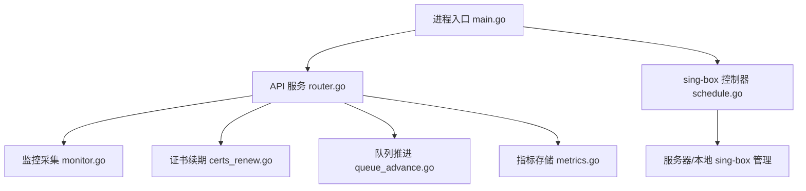
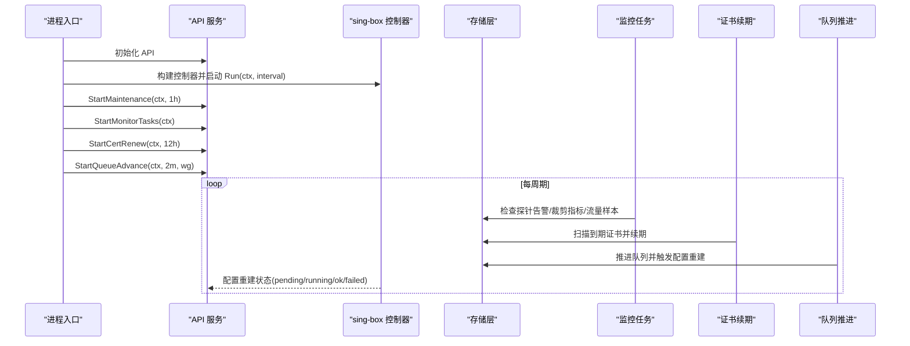
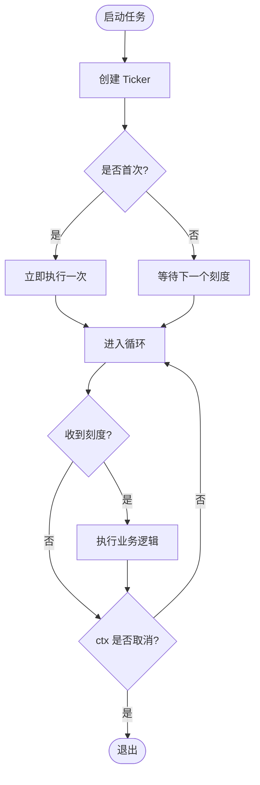
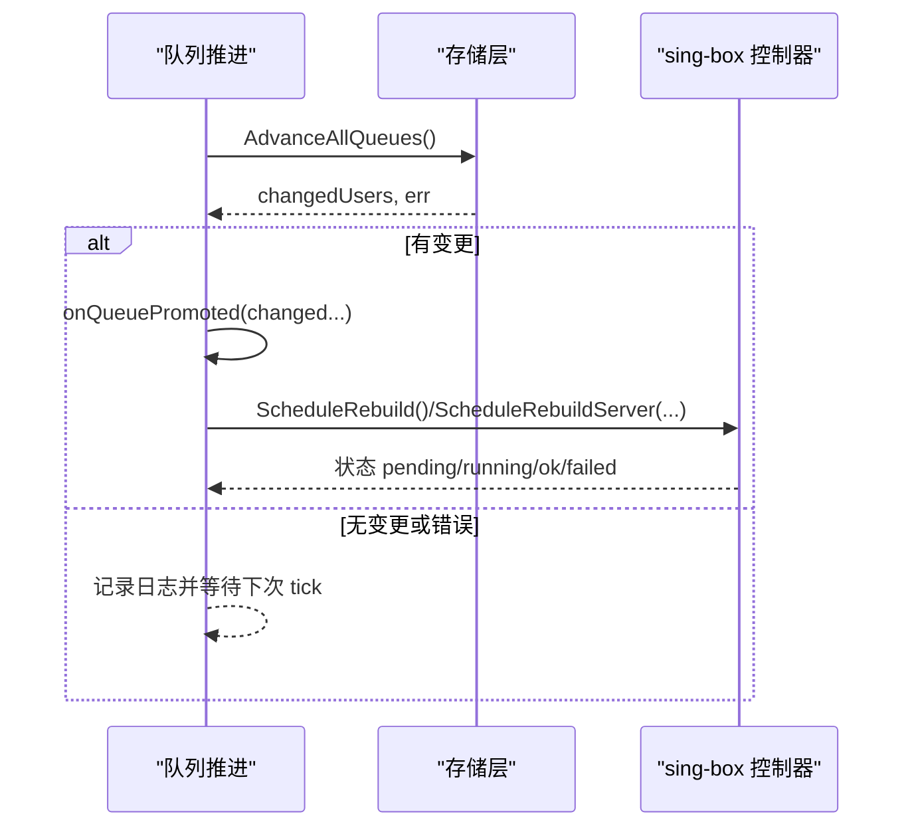
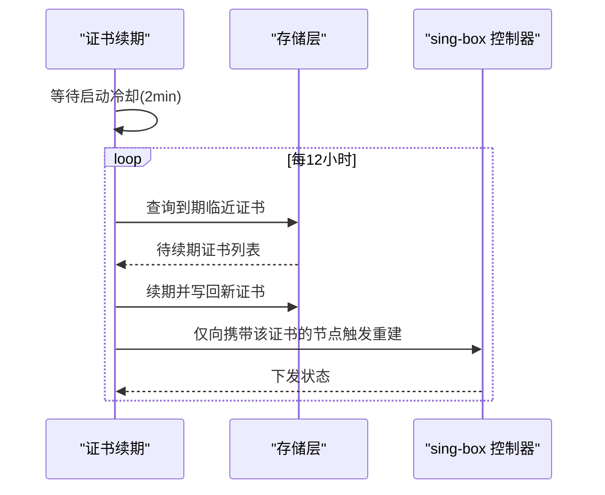
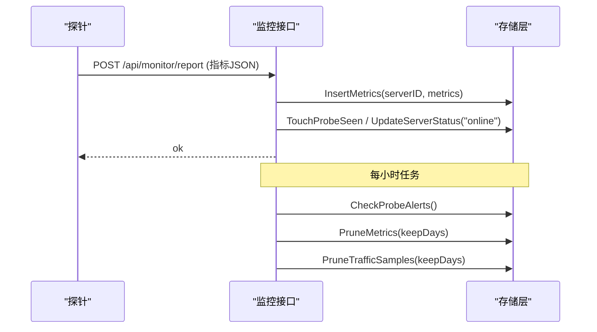
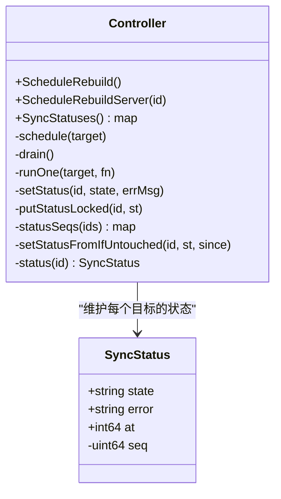
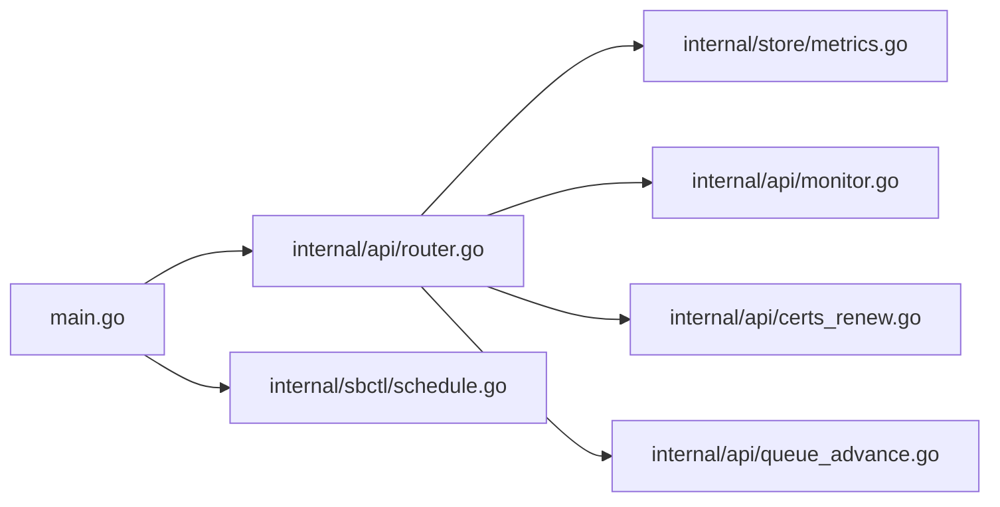

# 任务调度系统

<cite>
**本文引用的文件**
- [main.go](file://main.go)
- [router.go](file://internal/api/router.go)
- [queue_advance.go](file://internal/api/queue_advance.go)
- [certs_renew.go](file://internal/api/certs_renew.go)
- [monitor.go](file://internal/api/monitor.go)
- [schedule.go](file://internal/sbctl/schedule.go)
- [metrics.go](file://internal/store/metrics.go)
</cite>

## 目录
1. [简介](#简介)
2. [项目结构](#项目结构)
3. [核心组件](#核心组件)
4. [架构总览](#架构总览)
5. [详细组件分析](#详细组件分析)
6. [依赖关系分析](#依赖关系分析)
7. [性能考量](#性能考量)
8. [故障排查指南](#故障排查指南)
9. [结论](#结论)
10. [附录：示例与最佳实践](#附录示例与最佳实践)

## 简介
本文件面向轻舟面板的任务调度系统，系统性阐述后台任务调度架构、定时任务管理器、任务队列推进机制、并发控制、任务类型（证书续期、监控采集、数据清理、队列推进）、执行引擎（调度算法、优先级、失败重试、超时控制）、状态跟踪与日志、分布式协调（锁、幂等、冲突解决）、监控告警与可视化，以及新增任务与配置调度的实践建议。

## 项目结构
轻舟面板采用“入口进程 + API 服务 + 后台任务”的分层组织方式：
- 进程入口负责加载配置、初始化存储、启动 sing-box 控制器与各后台任务循环。
- API 层提供 HTTP 路由与业务处理，同时暴露若干后台任务的启动入口。
- 控制器与调度子系统负责 sing-box 配置的生成与下发、任务状态追踪。
- 存储层提供指标、告警、队列推进等持久化能力。

图表来源
- [main.go:25-142](file://main.go#L25-L142)
- [router.go:132-387](file://internal/api/router.go#L132-L387)
- [schedule.go:26-93](file://internal/sbctl/schedule.go#L26-L93)
- [monitor.go:18-55](file://internal/api/monitor.go#L18-L55)
- [certs_renew.go:19-46](file://internal/api/certs_renew.go#L19-L46)
- [queue_advance.go:10-69](file://internal/api/queue_advance.go#L10-L69)
- [metrics.go:88-165](file://internal/store/metrics.go#L88-L165)

章节来源
- [main.go:25-142](file://main.go#L25-L142)
- [router.go:132-387](file://internal/api/router.go#L132-L387)

## 核心组件
- 定时任务管理器：基于 Go 标准库 time.Ticker 的周期性扫描器，统一在后台 goroutine 中运行，支持上下文取消优雅退出。
- 任务队列系统：以“计划套餐队列推进”为代表，周期性扫描并激活下一个可用套餐，变更身份后触发 sing-box 配置重建。
- 并发控制机制：使用互斥量保护调度器内部状态；对 sing-box 配置下发进行去重合并，避免重复下发。
- 任务类型：
  - 证书续期：周期扫描即将到期的 ACME 证书并续期，写回数据库并仅向携带该证书的节点推送配置。
  - 监控采集：接收探针上报的系统指标，写入存储并更新在线状态；定期清理历史指标。
  - 数据清理：会话/令牌过期清理、速率限制器条目清扫、指标与流量样本裁剪。
  - 队列推进：扫描已耗尽或过期的套餐份，激活下一份并触发配置重建。
- 执行引擎：
  - 调度算法：固定间隔轮询 + 首次立即执行（冷启动快速修复）。
  - 优先级：按任务重要性顺序启动（控制器、维护、监控、证书、队列推进）。
  - 失败重试：通过下一次 tick 自动重试；关键路径记录错误日志。
  - 超时控制：HTTP 请求级超时；命令执行使用 context 与 WaitDelay 防止僵尸子进程。
- 状态跟踪与日志：
  - 配置下发状态：pending/running/ok/failed，带时间戳与错误信息。
  - 指标与告警：探针指标入库、告警检查、指标裁剪。
- 分布式协调：
  - 单实例内通过互斥与状态机保证幂等与一致性。
  - 远程节点下发通过 SSH 执行命令，结合 host key 校验与失败自愈。
- 监控与告警：
  - 公开/管理员监控端点，仪表盘聚合最新指标，热图与趋势展示。
  - 探针告警检查与未读计数。

章节来源
- [main.go:82-142](file://main.go#L82-L142)
- [monitor.go:889-919](file://internal/api/monitor.go#L889-L919)
- [account.go:52-83](file://internal/api/account.go#L52-L83)
- [certs_renew.go:19-46](file://internal/api/certs_renew.go#L19-L46)
- [queue_advance.go:10-69](file://internal/api/queue_advance.go#L10-L69)
- [schedule.go:14-156](file://internal/sbctl/schedule.go#L14-L156)
- [metrics.go:88-165](file://internal/store/metrics.go#L88-L165)

## 架构总览
下图展示了从进程启动到各后台任务运行的整体流程，以及与 sing-box 控制器和存储层的交互。

图表来源
- [main.go:82-142](file://main.go#L82-L142)
- [monitor.go:889-919](file://internal/api/monitor.go#L889-L919)
- [certs_renew.go:19-46](file://internal/api/certs_renew.go#L19-L46)
- [queue_advance.go:10-69](file://internal/api/queue_advance.go#L10-L69)
- [schedule.go:26-93](file://internal/sbctl/schedule.go#L26-L93)

## 详细组件分析

### 定时任务管理器（Ticker 模式）
- 设计要点
  - 使用 time.NewTicker 周期性触发，goroutine 内 select ctx.Done() 实现优雅退出。
  - 首次执行策略：部分任务在启动后立即执行一次，缩短冷启动恢复时间。
  - 可观察性：每次执行记录日志，异常时输出错误信息。
- 典型实现
  - 维护任务：清理过期会话/令牌、清扫速率限制器条目。
  - 监控任务：每小时检查探针告警、裁剪指标与流量样本。
  - 证书续期：延迟启动等待控制器完成首轮重建，再扫描续期。
  - 队列推进：启动即扫一次，随后按间隔推进。

图表来源
- [account.go:52-83](file://internal/api/account.go#L52-L83)
- [monitor.go:889-919](file://internal/api/monitor.go#L889-L919)
- [certs_renew.go:19-46](file://internal/api/certs_renew.go#L19-L46)
- [queue_advance.go:10-69](file://internal/api/queue_advance.go#L10-L69)

章节来源
- [account.go:52-83](file://internal/api/account.go#L52-L83)
- [monitor.go:889-919](file://internal/api/monitor.go#L889-L919)
- [certs_renew.go:19-46](file://internal/api/certs_renew.go#L19-L46)
- [queue_advance.go:10-69](file://internal/api/queue_advance.go#L10-L69)

### 任务队列系统（计划套餐推进）
- 目标：当用户当前套餐份被耗尽或过期时，自动激活同一套餐的下一份，确保代理身份无缝切换。
- 机制：
  - 后台 ticker 周期性调用 AdvanceAllQueues，返回发生变更的用户列表。
  - 变更后触发 onQueuePromoted，进而安排 sing-box 配置重建。
  - 读取路径（仪表盘/订阅）也会尝试推进，作为兜底保障。
- 并发与幂等：
  - 推进逻辑在事务中完成，避免重复激活。
  - 若推进失败，记录日志并在下次 tick 重试。

图表来源
- [queue_advance.go:10-69](file://internal/api/queue_advance.go#L10-L69)
- [schedule.go:26-93](file://internal/sbctl/schedule.go#L26-L93)

章节来源
- [queue_advance.go:10-69](file://internal/api/queue_advance.go#L10-L69)

### 证书续期任务
- 目标：对托管于面板主机的 ACME 证书进行续期，并将新 PEM 写回数据库，仅向使用该证书的节点推送配置。
- 机制：
  - 启动延迟 2 分钟，等待控制器首轮重建完成，避免竞态。
  - 周期扫描剩余天数小于阈值的证书并续期。
- 幂等与健壮性：
  - 仅对需要续期的证书操作，减少不必要下发。
  - 错误记录日志，由下一次 tick 重试。

图表来源
- [certs_renew.go:19-46](file://internal/api/certs_renew.go#L19-L46)
- [schedule.go:26-93](file://internal/sbctl/schedule.go#L26-L93)

章节来源
- [certs_renew.go:19-46](file://internal/api/certs_renew.go#L19-L46)

### 监控采集与数据清理
- 监控采集：
  - 接收探针上报的系统指标，校验并写入存储，更新服务器在线状态。
  - 提供下载探针二进制与一键安装脚本的接口。
- 数据清理：
  - 每小时检查探针告警、裁剪指标与流量样本，防止数据库膨胀。
  - 维护任务清理过期会话、令牌与速率限制器条目。

图表来源
- [monitor.go:18-55](file://internal/api/monitor.go#L18-L55)
- [monitor.go:889-919](file://internal/api/monitor.go#L889-L919)
- [metrics.go:88-165](file://internal/store/metrics.go#L88-L165)

章节来源
- [monitor.go:18-55](file://internal/api/monitor.go#L18-L55)
- [monitor.go:889-919](file://internal/api/monitor.go#L889-L919)
- [metrics.go:88-165](file://internal/store/metrics.go#L88-L165)

### 并发控制与任务锁
- 调度器内部状态（待重建集合、运行标志、状态快照）由互斥量保护，避免并发竞争。
- 全量重建会吸收单个服务器的重建请求，避免重复下发。
- 通过序列号 seq 与快照 before 映射，确保全量重建结果不会覆盖个别机器已报告的更细粒度状态。

图表来源
- [schedule.go:14-156](file://internal/sbctl/schedule.go#L14-L156)

章节来源
- [schedule.go:14-156](file://internal/sbctl/schedule.go#L14-L156)

### 执行引擎：调度算法、优先级、失败重试、超时控制
- 调度算法：固定间隔轮询 + 首次立即执行（冷启动修复）。
- 优先级：控制器 > 维护 > 监控 > 证书续期 > 队列推进（按启动顺序体现）。
- 失败重试：tick 驱动的自然重试；关键路径记录错误日志。
- 超时控制：
  - HTTP 层设置 Read/Write/Idle Timeout。
  - 远程命令执行使用 context 与 WaitDelay，避免子进程悬挂导致响应卡死。

章节来源
- [main.go:108-142](file://main.go#L108-L142)
- [schedule.go:158-194](file://internal/sbctl/schedule.go#L158-L194)

### 状态跟踪与日志记录
- 配置下发状态：pending/running/ok/failed，附带错误信息与时间戳，供管理界面轮询。
- 指标与告警：探针指标入库、告警检查、未读计数。
- 日志：所有后台任务均记录关键步骤与错误，便于定位问题。

章节来源
- [schedule.go:14-156](file://internal/sbctl/schedule.go#L14-L156)
- [monitor.go:889-919](file://internal/api/monitor.go#L889-L919)

### 分布式任务协调（锁、幂等、冲突解决）
- 单实例内：通过互斥量与状态机保证幂等与一致性。
- 多节点下发：通过 SSH 执行命令，首次连接 TOFU 保存主机密钥，后续连接校验；失败时标记 failed，下次 tick 自愈。
- 冲突解决：全量重建吸收单个重建请求，避免重复下发；个别机器状态优先保留。

章节来源
- [schedule.go:26-93](file://internal/sbctl/schedule.go#L26-L93)
- [main.go:171-207](file://main.go#L171-L207)

### 监控与告警
- 公开与管理端点：提供仪表盘、热图、最近指标查询。
- 告警：定期检查探针告警，支持标记已读。
- 指标裁剪：定期删除旧指标，防止数据库膨胀。

章节来源
- [monitor.go:18-55](file://internal/api/monitor.go#L18-L55)
- [monitor.go:889-919](file://internal/api/monitor.go#L889-L919)
- [metrics.go:160-165](file://internal/store/metrics.go#L160-L165)

## 依赖关系分析
- main.go 依赖 api、store、sbctl、sbproc、sshctl、mailer 等模块，负责装配与生命周期管理。
- api/router.go 注册大量 HTTP 路由，并通过 API 方法启动后台任务。
- sbctl/schedule.go 提供配置重建的异步调度与状态追踪。
- store/metrics.go 提供指标写入、查询与裁剪。

图表来源
- [main.go:25-142](file://main.go#L25-L142)
- [router.go:132-387](file://internal/api/router.go#L132-L387)
- [schedule.go:26-93](file://internal/sbctl/schedule.go#L26-L93)
- [metrics.go:88-165](file://internal/store/metrics.go#L88-L165)
- [monitor.go:18-55](file://internal/api/monitor.go#L18-L55)
- [certs_renew.go:19-46](file://internal/api/certs_renew.go#L19-L46)
- [queue_advance.go:10-69](file://internal/api/queue_advance.go#L10-L69)

章节来源
- [main.go:25-142](file://main.go#L25-L142)
- [router.go:132-387](file://internal/api/router.go#L132-L387)

## 性能考量
- 指标写入与查询
  - 插入前对指标值进行钳制，防止恶意或异常数据污染聚合。
  - 查询时使用 LIMIT 限制返回行数，避免大响应拖垮小内存机器。
  - 使用单次聚合查询获取每台服务器最新指标，避免 N+1 查询。
- 任务调度
  - 使用 Ticker 而非复杂调度器，降低复杂度与资源占用。
  - 首次立即执行减少冷启动窗口内的不一致。
- 配置下发
  - 合并重复重建请求，避免对远端节点的频繁 SSH 调用。
  - 使用 context 与 WaitDelay 控制命令执行超时，避免僵尸进程。
- 存储清理
  - 定期裁剪指标与流量样本，保持数据库体积可控。
  - 维护任务清扫会话、令牌与速率限制器条目，防止内存泄漏。

章节来源
- [metrics.go:52-86](file://internal/store/metrics.go#L52-L86)
- [metrics.go:136-193](file://internal/store/metrics.go#L136-L193)
- [schedule.go:26-93](file://internal/sbctl/schedule.go#L26-L93)
- [schedule.go:158-194](file://internal/sbctl/schedule.go#L158-L194)
- [monitor.go:889-919](file://internal/api/monitor.go#L889-L919)
- [account.go:52-83](file://internal/api/account.go#L52-L83)

## 故障排查指南
- 配置下发失败
  - 查看控制器同步状态（pending/running/ok/failed），确认具体错误信息。
  - 检查远端服务器可达性与 SSH 配置，必要时手动触发 resync。
- 指标不更新
  - 确认探针 token 有效且服务正常运行。
  - 检查存储写入与指标裁剪是否误删了近期数据。
- 证书未续期
  - 检查剩余天数阈值与 ACME 配置是否正确。
  - 关注控制器首轮重建完成后才可能触发续期下发的时序。
- 队列未推进
  - 检查是否有购买交易成功但未能推进的情况。
  - 确认后台推进任务是否正常运行，查看日志中的推进记录。
- 性能问题
  - 关注指标表大小与查询耗时，调整裁剪周期。
  - 评估探针上报频率与网络带宽，避免峰值拥塞。

章节来源
- [schedule.go:14-156](file://internal/sbctl/schedule.go#L14-L156)
- [monitor.go:18-55](file://internal/api/monitor.go#L18-L55)
- [certs_renew.go:19-46](file://internal/api/certs_renew.go#L19-L46)
- [queue_advance.go:10-69](file://internal/api/queue_advance.go#L10-L69)
- [metrics.go:160-193](file://internal/store/metrics.go#L160-L193)

## 结论
轻舟面板的任务调度系统以简洁可靠的 Ticker 模式为核心，配合 sing-box 控制器的异步重建与状态追踪，实现了证书续期、监控采集、数据清理、队列推进等关键后台任务。通过互斥量与状态机保证并发安全与幂等，结合指标裁剪与维护任务，确保系统在低资源环境下稳定运行。监控与告警提供了可视化的运行态势与异常通知，便于运维人员快速定位与处理问题。

## 附录：示例与最佳实践
- 如何创建新任务
  - 在 API 包中添加新的 StartXxx(ctx, interval) 方法，使用 time.NewTicker 循环执行，并在 main.go 中启动。
  - 参考：StartMaintenance、StartMonitorTasks、StartCertRenew、StartQueueAdvance。
- 如何配置调度规则
  - 通过环境变量或 DB 设置调整任务间隔（如 sing-box 统计间隔、探针安装路径等）。
  - 参考：sbStatsInterval、install script 参数。
- 如何处理任务失败
  - 记录错误日志，依靠下一次 tick 自动重试。
  - 对于关键路径，可在上层增加重试次数或退避策略。
  - 参考：控制器 runOne 的状态更新与错误传播。
- 优化建议
  - 合理设置指标裁剪周期，平衡查询性能与历史保留需求。
  - 合并高频重建请求，减少远端压力。
  - 使用一次性冷启动执行，缩短恢复时间。
- 故障排查清单
  - 核对任务是否启动、是否因 ctx 取消而退出。
  - 检查存储写入与查询是否正常，是否存在锁竞争或慢查询。
  - 查看控制器状态与错误信息，定位远端下发失败原因。

章节来源
- [main.go:82-142](file://main.go#L82-L142)
- [account.go:52-83](file://internal/api/account.go#L52-L83)
- [monitor.go:889-919](file://internal/api/monitor.go#L889-L919)
- [certs_renew.go:19-46](file://internal/api/certs_renew.go#L19-L46)
- [queue_advance.go:10-69](file://internal/api/queue_advance.go#L10-L69)
- [schedule.go:95-102](file://internal/sbctl/schedule.go#L95-L102)
