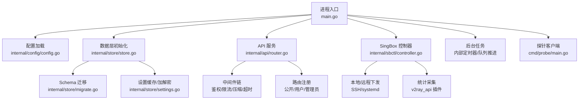
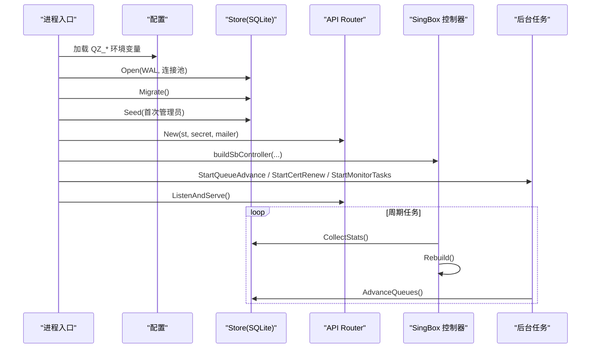
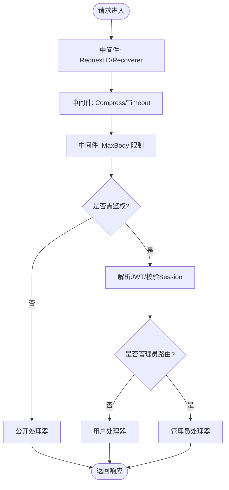
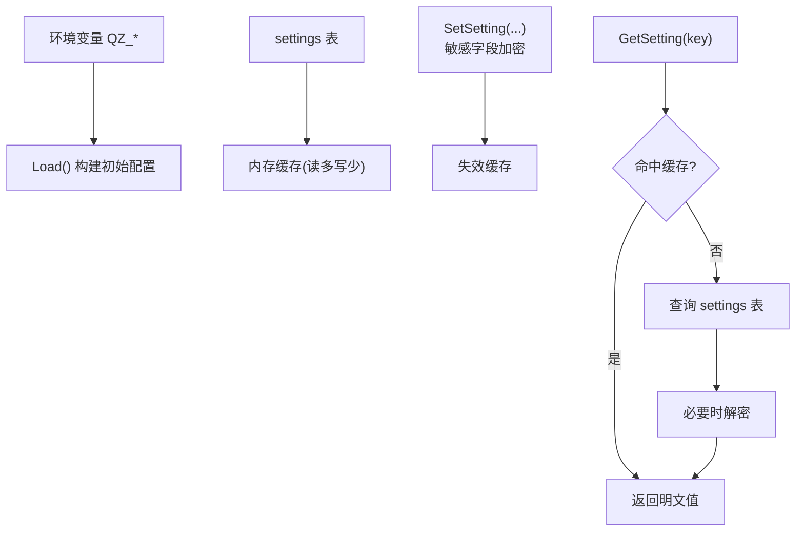
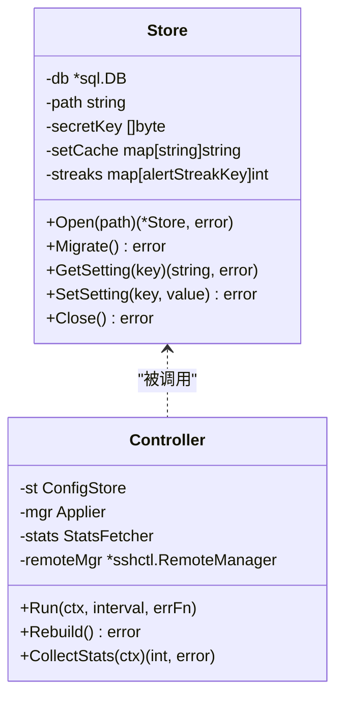
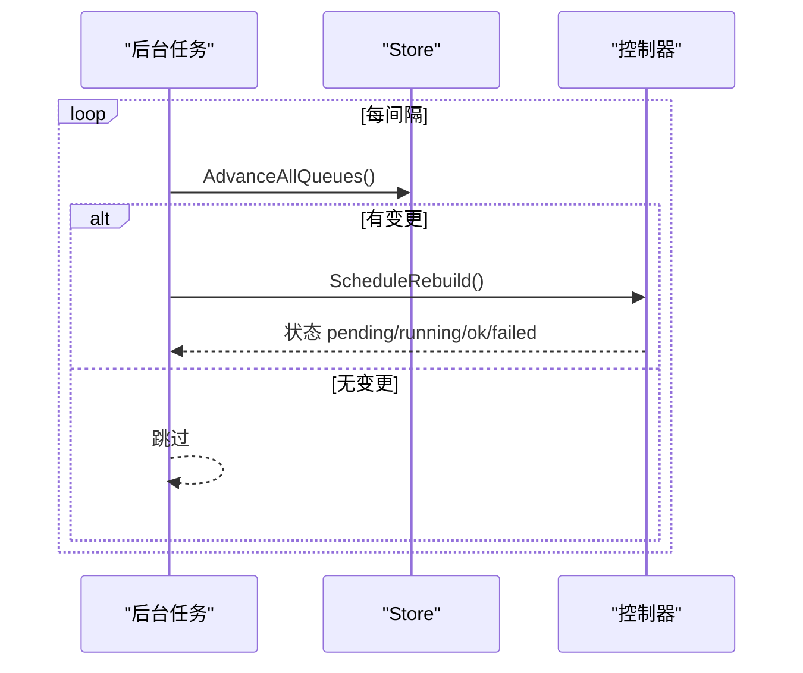
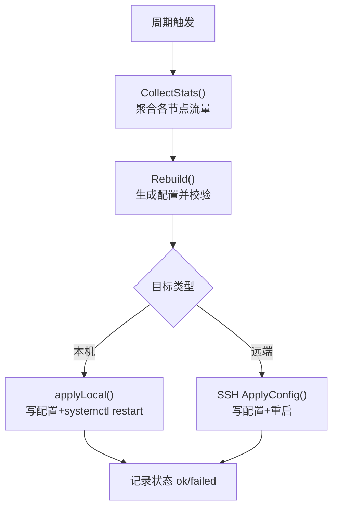
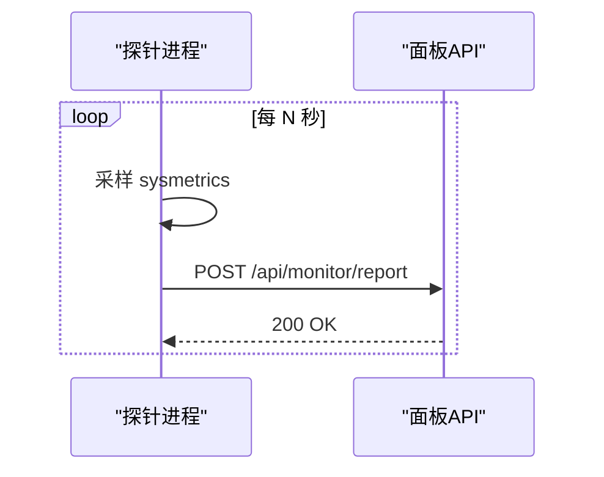
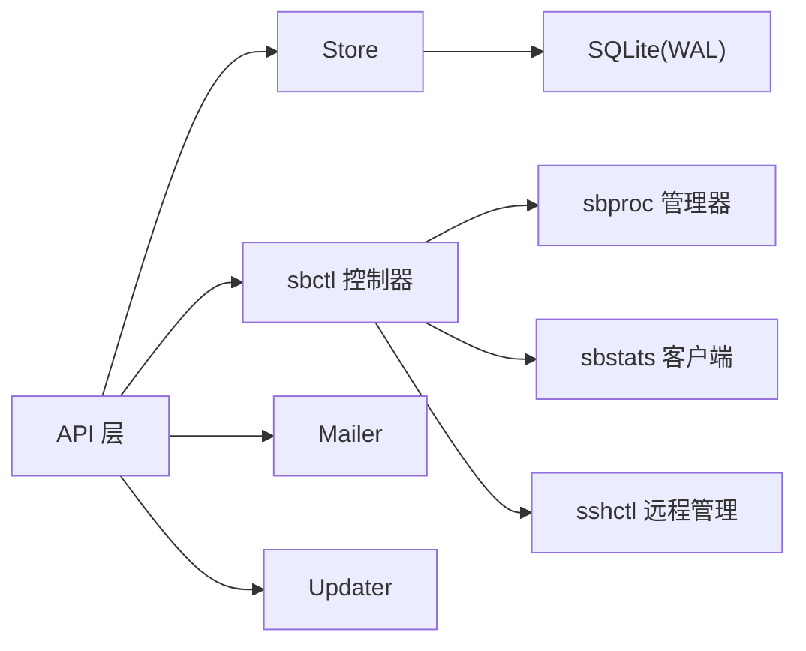

# 后端架构设计

<cite>
**本文引用的文件**
- [main.go](file://main.go)
- [config.go](file://internal/config/config.go)
- [router.go](file://internal/api/router.go)
- [auth.go](file://internal/api/auth.go)
- [safehttp.go](file://internal/api/safehttp.go)
- [controller.go](file://internal/sbctl/controller.go)
- [schedule.go](file://internal/sbctl/schedule.go)
- [store.go](file://internal/store/store.go)
- [migrate.go](file://internal/store/migrate.go)
- [settings.go](file://internal/store/settings.go)
- [queue_advance.go](file://internal/api/queue_advance.go)
- [main.go (probe)](file://cmd/probe/main.go)
</cite>

## 目录
1. [简介](#简介)
2. [项目结构](#项目结构)
3. [核心组件](#核心组件)
4. [架构总览](#架构总览)
5. [详细组件分析](#详细组件分析)
6. [依赖关系分析](#依赖关系分析)
7. [性能考量](#性能考量)
8. [故障排查指南](#故障排查指南)
9. [结论](#结论)
10. [附录](#附录)

## 简介
本文件面向轻舟面板后端（Go）的架构设计与实现，围绕分层架构（API层、业务逻辑层、数据存储层）、HTTP 服务器启动流程、中间件链与路由注册、配置管理（环境变量覆盖、配置文件加载、运行时更新）、数据库连接池与事务、并发控制、后台任务调度（定时任务、队列推进、错误重试）进行系统化说明，并配以架构图与流程图帮助开发者快速理解整体设计。

## 项目结构
- 入口程序：主进程负责加载配置、初始化存储、启动 HTTP 服务、拉起后台任务与 sing-box 控制器循环。
- API 层：基于 chi 路由器组织公开接口、认证接口、管理员接口；内置鉴权、限流、压缩、超时等中间件。
- 业务逻辑层：封装 sing-box 控制器、证书中心、队列推进、监控上报等跨模块能力。
- 数据存储层：SQLite 单进程部署，WAL 模式 + 小连接池，迁移脚本保证 schema 演进。
- 探针：独立可执行程序，周期性采集系统指标并通过 HTTP POST 上报到面板。

**图表来源**
- [main.go:25-142](file://main.go#L25-L142)
- [config.go:14-29](file://internal/config/config.go#L14-L29)
- [store.go:27-58](file://internal/store/store.go#L27-L58)
- [router.go:132-386](file://internal/api/router.go#L132-L386)
- [controller.go:661-699](file://internal/sbctl/controller.go#L661-L699)
- [migrate.go:532-743](file://internal/store/migrate.go#L532-L743)
- [settings.go:7-85](file://internal/store/settings.go#L7-L85)

**章节来源**
- [main.go:25-142](file://main.go#L25-L142)
- [config.go:14-29](file://internal/config/config.go#L14-L29)
- [store.go:27-58](file://internal/store/store.go#L27-L58)
- [router.go:132-386](file://internal/api/router.go#L132-L386)

## 核心组件
- 配置系统：集中读取 QZ_* 环境变量，提供默认值，支持运行时通过 settings 表覆盖部分行为。
- HTTP 服务：chi 路由器，统一中间件链（请求ID、恢复、压缩、超时、最大请求体），按权限分组路由。
- 认证与授权：JWT + Session 双校验，支持 Cookie/Bearer，IP 级限流，管理员角色校验。
- 数据存储：SQLite WAL + 连接池，迁移脚本幂等执行，设置项内存缓存与写失效。
- SingBox 控制器：周期采集流量、生成配置、校验并下发到本机或远程节点（SSH/systemd）。
- 后台任务：队列推进（套餐激活）、证书续期、监控任务、维护任务等。
- 探针：轻量采集器，定时上报 CPU/内存/磁盘/网络/负载等指标。

**章节来源**
- [config.go:14-29](file://internal/config/config.go#L14-L29)
- [router.go:132-386](file://internal/api/router.go#L132-L386)
- [auth.go:179-213](file://internal/api/auth.go#L179-L213)
- [store.go:27-58](file://internal/store/store.go#L27-L58)
- [controller.go:661-699](file://internal/sbctl/controller.go#L661-L699)
- [queue_advance.go:32-69](file://internal/api/queue_advance.go#L32-L69)
- [main.go (probe):34-92](file://cmd/probe/main.go#L34-L92)

## 架构总览
轻舟面板采用“进程内多协程”的轻量架构：单一 Go 进程承载 HTTP API、后台任务与 sing-box 控制器；通过 SQLite 作为持久化存储；通过 SSH 对远端节点进行配置下发与诊断。

**图表来源**
- [main.go:25-142](file://main.go#L25-L142)
- [controller.go:661-699](file://internal/sbctl/controller.go#L661-L699)
- [queue_advance.go:32-69](file://internal/api/queue_advance.go#L32-L69)

## 详细组件分析

### HTTP 服务器与中间件链
- 启动流程：创建 chi 路由器，挂载全局中间件（RequestID、Recoverer、Compress、Timeout、MaxBody），再按公开/用户/管理员分组注册路由。
- 安全与健壮性：限制请求体大小防止内存压力；使用受信任代理识别真实 IP；对需要外发请求的客户端启用安全出站（拒绝内网地址、DNS 重绑定防护）。
- 认证中间件：从 Cookie 或 Authorization 头解析 JWT，校验 Session 有效性，注入用户上下文；管理员路由额外要求 admin 角色。

**图表来源**
- [router.go:132-386](file://internal/api/router.go#L132-L386)
- [auth.go:179-213](file://internal/api/auth.go#L179-L213)
- [safehttp.go:58-86](file://internal/api/safehttp.go#L58-L86)

**章节来源**
- [router.go:132-386](file://internal/api/router.go#L132-L386)
- [auth.go:179-213](file://internal/api/auth.go#L179-L213)
- [safehttp.go:12-56](file://internal/api/safehttp.go#L12-L56)

### 配置管理系统
- 环境变量优先：QZ_LISTEN、QZ_DB、QZ_ADMIN_USER/PASS 等用于启动参数与环境覆盖。
- 运行时设置：settings 表提供站点级配置（如注册模式、邮箱验证、积分汇率等），读路径带内存缓存，写路径自动失效缓存。
- 敏感信息加密：特定 key 在落盘前加密，读取时透明解密；支持外部密钥 QZ_SECRET_KEY 提升安全性。

**图表来源**
- [config.go:14-29](file://internal/config/config.go#L14-L29)
- [settings.go:7-85](file://internal/store/settings.go#L7-L85)

**章节来源**
- [config.go:14-29](file://internal/config/config.go#L14-L29)
- [settings.go:7-85](file://internal/store/settings.go#L7-L85)

### 数据库连接池、事务与并发控制
- 连接池：WAL 模式 + busy_timeout，允许一个写者多个读者；最大连接数与空闲连接数设置为较小值以适配小规模部署。
- 事务策略：DSN 中启用 _txlock=immediate，避免读后升级写锁导致的 SQLITE_BUSY_SNAPSHOT；批量写入使用 savepoint 隔离失败条目。
- 并发安全：设置项读写使用 RWMutex；控制器 Rebuild 串行化；远程节点操作并发但带超时保护。

**图表来源**
- [store.go:10-71](file://internal/store/store.go#L10-L71)
- [controller.go:61-115](file://internal/sbctl/controller.go#L61-L115)

**章节来源**
- [store.go:27-58](file://internal/store/store.go#L27-L58)
- [migrate.go:532-743](file://internal/store/migrate.go#L532-L743)
- [controller.go:357-455](file://internal/sbctl/controller.go#L357-L455)

### 后台任务调度系统
- 队列推进：定时扫描 user_plans，将已过期或用尽的 active 份退位，promote 下一个 queued 份为 active；变更触发 sing-box 配置重建。
- 证书续期：定时检查到期证书并续期，成功后触发配置重建。
- 监控任务：收集各节点指标、生成告警、聚合展示。
- 错误处理：任务失败记录日志并继续下一次执行；控制器对每个目标记录状态（pending/running/ok/failed），支持 UI 轮询。

**图表来源**
- [queue_advance.go:32-69](file://internal/api/queue_advance.go#L32-L69)
- [schedule.go:26-93](file://internal/sbctl/schedule.go#L26-L93)

**章节来源**
- [queue_advance.go:32-69](file://internal/api/queue_advance.go#L32-L69)
- [schedule.go:26-93](file://internal/sbctl/schedule.go#L26-L93)

### SingBox 控制器与多节点下发
- 周期任务：每间隔采集本地与各节点的 per-user 流量，合并后写入 store；随后重建配置并下发。
- 下发策略：本机直接写配置并 systemctl restart；远端通过 SSH 下发配置并重启服务；每个目标独立超时与错误记录。
- 能力探测：探测远端 sing-box 是否具备 v2ray_api 插件，决定是否需要统计块与是否拉取统计。

**图表来源**
- [controller.go:548-589](file://internal/sbctl/controller.go#L548-L589)
- [controller.go:357-455](file://internal/sbctl/controller.go#L357-L455)

**章节来源**
- [controller.go:548-589](file://internal/sbctl/controller.go#L548-L589)
- [controller.go:357-455](file://internal/sbctl/controller.go#L357-L455)

### 探针与监控上报
- 探针程序：采集 CPU/内存/磁盘/网络/负载/进程数/运行时长等指标，定时 POST 到 /api/monitor/report。
- 面板侧：接收探针数据，存入 server_metrics 表，供仪表盘与热力图展示。

**图表来源**
- [main.go (probe):34-92](file://cmd/probe/main.go#L34-L92)
- [router.go:164-175](file://internal/api/router.go#L164-L175)

**章节来源**
- [main.go (probe):34-92](file://cmd/probe/main.go#L34-L92)
- [router.go:164-175](file://internal/api/router.go#L164-L175)

## 依赖关系分析
- API 层依赖：store（数据访问）、mailer（邮件）、sbctl（sing-box 编排）、updater（自更新）。
- 控制器依赖：store（配置与用户配额）、sbproc（本地进程管理）、sbstats（流量统计）、sshctl（远程管理）。
- 存储层依赖：sqlite 驱动，schema 由 migrate 定义，settings 表提供运行时配置。

**图表来源**
- [router.go:21-39](file://internal/api/router.go#L21-L39)
- [controller.go:61-115](file://internal/sbctl/controller.go#L61-L115)
- [store.go:10-25](file://internal/store/store.go#L10-L25)

**章节来源**
- [router.go:21-39](file://internal/api/router.go#L21-L39)
- [controller.go:61-115](file://internal/sbctl/controller.go#L61-L115)
- [store.go:10-25](file://internal/store/store.go#L10-L25)

## 性能考量
- 连接池与 WAL：单写多读，busy_timeout 降低冲突失败概率；小连接池减少资源占用。
- 中间件优化：gzip 压缩减小带宽；超时与最大请求体保护内存与 CPU。
- 控制器并发：远端节点统计与下发并发执行，单个节点失败不阻塞其他节点；每次下发带超时，避免长尾。
- 设置缓存：settings 表读路径缓存，写路径失效，显著降低热点读开销。
- 队列推进：仅在必要时触发配置重建，避免频繁重载。

[本节为通用性能建议，无需具体文件引用]

## 故障排查指南
- 登录失败：检查 JWT 与 Session 是否有效；确认 IP 限流未误封；查看 authMiddleware 返回码。
- 配置下发失败：查看控制器状态（pending/running/ok/failed）与错误信息；检查 SSH 连通性与权限；确认 sing-box 二进制路径与 systemd unit 名称。
- 统计缺失：确认远端 sing-box 是否包含 v2ray_api 插件；检查 statsListenFor 结果与探测缓存。
- 队列未推进：检查后台任务是否运行；查看 AdvanceAllQueues 日志；确认 active 份是否确实用尽或过期。
- 探针不上报：确认探针 token 与服务端 /api/monitor/report 可达；检查防火墙与 TLS 配置。

**章节来源**
- [auth.go:179-213](file://internal/api/auth.go#L179-L213)
- [schedule.go:95-108](file://internal/sbctl/schedule.go#L95-L108)
- [controller.go:307-343](file://internal/sbctl/controller.go#L307-L343)
- [queue_advance.go:54-69](file://internal/api/queue_advance.go#L54-L69)
- [main.go (probe):94-118](file://cmd/probe/main.go#L94-L118)

## 结论
轻舟面板后端以简洁的单进程架构实现了高内聚、低耦合的分层设计：API 层专注路由与鉴权，业务层编排 sing-box 与后台任务，数据层通过 SQLite 提供稳定持久化。通过环境变量与 settings 表的组合，既满足开箱即用又支持灵活运行时调整；控制器与队列机制确保配置与配额的一致性；探针与监控完善了运维闭环。该设计在小规模部署场景下具备良好的可维护性与扩展性。

[本节为总结性内容，无需具体文件引用]

## 附录
- 环境变量参考：QZ_LISTEN、QZ_DB、QZ_ADMIN_USER、QZ_ADMIN_PASS、QZ_SMTP_*、QZ_SINGBOX_*、QZ_UPDATE_REPO、QZ_PROBE_SERVER、QZ_PROBE_TOKEN 等。
- 关键路径：
  - 启动与生命周期：[main.go:25-142](file://main.go#L25-L142)
  - 路由与中间件：[router.go:132-386](file://internal/api/router.go#L132-L386)
  - 认证与授权：[auth.go:179-213](file://internal/api/auth.go#L179-L213)
  - 设置缓存与加密：[settings.go:7-85](file://internal/store/settings.go#L7-L85)
  - 控制器周期任务：[controller.go:661-699](file://internal/sbctl/controller.go#L661-L699)
  - 队列推进：[queue_advance.go:32-69](file://internal/api/queue_advance.go#L32-L69)
  - 探针上报：[main.go (probe):34-92](file://cmd/probe/main.go#L34-L92)
