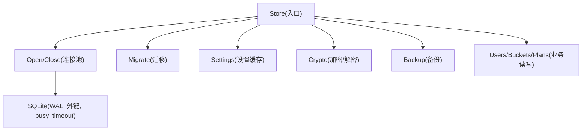
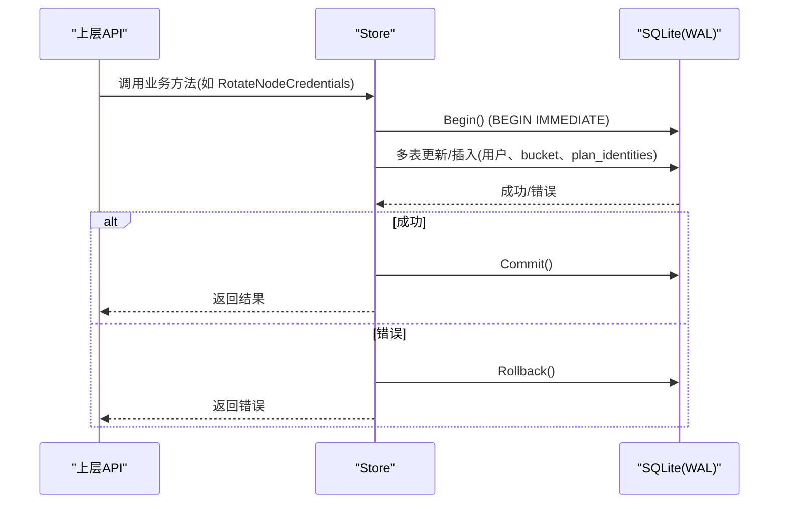
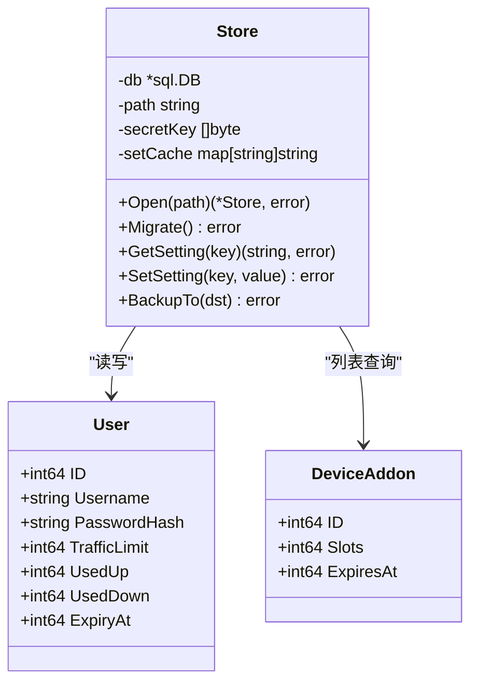
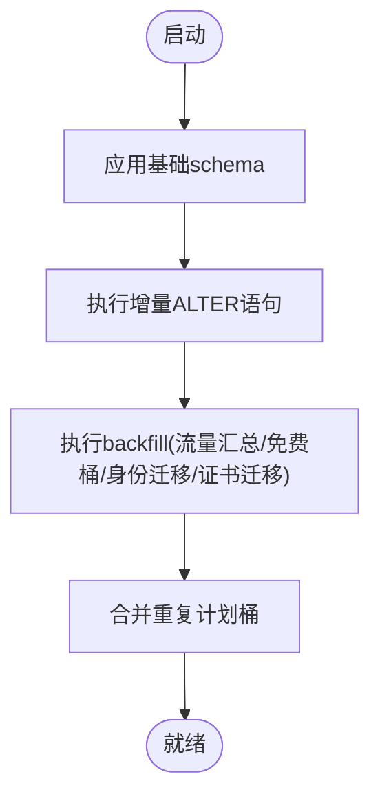
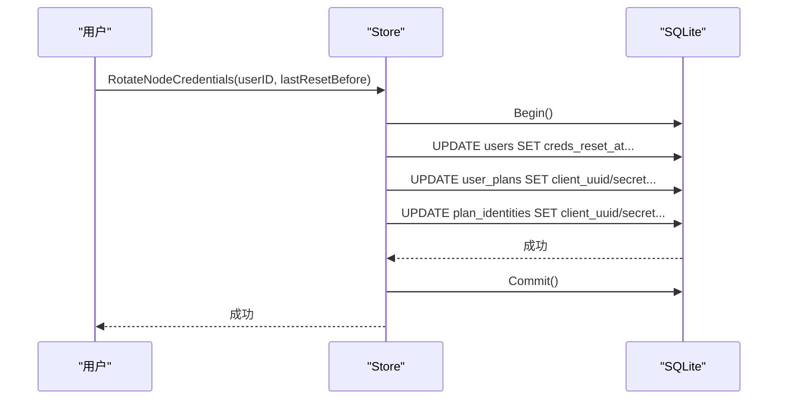
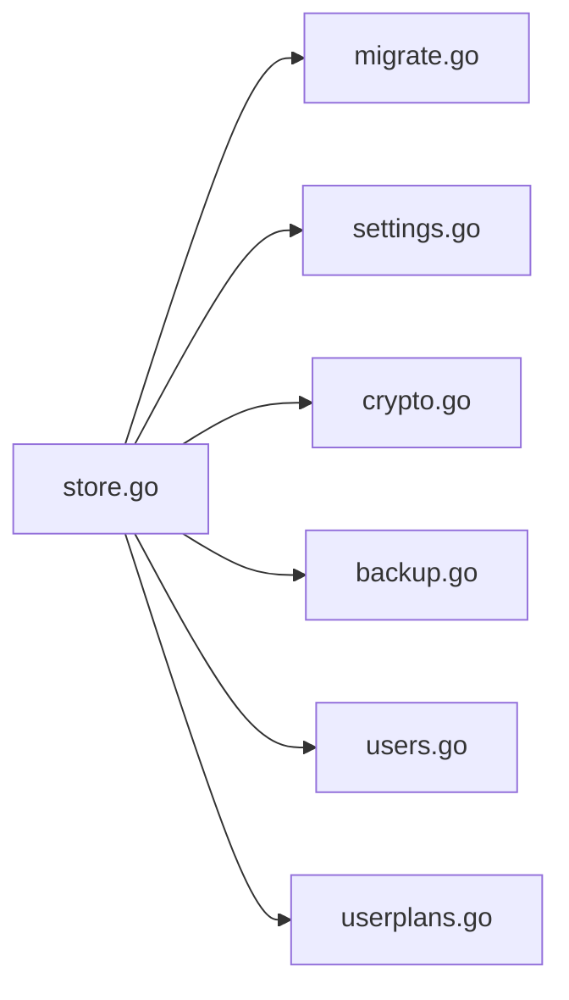

# 存储层设计

<cite>
**本文引用的文件**
- [store.go](file://internal/store/store.go)
- [migrate.go](file://internal/store/migrate.go)
- [crypto.go](file://internal/store/crypto.go)
- [backup.go](file://internal/store/backup.go)
- [settings.go](file://internal/store/settings.go)
- [users.go](file://internal/store/users.go)
- [userplans.go](file://internal/store/userplans.go)
</cite>

## 目录
1. [简介](#简介)
2. [项目结构](#项目结构)
3. [核心组件](#核心组件)
4. [架构总览](#架构总览)
5. [详细组件分析](#详细组件分析)
6. [依赖关系分析](#依赖关系分析)
7. [性能考虑](#性能考虑)
8. [故障排查指南](#故障排查指南)
9. [结论](#结论)
10. [附录：代码示例路径](#附录代码示例路径)

## 简介
本文件系统性阐述轻舟面板的存储层设计，聚焦 SQLite 集成、连接池与并发优化、WAL 模式配置、ORM 抽象（数据模型、关系映射、查询构建）、迁移系统（版本管理、增量更新、回滚策略）、事务模式（自动事务、嵌套事务支持、错误回滚）、缓存策略与一致性保证、备份恢复、加密存储与敏感信息保护，以及性能调优与故障排查方法。文档以仓库内实际实现为依据，提供可追溯的代码片段路径与可视化图示。

## 项目结构
存储层位于 internal/store 包，围绕 Store 结构体组织，包含数据库初始化、迁移、设置缓存、加密、备份等能力；各业务表（用户、套餐、节点、证书、流量统计等）通过 SQL 建表语句集中声明，并通过 Go 函数封装读写操作。

**图表来源**
- [store.go:27-57](file://internal/store/store.go#L27-L57)
- [migrate.go:532-743](file://internal/store/migrate.go#L532-L743)
- [settings.go:7-85](file://internal/store/settings.go#L7-L85)
- [crypto.go:17-77](file://internal/store/crypto.go#L17-L77)
- [backup.go:10-50](file://internal/store/backup.go#L10-L50)

**章节来源**
- [store.go:1-71](file://internal/store/store.go#L1-L71)
- [migrate.go:1-841](file://internal/store/migrate.go#L1-L841)

## 核心组件
- 数据库连接与连接池：统一在 Open 中配置 DSN 参数与连接池大小，启用 WAL、外键约束、同步级别与事务锁策略，避免死锁与忙等待。
- 迁移系统：启动时幂等执行 schema 与增量 ALTER 语句，并执行一系列 backfill 与合并逻辑，确保历史数据兼容。
- 设置缓存：settings 表全量加载到内存，写后失效，读路径无锁快速访问。
- 加密存储：对敏感设置使用 AES-GCM 加密，带前缀标识，失败安全降级为不输出明文。
- 备份：使用 VACUUM INTO 生成一致快照，规避 WAL 副本不一致问题。
- 业务模型与查询：按表拆分文件，封装结构化读写；复杂事务集中在关键流程（如凭据轮换、删除用户）。

**章节来源**
- [store.go:27-57](file://internal/store/store.go#L27-L57)
- [migrate.go:532-743](file://internal/store/migrate.go#L532-L743)
- [settings.go:7-85](file://internal/store/settings.go#L7-L85)
- [crypto.go:17-77](file://internal/store/crypto.go#L17-L77)
- [backup.go:10-50](file://internal/store/backup.go#L10-L50)

## 架构总览
存储层以 Store 为中心，向上暴露领域方法（用户、套餐、节点、证书、用量等），向下通过 database/sql 与 SQLite 交互。所有写路径尽量使用显式事务，读路径利用 WAL 并发优势与内存缓存降低延迟。

**图表来源**
- [users.go:191-296](file://internal/store/users.go#L191-L296)
- [store.go:32-57](file://internal/store/store.go#L32-L57)

## 详细组件分析

### SQLite 集成与并发优化
- 连接池：最大打开连接数与空闲连接数均设置为 8，避免单连接导致的嵌套读取死锁（例如事务内回调再次读库）。
- WAL 模式：DSN 中启用 journal_mode=WAL，允许一写多读，提升并发读性能。
- 事务锁策略：_txlock=immediate 使 Begin() 立即获取写锁，避免读→写升级导致 SQLITE_BUSY_SNAPSHOT。
- 超时与外键：busy_timeout(5000ms) 缓解短暂竞争；foreign_keys(1) 保证引用完整性；synchronous(NORMAL) 平衡性能与安全。
- 健康检查：Open 后 Ping 验证可用性。

**章节来源**
- [store.go:27-57](file://internal/store/store.go#L27-L57)

### ORM 抽象层：数据模型、关系映射、查询构建
- 数据模型定义：Go struct 与 SQL 列名对应，如 User、DeviceAddon 等；扫描器函数将行映射到结构体。
- 关系映射：通过外键与索引维护关系（如 user_plans 与 plan_identities、nodes 与 node_groups），并在迁移中创建必要索引。
- 查询构建：采用“字符串模板 + 参数化”的方式组合查询，避免拼接注入风险；复杂查询拆分为多个步骤，必要时在事务内完成。

**图表来源**
- [store.go:10-25](file://internal/store/store.go#L10-L25)
- [users.go:22-51](file://internal/store/users.go#L22-L51)
- [addons.go:5-29](file://internal/store/addons.go#L5-L29)

**章节来源**
- [users.go:22-51](file://internal/store/users.go#L22-L51)
- [addons.go:5-29](file://internal/store/addons.go#L5-L29)

### 迁移系统：版本管理、增量更新、回滚机制
- 幂等 Schema：启动时执行 CREATE TABLE IF NOT EXISTS，确保新库与旧库一致。
- 增量 ALTER：依次执行 ALTER TABLE ADD COLUMN 与 RENAME COLUMN，忽略“重复列/不存在列”等良性错误。
- Backfill 与合并：对历史数据进行填充（如 traffic_daily、free buckets、plan identities、证书迁移等），并合并重复 bucket。
- 回滚策略：当前未实现显式版本回滚；建议通过备份恢复或反向迁移脚本实现。生产环境应配合备份与灰度发布。

**图表来源**
- [migrate.go:532-743](file://internal/store/migrate.go#L532-L743)

**章节来源**
- [migrate.go:532-743](file://internal/store/migrate.go#L532-L743)

### 事务处理模式：自动事务、嵌套事务、错误回滚
- 显式事务：关键写操作使用 db.Begin()，defer Rollback() 确保异常路径回滚；Commit() 在成功后提交。
- 嵌套事务：SQLite 不支持真正的嵌套事务；代码通过 BEGIN IMMEDIATE 提前获取写锁，避免中间升级冲突。
- 错误回滚：任何 Exec/Query 错误都会触发 defer 中的 Rollback，保证数据一致性。
- 典型场景：RotateNodeCredentials 在一个事务中更新 users、user_plans、plan_identities，确保凭据轮换原子性。

**图表来源**
- [users.go:191-296](file://internal/store/users.go#L191-L296)

**章节来源**
- [users.go:191-296](file://internal/store/users.go#L191-L296)

### 缓存策略与数据一致性
- Settings 缓存：首次读取时加载 settings 表到内存 map，后续读直接命中；写操作后失效缓存，保证一致性。
- 并发安全：使用 sync.RWMutex 保护缓存读写，读多写少场景下高效。
- 一致性保障：写路径先落库再失效缓存；读路径不直接查库，除非缓存未初始化。

**章节来源**
- [settings.go:7-85](file://internal/store/settings.go#L7-L85)

### 数据备份恢复
- 一致快照：使用 VACUUM INTO 从 SQLite 内部生成单一文件快照，包含 WAL 已提交数据，不影响读写。
- 目标校验：拒绝覆盖已有文件，防止误删；失败时清理半写文件。
- 恢复方式：可直接替换主库文件或使用 SQLite 工具导入。

**章节来源**
- [backup.go:10-50](file://internal/store/backup.go#L10-L50)

### 数据加密存储与敏感信息保护
- 加密算法：AES-GCM，带随机 nonce，密文前缀 enc:v1: 用于识别。
- 密钥派生：SHA-256 派生 32 字节密钥，支持外部 QZ_SECRET_KEY 或回退到 jwt_secret。
- 安全降级：解密失败返回空串或 false，绝不泄露明文；CountUndecryptableSecrets 用于启动自检。
- 受保护字段：smtp_pass、cf_api_token 等设置项自动加密/解密。

**章节来源**
- [crypto.go:17-77](file://internal/store/crypto.go#L17-L77)
- [settings.go:73-85](file://internal/store/settings.go#L73-L85)

## 依赖关系分析
- Store 依赖 database/sql 与 modernc.org/sqlite 驱动。
- migrate.go 依赖 store 的 db 句柄执行 schema 与增量语句。
- settings.go 依赖 store 的 db 句柄与 crypto.go 的加密能力。
- backup.go 依赖 store 的 db 句柄执行 VACUUM INTO。
- users.go、userplans.go 等业务文件依赖 store 的 db 句柄进行事务与查询。

**图表来源**
- [store.go:1-71](file://internal/store/store.go#L1-L71)
- [migrate.go:1-841](file://internal/store/migrate.go#L1-L841)
- [settings.go:1-139](file://internal/store/settings.go#L1-L139)
- [crypto.go:1-130](file://internal/store/crypto.go#L1-L130)
- [backup.go:1-52](file://internal/store/backup.go#L1-L52)
- [users.go:1-532](file://internal/store/users.go#L1-L532)
- [userplans.go:1-1158](file://internal/store/userplans.go#L1-L1158)

**章节来源**
- [store.go:1-71](file://internal/store/store.go#L1-L71)
- [migrate.go:1-841](file://internal/store/migrate.go#L1-L841)
- [settings.go:1-139](file://internal/store/settings.go#L1-L139)
- [crypto.go:1-130](file://internal/store/crypto.go#L1-L130)
- [backup.go:1-52](file://internal/store/backup.go#L1-L52)
- [users.go:1-532](file://internal/store/users.go#L1-L532)
- [userplans.go:1-1158](file://internal/store/userplans.go#L1-L1158)

## 性能考虑
- 连接池大小：8 个连接足以支撑小部署下的并发写序列化与读并行，避免单连接死锁。
- WAL 模式：显著提升读并发，减少读阻塞；注意 WAL 文件体积增长需定期清理（VACUUM 或 checkpoint）。
- 索引优化：迁移中为高频查询创建索引（如 users.client_name、traffic_samples.user_ts、server_metrics.ts）。
- 批量写入：用量统计使用 INSERT ... ON CONFLICT DO UPDATE 合并日级聚合，减少锁竞争。
- 缓存命中：settings 全量缓存降低热点读延迟。
- 事务粒度：尽量缩小事务范围，减少持有写锁时间。

[本节为通用指导，不直接分析具体文件]

## 故障排查指南
- WAL 不一致备份：不要直接复制 .db 文件；使用 BackupTo 生成的快照。
- 解密失败：启动时 CountUndecryptableSecrets 非零表示密钥错误或数据损坏；检查 QZ_SECRET_KEY。
- 迁移失败：关注日志中 migrate 语句失败信息；若为“重复列/不存在列”属正常忽略。
- 事务冲突：出现 SQLITE_BUSY 时检查 busy_timeout 与 _txlock=immediate 是否生效；确认无长事务。
- 用量统计偏差：核对 traffic_samples 与 traffic_daily 的一致性，确保同一 now 与 localtime 计算。

**章节来源**
- [backup.go:10-50](file://internal/store/backup.go#L10-L50)
- [crypto.go:79-121](file://internal/store/crypto.go#L79-L121)
- [migrate.go:690-705](file://internal/store/migrate.go#L690-L705)
- [store.go:32-57](file://internal/store/store.go#L32-L57)
- [userplans.go:1135-1158](file://internal/store/userplans.go#L1135-L1158)

## 结论
轻舟面板存储层以 SQLite 为核心，通过 WAL 与连接池优化并发，结合幂等迁移与丰富的 backfill 保证平滑演进；以内存缓存加速热点读，以 AES-GCM 加密敏感数据，以 VACUUM INTO 提供一致备份；关键写路径采用显式事务确保一致性。整体设计简洁稳健，适合单机或小规模部署。

[本节为总结，不直接分析具体文件]

## 附录：代码示例路径
- 定义数据模型（User、DeviceAddon）
  - [users.go:22-51](file://internal/store/users.go#L22-L51)
  - [addons.go:5-29](file://internal/store/addons.go#L5-L29)
- 执行复杂查询（用量窗口聚合、按包过滤）
  - [userplans.go:1096-1158](file://internal/store/userplans.go#L1096-L1158)
- 处理并发更新（凭据轮换事务）
  - [users.go:191-296](file://internal/store/users.go#L191-L296)
- 设置缓存读写（含加密）
  - [settings.go:7-85](file://internal/store/settings.go#L7-L85)
- 备份一致快照
  - [backup.go:10-50](file://internal/store/backup.go#L10-L50)
- 加密敏感设置
  - [crypto.go:17-77](file://internal/store/crypto.go#L17-L77)
- 迁移与增量更新
  - [migrate.go:532-743](file://internal/store/migrate.go#L532-L743)
