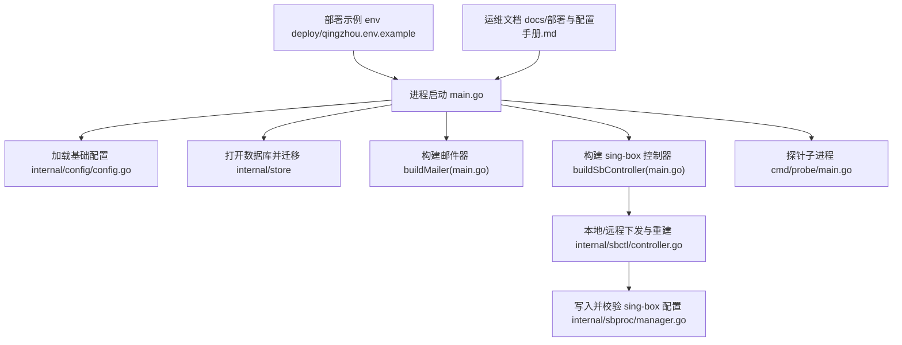
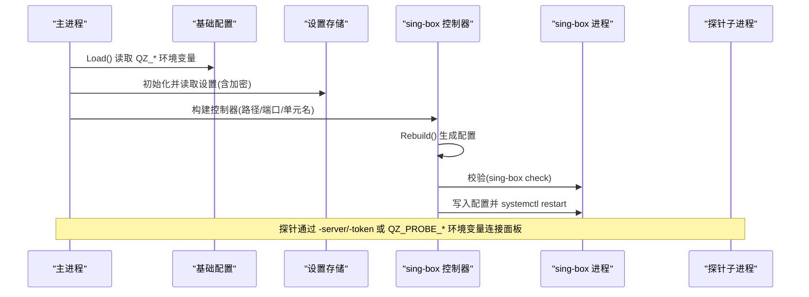
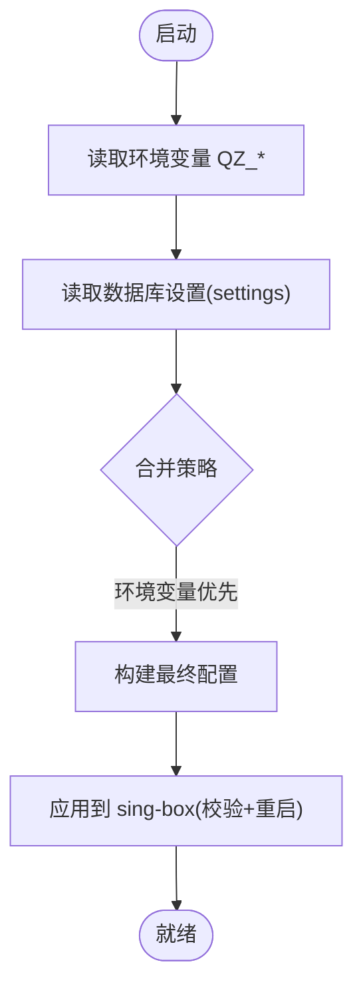
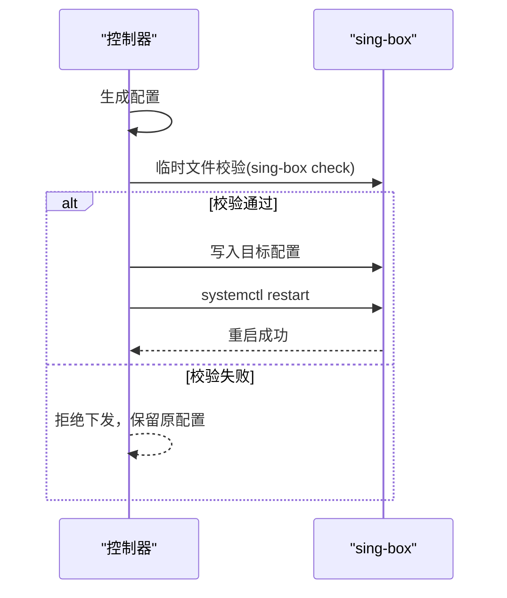
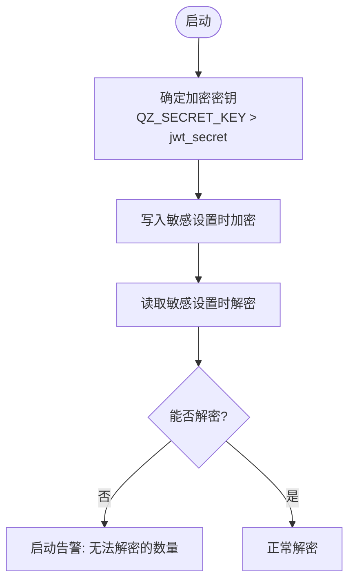
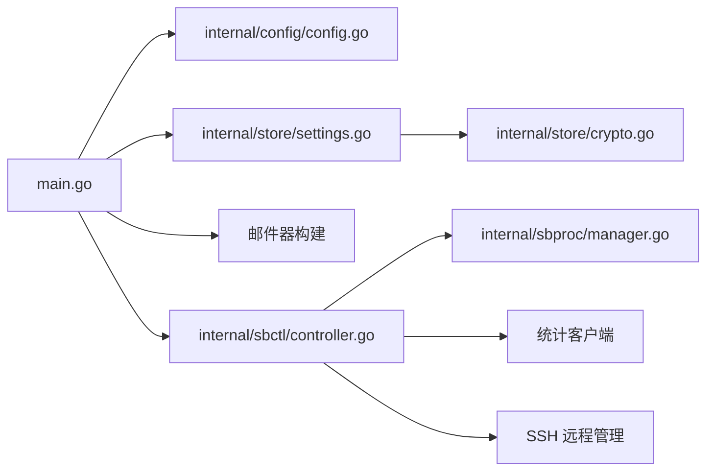

# 配置管理系统

<cite>
**本文引用的文件**
- [internal/config/config.go](file://internal/config/config.go)
- [main.go](file://main.go)
- [internal/store/settings.go](file://internal/store/settings.go)
- [internal/store/crypto.go](file://internal/store/crypto.go)
- [internal/sbctl/controller.go](file://internal/sbctl/controller.go)
- [internal/sbproc/manager.go](file://internal/sbproc/manager.go)
- [cmd/probe/main.go](file://cmd/probe/main.go)
- [deploy/qingzhou.env.example](file://deploy/qingzhou.env.example)
- [docs/部署与配置手册.md](file://docs/部署与配置手册.md)
</cite>

## 目录
1. [简介](#简介)
2. [项目结构](#项目结构)
3. [核心组件](#核心组件)
4. [架构总览](#架构总览)
5. [详细组件分析](#详细组件分析)
6. [依赖关系分析](#依赖关系分析)
7. [性能考量](#性能考量)
8. [故障排查指南](#故障排查指南)
9. [结论](#结论)
10. [附录：实践与示例](#附录：实践与示例)

## 简介
本文件面向轻舟面板的配置管理系统，系统性说明多层配置加载机制（环境变量覆盖、数据库设置读取、运行时更新）、配置结构体设计（默认值、类型校验、分组管理）、热重载流程（变更监听、平滑重启、一致性检查）、敏感配置安全存储（环境变量优先级、配置文件加密、密钥轮换）、验证规则与业务规则校验、多环境差异管理，并给出添加新配置项、实现配置验证、处理配置错误的实操指引与最佳实践。

## 项目结构
轻舟面板采用“单二进制 + 内置前端 + SQLite”的形态，核心配置来源包括：
- 进程级环境变量（QZ_*）
- 数据库 settings 表（持久化设置）
- sing-box 相关配置路径与系统服务名（由环境变量或 DB 设置决定）
- 探针子进程的命令行参数与环境变量

图表来源
- [main.go:25-142](file://main.go#L25-L142)
- [internal/config/config.go:14-29](file://internal/config/config.go#L14-L29)
- [internal/sbctl/controller.go:357-455](file://internal/sbctl/controller.go#L357-L455)
- [internal/sbproc/manager.go:34-66](file://internal/sbproc/manager.go#L34-L66)
- [cmd/probe/main.go:34-50](file://cmd/probe/main.go#L34-L50)
- [deploy/qingzhou.env.example:1-43](file://deploy/qingzhou.env.example#L1-L43)
- [docs/部署与配置手册.md:58-131](file://docs/部署与配置手册.md#L58-L131)

章节来源
- [main.go:25-142](file://main.go#L25-L142)
- [internal/config/config.go:14-29](file://internal/config/config.go#L14-L29)
- [deploy/qingzhou.env.example:1-43](file://deploy/qingzhou.env.example#L1-L43)
- [docs/部署与配置手册.md:58-131](file://docs/部署与配置手册.md#L58-L131)

## 核心组件
- 基础配置加载：提供默认值并通过 QZ_* 环境变量覆盖，形成进程运行时的最小可用配置。
- 设置持久化：通过 store 层读写 settings 表，支持布尔、整数等便捷读取，并对敏感字段进行透明加解密。
- 敏感密钥管理：使用 AES-GCM 对敏感配置落库加密；主密钥优先来自环境变量 QZ_SECRET_KEY，否则回退到 JWT 密钥。
- sing-box 控制器：负责生成、校验、下发并重启 sing-box 配置，支持本地与远程服务器并发下发。
- 探针子进程：独立的可执行文件，通过命令行参数与环境变量接收面板地址与鉴权令牌，定时上报指标。

章节来源
- [internal/config/config.go:14-29](file://internal/config/config.go#L14-L29)
- [internal/store/settings.go:7-85](file://internal/store/settings.go#L7-L85)
- [internal/store/crypto.go:17-46](file://internal/store/crypto.go#L17-L46)
- [internal/sbctl/controller.go:357-455](file://internal/sbctl/controller.go#L357-L455)
- [cmd/probe/main.go:34-50](file://cmd/probe/main.go#L34-L50)

## 架构总览
下图展示配置从“环境变量 → 数据库设置 → 控制器生成 → 校验与下发 → 服务重启”的完整链路，以及探针子进程如何获取配置。

图表来源
- [main.go:144-207](file://main.go#L144-L207)
- [internal/sbctl/controller.go:357-455](file://internal/sbctl/controller.go#L357-L455)
- [internal/sbproc/manager.go:34-66](file://internal/sbproc/manager.go#L34-L66)
- [cmd/probe/main.go:34-50](file://cmd/probe/main.go#L34-L50)

## 详细组件分析

### 多层配置加载机制
- 环境变量覆盖：基础配置通过 QZ_LISTEN、QZ_DB、QZ_ADMIN_USER、QZ_ADMIN_PASS 等覆盖默认值；邮件器与 sing-box 控制器同样遵循“环境变量优先于数据库设置”的策略。
- 数据库设置读取：settings 表提供通用键值存储，支持布尔、整数等便捷读取；所有设置读操作会先命中内存缓存，写操作后失效。
- 运行时配置更新：控制器周期性 Rebuild 与统计收集，确保配置变更后在固定周期内生效；管理员触发重建可立即应用。

图表来源
- [internal/config/config.go:14-29](file://internal/config/config.go#L14-L29)
- [main.go:144-207](file://main.go#L144-L207)
- [internal/store/settings.go:7-85](file://internal/store/settings.go#L7-L85)

章节来源
- [internal/config/config.go:14-29](file://internal/config/config.go#L14-L29)
- [main.go:144-207](file://main.go#L144-L207)
- [internal/store/settings.go:7-85](file://internal/store/settings.go#L7-L85)

### 配置结构体设计与默认值
- 基础配置结构体包含监听地址、数据库路径、初始管理员账号与密码等关键字段，全部具备合理默认值，保证开箱即用。
- 默认值设计考虑了常见部署场景（直连 vs 反代），并提供明确的环境变量覆盖入口。

章节来源
- [internal/config/config.go:5-29](file://internal/config/config.go#L5-L29)

### 配置热重载与一致性检查
- 热重载流程：控制器生成配置后，先在临时文件执行 sing-box check 校验，通过后原子写入目标路径，再调用 systemctl restart 平滑重启。
- 失败重试与幂等：若上次重启失败，即使磁盘上已有期望配置也会继续尝试重启，避免“快速路径误判导致服务长期不可用”。
- 一致性检查：每次下发前都会校验配置合法性，非法配置不会替换线上配置，保障服务稳定性。

图表来源
- [internal/sbctl/controller.go:204-280](file://internal/sbctl/controller.go#L204-L280)
- [internal/sbproc/manager.go:34-66](file://internal/sbproc/manager.go#L34-L66)

章节来源
- [internal/sbctl/controller.go:204-280](file://internal/sbctl/controller.go#L204-L280)
- [internal/sbproc/manager.go:34-66](file://internal/sbproc/manager.go#L34-L66)

### 敏感配置的安全存储与密钥轮换
- 存储加密：SMTP 密码、Cloudflare Token 等敏感设置以 AES-GCM 加密落库，读取时透明解密。
- 密钥来源优先级：优先使用环境变量 QZ_SECRET_KEY；未设置时回退到数据库中的 jwt_secret，并在日志中发出警告。
- 密钥轮换自检：启动时统计无法解密的密文数量，若大于零则提示恢复旧密钥，避免静默降级为明文。

图表来源
- [internal/store/crypto.go:17-46](file://internal/store/crypto.go#L17-L46)
- [internal/store/crypto.go:48-130](file://internal/store/crypto.go#L48-L130)
- [main.go:51-71](file://main.go#L51-L71)

章节来源
- [internal/store/crypto.go:17-46](file://internal/store/crypto.go#L17-L46)
- [internal/store/crypto.go:48-130](file://internal/store/crypto.go#L48-L130)
- [main.go:51-71](file://main.go#L51-L71)

### 配置验证规则与业务规则校验
- 配置级校验：sing-box 配置必须通过 sing-box check 才能下发，防止错误配置污染线上。
- 业务级校验：导入节点订阅时对协议、端口、方法等进行严格校验，单个无效节点会被丢弃，避免整体配置失败。
- 能力探测：远程节点的 v2ray_api 插件能力被探测并缓存，无插件的节点不注入统计块，避免配置不被接受。

章节来源
- [internal/sbctl/controller.go:253-280](file://internal/sbctl/controller.go#L253-L280)
- [internal/subconv/parse.go:78-104](file://internal/subconv/parse.go#L78-L104)
- [internal/sbctl/controller.go:282-343](file://internal/sbctl/controller.go#L282-L343)

### 不同环境的配置差异管理
- 开发/测试/生产隔离：通过不同的 qingzhou.env 与环境变量区分监听地址、数据库路径、公开访问地址、探针目录、更新仓库等。
- 反代与直连：开发环境常用回环地址配合反代；生产环境根据是否直连选择 0.0.0.0 或 127.0.0.1。
- 探针监控：探针通过 -server/-token 或 QZ_PROBE_SERVER/QZ_PROBE_TOKEN 接入面板，便于在不同环境独立部署。

章节来源
- [deploy/qingzhou.env.example:1-43](file://deploy/qingzhou.env.example#L1-L43)
- [docs/部署与配置手册.md:58-131](file://docs/部署与配置手册.md#L58-L131)
- [cmd/probe/main.go:34-50](file://cmd/probe/main.go#L34-L50)

## 依赖关系分析
- 主进程依赖基础配置、设置存储、邮件器、sing-box 控制器与探针子进程。
- 控制器依赖数据层接口、进程管理器、统计客户端与 SSH 远程管理器。
- 设置存储依赖数据库与内存缓存，并对敏感字段进行加解密。

图表来源
- [main.go:25-142](file://main.go#L25-L142)
- [internal/sbctl/controller.go:36-115](file://internal/sbctl/controller.go#L36-L115)
- [internal/store/settings.go:7-85](file://internal/store/settings.go#L7-L85)
- [internal/store/crypto.go:17-46](file://internal/store/crypto.go#L17-L46)

章节来源
- [main.go:25-142](file://main.go#L25-L142)
- [internal/sbctl/controller.go:36-115](file://internal/sbctl/controller.go#L36-L115)
- [internal/store/settings.go:7-85](file://internal/store/settings.go#L7-L85)
- [internal/store/crypto.go:17-46](file://internal/store/crypto.go#L17-L46)

## 性能考量
- 配置下发幂等：相同配置不会重复重启服务，减少不必要的系统负载。
- 并发下发：远程服务器配置下发并发执行，避免单台不可达阻塞整体重建。
- 统计采集节流：按固定间隔轮询各节点统计，避免频繁 SSH 与 API 调用造成资源消耗。
- 缓存优化：设置读取使用内存缓存，写操作后失效，降低数据库压力。

[本节为通用指导，不直接分析具体文件]

## 故障排查指南
- 面板无法访问：检查 QZ_LISTEN 是否为回环地址且未配置反代；必要时修改为 0.0.0.0:8081 并放行端口。
- 配置下发失败：查看 sing-box check 输出与 systemctl restart 日志；确认 sing-box 版本与插件支持。
- 统计为 0：确认落地机安装了带 with_v2ray_api 的 sing-box，并核对 v2ray_api 监听地址一致。
- 证书/密钥问题：若更换 QZ_SECRET_KEY 导致无法解密，需恢复旧密钥；列表会标记“无法解密”，此时拒绝写回以免覆盖成空。

章节来源
- [docs/部署与配置手册.md:237-261](file://docs/部署与配置手册.md#L237-L261)
- [internal/sbctl/controller.go:253-280](file://internal/sbctl/controller.go#L253-L280)
- [internal/store/crypto.go:79-121](file://internal/store/crypto.go#L79-L121)

## 结论
轻舟面板的配置管理系统以“环境变量优先、数据库设置兜底”的多层加载为核心，结合严格的配置校验与平滑重启机制，确保配置变更安全可控；通过 AES-GCM 加密与密钥轮换自检，保障敏感配置安全；通过控制器与探针子进程的组合，实现了对 sing-box 的全生命周期管理与监控。建议在生产环境中始终设置 QZ_SECRET_KEY，并使用反代与防火墙限制暴露面，同时定期备份数据库与探针二进制。

[本节为总结性内容，不直接分析具体文件]

## 附录：实践与示例

### 添加新配置项（步骤与参考位置）
- 在基础配置结构体中添加字段，并在 Load 中赋予默认值或通过 QZ_* 环境变量覆盖。
- 若该配置需要持久化，可在 settings 表中新增键值，并通过 GetSetting/SetSetting 读写。
- 若涉及敏感信息，将其加入加密键集合，并在 SetSecretKey 后启用加密存储。
- 在控制器或业务逻辑中使用新配置项，必要时加入校验逻辑。

参考位置
- [internal/config/config.go:5-29](file://internal/config/config.go#L5-L29)
- [internal/store/settings.go:7-85](file://internal/store/settings.go#L7-L85)
- [internal/store/crypto.go:14-46](file://internal/store/crypto.go#L14-L46)

### 实现配置验证（步骤与参考位置）
- 对关键数值范围、协议与方法进行前置校验，避免生成无效配置。
- 使用 sing-box check 作为最终校验手段，确保配置合法后再下发。
- 对远程节点的能力进行探测并缓存，避免向不支持的节点注入不兼容配置。

参考位置
- [internal/subconv/parse.go:78-104](file://internal/subconv/parse.go#L78-L104)
- [internal/sbctl/controller.go:253-280](file://internal/sbctl/controller.go#L253-L280)
- [internal/sbctl/controller.go:282-343](file://internal/sbctl/controller.go#L282-L343)

### 处理配置错误（步骤与参考位置）
- 捕获 sing-box check 与 systemctl restart 的错误，记录详细输出以便定位。
- 对失败的重启进行重试跟踪，避免快速路径误判导致服务长期不可用。
- 对无法解密的敏感配置进行启动自检并告警，提示恢复密钥。

参考位置
- [internal/sbctl/controller.go:253-280](file://internal/sbctl/controller.go#L253-L280)
- [internal/sbproc/manager.go:34-66](file://internal/sbproc/manager.go#L34-L66)
- [internal/store/crypto.go:79-121](file://internal/store/crypto.go#L79-L121)

### 最佳实践
- 始终设置 QZ_SECRET_KEY，并将敏感配置置于环境变量或受保护的系统中。
- 使用反代与防火墙限制面板暴露面，开发环境使用回环地址，生产环境按需开放。
- 定期备份数据库与探针二进制，利用在线更新页的一键导出功能做一致性快照。
- 对 sing-box 版本与插件能力保持关注，出现标红或统计异常时优先重装为发布版。

参考位置
- [deploy/qingzhou.env.example:1-43](file://deploy/qingzhou.env.example#L1-L43)
- [docs/部署与配置手册.md:58-131](file://docs/部署与配置手册.md#L58-L131)
- [docs/部署与配置手册.md:237-261](file://docs/部署与配置手册.md#L237-L261)
