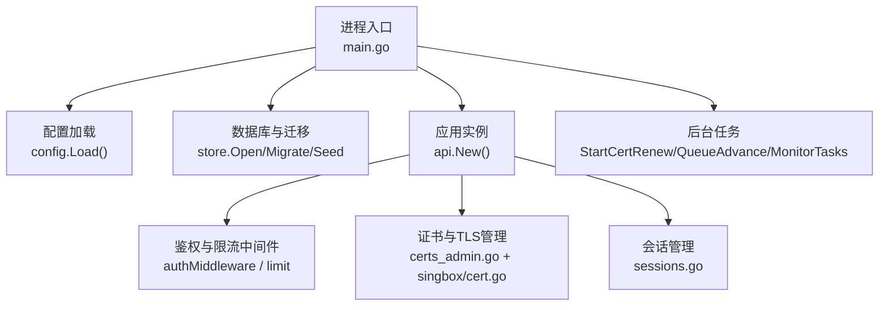
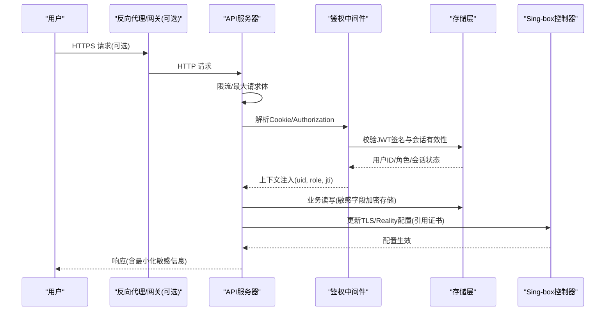
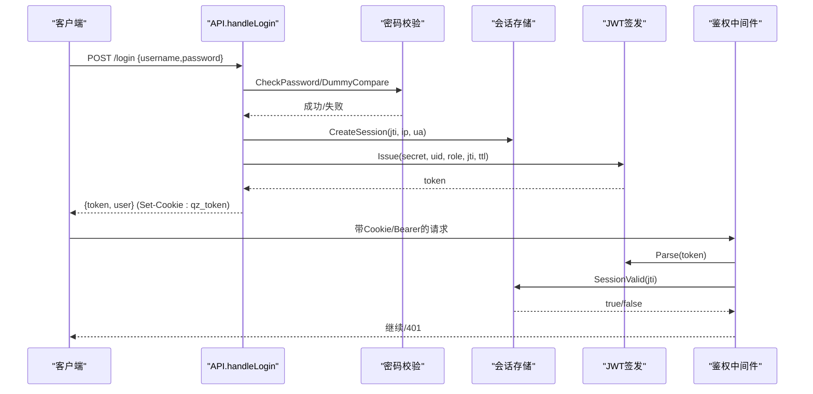
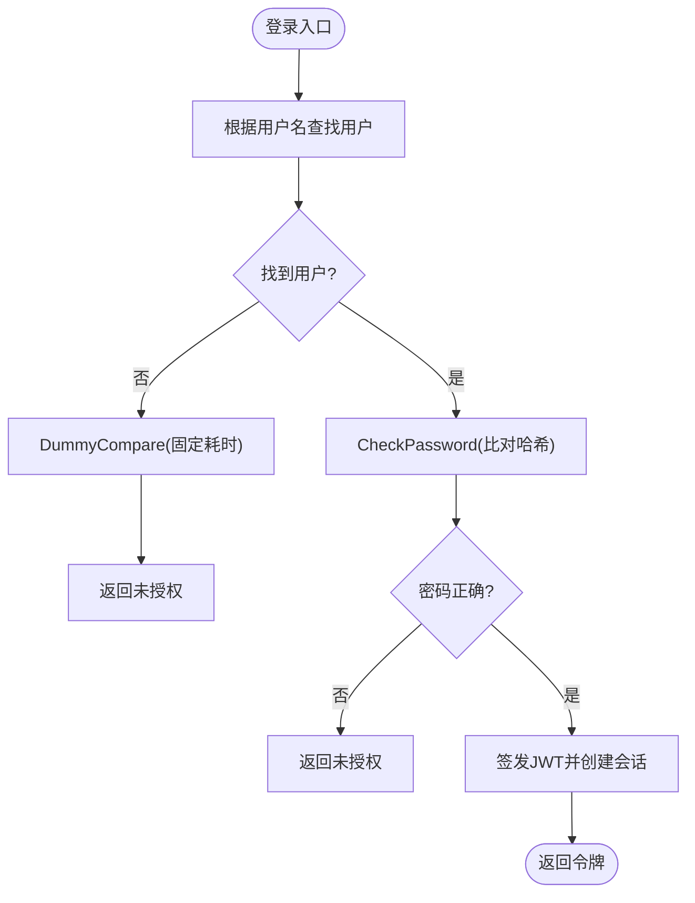
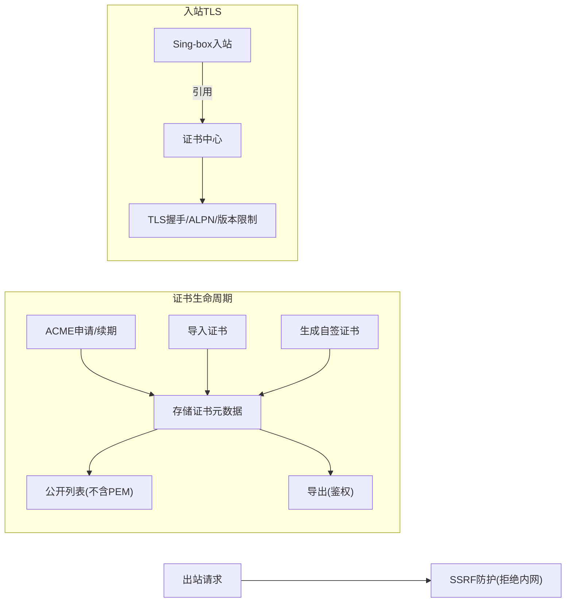
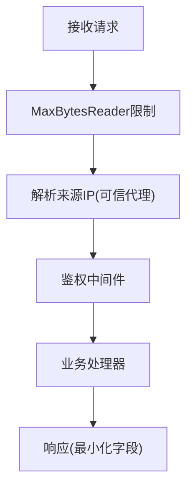
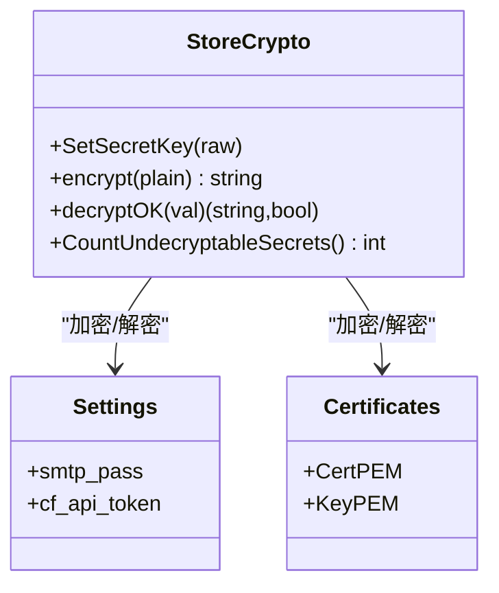
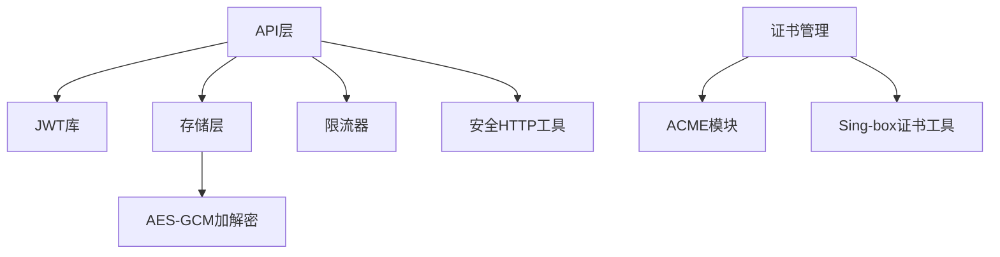

# 安全架构设计

<cite>
**本文引用的文件**
- [main.go](file://main.go)
- [internal/config/config.go](file://internal/config/config.go)
- [internal/api/auth.go](file://internal/api/auth.go)
- [internal/api/sessions.go](file://internal/api/sessions.go)
- [internal/api/ratelimit.go](file://internal/api/ratelimit.go)
- [internal/api/safehttp.go](file://internal/api/safehttp.go)
- [internal/api/certs_admin.go](file://internal/api/certs_admin.go)
- [internal/auth/jwt.go](file://internal/auth/jwt.go)
- [internal/auth/password.go](file://internal/auth/password.go)
- [internal/store/crypto.go](file://internal/store/crypto.go)
- [internal/singbox/cert.go](file://internal/singbox/cert.go)
</cite>

## 目录
1. [简介](#简介)
2. [项目结构](#项目结构)
3. [核心组件](#核心组件)
4. [架构总览](#架构总览)
5. [详细组件分析](#详细组件分析)
6. [依赖关系分析](#依赖关系分析)
7. [性能与安全权衡](#性能与安全权衡)
8. [故障排查指南](#故障排查指南)
9. [结论](#结论)
10. [附录](#附录)

## 简介
本文件面向轻舟面板的安全架构设计与实现，围绕认证授权、密码安全、数据传输安全、输入输出防护、敏感数据保护以及安全审计与监控等维度进行系统化说明。文档结合代码级实现，提供架构图与时序图，帮助开发者快速理解系统的安全边界与控制点，并给出可操作的排障建议与最佳实践。

## 项目结构
轻舟面板采用分层组织：入口进程负责启动、配置加载、后台任务与HTTP服务；API层提供路由、鉴权中间件、限流与请求安全处理；存储层负责持久化与敏感数据加解密；Sing-box集成模块负责证书与出站/入站安全策略；前端通过管理界面完成证书与TLS配置。

图表来源
- [main.go:25-142](file://main.go#L25-L142)
- [internal/config/config.go:14-29](file://internal/config/config.go#L14-L29)
- [internal/api/auth.go:179-213](file://internal/api/auth.go#L179-L213)
- [internal/api/sessions.go:13-42](file://internal/api/sessions.go#L13-L42)
- [internal/api/certs_admin.go:90-161](file://internal/api/certs_admin.go#L90-L161)
- [internal/singbox/cert.go:76-139](file://internal/singbox/cert.go#L76-L139)

章节来源
- [main.go:25-142](file://main.go#L25-L142)
- [internal/config/config.go:14-29](file://internal/config/config.go#L14-L29)

## 核心组件
- 认证与授权：基于JWT的无状态令牌签发与校验，结合服务端会话表实现“在线设备”管理与撤销能力；角色控制（admin）用于管理员接口保护。
- 密码安全：使用bcrypt进行密码哈希与比对，并提供固定耗时比较以防御用户名枚举。
- 会话管理：登录时创建会话记录，支持列出当前活跃设备、注销指定设备、统一过期清理。
- 传输安全：HTTPS/TLS由外部反向代理或内置sing-box入站提供；面板自身默认监听HTTP端口，生产环境应置于HTTPS网关后；证书中心支持ACME自动签发与续期、自签证书生成与指纹计算。
- 输入与输出安全：请求体大小限制、SSRF防护（仅允许http/https且拒绝内网地址）、可信代理IP解析、URL白名单校验。
- 敏感数据保护：设置项中的SMTP密码、Cloudflare Token等按字段加密存储；密钥来源于环境变量QZ_SECRET_KEY或回退到jwt_secret；启动时自检不可解密条目数量。
- 安全审计与监控：登录与会话操作日志（通过会话表体现）、异常与错误信息返回、证书到期与续期状态展示、后台监控任务。

章节来源
- [internal/api/auth.go:112-213](file://internal/api/auth.go#L112-L213)
- [internal/auth/jwt.go:16-42](file://internal/auth/jwt.go#L16-L42)
- [internal/auth/password.go:5-23](file://internal/auth/password.go#L5-L23)
- [internal/api/sessions.go:13-42](file://internal/api/sessions.go#L13-L42)
- [internal/api/safehttp.go:12-85](file://internal/api/safehttp.go#L12-L85)
- [internal/store/crypto.go:17-130](file://internal/store/crypto.go#L17-L130)
- [internal/api/certs_admin.go:22-68](file://internal/api/certs_admin.go#L22-L68)

## 架构总览
下图展示了从客户端到后端的核心安全路径：请求进入后先经过限流与最大请求体限制，再进入鉴权中间件验证JWT与有效会话，随后访问受控资源；敏感数据在落盘前加密，证书由证书中心统一管理并通过sing-box注入。

图表来源
- [internal/api/ratelimit.go:53-65](file://internal/api/ratelimit.go#L53-L65)
- [internal/api/safehttp.go:58-69](file://internal/api/safehttp.go#L58-L69)
- [internal/api/auth.go:179-213](file://internal/api/auth.go#L179-L213)
- [internal/store/crypto.go:24-77](file://internal/store/crypto.go#L24-L77)
- [internal/api/certs_admin.go:90-161](file://internal/api/certs_admin.go#L90-L161)

## 详细组件分析

### 认证与授权机制
- JWT签发与校验：使用HS256算法，Claims包含用户ID与角色，令牌携带唯一标识jti用于会话绑定；校验时强制签名方法为HMAC并检查令牌有效性。
- 会话绑定：登录成功后创建会话记录（包含IP、User-Agent），将jti写入JWT；后续每次请求校验会话仍存在，支持远程撤销与下线。
- 权限控制：鉴权中间件将uid、role、jti注入上下文；管理员接口需额外校验role为admin。
- Cookie与Bearer：同时支持Authorization: Bearer与名为qz_token的HttpOnly Cookie；登出时清除Cookie并删除对应会话。

图表来源
- [internal/api/auth.go:112-177](file://internal/api/auth.go#L112-L177)
- [internal/auth/jwt.go:16-42](file://internal/auth/jwt.go#L16-L42)
- [internal/api/sessions.go:13-42](file://internal/api/sessions.go#L13-L42)

章节来源
- [internal/api/auth.go:179-213](file://internal/api/auth.go#L179-L213)
- [internal/auth/jwt.go:16-42](file://internal/auth/jwt.go#L16-L42)
- [internal/api/sessions.go:13-42](file://internal/api/sessions.go#L13-L42)

### 密码安全策略
- 哈希算法：使用bcrypt默认强度进行密码哈希；比对时使用标准库函数。
- 防枚举：当用户不存在时执行DummyCompare，使响应时间与真实比对相近，避免泄露用户名是否存在。
- 盐值：由bcrypt内部随机生成，无需手动管理。

图表来源
- [internal/api/auth.go:112-149](file://internal/api/auth.go#L112-L149)
- [internal/auth/password.go:5-23](file://internal/auth/password.go#L5-L23)

章节来源
- [internal/auth/password.go:5-23](file://internal/auth/password.go#L5-L23)
- [internal/api/auth.go:112-149](file://internal/api/auth.go#L112-L149)

### 数据传输安全（HTTPS/TLS）
- 面板监听：默认监听HTTP端口，生产部署建议置于HTTPS反向代理之后；可通过环境变量调整监听地址。
- 证书管理：提供证书中心，支持ACME自动签发（DNS-01/HTTP-01/Webroot）、导入外部证书、自签证书；列表接口不暴露PEM明文，导出接口需鉴权；支持显示剩余天数与到期状态。
- Sing-box集成：入站可绑定证书，支持Reality、ALPN、版本限制等；自签证书可计算SHA-256指纹供客户端pin。
- 出站安全：safeFetchClient在拨号阶段校验目标IP，拒绝内网地址，防止SSRF；仅允许http/https URL。

图表来源
- [internal/api/certs_admin.go:90-161](file://internal/api/certs_admin.go#L90-L161)
- [internal/api/certs_admin.go:209-245](file://internal/api/certs_admin.go#L209-L245)
- [internal/singbox/cert.go:76-139](file://internal/singbox/cert.go#L76-L139)
- [internal/api/safehttp.go:27-56](file://internal/api/safehttp.go#L27-L56)

章节来源
- [internal/api/certs_admin.go:22-68](file://internal/api/certs_admin.go#L22-L68)
- [internal/singbox/cert.go:19-74](file://internal/singbox/cert.go#L19-L74)
- [internal/api/safehttp.go:27-56](file://internal/api/safehttp.go#L27-L56)

### 输入验证与输出编码
- 请求体限制：全局中间件对请求体大小进行限制，防止超大负载导致内存耗尽。
- SSRF防护：出站请求在Dial阶段解析域名并校验IP，拒绝环回、私有、链路本地、CGNAT等地址；URL仅允许http/https。
- 可信代理IP：仅在直连对端为可信代理时才信任X-Real-IP/X-Forwarded-For，否则使用Socket远端地址，防止伪造来源IP。
- 输出最小化：用户视图不包含敏感字段（如邮箱是否验证、积分等），避免不必要的数据泄露。

图表来源
- [internal/api/safehttp.go:58-69](file://internal/api/safehttp.go#L58-L69)
- [internal/api/auth.go:28-47](file://internal/api/auth.go#L28-L47)
- [internal/api/auth.go:225-240](file://internal/api/auth.go#L225-L240)

章节来源
- [internal/api/safehttp.go:12-85](file://internal/api/safehttp.go#L12-L85)
- [internal/api/auth.go:28-47](file://internal/api/auth.go#L28-L47)
- [internal/api/auth.go:225-240](file://internal/api/auth.go#L225-L240)

### 敏感数据保护
- 静态加密：敏感设置（如smtp_pass、cf_api_token）以enc:v1:前缀+AES-GCM密文形式存储；密钥来源于QZ_SECRET_KEY或回退到jwt_secret。
- 启动自检：统计无法解密的密文数量，若不为零则告警，避免静默降级为明文。
- 证书私钥：证书中心的KeyPEM同样受加密保护；导出接口需鉴权且解密失败时拒绝。

图表来源
- [internal/store/crypto.go:17-130](file://internal/store/crypto.go#L17-L130)
- [internal/api/certs_admin.go:303-315](file://internal/api/certs_admin.go#L303-L315)

章节来源
- [internal/store/crypto.go:17-130](file://internal/store/crypto.go#L17-L130)
- [internal/api/certs_admin.go:303-315](file://internal/api/certs_admin.go#L303-L315)

### 安全审计与监控
- 会话审计：登录与会话撤销均记录于会话表，支持列出当前在线设备与当前会话标记；过期会话定期清理。
- 错误与告警：证书续期失败会记录错误信息；不可解密密文数量在启动时输出警告。
- 监控任务：后台定时任务包括队列推进、证书续期、监控任务等，保障系统持续健康运行。

章节来源
- [internal/api/sessions.go:13-42](file://internal/api/sessions.go#L13-L42)
- [internal/api/certs_admin.go:280-301](file://internal/api/certs_admin.go#L280-L301)
- [main.go:99-106](file://main.go#L99-L106)

## 依赖关系分析
- 认证链：API鉴权中间件依赖JWT库与存储层会话接口；密码校验依赖bcrypt；会话管理依赖存储层。
- 传输安全：证书管理依赖ACME模块与Sing-box证书工具；出站安全依赖网络栈与IP白名单逻辑。
- 敏感数据：存储层加解密依赖AES-GCM与随机数源；主密钥来自环境变量或配置。

图表来源
- [internal/api/auth.go:179-213](file://internal/api/auth.go#L179-L213)
- [internal/api/ratelimit.go:9-65](file://internal/api/ratelimit.go#L9-L65)
- [internal/api/safehttp.go:27-85](file://internal/api/safehttp.go#L27-L85)
- [internal/store/crypto.go:17-77](file://internal/store/crypto.go#L17-L77)
- [internal/api/certs_admin.go:90-161](file://internal/api/certs_admin.go#L90-L161)

章节来源
- [internal/api/auth.go:179-213](file://internal/api/auth.go#L179-L213)
- [internal/api/ratelimit.go:9-65](file://internal/api/ratelimit.go#L9-L65)
- [internal/api/safehttp.go:27-85](file://internal/api/safehttp.go#L27-L85)
- [internal/store/crypto.go:17-77](file://internal/store/crypto.go#L17-L77)
- [internal/api/certs_admin.go:90-161](file://internal/api/certs_admin.go#L90-L161)

## 性能与安全权衡
- 限流窗口：固定窗口简单高效，适合防暴力破解与滥用；可根据业务调整窗口与阈值。
- 请求体限制：避免大体积请求造成内存压力，降低DoS风险。
- bcrypt成本：默认成本兼顾安全性与性能；在高并发场景下可评估调优。
- 会话清理：定期清理过期会话减少存储膨胀，提高查询效率。
- 证书续期：后台任务批量续期，避免集中高峰；失败重试与错误记录便于运维。

[本节为通用指导，不直接分析具体文件]

## 故障排查指南
- 登录失败但提示“用户名或密码错误”：可能为用户不存在或密码错误；系统已做固定耗时比较，避免枚举。
- 令牌失效：检查JWT签名与有效期；确认会话仍存在于存储层；必要时重新登录。
- 证书无法解密：检查QZ_SECRET_KEY是否与首次运行时一致；查看启动警告中不可解密条目数量。
- 出站请求被拒绝：检查URL是否仅http/https；目标IP是否为内网地址；确认DNS解析结果未被重绑定。
- 频繁请求被限流：检查同一IP的请求频率；适当放宽限流策略或优化客户端重试逻辑。

章节来源
- [internal/api/auth.go:112-149](file://internal/api/auth.go#L112-L149)
- [internal/api/auth.go:179-213](file://internal/api/auth.go#L179-L213)
- [internal/store/crypto.go:79-130](file://internal/store/crypto.go#L79-L130)
- [internal/api/safehttp.go:71-85](file://internal/api/safehttp.go#L71-L85)
- [internal/api/ratelimit.go:53-65](file://internal/api/ratelimit.go#L53-L65)

## 结论
轻舟面板在认证授权、密码安全、传输安全、输入输出防护、敏感数据保护与审计监控等方面形成了完整的安全闭环。通过JWT与会话绑定、bcrypt与固定耗时比较、HTTPS/TLS与证书中心、SSRF与请求体限制、AES-GCM静态加密与启动自检，系统在易用性与安全性之间取得平衡。建议在生产环境中启用HTTPS网关、合理配置限流与超时、严格管理QZ_SECRET_KEY与管理员凭据，并持续监控证书与告警信息。

[本节为总结性内容，不直接分析具体文件]

## 附录
- 环境变量参考：
  - QZ_LISTEN：监听地址（默认0.0.0.0:8081）
  - QZ_DB：数据库路径
  - QZ_ADMIN_USER/QZ_ADMIN_PASS：管理员初始凭据
  - QZ_SECRET_KEY：敏感设置静态加密密钥（推荐独立于DB）
  - QZ_SMTP_*：邮件发送相关配置
  - QZ_SINGBOX_*：Sing-box控制器相关配置

章节来源
- [internal/config/config.go:14-29](file://internal/config/config.go#L14-L29)
- [main.go:56-71](file://main.go#L56-L71)
- [main.go:144-169](file://main.go#L144-L169)
- [main.go:171-207](file://main.go#L171-L207)
