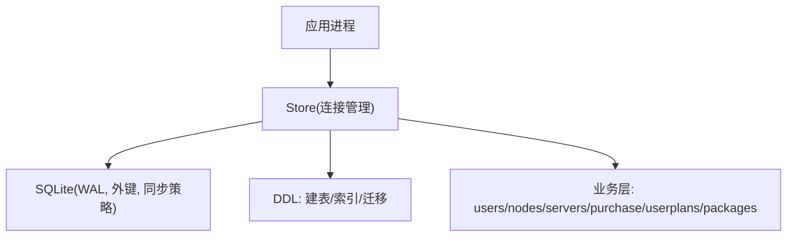
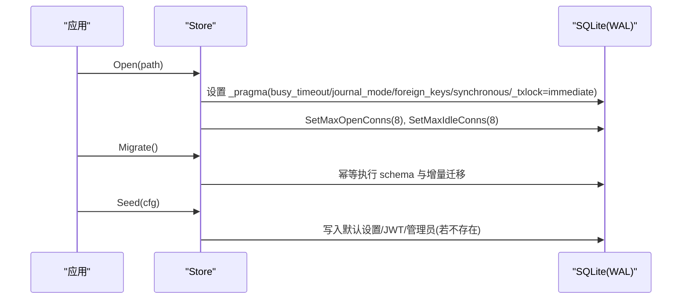
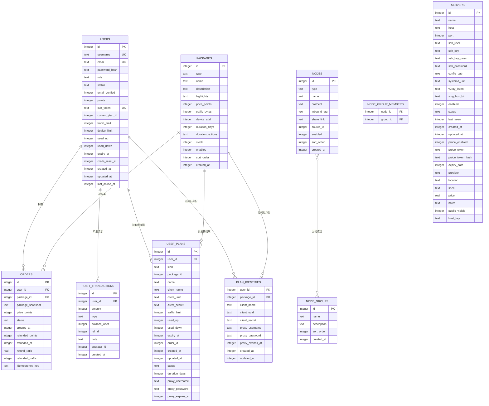

# 数据库设计

<cite>
**本文引用的文件**
- [store.go](file://internal/store/store.go)
- [migrate.go](file://internal/store/migrate.go)
- [seed.go](file://internal/store/seed.go)
- [users.go](file://internal/store/users.go)
- [nodes.go](file://internal/store/nodes.go)
- [servers.go](file://internal/store/servers.go)
- [purchase.go](file://internal/store/purchase.go)
- [userplans.go](file://internal/store/userplans.go)
- [packages.go](file://internal/store/packages.go)
</cite>

## 目录
1. [简介](#简介)
2. [项目结构](#项目结构)
3. [核心组件](#核心组件)
4. [架构总览](#架构总览)
5. [详细组件分析](#详细组件分析)
6. [依赖关系分析](#依赖关系分析)
7. [性能与并发](#性能与并发)
8. [故障排查指南](#故障排查指南)
9. [结论](#结论)
10. [附录：常用查询示例](#附录：常用查询示例)

## 简介
本文件面向轻舟面板的 SQLite 嵌入式数据库，系统化说明表结构设计、实体关系映射、索引与约束、数据完整性保障、初始化流程（建表脚本、种子数据、版本迁移），以及 WAL 模式与连接池配置对并发性能的影响。文档同时提供 ER 图与常用 SQL 示例，帮助读者快速理解并正确使用该数据库。

## 项目结构
- 数据库连接与参数在 store.Open 中集中配置，启用 WAL、外键、同步策略与事务锁模式，并设置连接池大小以支持嵌套读与并发写。
- 所有 DDL（建表、索引、增量迁移）集中在 migrate 包内，启动时幂等执行；首次启动通过 seed 写入默认配置与管理员账户。
- 业务域按功能拆分到 users、nodes、servers、purchase、userplans、packages 等文件，分别封装对应表的读写逻辑。

图表来源
- [store.go:27-57](file://internal/store/store.go#L27-L57)
- [migrate.go:532-743](file://internal/store/migrate.go#L532-L743)

章节来源
- [store.go:27-57](file://internal/store/store.go#L27-L57)
- [migrate.go:532-743](file://internal/store/migrate.go#L532-L743)
- [seed.go:22-100](file://internal/store/seed.go#L22-L100)

## 核心组件
- Store：封装 SQLite 连接、WAL/外键/同步策略、连接池、设置缓存与探针计数器。
- 迁移器：幂等创建所有表与索引，并在升级时追加列、重命名列、重建索引、回填历史数据。
- 种子器：首次启动写入系统设置、JWT 密钥与管理员账户（若不存在）。
- 业务模块：用户、节点、服务器、订单、套餐、额度桶（user_plans）、身份（plan_identities）等。

章节来源
- [store.go:10-71](file://internal/store/store.go#L10-L71)
- [migrate.go:10-530](file://internal/store/migrate.go#L10-L530)
- [seed.go:22-100](file://internal/store/seed.go#L22-L100)

## 架构总览
轻舟面板采用单进程 + 嵌入式 SQLite 的架构，使用 WAL 提升并发读能力，并通过 BEGIN IMMEDIATE 提前获取写锁避免快照冲突。连接池大小为 8，允许在事务内调用外部服务后再读取数据库而不死锁。

图表来源
- [store.go:27-57](file://internal/store/store.go#L27-L57)
- [migrate.go:532-743](file://internal/store/migrate.go#L532-L743)
- [seed.go:22-100](file://internal/store/seed.go#L22-L100)

## 详细组件分析

### 用户表（users）
- 用途：存储面板用户、凭据、订阅令牌、流量限额、设备数、过期时间、最近在线等。
- 关键字段
  - id: 自增主键
  - username: 唯一
  - email: 唯一（可空）
  - password_hash: 非空
  - role/status/email_verified/points/sub_token/current_plan_id/traffic_limit/device_limit/used_up/used_down/expiry_at/creds_reset_at/created_at/updated_at/last_online_at
- 约束与索引
  - username 唯一
  - email 唯一
  - sub_token 唯一
  - 索引 idx_users_email
  - 迁移阶段会创建 idx_users_client_name（用于统计与列表优化）
- 典型操作
  - 按用户名/邮箱/ID/订阅令牌查询
  - 创建用户、更新订阅令牌、旋转节点凭据（带冷却期）
  - 删除用户时级联清理会话、邮件令牌、禁用节点、套餐、用量样本、日汇总等

章节来源
- [migrate.go:16-44](file://internal/store/migrate.go#L16-L44)
- [migrate.go:587-588](file://internal/store/migrate.go#L587-L588)
- [users.go:22-56](file://internal/store/users.go#L22-L56)
- [users.go:76-121](file://internal/store/users.go#L76-L121)
- [users.go:132-165](file://internal/store/users.go#L132-L165)
- [users.go:167-296](file://internal/store/users.go#L167-L296)
- [users.go:298-380](file://internal/store/users.go#L298-L380)

### 节点表（nodes）与分组（node_groups / node_group_members）
- 用途：管理自建或外部节点、入站标签、分享链接、排序、启用状态；节点与分组多对多。
- 关键字段
  - nodes: id/type/name/protocol/inbound_tag/share_link/source_id/enabled/sort_order/created_at
  - node_groups: id/name/description/sort_order/created_at
  - node_group_members: (node_id, group_id) 复合主键
- 约束与索引
  - node_group_members 上建立 group_id 与 node_id 索引
  - nodes 上建立 enabled 索引
  - 迁移阶段为 source_id 建立索引
- 典型操作
  - 节点 CRUD、排序、分组关联、按组查询可用节点
  - 节点来源（node_sources）拉取并替换节点集合

章节来源
- [migrate.go:107-135](file://internal/store/migrate.go#L107-L135)
- [migrate.go:587-588](file://internal/store/migrate.go#L587-L588)
- [nodes.go:11-25](file://internal/store/nodes.go#L11-L25)
- [nodes.go:40-160](file://internal/store/nodes.go#L40-L160)
- [nodes.go:162-258](file://internal/store/nodes.go#L162-L258)
- [nodes.go:335-401](file://internal/store/nodes.go#L335-L401)
- [nodes.go:403-547](file://internal/store/nodes.go#L403-L547)

### 服务器表（servers）
- 用途：管理远端服务器信息、SSH 凭据、Sing-box 路径、探针开关与令牌、公开可见性等。
- 关键字段
  - id/name/host/port/ssh_user/ssh_key/ssh_key_pass/ssh_password/config_path/systemd_unit/v2ray_listen/sing_box_bin/enabled/status/last_seen/created_at/updated_at
  - probe_enabled/probe_token/probe_token_hash/expiry_date/provider/location/spec/price/notes/public_visible/host_key
- 约束与索引
  - 无显式外键（代码层校验引用完整性）
  - 迁移阶段为探针令牌哈希字段添加并回填
- 典型操作
  - 创建/更新/删除（存在绑定则拒绝）
  - 按探针令牌查找（基于哈希匹配）
  - 更新状态、最后在线时间、主机密钥固定

章节来源
- [migrate.go:447-464](file://internal/store/migrate.go#L447-L464)
- [migrate.go:591-610](file://internal/store/migrate.go#L591-L610)
- [servers.go:22-58](file://internal/store/servers.go#L22-L58)
- [servers.go:86-150](file://internal/store/servers.go#L86-L150)
- [servers.go:158-182](file://internal/store/servers.go#L158-L182)

### 订单表（orders）与积分流水（point_transactions）
- 用途：记录购买、管理员发放、退款等交易；订单快照保存商品详情；积分流水记录余额变化。
- 关键字段
  - orders: id/user_id/package_id/package_snapshot/price_points/status/created_at/refunded_points/refunded_at/refund_ratio/refunded_traffic/idempotency_key
  - point_transactions: id/user_id/amount/type/balance_after/ref_id/note/operator_id/created_at
- 约束与索引
  - orders.user_id 索引
  - orders(user_id, idempotency_key) 部分唯一索引（仅当 key 非空）
  - point_transactions.user_id 索引
- 典型操作
  - 幂等购买（去重键防重复扣款）
  - 管理员发放（零价格订单）
  - 退款（按比例或全额，回滚配额并记录流水）
  - 查询用户/全量订单

章节来源
- [migrate.go:45-84](file://internal/store/migrate.go#L45-L84)
- [migrate.go:611-630](file://internal/store/migrate.go#L611-L630)
- [purchase.go:22-41](file://internal/store/purchase.go#L22-L41)
- [purchase.go:53-250](file://internal/store/purchase.go#L53-L250)
- [purchase.go:252-367](file://internal/store/purchase.go#L252-L367)
- [purchase.go:369-410](file://internal/store/purchase.go#L369-L410)
- [purchase.go:412-567](file://internal/store/purchase.go#L412-L567)
- [purchase.go:569-649](file://internal/store/purchase.go#L569-L649)

### 套餐表（packages）与用户额度桶（user_plans）及身份（plan_identities）
- 用途：
  - packages：售卖的商品（流量/套餐/设备），支持多时长选项与库存控制。
  - user_plans：用户的“额度桶”，每个桶有独立计量、配额、过期时间与 Sing-box 身份。
  - plan_identities：订阅行级别的稳定凭据（client_name/uuid/secret），避免切换份导致客户端断连。
- 关键字段
  - packages: type/name/description/highlights/price_points/traffic_bytes/device_add/duration_days/duration_options/stock/enabled/sort_order/created_at
  - user_plans: user_id/kind(package_id/name/client_*/traffic_limit/used_up/used_down/expiry_at/order_id/created_at/updated_at/status/duration_days/proxy_*)
  - plan_identities: user_id/package_id/client_*/proxy_* (主键 user_id, package_id)
- 约束与索引
  - user_plans.client_name 唯一索引
  - plan_identities.client_name 唯一索引
  - plan_identities.proxy_username 部分唯一索引
  - user_plans.user_id 索引
- 典型操作
  - 购买/发放：创建 queued 桶，必要时激活（advanceUserQueues）
  - 退款：回滚桶配额/有效期，必要时推进队列
  - 聚合：recomputeUserAggregate 将桶级数据汇总到 users.* 显示列
  - 免费/通用流量桶：EnsureFreeBucket/EnsurePoolBucket/EnsureWelcomeBucket

章节来源
- [migrate.go:45-60](file://internal/store/migrate.go#L45-L60)
- [migrate.go:344-401](file://internal/store/migrate.go#L344-L401)
- [packages.go:23-44](file://internal/store/packages.go#L23-L44)
- [packages.go:113-139](file://internal/store/packages.go#L113-L139)
- [packages.go:171-245](file://internal/store/packages.go#L171-L245)
- [packages.go:247-307](file://internal/store/packages.go#L247-L307)
- [packages.go:314-382](file://internal/store/packages.go#L314-L382)
- [userplans.go:28-53](file://internal/store/userplans.go#L28-L53)
- [userplans.go:55-79](file://internal/store/userplans.go#L55-L79)
- [userplans.go:148-226](file://internal/store/userplans.go#L148-L226)
- [userplans.go:330-434](file://internal/store/userplans.go#L330-L434)
- [userplans.go:436-460](file://internal/store/userplans.go#L436-L460)
- [userplans.go:479-572](file://internal/store/userplans.go#L479-L572)
- [userplans.go:574-707](file://internal/store/userplans.go#L574-L707)
- [userplans.go:709-800](file://internal/store/userplans.go#L709-L800)

### ER 图（核心实体关系）

图表来源
- [migrate.go:10-530](file://internal/store/migrate.go#L10-L530)

## 依赖关系分析
- 业务层对 Store 的依赖：所有表访问均通过 Store 方法，保证事务、加密、解密、缓存失效的一致性。
- 迁移与种子：Migrate 幂等执行，Seed 仅在缺失时写入默认值，确保多次启动安全。
- 外键约束：SQLite 外键开启（foreign_keys=1），但多数关系通过代码逻辑维护（如 servers 删除前检查绑定）。
- 索引优化：热点查询路径（用户、订单、节点、指标）均有合适索引；部分索引为部分唯一（如订单幂等键、代理用户名）。

章节来源
- [store.go:27-57](file://internal/store/store.go#L27-L57)
- [migrate.go:532-743](file://internal/store/migrate.go#L532-L743)
- [servers.go:134-150](file://internal/store/servers.go#L134-L150)
- [purchase.go:88-104](file://internal/store/purchase.go#L88-L104)

## 性能与并发
- WAL 模式：提高并发读能力，写者串行化；配合 busy_timeout 降低忙冲突失败概率。
- 事务锁模式：_txlock=immediate 使 Begin 立即获取写锁，避免读→写事务中途升级导致的 SQLITE_BUSY_SNAPSHOT。
- 连接池：最大打开连接与空闲连接均为 8，避免单连接在事务内再读时的死锁（例如购买后回调内部再次查询）。
- 索引策略：针对高频过滤与排序字段建立索引（如 users.email、orders.user_id、node_group_members.group_id/node_id、server_metrics.ts 等）。
- 批量与聚合：用户额度桶聚合通过 recomputeUserAggregate 统一计算，避免分散维护导致的数据漂移。

章节来源
- [store.go:27-57](file://internal/store/store.go#L27-L57)
- [migrate.go:469-498](file://internal/store/migrate.go#L469-L498)
- [purchase.go:53-250](file://internal/store/purchase.go#L53-L250)
- [userplans.go:436-460](file://internal/store/userplans.go#L436-L460)

## 故障排查指南
- 常见错误定位
  - 购买失败：检查幂等键是否已存在、库存是否为 0、用户积分是否足够、商品是否下架或受限。
  - 退款失败：确认订单状态、退款策略（按比例/全额）、桶是否存在且可回滚。
  - 节点删除失败：若仍有入站/TLS 绑定，需先解绑或删除。
  - 服务器删除失败：若有入站/TLS 引用，需先处理绑定。
- 日志与诊断
  - 迁移语句失败会被记录并继续（忽略“重复列名/无此列/无此表”等良性错误）。
  - 指标表增长快，注意定期修剪（PruneMetrics）以避免全表扫描。
- 建议
  - 在高并发场景下优先使用 WAL 与合理连接池大小。
  - 对大结果集查询增加 LIMIT，避免一次性加载过多数据。
  - 对敏感字段（SSH 凭据、探针令牌）使用加密存储与哈希匹配。

章节来源
- [migrate.go:690-705](file://internal/store/migrate.go#L690-L705)
- [servers.go:134-150](file://internal/store/servers.go#L134-L150)
- [purchase.go:53-250](file://internal/store/purchase.go#L53-L250)
- [purchase.go:412-567](file://internal/store/purchase.go#L412-L567)

## 结论
轻舟面板的数据库设计围绕“额度桶”模型展开，将用户权益细粒度化为独立的计量单元，结合稳定的订阅行身份，既保证了计费与计量的准确性，又避免了频繁切换带来的客户端中断风险。WAL 与连接池配置提升了并发性能，幂等迁移与种子机制保障了部署与升级的稳定性。整体设计兼顾了扩展性、可维护性与安全性。

## 附录：常用查询示例
以下示例展示常见查询模式，便于理解与调试。实际使用时请根据业务需求调整条件与字段。

- 查询用户基本信息（按用户名）
  - SELECT id, username, email, role, status, points, traffic_limit, expiry_at FROM users WHERE username = ?;
- 查询用户订单列表（按用户 ID，倒序）
  - SELECT id, package_id, price_points, status, created_at FROM orders WHERE user_id = ? ORDER BY id DESC;
- 查询用户当前可用的节点（按组）
  - SELECT n.id, n.name, n.protocol, n.enabled FROM nodes n JOIN node_group_members m ON m.node_id = n.id WHERE m.group_id IN (?, ?, ?) AND n.enabled = 1 ORDER BY n.sort_order, n.id;
- 查询服务器列表（含探针状态）
  - SELECT id, name, host, status, last_seen, probe_enabled FROM servers ORDER BY id;
- 查询用户额度桶（包含身份）
  - SELECT p.id, p.kind, p.package_id, p.traffic_limit, p.used_up, p.used_down, p.expiry_at, i.client_name, i.client_uuid, i.client_secret FROM user_plans p LEFT JOIN plan_identities i ON i.user_id = p.user_id AND i.package_id = p.package_id AND p.kind = 'plan' AND p.package_id > 0 WHERE p.user_id = ? ORDER BY p.id;
- 查询套餐列表（对用户可见）
  - SELECT id, name, type, price_points, traffic_bytes, duration_days, stock, enabled FROM packages WHERE enabled = 1 AND type != 'device' AND (stock < 0 OR stock > 0) AND (NOT EXISTS (SELECT 1 FROM package_user_groups g WHERE g.package_id = packages.id) OR EXISTS (SELECT 1 FROM package_user_groups g JOIN user_group_members m ON m.group_id = g.group_id WHERE g.package_id = packages.id AND m.user_id = ?)) ORDER BY sort_order ASC, id ASC;

[本节为概念性示例，不直接分析具体文件]
