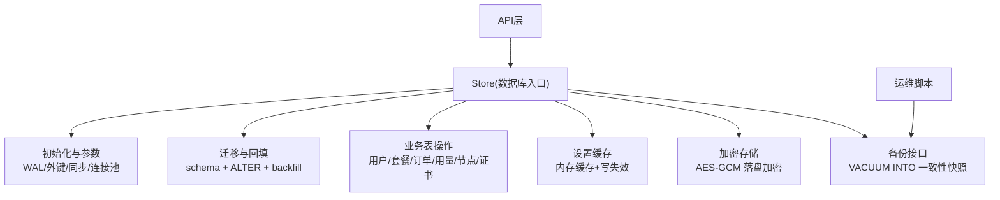
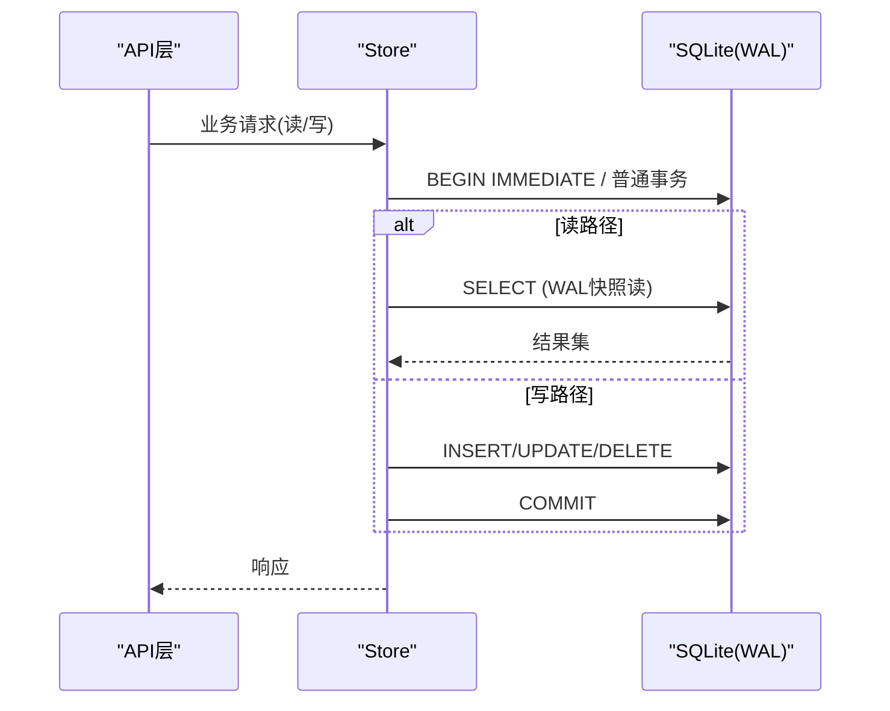
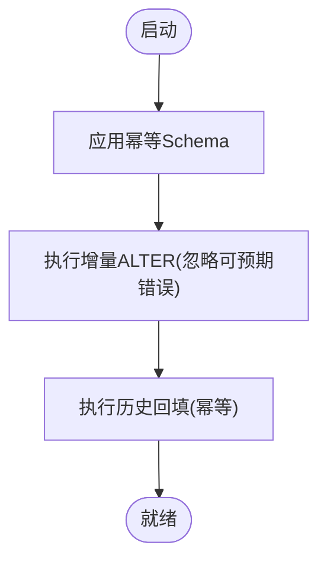
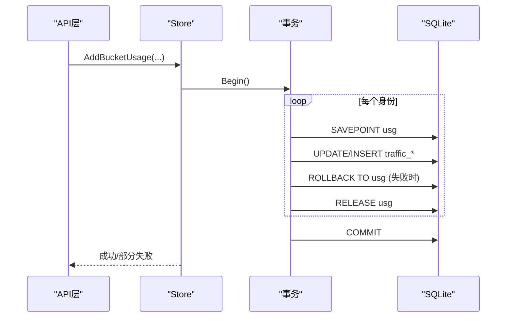
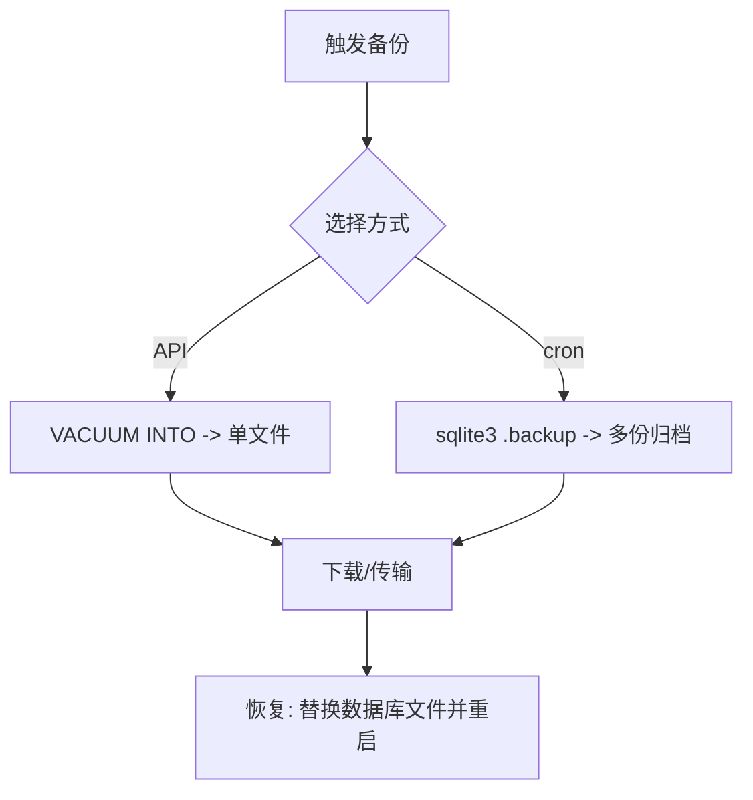
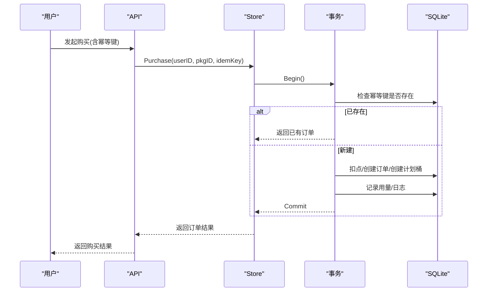
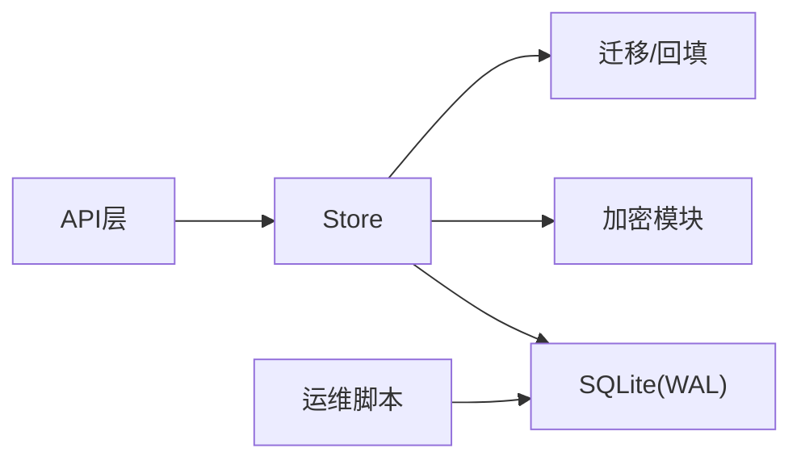

# 数据架构设计

<cite>
**本文引用的文件**
- [store.go](file://internal/store/store.go)
- [migrate.go](file://internal/store/migrate.go)
- [backup.go](file://internal/store/backup.go)
- [crypto.go](file://internal/store/crypto.go)
- [settings.go](file://internal/store/settings.go)
- [users.go](file://internal/store/users.go)
- [points.go](file://internal/store/points.go)
- [purchase.go](file://internal/store/purchase.go)
- [userplans.go](file://internal/store/userplans.go)
- [singbox.go](file://internal/store/singbox.go)
- [seed.go](file://internal/store/seed.go)
- [backup_admin.go](file://internal/api/backup_admin.go)
- [rollback.go](file://internal/updater/rollback.go)
- [backup.sh](file://deploy/backup.sh)
</cite>

## 目录
1. [简介](#简介)
2. [项目结构](#项目结构)
3. [核心组件](#核心组件)
4. [架构总览](#架构总览)
5. [详细组件分析](#详细组件分析)
6. [依赖关系分析](#依赖关系分析)
7. [性能考量](#性能考量)
8. [故障排查指南](#故障排查指南)
9. [结论](#结论)
10. [附录](#附录)

## 简介
本文件面向轻舟面板的数据层，系统性阐述基于 SQLite 的嵌入式数据库设计：WAL 模式与连接池、索引与查询优化、数据模型与完整性约束、迁移机制（版本管理、增量升级、回滚策略）、数据访问层（事务管理、缓存抽象）、备份恢复（全量/增量/导出导入），以及缓存策略。文末提供数据流图，帮助开发者理解创建、读取、更新、删除的完整路径。

## 项目结构
数据层位于 internal/store，围绕 Store 对象组织：
- 数据库初始化与参数配置（WAL、外键、同步级别、事务锁）
- 数据模型定义与迁移（DDL、增量 ALTER、回填）
- 业务表操作（用户、套餐、订单、用量、节点、证书等）
- 安全与加密（敏感字段落盘加密）
- 设置项内存缓存与失效
- 备份接口（VACUUM INTO 一致性快照）
- 启动种子数据（默认设置、管理员账户）

图表来源
- [store.go:27-57](file://internal/store/store.go#L27-L57)
- [migrate.go:532-743](file://internal/store/migrate.go#L532-L743)
- [backup.go:10-51](file://internal/store/backup.go#L10-L51)
- [settings.go:7-85](file://internal/store/settings.go#L7-L85)
- [crypto.go:17-77](file://internal/store/crypto.go#L17-L77)

章节来源
- [store.go:27-57](file://internal/store/store.go#L27-L57)
- [migrate.go:532-743](file://internal/store/migrate.go#L532-L743)
- [backup.go:10-51](file://internal/store/backup.go#L10-L51)
- [settings.go:7-85](file://internal/store/settings.go#L7-L85)
- [crypto.go:17-77](file://internal/store/crypto.go#L17-L77)

## 核心组件
- Store：SQLite 数据层入口，负责连接、参数、连接池、路径暴露、原始句柄暴露。
- 迁移器：幂等 schema 应用与增量 ALTER，附带历史数据回填。
- 设置缓存：读多写少的 settings 表内存缓存，写时失效。
- 加密器：对敏感设置与 TLS/证书等机密进行 AES-GCM 落盘加密。
- 备份器：通过 VACUUM INTO 生成一致的全量快照，避免 WAL 不一致拷贝。
- 业务模块：用户、订单、用量、节点、证书、计划桶等表的 CRUD 与复杂事务。

章节来源
- [store.go:10-71](file://internal/store/store.go#L10-L71)
- [migrate.go:532-743](file://internal/store/migrate.go#L532-L743)
- [settings.go:7-85](file://internal/store/settings.go#L7-L85)
- [crypto.go:17-77](file://internal/store/crypto.go#L17-L77)
- [backup.go:10-51](file://internal/store/backup.go#L10-L51)

## 架构总览
轻舟面板采用“单进程 + SQLite 嵌入式”架构，通过 WAL 提升并发读能力，使用小连接池避免嵌套调用死锁；所有变更在事务中完成，保证 ACID；关键路径（购买、用量统计、退款等）使用显式事务与幂等键；设置项走内存缓存；敏感数据落盘加密；备份通过 VACUUM INTO 获取一致快照。

图表来源
- [store.go:32-57](file://internal/store/store.go#L32-L57)
- [purchase.go:69-104](file://internal/store/purchase.go#L69-L104)

## 详细组件分析

### 1) SQLite 设计与调优
- WAL 模式：启用 journal_mode=WAL，允许一写多读，减少读阻塞。
- 外键与同步：开启 foreign_keys=1，synchronous=NORMAL 平衡安全与性能。
- 事务锁：_txlock=immediate 使 Begin() 立即获得写锁，避免读→写升级导致的 SQLITE_BUSY_SNAPSHOT。
- 连接池：MaxOpenConns/MaxIdleConns=8，避免嵌套调用在同一连接上死锁。
- busy_timeout：5000ms 缓解短暂竞争。

章节来源
- [store.go:32-57](file://internal/store/store.go#L32-L57)

### 2) 数据模型与完整性
- 核心实体：users、packages、orders、point_transactions、device_addons、email_tokens、nodes、node_groups、plan_groups、user_groups、package_user_groups、reg_codes、reg_code_user_groups、user_disabled_nodes、sessions、announcements、announcement_reads、node_sources、help_docs、sb_tls、certificates、sb_inbounds、sb_egresses、user_plans、plan_identities、traffic_samples、traffic_daily、servers、server_metrics、node_singbox、server_alerts。
- 主键/唯一性：大量 UNIQUE 约束（如 users.username、users.sub_token、sb_inbounds.tag、plan_identities.client_name 等）。
- 复合主键：node_group_members(node_id, group_id)、user_group_members(user_id, group_id)、traffic_daily(day, user_id, bucket_id) 等。
- 索引优化：针对高频查询列建立索引，如 idx_users_email、idx_orders_user、idx_traffic_samples_user_ts、idx_traffic_daily_user_day、idx_metrics_server_ts、idx_metrics_ts、idx_alerts_open 等。
- 数据完整性：通过外键约束（由引擎强制）与业务层校验共同保障；用量写入使用 UPSERT 合并，避免重复计数。

章节来源
- [migrate.go:10-530](file://internal/store/migrate.go#L10-L530)

### 3) 数据迁移机制
- 幂等 Schema：每次启动执行 CREATE TABLE IF NOT EXISTS，确保新库可用。
- 增量升级：ALTER TABLE ADD COLUMN 列表，忽略“重复列/不存在列”等可预期错误。
- 历史回填：backfillTrafficDaily、backfillFreeBuckets、backfillPlanIdentities、mergeDuplicatePlanBuckets、backfillCerts 等，保证升级后行为一致。
- 回滚策略：二进制级回滚支持（Linux），数据库不自动回滚；建议先备份再降级。

图表来源
- [migrate.go:532-743](file://internal/store/migrate.go#L532-L743)
- [rollback.go:85-192](file://internal/updater/rollback.go#L85-L192)

章节来源
- [migrate.go:532-743](file://internal/store/migrate.go#L532-L743)
- [rollback.go:85-192](file://internal/updater/rollback.go#L85-L192)

### 4) 数据访问层与事务管理
- 事务边界：购买、用量统计、退款等关键路径使用显式事务，失败时 Rollback。
- 幂等购买：idempotency_key + 唯一索引防止重复计费。
- 用量写入：使用 SAVEPOINT 逐桶隔离失败，最终统一提交。
- 设置缓存：settings 表读路径走内存缓存，写路径写库并失效缓存。

图表来源
- [userplans.go:1035-1075](file://internal/store/userplans.go#L1035-L1075)
- [purchase.go:69-104](file://internal/store/purchase.go#L69-L104)
- [points.go:41-87](file://internal/store/points.go#L41-L87)

章节来源
- [userplans.go:1035-1075](file://internal/store/userplans.go#L1035-L1075)
- [purchase.go:69-104](file://internal/store/purchase.go#L69-L104)
- [points.go:41-87](file://internal/store/points.go#L41-L87)
- [settings.go:7-85](file://internal/store/settings.go#L7-L85)

### 5) 备份与恢复
- 全量备份：BackupTo 使用 VACUUM INTO 生成单一自包含文件，内部读事务保证一致性，不影响读写。
- 在线热备：deploy/backup.sh 使用 sqlite3 .backup 定时备份，保留7天。
- 导出/导入：VACUUM INTO 产物可直接作为导入源；也可结合外部工具导出 SQL（仓库未实现）。
- 恢复建议：停止服务或冷备恢复；生产环境优先用 VACUUM INTO 产物。

图表来源
- [backup.go:10-51](file://internal/store/backup.go#L10-L51)
- [backup_admin.go:33-76](file://internal/api/backup_admin.go#L33-L76)
- [backup.sh:1-15](file://deploy/backup.sh#L1-L15)

章节来源
- [backup.go:10-51](file://internal/store/backup.go#L10-L51)
- [backup_admin.go:33-76](file://internal/api/backup_admin.go#L33-L76)
- [backup.sh:1-15](file://deploy/backup.sh#L1-L15)

### 6) 缓存策略
- 内存缓存：settings 表全量加载到 map，读路径无 IO；写路径写库并置空缓存以失效。
- 分布式缓存：当前代码未引入 Redis/Memcached 等分布式缓存。
- 失效机制：写操作后立即 invalidateSettingsCache，保证强一致。

章节来源
- [settings.go:7-85](file://internal/store/settings.go#L7-L85)

### 7) 安全与加密
- 敏感设置：smtp_pass、cf_api_token 等按白名单加密存储。
- TLS/证书：sb_tls.server_json、certificates.cert_pem/key_pem 等落盘加密，读取失败必须拒绝下发明文配置。
- 密钥管理：SetSecretKey 派生 AES 密钥；CountUndecryptableSecrets 用于启动自检。

章节来源
- [crypto.go:17-77](file://internal/store/crypto.go#L17-L77)
- [singbox.go:15-38](file://internal/store/singbox.go#L15-L38)

### 8) 数据流图（CRUD 全过程）
以下序列图展示典型“购买”流程中的创建、读取、更新、删除（幂等去重）路径。

图表来源
- [purchase.go:69-104](file://internal/store/purchase.go#L69-L104)
- [userplans.go:1035-1075](file://internal/store/userplans.go#L1035-L1075)

## 依赖关系分析
- Store 依赖 database/sql 与 modernc.org/sqlite 驱动。
- 业务模块（users、points、purchase、userplans）直接依赖 Store 提供的 db 句柄与事务。
- API 层通过 Store 暴露备份、设置、业务操作。
- 运维脚本通过 sqlite3 命令行进行热备。

图表来源
- [store.go:1-71](file://internal/store/store.go#L1-L71)
- [backup.sh:1-15](file://deploy/backup.sh#L1-L15)

章节来源
- [store.go:1-71](file://internal/store/store.go#L1-L71)
- [backup.sh:1-15](file://deploy/backup.sh#L1-L15)

## 性能考量
- 读多写少场景：WAL 模式 + 连接池，提高并发读吞吐。
- 热点表索引：为高频过滤列建立索引（如 users.email、orders.user_id、traffic_samples/user_id,ts、traffic_daily/user_id,day、server_metrics/ts 等）。
- 批量写入：用量统计使用 SAVEPOINT 隔离失败，降低整体失败概率。
- 设置缓存：settings 表读路径零 IO，写路径仅一次写库+失效。
- 同步级别：synchronous=NORMAL 在可靠性与性能间折中。

[本节为通用指导，无需具体文件引用]

## 故障排查指南
- 备份不可用：确认 BackupTo 目标路径不存在且可写；若失败会清理半写文件。
- 解密失败：启动时 CountUndecryptableSecrets > 0 表示密钥变化或数据损坏，需修复密钥或恢复备份。
- 迁移异常：关注 migrate 日志中语句失败信息；可预期错误会被忽略，其他错误需修正。
- 用量统计异常：检查 traffic_samples/traffic_daily 写入是否成功，确认 SAVEPOINT 回滚逻辑。
- 回滚失败：确认 Linux 平台且保留的二进制存在并通过校验；否则需手动替换。

章节来源
- [backup.go:28-51](file://internal/store/backup.go#L28-L51)
- [crypto.go:79-121](file://internal/store/crypto.go#L79-L121)
- [migrate.go:690-705](file://internal/store/migrate.go#L690-L705)
- [userplans.go:1035-1075](file://internal/store/userplans.go#L1035-L1075)
- [rollback.go:85-192](file://internal/updater/rollback.go#L85-L192)

## 结论
轻舟面板数据层以 SQLite 为核心，借助 WAL、索引与事务控制，实现了高内聚、低耦合的数据访问层。通过幂等迁移与回填保证平滑升级，通过 VACUUM INTO 与 cron 热备保障数据安全，通过内存缓存与加密增强性能与安全。建议在扩展新功能时遵循现有模式：明确事务边界、完善索引、保持迁移幂等、提供备份与回滚能力。

[本节为总结性内容，无需具体文件引用]

## 附录
- 初始种子：首次启动写入默认设置与管理员账户（幂等）。
- 设置项：GetSetting/SetSetting 系列方法提供类型化访问。
- 用户与凭据：RotateNodeCredentials 提供冷却期保护，避免频繁切换导致大规模重连。

章节来源
- [seed.go:22-101](file://internal/store/seed.go#L22-L101)
- [settings.go:7-139](file://internal/store/settings.go#L7-L139)
- [users.go:167-200](file://internal/store/users.go#L167-L200)
