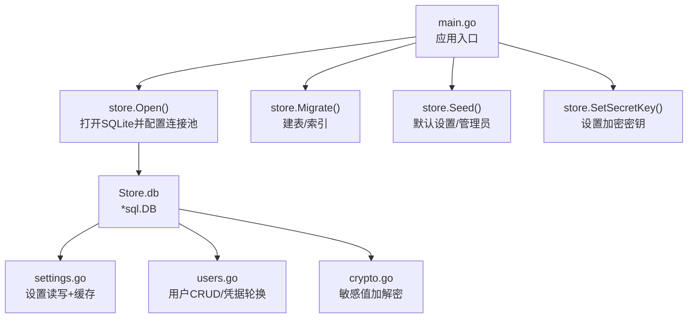
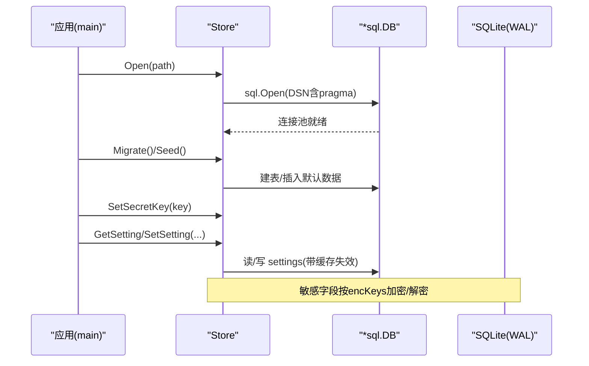
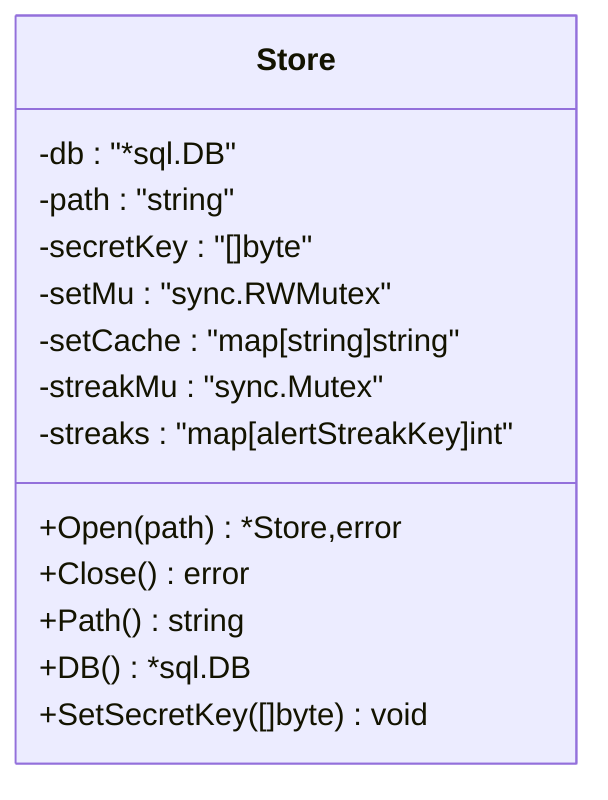
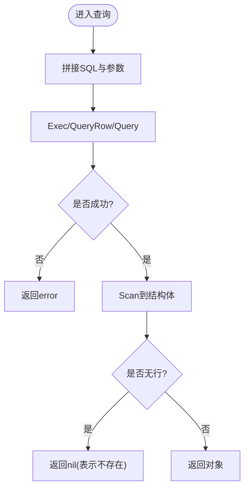
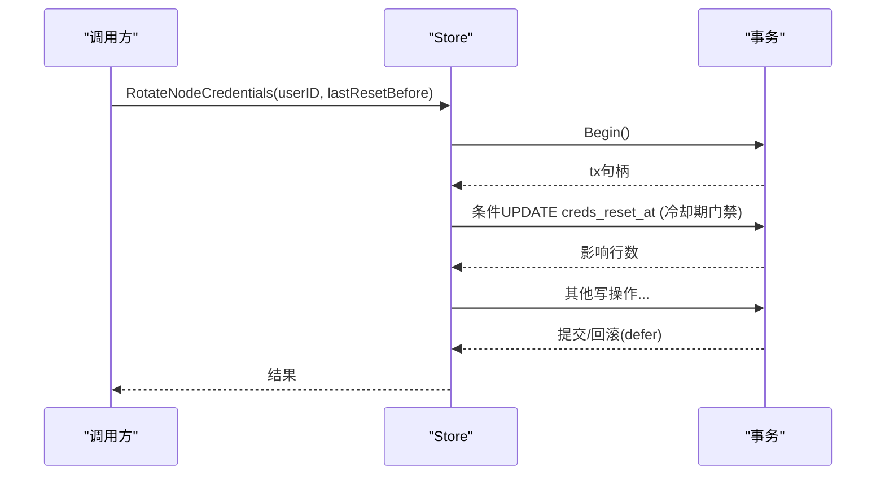
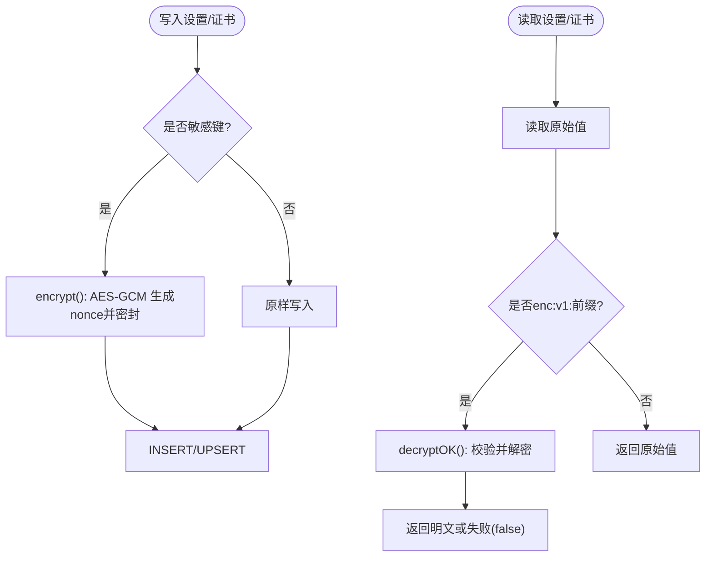
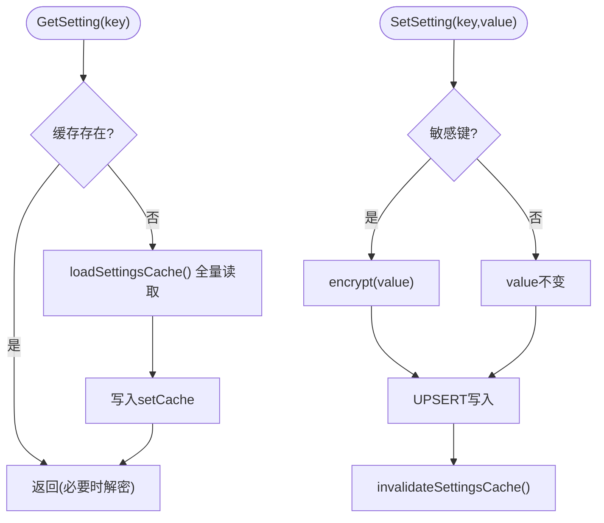
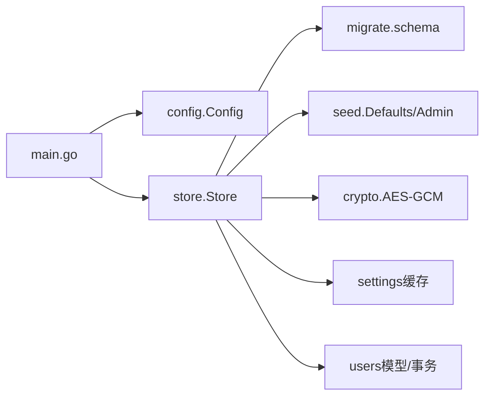

# 数据访问层

<cite>
**本文引用的文件**
- [store.go](file://internal/store/store.go)
- [crypto.go](file://internal/store/crypto.go)
- [settings.go](file://internal/store/settings.go)
- [users.go](file://internal/store/users.go)
- [migrate.go](file://internal/store/migrate.go)
- [seed.go](file://internal/store/seed.go)
- [config.go](file://internal/config/config.go)
- [main.go](file://main.go)
</cite>

## 目录
1. [简介](#简介)
2. [项目结构](#项目结构)
3. [核心组件](#核心组件)
4. [架构总览](#架构总览)
5. [详细组件分析](#详细组件分析)
6. [依赖关系分析](#依赖关系分析)
7. [性能考量](#性能考量)
8. [故障排查指南](#故障排查指南)
9. [结论](#结论)
10. [附录：CRUD 示例与最佳实践](#附录crud-示例与最佳实践)

## 简介
本文件面向轻舟面板的数据访问层，聚焦 Store 结构体及其周边能力：数据库连接管理、事务处理、错误处理机制；ORM 抽象（模型映射、查询构建、批量操作）；事务管理机制（自动/嵌套/回滚策略）；加密存储（敏感字段加密、密钥管理、安全传输）；连接池配置；缓存策略（内存缓存、失效与一致性）；并提供典型 CRUD 用法与优化建议。

## 项目结构
数据访问层位于 internal/store，围绕 SQLite 提供统一的数据访问入口 Store，并通过迁移、种子数据、设置缓存与加密等模块完善功能。应用启动时由 main 初始化 Store、执行迁移与种子数据、加载加密密钥并注入 API 层。

**图示来源**
- [main.go:25-80](file://main.go#L25-L80)
- [store.go:27-57](file://internal/store/store.go#L27-L57)
- [settings.go:7-85](file://internal/store/settings.go#L7-L85)
- [users.go:76-165](file://internal/store/users.go#L76-L165)
- [crypto.go:17-77](file://internal/store/crypto.go#L17-L77)

**章节来源**
- [main.go:25-80](file://main.go#L25-L80)
- [store.go:27-57](file://internal/store/store.go#L27-L57)

## 核心组件
- Store 结构体：封装 *sql.DB、数据库路径、加密密钥、设置缓存、连续观测计数器等。
- 连接与连接池：通过 DSN 启用 WAL、外键、同步级别与 _txlock=immediate；最大并发与空闲连接均为 8。
- ORM 抽象：以 Go 结构体映射表（如 User），使用原生 SQL 与扫描器进行映射；查询构建集中在各方法内；批量操作通过 Exec 与多次插入实现。
- 事务管理：显式 db.Begin() 配合 defer Rollback() 的失败回退；关键写路径采用“先占位后更新”的原子条件更新避免竞态。
- 错误处理：统一返回 error；读取空行返回 nil 结果；对不可恢复错误直接上抛；加密失败路径保守返回空串或 false，防止明文泄露。
- 加密存储：AES-GCM 对敏感设置（如 smtp_pass、cf_api_token）及证书/密钥进行落盘加密；支持从环境变量 QZ_SECRET_KEY 或 jwt_secret 派生密钥；提供 CountUndecryptableSecrets 自检。
- 缓存策略：settings 表全量读入内存 map，写时失效；读写并发通过 RWMutex 保护。

**章节来源**
- [store.go:10-70](file://internal/store/store.go#L10-L70)
- [settings.go:7-139](file://internal/store/settings.go#L7-L139)
- [crypto.go:12-130](file://internal/store/crypto.go#L12-L130)
- [users.go:22-165](file://internal/store/users.go#L22-L165)

## 架构总览
整体数据流：API 调用 → Store 方法 → sql.DB → SQLite（WAL + 外键 + IMMEDIATE 事务锁）。敏感数据在写入前加密、读取时解密；设置频繁读取走内存缓存；跨进程/协程并发通过连接池与事务锁控制。

**图示来源**
- [main.go:25-80](file://main.go#L25-L80)
- [store.go:27-57](file://internal/store/store.go#L27-L57)
- [settings.go:7-85](file://internal/store/settings.go#L7-L85)
- [crypto.go:17-77](file://internal/store/crypto.go#L17-L77)

## 详细组件分析

### Store 结构与连接管理
- 职责：持有 *sql.DB、数据库路径、加密密钥、设置缓存、连续观测计数器。
- 连接池：SetMaxOpenConns(8)、SetMaxIdleConns(8)，避免单连接嵌套读死锁；WAL 允许一写多读。
- DSN Pragma：busy_timeout(5000)、journal_mode(WAL)、foreign_keys(1)、synchronous(NORMAL)、_txlock=immediate。
- 生命周期：Open 创建并 Ping 验证；Close 关闭底层连接；Path/DB 暴露只读视图供上层使用。

**图示来源**
- [store.go:10-70](file://internal/store/store.go#L10-L70)

**章节来源**
- [store.go:10-70](file://internal/store/store.go#L10-L70)

### ORM 抽象层（模型映射、查询构建、批量操作）
- 模型映射：Go 结构体与表字段一一映射（例如 User 对应 users 表），通过 scanUser 统一 Scan 与空行处理。
- 查询构建：在各方法中拼接列名常量与 WHERE 条件，参数化绑定防注入。
- 批量操作：通过多次 Exec 或循环插入实现；复杂事务内组合多条语句保证一致性。

**图示来源**
- [users.go:58-86](file://internal/store/users.go#L58-L86)

**章节来源**
- [users.go:22-121](file://internal/store/users.go#L22-L121)

### 事务管理机制（自动事务、嵌套事务、回滚策略）
- 自动事务：通过 _txlock=immediate，Begin() 即获取写锁，减少读→写升级导致的 SQLITE_BUSY_SNAPSHOT。
- 嵌套事务：WAL + 多连接池允许在事务内再次读取（例如回调中查库），避免单连接死锁。
- 回滚策略：defer tx.Rollback() 确保异常路径回滚；关键写路径使用“条件更新”作为原子门禁（如凭据轮换冷却期）。

**图示来源**
- [users.go:191-200](file://internal/store/users.go#L191-L200)

**章节来源**
- [users.go:191-200](file://internal/store/users.go#L191-L200)

### 加密存储机制（敏感数据、密钥管理、安全传输）
- 敏感字段：smtp_pass、cf_api_token 以及 sing-box TLS/Reality 证书与私钥等，写入前加密、读取时解密。
- 密钥管理：优先使用环境变量 QZ_SECRET_KEY；未设置则回退到 jwt_secret；SHA256 派生 AES 密钥。
- 安全传输：GCM 模式提供认证加密；解密失败严格返回空串或 false，绝不降级为明文。
- 自检：CountUndecryptableSecrets 统计无法解密的密文数量，启动时告警。

**图示来源**
- [crypto.go:17-77](file://internal/store/crypto.go#L17-L77)
- [settings.go:73-85](file://internal/store/settings.go#L73-L85)

**章节来源**
- [crypto.go:17-130](file://internal/store/crypto.go#L17-L130)
- [settings.go:73-85](file://internal/store/settings.go#L73-L85)
- [main.go:51-71](file://main.go#L51-L71)

### 连接池配置（最大连接数、空闲连接、超时）
- 最大连接数：8（适合小单机部署，兼顾事务内回调读）。
- 空闲连接：8（降低冷启动开销）。
- 超时：busy_timeout(5000ms) 控制写锁等待；WAL 模式下读者不阻塞写者。
- 同步级别：NORMAL 平衡性能与安全。

**章节来源**
- [store.go:27-57](file://internal/store/store.go#L27-L57)

### 缓存策略（内存缓存、失效、一致性）
- 缓存内容：settings 表全部 key/value 原始值（含密文）。
- 加载时机：首次读取时全量加载至 setCache。
- 失效策略：任何写操作（SetSetting/setSettingIfAbsent）后清空缓存，下次读取重新加载。
- 并发安全：RWMutex 保护读与懒加载；写时使用互斥锁。

**图示来源**
- [settings.go:7-85](file://internal/store/settings.go#L7-L85)

**章节来源**
- [settings.go:7-85](file://internal/store/settings.go#L7-L85)

## 依赖关系分析
- main 依赖 config 获取监听地址与数据库路径；依赖 store 完成初始化、迁移、种子、密钥设置。
- store 内部：
  - migrate 定义 schema（settings、users、packages、orders 等）。
  - seed 写入默认设置与管理员账户。
  - crypto 提供加解密工具。
  - settings 提供设置读写与缓存。
  - users 提供用户相关 CRUD 与凭据轮换。

**图示来源**
- [main.go:25-80](file://main.go#L25-L80)
- [config.go:5-29](file://internal/config/config.go#L5-L29)
- [migrate.go:10-200](file://internal/store/migrate.go#L10-L200)
- [seed.go:22-100](file://internal/store/seed.go#L22-L100)
- [crypto.go:17-77](file://internal/store/crypto.go#L17-L77)
- [settings.go:7-85](file://internal/store/settings.go#L7-L85)
- [users.go:22-165](file://internal/store/users.go#L22-L165)

**章节来源**
- [main.go:25-80](file://main.go#L25-L80)
- [config.go:5-29](file://internal/config/config.go#L5-L29)
- [migrate.go:10-200](file://internal/store/migrate.go#L10-L200)
- [seed.go:22-100](file://internal/store/seed.go#L22-L100)

## 性能考量
- 使用 WAL 提升并发读性能，配合 busy_timeout 缓解写竞争。
- 连接池大小适中（8），避免单连接嵌套读死锁。
- settings 全量缓存减少高频读压力；写时失效保证一致性。
- 参数化查询与索引（如 users.email、orders.user_id 等）提升查询效率。
- 批量写尽量合并为单次事务以减少往返。

## 故障排查指南
- 无法解密敏感设置：检查 QZ_SECRET_KEY 是否与写入时一致；使用 CountUndecryptableSecrets 统计受影响条目。
- 购买/退款等流程偶发 SQLITE_BUSY：确认已启用 _txlock=immediate 与 WAL；必要时增大 busy_timeout。
- 节点凭据轮换被拒绝：确认冷却期逻辑（creds_reset_at）与传入的 lastResetBefore 参数。
- 启动时报 jwt secret 缺失：确认 Seed 已正确写入 jwt_secret。

**章节来源**
- [crypto.go:79-130](file://internal/store/crypto.go#L79-L130)
- [store.go:27-57](file://internal/store/store.go#L27-L57)
- [users.go:167-200](file://internal/store/users.go#L167-L200)
- [main.go:51-71](file://main.go#L51-L71)

## 结论
轻舟面板的数据访问层以 Store 为核心，结合 SQLite 的 WAL 与连接池、严格的加密策略与设置缓存，提供了高可用、高性能且安全的持久化能力。通过显式事务与条件更新保障关键业务的一致性，同时保持实现简洁、可维护性强。

## 附录：CRUD 示例与最佳实践
以下示例仅描述调用方式与注意事项，具体代码位置见“章节来源”。

- 创建用户
  - 调用：CreateUser(NewUser{...})
  - 要点：role 默认 user；时间戳使用当前 Unix；错误直接返回。
  - 参考路径：[users.go:92-121](file://internal/store/users.go#L92-L121)

- 查询用户
  - 调用：UserByUsername / UserByID / UserByEmail / UserBySubToken
  - 要点：scanUser 将空行转为 nil；错误透传。
  - 参考路径：[users.go:58-90](file://internal/store/users.go#L58-L90)

- 更新设置（含敏感字段）
  - 调用：SetSetting("smtp_pass", "...")
  - 要点：敏感键自动加密；写后失效缓存。
  - 参考路径：[settings.go:73-85](file://internal/store/settings.go#L73-L85)

- 读取设置（自动解密）
  - 调用：GetSetting("smtp_pass")
  - 要点：命中缓存则直接返回；敏感键解密。
  - 参考路径：[settings.go:7-22](file://internal/store/settings.go#L7-L22)

- 凭据轮换（事务+冷却期）
  - 调用：RotateNodeCredentials(userID, lastResetBefore)
  - 要点：Begin 后立即条件更新 creds_reset_at 作为门禁；失败回滚。
  - 参考路径：[users.go:167-200](file://internal/store/users.go#L167-L200)

- 初始化与密钥
  - 调用：Open/Migrate/Seed/SetSecretKey
  - 要点：DSN 包含必要 pragma；QZ_SECRET_KEY 优先于 jwt_secret。
  - 参考路径：[store.go:27-57](file://internal/store/store.go#L27-L57), [seed.go:22-100](file://internal/store/seed.go#L22-L100), [main.go:51-71](file://main.go#L51-L71)

- 性能优化建议
  - 批量写放入同一事务；避免在事务内进行耗时外部调用。
  - 利用索引列（如 email、user_id）进行过滤。
  - 合理设置连接池与 busy_timeout，监控慢查询。

**章节来源**
- [users.go:58-121](file://internal/store/users.go#L58-L121)
- [users.go:167-200](file://internal/store/users.go#L167-L200)
- [settings.go:7-85](file://internal/store/settings.go#L7-L85)
- [store.go:27-57](file://internal/store/store.go#L27-L57)
- [seed.go:22-100](file://internal/store/seed.go#L22-L100)
- [main.go:51-71](file://main.go#L51-L71)
