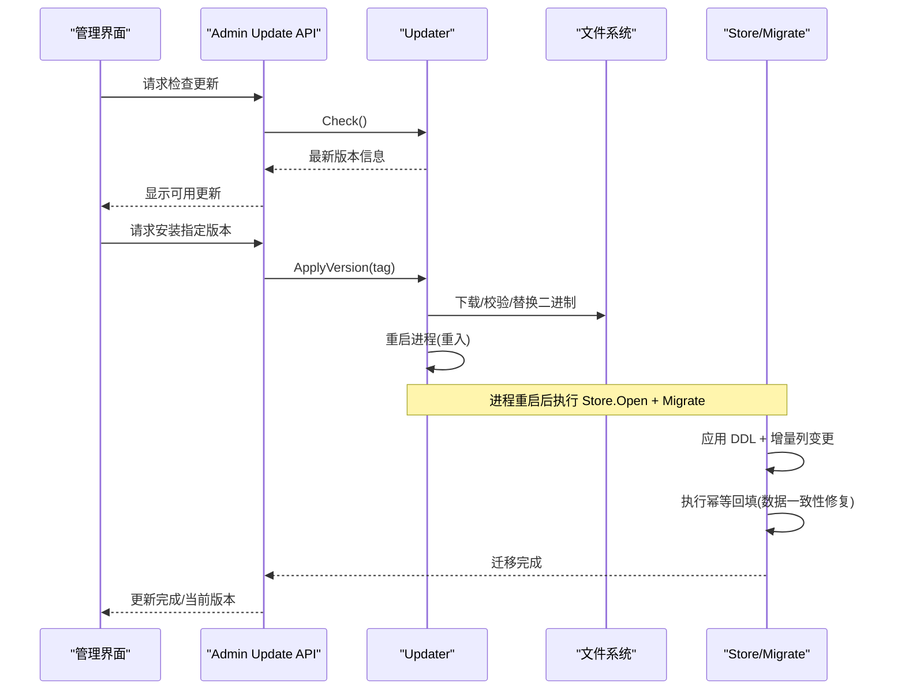
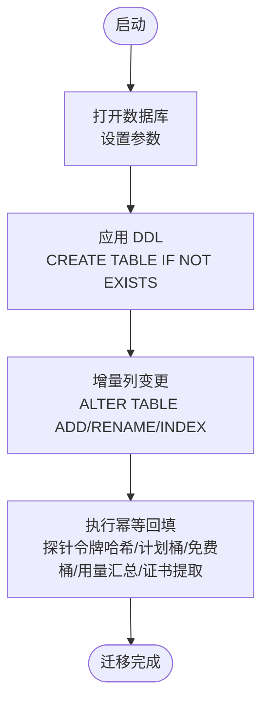
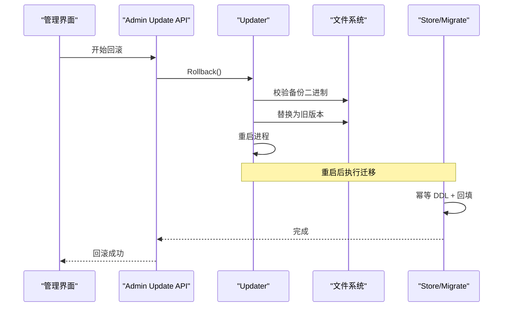
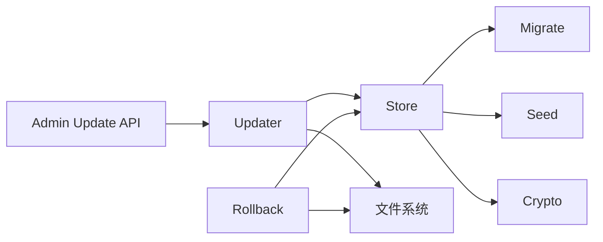

# 数据迁移

<cite>
**本文引用的文件**
- [internal/store/migrate.go](file://internal/store/migrate.go)
- [internal/store/seed.go](file://internal/store/seed.go)
- [internal/store/store.go](file://internal/store/store.go)
- [internal/store/crypto.go](file://internal/store/crypto.go)
- [internal/updater/updater.go](file://internal/updater/updater.go)
- [internal/updater/rollback.go](file://internal/updater/rollback.go)
- [internal/api/update_admin.go](file://internal/api/update_admin.go)
</cite>

## 目录
1. [简介](#简介)
2. [项目结构](#项目结构)
3. [核心组件](#核心组件)
4. [架构总览](#架构总览)
5. [详细组件分析](#详细组件分析)
6. [依赖关系分析](#依赖关系分析)
7. [性能考量](#性能考量)
8. [故障排查指南](#故障排查指南)
9. [结论](#结论)
10. [附录：迁移脚本编写规范与示例](#附录：迁移脚本编写规范与示例)

## 简介
本文件面向轻舟面板的数据迁移系统，系统性说明版本管理、增量升级、回滚策略、种子数据管理、执行流程（依赖检查、事务保护、错误恢复）、状态跟踪（已执行记录、失败重试、进度监控），并提供常见场景的迁移脚本示例与最佳实践。该系统的目标是确保在面板自更新过程中，数据库结构与历史数据能够安全、可重复地演进，并在异常时具备可靠的恢复能力。

## 项目结构
- 数据层位于 internal/store，负责 SQLite 数据库连接、迁移与种子数据初始化。
- 更新与回滚逻辑位于 internal/updater，提供二进制下载、校验、替换与重启，以及本地回滚能力。
- 管理端 API 位于 internal/api，暴露更新检查、安装、回滚等接口供前端调用。
- 前端 AdminUpdate 页面用于触发更新与回滚操作并展示进度。

```mermaid
graph TB
subgraph "数据层"
Store["Store<br/>SQLite 连接与配置"]
Migrate["Migrate()<br/>DDL + 增量列变更 + 数据回填"]
Seed["Seed()<br/>默认设置/管理员账户"]
Crypto["加密/解密<br/>敏感字段存储"]
end
subgraph "更新与回滚"
Updater["Updater Manager<br/>下载/校验/替换/重启"]
Rollback["Rollback<br/>本地二进制回滚"]
end
subgraph "API"
API["Admin Update API<br/>检查/安装/回滚/状态"]
end
Store --> Migrate
Store --> Seed
Store --> Crypto
API --> Updater
API --> Rollback
Updater --> Store
Rollback --> Store
```

图表来源
- [internal/store/store.go:27-57](file://internal/store/store.go#L27-L57)
- [internal/store/migrate.go:532-743](file://internal/store/migrate.go#L532-L743)
- [internal/store/seed.go:22-100](file://internal/store/seed.go#L22-L100)
- [internal/updater/updater.go:368-576](file://internal/updater/updater.go#L368-L576)
- [internal/updater/rollback.go:47-131](file://internal/updater/rollback.go#L47-L131)
- [internal/api/update_admin.go:13-116](file://internal/api/update_admin.go#L13-L116)

章节来源
- [internal/store/store.go:27-57](file://internal/store/store.go#L27-L57)
- [internal/store/migrate.go:532-743](file://internal/store/migrate.go#L532-L743)
- [internal/store/seed.go:22-100](file://internal/store/seed.go#L22-L100)
- [internal/updater/updater.go:368-576](file://internal/updater/updater.go#L368-L576)
- [internal/updater/rollback.go:47-131](file://internal/updater/rollback.go#L47-L131)
- [internal/api/update_admin.go:13-116](file://internal/api/update_admin.go#L13-L116)

## 核心组件
- 数据库连接与参数：使用 SQLite，开启 WAL、外键约束、busy_timeout，采用立即锁定模式避免读后写导致的锁冲突。
- 迁移入口：每次启动执行 DDL 与增量列变更，随后运行一系列幂等的“数据回填”任务，保证旧库平滑升级到新模型。
- 种子数据：首次启动写入默认配置、JWT 密钥与管理员账户；若未配置管理员密码则生成随机密码并返回给调用方。
- 更新与回滚：支持从 GitHub 下载新版本，校验摘要与签名，原子替换二进制并重启；保留上一版本以便回滚。
- 加密存储：对敏感设置进行 AES-GCM 加密存储，支持检测不可解密条目以保障安全。

章节来源
- [internal/store/store.go:27-57](file://internal/store/store.go#L27-L57)
- [internal/store/migrate.go:532-743](file://internal/store/migrate.go#L532-L743)
- [internal/store/seed.go:22-100](file://internal/store/seed.go#L22-L100)
- [internal/updater/updater.go:368-576](file://internal/updater/updater.go#L368-L576)
- [internal/updater/rollback.go:47-131](file://internal/updater/rollback.go#L47-L131)
- [internal/store/crypto.go:17-130](file://internal/store/crypto.go#L17-L130)

## 架构总览
轻舟面板的“数据迁移”并非传统意义上的按版本号顺序执行的脚本集合，而是采用“幂等 DDL + 增量列变更 + 幂等数据回填”的组合策略。每次启动都会尝试应用 schema 与 ALTER 语句，并对历史数据进行一次性或持续性的补齐与转换。配合二进制层面的自更新与回滚机制，形成“应用层迁移 + 进程级回滚”的双重保障。



图表来源
- [internal/api/update_admin.go:13-116](file://internal/api/update_admin.go#L13-L116)
- [internal/updater/updater.go:368-576](file://internal/updater/updater.go#L368-L576)
- [internal/store/store.go:27-57](file://internal/store/store.go#L27-L57)
- [internal/store/migrate.go:532-743](file://internal/store/migrate.go#L532-L743)

## 详细组件分析

### 迁移版本管理机制
- 版本控制方式：不维护显式的“迁移版本号表”，而是通过“幂等 DDL + 增量列变更”实现向前兼容。每次启动都尝试创建表与索引，ALTER 语句对已存在的列会忽略错误（如“重复列名”）。
- 增量升级：通过一系列 ALTER TABLE 添加新列、重命名列、创建索引，并在后续步骤中执行数据回填，将旧模型映射到新模型。
- 回滚策略：数据库层面不做自动回滚；二进制层面保留上一个版本，支持一键回滚到之前的二进制。降级时明确提示“数据库不会回滚”。

章节来源
- [internal/store/migrate.go:532-743](file://internal/store/migrate.go#L532-L743)
- [internal/updater/updater.go:368-576](file://internal/updater/updater.go#L368-L576)
- [internal/updater/rollback.go:47-131](file://internal/updater/rollback.go#L47-L131)
- [frontend/src/views/AdminUpdate.vue:279-313](file://frontend/src/views/AdminUpdate.vue#L279-L313)

### 迁移脚本编写规范
- 向前迁移：所有 DDL 与数据变更必须幂等，允许重复执行而不改变最终状态。例如使用 CREATE TABLE IF NOT EXISTS、ADD COLUMN IF NOT EXISTS（通过捕获特定错误实现）、UPDATE ... WHERE 条件限定。
- 向后兼容：新增列需有合理默认值；对旧列的重命名要同时处理新旧列共存期的读取逻辑；对历史数据的转换应放在独立的回填函数中，避免影响热路径。
- 数据转换逻辑：将复杂转换拆分为独立函数（如 backfillTrafficDaily、backfillFreeBuckets、backfillPlanIdentities、backfillCerts），每个函数内部保证只写入缺失或不一致的数据，且可安全重跑。

章节来源
- [internal/store/migrate.go:532-743](file://internal/store/migrate.go#L532-L743)
- [internal/store/migrate.go:745-841](file://internal/store/migrate.go#L745-L841)
- [internal/store/certs.go:166-216](file://internal/store/certs.go#L166-L216)

### 种子数据管理
- 初始数据注入：首次启动写入默认设置项（注册开关、邮件验证、默认流量/有效期/设备限制、积分规则、退款策略等）与 JWT 密钥；若无管理员账户则创建默认管理员。
- 环境区分：管理员密码可通过环境变量配置；若未配置则生成随机密码并返回给调用方，便于自动化部署获取。
- 数据清理策略：种子数据为幂等写入，不会覆盖已有值；管理员账户仅在不存在时创建，避免重复初始化。

章节来源
- [internal/store/seed.go:22-100](file://internal/store/seed.go#L22-L100)

### 迁移执行流程
- 依赖检查：Open 阶段设置 SQLite 参数（WAL、外键、busy_timeout、立即锁定），确保并发读写与事务行为符合预期。
- 事务保护：业务逻辑普遍使用事务（Begin/Rollback/Commit），迁移本身通过幂等语句规避部分场景的事务需求；但涉及多表一致性时应使用事务包裹。
- 错误恢复：迁移中对“重复列名/无此列/无此表”的错误视为正常继续；其他错误记录日志并返回；更新过程在下载、校验、替换、重启各阶段均有错误分支与回退逻辑。

章节来源
- [internal/store/store.go:27-57](file://internal/store/store.go#L27-L57)
- [internal/store/migrate.go:691-704](file://internal/store/migrate.go#L691-L704)
- [internal/updater/updater.go:418-576](file://internal/updater/updater.go#L418-L576)

### 迁移状态跟踪
- 已执行记录：未维护显式迁移版本表，依赖幂等性保证重复执行的安全。
- 失败重试：更新流程支持失败后重试；回滚流程可在无网络情况下恢复至上一二进制。
- 进度监控：更新过程暴露状态接口（下载/校验/安装/重启/失败），前端轮询显示百分比与消息。

章节来源
- [internal/updater/updater.go:43-62](file://internal/updater/updater.go#L43-L62)
- [internal/api/update_admin.go:30-47](file://internal/api/update_admin.go#L30-L47)
- [internal/updater/rollback.go:47-131](file://internal/updater/rollback.go#L47-L131)

### 关键流程图示

#### 迁移主流程


图表来源
- [internal/store/store.go:27-57](file://internal/store/store.go#L27-L57)
- [internal/store/migrate.go:532-743](file://internal/store/migrate.go#L532-L743)

#### 更新与回滚序列


图表来源
- [internal/api/update_admin.go:92-116](file://internal/api/update_admin.go#L92-L116)
- [internal/updater/rollback.go:74-131](file://internal/updater/rollback.go#L74-L131)
- [internal/store/migrate.go:532-743](file://internal/store/migrate.go#L532-L743)

## 依赖关系分析
- Store 依赖 SQLite 驱动与 DSN 参数，确保 WAL 与外键约束生效。
- Migrate 依赖 Store.DB 执行 SQL，并通过多个 backfill 函数完成数据一致性修复。
- Updater 依赖文件系统与网络，负责二进制生命周期管理；其状态由 API 暴露给前端。
- Seed 依赖 Store 的设置与用户表，确保首次启动的环境就绪。
- Crypto 依赖 Store 的密钥设置，提供敏感字段的加解密能力。



图表来源
- [internal/store/store.go:27-57](file://internal/store/store.go#L27-L57)
- [internal/store/migrate.go:532-743](file://internal/store/migrate.go#L532-L743)
- [internal/store/seed.go:22-100](file://internal/store/seed.go#L22-L100)
- [internal/store/crypto.go:17-130](file://internal/store/crypto.go#L17-L130)
- [internal/updater/updater.go:368-576](file://internal/updater/updater.go#L368-L576)
- [internal/updater/rollback.go:47-131](file://internal/updater/rollback.go#L47-L131)
- [internal/api/update_admin.go:13-116](file://internal/api/update_admin.go#L13-L116)

章节来源
- [internal/store/store.go:27-57](file://internal/store/store.go#L27-L57)
- [internal/store/migrate.go:532-743](file://internal/store/migrate.go#L532-L743)
- [internal/store/seed.go:22-100](file://internal/store/seed.go#L22-L100)
- [internal/store/crypto.go:17-130](file://internal/store/crypto.go#L17-L130)
- [internal/updater/updater.go:368-576](file://internal/updater/updater.go#L368-L576)
- [internal/updater/rollback.go:47-131](file://internal/updater/rollback.go#L47-L131)
- [internal/api/update_admin.go:13-116](file://internal/api/update_admin.go#L13-L116)

## 性能考量
- SQLite 参数优化：WAL 提升并发读能力；busy_timeout 降低短暂拥塞时的失败率；立即锁定减少读后写升级锁的风险。
- 迁移幂等性：避免重复扫描与全表更新，使用条件插入与选择性回填，减少迁移耗时。
- 热点索引：为高频查询创建必要索引（如用户客户端名、节点来源、服务器 ID、告警开放集等），提升统计与列表查询性能。
- 更新下载限速与体积限制：防止超大资产导致内存或磁盘压力。

章节来源
- [internal/store/store.go:27-57](file://internal/store/store.go#L27-L57)
- [internal/store/migrate.go:583-589](file://internal/store/migrate.go#L583-L589)
- [internal/updater/updater.go:615-658](file://internal/updater/updater.go#L615-L658)

## 故障排查指南
- 迁移失败定位：查看迁移日志中的语句失败记录；确认是否为“重复列名/无此列/无此表”的良性错误；若非此类错误，需检查 SQL 语法与依赖表是否存在。
- 更新失败处理：检查下载与校验阶段错误；若签名或摘要不匹配，拒绝安装；若重启失败，自动回滚到上一版本并提示手动重启。
- 回滚不可用：确认 Linux 平台与备份二进制存在；若备份损坏，需手动恢复。
- 敏感字段解密失败：使用 CountUndecryptableSecrets 检查不可解密条目数量；若非零，检查 QZ_SECRET_KEY 是否变更。

章节来源
- [internal/store/migrate.go:691-704](file://internal/store/migrate.go#L691-L704)
- [internal/updater/updater.go:418-576](file://internal/updater/updater.go#L418-L576)
- [internal/updater/rollback.go:74-131](file://internal/updater/rollback.go#L74-L131)
- [internal/store/crypto.go:79-121](file://internal/store/crypto.go#L79-L121)

## 结论
轻舟面板的数据迁移系统通过幂等 DDL、增量列变更与幂等数据回填的组合，实现了无需显式版本号的平滑升级；结合二进制层面的自更新与回滚机制，提供了端到端的可靠性保障。建议在新增迁移时严格遵循幂等性与向后兼容原则，并将复杂转换拆分为独立回填函数，确保可重跑与可观测性。

## 附录：迁移脚本编写规范与示例

### 常见场景与示例路径
- 表结构修改（新增列/重命名列/创建索引）
  - 参考路径：[internal/store/migrate.go:538-690](file://internal/store/migrate.go#L538-L690)
- 数据迁移（历史数据补齐与转换）
  - 探针令牌哈希回填：[internal/store/migrate.go:810-841](file://internal/store/migrate.go#L810-L841)
  - 用量日报回填：[internal/store/migrate.go:745-768](file://internal/store/migrate.go#L745-L768)
  - 免费桶回填：[internal/store/migrate.go:770-808](file://internal/store/migrate.go#L770-L808)
  - 计划身份回填：[internal/store/migrate.go:720-725](file://internal/store/migrate.go#L720-L725)
  - 证书提取与重建：[internal/store/certs.go:166-216](file://internal/store/certs.go#L166-L216)
- 索引优化（热点查询索引）
  - 参考路径：[internal/store/migrate.go:583-589](file://internal/store/migrate.go#L583-L589)

### 最佳实践
- 幂等优先：所有 DDL 与回填必须可重复执行且不改变最终状态。
- 默认值设计：新增列需提供合理默认值，避免旧数据访问异常。
- 分步回填：将复杂转换拆分为独立函数，逐步执行并记录日志。
- 安全校验：更新前校验二进制摘要与签名；回滚前校验备份完整性。
- 可观测性：暴露更新状态与消息，便于前端展示与问题定位。

### 故障排查要点
- 迁移语句失败：区分良性错误与真实错误；记录失败语句与错误信息。
- 更新失败：检查网络、仓库可达性、资产是否存在、摘要与签名是否匹配。
- 回滚失败：确认平台与备份可用性；必要时手动恢复二进制。
- 敏感数据：检查密钥配置与解密结果，避免静默降级为明文。
