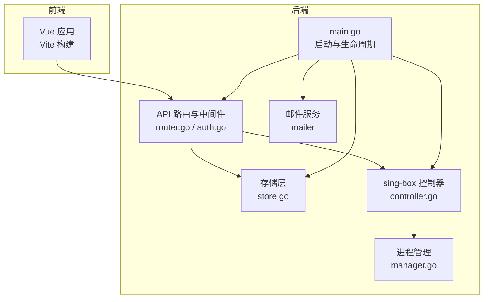
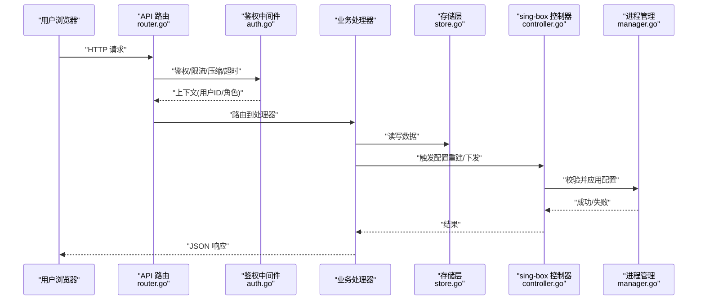
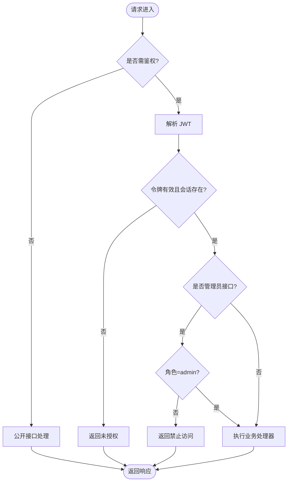
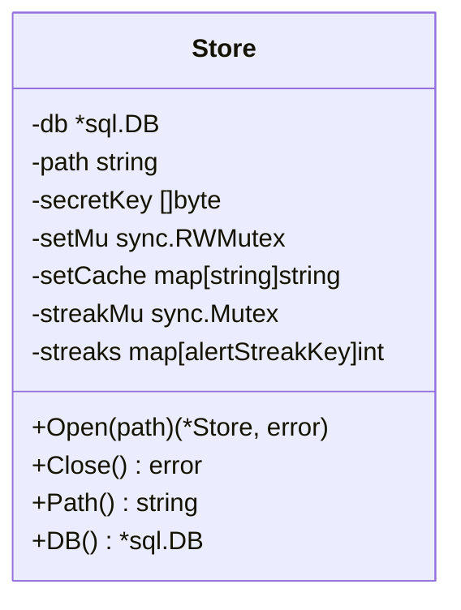
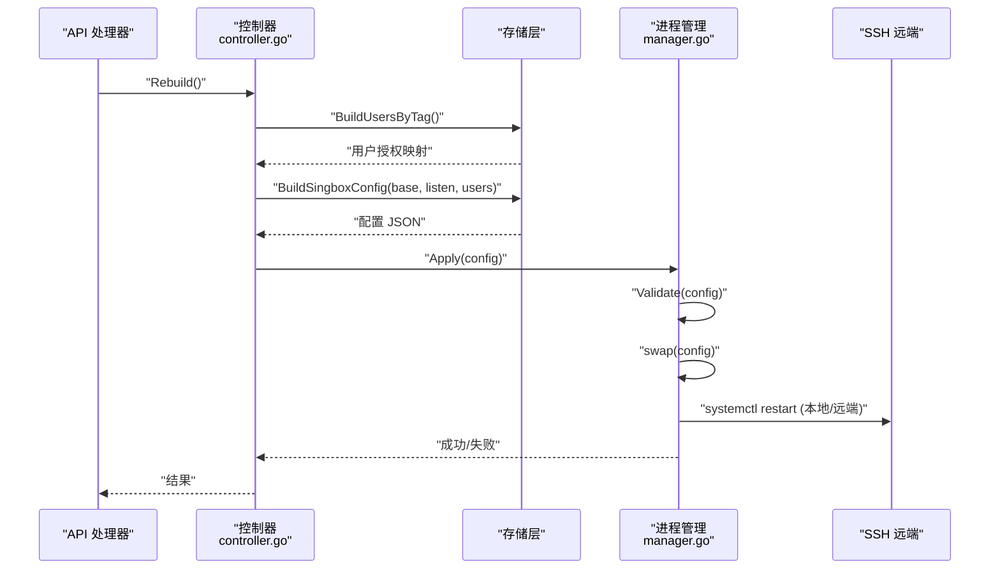
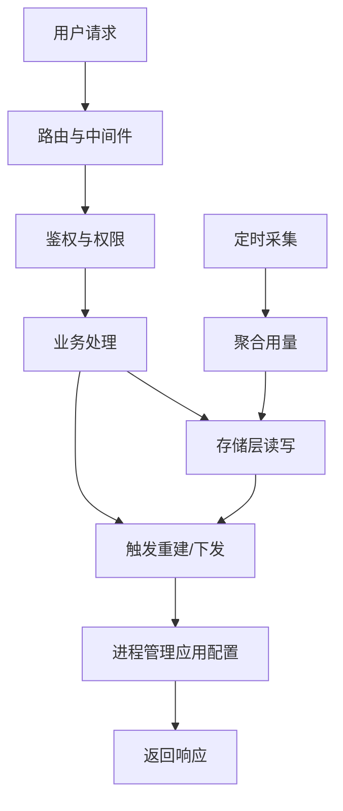
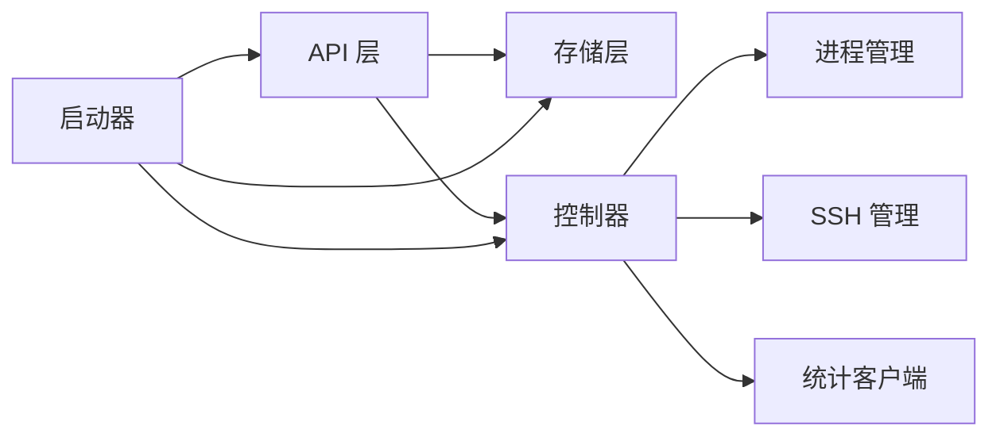

# 系统架构

<cite>
**本文引用的文件**
- [main.go](file://main.go)
- [go.mod](file://go.mod)
- [internal/config/config.go](file://internal/config/config.go)
- [internal/api/router.go](file://internal/api/router.go)
- [internal/api/auth.go](file://internal/api/auth.go)
- [internal/auth/jwt.go](file://internal/auth/jwt.go)
- [internal/store/store.go](file://internal/store/store.go)
- [internal/sbctl/controller.go](file://internal/sbctl/controller.go)
- [internal/sbproc/manager.go](file://internal/sbproc/manager.go)
- [frontend/src/main.ts](file://frontend/src/main.ts)
- [frontend/package.json](file://frontend/package.json)
</cite>

## 目录
1. [简介](#简介)
2. [项目结构](#项目结构)
3. [核心组件](#核心组件)
4. [架构总览](#架构总览)
5. [详细组件分析](#详细组件分析)
6. [依赖关系分析](#依赖关系分析)
7. [性能考量](#性能考量)
8. [故障排查指南](#故障排查指南)
9. [结论](#结论)
10. [附录](#附录)

## 简介
轻舟面板是一个前后端分离的代理服务管理面板，后端使用 Go 构建 HTTP API，前端基于 Vue.js 提供管理界面与用户控制台。系统采用分层架构：API 层负责路由、鉴权与业务编排；存储层基于 SQLite 持久化数据；进程管理层负责本地与远端 sing-box 进程的生成、校验、下发与重启；同时内置定时任务（用量采集、证书续期、队列推进等）保障系统自维护能力。整体设计强调高可用、可观测性与可扩展性，支持多服务器节点管理与插件式扩展点。

## 项目结构
- 后端入口 main.go 负责加载配置、打开数据库、初始化邮件服务、启动 sing-box 控制器、注册 HTTP 路由并监听端口。
- internal/api 提供 RESTful API 路由与中间件（鉴权、限流、压缩、超时、最大请求体限制）。
- internal/store 封装 SQLite 访问、迁移、设置缓存与加密密钥。
- internal/sbctl 协调配置生成、统计收集与下发应用，支持本地与远程节点。
- internal/sbproc 管理 sing-box 二进制进程的生命周期（校验、原子替换、重载）。
- frontend 为 Vue 3 + Vite 构建的前端资源，通过内嵌方式由后端静态分发。

**图表来源**
- [main.go:25-142](file://main.go#L25-L142)
- [internal/api/router.go:132-386](file://internal/api/router.go#L132-L386)
- [internal/store/store.go:27-57](file://internal/store/store.go#L27-L57)
- [internal/sbctl/controller.go:353-455](file://internal/sbctl/controller.go#L353-L455)
- [internal/sbproc/manager.go:247-285](file://internal/sbproc/manager.go#L247-L285)

**章节来源**
- [main.go:25-142](file://main.go#L25-L142)
- [internal/api/router.go:132-386](file://internal/api/router.go#L132-L386)
- [internal/store/store.go:27-57](file://internal/store/store.go#L27-L57)

## 核心组件
- 配置与启动：从环境变量加载监听地址、数据库路径、管理员账号；初始化 JWT 密钥与可选 SMTP；启动 sing-box 控制器与后台任务。
- API 层：基于 chi 路由器组织公开、认证、管理员三类接口；内置请求 ID、恢复、压缩、超时、最大请求体限制；按 IP 限流防止暴力破解与滥用。
- 存储层：SQLite 单进程部署，WAL 模式提升并发读性能；设置表内存缓存减少热点读取；敏感字段支持落盘加密。
- 进程管理层：sing-box 控制器负责根据当前授权与入站规则生成配置，校验后原子替换并触发重载；支持本地直接应用与通过 SSH 下发到远端节点。
- 监控与统计：定时采集 sing-box 流量统计，聚合到用户维度，驱动配额控制与重建流程。
- 前端：Vue 3 + Pinia + ECharts + Naive UI，通过后端内嵌静态资源统一分发，提供管理后台与用户控制台。

**章节来源**
- [internal/config/config.go:14-29](file://internal/config/config.go#L14-L29)
- [internal/api/router.go:132-148](file://internal/api/router.go#L132-L148)
- [internal/store/store.go:27-57](file://internal/store/store.go#L27-L57)
- [internal/sbctl/controller.go:661-699](file://internal/sbctl/controller.go#L661-L699)
- [frontend/src/main.ts:1-11](file://frontend/src/main.ts#L1-L11)
- [frontend/package.json:11-19](file://frontend/package.json#L11-L19)

## 架构总览
轻舟面板采用前后端分离的分层架构：
- 表现层：Vue 前端通过浏览器发起 HTTP 请求，调用后端 API。
- 网关与路由层：chi 路由器统一处理请求，注入中间件（鉴权、限流、压缩、超时），将请求分派到具体处理器。
- 业务逻辑层：API 处理器组合存储层与控制器完成业务操作（如创建用户、更新套餐、下发配置）。
- 数据层：SQLite 存储用户、订单、套餐、节点、设置等数据，提供迁移与种子数据能力。
- 进程管理层：sing-box 控制器协调配置生成、校验、下发与重启，支持本地与远端节点。
- 外部集成：SMTP 邮件服务、GitHub 更新源、SSH 远端管理。

**图表来源**
- [internal/api/router.go:132-386](file://internal/api/router.go#L132-L386)
- [internal/api/auth.go:179-213](file://internal/api/auth.go#L179-L213)
- [internal/store/store.go:27-57](file://internal/store/store.go#L27-L57)
- [internal/sbctl/controller.go:353-455](file://internal/sbctl/controller.go#L353-L455)
- [internal/sbproc/manager.go:247-285](file://internal/sbproc/manager.go#L247-L285)

## 详细组件分析

### API 层与鉴权
- 路由分组：公开接口（健康检查、站点配置、订阅）、认证接口（登录、注册、重置）、用户接口（仪表盘、套餐、订单、节点）、管理员接口（设置、节点、证书、统计、更新）。
- 鉴权机制：JWT 令牌绑定会话，支持 Cookie 与 Bearer 两种传递方式；会话存在性校验支持远程登出与撤销；管理员权限校验。
- 安全与限流：按 IP 限流保护登录、验证码重发、探针上报与订阅地址切换；最大请求体限制防止内存压力；可信代理识别避免伪造源 IP。

**图表来源**
- [internal/api/router.go:149-375](file://internal/api/router.go#L149-L375)
- [internal/api/auth.go:179-213](file://internal/api/auth.go#L179-L213)
- [internal/auth/jwt.go:16-42](file://internal/auth/jwt.go#L16-L42)

**章节来源**
- [internal/api/router.go:149-375](file://internal/api/router.go#L149-L375)
- [internal/api/auth.go:179-213](file://internal/api/auth.go#L179-L213)
- [internal/auth/jwt.go:16-42](file://internal/auth/jwt.go#L16-L42)

### 存储层（SQLite）
- 连接参数：启用 WAL 模式、外键约束、同步策略与忙等待超时；连接池大小设置为 8，避免嵌套事务死锁。
- 设置缓存：settings 表频繁读取、极少写入，采用内存缓存并在写时失效。
- 敏感信息：支持落盘加密，优先使用环境变量密钥，否则回退到 JWT 密钥（会发出警告）。
- 迁移与种子：启动时执行迁移与种子数据，首次运行自动生成管理员账户与密码提示。

**图表来源**
- [internal/store/store.go:10-71](file://internal/store/store.go#L10-L71)

**章节来源**
- [internal/store/store.go:27-57](file://internal/store/store.go#L27-L57)
- [main.go:25-71](file://main.go#L25-L71)

### 进程管理层（sing-box 控制器与进程管理）
- 控制器职责：根据当前授权与入站规则生成配置，校验后应用到本地或远端节点；周期性采集流量统计并累积到用户维度；支持异步重建调度与状态查询。
- 进程管理：原子替换配置文件，先校验再重载；支持绕过只读沙箱写入；自动检测 sing-box 二进制路径；systemd 单元重启。
- 多服务器支持：本地直接应用或通过 SSH 下发；并发下发并记录每台机器的状态；能力探测缓存 v2ray_api 插件可用性。

**图表来源**
- [internal/sbctl/controller.go:353-455](file://internal/sbctl/controller.go#L353-L455)
- [internal/sbproc/manager.go:247-285](file://internal/sbproc/manager.go#L247-L285)

**章节来源**
- [internal/sbctl/controller.go:353-455](file://internal/sbctl/controller.go#L353-L455)
- [internal/sbproc/manager.go:247-285](file://internal/sbproc/manager.go#L247-L285)

### 数据流向与处理流程
- 用户请求链路：前端发起 HTTP 请求 → API 路由与中间件 → 鉴权与权限校验 → 业务处理器 → 存储层读写 → 必要时触发控制器重建 → 进程管理应用配置 → 返回 JSON 响应。
- 统计采集链路：控制器定时轮询本地与远端 sing-box 统计 → 聚合用户用量 → 批量写入存储 → 下次重建时依据配额调整授权。
- 配置下发链路：管理员修改入站/证书/节点 → API 触发异步重建 → 控制器生成配置 → 校验并原子替换 → 重启 sing-box 单元 → 记录同步状态供 UI 查询。

**图表来源**
- [internal/api/router.go:149-375](file://internal/api/router.go#L149-L375)
- [internal/sbctl/controller.go:548-589](file://internal/sbctl/controller.go#L548-L589)
- [internal/sbproc/manager.go:247-285](file://internal/sbproc/manager.go#L247-L285)

**章节来源**
- [internal/sbctl/controller.go:548-589](file://internal/sbctl/controller.go#L548-L589)
- [internal/api/router.go:149-375](file://internal/api/router.go#L149-L375)

### 技术选型与优势
- Go 语言：高性能、强类型、标准库完善，适合高并发 HTTP 服务与系统级工具；配合 chi 路由与 sqlite 驱动实现简洁稳定的后端。
- SQLite：单文件数据库，零运维成本；WAL 模式提升并发读性能；适合小体量面板场景。
- Vue.js：现代化前端框架，生态丰富（Pinia、ECharts、Naive UI），构建产物由后端内嵌分发，简化部署。
- sing-box：作为底层代理引擎，支持 Reality/TLS/DNS/路由等高级特性；控制器抽象使配置生成与应用解耦，便于扩展与测试。

**章节来源**
- [go.mod:5-13](file://go.mod#L5-L13)
- [frontend/package.json:11-19](file://frontend/package.json#L11-L19)
- [internal/sbctl/controller.go:1-12](file://internal/sbctl/controller.go#L1-L12)

### 可扩展性与插件机制
- 控制器接口化：ConfigStore、Applier、StatsFetcher 等接口定义清晰，便于单元测试与替换实现。
- 远程管理器：通过 sshctl.RemoteManager 抽象远端节点管理，支持主机密钥固定与隧道通信。
- 更新机制：updater.Manager 支持 GitHub 发布源与签名校验，提供回滚能力。
- 设置与模板：settings 表支持动态配置与默认模板，便于功能开关与行为定制。

**章节来源**
- [internal/sbctl/controller.go:36-58](file://internal/sbctl/controller.go#L36-L58)
- [internal/api/router.go:107-129](file://internal/api/router.go#L107-L129)
- [internal/store/store.go:16-25](file://internal/store/store.go#L16-L25)

## 依赖关系分析
- 模块依赖：go.mod 声明 chi、jwt、uuid、crypto、net、yaml、sqlite 等核心依赖。
- 组件耦合：API 层依赖 store 与 sbctl；sbctl 依赖 store、sbproc、sshctl、sbstats；sbproc 依赖系统命令与文件系统。
- 外部集成：SMTP 邮件、GitHub 更新源、SSH 远端管理。

**图表来源**
- [go.mod:5-13](file://go.mod#L5-L13)
- [internal/api/router.go:21-39](file://internal/api/router.go#L21-L39)
- [internal/sbctl/controller.go:60-115](file://internal/sbctl/controller.go#L60-L115)

**章节来源**
- [go.mod:5-13](file://go.mod#L5-L13)
- [internal/api/router.go:21-39](file://internal/api/router.go#L21-L39)
- [internal/sbctl/controller.go:60-115](file://internal/sbctl/controller.go#L60-L115)

## 性能考量
- 并发与锁：控制器 Rebuild 串行化避免并发冲突；统计采集并发拉取远端节点并聚合；存储层使用 WAL 与连接池提升并发读。
- 网络超时：所有外部调用（SSH、systemctl、sing-box check）均设置超时，避免阻塞主流程。
- 资源限制：最大请求体限制防止内存压力；压缩响应减少带宽占用。
- 缓存：设置表内存缓存减少热点读取；能力探测缓存避免重复 SSH 探测。

**章节来源**
- [internal/sbctl/controller.go:353-455](file://internal/sbctl/controller.go#L353-L455)
- [internal/sbproc/manager.go:247-285](file://internal/sbproc/manager.go#L247-L285)
- [internal/store/store.go:27-57](file://internal/store/store.go#L27-L57)
- [internal/api/router.go:132-148](file://internal/api/router.go#L132-L148)

## 故障排查指南
- 登录失败：检查 JWT 密钥与会话是否存在；确认用户名密码正确；查看限流是否触发。
- 配置下发失败：查看 sing-box check 输出；确认 systemd 单元名称与路径；检查只读沙箱与权限问题。
- 统计异常：确认 v2ray_api 插件可用性；检查远端节点连通性与隧道建立；查看控制器日志。
- 更新失败：验证 GitHub 源与 Token；检查签名校验与回滚状态。

**章节来源**
- [internal/api/auth.go:112-149](file://internal/api/auth.go#L112-L149)
- [internal/sbproc/manager.go:53-66](file://internal/sbproc/manager.go#L53-L66)
- [internal/sbctl/controller.go:307-343](file://internal/sbctl/controller.go#L307-L343)
- [internal/api/router.go:225-230](file://internal/api/router.go#L225-L230)

## 结论
轻舟面板通过清晰的分层架构与模块化设计，实现了前后端分离、高可用与可扩展的系统。Go 后端结合 SQLite 提供稳定高效的 API 服务；sing-box 控制器与进程管理确保配置下发的安全与可靠；Vue 前端提供友好的管理体验。系统在安全性、性能与可维护性方面做了充分考量，适合中小规模部署与快速迭代。

## 附录
- 环境变量配置：QZ_LISTEN、QZ_DB、QZ_ADMIN_USER、QZ_ADMIN_PASS、QZ_SMTP_*、QZ_SINGBOX_*、QZ_UPDATE_* 等。
- 部署建议：使用 systemd 管理面板与 sing-box 服务；合理设置只读沙箱与读写路径；定期备份数据库与证书。

**章节来源**
- [internal/config/config.go:14-29](file://internal/config/config.go#L14-L29)
- [main.go:144-169](file://main.go#L144-L169)
- [internal/sbproc/manager.go:68-88](file://internal/sbproc/manager.go#L68-L88)
