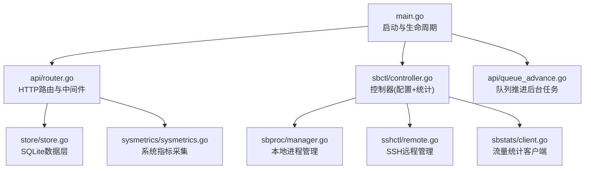
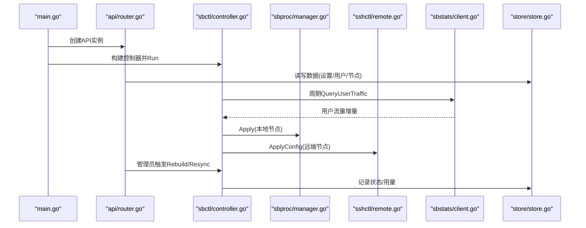
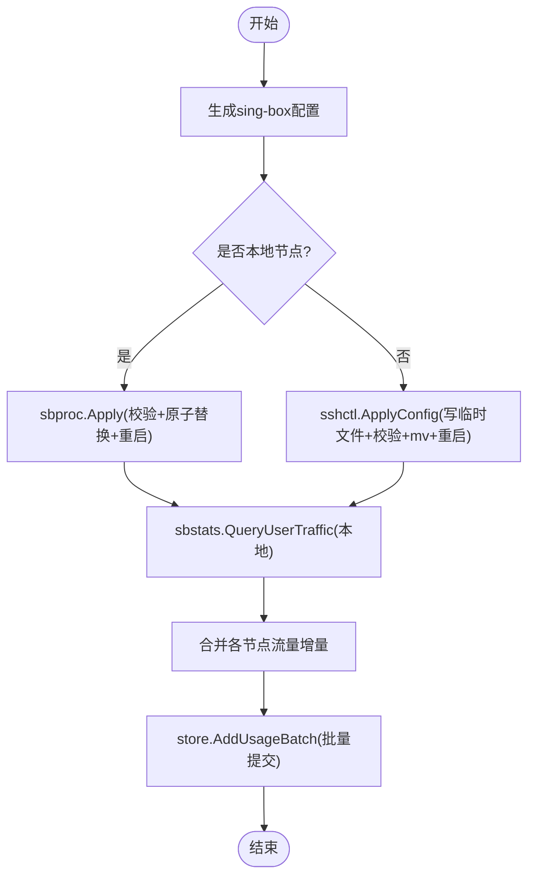
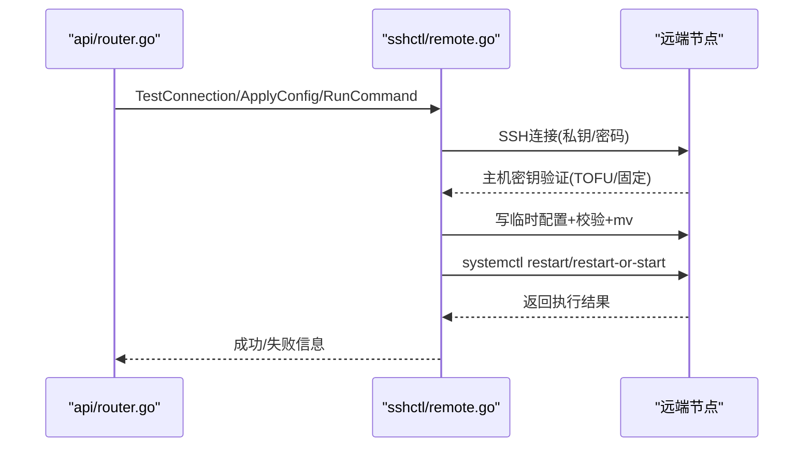
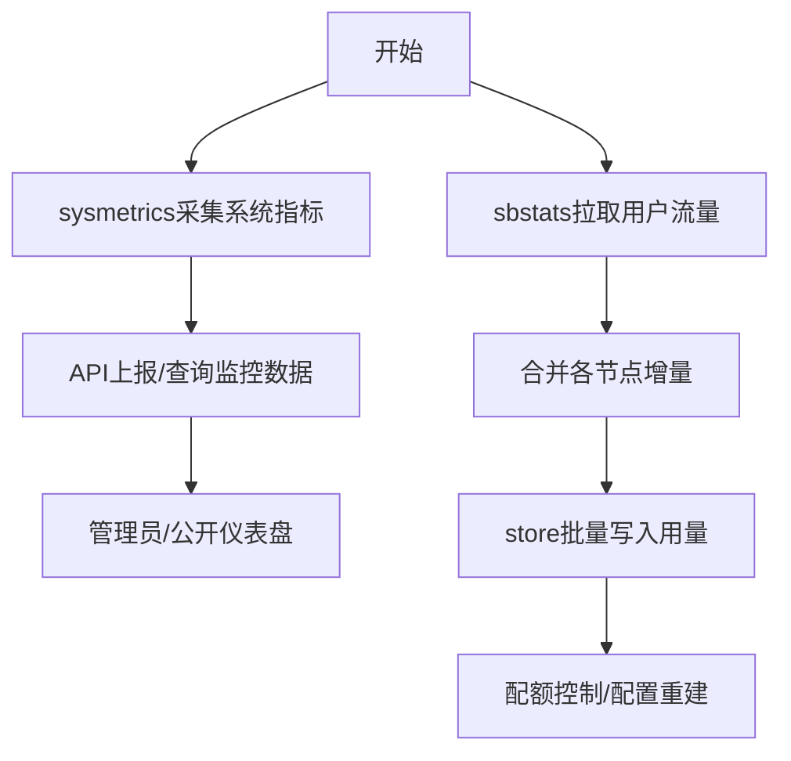
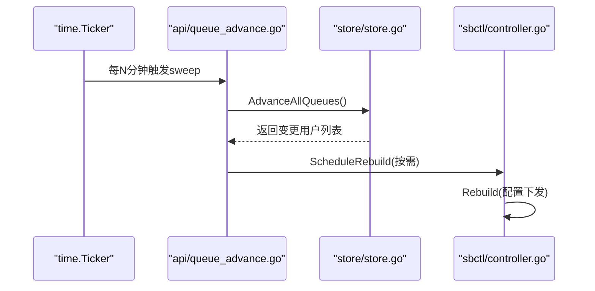
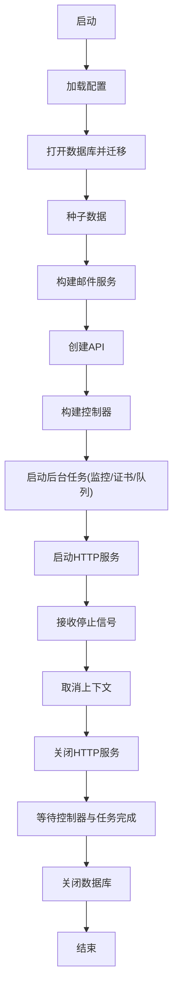
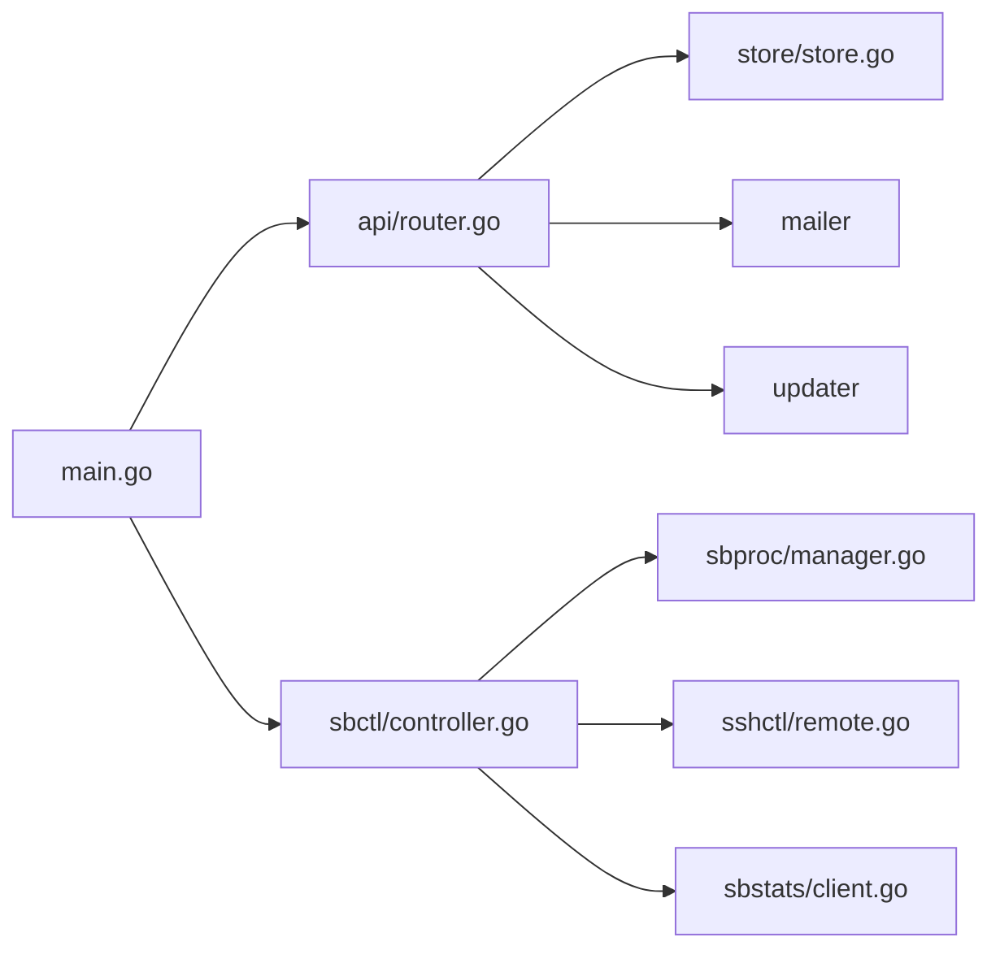

# 组件交互设计

<cite>
**本文引用的文件**
- [main.go](file://main.go)
- [internal/api/router.go](file://internal/api/router.go)
- [internal/sbctl/controller.go](file://internal/sbctl/controller.go)
- [internal/sbproc/manager.go](file://internal/sbproc/manager.go)
- [internal/sbstats/client.go](file://internal/sbstats/client.go)
- [internal/sshctl/remote.go](file://internal/sshctl/remote.go)
- [internal/sysmetrics/sysmetrics.go](file://internal/sysmetrics/sysmetrics.go)
- [internal/store/store.go](file://internal/store/store.go)
- [internal/api/queue_advance.go](file://internal/api/queue_advance.go)
</cite>

## 目录
1. [简介](#简介)
2. [项目结构](#项目结构)
3. [核心组件](#核心组件)
4. [架构总览](#架构总览)
5. [详细组件分析](#详细组件分析)
6. [依赖关系分析](#依赖关系分析)
7. [性能考量](#性能考量)
8. [故障排查指南](#故障排查指南)
9. [结论](#结论)
10. [附录](#附录)

## 简介
本文件面向轻舟面板的组件交互设计，聚焦以下目标：
- 解释核心组件间的通信机制（进程间通信、消息传递、事件驱动）
- 详述 Sing-box 控制器与节点代理的交互流程（配置下发、状态同步、命令执行）
- 阐述 SSH 远程管理实现（连接建立、命令执行、结果返回）
- 说明监控数据采集机制（指标收集、数据上报、实时同步）
- 描述异步任务处理（任务队列、工作进程、错误重试）
- 说明组件生命周期管理（启动顺序、依赖注入、优雅关闭）
- 通过组件交互图展示模块调用关系与数据交换，帮助理解集成模式与扩展点

## 项目结构
轻舟面板采用“入口 + 服务层 + 控制器 + 子系统”的分层组织：
- 入口 main.go 负责加载配置、初始化存储、邮件、API、Sing-box 控制器、后台任务与 HTTP 服务器，并处理优雅关闭
- API 路由集中注册所有 HTTP 接口，并桥接业务逻辑到具体子系统
- sbctl 控制器编排 sing-box 配置生成、校验、应用与统计采集
- sbproc 管理本地 sing-box 进程（写配置、校验、原子替换、重启）
- sshctl 提供 SSH 远程管理能力（连接、隧道、配置下发、命令执行）
- sbstats 通过 gRPC-over-h2c 从 sing-box 拉取用户流量统计
- sysmetrics 采集本机系统指标（CPU/内存/磁盘/网络/负载等）
- store 基于 SQLite 的数据访问层，提供设置缓存、并发安全与事务策略

**图表来源**
- [main.go:25-142](file://main.go#L25-L142)
- [internal/api/router.go:132-387](file://internal/api/router.go#L132-L387)
- [internal/sbctl/controller.go:61-141](file://internal/sbctl/controller.go#L61-L141)
- [internal/sbproc/manager.go:22-51](file://internal/sbproc/manager.go#L22-L51)
- [internal/sshctl/remote.go:98-139](file://internal/sshctl/remote.go#L98-L139)
- [internal/sbstats/client.go:41-90](file://internal/sbstats/client.go#L41-L90)
- [internal/sysmetrics/sysmetrics.go:16-38](file://internal/sysmetrics/sysmetrics.go#L16-L38)
- [internal/store/store.go:10-58](file://internal/store/store.go#L10-L58)
- [internal/api/queue_advance.go:10-69](file://internal/api/queue_advance.go#L10-L69)

**章节来源**
- [main.go:25-142](file://main.go#L25-L142)
- [internal/api/router.go:132-387](file://internal/api/router.go#L132-L387)

## 核心组件
- 控制器 Controller（sbctl）：协调配置生成、校验、应用与统计采集；支持本地与多节点远程下发；维护能力探测缓存与异步重建调度
- 进程管理器 Manager（sbproc）：本地 sing-box 配置写入、校验、原子替换与重启；处理沙箱绕过与回滚保护
- SSH 远程管理器 RemoteManager（sshctl）：SSH 连接、主机密钥固定、隧道建立、远程配置下发、命令执行与服务重启
- 统计客户端 Client（sbstats）：通过 gRPC-over-h2c 查询 sing-box 用户流量统计，支持自定义拨号器以走 SSH 隧道
- 系统指标采集（sysmetrics）：读取 /proc 计算 CPU、内存、磁盘、网络、负载等指标
- 数据层 Store（store）：SQLite 数据库封装，WAL 模式、连接池、设置缓存、并发安全
- API 路由（router）：HTTP 路由、中间件、限流、健康检查、监控端点、管理员接口
- 队列推进（queue_advance）：后台定时推进计划队列，触发配置重建

**章节来源**
- [internal/sbctl/controller.go:61-141](file://internal/sbctl/controller.go#L61-L141)
- [internal/sbproc/manager.go:22-51](file://internal/sbproc/manager.go#L22-L51)
- [internal/sshctl/remote.go:98-139](file://internal/sshctl/remote.go#L98-L139)
- [internal/sbstats/client.go:41-90](file://internal/sbstats/client.go#L41-L90)
- [internal/sysmetrics/sysmetrics.go:16-38](file://internal/sysmetrics/sysmetrics.go#L16-L38)
- [internal/store/store.go:10-58](file://internal/store/store.go#L10-L58)
- [internal/api/router.go:132-387](file://internal/api/router.go#L132-L387)
- [internal/api/queue_advance.go:10-69](file://internal/api/queue_advance.go#L10-L69)

## 架构总览
整体架构围绕“控制器驱动 + 多节点协作 + 后台任务”展开：
- main.go 启动时构建邮件、API、控制器、后台任务与 HTTP 服务
- 控制器在 Run 循环中周期性采集统计并重建配置，确保配额超限用户及时下线
- 对于本地节点直接通过 sbproc 管理进程；对远端节点通过 sshctl 进行配置下发与统计拉取
- API 暴露监控、管理员、用户等接口，并在必要时触发控制器重建或队列推进
- 系统指标由 sysmetrics 采集并通过监控接口上报/展示

**图表来源**
- [main.go:80-106](file://main.go#L80-L106)
- [internal/sbctl/controller.go:661-698](file://internal/sbctl/controller.go#L661-L698)
- [internal/sbproc/manager.go:247-285](file://internal/sbproc/manager.go#L247-L285)
- [internal/sshctl/remote.go:251-307](file://internal/sshctl/remote.go#L251-L307)
- [internal/sbstats/client.go:122-183](file://internal/sbstats/client.go#L122-L183)
- [internal/store/store.go:27-58](file://internal/store/store.go#L27-L58)

## 详细组件分析

### Sing-box 控制器与节点代理交互
- 配置下发流程：
  - 控制器根据当前授权映射生成 sing-box 配置
  - 本地节点通过 sbproc 校验并原子替换配置后重启服务
  - 远端节点通过 sshctl 将配置写入临时文件、校验、移动至正式路径并重启服务
  - 若节点不支持 v2ray_api 插件，则不注入统计监听块，避免部署失败
- 状态同步流程：
  - 控制器周期调用 sbstats 拉取用户流量增量（reset=true），合并各节点数据
  - 将增量批量写入 store，用于用量统计与配额控制
- 命令执行流程：
  - 通过 sshctl.RunCommand 在远端执行诊断命令（如版本检测、连通性测试）
  - 支持升级 sing-box、列出配置文件、读取远端配置等运维操作

**图表来源**
- [internal/sbctl/controller.go:357-455](file://internal/sbctl/controller.go#L357-L455)
- [internal/sbproc/manager.go:247-285](file://internal/sbproc/manager.go#L247-L285)
- [internal/sshctl/remote.go:251-307](file://internal/sshctl/remote.go#L251-L307)
- [internal/sbstats/client.go:122-183](file://internal/sbstats/client.go#L122-L183)
- [internal/store/store.go:27-58](file://internal/store/store.go#L27-L58)

**章节来源**
- [internal/sbctl/controller.go:357-522](file://internal/sbctl/controller.go#L357-L522)
- [internal/sbproc/manager.go:247-285](file://internal/sbproc/manager.go#L247-L285)
- [internal/sshctl/remote.go:251-307](file://internal/sshctl/remote.go#L251-L307)
- [internal/sbstats/client.go:122-183](file://internal/sbstats/client.go#L122-L183)

### SSH 远程管理实现
- 连接建立：
  - 支持私钥与密码两种认证方式
  - 首次连接启用 TOFU（信任首次使用）并持久化主机密钥，后续连接强制校验防止 MITM
- 命令执行：
  - 通过 SSH Session 执行 shell 命令，返回 stdout+stderr 组合输出
  - 支持上下文超时与资源回收，避免长时间挂起导致泄漏
- 结果返回：
  - 配置下发成功后记录哈希，避免重复写入与重启
  - 支持列出远端配置文件、读取指定路径配置、升级 sing-box 等

**图表来源**
- [internal/sshctl/remote.go:145-207](file://internal/sshctl/remote.go#L145-L207)
- [internal/sshctl/remote.go:251-307](file://internal/sshctl/remote.go#L251-L307)
- [internal/sshctl/remote.go:309-343](file://internal/sshctl/remote.go#L309-L343)
- [internal/sshctl/remote.go:610-640](file://internal/sshctl/remote.go#L610-L640)

**章节来源**
- [internal/sshctl/remote.go:145-207](file://internal/sshctl/remote.go#L145-L207)
- [internal/sshctl/remote.go:251-307](file://internal/sshctl/remote.go#L251-L307)
- [internal/sshctl/remote.go:309-343](file://internal/sshctl/remote.go#L309-L343)
- [internal/sshctl/remote.go:610-640](file://internal/sshctl/remote.go#L610-L640)

### 监控数据采集机制
- 指标收集：
  - sysmetrics 读取 /proc 计算 CPU 使用率、内存/交换分区、磁盘使用、网络速率、负载、TCP连接数、进程数、运行时间等
- 数据上报：
  - API 暴露监控报告端点，供探针上报数据
  - 管理员可获取仪表盘、热力图、服务器指标等
- 实时同步：
  - 控制器周期拉取 sing-box 用户流量统计，合并后写入 store，支撑用量与配额控制
  - 系统指标可通过监控接口实时查询

**图表来源**
- [internal/sysmetrics/sysmetrics.go:16-38](file://internal/sysmetrics/sysmetrics.go#L16-L38)
- [internal/sbstats/client.go:122-183](file://internal/sbstats/client.go#L122-L183)
- [internal/api/router.go:164-175](file://internal/api/router.go#L164-L175)
- [internal/store/store.go:27-58](file://internal/store/store.go#L27-L58)

**章节来源**
- [internal/sysmetrics/sysmetrics.go:16-38](file://internal/sysmetrics/sysmetrics.go#L16-L38)
- [internal/sbstats/client.go:122-183](file://internal/sbstats/client.go#L122-L183)
- [internal/api/router.go:164-175](file://internal/api/router.go#L164-L175)

### 异步任务处理
- 任务队列：
  - queue_advance 定期扫描计划队列，推进过期或耗尽的计划，触发配置重建
- 工作进程：
  - 后台 goroutine 按间隔执行 sweepQueues，变更时记录日志并触发 onQueuePromoted
- 错误重试：
  - 控制器在 Run 循环中持续尝试采集与重建，失败时记录错误但不中断主循环
  - 队列推进失败仅记录日志，不影响其他用户的激活

**图表来源**
- [internal/api/queue_advance.go:10-69](file://internal/api/queue_advance.go#L10-L69)
- [internal/sbctl/controller.go:661-698](file://internal/sbctl/controller.go#L661-L698)

**章节来源**
- [internal/api/queue_advance.go:10-69](file://internal/api/queue_advance.go#L10-L69)
- [internal/sbctl/controller.go:661-698](file://internal/sbctl/controller.go#L661-L698)

### 组件生命周期管理
- 启动顺序：
  - 加载配置 → 打开数据库并迁移 → 种子数据 → 构建邮件 → 创建API → 构建控制器 → 启动后台任务 → 启动HTTP服务
- 依赖注入：
  - API 注入控制器引用，以便管理员操作触发重建
  - 控制器注入存储、进程管理器、统计客户端与SSH管理器
- 优雅关闭：
  - 捕获信号取消上下文，关闭HTTP服务，等待控制器与后台任务完成，再关闭数据库

**图表来源**
- [main.go:25-142](file://main.go#L25-L142)

**章节来源**
- [main.go:25-142](file://main.go#L25-L142)

## 依赖关系分析
- 松耦合设计：
  - 控制器通过接口抽象存储、应用器与统计抓取器，便于单元测试与替换实现
  - SSH 管理器独立于控制器，提供通用远程管理能力
- 直接依赖：
  - main 依赖 api、config、mail、sbctl、sbproc、sbstats、singbox、sshctl、store
  - sbctl 依赖 sbproc、sbstats、sshctl、store、singbox
  - api 依赖 store、sbctl、updater、mailer
- 潜在循环依赖：
  - 控制器与 API 通过 SetSbController 解耦，避免循环导入
- 外部依赖：
  - SQLite 作为数据存储
  - gRPC-over-h2c 与 sing-box 统计接口通信
  - SSH 协议用于远程管理

**图表来源**
- [main.go:14-23](file://main.go#L14-L23)
- [internal/api/router.go:21-39](file://internal/api/router.go#L21-L39)
- [internal/sbctl/controller.go:14-34](file://internal/sbctl/controller.go#L14-L34)

**章节来源**
- [main.go:14-23](file://main.go#L14-L23)
- [internal/api/router.go:21-39](file://internal/api/router.go#L21-L39)
- [internal/sbctl/controller.go:14-34](file://internal/sbctl/controller.go#L14-L34)

## 性能考量
- 配置下发优化：
  - 跳过相同配置的重复写入与重启，避免连接中断
  - 本地与远端分别处理，远端并发下发，单个节点失败不影响其他
- 统计采集优化：
  - 能力探测缓存避免频繁 SSH 探测
  - 每轮采集使用 reset=true 增量统计，减少累积误差
- 数据库优化：
  - WAL 模式与连接池提升并发读写性能
  - 设置缓存减少频繁读取开销
- 资源管理：
  - SSH 连接与统计客户端严格关闭，避免会话泄漏
  - 后台任务带超时与上下文取消，防止阻塞

[本节为通用性能建议，无需特定文件来源]

## 故障排查指南
- 配置下发失败：
  - 检查 sing-box 二进制路径与权限
  - 查看校验输出定位配置错误
  - 确认 systemd 单元名称与路径正确
- SSH 连接问题：
  - 验证主机密钥是否匹配，必要时清除固定密钥重新信任
  - 检查私钥格式与密码，确认端口可达
- 统计采集异常：
  - 确认节点启用了 v2ray_api 插件
  - 检查监听地址与防火墙规则
- 数据库锁死：
  - 观察 busy_timeout 与事务嵌套，避免长事务阻塞
- 后台任务卡住：
  - 检查上下文取消与超时设置
  - 查看日志中的错误堆栈

**章节来源**
- [internal/sbproc/manager.go:53-66](file://internal/sbproc/manager.go#L53-L66)
- [internal/sshctl/remote.go:168-186](file://internal/sshctl/remote.go#L168-L186)
- [internal/sbstats/client.go:92-120](file://internal/sbstats/client.go#L92-L120)
- [internal/store/store.go:27-58](file://internal/store/store.go#L27-L58)

## 结论
轻舟面板通过控制器驱动的架构实现了 sing-box 的多节点管理与统计采集，结合 SSH 远程管理提供了强大的运维能力。系统设计注重可靠性与性能，通过原子替换、能力探测缓存、增量统计与资源管理确保了服务的稳定性。后台任务与优雅关闭机制进一步提升了系统的健壮性。开发者可基于现有接口扩展新功能，保持模块间的松耦合与高内聚。

[本节为总结性内容，无需特定文件来源]

## 附录
- 关键接口与类型：
  - ConfigStore：定义配置生成与用量写入接口
  - Applier：定义配置应用接口
  - StatsFetcher：定义统计抓取接口
  - ServerConfig：SSH 远程管理配置结构
  - Metrics：系统指标数据结构
- 扩展点：
  - 自定义 Applier 实现不同进程管理策略
  - 自定义 StatsFetcher 适配其他统计源
  - 扩展 SSH 管理器支持更多认证方式

[本节为补充信息，无需特定文件来源]
