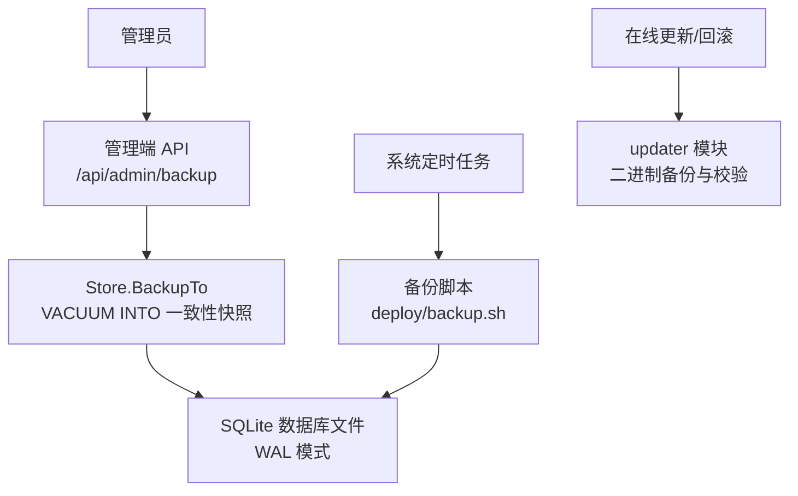
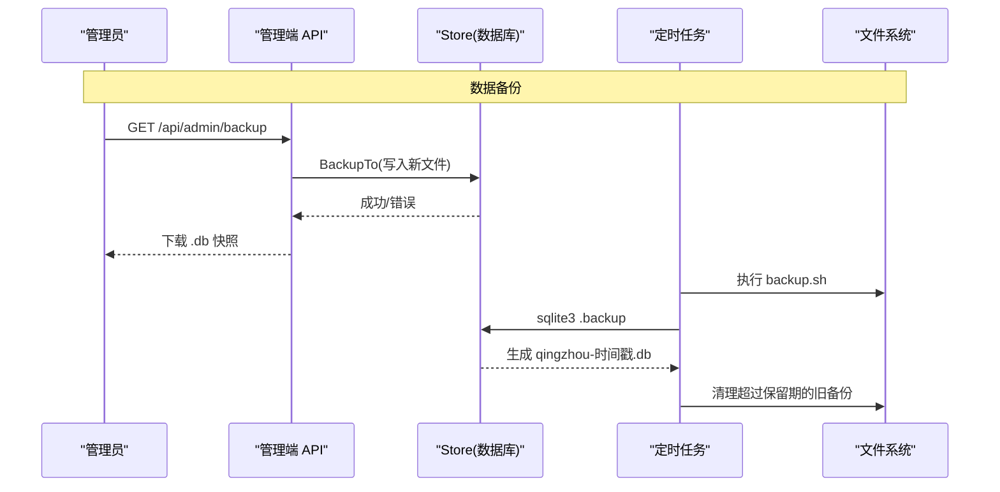
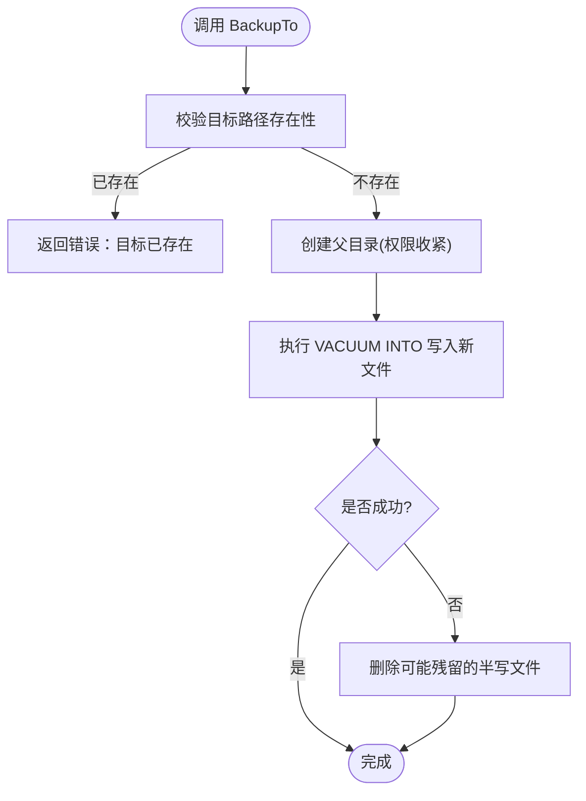
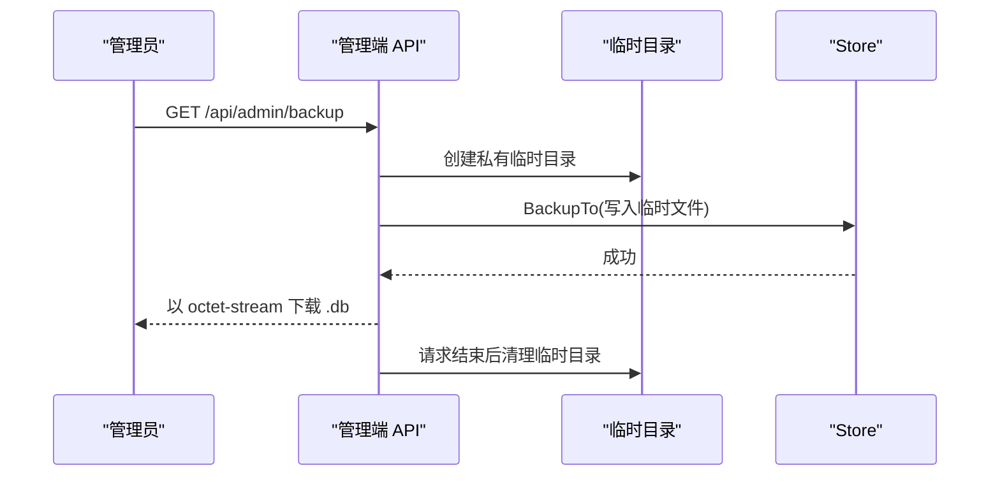
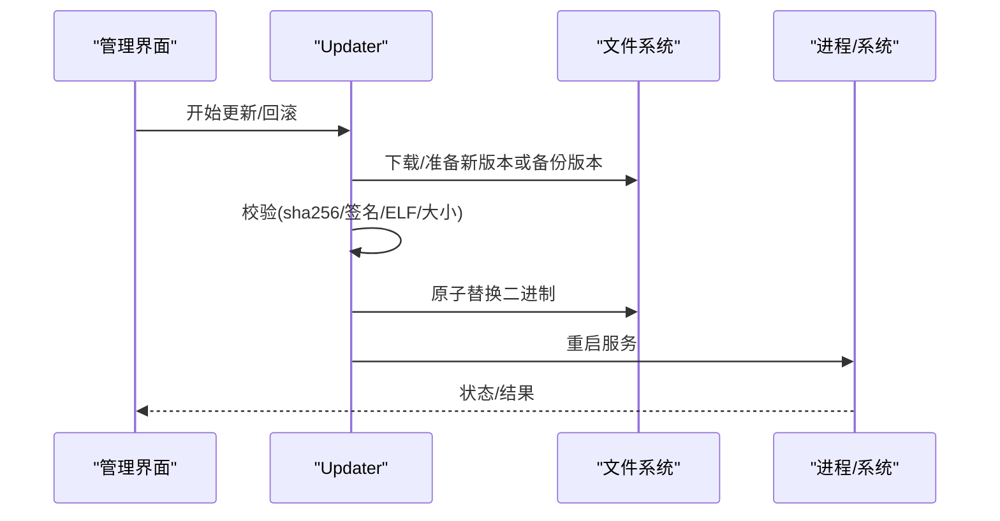
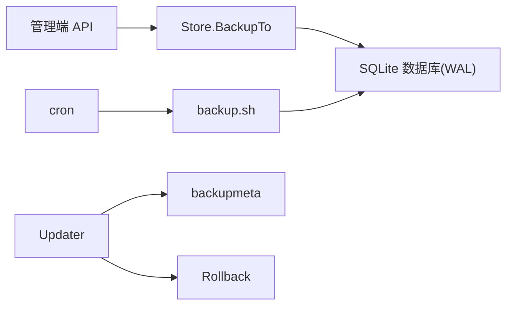

# 备份恢复

<cite>
**本文引用的文件**
- [deploy/backup.sh](file://deploy/backup.sh)
- [internal/store/backup.go](file://internal/store/backup.go)
- [internal/api/backup_admin.go](file://internal/api/backup_admin.go)
- [internal/updater/backupmeta.go](file://internal/updater/backupmeta.go)
- [internal/updater/rollback.go](file://internal/updater/rollback.go)
- [internal/updater/updater.go](file://internal/updater/updater.go)
- [internal/config/config.go](file://internal/config/config.go)
- [docs/部署与配置手册.md](file://docs/部署与配置手册.md)
</cite>

## 目录
1. [简介](#简介)
2. [项目结构](#项目结构)
3. [核心组件](#核心组件)
4. [架构总览](#架构总览)
5. [详细组件分析](#详细组件分析)
6. [依赖关系分析](#依赖关系分析)
7. [性能考虑](#性能考虑)
8. [故障排查指南](#故障排查指南)
9. [结论](#结论)
10. [附录](#附录)

## 简介
本指南面向轻舟面板的运维人员，提供数据库备份、恢复、迁移与版本升级的完整实践。内容涵盖：
- 数据库备份策略与自动化脚本
- 备份文件格式、存储位置与保留策略
- 手动备份与恢复（全量）操作步骤
- 增量备份建议与实现思路
- 数据迁移与版本升级注意事项
- 备份文件的安全存储与加密保护
- 灾难恢复流程与 RTO/RPO 目标设定
- 备份验证与完整性检查方法

## 项目结构
与备份恢复相关的代码与脚本分布在以下位置：
- 自动化备份脚本：deploy/backup.sh
- 数据库一致性快照导出：internal/store/backup.go
- 管理端导出接口：internal/api/backup_admin.go
- 二进制回滚与元数据校验：internal/updater/{updater.go, rollback.go, backupmeta.go}
- 运行时配置（含数据库路径）：internal/config/config.go
- 部署与配置说明（含备份提示）：docs/部署与配置手册.md

图表来源
- [internal/api/backup_admin.go:12-77](file://internal/api/backup_admin.go#L12-L77)
- [internal/store/backup.go:10-52](file://internal/store/backup.go#L10-L52)
- [deploy/backup.sh:1-15](file://deploy/backup.sh#L1-L15)
- [internal/updater/updater.go:422-576](file://internal/updater/updater.go#L422-L576)
- [internal/updater/rollback.go:85-193](file://internal/updater/rollback.go#L85-L193)

章节来源
- [deploy/backup.sh:1-15](file://deploy/backup.sh#L1-L15)
- [internal/store/backup.go:10-52](file://internal/store/backup.go#L10-L52)
- [internal/api/backup_admin.go:12-77](file://internal/api/backup_admin.go#L12-L77)
- [internal/updater/updater.go:422-576](file://internal/updater/updater.go#L422-L576)
- [internal/updater/rollback.go:85-193](file://internal/updater/rollback.go#L85-L193)
- [internal/config/config.go:14-29](file://internal/config/config.go#L14-L29)
- [docs/部署与配置手册.md:121-131](file://docs/部署与配置手册.md#L121-L131)

## 核心组件
- 数据库一致性快照导出（Store.BackupTo）
  - 通过 SQLite 的 VACUUM INTO 在读取事务中生成单文件、无侧车的一致性快照，避免 WAL 模式下直接复制导致的不一致问题。
  - 目标路径必须不存在；失败时清理可能残留的半写文件。
- 管理端导出接口（handleAdminBackup）
  - 为管理员提供“一键下载”一致性快照，临时文件创建在数据库同目录以避免 tmpfs OOM 风险，并设置 no-store 防止缓存泄露。
- 自动化备份脚本（deploy/backup.sh）
  - 使用 sqlite3 .backup 进行热备，按时间戳命名，默认保留 7 天。
- 二进制回滚与校验（updater 模块）
  - 更新前原子备份当前二进制，记录版本与 SHA256 元数据；回滚前执行浅校验与必要时的深度校验，确保可安全替换并重启。

章节来源
- [internal/store/backup.go:10-52](file://internal/store/backup.go#L10-L52)
- [internal/api/backup_admin.go:12-77](file://internal/api/backup_admin.go#L12-L77)
- [deploy/backup.sh:1-15](file://deploy/backup.sh#L1-L15)
- [internal/updater/backupmeta.go:25-154](file://internal/updater/backupmeta.go#L25-L154)
- [internal/updater/rollback.go:85-193](file://internal/updater/rollback.go#L85-L193)
- [internal/updater/updater.go:518-576](file://internal/updater/updater.go#L518-L576)

## 架构总览
备份恢复涉及两条主线：
- 数据层：SQLite 数据库的一致性快照导出（API 与脚本）
- 程序层：二进制文件的更新与回滚（含元数据与校验）

图表来源
- [internal/api/backup_admin.go:23-77](file://internal/api/backup_admin.go#L23-L77)
- [internal/store/backup.go:28-52](file://internal/store/backup.go#L28-L52)
- [deploy/backup.sh:5-14](file://deploy/backup.sh#L5-L14)

章节来源
- [internal/api/backup_admin.go:23-77](file://internal/api/backup_admin.go#L23-L77)
- [internal/store/backup.go:28-52](file://internal/store/backup.go#L28-L52)
- [deploy/backup.sh:5-14](file://deploy/backup.sh#L5-L14)

## 详细组件分析

### 数据库一致性快照导出（Store.BackupTo）
- 设计要点
  - 数据库运行于 WAL 模式，直接复制主文件会导致不一致；采用 VACUUM INTO 从 SQLite 内部获取一致点。
  - 输出为单一文件，无 -wal/-shm 侧车，便于传输与归档。
  - 目标路径不允许覆盖已有文件，避免误删；失败时清理残留。
- 复杂度与影响
  - 快照大小约等于数据库体积；在大库场景下需预留足够磁盘空间。
  - 读写并发不受阻塞，但会占用一定 I/O。

图表来源
- [internal/store/backup.go:28-52](file://internal/store/backup.go#L28-L52)

章节来源
- [internal/store/backup.go:10-52](file://internal/store/backup.go#L10-L52)

### 管理端导出接口（/api/admin/backup）
- 功能
  - 为管理员提供一致性快照下载，临时目录位于数据库同目录，避免 tmpfs 内存压力。
  - 响应头禁止缓存，文件名带时间戳。
- 安全
  - 导出的数据库包含加密列密文；恢复时需相同的主密钥 QZ_SECRET_KEY。

图表来源
- [internal/api/backup_admin.go:23-77](file://internal/api/backup_admin.go#L23-L77)
- [internal/store/backup.go:28-52](file://internal/store/backup.go#L28-L52)

章节来源
- [internal/api/backup_admin.go:12-77](file://internal/api/backup_admin.go#L12-L77)

### 自动化备份脚本（deploy/backup.sh）
- 行为
  - 使用 sqlite3 .backup 对运行中的数据库进行热备，生成带时间戳的 .db 文件。
  - 保留最近 7 天的备份，自动清理过期文件。
- 建议
  - 将脚本加入 crontab 每日执行；根据业务调整保留天数。
  - 若数据库路径不同，请修改脚本中的路径。

章节来源
- [deploy/backup.sh:1-15](file://deploy/backup.sh#L1-L15)

### 二进制更新与回滚（updater 模块）
- 更新流程
  - 下载发布资产，校验 SHA256，可选签名校验。
  - 原子替换二进制，并保留上一版本用于回滚。
  - 记录二进制元数据（版本、SHA256、大小）。
- 回滚流程
  - 浅校验（大小、ELF 头、元数据一致性），必要时深度校验（SHA256）。
  - 原子替换并重启服务；支持可逆回滚。

图表来源
- [internal/updater/updater.go:422-576](file://internal/updater/updater.go#L422-L576)
- [internal/updater/rollback.go:85-193](file://internal/updater/rollback.go#L85-L193)
- [internal/updater/backupmeta.go:25-154](file://internal/updater/backupmeta.go#L25-L154)

章节来源
- [internal/updater/updater.go:422-576](file://internal/updater/updater.go#L422-L576)
- [internal/updater/rollback.go:85-193](file://internal/updater/rollback.go#L85-L193)
- [internal/updater/backupmeta.go:25-154](file://internal/updater/backupmeta.go#L25-L154)

### 配置与环境变量
- 数据库路径由环境变量 QZ_DB 控制，默认为 qingzhou.db。
- 敏感信息（如证书、出站密码等）使用 QZ_SECRET_KEY 加密存储；备份文件中这些字段仍为密文，恢复时需要相同的密钥。

章节来源
- [internal/config/config.go:14-29](file://internal/config/config.go#L14-L29)
- [internal/api/backup_admin.go:19-22](file://internal/api/backup_admin.go#L19-L22)
- [docs/部署与配置手册.md:95-120](file://docs/部署与配置手册.md#L95-L120)

## 依赖关系分析
- 数据备份链路
  - 管理端 API 依赖 Store.BackupTo，后者依赖 SQLite 的 VACUUM INTO。
  - 脚本备份依赖 sqlite3 命令行工具与 cron。
- 二进制回滚链路
  - updater 模块负责下载、校验、原子替换与重启；rollback 模块负责回滚逻辑；backupmeta 负责元数据读写与校验。

图表来源
- [internal/api/backup_admin.go:23-77](file://internal/api/backup_admin.go#L23-L77)
- [internal/store/backup.go:28-52](file://internal/store/backup.go#L28-L52)
- [deploy/backup.sh:5-14](file://deploy/backup.sh#L5-L14)
- [internal/updater/updater.go:422-576](file://internal/updater/updater.go#L422-L576)
- [internal/updater/rollback.go:85-193](file://internal/updater/rollback.go#L85-L193)
- [internal/updater/backupmeta.go:25-154](file://internal/updater/backupmeta.go#L25-L154)

章节来源
- [internal/api/backup_admin.go:23-77](file://internal/api/backup_admin.go#L23-L77)
- [internal/store/backup.go:28-52](file://internal/store/backup.go#L28-L52)
- [deploy/backup.sh:5-14](file://deploy/backup.sh#L5-L14)
- [internal/updater/updater.go:422-576](file://internal/updater/updater.go#L422-L576)
- [internal/updater/rollback.go:85-193](file://internal/updater/rollback.go#L85-L193)
- [internal/updater/backupmeta.go:25-154](file://internal/updater/backupmeta.go#L25-L154)

## 性能考虑
- 数据库快照
  - VACUUM INTO 会产生与数据库大小相近的临时文件，需确保磁盘空间充足。
  - 建议在低峰期执行大库备份，或在脚本中增加重试与告警。
- 网络导出
  - 管理端导出为流式下载，注意带宽与代理缓存策略（已禁用缓存）。
- 二进制回滚
  - 原子替换与重启动过程短暂中断服务，尽量安排在维护窗口。

[本节为通用指导，不直接分析具体文件]

## 故障排查指南
- 无法导出备份
  - 检查数据库路径与权限；确认目标目录有写权限且无同名文件。
  - 查看日志中关于“创建临时目录失败/生成备份失败/读取备份失败”的错误信息。
- 备份后恢复失败
  - 确认恢复环境使用相同的 QZ_SECRET_KEY；否则加密列无法解密。
  - 若使用脚本备份，确认 sqlite3 可用且数据库路径正确。
- 回滚不可用
  - 检查是否存在上一个版本的二进制及元数据；浅校验失败会阻止回滚。
  - 非 Linux 平台不支持一键回滚，需手动替换二进制。

章节来源
- [internal/api/backup_admin.go:23-77](file://internal/api/backup_admin.go#L23-L77)
- [internal/store/backup.go:28-52](file://internal/store/backup.go#L28-L52)
- [internal/updater/backupmeta.go:89-154](file://internal/updater/backupmeta.go#L89-L154)
- [internal/updater/rollback.go:47-72](file://internal/updater/rollback.go#L47-L72)

## 结论
轻舟面板提供了完善的数据与程序级备份恢复能力：
- 数据层：通过 API 与脚本两种方式获得一致性快照，适合日常备份与迁移。
- 程序层：更新前自动备份二进制并记录元数据，支持一键回滚与校验。
结合合理的保留策略、安全存储与定期演练，可有效达成业务 RTO/RPO 目标。

[本节为总结性内容，不直接分析具体文件]

## 附录

### 备份策略与自动化
- 全量备份
  - 推荐方式：管理端导出（/api/admin/backup）或脚本（sqlite3 .backup）。
  - 频率：建议每日一次；高变更场景可增加至每小时。
- 增量备份
  - 代码未内置增量备份；可在外部基于 WAL 文件或文件系统差异方案实现（例如基于 LVM 快照或数据库增量导出工具）。
- 保留策略
  - 脚本默认保留 7 天；可按合规要求调整。
  - 建议异地归档（对象存储/磁带库），并定期抽样恢复演练。

章节来源
- [deploy/backup.sh:1-15](file://deploy/backup.sh#L1-L15)
- [docs/部署与配置手册.md:121-131](file://docs/部署与配置手册.md#L121-L131)

### 备份文件格式、存储位置与恢复步骤
- 格式
  - 数据库快照为 SQLite 单文件（.db），无 -wal/-shm 侧车。
- 存储位置
  - 脚本默认备份到 /opt/qingzhou/backups（可按需修改）。
  - 管理端导出为浏览器下载，临时文件位于数据库同目录。
- 恢复步骤（全量）
  - 停止服务（可选，但建议停机以确保一致性）。
  - 将备份 .db 复制到 QZ_DB 指定路径（或默认路径）。
  - 确保 QZ_SECRET_KEY 与备份时一致。
  - 启动服务并验证数据。

章节来源
- [internal/store/backup.go:10-28](file://internal/store/backup.go#L10-L28)
- [internal/api/backup_admin.go:19-22](file://internal/api/backup_admin.go#L19-L22)
- [internal/config/config.go:14-29](file://internal/config/config.go#L14-L29)
- [deploy/backup.sh:5-14](file://deploy/backup.sh#L5-L14)

### 数据迁移与版本升级注意事项
- 迁移
  - 跨主机迁移只需拷贝 .db 与保持 QZ_SECRET_KEY 一致。
  - 迁移前后建议各做一次一致性快照。
- 版本升级
  - 使用“在线更新”会自动备份当前二进制并记录元数据；如遇问题可回滚。
  - 降级操作需谨慎，数据库不会回滚；建议先下载备份。

章节来源
- [internal/updater/updater.go:518-576](file://internal/updater/updater.go#L518-L576)
- [internal/updater/rollback.go:85-193](file://internal/updater/rollback.go#L85-L193)
- [docs/部署与配置手册.md:256-258](file://docs/部署与配置手册.md#L256-L258)

### 安全存储与加密保护
- 主密钥
  - QZ_SECRET_KEY 用于加密敏感配置；不在数据库中，也不随备份导出。
  - 恢复时必须提供相同密钥，否则加密列无法解密。
- 传输与存储
  - 管理端导出禁用缓存；建议通过 HTTPS 访问。
  - 备份文件应存放于受控目录，限制访问权限；建议异地加密归档。

章节来源
- [internal/api/backup_admin.go:19-22](file://internal/api/backup_admin.go#L19-L22)
- [docs/部署与配置手册.md:95-120](file://docs/部署与配置手册.md#L95-L120)

### 灾难恢复流程与 RTO/RPO 目标
- RPO（恢复点目标）
  - 由备份频率决定：每日备份对应 ~24h RPO；高频备份可降低 RPO。
- RTO（恢复时间目标）
  - 由恢复流程效率决定：最小化停机时间，优先采用快速恢复与预置环境。
- 流程建议
  - 制定标准恢复 SOP，定期演练；准备回滚预案与回退路径。
  - 监控备份成功率与文件大小异常，及时告警。

[本节为通用指导，不直接分析具体文件]

### 备份验证与完整性检查
- 数据库快照
  - 可使用 sqlite3 打开备份文件进行基本查询；或通过应用启动加载验证。
  - 对于脚本备份，可对比文件大小与时间戳，检查是否被清理。
- 二进制回滚
  - 更新前会进行浅校验（大小、ELF 头、元数据），回滚前进行深度校验（SHA256）。
  - 若元数据缺失，则退回浅校验；失败会拒绝回滚。

章节来源
- [internal/updater/backupmeta.go:89-154](file://internal/updater/backupmeta.go#L89-L154)
- [internal/updater/rollback.go:47-72](file://internal/updater/rollback.go#L47-L72)
