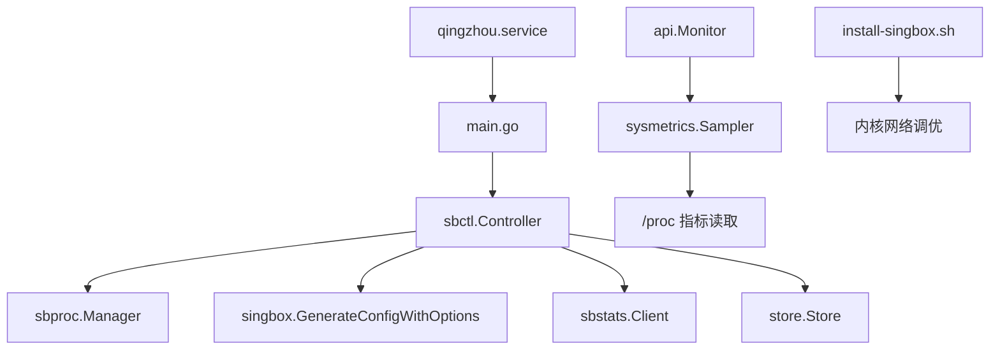
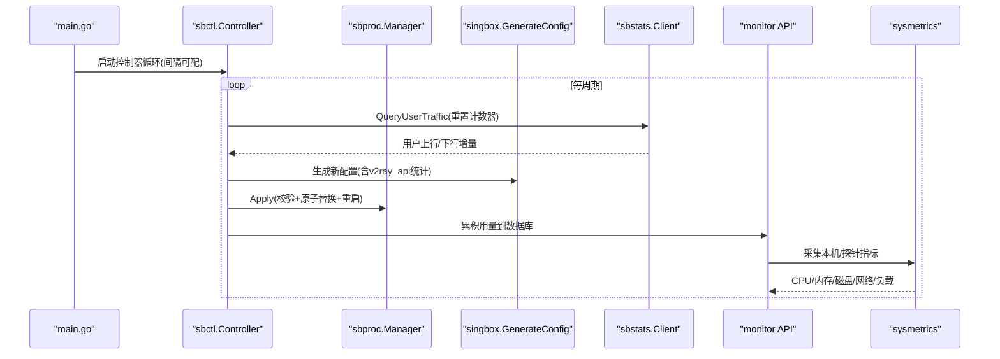
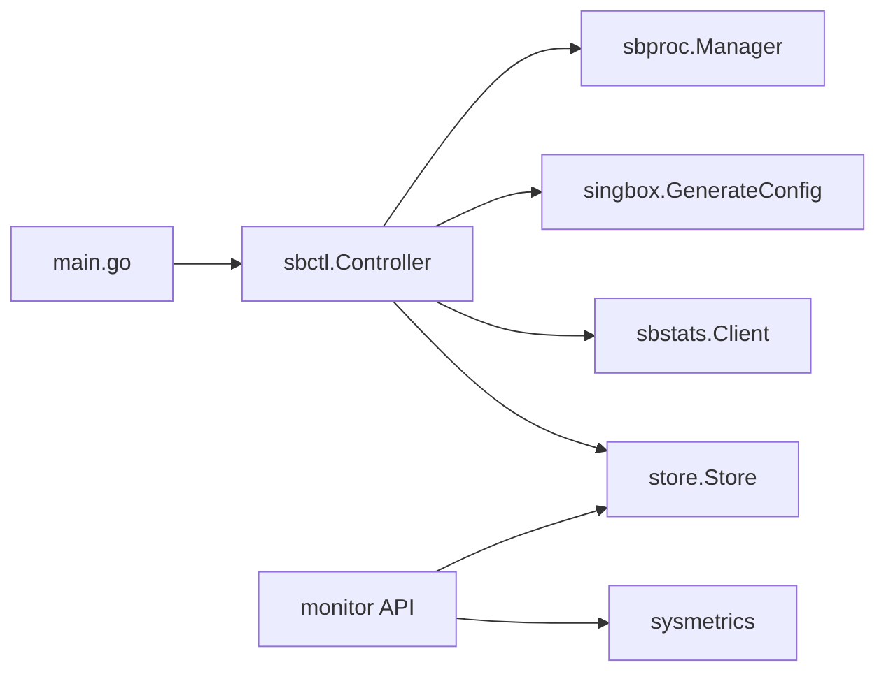

# Sing-box进程优化

<cite>
**本文引用的文件列表**
- [main.go](file://main.go)
- [internal/sbproc/manager.go](file://internal/sbproc/manager.go)
- [internal/singbox/generate.go](file://internal/singbox/generate.go)
- [internal/config/config.go](file://internal/config/config.go)
- [internal/sysmetrics/sysmetrics.go](file://internal/sysmetrics/sysmetrics.go)
- [internal/sysmetrics/sysmetrics_linux.go](file://internal/sysmetrics/sysmetrics_linux.go)
- [internal/sbstats/client.go](file://internal/sbstats/client.go)
- [internal/sbctl/controller.go](file://internal/sbctl/controller.go)
- [internal/store/stats.go](file://internal/store/stats.go)
- [internal/api/monitor.go](file://internal/api/monitor.go)
- [deploy/qingzhou.service](file://deploy/qingzhou.service)
- [internal/assets/install-singbox.sh](file://internal/assets/install-singbox.sh)
</cite>

## 目录
1. [简介](#简介)
2. [项目结构](#项目结构)
3. [核心组件](#核心组件)
4. [架构总览](#架构总览)
5. [详细组件分析](#详细组件分析)
6. [依赖关系分析](#依赖关系分析)
7. [性能考虑](#性能考虑)
8. [故障排查指南](#故障排查指南)
9. [结论](#结论)
10. [附录](#附录)

## 简介
本指南面向在生产环境运行“轻舟”面板并管理 sing-box 进程的团队，聚焦以下目标：
- 基于代码实现，给出 sing-box 配置的性能参数调优建议（并发连接、缓冲区、超时等）
- 说明进程监控与资源限制（内存、CPU亲和性）的落地方式
- 解释流量统计与性能数据采集的最佳实践（采样频率、数据聚合）
- 提供多节点部署时的负载均衡与故障转移思路
- 给出性能基准测试方法与瓶颈识别技巧

本指南严格依据仓库中的源码与脚本进行分析与归纳，避免臆测。

## 项目结构
本项目采用模块化组织：
- 入口与生命周期管理：main.go
- sing-box 配置生成：internal/singbox/generate.go
- 进程管理与配置下发：internal/sbproc/manager.go
- 控制器与调度：internal/sbctl/controller.go
- 指标采集与存储：internal/sysmetrics/*, internal/api/monitor.go, internal/store/stats.go
- 运行时配置加载：internal/config/config.go
- 系统服务定义：deploy/qingzhou.service
- 内核网络调优脚本：internal/assets/install-singbox.sh

图表来源
- [main.go:85-207](file://main.go#L85-L207)
- [internal/sbctl/controller.go:357-455](file://internal/sbctl/controller.go#L357-L455)
- [internal/singbox/generate.go:164-295](file://internal/singbox/generate.go#L164-L295)
- [internal/sbproc/manager.go:247-285](file://internal/sbproc/manager.go#L247-L285)
- [internal/sbstats/client.go:122-183](file://internal/sbstats/client.go#L122-L183)
- [internal/api/monitor.go:183-241](file://internal/api/monitor.go#L183-L241)
- [internal/sysmetrics/sysmetrics_linux.go:20-48](file://internal/sysmetrics/sysmetrics_linux.go#L20-L48)
- [deploy/qingzhou.service:1-22](file://deploy/qingzhou.service#L1-L22)
- [internal/assets/install-singbox.sh:51-81](file://internal/assets/install-singbox.sh#L51-L81)

章节来源
- [main.go:25-142](file://main.go#L25-L142)
- [internal/config/config.go:14-29](file://internal/config/config.go#L14-L29)

## 核心组件
- 控制器（Controller）：负责周期性收集用户流量、重建并下发 sing-box 配置，支持本地与远程节点并行下发与能力探测。
- 进程管理器（Manager）：原子写入配置、校验、重启服务；处理沙箱写保护场景。
- 配置生成器（GenerateConfigWithOptions）：组装日志/DNS/路由/出站/入站，注入用户与 v2ray_api 统计开关。
- 统计客户端（sbstats.Client）：通过 gRPC-over-h2c 拉取 per-user 流量增量，带长度限制与连接回收。
- 系统指标采集（sysmetrics）：从 /proc 计算 CPU、内存、磁盘、网络、负载等指标。
- 监控API（monitor.go）：探针上报、仪表盘聚合、热图与折线展示。
- 服务单元（qingzhou.service）：进程守护、最小化权限与只读文件系统加固。
- 内核调优脚本（install-singbox.sh）：应用 sysctl 与 limits.conf 提升网络吞吐与并发能力。

章节来源
- [internal/sbctl/controller.go:60-141](file://internal/sbctl/controller.go#L60-L141)
- [internal/sbproc/manager.go:22-51](file://internal/sbproc/manager.go#L22-L51)
- [internal/singbox/generate.go:18-33](file://internal/singbox/generate.go#L18-L33)
- [internal/sbstats/client.go:41-90](file://internal/sbstats/client.go#L41-L90)
- [internal/sysmetrics/sysmetrics.go:16-38](file://internal/sysmetrics/sysmetrics.go#L16-L38)
- [internal/api/monitor.go:18-55](file://internal/api/monitor.go#L18-L55)
- [deploy/qingzhou.service:5-18](file://deploy/qingzhou.service#L5-L18)
- [internal/assets/install-singbox.sh:51-81](file://internal/assets/install-singbox.sh#L51-L81)

## 架构总览
下图展示了控制面板启动后，如何驱动 sing-box 配置生成、进程管理、统计采集与监控展示的闭环流程。

图表来源
- [main.go:85-207](file://main.go#L85-L207)
- [internal/sbctl/controller.go:661-699](file://internal/sbctl/controller.go#L661-L699)
- [internal/singbox/generate.go:164-295](file://internal/singbox/generate.go#L164-L295)
- [internal/sbproc/manager.go:247-285](file://internal/sbproc/manager.go#L247-L285)
- [internal/sbstats/client.go:122-183](file://internal/sbstats/client.go#L122-L183)
- [internal/api/monitor.go:183-241](file://internal/api/monitor.go#L183-L241)

## 详细组件分析

### 配置生成与性能相关字段
- 默认基础模板包含日志级别、DNS、出站与路由策略，确保现代 sing-box 版本兼容。
- 通过 Options 控制是否启用 v2ray_api 统计监听地址，以及是否阻断私有网段访问。
- 对 legacy domain_strategy 字段进行清理，避免新版本 check 失败。
- 为每个入站注入用户列表，并在 experimental.v2ray_api.stats.users 中登记，以支持 per-user 计量。

调优要点（基于代码行为）：
- 合理设置 v2ray_listen 地址，仅在本机或受控隧道暴露，避免无意义开销。
- 使用 BlockPrivate 防止代理流量访问内网与云元数据接口，减少误用带来的额外解析与连接。
- 保持配置确定性（排序用户），避免频繁 reload 导致抖动。

章节来源
- [internal/singbox/generate.go:18-33](file://internal/singbox/generate.go#L18-L33)
- [internal/singbox/generate.go:164-295](file://internal/singbox/generate.go#L164-L295)
- [internal/singbox/generate.go:500-530](file://internal/singbox/generate.go#L500-L530)

### 进程管理与配置下发
- Manager 在 Apply 前会执行 sing-box check 校验，失败则不触碰在线配置，保障可用性。
- 使用临时文件 + rename 实现原子替换，避免半写配置被加载。
- 当面板所在 systemd 单元将 /etc 设为只读时，通过 systemd-run 逃逸写入并回读验证一致性。
- Reload 失败会标记状态，下次重试，避免“已落盘但未生效”导致的静默失败。

调优要点（基于代码行为）：
- 控制 Rebuild 频率，避免每分钟都触发 check 与 restart。
- 利用字节级相等判断跳过无变更的重载，降低抖动。
- 合理设置 systemctl restart 超时，避免长耗时阻塞。

章节来源
- [internal/sbproc/manager.go:53-66](file://internal/sbproc/manager.go#L53-L66)
- [internal/sbproc/manager.go:102-146](file://internal/sbproc/manager.go#L102-L146)
- [internal/sbproc/manager.go:228-285](file://internal/sbproc/manager.go#L228-L285)
- [internal/sbproc/manager.go:311-322](file://internal/sbproc/manager.go#L311-L322)

### 控制器调度与统计采集
- Controller.Run 按固定间隔执行 CollectStats 与 Rebuild，保证配额超限用户尽快被剔除。
- 本地与远程节点分别采集流量，远程通过 SSH 隧道建立 h2c 连接，每次请求后显式关闭连接，避免 sshd 泄漏。
- 对 remote stats 能力进行缓存与负向TTL，避免对不支持的节点反复探测。

调优要点（基于代码行为）：
- 调整 QZ_SINGBOX_STATS_INTERVAL 平衡实时性与开销。
- 合理设置远程节点统计超时，避免个别节点拖慢整体。
- 关注连接池与SSH会话的生命周期，确保及时释放。

章节来源
- [internal/sbctl/controller.go:537-649](file://internal/sbctl/controller.go#L537-L649)
- [internal/sbctl/controller.go:661-699](file://internal/sbctl/controller.go#L661-L699)
- [internal/sbstats/client.go:92-120](file://internal/sbstats/client.go#L92-L120)

### 系统指标采集与可视化
- sysmetrics 从 /proc 读取 CPU ticks、内存、磁盘、网络接口计数，计算速率与百分比。
- monitor API 接收探针上报，聚合各服务器最新指标，并提供历史范围查询与热力图。
- 前端展示平均CPU/内存/磁盘、上下行速率、负载与运行时长。

调优要点（基于代码行为）：
- 使用 Sampler 跨周期累计差值，避免首包为零影响趋势。
- 过滤伪文件系统与非物理网卡，避免虚高。
- 对响应体做长度限制，防止恶意或异常服务端导致OOM。

章节来源
- [internal/sysmetrics/sysmetrics.go:40-83](file://internal/sysmetrics/sysmetrics.go#L40-L83)
- [internal/sysmetrics/sysmetrics_linux.go:20-48](file://internal/sysmetrics/sysmetrics_linux.go#L20-L48)
- [internal/api/monitor.go:183-241](file://internal/api/monitor.go#L183-L241)
- [internal/api/monitor.go:323-360](file://internal/api/monitor.go#L323-L360)
- [internal/sbstats/client.go:143-153](file://internal/sbstats/client.go#L143-L153)

### 服务单元与资源限制
- qingzhou.service 使用 ProtectSystem=full 限制写路径，配合 ReadWritePaths 放行必要目录。
- 设置 Restart=on-failure 与 RestartSec 提高自愈能力。
- 安装脚本 apply_tuning 应用内核网络参数与文件描述符上限，提升高并发吞吐。

调优要点（基于代码行为）：
- 根据实际部署需求调整 ReadWritePaths，确保面板能写入 sing-box 配置目录。
- 结合系统 limits.conf 与 sysctl.d 调优 TCP/UDP 缓冲与队列。
- 在高并发场景下评估 nofile 与 net.core.* 参数的匹配度。

章节来源
- [deploy/qingzhou.service:5-18](file://deploy/qingzhou.service#L5-L18)
- [internal/assets/install-singbox.sh:51-81](file://internal/assets/install-singbox.sh#L51-L81)

## 依赖关系分析
- main.go 初始化配置、数据库、邮件、API、控制器与HTTP服务，并启动后台任务。
- sbctl.Controller 依赖 store、sbproc、sbstats、sshctl，协调配置生成与下发。
- sbproc.Manager 依赖系统命令（sing-box check、systemctl restart）与文件系统操作。
- sbstats.Client 依赖 http2 与自定义 protobuf 编解码，直接对接 sing-box 的 v2ray_api。
- sysmetrics 依赖 /proc 与平台特定实现，提供统一指标模型。
- monitor API 依赖 store 与 sysmetrics，提供监控数据查询与聚合。

图表来源
- [main.go:85-207](file://main.go#L85-L207)
- [internal/sbctl/controller.go:60-141](file://internal/sbctl/controller.go#L60-L141)
- [internal/sbproc/manager.go:247-285](file://internal/sbproc/manager.go#L247-L285)
- [internal/singbox/generate.go:164-295](file://internal/singbox/generate.go#L164-L295)
- [internal/sbstats/client.go:122-183](file://internal/sbstats/client.go#L122-L183)
- [internal/api/monitor.go:183-241](file://internal/api/monitor.go#L183-L241)

## 性能考虑
本节围绕“并发连接数、缓冲区大小、超时设置、内存/CPU优化、采样频率与聚合、多节点负载均衡与故障转移、基准测试与瓶颈识别”展开，所有建议均基于代码实现与脚本内容。

- 并发连接数与缓冲区
  - 内核层：install-singbox.sh 设置了 fq 队列、BBR拥塞控制、TCP/UDP rmem/wmem 最大值、somaxconn、netdev_max_backlog、tcp_fastopen、ip_forward、fs.file-max 等，以提升高并发与吞吐。
  - 进程层：面板HTTP服务设置了ReadTimeout/WriteTimeout/IdleTimeout，避免长连接占用过多资源。
  - 统计层：sbstats.Client 对响应体做了16MB限制，防止异常数据导致OOM。

- 超时设置
  - sing-box check 超时15s，systemctl restart 超时20s，避免长时间阻塞。
  - 控制器对远程节点应用配置设置90s超时，单个节点不可达不影响其他节点。
  - 统计采集对远程节点设置30s超时，避免SSH隧道卡死。

- 内存与CPU优化
  - sysmetrics 使用 Sampler 跨周期计算CPU与网络速率，避免重复分配与错误归零。
  - 过滤伪文件系统与非物理网卡，减少无效数据。
  - 面板服务使用 ProtectSystem=full 限制写路径，降低攻击面与误写风险。

- 采样频率与数据聚合
  - QZ_SINGBOX_STATS_INTERVAL 控制控制器周期，默认1分钟，可调整以平衡实时性与开销。
  - monitor API 支持1h/6h/24h/7d/30d范围查询，并按桶聚合（如48列热力图），降低前端渲染压力。
  - 公共仪表板对最近N点数据进行降采样与平均，减少带宽与渲染成本。

- 多节点负载均衡与故障转移
  - 控制器对远程节点并发下发与采集，单点失败不影响整体。
  - 能力探测缓存（含负向TTL）避免对不支持 v2ray_api 的节点反复探测。
  - 前端支持节点切换与批量启用/禁用，便于动态调整流量分布。

- 基准测试与瓶颈识别
  - 使用 egress 探测接口进行连通性与延迟测量，支持并发探测与错误统计。
  - 监控热力图与折线图帮助识别高负载时段与节点。
  - 通过系统指标（CPU、内存、磁盘、网络、负载、TCP连接数）定位瓶颈位置。

章节来源
- [internal/assets/install-singbox.sh:51-81](file://internal/assets/install-singbox.sh#L51-L81)
- [main.go:108-121](file://main.go#L108-L121)
- [internal/sbstats/client.go:143-153](file://internal/sbstats/client.go#L143-L153)
- [internal/sbproc/manager.go:53-66](file://internal/sbproc/manager.go#L53-L66)
- [internal/sbproc/manager.go:311-322](file://internal/sbproc/manager.go#L311-L322)
- [internal/sbctl/controller.go:437-450](file://internal/sbctl/controller.go#L437-L450)
- [internal/sbctl/controller.go:624-649](file://internal/sbctl/controller.go#L624-L649)
- [internal/api/monitor.go:323-360](file://internal/api/monitor.go#L323-L360)
- [internal/api/monitor.go:541-647](file://internal/api/monitor.go#L541-L647)
- [frontend/src/views/UserSub.vue:543-574](file://frontend/src/views/UserSub.vue#L543-L574)

## 故障排查指南
- 配置下发失败
  - 检查 sing-box check 输出，确认配置语法正确。
  - 查看是否因只读文件系统导致写入失败，必要时调整 ReadWritePaths。
  - 关注 reloadFailed 标志，确认是否因 systemctl restart 失败导致后续跳过。

- 统计缺失
  - 确认 v2ray_api 插件存在且端口可达。
  - 检查远程节点能力探测结果与缓存TTL。
  - 确认 sbstats.Client 已正确关闭连接，避免SSH会话泄漏。

- 监控数据异常
  - 检查探针是否在线与上报频率。
  - 核对系统指标采集逻辑（CPU/NIC计数器回绕、伪文件系统过滤）。
  - 使用热力图与折线图定位问题时段与节点。

章节来源
- [internal/sbproc/manager.go:247-285](file://internal/sbproc/manager.go#L247-L285)
- [internal/sbproc/manager.go:102-146](file://internal/sbproc/manager.go#L102-L146)
- [internal/sbctl/controller.go:303-343](file://internal/sbctl/controller.go#L303-L343)
- [internal/sbstats/client.go:92-120](file://internal/sbstats/client.go#L92-L120)
- [internal/sysmetrics/sysmetrics.go:85-109](file://internal/sysmetrics/sysmetrics.go#L85-L109)
- [internal/api/monitor.go:183-241](file://internal/api/monitor.go#L183-L241)

## 结论
本项目通过控制器驱动的周期化流程，实现了 sing-box 配置的自动生成、安全下发与统计采集，并结合系统指标与监控API形成完整的运维闭环。性能优化应优先从内核网络参数、进程资源限制、统计采样频率与远程节点能力探测入手，辅以监控数据定位瓶颈，逐步迭代调优。

## 附录
- 环境变量与配置
  - QZ_LISTEN：面板监听地址
  - QZ_DB：数据库路径
  - QZ_ADMIN_USER/PASS：管理员账号
  - QZ_SINGBOX_CONFIG：sing-box 配置文件路径
  - QZ_SINGBOX_V2RAY：v2ray_api 监听地址
  - QZ_SINGBOX_UNIT：systemd 单元名
  - QZ_SINGBOX_BIN：sing-box 二进制路径
  - QZ_SINGBOX_STATS_INTERVAL：控制器周期（秒或Go duration）
  - QZ_PROBE_DIR：探针二进制目录
  - QZ_SECRET_KEY：加密密钥（用于敏感信息静态加密）

- 关键路径参考
  - 控制器周期与统计采集：[internal/sbctl/controller.go:661-699](file://internal/sbctl/controller.go#L661-L699)
  - 配置生成与统计开关：[internal/singbox/generate.go:164-295](file://internal/singbox/generate.go#L164-L295)
  - 进程管理与重载：[internal/sbproc/manager.go:247-285](file://internal/sbproc/manager.go#L247-L285)
  - 系统指标采集：[internal/sysmetrics/sysmetrics_linux.go:20-48](file://internal/sysmetrics/sysmetrics_linux.go#L20-L48)
  - 监控API与聚合：[internal/api/monitor.go:183-241](file://internal/api/monitor.go#L183-L241)
  - 内核调优脚本：[internal/assets/install-singbox.sh:51-81](file://internal/assets/install-singbox.sh#L51-L81)
