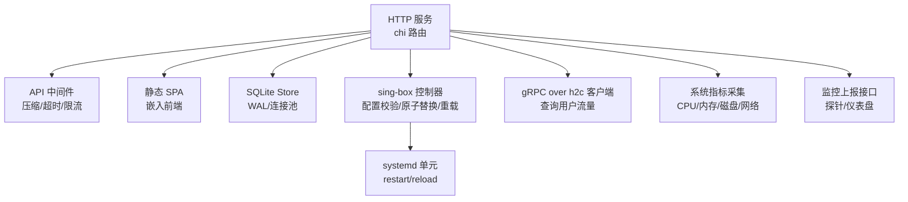
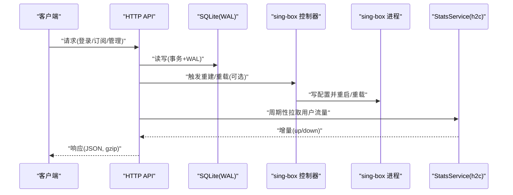
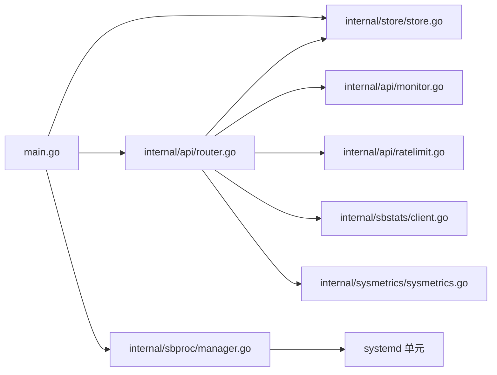

# 性能优化

<cite>
**本文引用的文件**
- [main.go](file://main.go)
- [go.mod](file://go.mod)
- [internal/config/config.go](file://internal/config/config.go)
- [internal/store/store.go](file://internal/store/store.go)
- [internal/sbproc/manager.go](file://internal/sbproc/manager.go)
- [internal/sbstats/client.go](file://internal/sbstats/client.go)
- [internal/sysmetrics/sysmetrics.go](file://internal/sysmetrics/sysmetrics.go)
- [internal/api/router.go](file://internal/api/router.go)
- [internal/api/monitor.go](file://internal/api/monitor.go)
- [internal/api/ratelimit.go](file://internal/api/ratelimit.go)
- [frontend/vite.config.ts](file://frontend/vite.config.ts)
- [deploy/qingzhou.service](file://deploy/qingzhou.service)
- [docker-compose.yml](file://docker-compose.yml)
</cite>

## 目录
1. [简介](#简介)
2. [项目结构](#项目结构)
3. [核心组件](#核心组件)
4. [架构总览](#架构总览)
5. [详细组件分析](#详细组件分析)
6. [依赖关系分析](#依赖关系分析)
7. [性能考量与容量规划](#性能考量与容量规划)
8. [故障排查指南](#故障排查指南)
9. [结论](#结论)
10. [附录：基准与压测方法](#附录：基准与压测方法)

## 简介
本指南面向轻舟面板的生产部署与运维，聚焦系统资源需求、数据库调优、Sing-box 进程管理、前端性能、API 监控与瓶颈定位、高可用与负载均衡、以及基准与压力测试方法。内容基于代码实现进行归纳，确保建议可落地且与当前版本一致。

## 项目结构
轻舟面板采用 Go 后端 + Vue/Vite 前端，使用 SQLite（WAL）作为单进程数据层，内建 sing-box 控制器通过 systemd 管理外部进程，并通过 gRPC-over-h2c 采集 per-user 流量统计；同时提供探针上报的服务器指标监控能力。

图表来源
- [internal/api/router.go:132-147](file://internal/api/router.go#L132-L147)
- [internal/store/store.go:27-57](file://internal/store/store.go#L27-L57)
- [internal/sbproc/manager.go:22-50](file://internal/sbproc/manager.go#L22-L50)
- [internal/sbstats/client.go:41-90](file://internal/sbstats/client.go#L41-L90)
- [internal/sysmetrics/sysmetrics.go:16-38](file://internal/sysmetrics/sysmetrics.go#L16-L38)
- [internal/api/monitor.go:18-55](file://internal/api/monitor.go#L18-L55)

章节来源
- [main.go:25-142](file://main.go#L25-L142)
- [internal/api/router.go:132-147](file://internal/api/router.go#L132-L147)
- [internal/store/store.go:27-57](file://internal/store/store.go#L27-L57)

## 核心组件
- HTTP 服务与路由：默认监听地址由环境变量覆盖，启用 gzip 压缩、请求体大小限制、全局超时与恢复中间件。
- 数据存储：SQLite WAL 模式，开启外键约束、同步策略 NORMAL、事务锁立即化，连接池上限 8。
- Sing-box 进程管理：生成配置后先校验再原子替换并 reload，支持沙箱逃逸写入和失败重试标记。
- 流量统计：通过 h2c 调用 sing-box 的 v2ray_api StatsService，按用户维度拉取增量流量并累计。
- 系统指标：读取 /proc 计算 CPU 使用率、网络速率、负载等，供探针上报与仪表盘展示。
- 监控 API：探针 token 认证上报指标，提供公开/管理员监控视图与热力图、迷你折线图等聚合接口。
- 限流：基于 IP 的固定窗口限流器，保护认证、重发、探针等敏感路径。

章节来源
- [internal/api/router.go:132-147](file://internal/api/router.go#L132-L147)
- [internal/store/store.go:27-57](file://internal/store/store.go#L27-L57)
- [internal/sbproc/manager.go:22-50](file://internal/sbproc/manager.go#L22-L50)
- [internal/sbstats/client.go:41-90](file://internal/sbstats/client.go#L41-L90)
- [internal/sysmetrics/sysmetrics.go:16-38](file://internal/sysmetrics/sysmetrics.go#L16-L38)
- [internal/api/monitor.go:18-55](file://internal/api/monitor.go#L18-L55)
- [internal/api/ratelimit.go:9-65](file://internal/api/ratelimit.go#L9-L65)

## 架构总览

图表来源
- [main.go:80-142](file://main.go#L80-L142)
- [internal/sbproc/manager.go:247-285](file://internal/sbproc/manager.go#L247-L285)
- [internal/sbstats/client.go:122-183](file://internal/sbstats/client.go#L122-L183)
- [internal/store/store.go:27-57](file://internal/store/store.go#L27-L57)

## 详细组件分析

### 数据库与存储（SQLite）
- 关键特性
  - WAL 模式：允许并发读与单写，减少阻塞。
  - 事务锁立即化：避免读→写升级导致的 SQLITE_BUSY_SNAPSHOT。
  - 同步策略 NORMAL：在可靠存储上平衡安全与吞吐。
  - 连接池：最大打开连接数与空闲连接数均为 8，缓解嵌套读死锁。
- 索引与表
  - server_metrics 表包含多维指标字段，已建立复合索引 (server_id, ts) 与独立 ts 索引，用于时间范围查询与清理。
- 容量规划要点
  - 指标表增长快，需定期清理（代码中保留滚动窗口），避免 WAL 膨胀与查询退化。
  - 将备份/快照文件放在数据库同目录，避免 tmpfs 占用内存。

章节来源
- [internal/store/store.go:27-57](file://internal/store/store.go#L27-L57)
- [internal/store/migrate.go:466-498](file://internal/store/migrate.go#L466-L498)

### Sing-box 进程管理
- 流程
  - 生成配置 → 校验（调用 sing-box check）→ 原子替换（临时文件 + rename）→ 重载（systemctl restart）。
  - 若写入被系统沙箱拦截（EROFS），尝试通过 systemd-run 提升权限完成写入，并回读校验一致性。
  - Apply 具备幂等与防抖：相同字节不重复校验与重载；记录上次重载失败以强制重试。
- 性能参数建议
  - 合理设置 QZ_SINGBOX_STATS_INTERVAL（默认 1 分钟），控制统计拉取频率。
  - 控制并发重建：管理器内部串行化 Apply，避免频繁 reload 导致抖动。
  - 为 sing-box 进程本身预留足够内存与文件描述符（取决于 inbounds/outbounds 数量与并发连接）。

章节来源
- [internal/sbproc/manager.go:22-50](file://internal/sbproc/manager.go#L22-L50)
- [internal/sbproc/manager.go:102-146](file://internal/sbproc/manager.go#L102-L146)
- [internal/sbproc/manager.go:247-285](file://internal/sbproc/manager.go#L247-L285)
- [main.go:171-217](file://main.go#L171-L217)

### 流量统计（gRPC over h2c）
- 机制
  - 直接对 sing-box 的 experimental.v2ray_api.listen 发起 h2c 请求，解析最小 protobuf 消息，获取 user>>>NAME>>>traffic>>>uplink|downlink 增量。
  - 每次查询 reset=true，返回自上次以来的增量并清零，面板侧累加到用户用量。
- 资源与安全
  - 限制响应体大小（16MB），防止恶意或异常服务端 OOM。
  - 明确关闭连接，避免 SSH 隧道泄漏导致远端进程耗尽。
- 调优建议
  - 调整 QZ_SINGBOX_STATS_INTERVAL 降低拉取频率可减少 CPU 与网络开销。
  - 多节点场景下，注意 SSH 隧道复用与超时配置，避免过多会话。

章节来源
- [internal/sbstats/client.go:41-90](file://internal/sbstats/client.go#L41-L90)
- [internal/sbstats/client.go:122-183](file://internal/sbstats/client.go#L122-L183)
- [internal/sbstats/client.go:92-120](file://internal/sbstats/client.go#L92-L120)

### 系统指标采集与监控 API
- 采集
  - 从 /proc 读取 CPU ticks、内存、磁盘、网络接口计数，计算 CPU% 与速率，过滤伪文件系统与虚拟网卡。
- 监控接口
  - 探针上报：Bearer Token 认证，写入 server_metrics，更新在线状态。
  - 公开/管理员视图：聚合最近指标，生成热力图与迷你折线图（降采样至固定点数）。
- 性能要点
  - 指标查询使用索引 (server_id, ts) 与 ts 索引，避免全表扫描。
  - 公共接口仅返回脱敏数据，降低信息泄露风险。

章节来源
- [internal/sysmetrics/sysmetrics.go:16-38](file://internal/sysmetrics/sysmetrics.go#L16-L38)
- [internal/api/monitor.go:18-55](file://internal/api/monitor.go#L18-L55)
- [internal/api/monitor.go:430-526](file://internal/api/monitor.go#L430-L526)
- [internal/api/monitor.go:541-647](file://internal/api/monitor.go#L541-L647)

### 前端应用（Vite）
- 构建与代理
  - 开发环境通过 Vite 代理 /api 与 /sub 到后端默认端口，便于本地调试。
  - 生产构建输出到 dist，由后端嵌入静态资源。
- 缓存与加载
  - 后端启用 gzip 压缩，减少传输体积。
  - 建议在生产反向代理层为静态资源设置长期缓存（如一年）与强缓存头，配合文件名哈希（Vite 默认行为）。
- 建议
  - 使用 CDN 分发静态资源，缩短首屏时间。
  - 按需懒加载路由与组件，减少初始包体积。

章节来源
- [frontend/vite.config.ts:1-32](file://frontend/vite.config.ts#L1-L32)
- [internal/api/router.go:132-147](file://internal/api/router.go#L132-L147)

### API 中间件与限流
- 中间件
  - RequestID、Recoverer、Compress(5)、Timeout(30s)、最大请求体 8MB。
- 限流
  - 针对认证、重发验证码、探针上报、订阅地址切换等路径实施每 IP 固定窗口限流，防止滥用。
- 建议
  - 在高并发场景下，结合反向代理（Nginx/Cloudflare）做更细粒度的限流与防护。
  - 根据业务峰值调整各限流器的阈值与窗口。

章节来源
- [internal/api/router.go:132-147](file://internal/api/router.go#L132-L147)
- [internal/api/ratelimit.go:9-65](file://internal/api/ratelimit.go#L9-L65)

## 依赖关系分析

图表来源
- [main.go:25-142](file://main.go#L25-L142)
- [internal/api/router.go:132-147](file://internal/api/router.go#L132-L147)
- [internal/store/store.go:27-57](file://internal/store/store.go#L27-L57)
- [internal/sbproc/manager.go:247-285](file://internal/sbproc/manager.go#L247-L285)
- [internal/sbstats/client.go:122-183](file://internal/sbstats/client.go#L122-L183)
- [internal/sysmetrics/sysmetrics.go:16-38](file://internal/sysmetrics/sysmetrics.go#L16-L38)

## 性能考量与容量规划

### 系统资源需求与容量规划
- CPU
  - 建议至少 2 核用于面板主进程；若承载大量 sing-box 入站/出站规则与高频统计拉取，建议 4 核以上。
  - 指标采集与聚合（热力图、折线图）在高峰期会消耗 CPU，应预留余量。
- 内存
  - 面板主进程建议 512MB 起步；当节点规模较大、指标历史较长时，建议 1GB 或以上。
  - sing-box 进程内存随并发连接与规则复杂度线性增长，需按业务峰值评估。
- 磁盘
  - SQLite 数据库与 WAL 文件需置于高性能磁盘（推荐 SSD）。
  - 指标表增长较快，需定期清理历史数据，避免 WAL 膨胀影响 IO。
  - 备份/快照文件应与数据库同目录，避免 tmpfs 占用内存。

章节来源
- [internal/store/store.go:27-57](file://internal/store/store.go#L27-L57)
- [internal/api/monitor.go:541-647](file://internal/api/monitor.go#L541-L647)

### 数据库性能调优（SQLite）
- 已启用优化
  - WAL 模式、外键约束、同步策略 NORMAL、事务锁立即化、连接池上限 8。
- 索引策略
  - server_metrics 表已有 (server_id, ts) 与 ts 索引，满足常见时间范围查询。
- 维护建议
  - 定期清理过期指标（滚动窗口），避免查询退化。
  - 监控 WAL 文件大小与检查点频率，必要时手动 checkpoint。
  - 将数据库文件与 WAL 放置于同一物理盘，减少跨盘 IO。

章节来源
- [internal/store/store.go:27-57](file://internal/store/store.go#L27-L57)
- [internal/store/migrate.go:466-498](file://internal/store/migrate.go#L466-L498)

### Sing-box 进程管理调优
- 并发与资源
  - 根据 inbounds/outbounds 数量与预期并发连接数，调整 sing-box 的 worker/goroutine 相关参数（由 sing-box 自身配置决定）。
  - 限制每个节点的并发连接与带宽，避免单节点拖垮整体。
- 面板侧参数
  - QZ_SINGBOX_STATS_INTERVAL：降低频率可减少 CPU 与网络开销。
  - 控制重建频率：避免频繁重载导致连接中断。
- 可靠性
  - 利用原子替换与失败重试标记，确保配置变更不会导致静默失败。

章节来源
- [internal/sbproc/manager.go:247-285](file://internal/sbproc/manager.go#L247-L285)
- [main.go:171-217](file://main.go#L171-L217)

### 前端性能优化
- 静态资源缓存
  - 在生产反向代理层为静态资源设置长期缓存（如一年）与强缓存头。
  - 使用 CDN 加速静态资源分发。
- 加载优化
  - 启用 gzip 压缩（后端已启用）。
  - 路由与组件懒加载，减少首屏包体积。
- 开发与构建
  - 使用 Vite 构建产物，确保文件名哈希与按需打包。

章节来源
- [frontend/vite.config.ts:1-32](file://frontend/vite.config.ts#L1-L32)
- [internal/api/router.go:132-147](file://internal/api/router.go#L132-L147)

### API 接口性能监控与瓶颈分析
- 监控指标
  - 使用内置监控接口收集 CPU、内存、磁盘、网络、负载、TCP 连接数等。
  - 关注热力图与迷你折线图，快速识别异常时段与节点。
- 瓶颈定位
  - 若 API 响应慢，优先检查数据库查询（指标表是否过大）、sing-box 统计拉取耗时、SSH 隧道延迟。
  - 观察限流命中情况，判断是否存在滥用或攻击。
- 日志与追踪
  - 启用 RequestID，关联请求链路，便于定位慢请求。

章节来源
- [internal/api/monitor.go:18-55](file://internal/api/monitor.go#L18-L55)
- [internal/api/monitor.go:430-526](file://internal/api/monitor.go#L430-L526)
- [internal/api/router.go:132-147](file://internal/api/router.go#L132-L147)

### 高可用架构与负载均衡
- 面板实例
  - 可将多个面板实例置于负载均衡后方，共享同一 SQLite 文件存在竞争，建议改为外部数据库或使用只读副本 + 写主分离。
  - 若保持 SQLite，需保证单写模型（单一实例写，其他只读），或通过队列异步处理写操作。
- 负载均衡
  - 使用 Nginx/云厂商 LB 进行四层/七层转发，配置健康检查与优雅退出。
  - 为静态资源启用 CDN，减轻源站压力。
- 容灾
  - 定期备份数据库与配置文件，演练恢复流程。
  - 监控 sing-box 进程健康，自动重启与告警。

章节来源
- [internal/store/store.go:27-57](file://internal/store/store.go#L27-L57)
- [deploy/qingzhou.service:1-22](file://deploy/qingzhou.service#L1-L22)
- [docker-compose.yml:1-37](file://docker-compose.yml#L1-L37)

## 故障排查指南
- 配置写入失败（EROFS）
  - 现象：面板无法写入 /etc/sing-box/config.json。
  - 原因：systemd ProtectSystem=full 导致服务内 /etc 只读。
  - 解决：通过 systemd-run 提升权限写入，或调整服务配置放行目录。
- 指标查询缓慢
  - 现象：热力图/折线图加载慢。
  - 原因：server_metrics 表过大，缺少合适索引或未及时清理。
  - 解决：确认索引存在，定期清理历史数据，优化查询范围。
- 统计拉取超时
  - 现象：用户流量统计延迟或失败。
  - 原因：sing-box 未启动或 stats 接口不可达，SSH 隧道问题。
  - 解决：检查 sing-box 状态、stats 监听地址、SSH 连通性与超时。
- 前端资源 404
  - 现象：访问页面空白或资源缺失。
  - 原因：构建产物未正确嵌入或反向代理未正确转发。
  - 解决：确认构建输出与后端嵌入逻辑，检查代理规则。

章节来源
- [internal/sbproc/manager.go:68-88](file://internal/sbproc/manager.go#L68-L88)
- [internal/sbproc/manager.go:102-146](file://internal/sbproc/manager.go#L102-L146)
- [internal/api/monitor.go:541-647](file://internal/api/monitor.go#L541-L647)
- [internal/sbstats/client.go:92-120](file://internal/sbstats/client.go#L92-L120)

## 结论
轻舟面板在单进程架构下提供了高效的 SQLite 存储、可靠的 sing-box 进程管理与完善的监控能力。通过合理的资源规划、数据库调优、前端优化与监控手段，可在中小规模场景中稳定运行。对于更高可用与扩展性需求，建议引入外部数据库与负载均衡，并结合 CDN 与限流策略提升整体性能与韧性。

## 附录：基准与压测方法
- 基准测试
  - API 吞吐：使用 wrk 或 k6 对 /api/auth/login、/api/user/dashboard 等热点接口进行压测，观察 P95/P99 延迟与错误率。
  - 数据库：模拟指标写入与查询，验证 WAL 性能与索引效果。
  - sing-box：模拟并发连接与流量，评估内存与 CPU 占用。
- 压力测试
  - 逐步增加并发与数据量，观察系统指标（CPU、内存、磁盘 IO、网络）与 API 响应。
  - 关注限流命中与错误码分布，调整阈值与资源配置。
- 回归与稳定性
  - 长时间运行压测，检查内存泄漏、连接泄漏与资源耗尽问题。
  - 验证配置变更与重载的稳定性，确保无静默失败。

[本节为通用指导，不直接引用具体代码文件]
