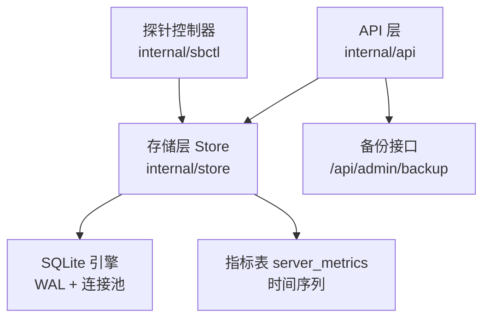
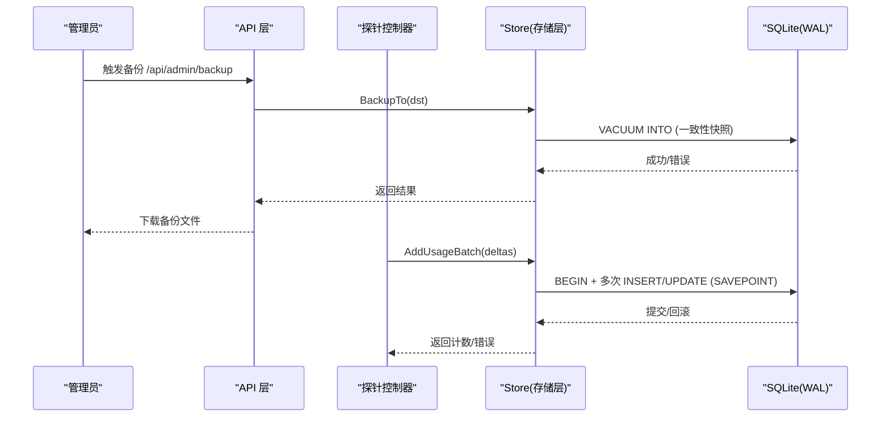
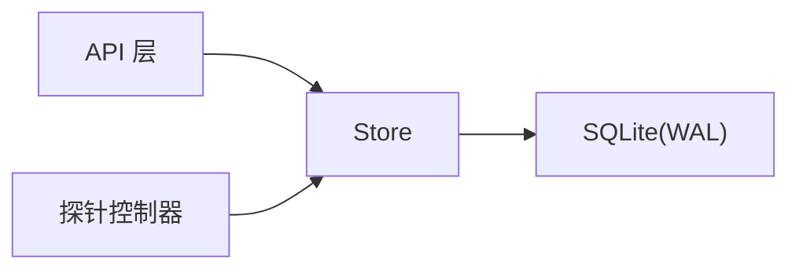

# 数据库性能调优

<cite>
**本文引用的文件**
- [internal/store/store.go](file://internal/store/store.go)
- [internal/store/migrate.go](file://internal/store/migrate.go)
- [internal/store/metrics.go](file://internal/store/metrics.go)
- [internal/store/backup.go](file://internal/store/backup.go)
- [internal/api/backup_admin.go](file://internal/api/backup_admin.go)
- [internal/store/userplans.go](file://internal/store/userplans.go)
- [internal/sbctl/controller.go](file://internal/sbctl/controller.go)
- [internal/api/monitor.go](file://internal/api/monitor.go)
</cite>

## 目录
1. [简介](#简介)
2. [项目结构](#项目结构)
3. [核心组件](#核心组件)
4. [架构总览](#架构总览)
5. [详细组件分析](#详细组件分析)
6. [依赖关系分析](#依赖关系分析)
7. [性能考量](#性能考量)
8. [故障排查指南](#故障排查指南)
9. [结论](#结论)
10. [附录](#附录)

## 简介
本文件面向轻舟面板的 SQLite 数据库，提供系统化的性能调优指南。内容涵盖：
- PRAGMA 设置、连接池与事务处理优化
- 索引设计与查询优化策略（含慢查询分析方法）
- 数据分片与归档策略（历史数据清理与压缩）
- 备份与恢复的性能考虑（全量备份、增量思路与在线维护）
- 监控指标与性能分析工具使用方法

## 项目结构
轻舟面板的数据层位于 internal/store，负责 SQLite 的打开、PRAGMA 配置、迁移、指标写入与清理、备份等；API 层在 internal/api 暴露管理接口（如备份下载）；采集侧通过 internal/sbctl 将探针数据批量落库。

图表来源
- [internal/store/store.go:27-57](file://internal/store/store.go#L27-L57)
- [internal/store/migrate.go:466-498](file://internal/store/migrate.go#L466-L498)
- [internal/api/backup_admin.go:23-76](file://internal/api/backup_admin.go#L23-L76)
- [internal/sbctl/controller.go:577-588](file://internal/sbctl/controller.go#L577-L588)

章节来源
- [internal/store/store.go:27-57](file://internal/store/store.go#L27-L57)
- [internal/store/migrate.go:466-498](file://internal/store/migrate.go#L466-L498)
- [internal/api/backup_admin.go:23-76](file://internal/api/backup_admin.go#L23-L76)
- [internal/sbctl/controller.go:577-588](file://internal/sbctl/controller.go#L577-L588)

## 核心组件
- 数据库连接与 PRAGMA：在 DSN 中启用 WAL、busy_timeout、foreign_keys、synchronous 并强制 _txlock=immediate，配合小连接池避免嵌套读死锁。
- 指标写入与清理：server_metrics 为高频时序表，提供按服务器查询、聚合、裁剪（PruneMetrics）。
- 批量事务：AddUsageBatch 将多身份统计合并到一次事务，内部使用 SAVEPOINT 隔离失败项，显著降低写锁竞争。
- 备份：VACUUM INTO 生成一致快照，支持在线进行，不阻塞读写。

章节来源
- [internal/store/store.go:27-57](file://internal/store/store.go#L27-L57)
- [internal/store/metrics.go:88-165](file://internal/store/metrics.go#L88-L165)
- [internal/store/userplans.go:1010-1033](file://internal/store/userplans.go#L1010-L1033)
- [internal/store/backup.go:10-51](file://internal/store/backup.go#L10-L51)

## 架构总览
下图展示从 API 到存储层的请求路径，以及探针侧批量写入的关键点。

图表来源
- [internal/api/backup_admin.go:23-76](file://internal/api/backup_admin.go#L23-L76)
- [internal/store/backup.go:10-51](file://internal/store/backup.go#L10-L51)
- [internal/store/userplans.go:1010-1033](file://internal/store/userplans.go#L1010-L1033)
- [internal/sbctl/controller.go:577-588](file://internal/sbctl/controller.go#L577-L588)

## 详细组件分析

### SQLite 配置与连接池
- PRAGMA 要点
  - journal_mode=WAL：提升并发读能力，允许一写多读，减少读阻塞。
  - busy_timeout=5000：写冲突时等待，降低 SQLITE_BUSY 失败率。
  - foreign_keys=1：保证外键约束生效。
  - synchronous=NORMAL：在 WAL 模式下平衡安全与性能。
  - _txlock=immediate：BEGIN IMMEDIATE 提前获取写锁，避免读后升级写锁导致的 SQLITE_BUSY_SNAPSHOT。
- 连接池
  - MaxOpenConns=8、MaxIdleConns=8：避免单连接下“事务内回调再读”的死锁；额外连接可读取 WAL 快照，写仍串行化。
- 建议
  - 保持 WAL 模式与上述 PRAGMA；如需更高并发，可适当增大连接池，但需评估磁盘 I/O 与锁争用。
  - 对热点写路径（如用量统计）务必使用批事务+SAVEPOINT，减少锁次数。

章节来源
- [internal/store/store.go:27-57](file://internal/store/store.go#L27-L57)

### 事务处理优化
- 批量用量写入：AddUsageBatch 将一次统计轮询的多身份变更合并到一个事务，内部以 SAVEPOINT 隔离单个身份失败，避免整批丢弃。
- 探针侧调用：controller 收集各节点流量后，统一调用 AddUsageBatch 提交，显著降低 WAL 写锁竞争。
- 建议
  - 所有高吞吐写路径都应采用“批事务 + SAVEPOINT”的模式。
  - 避免在事务中进行耗时外部调用（如网络 IO），必要时拆分事务边界。

章节来源
- [internal/store/userplans.go:1010-1033](file://internal/store/userplans.go#L1010-L1033)
- [internal/sbctl/controller.go:577-588](file://internal/sbctl/controller.go#L577-L588)

### 索引设计与查询优化
- 关键索引
  - users.email、orders.user_id、point_transactions.user_id、nodes.enabled、node_group_members/group_id、user_group_members/group_id 等用于加速常见过滤与关联。
  - 热路径索引：users.client_name、nodes.source_id、sb_inbounds.server_id 支撑高频更新与过滤。
  - 幂等订单：orders(user_id, idempotency_key) 部分唯一索引，防止重复下单。
  - 代理用户名全局唯一：user_plans(proxy_username) 部分唯一索引。
- 指标表索引
  - idx_metrics_server_ts(server_id, ts)：按服务器+时间范围查询。
  - idx_metrics_ts(ts)：仅按时间过滤的裁剪与热力图查询。
- 查询优化实践
  - 使用 LIMIT 限制返回行数（如 ListMetrics 限制 5000 行）。
  - 聚合查询尽量在 SQL 层完成（如 GetLatestMetricsForAll 一次性取最新）。
  - 避免 N+1 查询，改用 IN/GROUP BY 或窗口式查询。
- 慢查询分析方法
  - 结合业务日志定位热点接口（如用量上报、仪表盘汇总）。
  - 检查是否命中合适索引（server_id/ts、ts 单独过滤场景）。
  - 关注大结果集返回（如未加 LIMIT 的全量扫描）。
  - 观察 WAL 增长与 VACUUM 频率，评估碎片与膨胀。

章节来源
- [internal/store/migrate.go:466-498](file://internal/store/migrate.go#L466-L498)
- [internal/store/migrate.go:570-643](file://internal/store/migrate.go#L570-L643)
- [internal/store/metrics.go:136-193](file://internal/store/metrics.go#L136-L193)

### 数据分片与归档策略
- 当前实现
  - 指标表 server_metrics 为单一表，按时间滚动裁剪（PruneMetrics），默认保留天数由调度决定。
  - 无显式分库/分表逻辑。
- 建议方案
  - 时间分片：按月/周创建子表（如 server_metrics_YYYY_MM），归档旧月数据至独立文件或冷存储。
  - 归档与压缩：将历史表导出为压缩格式（如 sqlite3 .dump | gzip），定期清理主库。
  - 冷热分离：热表仅保留最近 N 天，历史数据走归档查询。
  - 注意：分片会增加应用复杂度，需评估运维成本与收益。

章节来源
- [internal/store/metrics.go:160-165](file://internal/store/metrics.go#L160-L165)

### 备份与恢复的性能考虑
- 全量备份
  - 使用 VACUUM INTO 生成一致快照，不阻塞读写，输出单文件便于传输。
  - 管理接口 /api/admin/backup 提供在线下载，临时文件放在数据库同目录以避免 tmpfs OOM。
- 增量备份思路
  - SQLite 原生不支持增量备份；可通过 WAL 文件与主文件的组合策略，或在应用层记录变更流水（CDC 思路）实现近似增量。
  - 若必须增量，可在业务层维护变更日志表，定时合并到归档库。
- 恢复注意事项
  - 恢复前停止写入或使用只读副本；确保密钥（QZ_SECRET_KEY）一致，因敏感字段加密存储。
  - 恢复后执行完整性校验（如 COUNT/抽样比对）。
- 在线维护
  - VACUUM 会重建数据库文件，建议在低峰期执行；WAL 模式下可边读边写，但仍可能短暂影响写延迟。
  - 定期 ANALYZE 更新统计信息（视版本与需求而定）。

章节来源
- [internal/store/backup.go:10-51](file://internal/store/backup.go#L10-L51)
- [internal/api/backup_admin.go:23-76](file://internal/api/backup_admin.go#L23-L76)

### 监控指标与性能分析
- 指标采集与聚合
  - 探针上报 CPU/内存/磁盘/负载/TCP/进程数等，Store 提供插入、最新值获取、列表查询与裁剪。
  - API 层聚合各探针最新指标，计算总量与在线/即将到期数量。
- 可视化
  - 前端 Monitor 页面根据指标渲染仪表盘与趋势图。
- 性能分析建议
  - 关注 PruneMetrics 的执行频率与耗时，避免长事务。
  - 监控 ListAllMetricsSince 的 LIMIT 上限，防止超大响应。
  - 结合系统资源（CPU/IO）与 SQLite 状态（WAL 大小、锁等待）综合判断瓶颈。

章节来源
- [internal/store/metrics.go:1-165](file://internal/store/metrics.go#L1-L165)
- [internal/api/monitor.go:191-241](file://internal/api/monitor.go#L191-L241)

## 依赖关系分析
- 模块耦合
  - API 层依赖 Store 提供的备份、指标、用户/订单等数据访问。
  - 探针控制器依赖 Store 的批量写入接口，集中提交事务。
- 外部依赖
  - SQLite 驱动（modernc.org/sqlite），WAL 模式与 PRAGMA 配置直接影响并发与一致性。
- 潜在风险
  - 高并发写路径若未批量化，易引发锁争用。
  - 大结果集未限制会导致内存与带宽压力。

图表来源
- [internal/store/store.go:27-57](file://internal/store/store.go#L27-L57)
- [internal/sbctl/controller.go:577-588](file://internal/sbctl/controller.go#L577-L588)
- [internal/api/backup_admin.go:23-76](file://internal/api/backup_admin.go#L23-L76)

## 性能考量
- 连接池与事务
  - 合理设置 MaxOpenConns/MaxIdleConns，避免单连接死锁；写路径统一批量化。
- 索引与查询
  - 确保高频过滤列有索引；避免 SELECT *；使用 LIMIT 控制结果集。
- 指标表治理
  - 定期裁剪（PruneMetrics）；对跨服务器聚合查询增加索引覆盖。
- 备份与维护
  - 使用 VACUUM INTO 在线备份；低峰期执行 VACUUM/ANALYZE。
- 容量规划
  - 根据探针频率与保留天数估算磁盘占用；预留 WAL 空间。

[本节为通用指导，无需特定文件引用]

## 故障排查指南
- 常见问题
  - SQLITE_BUSY：检查是否存在长事务或未批量化写；确认 busy_timeout 设置。
  - 备份不一致：不要直接复制 .db 文件；使用 VACUUM INTO。
  - 指标缺失：核对 PruneMetrics 阈值与探针上报间隔。
- 诊断步骤
  - 查看慢查询与热点接口（用量上报、仪表盘聚合）。
  - 检查索引是否命中（server_id/ts、ts 单独过滤）。
  - 监控 WAL 文件大小与增长速率，评估是否需要归档或调整保留策略。
- 恢复流程
  - 停止写入 -> 导入备份 -> 校验数据 -> 重启服务。

章节来源
- [internal/store/backup.go:10-51](file://internal/store/backup.go#L10-L51)
- [internal/store/metrics.go:160-165](file://internal/store/metrics.go#L160-L165)

## 结论
轻舟面板的 SQLite 已针对小规模单进程部署做了基础优化：WAL、合理的 PRAGMA、小连接池与批事务。在此基础上，建议持续完善索引覆盖、严格限制结果集、定期归档指标数据，并使用 VACUUM INTO 进行在线备份。对于更大规模场景，可引入时间分片与冷热分离，进一步提升可维护性与性能。

[本节为总结性内容，无需特定文件引用]

## 附录
- 常用命令参考（概念性）
  - 备份：通过 /api/admin/backup 下载一致快照。
  - 裁剪：调用 PruneMetrics 删除过期指标。
  - 维护：低峰期执行 VACUUM/ANALYZE（视版本与需求）。
- 监控要点
  - 指标表大小与增长速率
  - WAL 文件大小
  - 锁等待与超时事件
  - 接口 P95/P99 延迟

[本节为补充说明，无需特定文件引用]
