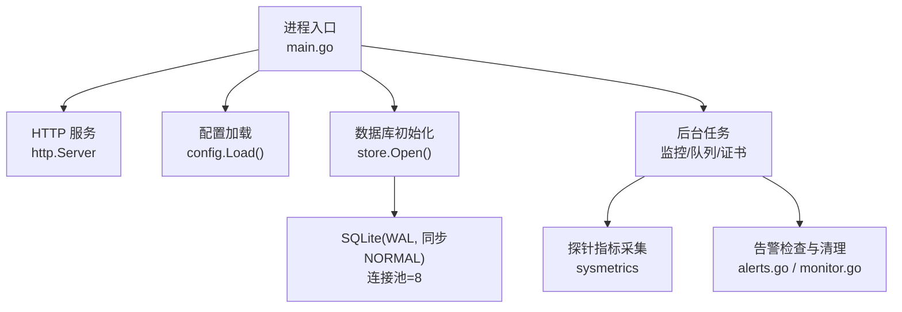
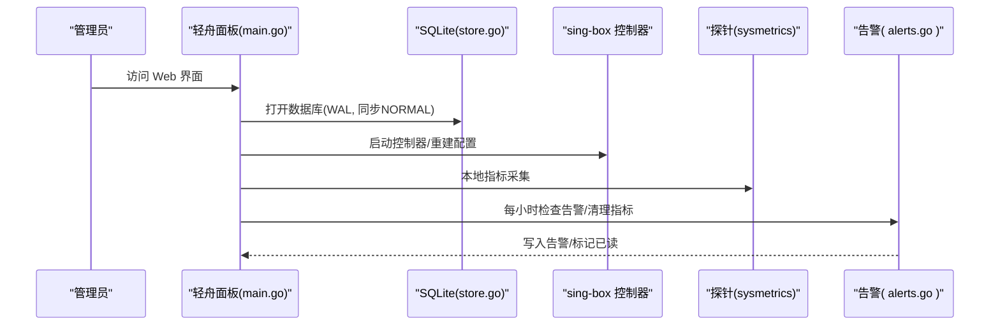
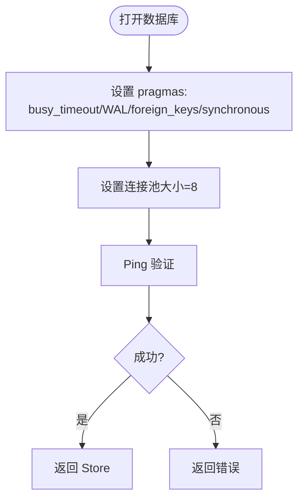
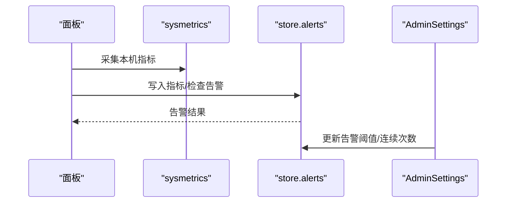
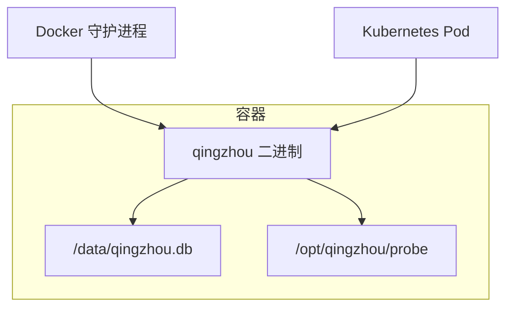
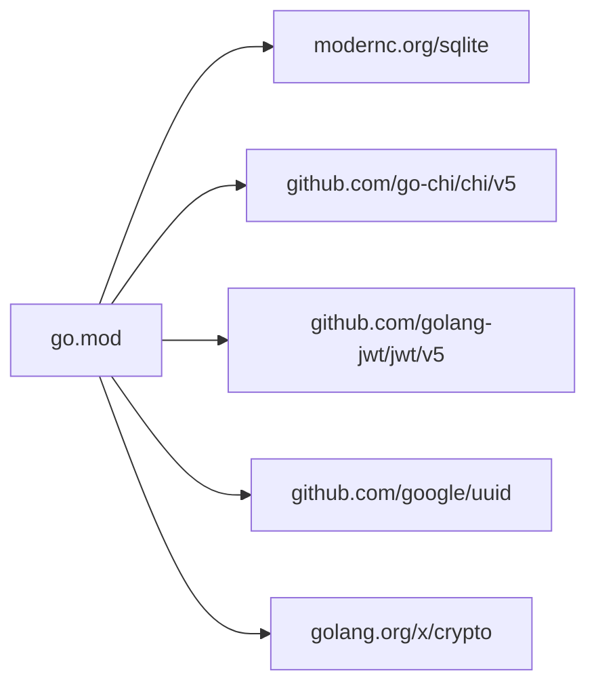

# 系统资源优化

<cite>
**本文引用的文件**
- [main.go](file://main.go)
- [go.mod](file://go.mod)
- [Dockerfile](file://Dockerfile)
- [docker-compose.yml](file://docker-compose.yml)
- [internal/config/config.go](file://internal/config/config.go)
- [internal/store/store.go](file://internal/store/store.go)
- [deploy/qingzhou.service](file://deploy/qingzhou.service)
- [docs/部署与配置手册.md](file://docs/部署与配置手册.md)
- [internal/sysmetrics/sysmetrics.go](file://internal/sysmetrics/sysmetrics.go)
- [internal/api/monitor.go](file://internal/api/monitor.go)
- [internal/store/alerts.go](file://internal/store/alerts.go)
- [frontend/src/views/AdminSettings.vue](file://frontend/src/views/AdminSettings.vue)
- [internal/assets/install-singbox.sh](file://internal/assets/install-singbox.sh)
</cite>

## 目录
1. [简介](#简介)
2. [项目结构](#项目结构)
3. [核心组件](#核心组件)
4. [架构总览](#架构总览)
5. [详细组件分析](#详细组件分析)
6. [依赖关系分析](#依赖关系分析)
7. [性能考量](#性能考量)
8. [故障排查指南](#故障排查指南)
9. [结论](#结论)
10. [附录](#附录)

## 简介
本指南面向轻舟面板的运维与平台工程团队，聚焦“系统资源优化”：围绕 CPU、内存、磁盘空间进行合理配置建议；给出不同规模部署的资源需求估算；详细说明 Go 运行时参数调优（GOMAXPROCS、GC 等）；解释 SQLite 存储层优化（WAL、缓存、同步策略）；提供容器化部署（Docker/Kubernetes）的资源限制最佳实践；并给出资源监控指标与告警阈值设置建议。

## 项目结构
轻舟面板为单二进制应用（Go + 内嵌前端），使用 SQLite 作为数据持久化，通过内置控制器管理 sing-box 节点，并通过探针采集服务器指标。关键入口与配置如下：
- 程序入口：启动 HTTP 服务、打开 SQLite、初始化后台任务（证书续期、队列推进、监控任务等）。
- 配置加载：从环境变量 QZ_* 读取监听地址、数据库路径、管理员账号等。
- 存储层：SQLite 以 WAL 模式运行，连接池大小固定，开启外键约束与同步策略。
- 容器化：多阶段构建镜像，暴露 8081 端口，健康检查指向根路径。
- 系统服务：systemd 单元定义工作目录、环境变量文件、重启策略与安全加固。

图表来源
- [main.go:25-142](file://main.go#L25-L142)
- [internal/config/config.go:14-29](file://internal/config/config.go#L14-L29)
- [internal/store/store.go:27-57](file://internal/store/store.go#L27-L57)
- [internal/api/monitor.go:889-919](file://internal/api/monitor.go#L889-L919)

章节来源
- [main.go:25-142](file://main.go#L25-L142)
- [internal/config/config.go:14-29](file://internal/config/config.go#L14-L29)
- [internal/store/store.go:27-57](file://internal/store/store.go#L27-L57)
- [Dockerfile:36-54](file://Dockerfile#L36-L54)
- [deploy/qingzhou.service:5-18](file://deploy/qingzhou.service#L5-L18)

## 核心组件
- 进程与生命周期：启动时加载配置、打开数据库、执行迁移与种子数据、启动 sing-box 控制器与后台任务、优雅关闭。
- 配置与环境变量：QZ_LISTEN、QZ_DB、QZ_PUBLIC_BASE、QZ_SECRET_KEY、QZ_ADMIN_USER/PASS 等。
- 存储层：SQLite 以 WAL 模式运行，busy_timeout 防忙锁，synchronous NORMAL 平衡安全与性能，连接池 8。
- 监控与告警：探针上报 CPU/内存/磁盘/网络/负载；后台每小时检查告警并清理历史指标与流量样本。
- 容器与服务：Alpine 运行镜像，暴露 8081，健康检查；systemd 单元限定工作目录与只读文件系统。

章节来源
- [main.go:25-142](file://main.go#L25-L142)
- [internal/config/config.go:14-29](file://internal/config/config.go#L14-L29)
- [internal/store/store.go:27-57](file://internal/store/store.go#L27-L57)
- [internal/api/monitor.go:889-919](file://internal/api/monitor.go#L889-L919)
- [Dockerfile:36-54](file://Dockerfile#L36-L54)
- [deploy/qingzhou.service:5-18](file://deploy/qingzhou.service#L5-L18)

## 架构总览
轻舟面板在单机或中心机部署，负责用户/套餐/订阅/统计/可视化管理；落地 sing-box 由面板生成配置并通过 v2ray_api 采集每用户流量。探针采集宿主机的 CPU/内存/磁盘/网络/负载，面板定时检查告警并清理历史数据。

图表来源
- [main.go:25-142](file://main.go#L25-L142)
- [internal/store/store.go:27-57](file://internal/store/store.go#L27-L57)
- [internal/sysmetrics/sysmetrics.go:16-38](file://internal/sysmetrics/sysmetrics.go#L16-L38)
- [internal/api/monitor.go:889-919](file://internal/api/monitor.go#L889-L919)
- [internal/store/alerts.go:99-112](file://internal/store/alerts.go#L99-L112)

## 详细组件分析

### 组件A：SQLite 存储层优化
- 事务与并发：DSN 中启用 busy_timeout(5000)、journal_mode=WAL、foreign_keys=1、synchronous=NORMAL，并使用 _txlock=immediate 提前获取写锁，避免读→写升级导致 SQLITE_BUSY_SNAPSHOT。
- 连接池：SetMaxOpenConns(8)、SetMaxIdleConns(8)，允许嵌套读在 WAL 快照上并行，写操作仍串行化。
- 备份与体积：支持在线热备（sqlite3 .backup），面板也提供一致性快照导出（VACUUM INTO 单文件）。

图表来源
- [internal/store/store.go:27-57](file://internal/store/store.go#L27-L57)

章节来源
- [internal/store/store.go:27-57](file://internal/store/store.go#L27-L57)
- [docs/部署与配置手册.md:128-130](file://docs/部署与配置手册.md#L128-L130)

### 组件B：监控与告警
- 指标采集：sysmetrics 读取 CPU/内存/磁盘/网络/负载等，统一 JSON 格式。
- 告警规则：支持 CPU/内存/磁盘/离线/到期等类型，具备连续命中次数（streak）防抖动机制，可在设置页调整阈值与连续次数。
- 维护任务：每小时检查告警、清理历史指标与流量样本，防止表膨胀影响查询与 WAL checkpoint。

图表来源
- [internal/sysmetrics/sysmetrics.go:16-38](file://internal/sysmetrics/sysmetrics.go#L16-L38)
- [internal/api/monitor.go:889-919](file://internal/api/monitor.go#L889-L919)
- [internal/store/alerts.go:99-112](file://internal/store/alerts.go#L99-L112)
- [frontend/src/views/AdminSettings.vue:217-234](file://frontend/src/views/AdminSettings.vue#L217-L234)

章节来源
- [internal/sysmetrics/sysmetrics.go:16-38](file://internal/sysmetrics/sysmetrics.go#L16-L38)
- [internal/api/monitor.go:889-919](file://internal/api/monitor.go#L889-L919)
- [internal/store/alerts.go:99-112](file://internal/store/alerts.go#L99-L112)
- [frontend/src/views/AdminSettings.vue:217-234](file://frontend/src/views/AdminSettings.vue#L217-L234)

### 组件C：容器化与服务编排
- Docker 镜像：多阶段构建，最终运行于 alpine:3.20，暴露 8081，健康检查 wget 根路径。
- Compose：命名卷持久化数据库，环境变量覆盖监听地址、公开基址、密钥等。
- systemd：限定工作目录、环境变量文件、最小权限与只读系统目录。

图表来源
- [Dockerfile:36-54](file://Dockerfile#L36-L54)
- [docker-compose.yml:10-37](file://docker-compose.yml#L10-L37)
- [deploy/qingzhou.service:5-18](file://deploy/qingzhou.service#L5-L18)

章节来源
- [Dockerfile:36-54](file://Dockerfile#L36-L54)
- [docker-compose.yml:10-37](file://docker-compose.yml#L10-L37)
- [deploy/qingzhou.service:5-18](file://deploy/qingzhou.service#L5-L18)

### 组件D：网络内核调优（落地节点）
- 脚本自动应用 sysctl 调优：fq/bbr、收发缓冲区、somaxconn、tcp_fastopen、notsent_lowat、文件句柄上限等。
- 适用于高并发 QUIC/hy2 场景，减少丢包与延迟。

章节来源
- [internal/assets/install-singbox.sh:51-81](file://internal/assets/install-singbox.sh#L51-L81)

## 依赖关系分析
- Go 版本与模块：go.mod 指定 Go 1.25.0，依赖 modernc.org/sqlite（纯 Go 实现，无 CGO），便于跨平台与容器化。
- 主要外部依赖：chi（路由）、jwt（鉴权）、uuid、crypto、net、yaml 等。
- 运行时特性：无 CGO，利于静态链接与最小镜像。

图表来源
- [go.mod:1-26](file://go.mod#L1-L26)

章节来源
- [go.mod:1-26](file://go.mod#L1-L26)

## 性能考量
- CPU 与线程模型
  - 默认 GOMAXPROCS 等于机器逻辑核数，适合大多数场景。若面板承载大量并发请求或频繁触发 sing-box 配置重建，可考虑将 GOMAXPROCS 设置为略小于物理核数，留出余量给 sing-box 子进程。
  - 在高并发下，观察 goroutine 数量与阻塞点（如 DB 连接池、HTTP 读写超时），必要时调整 http.Server 的 Read/Write/IdleTimeout。
- 内存与 GC
  - 默认 GC 目标为低停顿，适合交互式面板。若出现内存尖峰（如批量导入/统计聚合），可通过 GOGC 提高阈值降低 GC 频率，或在业务侧分批处理。
  - 关注堆增长趋势与 GC 暂停时间，结合 pprof 定位热点对象。
- 磁盘 I/O 与 WAL
  - 已启用 WAL 与 synchronous NORMAL，兼顾一致性与吞吐。对高频写入场景，确保底层磁盘具备足够 IOPS；定期备份与清理历史指标/流量样本，避免 WAL checkpoint 成本上升。
- 连接池与并发
  - 连接池大小 8 适合中小规模；当并发写增多且存在嵌套读时，可适当提升 MaxOpenConns，但需评估 SQLite 锁竞争与磁盘压力。
- 网络栈
  - 落地节点启用 fq/bbr、增大缓冲区与 backlog，有助于高并发与弱网环境下的稳定性。

[本节为通用指导，不直接分析具体文件]

## 故障排查指南
- 面板无法访问
  - 检查 QZ_LISTEN 是否为回环地址且未配置反代；确认防火墙与安全组放行端口。
- 数据库繁忙或写入失败
  - 确认 WAL 模式与 busy_timeout 生效；检查是否有长时间事务或外部工具独占写锁。
- 指标与告警异常
  - 确认探针安装与 QZ_PROBE_DIR 正确；查看每小时维护任务是否正常运行；调整告警连续次数以避免抖动。
- 日志与状态
  - 使用 journalctl 查看服务日志；通过面板“监控管理”查看各节点状态与告警详情。

章节来源
- [docs/部署与配置手册.md:237-261](file://docs/部署与配置手册.md#L237-L261)
- [internal/api/monitor.go:889-919](file://internal/api/monitor.go#L889-L919)
- [internal/store/alerts.go:99-112](file://internal/store/alerts.go#L99-L112)

## 结论
轻舟面板采用轻量架构与 SQLite 存储，配合 WAL 与合理的连接池、同步策略，能在中小规模部署中提供稳定高效的体验。通过合理的 CPU/内存/磁盘资源配置、Go 运行时调优、容器化资源限制以及完善的监控告警体系，可实现高可用与可观测性。建议在扩容前基于实际负载进行压测，逐步调整参数以获得最佳性价比。

## 附录

### A. 不同规模部署的资源需求估算
- 小型（≤50 用户，少量节点）
  - CPU：1-2 核
  - 内存：1-2 GiB
  - 磁盘：≥10 GiB（含数据库与备份）
- 中型（50-500 用户，若干节点）
  - CPU：2-4 核
  - 内存：2-4 GiB
  - 磁盘：≥20 GiB（考虑指标与流量样本保留）
- 大型（>500 用户，多节点）
  - CPU：4+ 核
  - 内存：4+ GiB
  - 磁盘：≥50 GiB（加强备份与归档策略）

[本节为概念性建议，不直接分析具体文件]

### B. Go 运行时参数调优建议
- GOMAXPROCS
  - 默认值通常合适；若面板承担高并发或频繁触发重建，可设为略小于逻辑核数，为 sing-box 子进程留余量。
- GC 参数
  - GOGC：默认 100；若出现内存尖峰，可提高至 120-200 降低 GC 频率；若追求更低延迟，可降低至 80-100。
  - GOMEMLIMIT：在内存受限环境中设置，防止 OOM。
- 其他
  - GODEBUG：调试时开启 goroutine、gc、sched 等开关；生产环境谨慎使用。
  - 结合 pprof 观察 goroutine 泄漏、CPU 热点与内存分配。

[本节为通用指导，不直接分析具体文件]

### C. SQLite 存储层优化要点
- WAL 模式：已启用，允许一写多读，减少读阻塞。
- 同步策略：synchronous NORMAL，平衡一致性与性能。
- 连接池：当前为 8；可根据并发写与嵌套读情况微调。
- 备份：在线热备与一致性快照导出，建议每日备份并保留 7 天。

章节来源
- [internal/store/store.go:27-57](file://internal/store/store.go#L27-L57)
- [docs/部署与配置手册.md:128-130](file://docs/部署与配置手册.md#L128-L130)

### D. 容器化部署资源限制示例
- Docker Compose
  - 通过 environment 设置 QZ_LISTEN、QZ_DB、QZ_PUBLIC_BASE、QZ_SECRET_KEY 等。
  - 使用命名卷持久化 /data。
- Kubernetes
  - 使用 Deployment 管理副本，设置 requests/limits 控制 CPU/内存。
  - 使用 ConfigMap/Secret 注入环境变量，Volume 挂载持久化存储。
  - 健康检查使用 liveness/readiness probe 指向 /。

章节来源
- [docker-compose.yml:10-37](file://docker-compose.yml#L10-L37)
- [Dockerfile:36-54](file://Dockerfile#L36-L54)

### E. 监控指标与告警阈值建议
- 指标
  - CPU 使用率、内存使用率、磁盘使用率、网络上下行速率、系统负载、TCP 连接数、进程数、主机名/内核/架构。
- 告警阈值
  - CPU/内存/磁盘：建议在 70%-90% 区间设置警告/严重两级阈值。
  - 连续命中次数：根据业务容忍度设置（默认防抖），极端场景可设为 1 立即告警。
- 维护任务
  - 每小时检查告警、清理历史指标与流量样本，避免数据库膨胀。

章节来源
- [internal/sysmetrics/sysmetrics.go:16-38](file://internal/sysmetrics/sysmetrics.go#L16-L38)
- [frontend/src/views/AdminSettings.vue:217-234](file://frontend/src/views/AdminSettings.vue#L217-L234)
- [internal/api/monitor.go:889-919](file://internal/api/monitor.go#L889-L919)
- [internal/store/alerts.go:99-112](file://internal/store/alerts.go#L99-L112)
