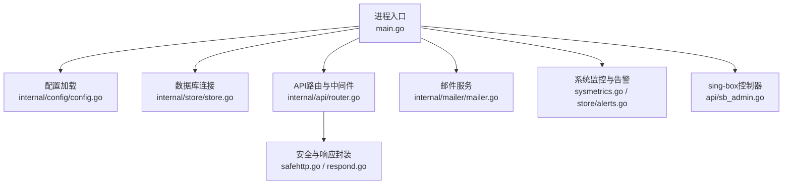
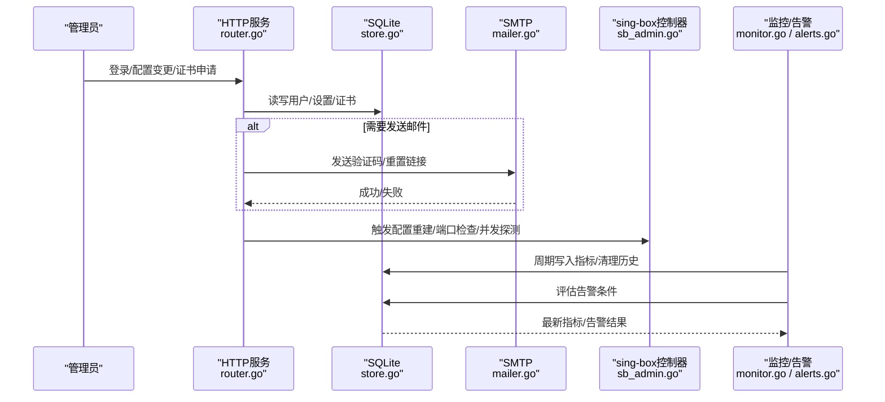
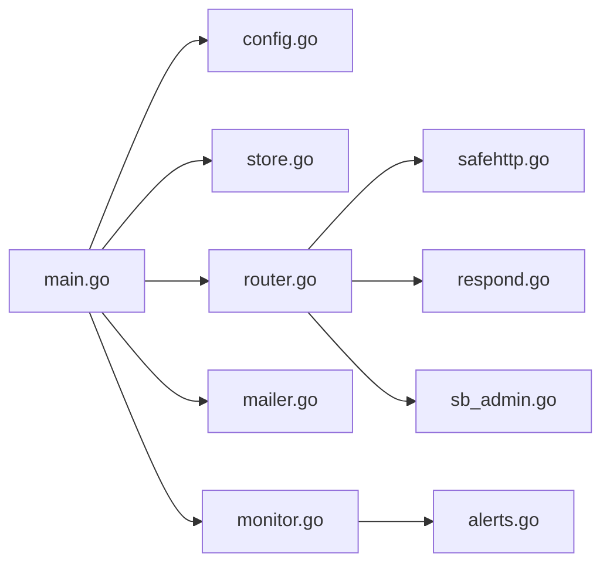

# 故障排查

<cite>
**本文引用的文件**   
- [main.go](file://main.go)
- [config.go](file://internal/config/config.go)
- [router.go](file://internal/api/router.go)
- [jwt.go](file://internal/auth/jwt.go)
- [mailer.go](file://internal/mailer/mailer.go)
- [store.go](file://internal/store/store.go)
- [sysmetrics.go](file://internal/sysmetrics/sysmetrics.go)
- [safehttp.go](file://internal/api/safehttp.go)
- [respond.go](file://internal/api/respond.go)
- [monitor.go](file://internal/api/monitor.go)
- [alerts.go](file://internal/store/alerts.go)
- [sb_admin.go](file://internal/api/sb_admin.go)
- [qingzhou.env.example](file://deploy/qingzhou.env.example)
</cite>

## 目录
1. [简介](#简介)
2. [项目结构](#项目结构)
3. [核心组件](#核心组件)
4. [架构总览](#架构总览)
5. [详细组件分析](#详细组件分析)
6. [依赖关系分析](#依赖关系分析)
7. [性能考量](#性能考量)
8. [故障排查指南](#故障排查指南)
9. [结论](#结论)
10. [附录](#附录)

## 简介
本手册面向轻舟面板的运维与管理员，聚焦“如何快速定位并解决常见问题”。内容覆盖服务启动失败、数据库连接错误、证书申请问题、网络连通性与端口冲突、认证授权与JWT验证、邮件SMTP故障、性能问题定位与监控指标、以及紧急恢复与降级方案。所有方法均基于代码实现与内置能力，便于在真实环境中落地执行。

## 项目结构
轻舟面板采用单二进制进程模式：主进程负责加载配置、打开SQLite数据库、初始化API路由、启动后台任务（监控、证书续期、队列推进等），并通过内嵌HTTP服务器对外提供服务。关键模块包括：
- 配置与环境变量：通过环境变量注入监听地址、数据库路径、管理员账号、SMTP等
- API路由与中间件：统一响应格式、请求体大小限制、超时、压缩、鉴权与限流
- 数据层：SQLite存储，含WAL、外键、事务策略与设置缓存
- 邮件服务：SMTP发送，支持隐式TLS与STARTTLS，带超时保护
- 系统监控：本地指标采集与告警聚合
- sing-box控制器：配置重建、节点同步、端口检查、并发探测等

**图表来源**
- [main.go:25-142](file://main.go#L25-L142)
- [config.go:14-29](file://internal/config/config.go#L14-L29)
- [store.go:27-58](file://internal/store/store.go#L27-L58)
- [router.go:132-387](file://internal/api/router.go#L132-L387)
- [safehttp.go:27-56](file://internal/api/safehttp.go#L27-L56)
- [respond.go:11-25](file://internal/api/respond.go#L11-L25)
- [mailer.go:42-111](file://internal/mailer/mailer.go#L42-L111)
- [sysmetrics.go:16-38](file://internal/sysmetrics/sysmetrics.go#L16-L38)
- [alerts.go:247-317](file://internal/store/alerts.go#L247-L317)
- [sb_admin.go:146-179](file://internal/api/sb_admin.go#L146-L179)

**章节来源**
- [main.go:25-142](file://main.go#L25-L142)
- [config.go:14-29](file://internal/config/config.go#L14-L29)
- [store.go:27-58](file://internal/store/store.go#L27-L58)
- [router.go:132-387](file://internal/api/router.go#L132-L387)

## 核心组件
- 进程与生命周期：主进程加载配置、打开数据库、初始化API、启动后台任务、优雅关闭
- 配置与环境：监听地址、数据库路径、管理员账号、公开访问地址、探针目录、更新源、SMTP等
- 数据存储：SQLite + WAL，设置缓存，敏感信息加密存储
- 邮件服务：SMTP连接、认证、TLS协商、超时控制
- 监控告警：本地指标采集、周期性清理、告警聚合与去抖
- sing-box集成：证书管理、入站/出站配置、端口检查、并发探测、异步重建与状态查询

**章节来源**
- [main.go:25-142](file://main.go#L25-L142)
- [config.go:14-29](file://internal/config/config.go#L14-L29)
- [store.go:27-58](file://internal/store/store.go#L27-L58)
- [mailer.go:42-111](file://internal/mailer/mailer.go#L42-L111)
- [monitor.go:889-919](file://internal/api/monitor.go#L889-L919)
- [alerts.go:247-317](file://internal/store/alerts.go#L247-L317)
- [sb_admin.go:146-179](file://internal/api/sb_admin.go#L146-L179)

## 架构总览
轻舟面板以单进程为中心，围绕HTTP API暴露管理能力；数据持久化使用SQLite；外部依赖包括SMTP、sing-box（本地或远程）、可选探针。后台任务负责监控、清理、证书续期与队列推进。

**图表来源**
- [router.go:132-387](file://internal/api/router.go#L132-L387)
- [store.go:27-58](file://internal/store/store.go#L27-L58)
- [mailer.go:42-111](file://internal/mailer/mailer.go#L42-L111)
- [sb_admin.go:146-179](file://internal/api/sb_admin.go#L146-L179)
- [monitor.go:889-919](file://internal/api/monitor.go#L889-L919)
- [alerts.go:247-317](file://internal/store/alerts.go#L247-L317)

## 详细组件分析

### 服务启动失败诊断
- 检查监听地址与端口是否被占用：确认QZ_LISTEN值与宿主机端口占用情况
- 检查数据库文件路径与权限：QZ_DB指向的路径需可写，确保WAL模式正常
- 检查首次运行管理员密码生成：若未设置QZ_ADMIN_PASS，首次会生成随机密码并记录到日志
- 检查JWT密钥缺失：若seed后未设置jwt_secret，将直接终止
- 检查敏感密钥不一致：若QZ_SECRET_KEY变更后无法解密已保存的密码，会提示警告并拒绝部署受影响配置

建议步骤：
1. 查看进程启动日志，关注“open db”“migrate”“seed”“listen”等关键字
2. 核对环境变量QZ_LISTEN、QZ_DB、QZ_ADMIN_USER、QZ_ADMIN_PASS、QZ_SECRET_KEY
3. 若出现“database is closed”类错误，确认优雅关闭期间后台任务是否仍在访问DB

**章节来源**
- [main.go:25-142](file://main.go#L25-L142)
- [config.go:14-29](file://internal/config/config.go#L14-L29)
- [store.go:27-58](file://internal/store/store.go#L27-L58)

### 数据库连接错误处理
- 常见原因：路径不可写、磁盘空间不足、SQLite Busy、WAL异常
- 默认启用WAL与外键约束，设置busy_timeout降低瞬时冲突影响
- 连接池大小设置为8，避免嵌套读死锁
- 备份接口可用于导出数据库快照

建议步骤：
1. 检查文件系统权限与剩余空间
2. 观察日志中是否有“sqlite busy”“journal mode”相关错误
3. 使用备份接口下载当前数据库进行离线分析
4. 如频繁阻塞，考虑调整业务写入频率或增加资源

**章节来源**
- [store.go:27-58](file://internal/store/store.go#L27-L58)
- [backup_admin.go:33-76](file://internal/api/backup_admin.go#L33-L76)

### 证书申请问题（ACME/自签）
- ACME在线申请仅支持本机，远程服务器需在目标机器上自行申请或粘贴证书
- 支持DNS-01（Cloudflare）、HTTP-01、Webroot等方式
- 自签证书适用于允许指纹校验或不校验证书的客户端场景
- 证书申请成功后会自动保存并可引用到TLS配置中

建议步骤：
1. 确认选择正确的验证方式并填写必要参数（如CF Token、Webroot）
2. 检查域名解析与端口可达性（HTTP-01需公网可达）
3. 若失败，查看返回的错误信息与日志
4. 对仅需内网或特定客户端的场景，优先使用自签+指纹校验

**章节来源**
- [sb_admin.go:146-179](file://internal/api/sb_admin.go#L146-L179)

### 网络连通性与端口冲突排查
- 提供端口连通性检查接口，用于判断指定server_id与端口是否可达
- 提供并发探测接口，用于评估出口代理的健康度与延迟分布
- 安全抓取客户端：禁止访问内网地址，防止SSRF

建议步骤：
1. 使用端口检查接口验证监听端口是否开放
2. 使用并发探测查看成功率、延迟与错误类型
3. 若出现“拒绝连接到内网地址”，说明触发了安全拦截，需修正目标地址
4. 结合系统防火墙与反向代理配置，确认端口未被阻断

**章节来源**
- [sb_admin.go:1357-1393](file://internal/api/sb_admin.go#L1357-L1393)
- [safehttp.go:27-56](file://internal/api/safehttp.go#L27-L56)

### 认证授权与JWT令牌验证
- JWT使用HS256签名，包含用户ID、角色、签发时间、过期时间与唯一ID
- 登录成功后颁发令牌，后续请求携带令牌进行鉴权
- 若令牌无效或签名不匹配，将返回错误

建议步骤：
1. 确认登录接口返回的令牌有效且未过期
2. 检查服务端JWT密钥是否一致（首次运行由seed生成）
3. 若出现“invalid token”，检查客户端是否正确传递Authorization头
4. 如需调试，可在浏览器开发者工具中查看令牌内容与有效期

**章节来源**
- [jwt.go:16-42](file://internal/auth/jwt.go#L16-L42)
- [router.go:177-208](file://internal/api/router.go#L177-L208)

### 邮件服务配置与SMTP故障处理
- SMTP支持隐式TLS（465）与STARTTLS（587/25），可配置用户名/密码/发件人/安全方式
- 若未配置SMTP，验证码/重置链接将记录到日志而非发送
- 发送过程带有超时保护，避免长时间阻塞
- 若服务器不支持STARTTLS，将明确报错以避免明文传输

建议步骤：
1. 根据供应商要求设置Security为ssl或starttls
2. 检查端口、用户名、密码与发件人地址
3. 若失败，查看错误信息是否为“未提供 STARTTLS”
4. 未配置时，可通过日志查看验证码/重置链接内容

**章节来源**
- [mailer.go:42-111](file://internal/mailer/mailer.go#L42-L111)
- [main.go:144-169](file://main.go#L144-L169)

### 性能问题定位与监控指标
- 系统指标包括CPU、内存、交换分区、磁盘、网络、负载、TCP连接数、进程数、运行时间等
- 定期清理历史指标与流量样本，避免数据库膨胀
- 告警阈值可配置，支持高CPU、高内存、磁盘满载、即将到期、已到期、离线等
- 本地节点也会参与告警评估，避免面板自身资源耗尽无感知

建议步骤：
1. 查看监控仪表盘中的CPU、内存、磁盘、网络趋势
2. 关注告警列表中的离线、高负载、磁盘满载等条目
3. 调整告警阈值以适应实际负载
4. 结合并发探测与端口检查，定位出口代理或上游链路问题

**章节来源**
- [sysmetrics.go:16-38](file://internal/sysmetrics/sysmetrics.go#L16-L38)
- [monitor.go:889-919](file://internal/api/monitor.go#L889-L919)
- [alerts.go:247-317](file://internal/store/alerts.go#L247-L317)

## 依赖关系分析
- 主进程依赖配置、存储、API、邮件、监控、sing-box控制器
- API路由依赖安全中间件与统一响应封装
- 存储依赖SQLite驱动与WAL策略
- 邮件服务依赖SMTP服务器与TLS环境
- 监控依赖系统文件读取与定时任务

**图表来源**
- [main.go:25-142](file://main.go#L25-L142)
- [config.go:14-29](file://internal/config/config.go#L14-L29)
- [store.go:27-58](file://internal/store/store.go#L27-L58)
- [router.go:132-387](file://internal/api/router.go#L132-L387)
- [safehttp.go:27-56](file://internal/api/safehttp.go#L27-L56)
- [respond.go:11-25](file://internal/api/respond.go#L11-L25)
- [mailer.go:42-111](file://internal/mailer/mailer.go#L42-L111)
- [monitor.go:889-919](file://internal/api/monitor.go#L889-L919)
- [alerts.go:247-317](file://internal/store/alerts.go#L247-L317)
- [sb_admin.go:146-179](file://internal/api/sb_admin.go#L146-L179)

**章节来源**
- [main.go:25-142](file://main.go#L25-L142)
- [router.go:132-387](file://internal/api/router.go#L132-L387)

## 性能考量
- 请求体大小限制：防止恶意大请求导致内存压力
- 超时与压缩：全局超时与Gzip压缩提升带宽效率
- 数据库WAL与连接池：提高并发读能力，减少写冲突
- 指标清理：定期清理历史指标与流量样本，避免DB膨胀
- 并发探测：评估出口代理健康度，识别慢连接与超时

[本节为通用性能指导，无需具体文件引用]

## 故障排查指南

### 服务启动失败
- 检查监听地址与端口占用
- 检查数据库路径与权限
- 检查首次管理员密码与JWT密钥
- 检查敏感密钥一致性

**章节来源**
- [main.go:25-142](file://main.go#L25-L142)
- [config.go:14-29](file://internal/config/config.go#L14-L29)
- [store.go:27-58](file://internal/store/store.go#L27-L58)

### 数据库连接错误
- 检查文件系统与权限
- 观察WAL与Busy错误
- 使用备份接口导出数据库

**章节来源**
- [store.go:27-58](file://internal/store/store.go#L27-L58)
- [backup_admin.go:33-76](file://internal/api/backup_admin.go#L33-L76)

### 证书申请问题
- 选择正确验证方式并填写参数
- 检查域名解析与端口可达
- 必要时使用自签证书

**章节来源**
- [sb_admin.go:146-179](file://internal/api/sb_admin.go#L146-L179)

### 网络连通性与端口冲突
- 使用端口检查接口验证监听端口
- 使用并发探测评估出口代理健康度
- 检查安全抓取拦截

**章节来源**
- [sb_admin.go:1357-1393](file://internal/api/sb_admin.go#L1357-L1393)
- [safehttp.go:27-56](file://internal/api/safehttp.go#L27-L56)

### 认证授权与JWT验证
- 确认令牌有效且未过期
- 检查JWT密钥一致性
- 调试Authorization头传递

**章节来源**
- [jwt.go:16-42](file://internal/auth/jwt.go#L16-L42)
- [router.go:177-208](file://internal/api/router.go#L177-L208)

### 邮件服务配置与SMTP故障
- 设置Security为ssl或starttls
- 检查端口、用户名、密码、发件人
- 查看“未提供 STARTTLS”错误

**章节来源**
- [mailer.go:42-111](file://internal/mailer/mailer.go#L42-L111)
- [main.go:144-169](file://main.go#L144-L169)

### 性能问题定位与监控指标
- 查看监控仪表盘趋势
- 关注告警列表
- 调整告警阈值
- 结合并发探测定位问题

**章节来源**
- [sysmetrics.go:16-38](file://internal/sysmetrics/sysmetrics.go#L16-L38)
- [monitor.go:889-919](file://internal/api/monitor.go#L889-L919)
- [alerts.go:247-317](file://internal/store/alerts.go#L247-L317)

### 紧急恢复与降级处理
- 使用备份接口下载数据库快照
- 若敏感密钥变更导致无法解密，恢复旧密钥或重新输入密码
- 对不可达节点，使用异步重建与重推机制
- 临时关闭非关键功能（如邮件）以保证核心服务可用

**章节来源**
- [backup_admin.go:33-76](file://internal/api/backup_admin.go#L33-L76)
- [main.go:65-71](file://main.go#L65-L71)
- [sb_admin.go:1380-1393](file://internal/api/sb_admin.go#L1380-L1393)

## 结论
轻舟面板提供了完善的启动流程、数据存储、邮件服务、监控告警与sing-box集成能力。通过环境变量与设置项灵活配置，结合端口检查、并发探测与告警系统，能够快速定位并解决大多数常见问题。建议在部署前完成环境检查与最小化配置，并在运行中持续观察监控与告警，及时清理历史数据与调整阈值，确保系统稳定高效。

## 附录

### 环境变量参考
- QZ_LISTEN：监听地址与端口
- QZ_DB：数据库文件路径
- QZ_PUBLIC_BASE：面板对外访问地址
- QZ_PROBE_DIR：探针二进制目录
- QZ_UPDATE_REPO / QZ_UPDATE_GITHUB_TOKEN：在线更新仓库与Token
- QZ_ADMIN_USER / QZ_ADMIN_PASS：首次管理员账号与密码
- QZ_SECRET_KEY：敏感设置加密主密钥
- QZ_SMTP_*：SMTP主机、端口、用户、密码、发件人与安全方式

**章节来源**
- [qingzhou.env.example:1-43](file://deploy/qingzhou.env.example#L1-L43)
