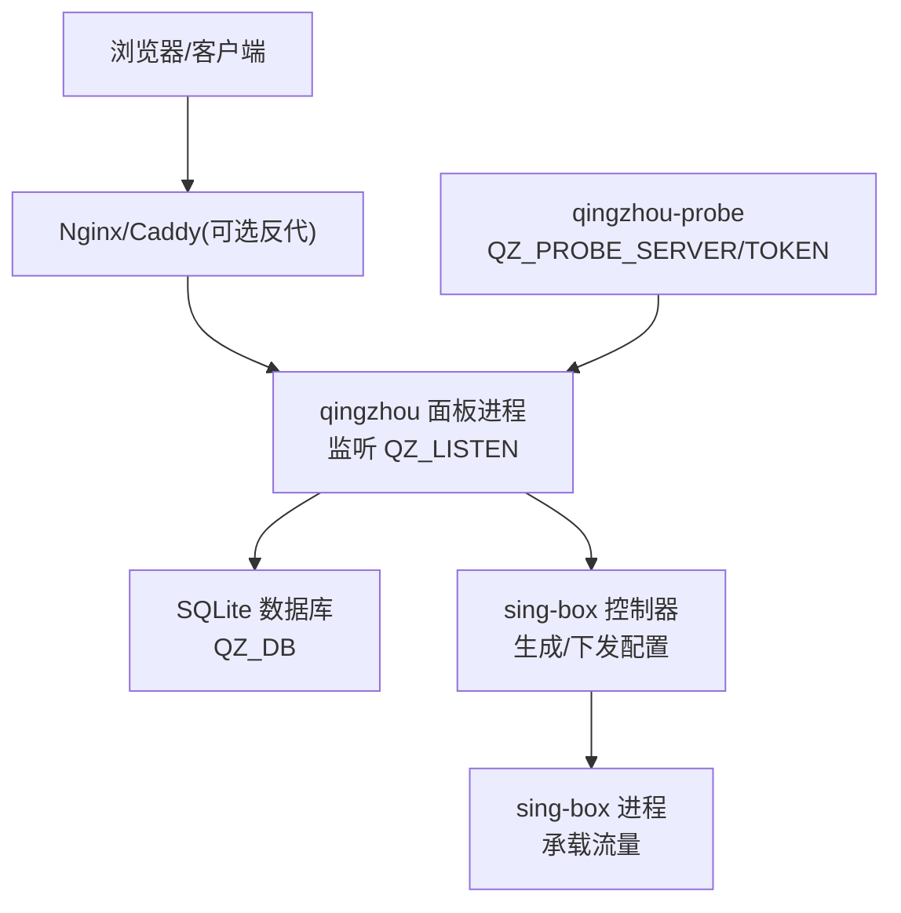
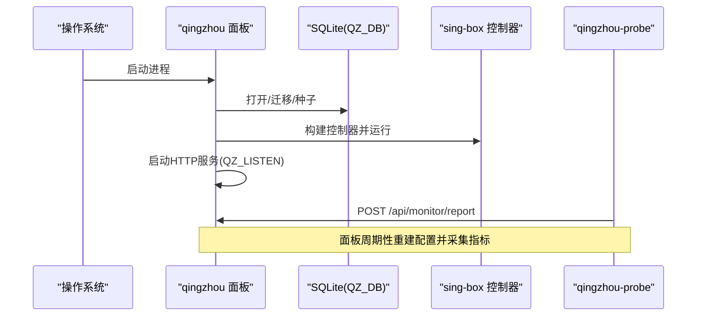

# 环境配置

<cite>
**本文引用的文件**
- [main.go](file://main.go)
- [internal/config/config.go](file://internal/config/config.go)
- [deploy/qingzhou.env.example](file://deploy/qingzhou.env.example)
- [docs/部署与配置手册.md](file://docs/部署与配置手册.md)
- [Dockerfile](file://Dockerfile)
- [docker-compose.yml](file://docker-compose.yml)
- [cmd/probe/main.go](file://cmd/probe/main.go)
- [go.mod](file://go.mod)
- [frontend/package.json](file://frontend/package.json)
</cite>

## 目录
1. [简介](#简介)
2. [项目结构](#项目结构)
3. [核心组件](#核心组件)
4. [架构总览](#架构总览)
5. [详细组件分析](#详细组件分析)
6. [依赖与环境要求](#依赖与环境要求)
7. [环境变量与配置项](#环境变量与配置项)
8. [不同部署场景的配置示例](#不同部署场景的配置示例)
9. [配置文件格式与最佳实践](#配置文件格式与最佳实践)
10. [配置验证方法](#配置验证方法)
11. [常见配置错误排查指南](#常见配置错误排查指南)
12. [性能调优建议](#性能调优建议)
13. [结论](#结论)

## 简介
本文件面向轻舟面板的环境配置，覆盖系统要求、前置依赖、环境变量、不同部署场景（开发/测试/生产）的差异、配置文件格式与安全/性能最佳实践，以及配置验证与排错方法。目标是帮助读者快速、安全、稳定地部署并运行轻舟面板。

## 项目结构
轻舟面板为单二进制 Go 程序，内置前端资源与 SQLite 数据库，负责用户、套餐、订阅、统计与可视化管理；通过 sing-box 承载实际流量。探针用于采集节点主机指标并上报至面板。

图表来源
- [main.go:25-142](file://main.go#L25-L142)
- [docs/部署与配置手册.md:5-10](file://docs/部署与配置手册.md#L5-L10)

章节来源
- [docs/部署与配置手册.md:5-10](file://docs/部署与配置手册.md#L5-L10)
- [main.go:25-142](file://main.go#L25-L142)

## 核心组件
- 面板主进程：加载配置、初始化存储、启动后台任务、提供 HTTP API 与静态前端。
- 存储层：SQLite 数据库，路径由 QZ_DB 指定。
- sing-box 控制器：管理本机或远程 sing-box 的配置与重启，采集 v2ray_api 指标。
- 邮件服务：SMTP 配置可来自环境变量或设置项。
- 探针：独立进程，定时上报 CPU/内存/磁盘/负载等指标。

章节来源
- [main.go:25-142](file://main.go#L25-L142)
- [cmd/probe/main.go:34-92](file://cmd/probe/main.go#L34-L92)

## 架构总览
面板在启动时读取环境变量与设置，打开并迁移数据库，必要时进行种子数据初始化；随后启动 sing-box 控制器、定时任务与 HTTP 服务。探针作为独立进程定期向面板上报指标。

图表来源
- [main.go:25-142](file://main.go#L25-L142)
- [cmd/probe/main.go:75-92](file://cmd/probe/main.go#L75-L92)

## 详细组件分析

### 配置加载与默认值
- 监听地址：默认 0.0.0.0:8081，可通过 QZ_LISTEN 覆盖。
- 数据库路径：默认 qingzhou.db，可通过 QZ_DB 覆盖。
- 管理员账户：默认用户名 mllt992，密码为空时首次启动随机生成并打印日志。
- 敏感密钥：QZ_SECRET_KEY 用于加密落库的敏感配置（如 SMTP 密码、Reality 私钥等），未设置时会回退到 JWT 密钥并给出警告。

章节来源
- [internal/config/config.go:14-28](file://internal/config/config.go#L14-L28)
- [main.go:51-71](file://main.go#L51-L71)

### HTTP 服务与超时
- 使用标准 http.Server，ReadTimeout/WriteTimeout/IdleTimeout 已设定。
- 优雅关闭：等待后台任务完成后再退出。

章节来源
- [main.go:108-142](file://main.go#L108-L142)

### sing-box 控制器
- 支持本地进程管理与远程 SSH 管理。
- 关键参数：
  - QZ_SINGBOX_CONFIG：sing-box 配置文件路径
  - QZ_SINGBOX_UNIT：systemd 单元名
  - QZ_SINGBOX_V2RAY：v2ray_api 监听地址
  - QZ_SINGBOX_STATS_INTERVAL：指标采集间隔
- 自动探测 sing-box 二进制路径，若未找到则依赖 PATH。

章节来源
- [main.go:171-217](file://main.go#L171-L217)

### 邮件服务
- SMTP 配置可从环境变量 QZ_SMTP_* 或设置项获取，优先级：环境变量 > 设置项。
- 未配置时，验证/重置链接将记录到日志而非发送邮件。

章节来源
- [main.go:144-169](file://main.go#L144-L169)

### 探针
- 通过 QZ_PROBE_SERVER 与 QZ_PROBE_TOKEN 配置面板地址与鉴权令牌。
- 支持命令行参数与环境变量两种方式，推荐环境变量以避免命令历史泄露。
- 面板提供探针二进制下载接口，需设置 QZ_PROBE_DIR 指向包含探针二进制的目录。

章节来源
- [cmd/probe/main.go:34-92](file://cmd/probe/main.go#L34-L92)
- [deploy/qingzhou.env.example:15-19](file://deploy/qingzhou.env.example#L15-L19)

## 依赖与环境要求
- 操作系统：Linux（探针仅 Linux）。容器镜像基于 Alpine。
- Go 版本：1.25+（编译期要求）。
- Node.js 版本：20（前端构建阶段需要）。
- 运行时依赖：
  - sing-box：必须启用 with_v2ray_api 以支持流量统计。
  - SQLite：现代c sqlite（无 CGO），嵌入二进制。
  - CA 证书与时区：容器镜像中预装。

章节来源
- [go.mod:3](file://go.mod#L3)
- [Dockerfile:10-18](file://Dockerfile#L10-L18)
- [Dockerfile:36-54](file://Dockerfile#L36-L54)
- [docs/部署与配置手册.md:14-55](file://docs/部署与配置手册.md#L14-L55)

## 环境变量与配置项
以下为常用环境变量及其作用与默认行为说明（按功能分组）：

- 基础运行
  - QZ_LISTEN：面板监听地址与端口，默认 0.0.0.0:8081。
  - QZ_DB：SQLite 数据库路径，默认 qingzhou.db。
  - QZ_PUBLIC_BASE：面板对外访问地址（订阅、探针安装、邮件链接等），优先级高于设置页与 Host。
  - QZ_ADMIN_USER/QZ_ADMIN_PASS：首次运行管理员账号与密码；密码留空会随机生成并打印一次。
  - QZ_SECRET_KEY：加密敏感配置的主密钥，建议设置且置于环境变量，不入库。

- 探针监控
  - QZ_PROBE_DIR：探针二进制所在目录，面板据此提供下载。
  - QZ_PROBE_SERVER/QZ_PROBE_TOKEN：探针连接面板的地址与令牌。

- 在线更新
  - QZ_UPDATE_REPO：检查 GitHub Releases 的仓库名。
  - QZ_UPDATE_GITHUB_TOKEN：GitHub Token（可选，提升匿名速率上限）。

- sing-box 集成
  - QZ_SINGBOX_CONFIG：sing-box 配置文件路径。
  - QZ_SINGBOX_UNIT：systemd 单元名。
  - QZ_SINGBOX_BIN：sing-box 二进制路径（自动探测，也可覆盖）。
  - QZ_SINGBOX_V2RAY：v2ray_api 监听地址。
  - QZ_SINGBOX_STATS_INTERVAL：指标采集间隔。

- 邮件服务
  - QZ_SMTP_HOST/PORT/USER/PASS/FROM/FROM_NAME/SECURITY：SMTP 相关配置。

- 代理信任
  - QZ_TRUSTED_PROXIES：当反代不在本机时，设置其 IP/CIDR，以便正确识别真实客户端 IP。

章节来源
- [deploy/qingzhou.env.example:3-43](file://deploy/qingzhou.env.example#L3-L43)
- [main.go:51-71](file://main.go#L51-L71)
- [main.go:144-217](file://main.go#L144-L217)
- [cmd/probe/main.go:34-92](file://cmd/probe/main.go#L34-L92)
- [docs/部署与配置手册.md:92-131](file://docs/部署与配置手册.md#L92-L131)

## 不同部署场景的配置示例

- 开发环境
  - 目标：快速启动、便于调试。
  - 建议：
    - QZ_LISTEN=127.0.0.1:8081（仅本机访问）
    - QZ_DB=/tmp/qingzhou-dev.db（临时数据库）
    - QZ_ADMIN_USER=admin，QZ_ADMIN_PASS=任意密码（避免随机密码）
    - QZ_WEB_DIR=frontend/dist（开发时从磁盘读取前端）
  - 参考：
    - [docs/部署与配置手册.md:92-131](file://docs/部署与配置手册.md#L92-L131)
    - [frontend/embed.go:3-22](file://frontend/embed.go#L3-L22)

- 测试环境
  - 目标：接近生产但隔离数据与网络。
  - 建议：
    - QZ_LISTEN=0.0.0.0:8081（容器内映射端口）
    - QZ_DB=/data/qingzhou.db（持久化卷）
    - QZ_PUBLIC_BASE=https://test.example.com
    - QZ_SECRET_KEY=<openssl rand -hex 32>
    - QZ_PROBE_DIR=/opt/qingzhou/probe（放置探针二进制）
  - 参考：
    - [docker-compose.yml:17-33](file://docker-compose.yml#L17-L33)
    - [Dockerfile:45-54](file://Dockerfile#L45-L54)

- 生产环境
  - 目标：高可用、安全、可维护。
  - 建议：
    - 使用反向代理（Nginx/Caddy）并设置 QZ_LISTEN=127.0.0.1:8081
    - 设置 QZ_TRUSTED_PROXIES 为反代网段
    - 强制 HTTPS，配置证书（ACME 或自有证书）
    - 设置 QZ_SECRET_KEY，并妥善保管
    - 配置 QZ_PROBE_DIR 并部署探针
    - 备份策略：每日热备 SQLite，保留 7 天
  - 参考：
    - [docs/部署与配置手册.md:92-131](file://docs/部署与配置手册.md#L92-L131)
    - [deploy/qingzhou.env.example:1-43](file://deploy/qingzhou.env.example#L1-L43)

章节来源
- [docker-compose.yml:17-33](file://docker-compose.yml#L17-L33)
- [Dockerfile:45-54](file://Dockerfile#L45-L54)
- [docs/部署与配置手册.md:92-131](file://docs/部署与配置手册.md#L92-L131)

## 配置文件格式与最佳实践
- 配置文件位置：/opt/qingzhou/qingzhou.env（chmod 600，勿提交真实文件）。
- 格式：键值对，每行一个环境变量。
- 优先级：环境变量 > 设置页 > Host/反代头。
- 安全建议：
  - 始终设置 QZ_SECRET_KEY，避免敏感信息随数据库泄露。
  - 使用反向代理并限制监听地址为回环。
  - 谨慎设置 QZ_TRUSTED_PROXIES，仅信任可信网段。
  - 探针令牌通过环境变量注入，避免命令行暴露。
- 性能建议：
  - 调整 QZ_SINGBOX_STATS_INTERVAL 平衡指标精度与开销。
  - 合理设置 HTTP 超时（默认已优化）。
  - 使用 SSD 存储数据库，定期 VACUUM 与备份。

章节来源
- [deploy/qingzhou.env.example:1-43](file://deploy/qingzhou.env.example#L1-L43)
- [main.go:108-142](file://main.go#L108-L142)
- [docs/部署与配置手册.md:92-131](file://docs/部署与配置手册.md#L92-L131)

## 配置验证方法
- 启动验证：
  - 查看日志输出是否包含“listening on http://...”。
  - 访问健康检查端点或首页确认响应。
- 数据库验证：
  - 确认 QZ_DB 指向的文件存在且可写。
  - 首次登录检查管理员账号是否创建成功。
- sing-box 验证：
  - 检查 sing-box 版本是否包含 with_v2ray_api。
  - 确认 v2ray_api 监听地址与 QZ_SINGBOX_V2RAY 一致。
- 探针验证：
  - 确认 QZ_PROBE_DIR 下存在对应架构的探针二进制。
  - 检查面板监控页面是否有指标上报。
- 邮件验证：
  - 发送测试邮件或触发验证码，确认日志或收件箱。

章节来源
- [main.go:116-121](file://main.go#L116-L121)
- [docs/部署与配置手册.md:237-261](file://docs/部署与配置手册.md#L237-L261)
- [cmd/probe/main.go:75-92](file://cmd/probe/main.go#L75-L92)

## 常见配置错误排查指南
- 面板打不开：
  - 检查 QZ_LISTEN 是否为回环地址且未配置反代。
  - 云服务器安全组/防火墙放行端口。
- 探针安装失败：
  - 确认 QZ_PROBE_DIR 指向包含探针二进制的目录。
  - 从发布页下载对应架构探针并放入该目录。
- 统计无数据：
  - 确认 sing-box 版本包含 with_v2ray_api。
  - 检查 QZ_SINGBOX_V2RAY 与配置中的 v2ray_api.listen 一致。
- 证书申请失败：
  - 80 端口被占用时改用 DNS-01 或 webroot 方式。
  - 确认证书路径权限正确。
- 升级后无法启动：
  - 使用“在线更新”页的回滚功能恢复旧版本。

章节来源
- [docs/部署与配置手册.md:237-261](file://docs/部署与配置手册.md#L237-L261)
- [deploy/qingzhou.env.example:15-19](file://deploy/qingzhou.env.example#L15-L19)

## 性能调优建议
- 网络内核调优：
  - 启用 BBR、fq、收发缓冲区、somaxconn、tcp_notsent_lowat、文件句柄上限。
- 指标采集频率：
  - 根据负载调整 QZ_SINGBOX_STATS_INTERVAL，避免过高频率影响性能。
- 数据库维护：
  - 定期备份与 VACUUM，减少 WAL 体积。
- 资源隔离：
  - 使用 systemd 限制 CPU/内存，避免面板与 sing-box 争抢资源。

章节来源
- [docs/部署与配置手册.md:26-33](file://docs/部署与配置手册.md#L26-L33)
- [main.go:209-217](file://main.go#L209-L217)

## 结论
轻舟面板通过简洁的环境变量与设置项实现灵活部署，结合 sing-box 与探针形成完整的流量管理与监控体系。遵循本文的安全与性能最佳实践，可在开发、测试与生产环境中稳定运行。建议在上线前完成配置验证与备份策略，确保业务连续性与数据安全。
