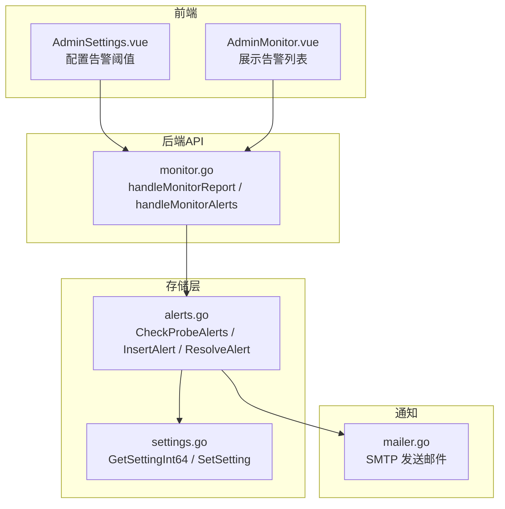
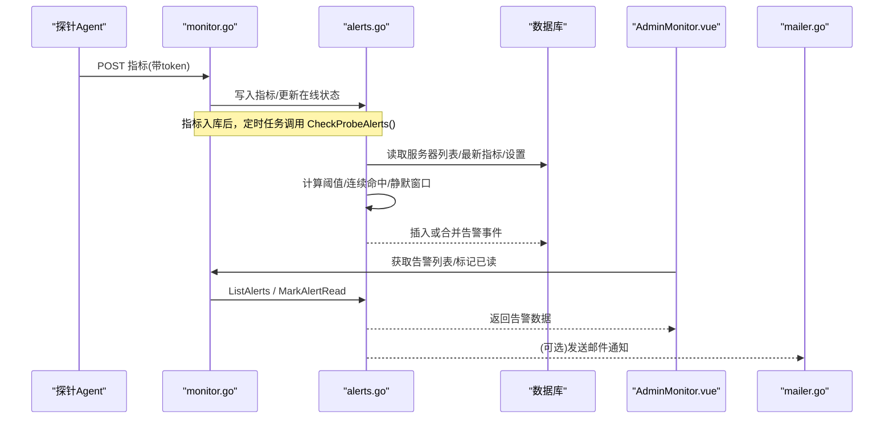
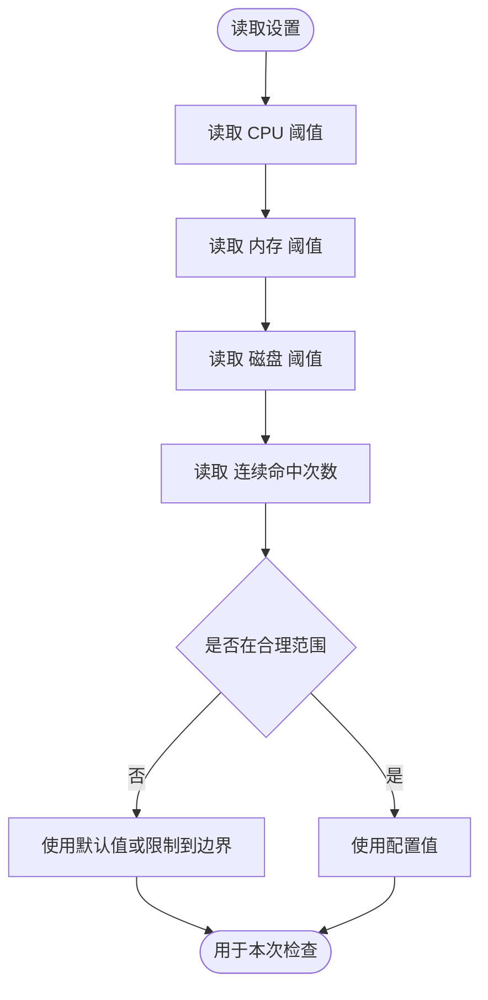
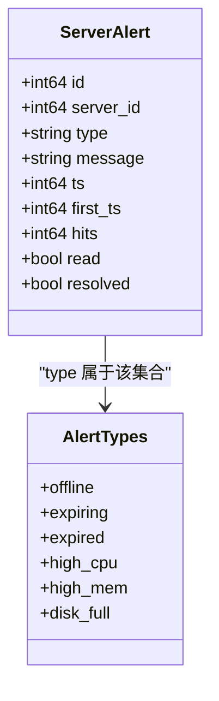
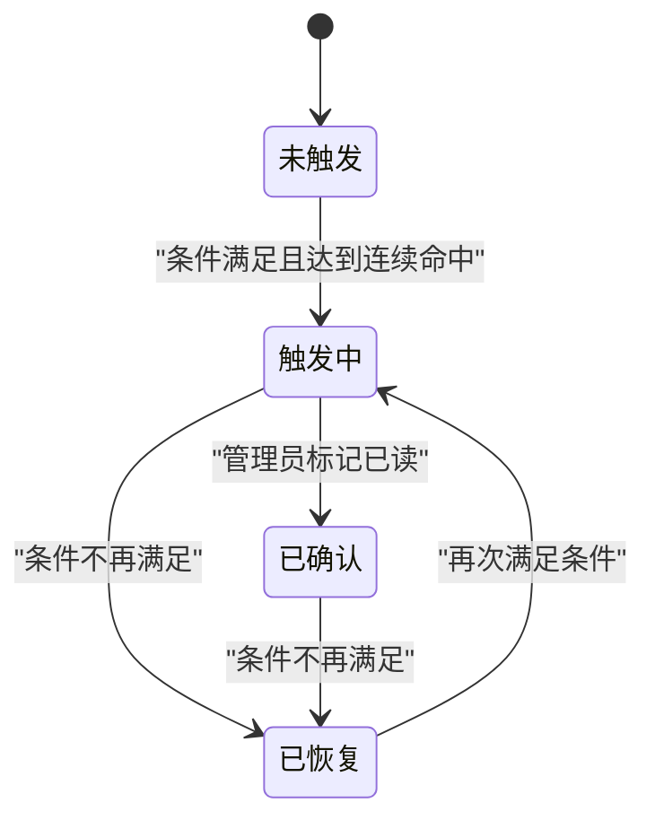
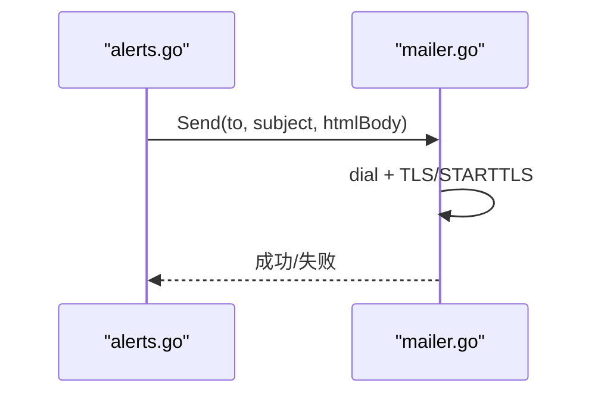
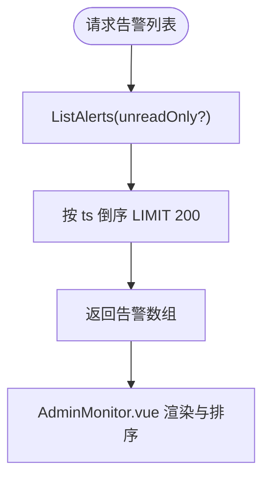
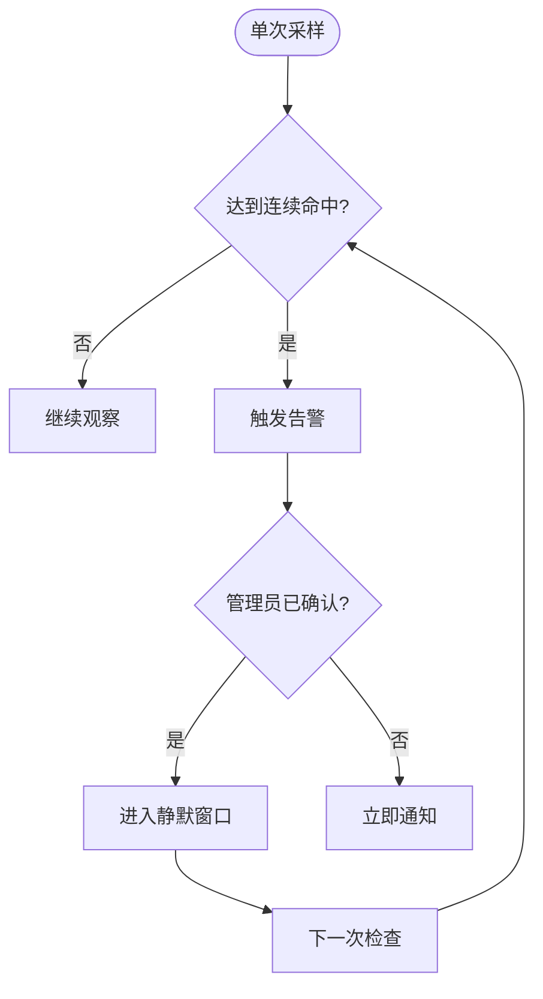
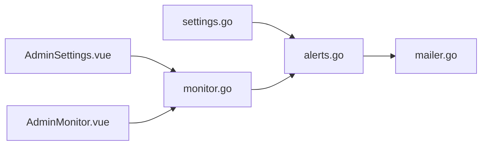

# 告警管理

<cite>
**本文引用的文件**
- [internal/store/alerts.go](file://internal/store/alerts.go)
- [internal/store/alerts_test.go](file://internal/store/alerts_test.go)
- [internal/store/settings.go](file://internal/store/settings.go)
- [internal/api/monitor.go](file://internal/api/monitor.go)
- [frontend/src/views/AdminSettings.vue](file://frontend/src/views/AdminSettings.vue)
- [frontend/src/views/AdminMonitor.vue](file://frontend/src/views/AdminMonitor.vue)
- [internal/mailer/mailer.go](file://internal/mailer/mailer.go)
</cite>

## 目录
1. [简介](#简介)
2. [项目结构](#项目结构)
3. [核心组件](#核心组件)
4. [架构总览](#架构总览)
5. [详细组件分析](#详细组件分析)
6. [依赖关系分析](#依赖关系分析)
7. [性能考虑](#性能考虑)
8. [故障排查指南](#故障排查指南)
9. [结论](#结论)
10. [附录](#附录)

## 简介
本文件面向轻舟面板的“告警管理”子系统，系统性说明：
- 告警规则与阈值配置（CPU、内存、磁盘、离线、到期等）
- 条件判断与级别定义（基于类型与严重度）
- 告警通知机制（邮件通知；Webhook 集成现状与建议）
- 告警生命周期（触发、确认、处理、自动关闭）
- 历史记录查询与分析方法
- 升级策略与静默规则（连续命中次数、确认后的静默窗口）
- 性能优化与故障排查建议

## 项目结构
与告警相关的代码主要分布在以下模块：
- 存储层：告警数据模型、合并与状态机、阈值读取、检查调度入口
- API 层：监控数据上报、告警列表与标记已读、服务器监控设置
- 前端：告警阈值配置界面、告警展示与排序、统计汇总
- 邮件发送：SMTP 客户端封装，支持 SSL/TLS 与 STARTTLS

图表来源
- [internal/api/monitor.go:22-55](file://internal/api/monitor.go#L22-L55)
- [internal/api/monitor.go:362-373](file://internal/api/monitor.go#L362-L373)
- [internal/store/alerts.go:247-356](file://internal/store/alerts.go#L247-L356)
- [internal/store/settings.go:110-120](file://internal/store/settings.go#L110-L120)
- [internal/mailer/mailer.go:42-58](file://internal/mailer/mailer.go#L42-L58)

章节来源
- [internal/api/monitor.go:22-55](file://internal/api/monitor.go#L22-L55)
- [internal/store/alerts.go:247-356](file://internal/store/alerts.go#L247-L356)
- [frontend/src/views/AdminSettings.vue:217-234](file://frontend/src/views/AdminSettings.vue#L217-L234)
- [frontend/src/views/AdminMonitor.vue:211-230](file://frontend/src/views/AdminMonitor.vue#L211-L230)

## 核心组件
- 告警事件模型：以“事件（episode）”为单位聚合同一服务器同一类型的持续异常，避免重复刷屏。包含开始时间、最近观测时间、命中次数、是否已读、是否已自动恢复等字段。
- 阈值与规则：
  - CPU/内存/磁盘使用率超过阈值时触发对应告警
  - 离线判定：最后上报时间超过阈值即视为离线
  - 到期/即将到期：按服务器过期时间计算
- 连续命中（防抖）：对易抖动指标（CPU/内存/磁盘/离线）要求连续多次检查满足条件才真正告警，减少误报
- 静默窗口：管理员确认后，若问题仍未解决，会在固定时间窗口内降低提醒频率
- 自动恢复：当条件不再满足时，自动关闭当前告警事件

章节来源
- [internal/store/alerts.go:10-31](file://internal/store/alerts.go#L10-L31)
- [internal/store/alerts.go:41-49](file://internal/store/alerts.go#L41-L49)
- [internal/store/alerts.go:131-170](file://internal/store/alerts.go#L131-L170)
- [internal/store/alerts.go:247-356](file://internal/store/alerts.go#L247-L356)

## 架构总览
告警系统由“探针上报 → 指标存储 → 定时评估 → 告警写入 → 前端展示/操作 → 可选邮件通知”构成。

图表来源
- [internal/api/monitor.go:22-55](file://internal/api/monitor.go#L22-L55)
- [internal/api/monitor.go:362-373](file://internal/api/monitor.go#L362-L373)
- [internal/store/alerts.go:247-356](file://internal/store/alerts.go#L247-L356)
- [internal/mailer/mailer.go:42-58](file://internal/mailer/mailer.go#L42-L58)

## 详细组件分析

### 告警规则与阈值配置
- 可配置项（通过设置保存，下次检查生效）：
  - CPU 告警阈值（百分比）
  - 内存告警阈值（百分比）
  - 磁盘告警阈值（百分比）
  - 连续命中次数（防抖阈值）
- 默认值与边界：
  - CPU/内存默认 90%，磁盘默认 85%
  - 连续命中次数在 1~10 之间被限制，防止极端配置导致误报或永不告警
- 前端配置入口：
  - 设置页提供输入框与说明，保存后写入后端设置表

图表来源
- [internal/store/alerts.go:263-277](file://internal/store/alerts.go#L263-L277)
- [internal/store/alerts.go:99-112](file://internal/store/alerts.go#L99-L112)
- [frontend/src/views/AdminSettings.vue:217-234](file://frontend/src/views/AdminSettings.vue#L217-L234)

章节来源
- [internal/store/alerts.go:263-277](file://internal/store/alerts.go#L263-L277)
- [internal/store/alerts.go:99-112](file://internal/store/alerts.go#L99-L112)
- [frontend/src/views/AdminSettings.vue:217-234](file://frontend/src/views/AdminSettings.vue#L217-L234)

### 条件判断与告警级别
- 支持的告警类型：
  - offline（离线）
  - expiring（即将到期）
  - expired（已过期）
  - high_cpu（CPU 偏高）
  - high_mem（内存偏高）
  - disk_full（磁盘将满）
- 级别与严重度：
  - 前端根据类型映射为错误/警告两类，并按优先级排序显示
- 条件判定逻辑：
  - 离线：最后上报时间超过阈值（例如 2 分钟）
  - 到期类：根据服务器过期时间与当前时间差计算
  - 资源类：对比最新指标与阈值

图表来源
- [internal/store/alerts.go:10-31](file://internal/store/alerts.go#L10-L31)
- [frontend/src/views/AdminMonitor.vue:217-230](file://frontend/src/views/AdminMonitor.vue#L217-L230)

章节来源
- [internal/store/alerts.go:10-31](file://internal/store/alerts.go#L10-L31)
- [frontend/src/views/AdminMonitor.vue:217-230](file://frontend/src/views/AdminMonitor.vue#L217-L230)

### 告警生命周期管理
- 触发：
  - 检查周期执行 CheckProbeAlerts，依据阈值和最新指标生成或合并告警事件
- 合并与去重：
  - 同一服务器同一类型的未读事件会合并，仅增加命中次数与更新时间
- 确认与静默：
  - 管理员标记已读后，若问题仍存在，将在固定时间窗口内降低提醒频率
- 自动恢复：
  - 当条件不再满足时，自动关闭当前事件，后续再次发生视为新事件

图表来源
- [internal/store/alerts.go:131-170](file://internal/store/alerts.go#L131-L170)
- [internal/store/alerts.go:247-356](file://internal/store/alerts.go#L247-L356)

章节来源
- [internal/store/alerts.go:131-170](file://internal/store/alerts.go#L131-L170)
- [internal/store/alerts.go:247-356](file://internal/store/alerts.go#L247-L356)

### 告警通知机制
- 邮件通知：
  - 通过 SMTP 客户端发送 HTML 邮件，支持隐式 TLS（端口 465）与 STARTTLS（端口 587/25）
  - 连接与对话阶段均设置超时，避免阻塞
- Webhook 集成：
  - 当前代码库未发现内置 Webhook 实现；如需扩展，可在 CheckProbeAlerts 或告警写入后增加回调钩子
- 通知渠道配置：
  - 邮件相关配置通过设置项管理（如 SMTP 主机、端口、认证等），并在设置页提供测试发送能力

图表来源
- [internal/mailer/mailer.go:42-58](file://internal/mailer/mailer.go#L42-L58)
- [internal/mailer/mailer.go:60-111](file://internal/mailer/mailer.go#L60-L111)

章节来源
- [internal/mailer/mailer.go:42-58](file://internal/mailer/mailer.go#L42-L58)
- [internal/mailer/mailer.go:60-111](file://internal/mailer/mailer.go#L60-L111)

### 告警历史记录的查询与分析
- 查询接口：
  - 支持获取全部或未读告警列表，按最近观测时间倒序，限制条数
- 分析维度：
  - 按服务器与类型分组查看事件持续时间、命中次数
  - 结合监控热力图与迷你曲线进行趋势分析
- 前端展示：
  - 告警列表按严重度排序，支持折叠与预览数量控制

图表来源
- [internal/api/monitor.go:362-373](file://internal/api/monitor.go#L362-L373)
- [internal/store/alerts.go:172-193](file://internal/store/alerts.go#L172-L193)
- [frontend/src/views/AdminMonitor.vue:211-230](file://frontend/src/views/AdminMonitor.vue#L211-L230)

章节来源
- [internal/api/monitor.go:362-373](file://internal/api/monitor.go#L362-L373)
- [internal/store/alerts.go:172-193](file://internal/store/alerts.go#L172-L193)
- [frontend/src/views/AdminMonitor.vue:211-230](file://frontend/src/views/AdminMonitor.vue#L211-L230)

### 升级策略与静默规则
- 连续命中（防抖）：
  - 针对易抖动指标（CPU/内存/磁盘/离线），需连续 N 次检查满足条件才触发告警
  - 配置项 alert_consecutive 取值范围 1~10，默认 2
- 确认后的静默窗口：
  - 管理员标记已读后，若问题仍未解决，会在 24 小时内降低提醒频率，避免频繁打扰
- 升级策略建议：
  - 可将高优先级（如离线、已过期）设置为较低连续命中阈值，快速暴露问题
  - 将低优先级（如 CPU 短时峰值）提高连续命中阈值，减少噪音

图表来源
- [internal/store/alerts.go:41-49](file://internal/store/alerts.go#L41-L49)
- [internal/store/alerts.go:99-112](file://internal/store/alerts.go#L99-L112)
- [internal/store/alerts.go:131-170](file://internal/store/alerts.go#L131-L170)

章节来源
- [internal/store/alerts.go:41-49](file://internal/store/alerts.go#L41-L49)
- [internal/store/alerts.go:99-112](file://internal/store/alerts.go#L99-L112)
- [internal/store/alerts.go:131-170](file://internal/store/alerts.go#L131-L170)

## 依赖关系分析
- 存储层依赖：
  - settings.go：读取/写入阈值与连续命中次数
  - alerts.go：核心告警逻辑（评估、合并、恢复）
- API 层依赖：
  - monitor.go：接收探针指标、提供告警列表与标记已读接口
- 通知层依赖：
  - mailer.go：SMTP 邮件发送
- 前端依赖：
  - AdminSettings.vue：阈值配置与保存
  - AdminMonitor.vue：告警展示与排序

图表来源
- [internal/store/settings.go:110-120](file://internal/store/settings.go#L110-L120)
- [internal/store/alerts.go:247-356](file://internal/store/alerts.go#L247-L356)
- [internal/api/monitor.go:22-55](file://internal/api/monitor.go#L22-L55)
- [internal/mailer/mailer.go:42-58](file://internal/mailer/mailer.go#L42-L58)
- [frontend/src/views/AdminSettings.vue:217-234](file://frontend/src/views/AdminSettings.vue#L217-L234)
- [frontend/src/views/AdminMonitor.vue:211-230](file://frontend/src/views/AdminMonitor.vue#L211-L230)

章节来源
- [internal/store/settings.go:110-120](file://internal/store/settings.go#L110-L120)
- [internal/store/alerts.go:247-356](file://internal/store/alerts.go#L247-L356)
- [internal/api/monitor.go:22-55](file://internal/api/monitor.go#L22-L55)
- [internal/mailer/mailer.go:42-58](file://internal/mailer/mailer.go#L42-L58)
- [frontend/src/views/AdminSettings.vue:217-234](file://frontend/src/views/AdminSettings.vue#L217-L234)
- [frontend/src/views/AdminMonitor.vue:211-230](file://frontend/src/views/AdminMonitor.vue#L211-L230)

## 性能考虑
- 指标聚合与合并：
  - 同一服务器同一类型的未读事件合并，避免大量重复记录
- 连续命中计数：
  - 使用内存计数器，仅在进程运行期间有效，重启后从 0 开始，避免每次检查写库
- 查询限制：
  - 告警列表限制返回条数，减少前端渲染压力
- 邮件发送超时：
  - SMTP 连接与对话设置超时，避免阻塞请求 goroutine
- 建议：
  - 合理设置连续命中次数，平衡及时性与噪音
  - 定期清理历史告警或归档，避免数据库膨胀

章节来源
- [internal/store/alerts.go:51-83](file://internal/store/alerts.go#L51-L83)
- [internal/store/alerts.go:172-193](file://internal/store/alerts.go#L172-L193)
- [internal/mailer/mailer.go:15-20](file://internal/mailer/mailer.go#L15-L20)

## 故障排查指南
- 探针无法上报：
  - 检查 token 是否正确、探针服务是否运行、网络连通性
- 告警不触发：
  - 检查阈值设置是否过高、连续命中次数是否过大、指标是否新鲜
- 告警过多：
  - 适当提高连续命中次数，或调整阈值
- 邮件发送失败：
  - 检查 SMTP 配置（主机、端口、加密方式）、网络可达性、认证信息
- 历史告警堆积：
  - 使用迁移脚本折叠旧记录，或手动清理无效条目

章节来源
- [internal/api/monitor.go:22-55](file://internal/api/monitor.go#L22-L55)
- [internal/store/alerts.go:247-356](file://internal/store/alerts.go#L247-L356)
- [internal/mailer/mailer.go:42-58](file://internal/mailer/mailer.go#L42-L58)

## 结论
轻舟面板的告警系统通过“阈值+连续命中+静默窗口”的组合，实现了稳定可靠的异常检测与提醒。其设计注重减少误报与噪音，同时保证关键问题能快速暴露。邮件通知提供了基础的外部触达能力，未来可扩展 Webhook 以满足更多集成场景。通过合理的阈值与静默配置，可以在及时性与管理体验之间取得良好平衡。

## 附录
- 常用设置键：
  - alert_cpu_threshold：CPU 告警阈值
  - alert_mem_threshold：内存告警阈值
  - alert_disk_threshold：磁盘告警阈值
  - alert_consecutive：连续命中次数
- 前端路径参考：
  - 设置页：AdminSettings.vue
  - 监控页：AdminMonitor.vue

章节来源
- [frontend/src/views/AdminSettings.vue:217-234](file://frontend/src/views/AdminSettings.vue#L217-L234)
- [frontend/src/views/AdminMonitor.vue:211-230](file://frontend/src/views/AdminMonitor.vue#L211-L230)
