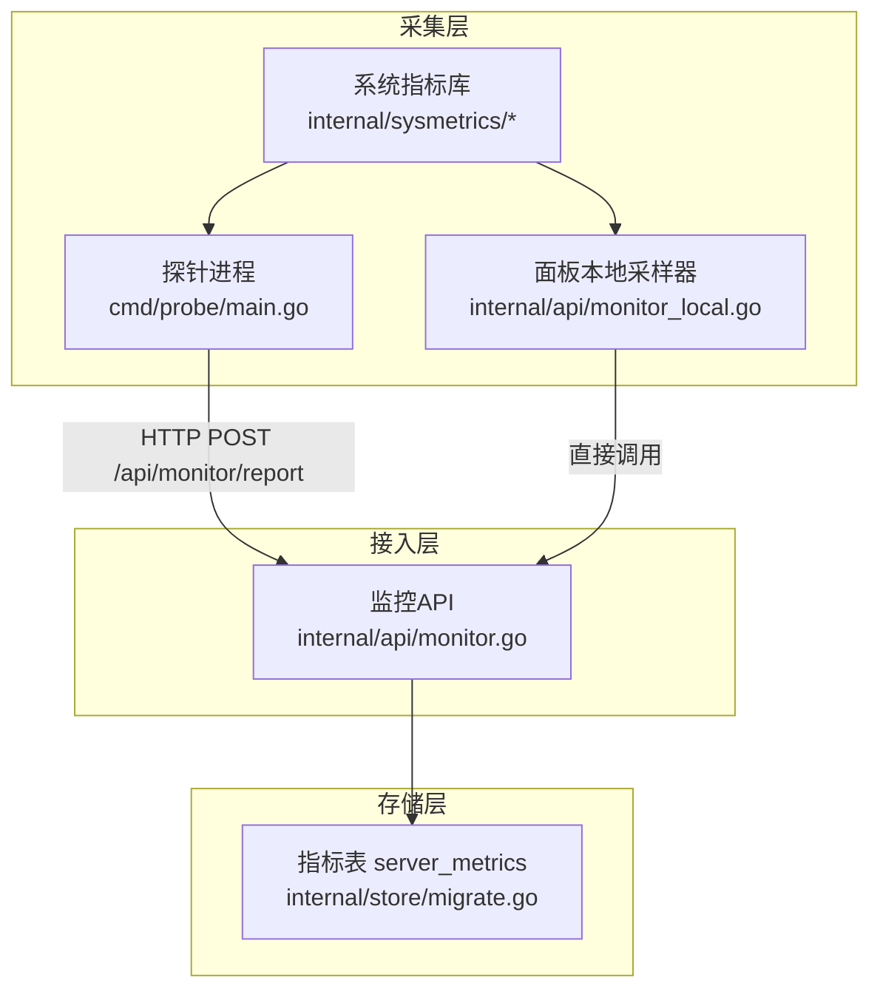
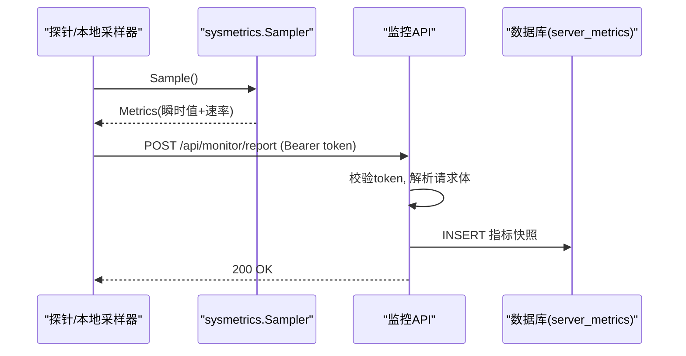
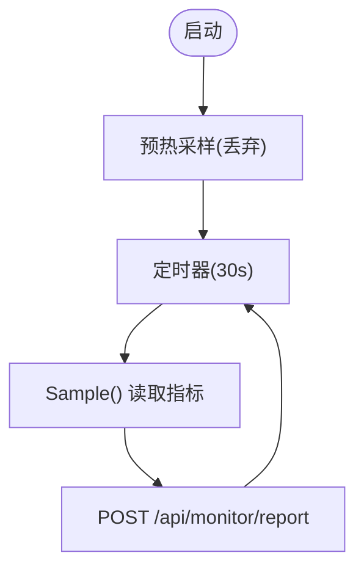
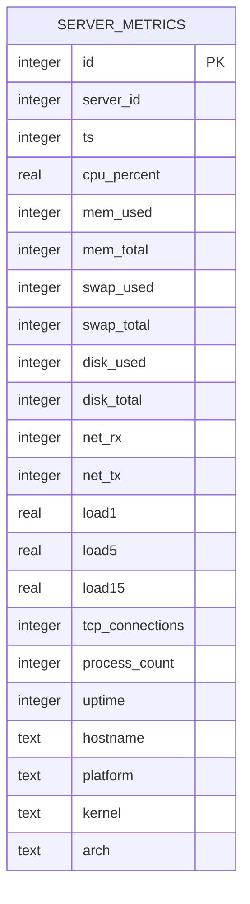
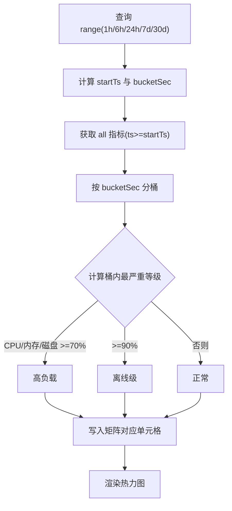
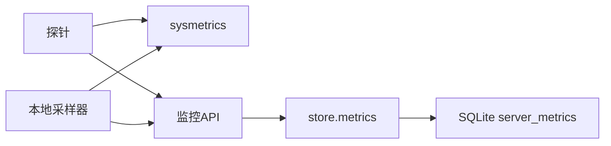

# 指标采集

<cite>
**本文引用的文件**
- [sysmetrics.go](file://internal/sysmetrics/sysmetrics.go)
- [sysmetrics_linux.go](file://internal/sysmetrics/sysmetrics_linux.go)
- [monitor.go](file://internal/api/monitor.go)
- [monitor_local.go](file://internal/api/monitor_local.go)
- [metrics.go](file://internal/store/metrics.go)
- [migrate.go](file://internal/store/migrate.go)
- [main.go](file://cmd/probe/main.go)
- [config.go](file://internal/config/config.go)
</cite>

## 目录
1. [简介](#简介)
2. [项目结构](#项目结构)
3. [核心组件](#核心组件)
4. [架构总览](#架构总览)
5. [详细组件分析](#详细组件分析)
6. [依赖关系分析](#依赖关系分析)
7. [性能考量](#性能考量)
8. [故障排查指南](#故障排查指南)
9. [结论](#结论)
10. [附录](#附录)

## 简介
本文件面向轻舟面板的“指标采集”子系统，系统性说明：
- 支持的系统指标类型与采集方式
- 采集频率、存储格式与数据生命周期管理
- 指标聚合算法与时间窗口处理机制
- 指标查询 API 的使用方法、前端可视化方案与自定义扩展方法
- 对系统性能的影响分析与优化策略

## 项目结构
指标采集由三部分构成：
- 采集层：探针（独立进程）或面板本地采样器，读取 /proc 等内核接口得到原始指标
- 接入层：HTTP 接收探针上报并校验认证，写入指标表；同时提供查询与可视化接口
- 存储层：SQLite 时序表 server_metrics，配合索引与定期清理实现滚动窗口

**图表来源**
- [main.go:1-119](file://cmd/probe/main.go#L1-L119)
- [monitor_local.go:34-70](file://internal/api/monitor_local.go#L34-L70)
- [sysmetrics_linux.go:20-65](file://internal/sysmetrics/sysmetrics_linux.go#L20-L65)
- [monitor.go:20-55](file://internal/api/monitor.go#L20-L55)
- [migrate.go:466-498](file://internal/store/migrate.go#L466-L498)

**章节来源**
- [main.go:1-119](file://cmd/probe/main.go#L1-L119)
- [monitor_local.go:1-131](file://internal/api/monitor_local.go#L1-L131)
- [sysmetrics_linux.go:1-338](file://internal/sysmetrics/sysmetrics_linux.go#L1-L338)
- [monitor.go:1-920](file://internal/api/monitor.go#L1-L920)
- [migrate.go:466-498](file://internal/store/migrate.go#L466-L498)

## 核心组件
- 系统指标库 sysmetrics：跨平台抽象 + Linux 具体实现，负责从 /proc 读取 CPU、内存、磁盘、网络、负载、连接数、进程数、运行时长、主机信息等，并计算 CPU 使用率与网络速率
- 探针进程 probe：定时采集并通过 HTTP 上报到面板
- 面板本地采样器：在面板自身运行环境中以固定间隔采集本机指标
- 监控 API：接收上报、鉴权、落库，并提供仪表盘、热力图、折线图等查询接口
- 存储层 metrics：指标模型、写入、查询、裁剪与聚合辅助

**章节来源**
- [sysmetrics.go:16-38](file://internal/sysmetrics/sysmetrics.go#L16-L38)
- [sysmetrics_linux.go:20-65](file://internal/sysmetrics/sysmetrics_linux.go#L20-L65)
- [main.go:27-91](file://cmd/probe/main.go#L27-L91)
- [monitor_local.go:22-70](file://internal/api/monitor_local.go#L22-L70)
- [monitor.go:20-55](file://internal/api/monitor.go#L20-L55)
- [metrics.go:9-33](file://internal/store/metrics.go#L9-L33)

## 架构总览

**图表来源**
- [main.go:75-91](file://cmd/probe/main.go#L75-L91)
- [monitor.go:20-55](file://internal/api/monitor.go#L20-L55)
- [metrics.go:88-104](file://internal/store/metrics.go#L88-L104)

## 详细组件分析

### 支持的指标类型与采集方式
- CPU 使用率：基于 /proc/stat 的 tick 计数差值计算，避免单点抖动
- 内存占用：从 /proc/meminfo 计算 MemUsed/MemTotal，SwapUsed/SwapTotal
- 磁盘空间：汇总所有真实块设备挂载的使用量，排除伪文件系统
- 网络流量：按物理网卡累加 rx/tx，计算每秒速率
- 系统负载：/proc/loadavg 的 1/5/15 分钟均值
- TCP 连接数：统计 /proc/net/tcp 与 tcp6 中 ESTABLISHED 状态
- 进程数：统计 /proc 下数字目录数量
- 运行时长与系统信息：uptime、hostname、platform、kernel、arch

这些指标统一封装为 Metrics 结构，JSON 标签与存储模型一致，便于探针与面板共享语义。

**章节来源**
- [sysmetrics.go:16-38](file://internal/sysmetrics/sysmetrics.go#L16-L38)
- [sysmetrics_linux.go:67-338](file://internal/sysmetrics/sysmetrics_linux.go#L67-L338)

### 采集频率与调度
- 探针默认每 30 秒采集一次，可通过命令行参数 interval 调整（最小 5 秒）
- 面板本地采样器固定 30 秒采集一次，保证与探针一致的分辨率
- 首次采样会丢弃（因为 CPU/网络速率需要两次样本），避免首点异常

**图表来源**
- [main.go:52-91](file://cmd/probe/main.go#L52-L91)
- [monitor_local.go:22-70](file://internal/api/monitor_local.go#L22-L70)

**章节来源**
- [main.go:27-91](file://cmd/probe/main.go#L27-L91)
- [monitor_local.go:22-70](file://internal/api/monitor_local.go#L22-L70)

### 存储格式与数据生命周期
- 存储表 server_metrics：包含服务器标识、时间戳、CPU/内存/磁盘/网络/负载/连接/进程/运行时长/系统信息等字段
- 写入时进行数值钳制（clamp），拒绝负值或越界值，防止恶意或异常探针污染聚合结果
- 索引设计：
  - (server_id, ts) 复合索引用于按服务器和时间范围查询
  - ts 独立索引用于全局时间过滤（如清理与热力图聚合）
- 生命周期：通过 PruneMetrics 删除早于 keepDays 的数据，形成滚动窗口（默认 30 天）

**图表来源**
- [migrate.go:466-498](file://internal/store/migrate.go#L466-L498)

**章节来源**
- [metrics.go:9-33](file://internal/store/metrics.go#L9-L33)
- [metrics.go:52-104](file://internal/store/metrics.go#L52-L104)
- [metrics.go:160-165](file://internal/store/metrics.go#L160-L165)
- [migrate.go:466-498](file://internal/store/migrate.go#L466-L498)

### 指标聚合算法与时间窗口
- 单服务器历史查询：ListMetrics 返回指定时间窗口内的指标序列，限制最大行数（5000）以避免大响应
- 公共迷你折线图：按固定点数（32）将历史数据分桶，计算每个桶内 CPU/上行/下行平均值
- 可用性热力图：
  - 将时间轴划分为固定列数（48 列），按 bucketSec 分桶
  - 每行代表一台服务器，每格记录该桶内最严重的负载等级（正常/高负载/离线级）
  - 阈值：CPU/内存/磁盘任一超过 70% 标记高负载，超过 90% 标记离线级
  - 无数据格子最终显示为红色（离线/无数据）

**图表来源**
- [monitor.go:541-647](file://internal/api/monitor.go#L541-L647)

**章节来源**
- [monitor.go:323-360](file://internal/api/monitor.go#L323-L360)
- [monitor.go:430-526](file://internal/api/monitor.go#L430-L526)
- [monitor.go:541-647](file://internal/api/monitor.go#L541-L647)
- [metrics.go:136-193](file://internal/store/metrics.go#L136-L193)

### 指标查询 API 使用方法
- 探针上报：POST /api/monitor/report，Header 携带 Authorization: Bearer <probe_token>，Body 为指标 JSON
- 服务器列表与最新指标：GET /api/admin/monitor/servers
- 单服务器历史指标：GET /api/admin/monitor/servers/{id}/metrics?range=1h|6h|24h|7d|30d
- 仪表盘概览：GET /api/admin/monitor/dashboard
- 可用性热力图：GET /api/admin/monitor/heatmap?range=...
- 公开迷你折线图：GET /api/monitor/public/sparklines?range=...
- 公开热力图：GET /api/monitor/public/heatmap?range=...

注意：公开接口无需认证，仅展示允许公开的服务器与脱敏数据。

**章节来源**
- [monitor.go:20-55](file://internal/api/monitor.go#L20-L55)
- [monitor.go:183-241](file://internal/api/monitor.go#L183-L241)
- [monitor.go:323-360](file://internal/api/monitor.go#L323-L360)
- [monitor.go:375-428](file://internal/api/monitor.go#L375-L428)
- [monitor.go:430-526](file://internal/api/monitor.go#L430-L526)

### 可视化展示方案
- 仪表盘卡片：CPU、内存、磁盘百分比，带颜色分级（绿/黄/红）
- 趋势折线图：单服务器多系列（CPU/内存/网络）随时间变化
- 热力图：服务器×时间桶矩阵，直观呈现可用性波动
- 迷你折线图：公开页面展示各服务器的 CPU/上下行趋势缩略图

前端通过 ECharts 等图表库渲染后端返回的结构化数据。

[本节为概念性说明，不直接分析具体文件]

### 自定义指标扩展方法
- 在 sysmetrics.Metrics 中添加新字段（保持 JSON 标签与 store.ServerMetrics 同步）
- 在 Linux 实现中新增读取逻辑（例如新增 /proc 或 sysfs 解析）
- 在 store.migrate.go 中为新字段添加列与索引（如需）
- 在 API 层暴露新的查询或聚合端点（可选）
- 在前端增加对应的可视化组件

建议遵循现有模式：先定义数据结构，再实现采集，最后持久化与查询。

**章节来源**
- [sysmetrics.go:16-38](file://internal/sysmetrics/sysmetrics.go#L16-L38)
- [sysmetrics_linux.go:20-65](file://internal/sysmetrics/sysmetrics_linux.go#L20-L65)
- [metrics.go:9-33](file://internal/store/metrics.go#L9-L33)
- [migrate.go:466-498](file://internal/store/migrate.go#L466-L498)

## 依赖关系分析
- 探针依赖 sysmetrics 采集指标，并通过 HTTP 上报到面板
- 面板本地采样器同样依赖 sysmetrics，但直接调用而非走网络
- API 层依赖 store 进行指标写入与查询
- 存储层依赖 SQLite，具备必要的索引以支撑高频查询与清理

**图表来源**
- [main.go:75-91](file://cmd/probe/main.go#L75-L91)
- [monitor_local.go:34-70](file://internal/api/monitor_local.go#L34-L70)
- [monitor.go:20-55](file://internal/api/monitor.go#L20-L55)
- [metrics.go:88-104](file://internal/store/metrics.go#L88-L104)

**章节来源**
- [main.go:75-91](file://cmd/probe/main.go#L75-L91)
- [monitor_local.go:34-70](file://internal/api/monitor_local.go#L34-L70)
- [monitor.go:20-55](file://internal/api/monitor.go#L20-L55)
- [metrics.go:88-104](file://internal/store/metrics.go#L88-L104)

## 性能考量
- 采集开销
  - CPU 使用率与网络速率基于差值计算，需维护上一份样本，避免重复打开文件导致的额外开销
  - 首次采样丢弃，避免报告“空闲”假象
- 写入与查询
  - 写入前 clamp 确保数值合理，减少后续聚合异常
  - 查询限制最大行数（5000），防止长时窗高频率导致响应过大
  - 热力图聚合限制最大行数（200000），避免匿名接口被滥用造成资源耗尽
- 存储清理
  - 定期删除过期指标，维持滚动窗口，控制数据库体积
- 前端渲染
  - 使用固定点数（32）与固定列数（48）的分桶聚合，降低前端渲染压力

优化建议：
- 根据部署规模调整探针采集间隔（不低于 5 秒）
- 合理设置保留天数（默认 30 天），平衡历史可追溯性与存储成本
- 在高并发场景下关注 ListAllMetricsSince 的热度，必要时引入缓存或预聚合

[本节提供通用指导，不直接分析具体文件]

## 故障排查指南
- 探针无法上报
  - 检查 Authorization 头是否携带有效 token
  - 确认面板已启用探针并生成 token
  - 查看探针日志中的 HTTP 错误码
- 指标异常
  - 检查探针所在机器的 /proc 可读性
  - 确认数值已被 clamp（负值会被修正）
  - 核对磁盘/内存/网络读取逻辑是否遇到伪文件系统或虚拟接口
- 查询缓慢
  - 检查 server_metrics 表的索引是否存在
  - 缩短查询范围或使用分桶聚合接口
  - 评估是否需要提高数据库性能或引入缓存

**章节来源**
- [monitor.go:20-55](file://internal/api/monitor.go#L20-L55)
- [metrics.go:52-86](file://internal/store/metrics.go#L52-L86)
- [sysmetrics_linux.go:139-198](file://internal/sysmetrics/sysmetrics_linux.go#L139-L198)

## 结论
轻舟面板的指标采集系统采用“探针/本地采样 + 统一 API + 时序存储”的清晰分层架构，支持主流系统指标，具备合理的采集频率、严格的数值校验、高效的聚合与可视化能力，并通过索引与清理机制保障长期运行的稳定性与性能。通过本文档，读者可以了解如何扩展指标、优化性能与排查常见问题。

[本节为总结性内容，不直接分析具体文件]

## 附录

### 配置与环境变量
- 面板监听地址、数据库路径、管理员账号等通过环境变量配置
- 探针支持通过命令行参数或环境变量配置服务端地址与 token，以及采集间隔

**章节来源**
- [config.go:5-29](file://internal/config/config.go#L5-L29)
- [main.go:27-55](file://cmd/probe/main.go#L27-L55)
